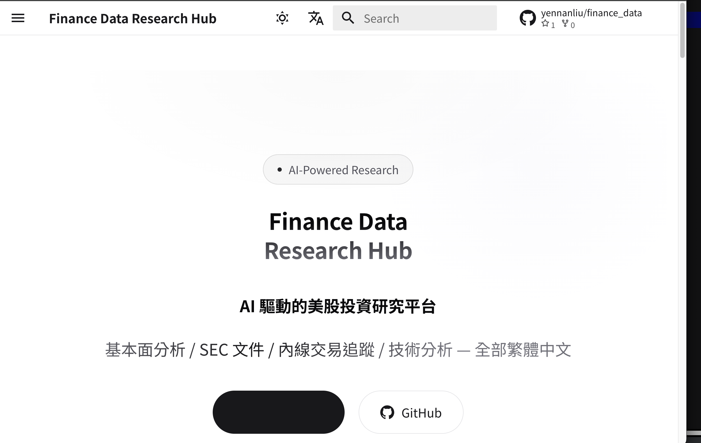
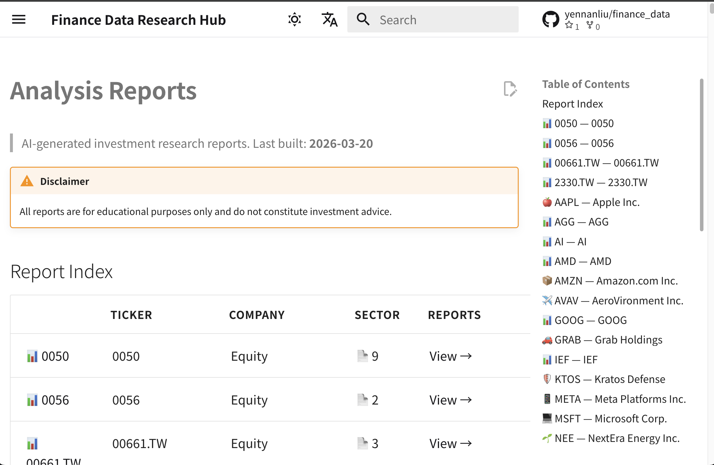
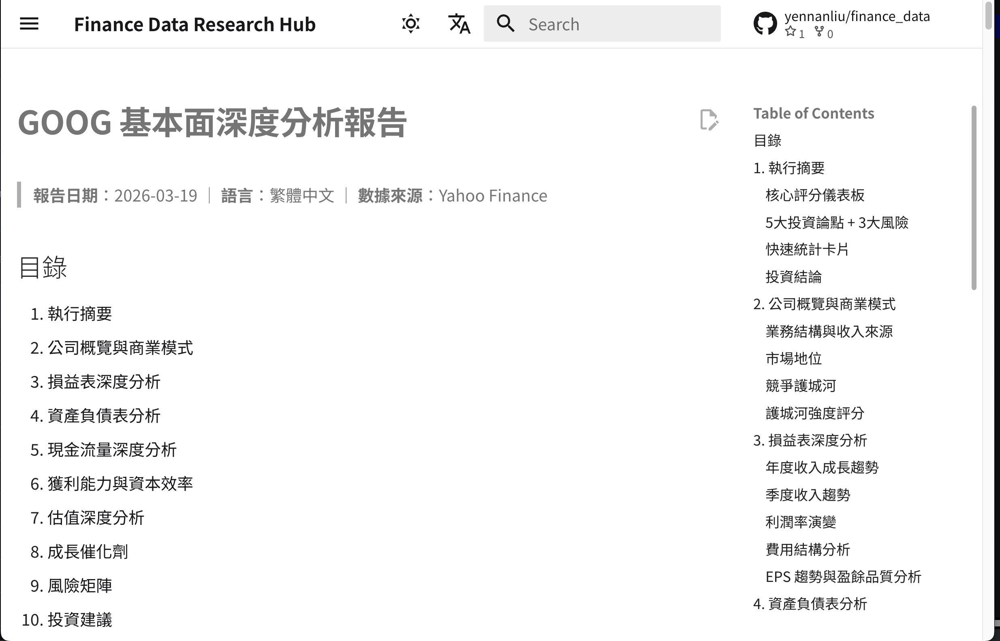

# Finance Data Research Hub

> AI 驅動的美股投資研究平台 — 基本面分析、SEC 文件、內線交易追蹤、技術分析，全部繁體中文。

<p align="center">
  
</p>

<p align="center">
  
  
</p>

**Live Site:** [yennanliu.github.io/finance_data](https://yennanliu.github.io/finance_data/)

---

## What Is This

A research platform that combines **SEC filings**, **AI-generated analysis**, and **automated pipelines** to produce investment research reports for US equities — all in Traditional Chinese.

### What It Has

| Category | Description | Location |
|----------|-------------|----------|
| Analysis Reports | AI-generated fundamental analysis, insider trading reports, technical analysis | `ai_gen_report/stock/` |
| Market News | Daily AI-curated market news per ticker | `ai_gen_report/market_news/` |
| SEC Filings | 10-K, 10-Q, 13-F, 6-K filings for 30+ companies | `10-k/`, `10-q/`, `13-f/`, `6-k/` |
| AI Research Notes | Deep-dive notebooks via NotebookLM (defense, autonomous systems, energy) | `notebook_llm/` |
| Investor Day Materials | Presentation decks and transcripts | `investor_day/` |
| Automation Scripts | SEC EDGAR downloaders, AI analysis generator, docs builder | `scripts/` |

### Coverage

**Analysis Reports:** AAPL, MSFT, NVDA, TSLA, PLTR, ONDS, GOOG, TSM, META, AMZN, and more

**SEC 10-K Filings:** 30+ companies across tech, defense, energy, and financials

**AI Research Notes:** ONDS, RKLB, AVAV, RCAT, TSLA, NEE, AMZN

---

## How It Works

```
┌─────────────┐     ┌──────────────┐     ┌────────────────┐     ┌──────────────┐
│  Data Fetch  │────▶│  AI Analysis  │────▶│  Auto Deploy   │────▶│  Browse Site  │
│  yfinance    │     │  Claude AI    │     │  GitHub Actions │     │  GitHub Pages │
│  SEC EDGAR   │     │  繁體中文報告  │     │  Daily CI/CD   │     │  MkDocs       │
└─────────────┘     └──────────────┘     └────────────────┘     └──────────────┘
```

1. **Data Fetch** — `yfinance` API pulls live financial data; scripts download filings from SEC EDGAR
2. **AI Analysis** — `scripts/generate_analysis.py` sends data to Claude AI, which produces structured Markdown reports with ASCII charts
3. **Auto Deploy** — GitHub Actions runs analysis daily (10:00 AM Taipei time) and deploys via `mkdocs build`
4. **Browse Site** — Reports published at [yennanliu.github.io/finance_data](https://yennanliu.github.io/finance_data/) with search, dark/light mode, and category navigation

---

## Quick Start

### Generate an analysis report locally

```bash
pip install anthropic yfinance

# Set your API key
export ANTHROPIC_API_KEY="sk-..."

# Generate a fundamental analysis for AAPL
python3 scripts/generate_analysis.py AAPL
```

Output saved to `ai_gen_report/stock/aapl/fundamental_analysis_YYYY-MM-DD.md`

### Download SEC filings

```bash
pip install requests

# Download 5 most recent 10-K reports for Apple
python3 scripts/download_10k.py AAPL

# Download for multiple companies
python3 scripts/download_10k.py AAPL MSFT TSLA

# Download 10-K PDFs
python3 scripts/download_10k_pdf.py meta-platforms-inc
```

### Build the docs site locally

```bash
pip install mkdocs-material mkdocs-awesome-pages-plugin mkdocs-minify-plugin

python3 scripts/build_docs.py
mkdocs serve
```

---

## Directory Structure

```
finance_data/
├── ai_gen_report/
│   ├── stock/        # AI-generated analysis reports (Markdown)
│   └── market_news/  # Daily AI-curated market news
├── notebook_llm/     # NotebookLM deep research notes
├── 10-k/             # SEC 10-K annual reports (PDF)
├── 10-q/             # SEC 10-Q quarterly reports
├── 13-f/             # SEC 13-F institutional holdings
├── 6-k/              # SEC 6-K foreign issuer reports
├── investor_day/     # Investor day presentations
├── scripts/          # Automation tools
│   ├── generate_analysis.py   # AI analysis generator
│   ├── build_docs.py          # MkDocs content builder
│   ├── download_10k.py        # SEC EDGAR downloader
│   └── download_10k_pdf.py    # PDF downloader
├── docs/             # MkDocs source (auto-generated)
├── .github/workflows/
│   ├── deploy.yml             # Build & deploy GitHub Pages
│   ├── daily_analysis.yml     # Daily AI analysis cron
│   └── daily_market_news.yml  # Daily market news cron
└── mkdocs.yml        # MkDocs Material configuration
```

---

## CI/CD Pipelines

| Workflow | Schedule | What It Does |
|----------|----------|-------------|
| `daily_analysis.yml` | 02:00 UTC daily | Generates AI analysis for configured tickers, commits to repo |
| `daily_market_news.yml` | Daily (staggered) | Fetches market news per ticker |
| `deploy.yml` | On push + 01:10 UTC | Builds docs and deploys to GitHub Pages |

---

## Data Sources

- **Financial Data:** [Yahoo Finance](https://finance.yahoo.com/) via yfinance (no API key needed)
- **SEC Filings:** [SEC EDGAR](https://www.sec.gov/cgi-bin/browse-edgar)
- **AI Analysis:** [Claude AI](https://www.anthropic.com/) by Anthropic
- **Annual Reports:** [annualreports.com](https://www.annualreports.com/)

---

## Disclaimer

All analysis is for **educational and research purposes only**. Nothing on this site or in this repository constitutes investment advice. Invest at your own risk.
