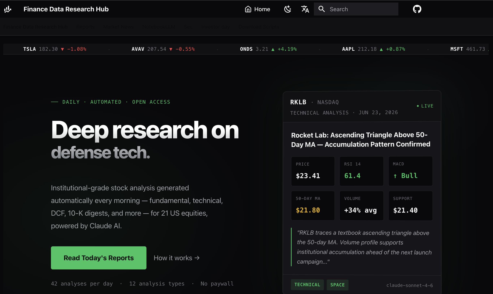
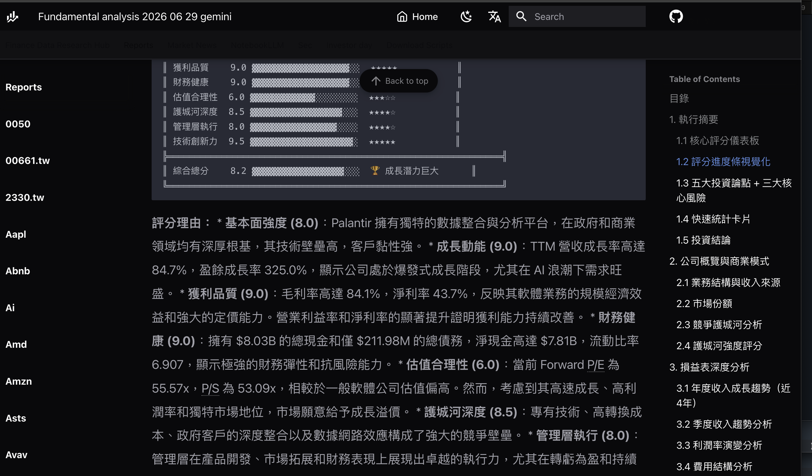
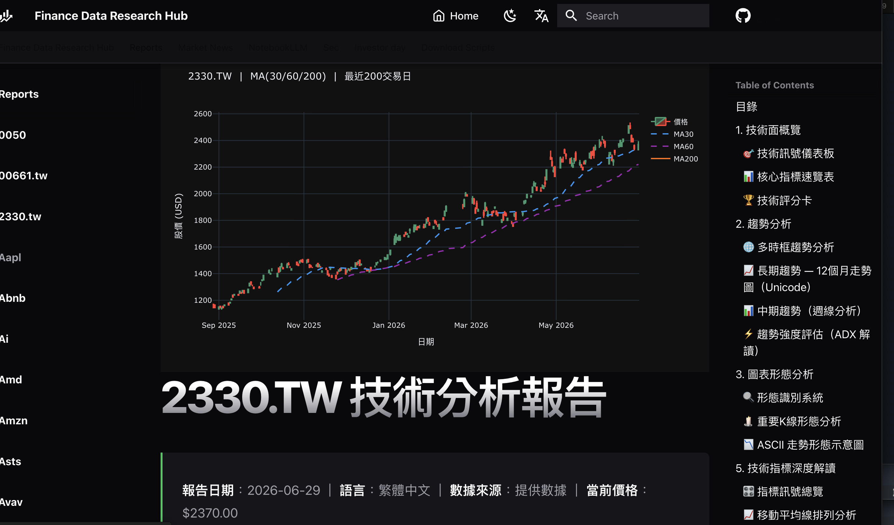

# Finance Data Research Hub

> AI 驅動的美股投資研究平台 — 基本面分析、SEC 文件、內線交易追蹤、技術分析，全部繁體中文。

<p align="center">
  
</p>

<p align="center">
  
  
</p>

**Live Site:** [yennanliu.github.io/finance_data](https://yennanliu.github.io/finance_data/)

---

## What Is This

A research platform that combines **SEC filings**, **AI-generated analysis**, and **automated pipelines** to produce investment research reports for US equities — all in Traditional Chinese.

### What It Has

| Category | Description | Location |
|----------|-------------|----------|
| Analysis Reports | 12 AI-generated analysis types — fundamental, technical, valuation, insider trading, institutional ownership, earnings-call, sector, and more | `ai_gen_report/fundamental/`, `ai_gen_report/technical/`, `ai_gen_report/stock/` |
| Market News | Daily AI-curated market news per ticker | `ai_gen_report/market_news/` |
| Stock Watchlist | Pre-market AI-generated fundamental watchlist | `ai_gen_report/` |
| Progress & QA Reports | Auto-generated daily progress summaries and report-quality (QA) checks | `ai_gen_report/` |
| SEC Filings | 10-K, 10-Q, 13-F, 6-K filings for 30+ companies | `10-k/`, `10-q/`, `13-f/`, `6-k/` |
| AI Research Notes | Deep-dive notebooks via NotebookLM (defense, autonomous systems, energy) | `notebook_llm/` |
| Investor Day Materials | Presentation decks and transcripts | `investor_day/` |
| Automation Scripts | SEC EDGAR downloaders, AI analysis generator, docs builder | `scripts/` |

### Coverage

**Daily Analysis (25 tickers, fundamental + technical):** 0050, 2330.TW, TSLA, PL, GRAB, TSM, GOOG, AMZN, MSFT, SOFI, PLTR, RKLB, ONDS, AVAV, KTOS, META, AMD, NVDA, NU, VST, ORCL, INTC, SPCX, AVGO, NBIS

**Analysis Types (12):** fundamental-analysis, technical-analysis, stock-eval, stock-valuation, financial-report-analyst, earnings-call-analysis, insider-trading, institutional-ownership, sector-analysis, economics-analysis, portfolio-review, report-generator

**SEC 10-K Filings:** 30+ companies across tech, defense, energy, and financials

**AI Research Notes:** ONDS, RKLB, AVAV, RCAT, TSLA, NEE, AMZN

### Recent Updates

- **Multi-provider LLM support** — generate with Claude, OpenAI, or Google Gemini (Gemini `gemini-2.5-flash` is now the daily-CI default); see `scripts/analysis/config/providers.py`
- **Site size cut 3.1 GB → 503 MB (-84%)** — search-index trimming, pruned navigation, WebP screenshots, GitHub-raw PDF links, 120-day retention, and a single nightly deploy. Full write-up: [部署效能調校全紀錄](https://yennj12.js.org/yennj12_blog_V4/posts/mkdocs-site-size-deploy-perf-tuning-zh/)
- **Responsive content** — tables, charts, and articles render cleanly across iOS / Android / web
- **Advanced analysis pipeline** — earnings-call, insider-trading, institutional-ownership, and interactive HTML reports via `advanced_analysis.yml`
- **Automated QA & housekeeping** — daily report-quality checks (`qa_report_quality.yml`), refusal-post cleanup (`cleanup_refusals.yml`), and daily progress summaries (`daily_progress.yml`)
- **Taiwan market coverage** — added TW-listed tickers (0050, 2330.TW)

---

## How It Works

```
┌─────────────┐     ┌──────────────────┐     ┌────────────────┐     ┌──────────────┐
│  Data Fetch  │────▶│   AI Analysis    │────▶│  Auto Deploy   │────▶│  Browse Site  │
│  yfinance    │     │ Claude / OpenAI  │     │  GitHub Actions │     │  GitHub Pages │
│  SEC EDGAR   │     │ Gemini · 繁中報告 │     │  Nightly CI/CD  │     │  MkDocs       │
└─────────────┘     └──────────────────┘     └────────────────┘     └──────────────┘
```

1. **Data Fetch** — `yfinance` API pulls live financial data; scripts download filings from SEC EDGAR
2. **AI Analysis** — `scripts/generate_analysis.py` sends data to your chosen provider (Claude, OpenAI, or Gemini), which produces structured Markdown reports with ASCII charts
3. **Auto Deploy** — GitHub Actions runs analysis daily and publishes via a single nightly `mkdocs build` (consolidated from 42 per-job deploys)
4. **Browse Site** — Reports published at [yennanliu.github.io/finance_data](https://yennanliu.github.io/finance_data/) with search, dark/light mode, responsive layout, and category navigation

---

## Quick Start

### Generate an analysis report locally

```bash
pip install -e ".[dev]"   # installs anthropic, openai, google-genai, yfinance, mkdocs, …

# Set the API key for the provider you want to use
export ANTHROPIC_API_KEY="sk-..."   # Claude
export OPENAI_API_KEY="sk-..."      # OpenAI
export GEMINI_API_KEY="..."         # Gemini (daily-CI default)

# Generate a fundamental analysis for AAPL (default provider: Claude)
python3 scripts/generate_analysis.py AAPL

# Choose provider and analysis type
python3 scripts/generate_analysis.py MSFT --analysis-type technical-analysis --provider gemini
python3 scripts/generate_analysis.py NVDA --analysis-type stock-valuation --provider openai
```

Output saved to `ai_gen_report/fundamental/aapl/fundamental_analysis_YYYY-MM-DD.md`
(technical-analysis saves to `ai_gen_report/technical/<ticker>/`; other analysis
types save to `ai_gen_report/stock/<ticker>/`)

### Download SEC filings

```bash
pip install requests

# Download 5 most recent 10-K reports for Apple
python3 scripts/download_10k.py AAPL

# Download for multiple companies
python3 scripts/download_10k.py AAPL MSFT TSLA

# Download 10-K PDFs
python3 scripts/download_10k_pdf.py meta-platforms-inc
```

### Build the docs site locally

```bash
pip install mkdocs-material mkdocs-awesome-pages-plugin mkdocs-minify-plugin

python3 scripts/build_docs.py
mkdocs serve
```

---

## Directory Structure

```
finance_data/
├── ai_gen_report/
│   ├── stock/        # AI-generated analysis reports (Markdown)
│   └── market_news/  # Daily AI-curated market news
├── notebook_llm/     # NotebookLM deep research notes
├── 10-k/             # SEC 10-K annual reports (PDF)
├── 10-q/             # SEC 10-Q quarterly reports
├── 13-f/             # SEC 13-F institutional holdings
├── 6-k/              # SEC 6-K foreign issuer reports
├── investor_day/     # Investor day presentations
├── scripts/          # Automation tools
│   ├── generate_analysis.py   # AI analysis generator
│   ├── build_docs.py          # MkDocs content builder
│   ├── download_10k.py        # SEC EDGAR downloader
│   └── download_10k_pdf.py    # PDF downloader
├── docs/             # MkDocs source (auto-generated)
├── .github/workflows/
│   ├── deploy.yml             # Build & deploy GitHub Pages
│   ├── daily_analysis.yml     # Daily AI analysis cron
│   └── daily_market_news.yml  # Daily market news cron
└── mkdocs.yml        # MkDocs Material configuration
```

---

## CI/CD Pipelines

| Workflow | Schedule | What It Does |
|----------|----------|-------------|
| `daily_analysis.yml` | Daily (staggered) | Generates fundamental + technical analysis for 25 tickers, commits to repo |
| `daily_market_news.yml` | Daily (staggered) | Fetches AI-curated market news per ticker |
| `daily_stock_watchlist.yml` | 22:00 UTC (pre-market) | Builds a fundamental stock watchlist |
| `advanced_analysis.yml` | Manual / dispatch | Earnings-call, insider-trading, 13-F, and interactive HTML reports |
| `qa_report_quality.yml` | 02:00 UTC daily | Quality-checks the day's generated reports |
| `cleanup_refusals.yml` | 02:00 UTC daily | Removes reports containing LLM refusal messages |
| `daily_progress.yml` | 00:40 UTC daily | Generates a daily progress summary |
| `download_10k.yml` | Manual / dispatch | Downloads SEC 10-K filings on demand |
| `deploy.yml` | Nightly + on push | Builds docs and deploys to GitHub Pages (single consolidated build) |

---

## Data Sources

- **Financial Data:** [Yahoo Finance](https://finance.yahoo.com/) via yfinance (no API key needed)
- **SEC Filings:** [SEC EDGAR](https://www.sec.gov/cgi-bin/browse-edgar)
- **AI Analysis:** [Claude](https://www.anthropic.com/) (Anthropic), [OpenAI](https://openai.com/), and [Gemini](https://ai.google.dev/) — provider is selectable per run
- **Annual Reports:** [annualreports.com](https://www.annualreports.com/)
- **Google Finance - 10K Reports:** [Google Finance](https://www.google.com/finance/beta/quote/PLTR:NASDAQ?hl=en&tab=earnings)

---

## For AI Agents (OKF)

This project publishes an [Open Knowledge Format (OKF)](https://github.com/GoogleCloudPlatform/knowledge-catalog/tree/main/okf)
bundle — vendor-neutral, agent-readable markdown describing every dataset and
reference. The canonical source is [`okf/`](okf/index.md); it is published
verbatim (raw markdown) at deploy time, alongside an [`llms.txt`](llms.txt)
navigation file:

- `https://yennanliu.github.io/finance_data/llms.txt`
- `https://yennanliu.github.io/finance_data/okf/index.md`

## Further Reading

- **finance_data 是怎麼運作的** - 用 Cron + LLM 全自動生成股票研究報告 ? [Blog](https://yennj12.js.org/yennj12_blog_V4/posts/finance-data-ai-pipeline-how-it-works-zh/)
- **把站台從 3.1GB 砍到 503MB：finance_data 部署效能調校全紀錄** — engineering write-up on the MkDocs site-size and deploy-performance tuning (search index, navigation pruning, WebP, retention, nightly deploy): [yennj12.js.org](https://yennj12.js.org/yennj12_blog_V4/posts/mkdocs-site-size-deploy-perf-tuning-zh/)

---

## Disclaimer

All analysis is for **educational and research purposes only**. Nothing on this site or in this repository constitutes investment advice. Invest at your own risk.
