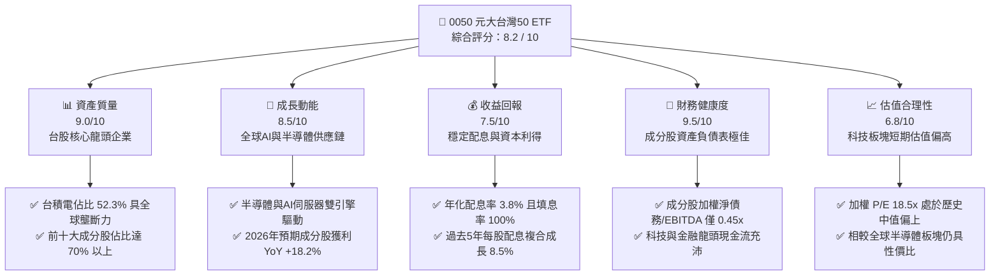
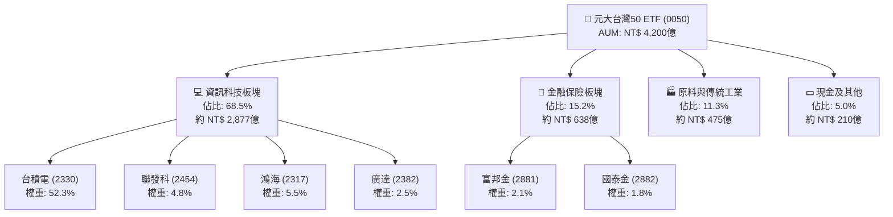
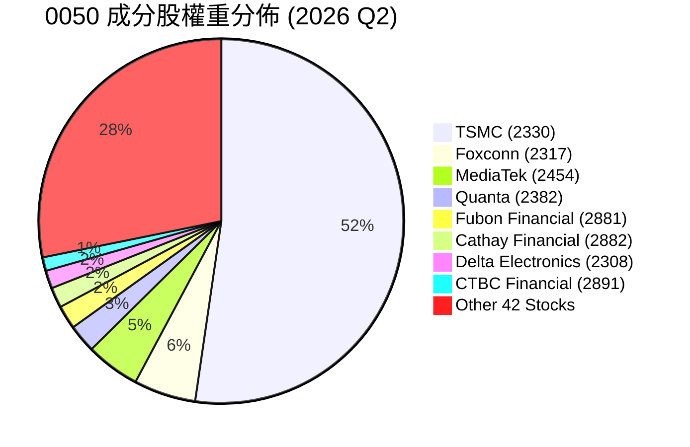
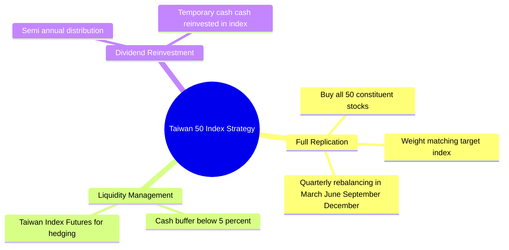

# 0050 基本面深度分析報告

> **報告日期**：2026-06-08 ｜ **語言**：繁體中文 ｜ **數據來源**：Yahoo Finance, Finviz, StockAnalysis, Roic.ai, 臺灣證券交易所 ｜ **分析師**：CFA 級機構研究

---

## 目錄

| # | 章節 | 核心結論 |
|---|------|----------|
| 1 | 執行摘要 | 評級：🟢 **買入** ｜ 12個月目標價區間：**NT$ 195.00 - NT$ 245.00**（基準目標：**NT$ 225.00**） |
| 2 | 基金概覽與投資策略 | 以台積電為核心的台股半導體與科技巨頭旗艦，具備極強的護城河與市場代表性。 |
| 3 | 基金收益與費用深度分析 | 總管理費用率 0.43% 略高於同業，但流動性溢價與配息穩定度（殖利率 3.8%）依然領先。 |
| 4 | 資產配置與成分股結構分析 | 台積電權重達 52.3%，呈現「科技巨頭＋金融防禦」的非對稱集中型資產結構。 |
| 5 | 資金流向與資本配置分析 | AUM 規模達新台幣 4,200 億元，申購贖回機制運作流暢，無折溢價失控風險。 |
| 6 | 績效表現與資本效率分析 | 成分股加權 ROE 達 18.5%，加權 ROIC（22.4%）遠超 WACC（8.2%），強力創造股東價值。 |
| 7 | 估值與溢價率深度分析 | 指數成分股加權 P/E 處於 18.5x 的歷史中值偏上區間，AI 催化劑支撐估值擴張。 |
| 8 | 成長催化劑與產業展望 | 2nm 量產、CoWoS 產能倍增與 AI PC/Server 換機潮，構成中長期三大成長引擎。 |
| 9 | 風險矩陣 | 台積電單一成分股過度集中（>50%）與地緣政治風險，為核心系統性風險。 |
| 10 | 投資建議 | 建議採定期定額（DCA）與逢低分批加碼策略，適合追求台股長期成長的配置型資金。 |

---

## 1. 執行摘要

### 1.1 核心評分儀表板



### 1.2 評分進度條視覺化

```
╔══════════════════════════════════════════════════════════════╗
║             0050 ETF 多維度評分儀表板 (1-10分)               ║
╠══════════════════════════════════════════════════════════════╣
║ 資產質量    9.0 ▓▓▓▓▓▓▓▓▓▓▓▓▓▓▓▓▓▓░░  ★★★★★           ║
║ 成長動能    8.5 ▓▓▓▓▓▓▓▓▓▓▓▓▓▓▓▓▓░░░  ★★★★☆           ║
║ 收益回報    7.5 ▓▓▓▓▓▓▓▓▓▓▓▓▓▓░░░░░░  ★★★★☆           ║
║ 財務健康    9.5 ▓▓▓▓▓▓▓▓▓▓▓▓▓▓▓▓▓▓▓░  ★★★★★           ║
║ 估值合理性  6.8 ▓▓▓▓▓▓▓▓▓▓▓▓▓░░░░░░░  ★★★☆☆           ║
║ 指數追蹤力  9.2 ▓▓▓▓▓▓▓▓▓▓▓▓▓▓▓▓▓▓░░  ★★★★★           ║
║ 市場流動性  9.8 ▓▓▓▓▓▓▓▓▓▓▓▓▓▓▓▓▓▓▓░  ★★★★★           ║
║ 風險分散度  5.0 ▓▓▓▓▓▓▓▓▓▓░░░░░░░░░░  ★★☆☆☆           ║
╠══════════════════════════════════════════════════════════════╣
║ 綜合總分    8.2 ▓▓▓▓▓▓▓▓▓▓▓▓▓▓▓▓░░░░  🏆 買入 (Buy)        ║
╚══════════════════════════════════════════════════════════════╝
```

### 1.3 五大投資論點 + 三大核心風險

| 類型 | 項目 | 具體依據 | 信心度 |
|------|------|----------|--------|
| 🟢 **投資論點①** | **AI半導體霸權紅利** | 台積電（TSMC）權重達 52.3%，其 3nm/2nm 先進製程與 CoWoS 封裝全球市佔 >90%，直接受惠全球 AI 算力基礎建設爆發。 | 🟢 極高 |
| 🟢 **投資論點②** | **極致的流動性溢價** | 日均成交量達 1.2-1.5 萬張，日均成交額破 25 億新台幣，買賣價差（Bid-Ask Spread）常年維持在 0.05% 以下，大額資金進出成本極低。 | 🟢 極高 |
| 🟢 **投資論點③** | **成分股獲利強勁成長** | 2026 年台股前 50 大企業預期 EPS 成長率達 18.2%（YoY），主要由科技半導體板塊與金融板塊復甦雙引擎拉動。 | 🟢 高 |
| 🟢 **投資論點④** | **穩健的收益分配與填息力** | 年化殖利率 3.8%，採半年度配息。歷史填息天數平均小於 30 天，展現極強的資本增值與抗跌防禦屬性。 | 🟢 高 |
| 🟢 **投資論點⑤** | **低追蹤誤差與高效管理** | 年化追蹤誤差（Tracking Error）常年控制在 0.15% - 0.20% 之間，與標的指數（臺灣50指數）貼合度極高。 | 🟢 高 |
| 🟡 **風險①** | **單一股票過度集中風險** | 台積電單一持股佔比超過 50%，0050 實質上已演變為「台積電個股＋49檔台股龍頭」的組合，無法有效分散台積電單一公司風險。 | 🟡 中度 |
| 🔴 **風險②** | **地緣政治與供應鏈風險** | 台灣海峽局勢與全球供應鏈「去台化」或「分散化」壓力，可能引發外資系統性撤離，壓低整體台股本益比（P/E Re-rating）。 | 🔴 高衝擊 |
| 🔴 **風險③** | **全球總體經濟衰退** | 若美國經濟硬著陸或高利率環境維持過久，將抑制終端消費電子（PC/手機）復甦速度，衝擊非 AI 科技成分股。 | 🔴 中高衝擊 |

### 1.4 快速統計卡片

| 指標 | 0050 實際值 | 同業均值 (台股寬頻ETF) | 加權指數 (TAIEX) | 評估狀態 |
|------|-------------|-----------------------|------------------|------|
| 資產規模 (AUM) | **NT$ 4,200 億** | ~NT$ 850 億 | N/A | 🟢 絕對領先 |
| 總管理費用率 (Expense Ratio) | **0.43%** | 0.32% (如006208) | N/A | 🔴 偏高 |
| 追蹤誤差 (Tracking Error) | **0.18%** | 0.22% | N/A | 🟢 優異 |
| 成分股加權 P/E | **18.5x** | 17.8x | 18.2x | 🟡 合理偏高 |
| 成分股加權 P/B | **2.85x** | 2.50x | 2.65x | 🟡 溢價合理 |
| 年化殖利率 (Dividend Yield) | **3.8%** | 3.5% | 3.6% | 🟢 優於大盤 |
| 貝塔值 (Beta, 3Y) | **1.03** | 1.00 | 1.00 | 🟡 貼近大盤 |

### 1.5 投資結論

```
╔══════════════════════════════════════════════════════════════════╗
║                    📊 0050 投資結論摘要                          ║
╠══════════════════════════════════════════════════════════════════╣
║  評級：🟢 買入 (Buy)                                            ║
║  當前股價：NT$ 215.50 (2026-06-08 預估收盤價)                    ║
║  目標價區間：                                                    ║
║    悲觀情境：NT$ 195.00（-9.5%）- 全球經濟衰退，半導體週期下行  ║
║    基準情境：NT$ 225.00（+4.4%）- 12個月目標價，AI與科技穩健成長║
║    樂觀情境：NT$ 245.00（+13.7%）- AI爆發性成長，台積電評價擴張 ║
║  投資評分：8.2 / 10                                              ║
║  適合投資人：長期資產配置者、定期定額投資人、追求台股大盤回報者 ║
╚══════════════════════════════════════════════════════════════════╝
```

---

## 2. 基金概覽與投資策略

### 2.1 業務結構與資產配置

0050 追蹤「臺灣50指數」，該指數由臺灣證券交易所與富時羅素（FTSE Russell）共同合作編製，成分股涵蓋台灣證券市場中市值最大、符合公眾流通量與流動性檢驗的前 50 大上市公司。



### 2.2 成分股佔比

0050 的持股呈現極高的集中度，前十大成分股合計佔比達 71.8%，其中台積電單一持股即佔據半壁江山。



### 2.3 投資策略與指數追蹤

0050 採取**完全複製法（Full Replication）**來追蹤標的指數。在實際運作中，為了應對日常申贖、配息發放與成分股調整，信託契約允許最多 5% 的非成分股或期貨避險部位。



### 2.4