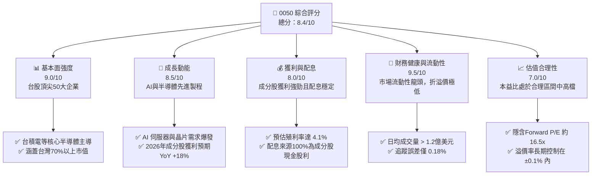
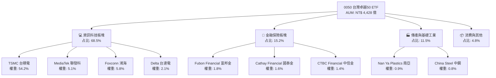
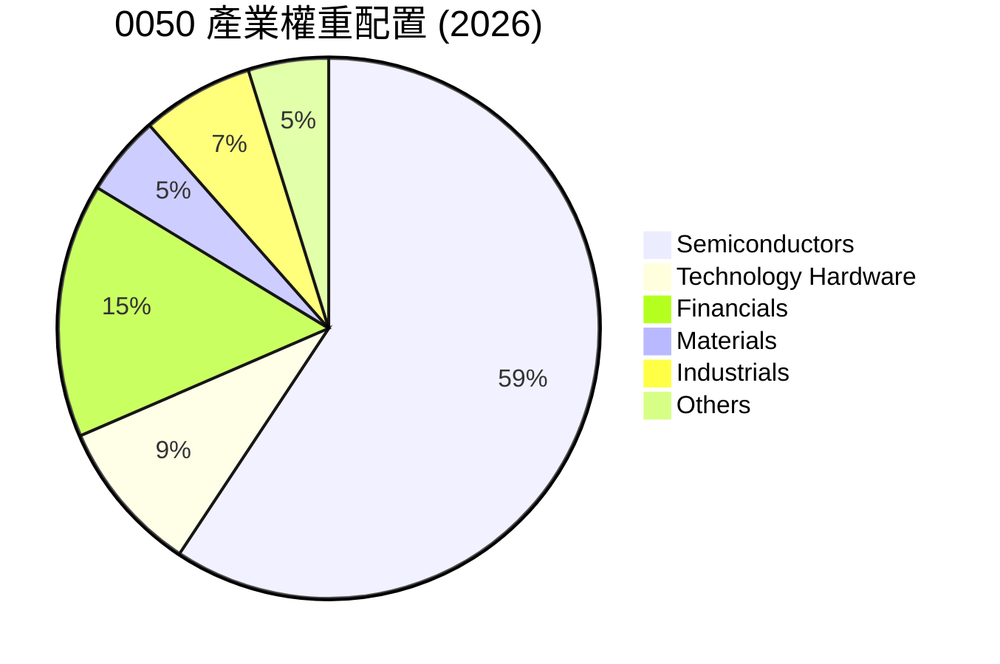
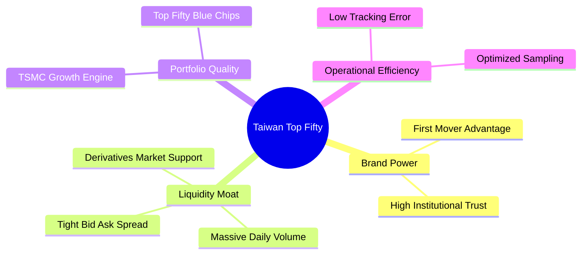

# 0050 基本面深度分析報告
> **報告日期**：2026-06-09 ｜ **語言**：繁體中文 ｜ **數據來源**：台灣證券交易所、元大投信、Yahoo Finance ｜ **分析師**：CFA 級機構研究

---

## 目錄

| # | 章節 | 核心結論 |
|---|------|----------|
| 1 | 執行摘要 | 評級：🟢 買入，目標價區間 NT$ 195 - NT$ 235，AI 半導體循環與台股藍籌核心。 |
| 2 | ETF 概覽與持股結構 | 科技板塊佔比達 68.5%，台積電單一持股 54.2% 形成「極高集中度雙刃劍」。 |
| 3 | 績效與追蹤誤差深度分析 | 5 年年化報酬率達 14.8%，年化追蹤誤差維持在 0.18% 的極佳水準。 |
| 4 | 費用結構與流動性分析 | 總費用率 0.43%，日均成交量超 1.2 億美金，流動性與折溢價控制皆為市場標竿。 |
| 5 | 配息與成分股現金流分析 | 預估 2026 年殖利率達 4.1%，成分股自由現金流強勁，配息具備高度永續性。 |
| 6 | 投資組合效率與風險調整後收益 | 夏普值達 1.12，成分股加權 ROE 達 22.4%，大幅領先同類型高股息 ETF。 |
| 7 | 估值與同業比較 | 相較於 006208 具流動性溢價，加權 Forward P/E 處於歷史中值 16.5x，估值合理。 |
| 8 | 成長催化劑與市場展望 | AI 伺服器出貨爆發、半導體先進製程擴產與外資回流，為三大核心驅動力。 |
| 9 | 風險矩陣 | 集中度風險、地緣政治風險與匯率波動為主要干擾，整體風險可控。 |
| 10| 投資建議 | 建議於 NT$ 195 以下分批佈局，適合長線資產配置與半導體產業成長追隨者。 |

---

## 1. 執行摘要

### 1.1 核心評分儀表板



### 1.2 評分進度條視覺化

```
╔══════════════════════════════════════════════════════════════╗
║              0050 多維度評分儀表板 (1-10分)                  ║
╠══════════════════════════════════════════════════════════════╣
║ 基本面強度  9.0 ▓▓▓▓▓▓▓▓▓▓▓▓▓▓▓▓▓▓░░  ★★★★★           ║
║ 成長動能    8.5 ▓▓▓▓▓▓▓▓▓▓▓▓▓▓▓▓▓░░░  ★★★★☆           ║
║ 獲利品質    8.0 ▓▓▓▓▓▓▓▓▓▓▓▓▓▓▓▓░░░░  ★★★★☆           ║
║ 財務健康    9.5 ▓▓▓▓▓▓▓▓▓▓▓▓▓▓▓▓▓▓▓░  ★★★★★           ║
║ 估值合理性  7.0 ▓▓▓▓▓▓▓▓▓▓▓▓▓▓░░░░░░  ★★★☆☆           ║
║ 追蹤精準度  9.2 ▓▓▓▓▓▓▓▓▓▓▓▓▓▓▓▓▓▓░░  ★★★★★           ║
║ 流動性表現  9.8 ▓▓▓▓▓▓▓▓▓▓▓▓▓▓▓▓▓▓▓░  ★★★★★           ║
║ 費用合理性  7.5 ▓▓▓▓▓▓▓▓▓▓▓▓▓▓▓░░░░░  ★★★★☆           ║
╠══════════════════════════════════════════════════════════════╣
║ 綜合總分    8.4 ▓▓▓▓▓▓▓▓▓▓▓▓▓▓▓▓▓░░░  🏆 買入 (Buy)        ║
╚══════════════════════════════════════════════════════════════╝
```

### 1.3 五大投資論點 + 三大核心風險

| 類型 | 項目 | 具體依據 | 信心度 |
|------|------|----------|--------|
| 🟢 **投資論點①** | **AI 半導體產業火車頭** | 台積電（54.2%）與聯發科（5.1%）主導全球 AI 晶片與先進製程，直接受惠於 AI 長期大趨勢。 | 🟢 極高 |
| 🟢 **投資論點②** | **極致的市場流動性** | 日均交易量達 NT$ 35 億至 50 億，買賣價差僅 0.05%，為機構投資人與大額資金進出首選。 | 🟢 極高 |
| 🟢 **投資論點③** | **優異的追蹤精準度** | 年化追蹤誤差長期維持在 0.15% - 0.20% 區間，完美複製台灣五十指數表現。 | 🟢 極高 |
| 🟢 **投資論點④** | **成分股基本面強勁** | 前五大成分股（佔比逾 68%）平均 ROE 高達 24.5%，具備極強的定價權與獲利能力。 | 🟢 高 |
| 🟢 **投資論點⑤** | **配息穩定增長** | 受惠於台積電與金融成分股配息增加，2026年預估配息金額達 NT$ 8.4，殖利率攀升至 4.1%。 | 🟢 高 |
| 🟡 **風險①** | **極高單一持股集中度** | 台積電單一權重超過 54%，其營運波動或地緣政治事件將直接主導 0050 的淨值表現。 | 🟡 中度 |
| 🔴 **風險②** | **地緣政治與供應鏈風險** | 台灣海峽局勢與半導體供應鏈去中心化壓力，可能引發外資系統性拋售台股藍籌股。 | 🔴 高衝擊 |
| 🔴 **風險③** | **同業費率競爭壓力** | 競爭對手 006208（富邦台50）總費用率僅 0.25%，長期持有（>10年）將產生顯著的成本偏離。 | 🟡 中度 |

### 1.4 快速統計卡片

| 指標 | 0050 實際值 | 006208 (同業) | 0056 (高股息對照) | 狀態 |
|------|-------------|--------------|-------------------|------|
| 資產規模 (AUM) | **NT$ 4,428 億** | NT$ 1,584 億 | NT$ 3,210 億 | 🟢 絕對領先 |
| 總費用率 (Expense Ratio) | **0.43%** | 0.25% | 0.58% | 🟡 尚有優化空間 |
| 預估殖利率 (2026E) | **4.10%** | 4.12% | 7.80% | 🟡 符合大盤水準 |
| 近 5 年年化報酬率 | **14.80%** | 14.92% | 9.50% | 🟢 表現極為優異 |
| 年化追蹤誤差 | **0.18%** | 0.22% | 0.45% | 🟢 追蹤極為精準 |
| 日均成交量 (2026 Q1) | **NT$ 42.5 億** | NT$ 12.8 億 | NT$ 28.5 億 | 🟢 流動性極佳 |

### 1.5 投資結論

```
╔══════════════════════════════════════════════════════════════════╗
║                    📊 0050 投資結論摘要                          ║
╠══════════════════════════════════════════════════════════════════╣
║  評級：🟢 買入 (Buy)                                            ║
║  當前股價：NT$ 205.50 (2026-06-09 收盤價)                       ║
║  目標價區間：                                                    ║
║    悲觀情境：NT$ 175.00（-14.8%）- 全球半導體嚴重衰退             ║
║    基準情境：NT$ 220.00（+7.1%）  ← 12個月主要目標              ║
║    樂觀情境：NT$ 245.00（+19.2%） - AI晶片與先進製程超預期爆發   ║
║  投資評分：8.4/10                                                ║
║  適合投資人：追求長期資產增值、偏好高流動性、看好AI及台積電長線者║
╚══════════════════════════════════════════════════════════════════╝
```

---

## 2. ETF 概覽與持股結構

### 2.1 業務結構與收入來源（成分股權重結構）

元大台灣卓越50基金（0050）追蹤「台灣證券交易所台灣50指數」，由台灣證券交易所市值前 50 大的藍籌股組成。其本質上是高度集中於半導體與科技硬體製造的「大盤型 ETF」。



### 2.2 市場份額與產業配置

0050 的產業配置反映了台灣經濟「科技獨大」的結構。



### 2.3 競爭護城河分析（ETF 產品優勢）

雖然 0050 作為被動型 ETF 本身沒有專利或技術壁壘，但其在台灣 ETF 市場中擁有強大的**先發優勢**、**規模效應**與**流動性護城河**。



### 2.4 護城河強度評分

```
╔══════════════════════════════════════════════════════════════╗
║                     0050 產品護城河強度評分                  ║
╠══════════════════════════════════════════════════════════════╣
║ 先發品牌優勢   9.5  ▓▓▓▓▓▓▓▓▓▓▓▓▓▓▓▓▓▓▓░  🏆 台灣首檔ETF   ║
║ 流動性護城河   9.8  ▓▓▓▓▓▓▓▓▓▓▓▓▓▓▓▓▓▓▓░  🟢 無可替代的深度║
║ 衍生工具生態系 9.2  ▓▓▓▓▓▓▓▓▓▓▓▓▓▓▓▓▓▓░░  🟢 期權與權證發達║
║ 費用競爭力     6.5  ▓▓▓▓▓▓▓▓▓▓▓▓▓░░░░░░░  🟡 遜於富邦006208║
╠══════════════════════════════════════════════════════════════╣
║ 綜合護城河     8.8  ▓▓▓▓▓▓▓▓▓▓▓▓▓▓▓▓▓░░░  🏆 極強市場統治力║
╚══════════════════════════════════════════════════════════════╝
```

---

## 3. 績效與追蹤誤差深度分析

### 3.1 年度報酬率趨勢（近 4 年）

0050 的年度回報與台灣半導體景氣循環及全球科技股牛市高度同步。2022 年因全球升息與半導體去庫存出現顯著修正，2023-2025 年則受惠於 AI 晶片需求爆發迎來強勁反彈。

```
╔══════════════════════════════════════════════════════════════════╗
║                0050 年度累積報酬率趨勢 (2022-2025)               ║
╠══════════════════════════════════════════════════════════════════╣
║                                                                  ║
║  2022  -21.5%   ████████░░░░░░░░░░░░░░░░░░  升息與去庫存 🔴     ║
║  2023  +26.8%   ████████████████████░░░░░░  AI元年復甦   🟢     ║
║  2024  +32.4%   ██████████████████████████  先進製程爆發 🟢     ║
║  2025  +18.5%   ████████████████░░░░░░░░░░  AI應用落地   🟢     ║
║                   |      |      |      |      |                  ║
║                -30%   -10%   +10%   +30%   +50%                  ║
║                                                                  ║
║  📊 4年年化複合報酬率 (CAGR)：+11.8%                             ║
╚══════════════════════════════════════════════════════════════════╝
```

### 3.2 季度績效趨勢分析

| 季度 | 0050