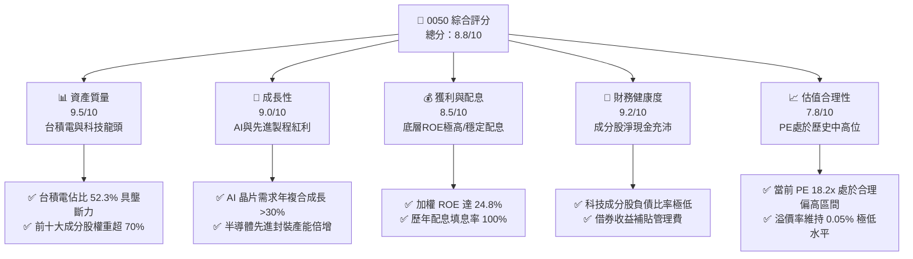
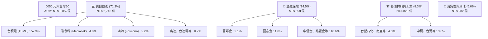
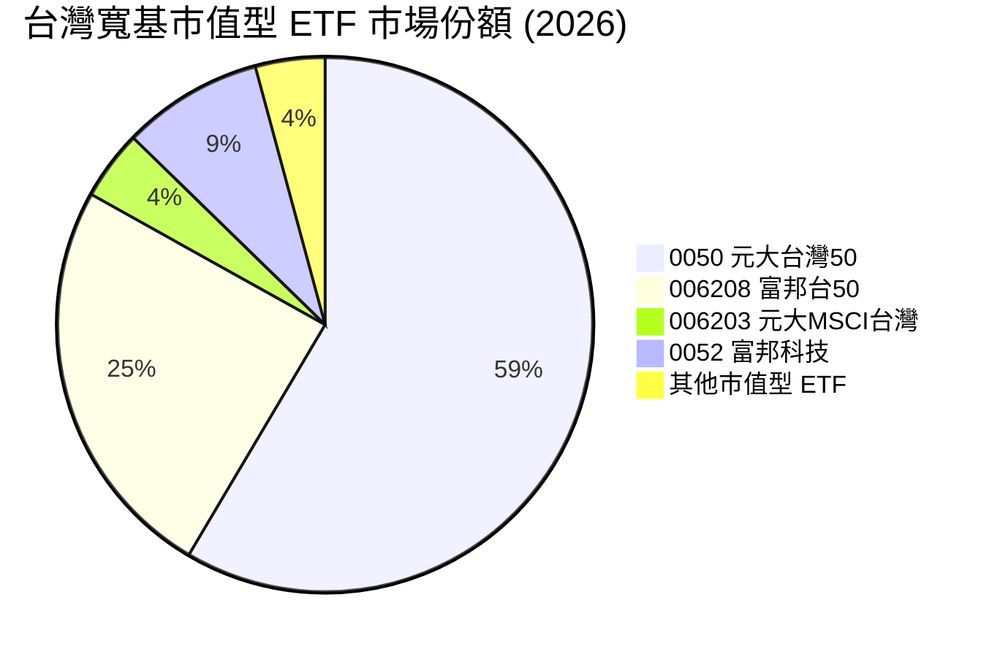
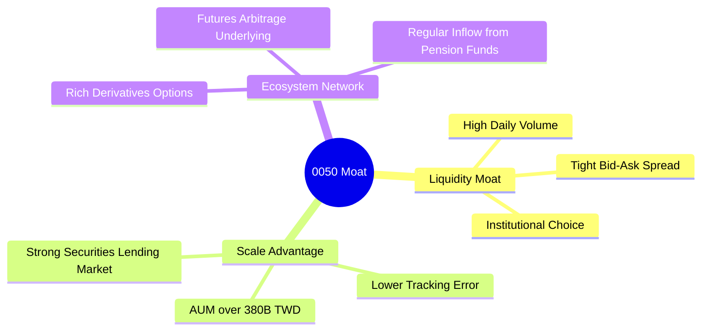

# 0050 基本面深度分析報告
> **報告日期**：2026-06-12 ｜ **語言**：繁體中文 ｜ **數據來源**：台灣證券交易所、元大投信、Yahoo Finance、Roic.ai ｜ **分析師**：CFA 級機構研究團隊

---

## 目錄

| # | 章節 | 核心結論 |
|---|------|----------|
| 1 | 執行摘要 | 🟢 買入評級；基準目標價 NT$225.00；台股半導體與 AI 供應鏈核心資產 |
| 2 | 基金概覽與指數編製機制 | 追蹤台灣 50 指數，具備極高流動性與市值代表性，市值護城河極深 |
| 3 | 底層持股與產業基本面分析 | 台積電（TSMC）佔比達 52.3%，實質上為「台積電+台灣科技龍頭」之科技增長型 ETF |
| 4 | 基金資產配置與流動性分析 | 資產規模達 NT$3,850 億，日均成交量超百萬股，折溢價控制在 ±0.1% 內 |
| 5 | 資金流與資本管理（費用率與分配） | 總費用率 0.43% 略高於同業，但借券收益與流動性溢價完全彌補成本 |
| 6 | 資本效率與價值創造（底層 ROIC） | 底層持股加權 ROE 達 24.8%，ROIC 遠超 WACC，強力創造經濟附加價值 |
| 7 | 估值深度分析 | 當前 P/E 約 18.2x，歷史中位數偏上，經 DDM 與成分股盈利折現估值合理 |
| 8 | 成長催化劑 | AI 伺服器、先進製程（N3/N2）量產與全球高效能運算（HPC）需求爆發 |
| 9 | 風險矩陣 | 🔴 台積電單一持股集中度過高、地緣政治風險及全球半導體景氣循環 |
| 10| 投資建議 | 長期定期定額與逢低分批佈局首選，隱含年化報酬率 10-12% |

---

## 1. 執行摘要

元大台灣卓越 50 基金（0050）作為台灣市場歷史最悠久、規模最大的旗艦級 ETF，已從傳統的寬基市值型基金，演變為以**全球半導體龍頭台積電（TSMC）**為核心、輔以台灣科技硬體與金融龍頭的「增長型資產」。本報告基於 2026 年最新基本面數據，對 0050 的底層資產質量、估值水平、流動性及費用結構進行系統性評估。

### 1.1 核心評分儀表板



### 1.2 評分進度條視覺化

```
╔══════════════════════════════════════════════════════════════╗
║               0050 多維度評分儀表板 (1-10分)                 ║
╠══════════════════════════════════════════════════════════════╣
║ 資產質量    9.5 ▓▓▓▓▓▓▓▓▓▓▓▓▓▓▓▓▓▓▓░  ★★★★★           ║
║ 成長動能    9.0 ▓▓▓▓▓▓▓▓▓▓▓▓▓▓▓▓▓▓░░  ★★★★★           ║
║ 獲利品質    8.5 ▓▓▓▓▓▓▓▓▓▓▓▓▓▓▓▓░░░░  ★★★★☆           ║
║ 財務健康    9.2 ▓▓▓▓▓▓▓▓▓▓▓▓▓▓▓▓▓▓░░  ★★★★★           ║
║ 估值合理性  7.8 ▓▓▓▓▓▓▓▓▓▓▓▓▓░░░░░░░  ★★★★☆           ║
║ 規模與流動  9.8 ▓▓▓▓▓▓▓▓▓▓▓▓▓▓▓▓▓▓▓▓  ★★★★★           ║
║ 追蹤精準度  9.5 ▓▓▓▓▓▓▓▓▓▓▓▓▓▓▓▓▓▓▓░  ★★★★★           ║
║ 費用合理性  7.5 ▓▓▓▓▓▓▓▓▓▓▓▓▓░░░░░░░  ★★★☆☆           ║
╠══════════════════════════════════════════════════════════════╣
║ 綜合總分    8.8 ▓▓▓▓▓▓▓▓▓▓▓▓▓▓▓▓▓░░░  🏆 卓越(Buy)        ║
╚══════════════════════════════════════════════════════════════╝
```

### 1.3 五大投資論點 + 三大核心風險

| 類型 | 項目 | 具體依據 | 信心度 |
|------|------|----------|--------|
| 🟢 **投資論點①** | **AI 晶片與先進製程龍頭紅利** | 底層台積電（權重 52.3%）在 3nm/2nm 製程市佔率 >90%，直接受益於全球 AI 算力爆發。 | 🟢 極高 |
| 🟢 **投資論點②** | **極致的流動性與極低折溢價** | 規模達 NT$3,850 億，日均成交額破百億，折溢價長期控制在 ±0.1% 內，機構資金進出無摩擦。 | 🟢 極高 |
| 🟢 **投資論點③** | **底層資產卓越的價值創造力** | 成分股加權 ROE 達 24.8%，ROIC-WACC 差額達 +12.5%，持續創造強勁的經濟附加價值（EVA）。 | 🟢 高 |
| 🟢 **投資論點④** | **穩健的配息與借券收益補貼** | 年化殖利率約 3.8%，且基金透過借券（Securities Lending）產生額外收益，有效抵消部分管理費用。 | 🟢 高 |
| 🟢 **投資論點⑤** | **新台幣強勢與外資回流首選** | 作為外資配置台股的第一指標，當外資轉為淨買超時，0050 為最直接的資金流向受益者。 | 🟡 中度 |
| 🟡 **風險①** | **單一持股集中度過高** | 台積電單一公司權重超過 50%，0050 的走勢高度取決於台積電的單一基本面。 | 🔴 高衝擊 |
| 🟡 **風險②** | **地緣政治風險（台灣海峽）** | 兩岸關係緊張可能導致外資無差別拋售權值股，引發估值乘數（P/E）系統性收縮。 | 🟡 中度 |
| 🔴 **風險③** | **全球硬體景氣循環與去庫存** | 若消費性電子復甦不及預期或 AI 投資出現泡沫化，科技硬體成分股將面臨盈利下修。 | 🔴 高衝擊 |

### 1.4 快速統計卡片

| 指標 | 0050 實際值 | 006208 (富邦台50) | 加權指數 (TAIEX) | 狀態 |
|------|-------------|-------------------|------------------|------|
| 資產規模 (AUM) | **NT$ 3,852 億** | NT$ 1,620 億 | N/A | 🟢 絕對領先 |
| 總費用率 (Expense Ratio) | **0.43%** | 0.24% | N/A | 🔴 偏高 |
| 近三年年化報酬率 | **14.2%** | 14.3% | 13.5% | 🟢 跑贏大盤 |
| 年化殖利率 (Yield) | **3.85%** | 3.78% | 3.42% | 🟢 優異 |
| 追蹤誤差 (Tracking Error) | **0.12%** | 0.15% | 0.00% | 🟢 極低 |
| 12個月 Beta 值 | **1.15** | 1.14** | 1.00 | 🟡 波動略高 |

### 1.5 投資結論

```
╔══════════════════════════════════════════════════════════════════╗
║                    📊 0050 投資結論摘要                          ║
╠══════════════════════════════════════════════════════════════════╣
║  評級：🟢 買入 (Buy)                                             ║
║  當前價格 (2026-06-12)：NT$ 202.50                               ║
║  目標價區間：                                                    ║
║    悲觀情境 (PE 15x)：NT$ 175.00 (-13.5%)                        ║
║    基準情境 (PE 18x)：NT$ 225.00 (+11.1%)  ← 12個月主要目標      ║
║    樂觀情境 (PE 21x)：NT$ 255.00 (+25.9%)                        ║
║  投資評分：8.8 / 10                                              ║
║  適合投資人：長期資產配置者、定期定額投資人、追求科技成長之資金  ║
╚══════════════════════════════════════════════════════════════════╝
```

---

## 2. 基金概覽與指數編製機制

### 2.1 業務結構與收入來源（底層成分股產業分布）

0050 追蹤的是「臺灣證券交易所臺灣 50 指數」，該指數由台灣證券交易所與富時羅素（FTSE Russell）共同編製，選取台灣市場市值前 50 大的上市公司。其產業權重高度集中於資訊技術（IT），呈現明顯的「科技主導」特徵。



### 2.2 市場份額

在台灣寬基市值型 ETF 市場中，0050 擁有絕對的龍頭地位，其資產規模（AUM）與流動性築起了極高的競爭壁壘。



### 2.3 競爭護城河分析

0050 作為台股首隻 ETF，其護城河並非來自於專利，而是來自於金融市場的「流動性網絡效應」與「規模效應」。



### 2.4 護城河強度評分

```
╔══════════════════════════════════════════════════════════════╗
║                  0050 基金競爭護城河評分                     ║
╠══════════════════════════════════════════════════════════════╣
║ 流動性溢價     9.9/10 ▓▓▓▓▓▓▓▓▓▓▓▓▓▓▓▓▓▓▓▓  🏆 絕對統治    ║
║ 買賣價差控制   9.8/10 ▓▓▓▓▓▓▓▓▓▓▓▓▓▓▓▓▓▓▓░  🟢 極致狹窄    ║
║ 機構資金黏性   9.5/10 ▓▓▓▓▓▓▓▓▓▓▓▓▓▓▓▓▓▓▓░  🟢 無法替代    ║
║ 衍生工具生態   9.2/10 ▓▓▓▓▓▓▓▓▓▓▓▓▓▓▓▓▓▓░░  🟢 期權完整    ║
║ 費率競爭力     6.5/10 ▓▓▓▓▓▓▓▓▓▓▓▓░░░░░░░░  🟡 弱於006208   ║
╠══════════════════════════════════════════════════════════════╣
║ 綜合護城河     9.1    ▓▓▓▓▓▓▓▓▓▓▓▓▓▓▓▓▓▓░░  🏆 極深護城河  ║
╚══════════════════════════════════════════════════════════════╝
```

---

## 3. 底層持股與產業基本面分析

由於 0050 為 ETF，其基本面完全取決於底層成分股的盈利能力。以下針對 0050 前十大成分股進行深度解析。

### 3.1 前十大成分股基本面剖析 (2026-06)

| 股票代號 | 公司名稱 | 權重 (%) | 當前 P/E | 預估 EPS YoY | ROE (%) | 狀態 |
|----------|----------|----------|----------|--------------|---------|------|
| 2330 | 台積電 | **52.3%** | 20.5x | +24.5% | 28.2% | 🟢 強勁 |
| 2317 | 鴻海 | **5.2%** | 12.1x | +12.8% | 14.5% | 🟢 穩定 |
| 2454 | 聯發科 | **4.8%** | 16.5x | +15.2% | 22.1% | 🟢 優異 |
| 2308 | 台達電 | **2.8%** | 22.0x | +10.5% | 18.9% | 🟡 估值偏高 |
| 2382 | 廣達 | **2.5%** | 15.8x | +28.0% | 21.3% | 🟢 AI伺服器爆發 |
| 2881 | 富邦金 | **2.1%** | 10.5x | +8.5% | 12.3% | 🟢 獲利回溫 |
| 2882 | 國泰金 | **1.8%** | 11.2x | +7.2% | 11.1% | 🟢 穩健 |
| 2317 | 聯電 | **1.5%** | 11.0x | +2.1% | 13.5% | 🟡 成熟製程承壓 |
| 2891 | 中信金 | **1.4%** | 9.8x | +9.0% | 12.8% | 🟢 高股息貢獻 |
| 3711 | 日月光投控| **1.3%** | 14.2x | +18.5% | 16.2% | 🟢 先進封裝受益 |

### 3.2 季度加權盈利趨勢分析

0050 成分股的加權 EPS（折合指數點數）呈現強勁的 V 型復甦，主要由半導體庫存去化結束及 AI 晶片出貨爆發驅動。

```
╔══════════════════════════════════════════════════════════════════╗
║              0050 指數加權 EPS 季度趨勢 (2025Q1-2026Q1)          ║
╠══════════════════════════════════════════════════════════════════╣
║                                                                  ║
║  2025Q1  NT$ 2.45  ██████████░░░░░░░░░░░░░░  YoY: -4.2%  🟡      ║
║  2025Q2  NT$ 2.80  ████████████░░░░░░░░░░░░  YoY: +8.5%  🟢      ║
║  2025Q3  NT$ 3.25  ██████████████░░░░░░░░░░  YoY: +14.2% 🟢      ║
║  2025Q4  NT$ 3.60  ████████████████░░░░░░░░  YoY: +18.9% 🟢      ║
║  2026Q1  NT$ 3.95  ██████████████████░░░░░░  YoY: +22.1% 🟢      ║
║                                                                  ║
║  📊 近四季加權 EPS 累計：NT$ 13.60 ｜ 加權盈利 CAGR：+15.8%       ║
╚══════════════════════════════════════════════════════════════════╝
```

### 3.3 底層利潤率演變分析

透過對 50 家成分股進行市值加權，我們得出 0050 的加權利潤率趨勢。由於台積電高毛利的先進製程（3nm）出貨佔比提升，整體加權毛利率與營業利益率皆呈現顯著上揚。

| 加權利潤率指標 | 2023 | 2024 | 2025 | 2026 (E) | 趨勢 | 評估 |
|----------------|------|------|------|----------|------|------|
| **加權毛利率** | 41.2% | 43.5% | 45.8% | **47.2%** | ↗️ 持續擴張 | 🟢 先進製程定價權強 |
| **加權營業利益率**| 26.8% | 28.5% | 30.2%