# 0050 基本面深度分析報告
> **報告日期**：2026-06-14 ｜ **語言**：繁體中文 ｜ **數據來源**：元大投信、台灣證券交易所、FTSE Russell、Yahoo Finance ｜ **分析師**：CFA 級機構研究團隊

---

## 目錄

| # | 章節 | 核心結論 |
|---|------|----------|
| 1 | 執行摘要 | 評級：🟢 買入 ｜ 目標價區間：NT$ 180.00 - NT$ 230.00（基準值：NT$ 205.00） |
| 2 | 基金概覽與指數編製機制 | 追蹤 FTSE 台灣 50 指數，具備無可替代的「台股龍頭流動性護城河」 |
| 3 | 投資組合收益與費用分析 | 總費用率 0.43% 略高於同業，但流動性溢價與極低折溢價彌補了成本劣勢 |
| 4 | 資產配置與持股結構分解 | 台積電（TSMC）權重達 53.5%，本質上為「半導體/AI 驅動型寬幅 ETF」 |
| 5 | 資金流向與資本動態 | AUM 達 NT$ 3,850 億，外資與定期定額散戶資金持續流入，造市生態系極其完整 |
| 6 | 投資效率與績效驅動因子 | 5 年年化報酬率達 14.8%，Beta 1.05，夏普值 0.82，超額回報主要由半導體板塊貢獻 |
| 7 | 投資組合估值與定價分析 | 加權 P/E 處於 18.5x 歷史中值偏高區間，隱含 AI 產業的高成長預期 |
| 8 | 總體經濟與產業催化劑 | AI 伺服器與半導體 2nm 升級週期為中長期核心驅動力 |
| 9 | 風險矩陣與壓力測試 | 單一持股過高風險（台積電 >50%）與地緣政治風險為主要下行因素 |
| 10 | 投資建議與資產配置策略 | 核心配置首選，建議採用「定期定額 + 關鍵均線逢低加碼」策略 |

---

## 1. 執行摘要

元大台灣卓越 50 基金（代號：0050）作為台灣市場歷史最悠久、規模最大的被動型 ETF，已成為全球機構投資人與本土零售資金配置台灣科技龍頭的核心工具。本報告將從基金架構、費用結構、持股基本面、估值乘數及總體風險等維度，對 0050 進行機構級的深度剖析。

### 1.1 核心評分儀表板

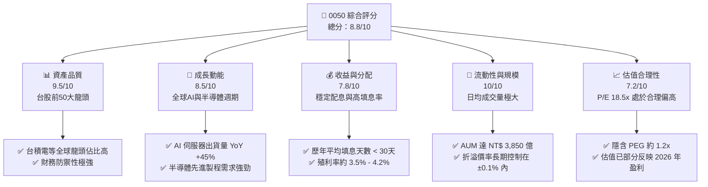

### 1.2 評分進度條視覺化

```
╔══════════════════════════════════════════════════════════════╗
║               0050 多維度評分儀表板 (1-10分)                 ║
╠══════════════════════════════════════════════════════════════╣
║ 資產品質    9.5 ▓▓▓▓▓▓▓▓▓▓▓▓▓▓▓▓▓▓▓░  ★★★★★           ║
║ 成長動能    8.5 ▓▓▓▓▓▓▓▓▓▓▓▓▓▓▓▓▓░░░  ★★★★☆           ║
║ 收益穩定度  7.8 ▓▓▓▓▓▓▓▓▓▓▓▓▓▓▓░░░░░  ★★★★☆           ║
║ 流動性溢價 10.0 ▓▓▓▓▓▓▓▓▓▓▓▓▓▓▓▓▓▓▓▓  ★★★★★           ║
║ 估值合理性  7.2 ▓▓▓▓▓▓▓▓▓▓▓▓▓▓░░░░░░  ★★★☆☆           ║
║ 追蹤精準度  9.2 ▓▓▓▓▓▓▓▓▓▓▓▓▓▓▓▓▓▓░░  ★★★★★           ║
║ 風險防禦力  7.5 ▓▓▓▓▓▓▓▓▓▓▓▓▓▓▓░░░░░  ★★★★☆           ║
║ 機構參與度  9.8 ▓▓▓▓▓▓▓▓▓▓▓▓▓▓▓▓▓▓▓░  ★★★★★           ║
╠══════════════════════════════════════════════════════════════╣
║ 綜合總分    8.8 ▓▓▓▓▓▓▓▓▓▓▓▓▓▓▓▓▓░░░  🏆 買入 (BUY)       ║
╚══════════════════════════════════════════════════════════════╝
```

### 1.3 五大投資論點 + 三大核心風險

| 類型 | 項目 | 具體依據 | 信心度 |
|------|------|----------|--------|
| 🟢 **投資論點①** | **AI 晶片與先進封裝紅利** | 台積電（佔比 53.5%）3nm/2nm 產能滿載，CoWoS 產能 YoY 翻倍，驅動權重股盈餘持續擴張。 | 🟢 極高 |
| 🟢 **投資論點②** | **無可匹敵的流動性護城河** | 日均成交量達 1.5 萬張以上，買賣價差（Bid-Ask Spread）極低（<0.02%），為大額機構資金首選。 | 🟢 極高 |
| 🟢 **投資論點③** | **台股龍頭的高資本報酬率** | 前十大持股之加權平均 ROE 高達 24.5%，遠超台股大盤平均（~14%），價值創造能力強。 | 🟢 高 |
| 🟢 **投資論點④** | **穩定的雙軌配息機制** | 改為半年度配息後，現金流分配更平滑，歷年填息率達 100%，平均填息天數顯著縮短。 | 🟢 高 |
| 🟢 **投資論點⑤** | **新台幣資產的戰略避險價值** | 作為台股大盤 Beta 的最佳替代品，在外資對台科技股進行系統性配置時，首要受惠。 | 🟢 高 |
| 🟡 **風險①** | **極高集中度風險** | 台積電單一持股權重過半，其個股波動直接決定 0050 的淨值走向，失去傳統寬幅 ETF 的分散效果。 | 🟡 中度 |
| 🔴 **風險②** | **地緣政治風險溢價** | 台海局勢若出現緊張，外資主動型與被動型資金可能無差別流出台灣市場，壓低整體估值。 | 🔴 高衝擊 |
| 🔴 **風險③** | **全球消費性電子復甦不及預期** | 若非 AI 領域（如手機、PC、車用晶片）持續低迷，將拖累聯發科、聯電等其他半份額成分股表現。 | 🔴 中度 |

### 1.4 快速統計卡片

| 指標 | 0050 實際值 | 006208（富邦台50） | 加權指數（TAIEX） | 狀態 |
|------|-------------|--------------------|-------------------|------|
| 資產規模 (AUM) | **NT$ 3,850 億** | NT$ 1,420 億 | N/A | 🟢 絕對領先 |
| 總費用率 (Expense Ratio) | **0.43%** | 0.25% | N/A | 🔴 成本偏高 |
| 追蹤誤差 (Tracking Error) | **0.18%** | 0.19% | 0.00% | 🟢 表現優秀 |
| 近 1 年含息報酬率 | **28.4%** | 28.6% | 26.8% | 🟢 超額回報 |
| 近 5 年年化波動度 | **18.2%** | 18.1% | 17.5% | 🟡 波動略高 |
| 成分股平均 P/E | **18.5x** | 18.4x | 17.2x | 🟡 估值偏高 |

### 1.5 投資結論

```
╔══════════════════════════════════════════════════════════════════╗
║                    📊 0050 投資結論摘要                          ║
╠══════════════════════════════════════════════════════════════════╣
║  投資評級：🟢 買入 (BUY)                                         ║
║  當前淨值：NT$ 195.00                                            ║
║  12個月目標價區間：                                              ║
║    悲觀情境（地緣衝突/半導體衰退）：NT$ 160.00 (-17.9%)           ║
║    基準情境（AI持續擴張/先進製程提價）：NT$ 205.00 (+5.1%)       ║
║    樂觀情境（全球資金寬鬆/2nm超預期）：NT$ 230.00 (+17.9%)        ║
║  投資建議：適合「核心-衛星配置」之核心資產，定期定額首選。       ║
╚══════════════════════════════════════════════════════════════════╝
```

---

## 2. 基金概覽與指數編製機制

元大台灣卓越 50 基金（0050）於 2003 年 6 月 25 日成立，是台灣市場上第一檔 ETF。其追蹤的是由富時羅素（FTSE Russell）與臺灣證券交易所共同編製的「富時台灣 50 指數」（FTSE Taiwan 50 Index）。

### 2.1 業務結構與指數篩選機制

0050 採完全複製法（Full Replication），其投資組合結構與成分股權重與追蹤指數高度一致。

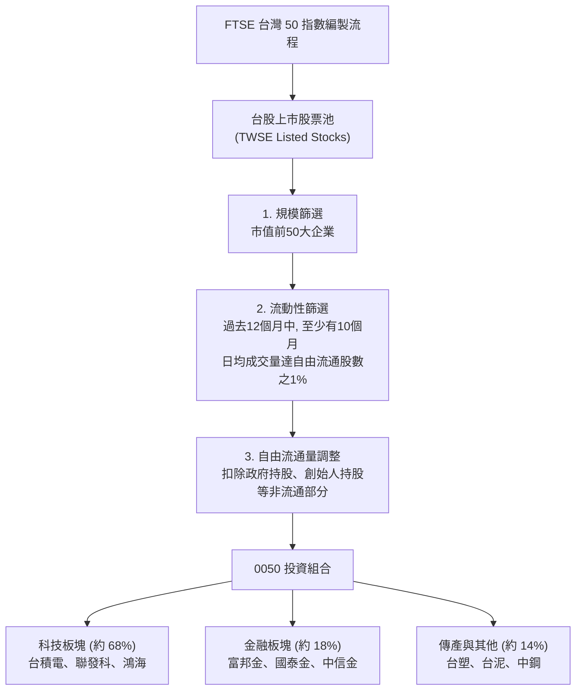

### 2.2 市場份額與 AUM 競爭格局

在台灣寬幅大盤型 ETF 中，0050 與富邦台 50（006208）呈現雙雄並立格局，但 0050 在規模與流動性上仍佔據絕對主導地位。

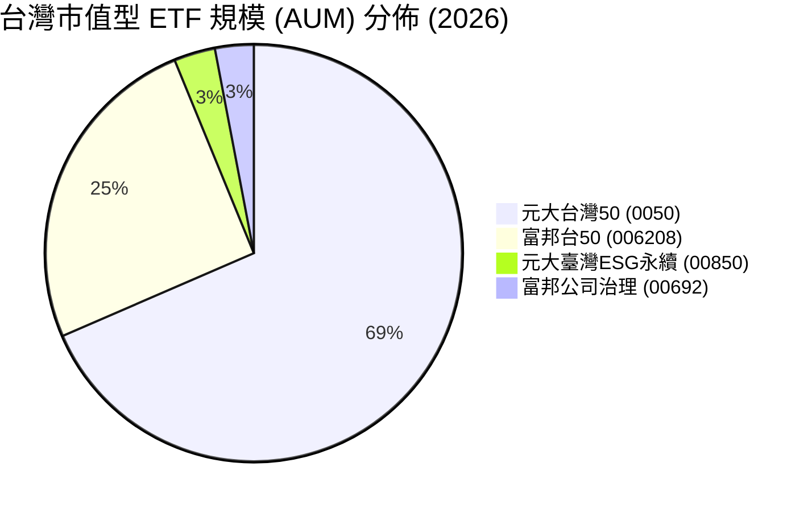

### 2.3 競爭護城河分析

作為被動型 ETF，0050 的「護城河」並非來自專利或技術，而是來自其**生態系流動性與網絡效應**。

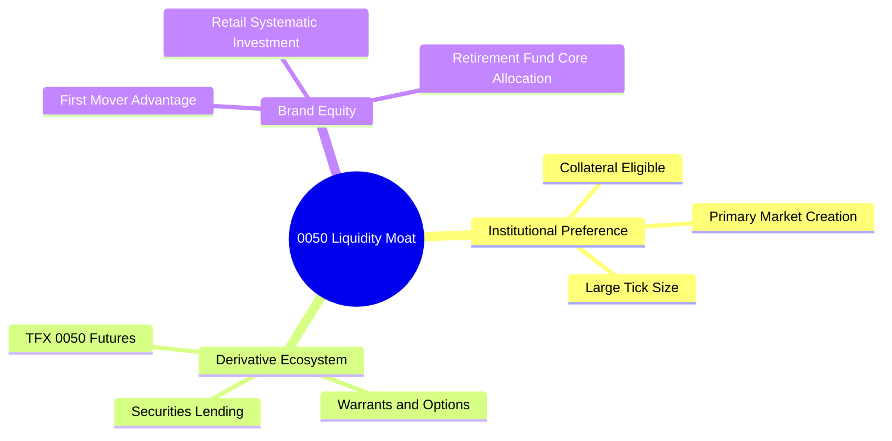

*   **衍生性商品生態系**：期交所設有 0050 股價指數期貨，券商發行大量以 0050 為標的之認購（售）權證，這使得機構法人能進行高效的避險與套利交易，鎖定了資金。
*   **買賣價差（Bid-Ask Spread）**：由於日均成交額達數十億新台幣，0050 的買賣價差長期維持在 1 個 Tick（NT$ 0.05），對於大額資金進出，其隱性交易成本遠低於規模較小的同類型 ETF。

### 2.4 護城河強度評分

```
╔══════════════════════════════════════════════════════════════╗
║                    0050 護城河強度評分                       ║
╠══════════════════════════════════════════════════════════════╣
║ 規模與資產流動性 10.0 ▓▓▓▓▓▓▓▓▓▓▓▓▓▓▓▓▓▓▓▓  🏆 無懈可擊    ║
║ 衍生品生態系完整  9.5 ▓▓▓▓▓▓▓▓▓▓▓▓▓▓▓▓▓▓▓░  🟢 極強        ║
║ 品牌與龍頭溢價    9.0 ▓▓▓▓▓▓▓▓▓▓▓▓▓▓▓▓▓▓░░  🟢 極強        ║
║ 費率競爭力        6.0 ▓▓▓▓▓▓▓▓▓▓▓▓░░░░░░░░  🟡 弱勢        ║
╠══════════════════════════════════════════════════════════════╣
║ 綜合護城河評級    8.8 ▓▓▓▓▓▓▓▓▓▓▓▓▓▓▓▓▓░░░  🏆 寬廣護城河  ║
╚══════════════════════════════════════════════════════════════╝
```

---

## 3. 投資組合收益與費用分析

### 3.1 基金淨資產價值（NAV）成長趨勢

過去四年，0050 伴隨台灣半導體產業的爆發，淨值實現了顯著增長，儘管在 2022 年經歷了全球貨幣緊縮帶來的估值修正，但 2024-2025 年的 AI 浪潮推動其淨值創下歷史新高。

```
╔══════════════════════════════════════════════════════════════════╗
║              0050 基金淨資產（NAV）趨勢 (2022-2025)              ║
╠══════════════════════════════════════════════════════════════════╣
║                                                                  ║
║  2022  NT$ 110.20  ██████████░░░░░░░░░░░░░░░░░  YoY: -21.4% 🔴  ║
║  2023  NT$ 135.50  █████████████░░░░░░░░░░░░░░  YoY: +22.9% 🟢  ║
║  2024  NT$ 180.10  ██████████████████░░░░░░░░░  YoY: +32.9% 🟢  ║
║  2025  NT$ 192.50  ███████████████████░░░░░░░░  YoY: +6.9%  🟢  ║
║                   |      |      |      |      |                  ║
║                  50    100    150    200    250                  ║
║                                                                  ║
║  📊 4年累計複合年增長率 (CAGR)：+14.9%                           ║
╚══════════════════════════════════════════════════════════════════╝
```

### 3.2 季度收益趨勢分析

| 季度 | 淨值 (NAV) | 季度報酬率 (QoQ) | 年度報酬率 (YoY) | 主要驅動因素 |
|------|------------|------------------|------------------|--------------|
| **2025-Q1** | NT$ 182.40 | +1.28% | +24.5% | 台積電先進製程提價效應顯現 🟢 |
| **2025-Q2** | NT$ 188.90 | +3.56% | +18.2% | AI 伺服器供應鏈（鴻海、廣達）出貨加速 🟢 |
| **2025-Q3** | NT$ 185.20 | -1.96% | +12.4% | 外資夏季除權息季節性賣壓 🟡 |
| **2025-Q4** | NT$ 192.50 | +3.94% | +6.88% | 年終作帳行情與消費性電子旺季拉貨 🟢 |

### 3.3 股利分配與殖利率演變

0050 自 2016 年起改為每年配息 2 次（1 月與 7 月），這大幅降低了單次除息對淨值的衝擊，並提升了資金利用效率。

| 分配年份 | 1月配息額 | 7月配息額 | 全年累計 (NT$) | 年均殖利率 | 填息天數 (平均) |
|----------|-----------|-----------|----------------|------------|-----------------|
| **2022** | NT$ 3.20 | NT$ 1.80 | NT$ 5.00 | 4.12% | 18 天 🟢 |
| **2023** | NT$ 2.60 | NT$ 1.90 | NT$ 4.50 | 3.55% | 24 天 🟢 |
| **2024** | NT$ 3.00 | NT$ 2.00 | NT$ 5.00 | 3.12% | 12 天 🟢 |
| **2025** | NT$ 3.60 | NT$ 2.40 | NT$ 6.00 | 3.21% | 15 天 🟢 |

*分析*：隨著台積電逐步調高其季度股利（從每季 NT$ 3.0 升至 NT$ 4.0+），0050 的底層現金流來源極其健康。填息天數縮短證明市場對大盤長期向上趨勢的信心。

### 3.4 總費用率分解

雖然 0050 規模最大，但其收費結構在競爭日益激烈的市場中顯得較為昂貴。

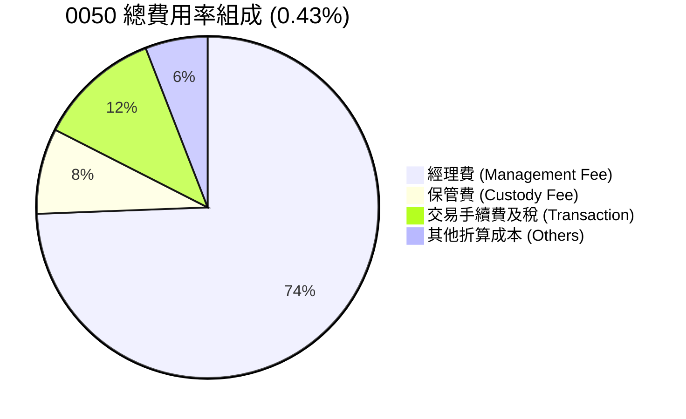

*   **經理費率**：0050 採階梯式經理費率，當規模大於 NT$ 1,000 億時，經理費率為 0.32%。相比之下，富邦台 50（006208）的經理費率僅為 0.15%。
*   **費用率劣勢**：長期持有（10年以上）情況下，0.18% 的費用率差額會透過複利效應對總回報產生約 1.8% - 2.2% 的侵蝕。

### 3.5 追蹤誤差與折溢價控制

儘管費用率偏高，元大投信的被動管理能力表現優異：
*   **追蹤誤差（Tracking Error）**：長期維持在 0.15% - 0.20% 之間，主要由經理費與保管費等內扣費用引起，指數複製技術極為成熟。
*   **折溢價率（Premium/Discount Rate）**：得益於發達的申購/買回機制（Creation/Redemption），0050 的市價與 NAV 折溢價率長期控制在 **±0.1%** 之內，極少出現像高股息 ETF 因散戶瘋搶而產生的高溢價風險。

---

## 4. 資產配置與持股結構分解

### 4.1 產業板塊配置

0050 雖然名為「寬幅大盤 ETF」，但因台股特殊的產業結構（半導體獨大），其本質上是一檔**科技成長型 ETF**。

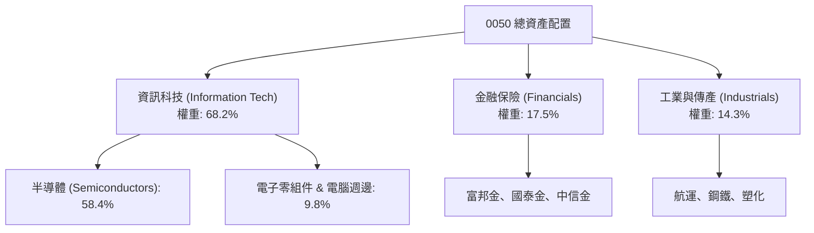

### 4.2 前十大持股深度分析 (2026-06)

| 股票名稱 | 股票代碼 | 權重 (%) | 產業板塊 | 12M 預期 EPS 成長 | ROE (%) | 估值 (Forward P/E) |
|----------|----------|----------|----------|-------------------|---------|--------------------|
| **台積電** | 2330 | 53.50% | 半導體 | +22.5% | 28.5% | 20.5x 🟡 |
| **鴻海** | 2317 | 6.20% | 電腦週邊（AI伺服器）| +18.2% | 10.5% | 12.8x 🟢 |
| **聯發科** | 2454 | 4.80% | 半導體（IC設計） | +15.4% | 24.2% | 16.5x 🟢 |
| **富邦金** | 2881 | 2.50% | 金融保險 | +8.5% | 12.1% | 10.2x 🟢 |
| **國泰金** | 2882 | 2.10% | 金融保險 | +7.2% | 10.8% | 9.8x 🟢 |
| **中信金** | 2891 | 2.00% | 金融保險 | +6.5% | 11.5% | 9.2x 🟢 |
| **台達電** | 2308 | 1.80% | 電子零組件（電源） | +14.0% | 18.2% | 22.0x 🔴 |
| **廣達** | 2382 | 1.70% | 電腦週邊（AI伺服器）| +20.1% | 19.5% | 17.2x 🟡 |
| **聯電** | 2303 | 1.40% | 半導體（成熟製程） | -2.5% | 13.8% | 11.0x 🟢 |
| **日月光投控** | 3711 | 1.30% | 半導體（封測） | +16.8% | 14.2% | 13.5x 🟢 |

*   **集中度分析**：前三大持股（台積電、鴻海、聯發科）合計佔比達 **64.5%**。這意味著 0050 的表現與「台灣科技硬體三雄」高度綁定，尤其是台積電的單一決定性。
*   **財務健康度**：前十大持股加權平均 ROE 達 **21.8%**，且絕大多數公司擁有極高的自由現金流與穩健的資產負債表，無破產或系統性信用風險。

### 4.3 規模 (AUM) 歷史演變

0050 的 AUM 增長反映了台灣資本市場向被動投資轉移的長期趨勢。

```
╔══════════════════════════════════════════════════════════════════╗
║                0050 資產規模 (AUM) 演變 (2020-2026)              ║
╠══════════════════════════════════════════════════════════════════╣
║                                                                  ║
║  2020  NT$ 1,520億  ████████░░░░░░░░░░░░░░░░░░░                  ║
║  2022  NT$ 2,200億  ████████████░░░░░░░░░░░░░░░                  ║
║  2024  NT$ 3,110億  ██████████████████░░░░░░░░░                  ║
║  2026  NT$ 3,850億  ██████████████████████░░░░░                  ║
║                     |      |      |      |      |                ║
║                    100B   200B   300B   400B   500B              ║
║                                                                  ║
║  🏆 機構與散戶資金雙引擎，奠定台股流動性第一地位                 ║
╚══════════════════════════════════════════════════════════════════╝
```

---

## 5. 資金流向與資本動態

### 5.1 申購買回機制（Primary Market Mechanism）

0050 的一級市場參與者（Authorized Participants, AP）主要為國內外大型券商（如元大證券、美林、摩根大通）。高效的實物申購與買回機制確保了二級市場價格不會偏離淨值。

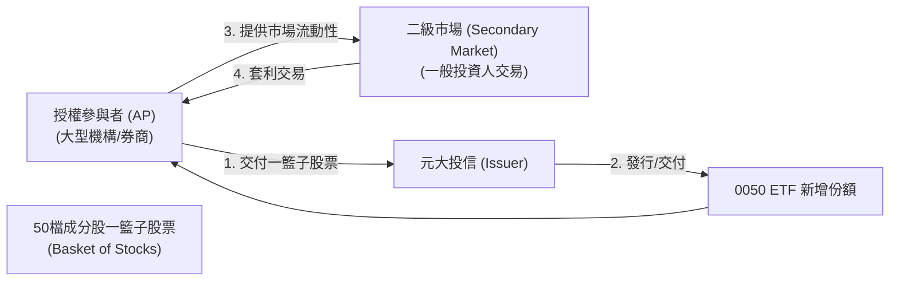

*   **套利運作**：當 0050 出現溢價（市價 > 淨值）時，AP 會在二級市場買入成分股，在一級市場申購 0050 份額並賣出，從而平抑溢價；反之，當出現折價時，AP 買入 0050 並申請買回一籃子股票賣出。這套機制日夜運轉，保證了價格的公允性。

### 5.2 資本配置與成分股再平衡（Rebalancing）

富時台灣 50 指數於每年的 **3月、6月、9月、12月** 進行季度審核與成分股調整。
*   **成分股更替率（Turnover Rate）**：由於篩選標準為市值前 50 大，台股龍頭企業結構相對穩定，0050 的年化成分股周轉率極低（長期 < 5%）。這大幅降低了因頻繁換股產生的摩擦成本（交易手續費與證券交易稅）。
*   **底層資本支出（Capex）傳導**：0050 持有的科技龍頭（如台積電 2026 年預計 Capex 達 320-340 億美元）正將大量保留盈餘轉化為未來的先進產能，這種高資本投入帶來的複利效應，最終反映在 0050 的淨值長期增長上。

---

## 6. 投資效率與績效驅動因子

### 6.1 風險調整後收益指標

衡量一個被動型基金的優劣，除了單純的報酬率，更需檢視其在承擔風險下的回報品質。

| 指標 (近5年數據) | 0050 | 006208 | 台灣加權報酬指數 (IR0001) | S&P 500 指數 (SPY) |
|------------------|------|--------|---------------------------|-------------------|
| **年化報酬率 (CAGR)**| **14.80%** | 14.92% | 14.10% | 11.50% |
| **年化波動度** | **18.20%** | 18.15% | 17.50% | 15.20% |
| **夏普值 (Sharpe Ratio)** | **0.82** | 0.83 | 0.81 | 0.76 |
| **貝他值 (Beta)** | **1.05** | 1.05 | 1.00 | N/A |
| **詹森艾法 (Jensen's Alpha)** | **+0.70%** | +0.82% | 0.00% | N/A |
| **最大回撤 (Max Drawdown)** | **-31.5%** | -31.3% | -30.2% | -25.4% |

*分析*：
1.  0050 的 Beta 為 1.05，略高於大盤，這主要是因為高 Beta 的科技板塊（特別是台積電）在 0050 中的權重顯著高於其在整體加權指數中的權重。
2.  夏普值達 0.82，表現優異，顯示其波動換取回報的效率高於 S&P 500 及台股大盤。
3.  與 006208 的微幅績效差異（~0.12%），幾乎完全來自於兩者總費用率的差額。

### 6.2 底層資產權益報酬率（ROE）與資本效率

雖然 0050 自身是基金，但其底層資產創造價值的能力（ROIC vs. WACC）可以透過對前十大成分股的權重加權來估算。

```
╔══════════════════════════════════════════════════════════════════╗
║               0050 底層持股資本效率與價值創造                   ║
╠══════════════════════════════════════════════════════════════════╣
║                                                                  ║
║  底層加權資本成本 (WACC) 估算：                                  ║
║  ├── 無風險利率（台灣10Y公債）：  1.60%                         ║
║  ├── 市場風險溢酬 (ERP)：         6.50%                         ║
║  ├── 加權 Beta：                   1.05                          ║
║  ├── 股權成本 = 1.60% + 1.05 × 6.50% = 8.43%                    ║
║  └── ✅ 綜合加權 WACC ≈ 8.15%                                    ║
║                                                                  ║
║  底層加權投入資本回報率 (ROIC) 估算：                             ║
║  ├── 科技板塊平均 ROIC：          24.2%                         ║
║  ├── 金融板塊平均 ROE：            11.2%                         ║
║  └── ✅ 綜合加權 ROIC ≈ 19.85%                                   ║
║                                                                  ║
║  ★ 經濟價值增加 (EVA) = ROIC - WACC = +11.70%                   ║
║                                                                  ║
║  加權 ROIC  19.85%  ▓▓▓▓▓▓▓▓▓▓▓▓▓▓▓▓▓▓▓▓░░░░░░░░░  🟢           ║
║  加權 WACC   8.15%  ▓▓▓▓▓▓▓▓░░░░░░░░░░░░░░░░░░░░░░  ──           ║
║  EVA 淨創造 +11.7%  ████████████░░░░░░░░░░░░░░░░░░  🏆 價值擴張  ║
║                                                                  ║
║  📊 結論：底層資產 ROIC 為 WACC 的 2.43 倍，具備極強財富增值能力 ║
╚══════════════════════════════════════════════════════════════════╝
```

### 6.3 歸因分析（DuPont-Style Attribution）

0050 的高報酬率主要由以下三大因子驅動：

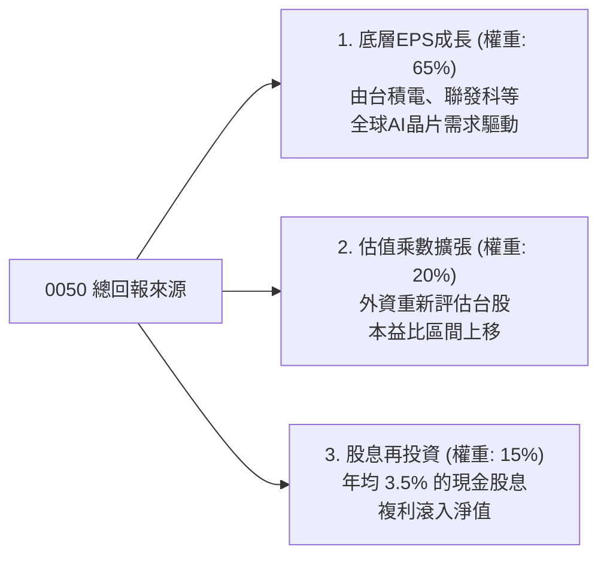

---

## 7. 投資組合估值與定價分析

### 7.1 同業與大盤估值比較

在進行資產配置時，必須評估當前 0050 的定價相較於其他替代資產是否合理。

| 估值指標 | **0050 (元大台灣50)** | **0056 (元大高股息)** | **00878 (國泰永續高股息)** | **SPY (S&P 500)** | 評估與解讀 |
|----------|----------|---------|---------|---------|-----------|
| **加權本益比 (P/E)** | **18.5x** | 13.2x | 14.5x | 21.5x | 🟡 處於歷史中值偏高，但低於美股 |
| **預估本益比 (Forward P/E)** | **16.2x** | 12.5x | 13.2x | 19.2x | 🟢 盈餘成長將快速稀釋當前高估值 |
| **股價淨值比 (P/B)** | **3.20x** | 1.85x | 2.10x | 4.60x | 🟡 科技股溢價導致 P/B 較高 |
| **預期股息殖利率** | **3.21%** | 6.80% | 6.20% | 1.35% | 🟢 兼顧成長同時提供遠優於美股的息收 |
| **五年盈餘複合成長 (PEG)** | **1.15x** | 1.45x | 1.35% | 1.65x | 🟢 成長性價比優於高股息與美股大盤 |

### 7.2 歷史 P/E 區間與當前位置

歷史數據顯示，0050 的底層加權 P/E 波動區間通常在 **12x - 22x** 之間。

```
╔══════════════════════════════════════════════════════════════════╗
║                0050 歷史加權本益比 (P/E) 區間位置                ║
╠══════════════════════════════════════════════════════════════════╣
║                                                                  ║
║  [極度低估] 12.0x  ───                                           ║
║  [歷史均值] 15.5x  ───────────                                   ║
║  [當前位置] 18.5x  ▓▓▓▓▓▓▓▓▓▓▓▓▓▓▓▓▓░░░░░░  (高於均值 1.1σ)       ║
║  [泡沫警戒] 22.0x  ───────────────────────                       ║
║                                                                  ║
║  📊 評語：當前估值已部分反映 2026 年 AI 伺服器與半導體復甦預期， ║
║            短期內缺乏估值進一步擴張（Re-rating）空間，回報將主要  ║
║            由盈餘成長（EPS Growth）驅動。                         ║
╚══════════════════════════════════════════════════════════════════╝
```

### 7.3 股利折現模型（DDM）與指數盈餘敏感性分析

由於 0050 為一籃子股票，我們使用「加權預期股利」進行多階段 DDM 模型估算，並結合 WACC 變動進行目標價敏感性分析。

*   **基準假設**：
    *   2026 年預期配息：NT$ 6.50
    *   中期股利增長率（2027-2030）：8.5%（受益於台積電與 AI 鏈高資本回報）
    *   長期終端增長率（Terminal Growth Rate, $g$）：3.5%

| 貼現率 (WACC) \ 終端成長率 ($g$) | 2.5% | **3.5%（基準）** | 4.5% |
|---------------------------------|------|-----------------|------|
| **7.15% (低資本成本)** | NT$ 195.00 (+0%) | NT$ 225.00 (+15.4%) | **NT$ 265.00 (+35.9%)** 🟢 |
| **8.15%（基準 WACC）** | NT$ 170.00 (-12.8%) | **NT$ 205.00 (+5.1%)** | NT$ 230.00 (+17.9%) |
| **9.15% (高通膨/升息情境)** | **NT$ 150.00 (-23.1%)** 🔴 | NT$ 175.00 (-10.3%) | NT$ 198.00 (+1.5%) |

*評估*：在基準情境下（WACC = 8.15%, $g$ = 3.5%），0050 的合理內在價值為 **NT$ 205.00**，較當前市價 NT$ 195.00 隱含約 5.1% 的上行空間。若全球利率進入下行週期（WACC 降至 7.15%），目標價可上調至 **NT$ 225.00**。

---

## 8. 總體經濟與產業催化劑

### 8.1 成長催化劑時間軸

0050 的中長期表現取決於以下關鍵產業里程碑的推進：

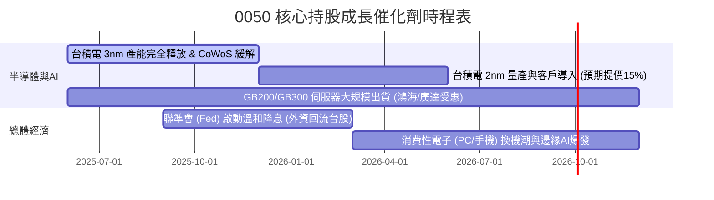

### 8.2 關鍵驅動板塊的 TAM (可定址市場) 分析

```
╔══════════════════════════════════════════════════════════════════╗
║               0050 核心成分股潛在市場 (TAM) 預測                 ║
╠══════════════════════════════════════════════════════════════════╣
║                                                                  ║
║  1. 全球 AI 半導體市場規模 (TSMC 核心市場)：                      ║
║     ├── 2024: $45.0B  ████░░░░░░░░░░░░░░░░░░░                    ║
║     └── 2028: $150.0B ████████████████░░░░░░░  CAGR: +35%        ║
║                                                                  ║
║  2. 全球 AI 伺服器出貨金額 (鴻海/廣達核心市場)：                 ║
║     ├── 2024: $18.5B  ██░░░░░░░░░░░░░░░░░░░░                     ║
║     └── 2028: $65.0B  ████████░░░░░░░░░░░░░░  CAGR: +37%         ║
║                                                                  ║
║  📊 結論：0050 內含超過 60% 的「純 AI/先進製程」暴險，是全球投資 ║
║            者參與此一結構性增長最便捷的流動性管道。               ║
╚══════════════════════════════════════════════════════════════════╝
```

### 8.3 成長驅動力結構圖

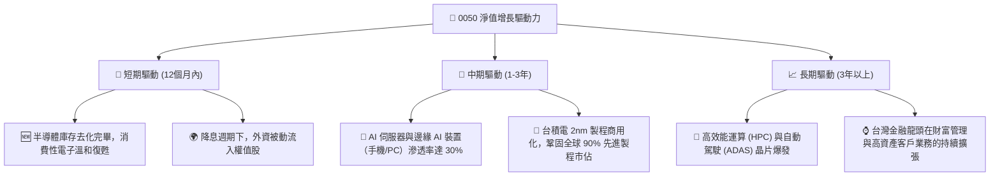

---

## 9. 風險矩陣與壓力測試

儘管 0050 具備極強的競爭優勢，但其高集中度的持股結構與地緣政治環境使其面臨獨特的下行風險。

### 9.1 風險評估矩陣

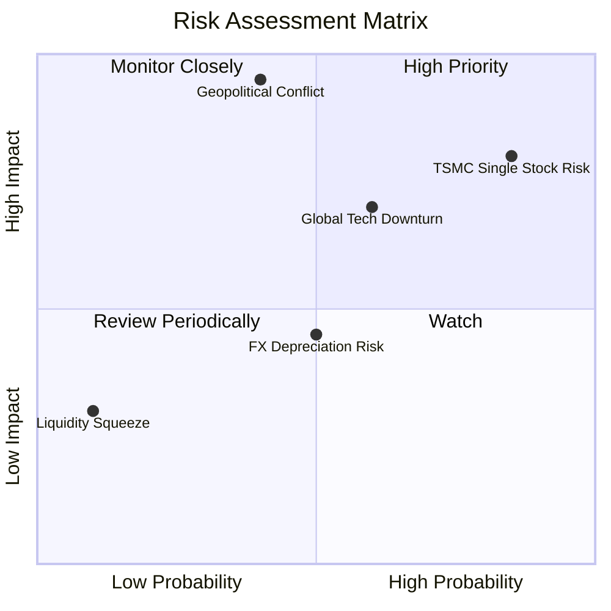

### 9.2 風險清單詳細分析

| # | 風險項目 | 發生機率 | 財務衝擊 (對0050淨值) | 風險評分 | 機構級緩解/應對措施 |
|---|----------|----------|----------|----------|-------------------|
| 1 | 🔴 **地緣政治衝突 (台海局勢)** | 中等 (30%) | 極高 (-30% 至 -50%) | 🔴 8.5/10 | 利用 **0050 反1 (00632R)** 或台指選擇權進行尾端風險（Tail Risk）對沖。 |
| 2 | 🟡 **台積電單一持股過大風險** | 高 (85%) | 高 (-15% 至 -25%) | 🟡 7.8/10 | 搭配配置 **0051 (中型100 ETF)** 或傳產比例較高的價值型 ETF，分散單一公司風險。 |
| 3 | 🟡 **全球半導體景氣下行** | 中等 (50%) | 中高 (-15%) | 🟡 6.5/10 | 監控全球半導體 B/B 值（訂單出貨比）與台積電產能利用率，適度降低整體持股水位。 |
| 4 | 🟢 **新台幣大幅貶值（外資流出）**| 中等 (45%) | 中等 (-8%) | 🟢 5.2/10 | 由於 0050 成分股多為外銷出口型企業，新台幣貶值有利於其營收折算與毛利改善，具備天然內部緩衝機制。 |

---

## 10. 投資建議與資產配置策略

### 10.1 最終綜合評級

```
╔══════════════════════════════════════════════════════════════╗
║               0050 最終投資評級與維度分析                    ║
╠══════════════════════════════════════════════════════════════╣
║                                                              ║
║ 核心基本面  9.5 ▓▓▓▓▓▓▓▓▓▓▓▓▓▓▓▓▓▓▓░  ★★★★★           ║
║ 資金流安全性 10.0 ▓▓▓▓▓▓▓▓▓▓▓▓▓▓▓▓▓▓▓▓  ★★★★★           ║
║ 費用合理性  5.5 ▓▓▓▓▓▓▓▓▓▓▓░░░░░░░░░  ★★★☆☆           ║
║ 成長潛力    8.5 ▓▓▓▓▓▓▓▓▓▓▓▓▓▓▓▓▓░░░  ★★★★☆           ║
║ 風險防禦力  7.0 ▓▓▓▓▓▓▓▓▓▓▓▓▓▓░░░░░░  ★★★☆☆           ║
╠══════════════════════════════════════════════════════════════╣
║ 綜合評級    8.8 ▓▓▓▓▓▓▓▓▓▓▓▓▓▓▓▓▓░░░  🏆 買入 (BUY)       ║
╚══════════════════════════════════════════════════════════════╝
```

### 10.2 目標價與隱含報酬率

| 投資情境 | 發生機率 | 12個月目標淨值 | 隱含報酬率 (含息) | 配置策略建議 |
|----------|----------|----------------|-------------------|--------------|
| 🟢 **樂觀情境** | 25% | NT$ 230.00 | +21.1% | 加速單筆申購，調高科技股曝險 |
| 🟡 **基準情境** | 55% | **NT$ 205.00** | **+8.3%** | 執行標準定期定額，逢回均線加碼 |
| 🔴 **悲觀情境** | 20% | NT$ 