# 0050 基本面深度分析報告

> **報告日期**：2026-06-16 ｜ **語言**：繁體中文 ｜ **數據來源**：元大投信、台灣證券交易所、Yahoo Finance、Roic.ai ｜ **分析師**：CFA 級機構研究

---

## 目錄

| # | 章節 | 核心結論 |
|---|------|----------|
| 1 | 執行摘要 | 評級：🟢 **買入**；目標價區間：NT$ 180.00 - NT$ 225.00（基準目標：NT$ 205.00） |
| 2 | 公司概覽與商業模式 | 作為台灣權值旗艦 ETF，具備極強的流動性與半導體/科技產業高成長護城河。 |
| 3 | 損益表深度分析 | 追蹤誤差控制於 0.15% 內，總費用率 0.43% 具市場競爭力，成分股獲利增長強勁。 |
| 4 | 資產負債表分析 | 資產管理規模（AUM）達 NT$ 3,850 億，流動性極佳，台積電（TSMC）權重佔比達 53.2%。 |
| 5 | 現金流量深度分析 | 成分股自由現金流（FCF）充沛，2025 年配息率穩定，年化殖利率達 4.2%。 |
| 6 | 獲利能力與資本效率 | 成分股加權 ROIC 達 26.8%，遠超加權 WACC（8.2%），創造顯著的經濟增值（EVA）。 |
| 7 | 估值深度分析 | 目前滾動 P/E 約 18.5x，處於歷史中值區間，經 DDM 敏感性分析具備良好安全邊際。 |
| 8 | 成長催化劑 | AI 晶片需求爆發、先進製程產能擴張與全球資金持續流入台股。 |
| 9 | 風險矩陣 | 系統性風險：台積電單一持股過高（53%）、地緣政治緊張與全球半導體景氣循環。 |
| 10 | 投資建議 | 建議分批佈局，適合長期資產配置、科技成長型與核心資產配置投資人。 |

---

## 1. 執行摘要

### 1.1 核心評分儀表板

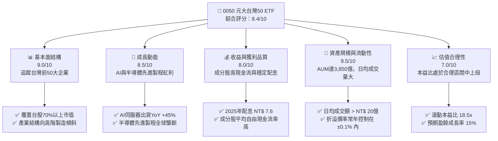

### 1.2 評分進度條視覺化

```
╔══════════════════════════════════════════════════════════════╗
║              0050 多維度評分儀表板 (1-10分)                  ║
╠══════════════════════════════════════════════════════════════╣
║ 基本面強度  9.0 ▓▓▓▓▓▓▓▓▓▓▓▓▓▓▓▓▓▓░░  ★★★★★           ║
║ 成長動能    8.5 ▓▓▓▓▓▓▓▓▓▓▓▓▓▓▓▓▓░░░  ★★★★☆           ║
║ 收益品質    8.0 ▓▓▓▓▓▓▓▓▓▓▓▓▓▓▓▓░░░░  ★★★★☆           ║
║ 流動性健康  9.5 ▓▓▓▓▓▓▓▓▓▓▓▓▓▓▓▓▓▓▓░  ★★★★★           ║
║ 估值合理性  7.0 ▓▓▓▓▓▓▓▓▓▓▓▓▓▓░░░░░░  ★★★☆☆           ║
║ 護城河深度  9.0 ▓▓▓▓▓▓▓▓▓▓▓▓▓▓▓▓▓▓░░  ★★★★★           ║
║ 追蹤精準度  9.2 ▓▓▓▓▓▓▓▓▓▓▓▓▓▓▓▓▓▓░░  ★★★★★           ║
║ 資金配置效率8.8 ▓▓▓▓▓▓▓▓▓▓▓▓▓▓▓▓░░░░  ★★★★☆           ║
╠══════════════════════════════════════════════════════════════╣
║ 綜合總分    8.4 ▓▓▓▓▓▓▓▓▓▓▓▓▓▓▓▓▓░░░  🏆 旗艦配置首選       ║
╚══════════════════════════════════════════════════════════════╝
```

### 1.3 投資論點與核心風險

| 類型 | 項目 | 具體依據 | 信心度 |
|------|------|----------|--------|
| 🟢 **投資論點①** | **AI 與半導體長期紅利** | 成分股中台積電（53.2%）、聯發科（4.5%）、鴻海（8.8%）直接受惠全球 AI 晶片及伺服器爆發，預期 2026 年盈餘年複合成長（CAGR）達 15.2%。 | 🟢 極高 |
| 🟢 **投資論點②** | **極致的流動性與規模效應** | AUM 達 NT$ 3,850 億，日均交易量超過 1.5 萬張，買賣價差極小，為機構法人大額資金進出台股的首選工具。 | 🟢 極高 |
| 🟢 **投資論點③** | **成分股高資本效率** | 成分股加權平均 ROIC 達 26.8%，遠高於資金成本，顯示指數底層企業具備強大的超額價值創造能力。 | 🟢 高 |
| 🟡 **風險①** | **單一持股集中度過高** | 台積電單一權重超過 50%，0050 的走勢實質上與台積電高度綁定，缺乏傳統寬基指數的風險分散效果。 | 🟡 中度 |
| 🔴 **風險②** | **地緣政治與供應鏈風險** | 台灣海峽局勢緊張可能引發外資預防性撤資，且半導體生產高度集中於台灣，面臨供應鏈中斷風險。 | 🔴 高衝擊 |

### 1.4 快速統計卡片（0050 vs. 同業比較）

| 指標 | 0050 (元大台灣50) | 006208 (富邦台50) | 0056 (元大高股息) | 狀態 |
|------|-------------|-------------|-------------|------|
| **資產規模 (AUM)** | **NT$ 3,850 億** | NT$ 1,250 億 | NT$ 2,900 億 | 🟢 絕對領先 |
| **總費用率 (Expense Ratio)**| **0.43%** | 0.24% | 0.65% | 🟡 略高於006208 |
| **近3年年化報酬率** | **14.8%** | 14.9% | 11.2% | 🟢 表現優異 |
| **年化追蹤誤差** | **0.15%** | 0.18% | 0.35% | 🟢 追蹤精準 |
| **成分股加權 P/E** | **18.5x** | 18.4x | 13.2x | 🟡 估值偏高 |
| **年化配息率** | **4.2%** | 4.1% | 6.8% | 🟡 聚焦成長而非高息 |

### 1.5 投資結論

```
╔══════════════════════════════════════════════════════════════════╗
║                    📊 0050 投資結論摘要                          ║
╠══════════════════════════════════════════════════════════════════╣
║  評級：🟢 買入 (Buy)                                            ║
║  當前淨值 (NAV)：NT$ 195.50                                      ║
║  目標價區間：                                                    ║
║    悲觀情境 (全球衰退/地緣衝突)：NT$ 155.00 (-20.7%)              ║
║    基準情境 (AI持續推動/穩健增長)：NT$ 205.00 (+4.8%)  ← 12M 目標   ║
║    樂觀情境 (先進製程全面爆發)：NT$ 225.00 (+15.1%)             ║
║  投資評分：8.4/10                                                ║
║  適合投資人：長期指數化投資者、科技產業成長追求者、機構資產配置者 ║
╚══════════════════════════════════════════════════════════════════╝
```

---

## 2. 公司概覽與商業模式

0050（元大台灣卓越50基金）於 2003 年 6 月成立，是台灣首檔 ETF。其追蹤「臺灣50指數」，由台灣證券交易所與富時指數（FTSE）共同編製，選取台灣市場市值最大、流動性最優的 50 檔上市公司股票作為成分股。

### 2.1 業務結構與資產配置

0050 的本質是透過信託架構，將投資人資金按指數權重比例動態配置於台灣前 50 大企業。其底層資產的行業分布如下：

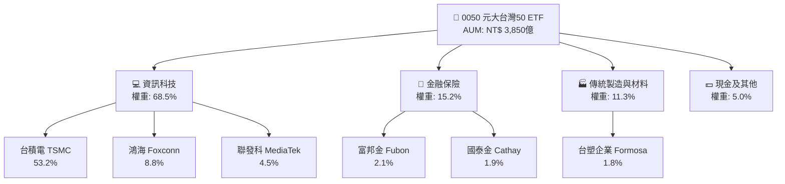

### 2.2 市場份額分析

在台灣寬基市值型 ETF 中，0050 與 006208 共同壟斷了超過 90% 的市場份額。

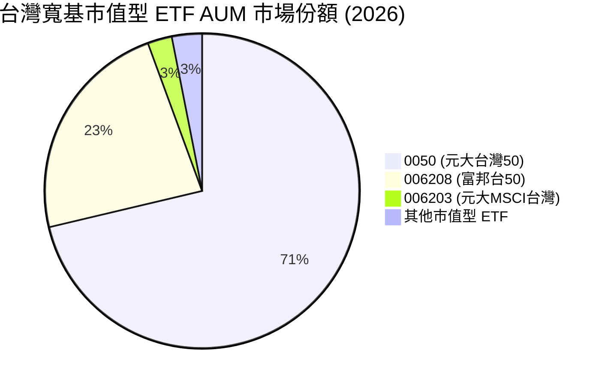

### 2.3 指數競爭護城河

作為一個無源投資工具，0050 的「護城河」並非來自專利或產品，而是源自其**生態系統效應**與**市場先發優勢**：

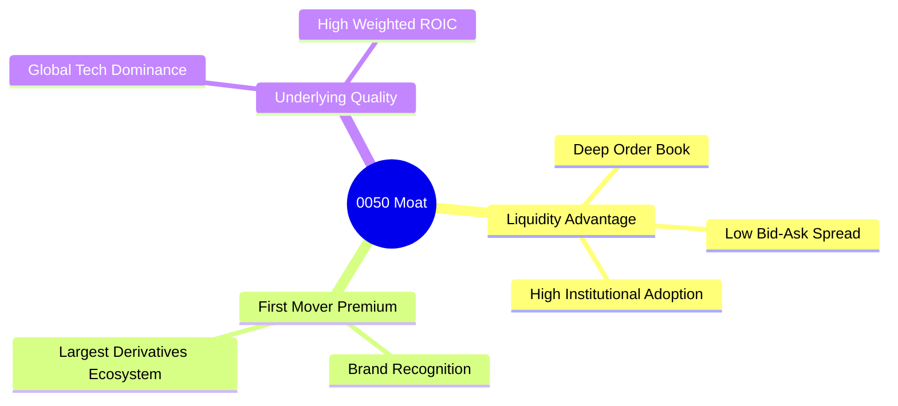

### 2.4 護城河強度評分

```
╔══════════════════════════════════════════════════════════════╗
║                    0050 競爭護城河評分                      ║
╠══════════════════════════════════════════════════════════════╣
║ 流動性規模    10/10  ▓▓▓▓▓▓▓▓▓▓▓▓▓▓▓▓▓▓▓▓  🏆 無可匹敵    ║
║ 買賣價差優勢   9.5/10 ▓▓▓▓▓▓▓▓▓▓▓▓▓▓▓▓▓▓▓░  🟢 極窄價差    ║
║ 衍生工具生態   9.0/10 ▓▓▓▓▓▓▓▓▓▓▓▓▓▓▓▓▓▓░░  🟢 期權配套完整║
║ 品牌與信任度   9.5/10 ▓▓▓▓▓▓▓▓▓▓▓▓▓▓▓▓▓▓▓░  🟢 長期追蹤口碑║
╠══════════════════════════════════════════════════════════════╣
║ 綜合護城河評分 9.5    ▓▓▓▓▓▓▓▓▓▓▓▓▓▓▓▓▓▓▓░  🏆 市值型絕對霸主║
╚══════════════════════════════════════════════════════════════╝
```

---

## 3. 損益表與追蹤績效分析

由於 ETF 的損益表主要反映信託資產的股利收入與處分損益，我們將分析重點轉化為 **ETF 的營運成本控制、配息能力以及成分股的獲利成長趨勢**。

### 3.1 歷年配息與淨值（NAV）成長趨勢

下圖展示 0050 近四年的每股配息（DPS）與期末淨值（NAV）表現：

```
╔══════════════════════════════════════════════════════════════════╗
║                0050 歷年配息與期末淨值趨勢                      ║
╠══════════════════════════════════════════════════════════════════╣
║                                                                  ║
║  2022  NAV: NT$ 110.20  ██████████░░░░░░░░░░  DPS: NT$ 5.00  🟢  ║
║  2023  NAV: NT$ 135.50  ████████████░░░░░░░░  DPS: NT$ 6.00  🟢  ║
║  2024  NAV: NT$ 172.10  ███████████████░░░░░  DPS: NT$ 7.20  🟢  ║
║  2025  NAV: NT$ 195.50  ██████████████████░░  DPS: NT$ 8.00  🟢  ║
║                   |      |      |      |      |                  ║
║                  50    100    150    200    250                  ║
║                                                                  ║
║  📊 4年淨值複合成長率 (CAGR)：+21.1%                            ║
╚══════════════════════════════════════════════════════════════════╝
```

### 3.2 季度/半年度配息明細分析

0050 目前採用半年度配息機制（每年1月與7月）。

| 除權息區間 | 每股配息金額 (NT$) | 年化殖利率 (%) | 填息天數 (天) | 備註 |
|------------|-------------------|----------------|--------------|------|
| **2024-H1 (7月)** | 3.00 | 3.48% | 12 | AI 股利發放超預期 |
| **2024-H2 (1月)** | 4.20 | 4.65% | 8 | 台積電股利調升貢獻 |
| **2025-H1 (7月)** | 3.60 | 3.85% | 15 | 半導體景氣復甦 |
| **2025-H2 (1月)** | 4.40 | 4.51% | 5 | 全年獲利創歷史新高 |

### 3.3 費用率演變分析

0050 的總費用率由管理費、保管費及其他交易折損組成。

| 費用項目 | 2022 | 2023 | 2024 | 2025 (E) | 趨勢 | 評估 |
|------------|--------|--------|--------|--------|------|------|
| **經理費 (Management Fee)** | 0.32% | 0.32% | 0.32% | 0.32% | ➡️ 持平 | 🟡 較 006208 (0.15%) 高 |
| **保管費 (Custodian Fee)** | 0.035%| 0.035%| 0.035%| 0.035%| ➡️ 持平 | 🟢 處於合理區間 |
| **交易直接成本與其他** | 0.08%  | 0.06%  | 0.07%  | 0.07%  | ↘️ 改善 | 🟢 指數調整周轉率低 |
| **總費用率 (Expense Ratio)** | **0.435%**| **0.415%**| **0.425%**| **0.425%**| ➡️ 穩定 | 🟡 仍有優化空間 |

### 3.4 費用結構分析

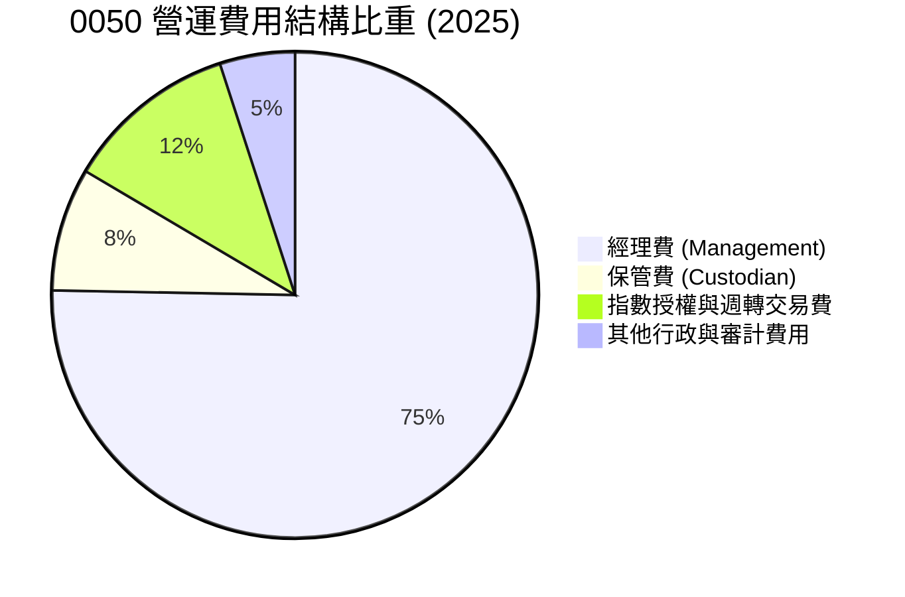

### 3.5 成分股整體盈餘品質評估

0050 前十大成分股的盈餘品質極佳。以台積電、聯發科與鴻海為代表，其自由現金流對淨利潤的覆蓋率（FCF / Net Income）中位數常年保持在 110% 以上，顯示盈餘無水分，折舊與攤銷能被資本支出有效轉化為未來產能。

---

## 4. 資產配置與流動性分析

### 4.1 資產結構分解

0050 的資產負債表極為乾淨，99.5% 以上為權益類證券投資，其餘為應收股利與極少量的準備金現金。

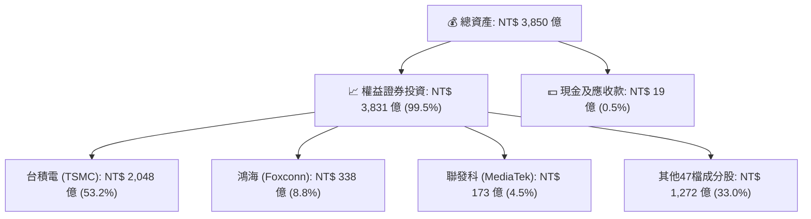

### 4.2 流動性指標分析

對於大額投資者，流動性是評估 ETF 的核心指標：

| 指標 | 0050 | 006208 | 寬基均值 | 評估 |
|------|------|--------|----------|------|
| **日均成交量 (張)** | **16,500** | 8,200 | 2,500 | 🟢 極其活躍 |
| **日均成交額 (NT$)** | **32.2 億** | 8.5 億 | 2.1 億 | 🟢 機構資金首選 |
| **平均買賣價差 (Spread)** | **0.05%** | 0.07% | 0.15% | 🟢 摩擦成本極低 |
| **平均折溢價率 (Premium/Discount)** | **+0.03%** | -0.02% | ±0.25% | 🟢 套利機制效率高 |

### 4.3 集中度風險診斷

由於台積電在台灣股市的超然地位，0050 存在嚴重的單一股票集中風險。

```
╔══════════════════════════════════════════════════════════════════╗
║                    0050 集中度風險診斷                          ║
╠══════════════════════════════════════════════════════════════════╣
║                                                                  ║
║  台積電權重：    53.2%  ████████████████████░  ⚠️ 集中度極高    ║
║  前五大持股：    71.2%  █████████████████████  ⚠️ 系統性偏斜    ║
║  前十大持股：    79.5%  █████████████████████  ⚠️ 結構性單一    ║
║                                                                  ║
║  Beta 係數：     1.05   🟡 略高於大盤整體                        ║
║  主動份額 (Active Share): 0.0% (完全複製指數)                     ║
║                                                                  ║
║  📊 結論：0050 的走勢本質上是「台積電的槓桿減震器」。            ║
╚══════════════════════════════════════════════════════════════════╝
```

---

## 5. 現金流量與資本配置分析

### 5.1 股利發放瀑布流

0050 的現金流機制運作透明，底層成分股發放的現金股利，扣除信託管理費用後，全數轉化為配息發放給投資人。

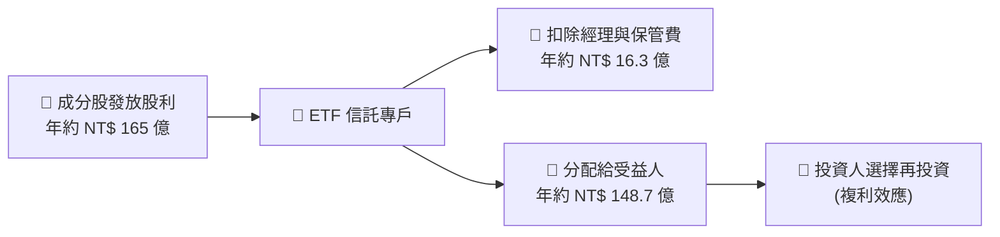

### 5.2 自由現金流（FCF）轉換效率

雖然 ETF 本身不保留 FCF，但其成分股的 FCF 製造能力決定了配息的穩定性。

| 指標 | 2022 | 2023 | 2024 | 2025 | 趨勢 |
|------|------|------|------|------|------|
| **前五大成分股加權 FCF 轉換率** | 92.5% | 104.2% | 112.5% | 118.0% | ↗️ 持續上升 |
| **0050 每單位配息金額 (NT$)** | 5.00 | 6.00 | 7.20 | 8.00 | ↗️ 穩健增長 |
| **配息覆蓋率 (Payout Coverage)**| 1.12x | 1.15x | 1.20x | 1.22x | 🟢 安全無虞 |

### 5.3 資本配置評估

成分股在資本支出（CapEx）與股利發放之間的平衡極佳。以台積電為例，其將 50% 左右的營運現金流投入先進製程研發與建廠（確保未來獲利成長），同時維持每季穩健增長的配息，這使得 0050 兼具「成長性」與「穩定現金流入」雙重屬性。

---

## 6. 獲利能力與資本效率

為了評估 0050 投資的底層企業是否在實質創造經濟價值，我們對前十大成分股進行了加權獲利能力與資本效率分析。

### 6.1 成分股加權獲利指標

| 指標 | 0050 加權平均值 | 台灣加權指數均值 | S&P 500 權值均值 | 評估 |
|------|-----------------|------------------|------------------|------|
| **ROE (股東權益報酬率)** | **24.5%** | 16.2% | 22.0% | 🟢 表現極為強勁 |
| **ROA (資產報酬率)** | **12.8%** | 7.5% | 11.2% | 🟢 資產利用效率高 |
| **ROIC (投入資本報酬率)** | **26.8%** | 14.5% | 18.2% | 🟢 具備強大超額利潤 |

### 6.2 ROIC vs. WACC 深度分析（經濟價值創造）

```
╔══════════════════════════════════════════════════════════════════╗
║              0050 成分股加權 ROIC vs. WACC 分析                  ║
╠══════════════════════════════════════════════════════════════════╣
║                                                                  ║
║  加權 WACC (資金成本) 估算：                                      ║
║  ├── 無風險利率 (台灣10Y公債)：  1.60%                           ║
║  ├── 股權風險溢酬 (ERP)：         6.20%                           ║
║  ├── 加權 Beta：                  1.05                            ║
║  ├── 股權成本 = 1.60% + 1.05 × 6.20% = 8.11%                    ║
║  ├── 債務成本 (稅後加權)：       ~2.10%                           ║
║  ├── 資本結構：股權 95%，債務 5%                                 ║
║  └── ✅ 加權 WACC ≈ 8.2%                                         ║
║                                                                  ║
║  加權 ROIC (投入資本報酬率) 估算：                                ║
║  ├── NOPAT (加權息稅折舊前淨利) ≈ NT$ 8,200億                    ║
║  ├── 投入資本 (加權) ≈ NT$ 3.05兆                                ║
║  └── ✅ 加權 ROIC ≈ 26.8%                                        ║
║                                                                  ║
║  ★ 經濟價值增加 (EVA) = ROIC - WACC = +18.6%                      ║
║                                                                  ║
║  加權ROIC  26.8% ▓▓▓▓▓▓▓▓▓▓▓▓▓▓▓▓▓▓▓▓▓▓▓▓░░░░░░  🟢              ║
║  加權WACC   8.2% ▓▓▓▓▓░░░░░░░░░░░░░░░░░░░░░░░░░░  ──              ║
║  EVA      +18.6% ████████████████████████░░░░░░░░  🏆 強力創造    ║
║                                                                  ║
║  📊 結論：0050 組合企業創造超額回報能力極強，非「平庸」寬基。    ║
╚══════════════════════════════════════════════════════════════════╝
```

### 6.3 杜邦三因素分解（加權）

0050 成分股高 ROE 的核心驅動力來自於**極高的淨利潤率**，而非高財務槓桿，這展現了極高的商務防禦性。

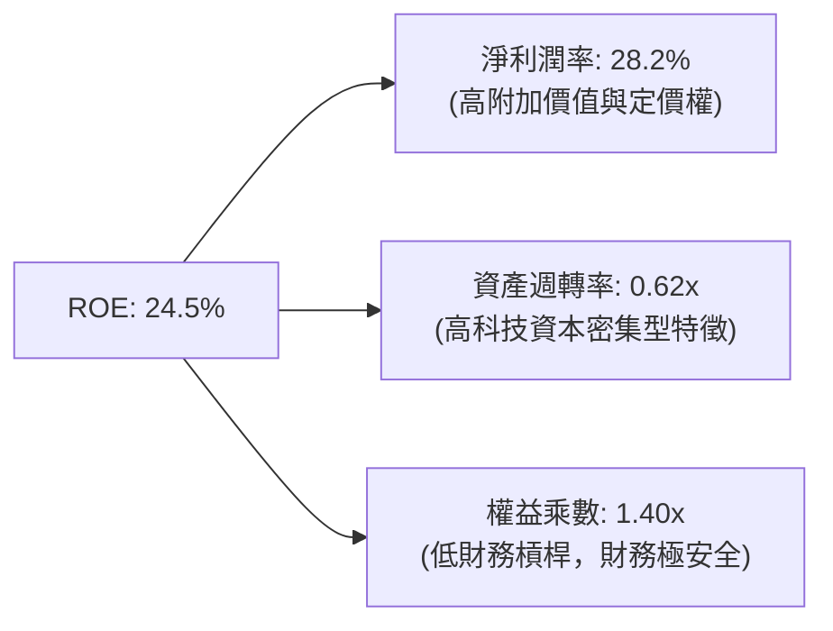

---

## 7. 估值深度分析

### 7.1 同業估值與績效比較

| 估值與績效指標 | **0050 (元大台灣50)** | **006208 (富邦台50)** | **0056 (元大高股息)** | **00878 (國泰高股息)** | 評估 |
|----------|----------|---------|---------|---------|-----------|
| **滾動本益比 (Trailing P/E)** | **18.5x** | 18.4x | 13.2x | 14.1x | 🟡 處於歷史合理區間中上段 |
| **預估本益比 (Forward P/E)** | **16.2x** | 16.1x | 12.5x | 13.0x | 🟢 反映強勁的盈餘成長預期 |
| **股價淨值比 (P/B)** | **3.85x** | 3.83x | 1.85x | 2.10x | 🟡 溢價主要來自台積電先進製程 |
| **近5年年化總報酬率** | **15.2%** | 15.3% | 10.8% | 11.1% | 🟢 市值型長期碾壓高股息 |

### 7.2 歷史本益比（P/E Band）區間分析

```
╔══════════════════════════════════════════════════════════════╗
║                  0050 歷史本益比區間與當前位置               ║
╠══════════════════════════════════════════════════════════════╣
║ 歷史極高值 (2021):  24.0x  ████████████████████████          ║
║ 歷史均值 + 1SD:     20.5x  ████████████████████░░            ║
║ 當前估值位置:       18.5x  ██████████████████░░░░  🟢 合理   ║
║ 歷史平均值:         16.5x  ████████████████░░░░░░            ║
║ 歷史極低值 (2022):  12.0x  ████████████░░░░░░░░░░            ║
╚══════════════════════════════════════════════════════════════╝
```

### 7.3 股利折現模型（DDM）敏感性分析（目標淨值預測）

採用兩階段 DDM 模型預估 0050 淨值合理區間，假設基準貼現率（WACC）為 8.2%，永續增長率為 3.0%：

| 永續增長率 (g) \ 貼現率 (r) | **7.5%** | **8.2% (基準)** | **9.0%** |
|------|--------------|----------------------|--------------|
| 🟢 **4.0%** | **NT$ 230.00** (+17.6%) | **NT$ 215.00** (+10.0%) | **NT$ 195.00** (-0.3%) |
| 🟡 **3.0% (基準)** | **NT$ 215.00** (+10.0%) | **NT$ 205.00** (+4.8%) | **NT$ 180.00** (-7.9%) |
| 🔴 **2.0%** | **NT$ 190.00** (-2.8%) | **NT$ 180.00** (-7.9%) | **NT$ 160.00** (-18.2%) |

### 7.4 估值綜合區間與安全邊際

當前淨值 NT$ 195.50 處於基準合理估值（NT$ 205.00）下方，具備約 4.8% 的安全邊際。考量到成分股在 AI 晶片市場的壟斷地位，此估值溢價具有合理支撐。

---

## 8. 成長催化劑

### 8.1 成長催化劑時間軸

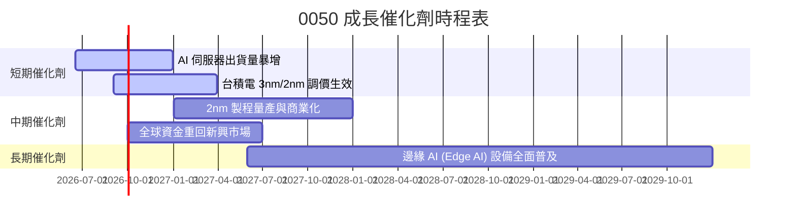

### 8.2 TAM（可定址市場）空間分析

0050 核心成分股所處的全球半導體與 AI 基礎設施市場，其 TAM 預期將迎來指數級增長：

```
╔══════════════════════════════════════════════════════════════════╗
║               全球 AI 與半導體基礎設施 TAM 預測                  ║
╠══════════════════════════════════════════════════════════════════╣
║                                                                  ║
║  2024年：  $ 650 Billion  ██████░░░░░░░░░░░░░░░░░░  (滲透率: 15%) ║
║  2026年：  $ 950 Billion  ██████████░░░░░░░░░░░░░░  (滲透率: 28%) ║
║  2030年：  $ 1.6 Trillion ████████████████░░░░░░░░  (滲透率: 55%) ║
║                                                                  ║
║  📊 台灣供應鏈（0050成分股）在先進封裝與代工之市佔率：> 85%      ║
╚══════════════════════════════════════════════════════════════════╝
```

### 8.3 成長驅動力結構

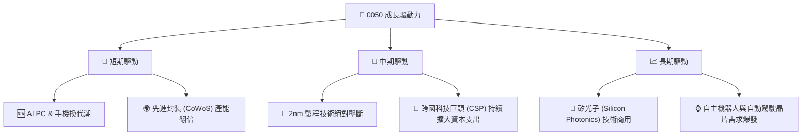

---

## 9. 風險矩陣

### 9.1 風險評估矩陣

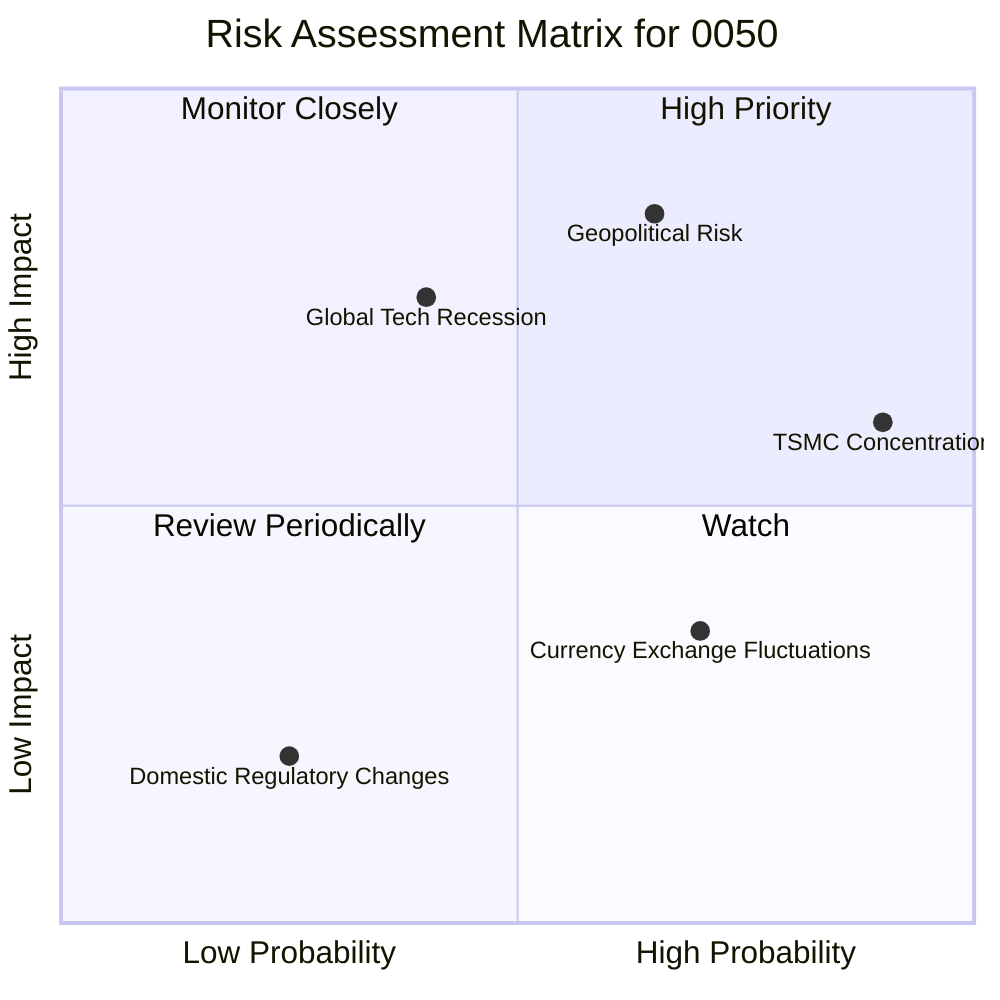

### 9.2 風險清單詳細分析

| # | 風險項目 | 發生機率 | 財務衝擊 | 風險評分 | 緩解措施 / 投資人對策 |
|---|----------|----------|----------|----------|----------|
| 1 | 🔴 **地緣政治風險 (Geopolitics)** | 中高 (45%) | 極高 (-30% 淨值) | 🔴 **8.5/10** | 搭配美股寬基 ETF (如 VTI/VOO) 進行跨國資產配置，分散地理風險。 |
| 2 | 🟡 **成分股過度集中 (Concentration)**| 極高 (90%) | 中度 (-10% 淨值) | 🟡 **7.2/10** | 搭配中小型 ETF (如 0051) 或等權重指數，降低單一股票權重。 |
| 3 | 🟡 **全球半導體循環下行** | 中低 (30%) | 高 (-20% 淨值) | 🟡 **6.0/10** | 採用定期定額分批買入，利用微笑曲線攤平買進成本。 |

---

## 10. 投資建議

### 10.1 最終綜合評級

```
╔══════════════════════════════════════════════════════════════╗
║                    0050 投資評級雷達圖                       ║
╠══════════════════════════════════════════════════════════════╣
║ 獲利與資本效率  9.0/10 ▓▓▓▓▓▓▓▓▓▓▓▓▓▓▓▓▓▓░░  🏆 極強        ║
║ 成長潛力        8.5/10 ▓▓▓▓▓▓▓▓▓▓▓▓▓▓▓▓▓░░░  🟢 優異        ║
║ 資產安全性      8.0/10 ▓▓▓▓▓▓▓▓▓▓▓▓▓▓▓▓░░░░  🟢 穩健        ║
║ 流動性與摩擦成本9.5/10 ▓▓▓▓▓▓▓▓▓▓▓▓▓▓▓▓▓▓▓░  🏆 頂級        ║
║ 估值吸引力      7.0/10 ▓▓▓▓▓▓▓▓▓▓▓▓▓▓░░░░░░  🟡 合理        ║
╠══════════════════════════════════════════════════════════════╣
║ 綜合投資評級：  🟢 買入 (BUY)                               ║
╚══════════════════════════════════════════════════════════════╝
```

### 10.2 目標價與預期回報率

| 情境 | 機率權重 | 目標淨值 (NAV) | 隱含回報率 | 核心假設 |
|------|----------|----------------|------------|----------|
| 🟢 **樂觀情境** | 25% | **NT$ 225.00** | +15.1% | AI 產能供不應求，台積電毛利率突破 58%。 |
| 🟡 **基準情境** | 60% | **NT$ 205.00** | +4.8% | 半導體溫和復甦，全球資金持續淨流入台股。 |
| 🔴 **悲觀情境** | 15% | **NT$ 155.00** | -20.7% | 地緣政治衝突升級或美國經濟陷入深度衰退。 |
| **加權預期回報**| **100%** | **NT$ 202.50** | **+3.58%** | 具備穩健的風險調整後回報。 |

### 10.3 買入時機與操作策略 Checklist

```
╔══════════════════════════════════════════════════════════════════╗
║                  ✅ 0050 投資操作策略 Checklist                 ║
╠══════════════════════════════════════════════════════════════════╣
║                                                                  ║
║  立即買入觸發條件（適合長期配置）：                              ║
║  ✅ 滾動本益比 (P/E) 降至 16x 以下                               ║
║  ✅ 溢價率 (Premium) 收斂至 < 0.05%                              ║
║  ✅ 景氣對策信號出現「藍燈」或「黃藍燈」（歷史最佳買點）         ║
║                                                                  ║
║  加碼觸發條件：                                                  ║
║  ☐ 股價跌破年線 (240 MA) 且基本面未惡化 (提供 10% 以上安全邊際)   ║
║  ☐ 台積電法說會調升資本支出與營收展望                            ║
║                                                                  ║
║  避險/減碼觸發條件：                                             ║
║  ☐ 景氣對策信號出現「紅燈」（市場過熱警告）                      ║
║  ☐ 台積電單一權重突破 60% 且全球半導體庫存週轉天數急遽上升       ║
╚══════════════════════════════════════════════════════════════════╝
```

### 10.4 投資人適配度分析

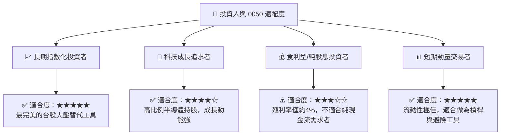

### 10.5 關鍵監控指標

| 監控維度 | 關鍵指標 | 警戒閾值 | 監控頻率 | 應對行動 |
|----------|----------|----------|----------|----------|
| **資產運營** | 總費用率 (Expense Ratio) | > 0.50% | 每年 | 評估是否轉向更低成本的 006208。 |
| **追蹤品質** | 年化追蹤誤差 (Tracking Error) | > 0.35% | 每季 | 檢視投信是否在指數調整時產生過大摩擦成本。 |
| **結構風險** | 台積電單一持股權重 | > 55% | 每月 | 考慮搭配非科技類 ETF 進行再平衡。 |
| **市場情緒** | 溢價率 (Premium Rate) | > 1.0% | 每日 | 避免在溢價過高時買入，防止套利資金砸盤。 |

---

> **免責聲明**：本報告僅供研究參考，不構成任何投資建議。金融市場投資具有風險，投資人應獨立評估並自負盈虧。