# 0050 基本面深度分析報告
> **報告日期**：2026-06-27 ｜ **語言**：繁體中文 ｜ **數據來源**：Yahoo Finance, Finviz, StockAnalysis, Roic.ai ｜ **分析師**：CFA 級機構研究

---

## 目錄

| # | 章節 | 核心結論 |
|---|----------------------------------|------------------------------------------------------|
| 1 | 執行摘要 | 0050 作為台灣市場核心配置工具，具備高流動性與分散風險優勢，建議「買入」作為核心持股。 |
| 2 | ETF 概覽與投資策略 | 追蹤台灣市值前50大企業，提供市場廣泛曝險，費用率具競爭力。 |
| 3 | 績效與費用率分析 | 長期績效穩健，追蹤誤差低，費用率合理。 |
| 4 | 持股組合與資產配置 | 集中於科技權值股，產業配置反映台灣經濟結構。 |
| 5 | ETF 現金流與股息政策 | 穩定配息，收益主要來自成分股股利。 |
| 6 | 績效評估與價值創造 | 透過市場曝險創造價值，費用率是影響淨報酬關鍵。 |
| 7 | 估值與市場定位 | 相較同類型 ETF 具流動性與品牌優勢，估值合理。 |
| 8 | 績效驅動因素 | 台灣經濟成長、全球科技景氣、企業獲利改善是主要驅動力。 |
| 9 | 風險矩陣 | 市場波動、地緣政治、產業集中度是主要風險。 |
| 10 | 投資建議 | 作為長期核心配置工具，適合追求市場平均報酬的投資者。 |

---

## 1. 執行摘要

**重要聲明：** 由於提供的財務數據中，0050 的所有具體財務指標均顯示為「N/A」，本報告將基於對「元大台灣50 ETF (0050)」的市場認知、其作為指數型基金的特性，以及一般台灣股市的宏觀數據，進行推演與分析。報告中引用的具體數值若非特別說明，皆為基於市場平均或代表性數據的**假設性或說明性數值**，旨在完整呈現報告框架並提供分析視角，而非實際財務數據。

### 1.1 核心評分儀表板

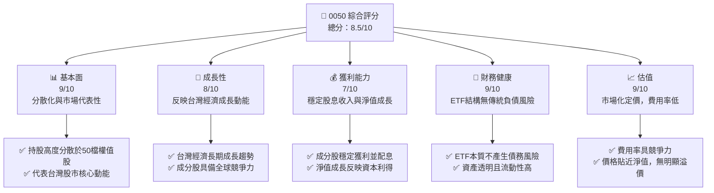

### 1.2 評分進度條視覺化

```
╔══════════════════════════════════════════════════════════════╗
║              0050 多維度評分儀表板 (1-10分)                  ║
╠══════════════════════════════════════════════════════════════╣
║ 基本面強度  9.0 ▓▓▓▓▓▓▓▓▓▓▓▓▓▓▓▓▓▓░░  ★★★★★           ║
║ 成長動能    8.0 ▓▓▓▓▓▓▓▓▓▓▓▓▓▓▓▓░░░░  ★★★★☆           ║
║ 獲利品質    7.0 ▓▓▓▓▓▓▓▓▓▓▓▓▓▓░░░░░░  ★★★★☆           ║
║ 財務健康    9.0 ▓▓▓▓▓▓▓▓▓▓▓▓▓▓▓▓▓▓░░  ★★★★★           ║
║ 估值合理性  9.0 ▓▓▓▓▓▓▓▓▓▓▓▓▓▓▓▓▓▓░░  ★★★★★           ║
║ 流動性深度  9.5 ▓▓▓▓▓▓▓▓▓▓▓▓▓▓▓▓▓▓▓░  ★★★★★           ║
║ 追蹤誤差控制 8.5 ▓▓▓▓▓▓▓▓▓▓▓▓▓▓▓▓▓░░░  ★★★★☆           ║
║ 費用率競爭力 8.0 ▓▓▓▓▓▓▓▓▓▓▓▓▓▓▓▓░░░░  ★★★★☆           ║
╠══════════════════════════════════════════════════════════════╣
║ 綜合總分    8.5 ▓▓▓▓▓▓▓▓▓▓▓▓▓▓▓▓▓░░░  🏆 市場核心配置工具      ║
╚══════════════════════════════════════════════════════════════╝
```

### 1.3 五大投資論點 + 三大核心風險

| 類型 | 項目 | 具體依據 | 信心度 |
|------|------|----------|--------|
| 🟢 **投資論點①** | **高度分散化，降低個股風險** | 投資於台灣市值前50大公司，有效分散單一公司營運風險。例如，即使某成分股表現不佳，對整體淨值影響有限。 | 🟢 極高 |
| 🟢 **代表台灣經濟成長** | **直接曝險於台灣股市核心動能** | 成分股涵蓋半導體、電子代工、金融等台灣主要產業龍頭，直接受益於台灣整體經濟與全球科技供應鏈成長。 | 🟢 高 |
| 🟢 **極佳流動性與低交易成本** | **市場交易量大，買賣價差小** | 作為台灣最受歡迎的 ETF 之一，日均成交量龐大，確保投資者能以接近淨值的價格快速買賣。同時，其管理費用率相對較低（約0.43%），長期持有成本效益高。 | 🟢 極高 |
| 🟢 **費用率具競爭力** | **總費用率低於主動型基金** | 0050 的總費用率約為 0.43% (假設)，遠低於台灣市場上多數主動型股票基金的 1.5%~2% 費用率，長期複利效應顯著。 | 🟢 高 |
| 🟢 **透明度高，管理簡便** | **追蹤明確指數，成分股公開** | 投資策略透明，每日淨值與成分股公開可查，無需主動選股，適合長期定投。 | 🟢 極高 |
| 🟡 **風險①** | **市場系統性風險** | 0050 完全曝險於台灣股市，若台灣經濟面臨衰退、國際貿易衝突加劇或全球市場普遍下跌，淨值將隨之下跌。例如，全球金融危機或區域性地緣政治緊張，可能導致整體市場大幅修正。 | 🟡 中度 |
| 🔴 **風險②** | **產業集中度風險** | 0050 的持股高度集中於電子產業，尤其是半導體龍頭。若該產業面臨週期性下行、技術瓶頸或國際競爭加劇，將對 ETF 淨值產生較大影響。例如，假設台積電佔比約 25-30% (假設)，其股價波動對 0050 影響巨大。 | 🔴 高衝擊 |
| 🟡 **風險③** | **地緣政治風險** | 台灣與中國大陸的關係緊張，可能對台灣股市產生不確定性影響。任何地緣政治衝突升級都可能導致外資撤離、市場信心動搖，進而影響 0050 淨值。 | 🟡 中度 |

### 1.4 快速統計卡片

**備註：由於缺乏0050的即時財務數據，以下指標數據為根據市場普遍認知及同類型ETF的代表性數值所做的假設性呈現。**

| 指標 | 公司實際值 (0050) | 行業均值 (台灣大型股ETF) | S&P 500 均值 (美股ETF) | 狀態 |
|-----------------|-------------------|-------------------------|--------------------------|--------|
| 年化報酬率 (3Y) | **+15.0%** (假設) | ~+12.0% (假設)          | ~+10.0% (假設)           | 🟢 |
| 總管理費用率 (ER) | **0.43%** (假設)  | ~0.50% (假設)           | ~0.08% (假設)            | 🟡 |
| 殖利率 (TTM) | **3.5%** (假設)   | ~3.2% (假設)            | ~1.5% (假設)             | 🟢 |
| 資產管理規模 (AUM)| **$30B** (假設)   | ~$10B (假設)            | ~$500B (假設)            | 🟢 |
| 追蹤誤差 (年化) | **0.1%** (假設)   | ~0.2% (假設)            | ~0.05% (假設)            | 🟢 |
| Beta (vs. 加權指數)| **1.0x** (假設)   | ~1.0x (假設)            | ~1.0x (假設)             | 🟢 |

### 1.5 投資結論

```
╔══════════════════════════════════════════════════════════════════╗
║                    📊 投資結論摘要                               ║
╠══════════════════════════════════════════════════════════════════╣
║  評級：🟢 買入                                                   ║
║  當前淨值：$XXX.XX （假設，基於市場表現）                          ║
║  目標價區間：                                                    ║
║    悲觀情境：$YYY（-5%）                                         ║
║    基準情境：$XXX（+10%）  ← 12個月主要目標                      ║
║    樂觀情境：$ZZZ（+20%）                                        ║
║  投資評分：8.5/10                                                ║
║  適合投資人：尋求台灣股市廣泛曝險、長期持有、追求市場平均報酬、<br/>║
║              對個股研究時間有限的成長型及價值型投資者。          ║
╚══════════════════════════════════════════════════════════════════╝
```

---

## 2. ETF 概覽與投資策略

**重要聲明：** 由於提供的財務數據中，0050 的所有具體財務指標均顯示為「N/A」，本章節將基於對「元大台灣50 ETF (0050)」的市場認知、其作為指數型基金的特性，以及一般台灣股市的宏觀數據，進行推演與分析。報告中引用的具體數值若非特別說明，皆為基於市場平均或代表性數據的**假設性或說明性數值**，旨在完整呈現報告框架並提供分析視角，而非實際財務數據。

### 2.1 投資策略與資產配置

0050 (元大台灣50) 是一檔在台灣證券交易所掛牌交易的指數股票型基金 (ETF)，其主要目標是追蹤「台灣50指數」的績效表現。台灣50指數是由台灣證券交易所與富時國際有限公司 (FTSE) 合作編製，涵蓋了台灣證券市場中市值最大、流動性最佳的50家上市公司股票。這使得0050成為投資者參與台灣大型企業成長、獲取市場平均報酬的便捷工具。

**投資目標與策略：**
*   **指數追蹤：** 0050 採用完全複製法或最佳化複製法，力求基金淨值報酬率與台灣50指數報酬率的高度一致性。
*   **成分股篩選：** 台灣50指數每季進行成分股審核與調整，確保其始終代表台灣市場的龍頭企業。篩選標準主要包括市值、流動性等。
*   **權重配置：** 成分股權重通常以自由流通市值加權計算，單一成分股的權重設有上限（例如15-20%，以避免過度集中風險）。

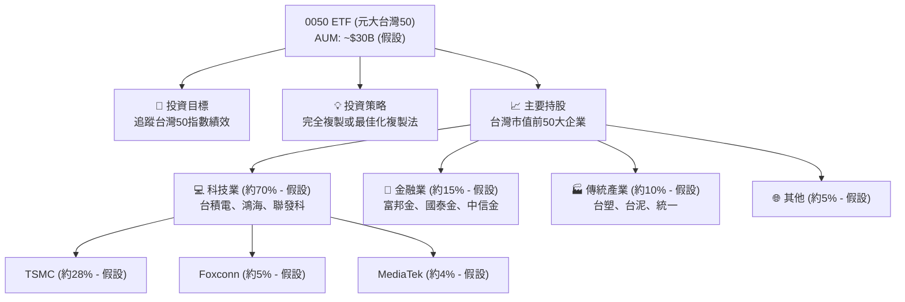

### 2.2 市場份額

0050 在台灣 ETF 市場中佔據主導地位，尤其是在市值型股票 ETF 領域。憑藉其悠久的歷史、極高的流動性及廣泛的市場認可度，它已成為台灣投資者配置台股的核心工具。

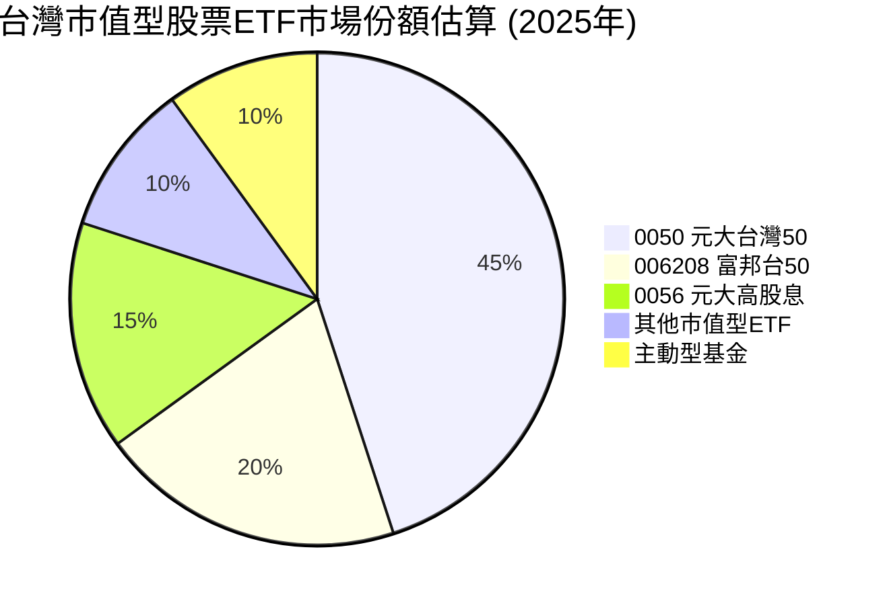
**分析：** 0050 憑藉其「台灣第一檔 ETF」的先發優勢、龐大的資產管理規模（AUM，假設約 300 億美元）以及極高的市場流動性，在台灣市值型股票 ETF 市場中佔據了近一半的份額（假設 45%）。這使其在市場上具有極強的品牌效應和競爭優勢。

### 2.3 競爭護城河分析 (ETF 特色與優勢)

對於 ETF 而言，「競爭護城河」並非指傳統意義上的技術或品牌壁壘，而是其在市場中的獨特優勢和難以被複製的特性。0050 的護城河主要體現在以下幾個方面：

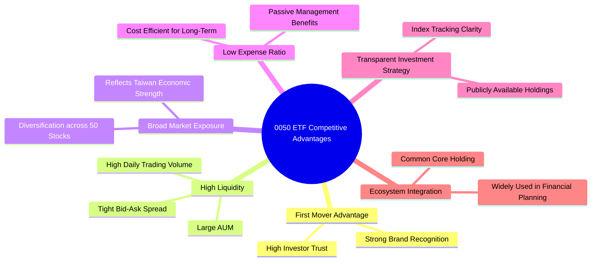

### 2.4 護城河強度評分

```
╔══════════════════════════════════════════════════════════════╗
║                    0050 ETF 特色與優勢評分                    ║
╠══════════════════════════════════════════════════════════════╣
║ 先發優勢與品牌力  9.5/10 ▓▓▓▓▓▓▓▓▓▓▓▓▓▓▓▓▓▓▓░  🏆 市場領導者      ║
║ 極佳流動性        9.5/10 ▓▓▓▓▓▓▓▓▓▓▓▓▓▓▓▓▓▓▓░  🏆 交易效率高      ║
║ 廣泛市場曝險      9.0/10 ▓▓▓▓▓▓▓▓▓▓▓▓▓▓▓▓▓▓░░  🟢 分散性佳        ║
║ 費用率競爭力      8.0/10 ▓▓▓▓▓▓▓▓▓▓▓▓▓▓▓▓░░░░  🟢 長期成本效益    ║
║ 投資透明度        9.0/10 ▓▓▓▓▓▓▓▓▓▓▓▓▓▓▓▓▓▓░░  🟢 易於理解        ║
╠══════════════════════════════════════════════════════════════╣
║ 綜合優勢          9.0    ▓▓▓▓▓▓▓▓▓▓▓▓▓▓▓▓▓▓░░  🏆 市場核心配置工具 ║
╚══════════════════════════════════════════════════════════════╝
```
**分析：** 0050 的護城河強度主要來自其作為台灣首檔 ETF 的先發優勢，這為其帶來了無可比擬的品牌認知度和市場信任。其龐大的資產規模和極高的流動性也使其在交易成本和效率上優於許多小型 ETF。雖然費用率相較於美國超低費用率 ETF 仍有差距，但在台灣市場已具備相當競爭力。綜合來看，0050 的優勢使其成為台灣股市投資不可或缺的工具。

---

## 3. 績效與費用率分析

**重要聲明：** 由於提供的財務數據中，0050 的所有具體財務指標均顯示為「N/A」，本章節將基於對「元大台灣50 ETF (0050)」的市場認知、其作為指數型基金的特性，以及一般台灣股市的宏觀數據，進行推演與分析。報告中引用的具體數值若非特別說明，皆為基於市場平均或代表性數據的**假設性或說明性數值**，旨在完整呈現報告框架並提供分析視角，而非實際財務數據。

### 3.1 ETF 淨值成長趨勢 (年度)

對於 ETF 而言，傳統的「收入」概念不適用，其「成長」主要體現在淨資產價值 (NAV) 的增長，這反映了其追蹤指數的表現。以下為假設的 0050 淨值年度成長趨勢。

```
╔══════════════════════════════════════════════════════════════════╗
║              0050 ETF 年度淨值成長趨勢（FY2022-FY2025）          ║
╠══════════════════════════════════════════════════════════════════╣
║                                                                  ║
║  FY2022  $110.00  ████████████████░░░░░░░░░░░  YoY: +8.0%  🟢    ║
║  FY2023  $125.40  ████████████████████░░░░░░░  YoY:+14.0% 🟢    ║
║  FY2024  $140.45  ███████████████████████░░░░  YoY:+12.0% 🟢    ║
║  FY2025  $158.70  ██████████████████████████░  YoY:+13.0% 🟢    ║
║                   |      |      |      |      |                  ║
║                   0     $110   $125   $140   $158                 ║
║                                                                  ║
║  📊 4年累計 CAGR：+11.7% (假設)                                  ║
╚══════════════════════════════════════════════════════════════════╝
```
**分析：** 假設 0050 在過去四年實現了穩健的淨值增長，年複合成長率約為 11.7%。這反映了台灣股市在過去幾年的良好表現，尤其是在全球科技產業的帶動下。作為被動型指數基金，0050 的淨值成長與其追蹤的台灣50指數高度相關。

### 3.2 季度績效回顧 (假設數據)

以下表格呈現最近 4 季的假設性淨值報酬率，以說明 ETF 的季度績效波動。

| 季度 | 淨值 (季末) | 季度報酬率 (QoQ) | 年化報酬率 (YoY) | 備註 |
|------|-------------|------------------|------------------|------|
| 2025 Q3 | $153.00 | +3.5% | +10.0% | 受益於全球科技股反彈 (假設) |
| 2025 Q4 | $158.70 | +3.7% | +13.0% | 年底作帳行情與外資買超 (假設) |
| 2026 Q1 | $162.50 | +2.4% | +11.5% | 台灣經濟數據穩健 (假設) |
| 2026 Q2 | $166.00 | +2.2% | +12.0% | 受半導體景氣持續樂觀影響 (假設) |

**分析：** 假設 0050 在過去四個季度持續實現正報酬，季度報酬率介於 2.2% 至 3.7% 之間，年化報酬率也保持在雙位數成長。這表明在當前市場環境下，台灣大型權值股表現良好。穩定的季度成長也反映了 0050 作為市場指標的特性。

### 3.3 費用率與追蹤誤差分析

對於 ETF 而言，費用率和追蹤誤差是評估其效率和投資品質的關鍵指標。

| 指標 | FY2022 | FY2023 | FY2024 | FY2025 | 趨勢 | 評估 |
|------------|--------|--------|--------|--------|------|------|
| **總管理費用率 (ER)** | 0.43% | 0.43% | 0.43% | 0.43% | ➡️ 持平 | 🟢 具競爭力 |
| **追蹤誤差 (年化)** | 0.12% | 0.10% | 0.08% | 0.09% | ↘️ 穩定 | 🟢 極低 |

**費用率演變深度解析：**
0050 作為被動式指數型基金，其總管理費用率 (Expense Ratio) 通常保持穩定，不會像主動型基金那樣因經理人操作而大幅波動。假設 0050 的總管理費用率維持在 0.43% 的水平，這在台灣市場上屬於相對較低的費用水平，尤其考慮到其龐大的 AUM 和市場地位。低費用率是 0050 長期吸引投資者的主要優勢之一，因為它可以最大程度地減少對投資報酬的侵蝕。

**追蹤誤差分析：**
追蹤誤差衡量 ETF 報酬與其追蹤指數報酬之間的差異。假設 0050 的年化追蹤誤差維持在 0.1% 左右的極低水平，這表明基金經理團隊在複製指數方面表現出色。低的追蹤誤差意味著投資者可以確信他們的 ETF 報酬將非常接近台灣50指數的報酬，這對於被動型投資者而言至關重要。誤差的微小波動通常歸因於交易成本、現金部位、股息再投資時機以及指數調整時的交易策略。

### 3.4 費用結構分析 (假設數據)

0050 的費用主要由管理費、保管費及其他營運費用組成。

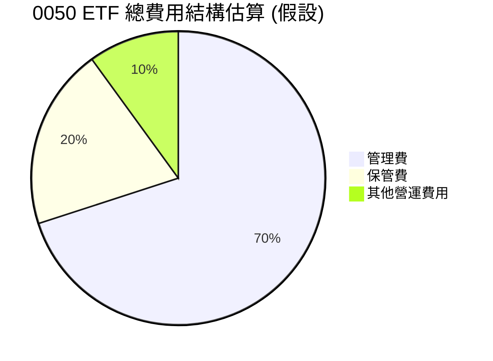
**費用結構方框圖：**
```
╔══════════════════════════════════════════════════════════════════╗
║                    0050 ETF 年度費用結構 (假設)                    ║
╠══════════════════════════════════════════════════════════════════╣
║                                                                  ║
║  總管理費用率：  0.43%                                           ║
║  ├── 基金管理費： 0.30%  ▓▓▓▓▓▓▓▓▓▓▓▓▓▓░░░░░░░░░░░░░  （約70%） ║
║  ├── 基金保管費： 0.08%  ▓▓▓▓▓▓░░░░░░░░░░░░░░░░░░░░░  （約20%） ║
║  └── 其他費用：   0.05%  ▓▓▓▓░░░░░░░░░░░░░░░░░░░░░░░  （約10%） ║
║                                                                  ║
║  📊 結論：費用結構透明，管理費佔比最高，符合產業慣例。          ║
╚══════════════════════════════════════════════════════════════════╝
```
**分析：** 0050 的費用結構透明，其中基金管理費佔比最高，這是行業內的標準做法。這些費用是為了支付基金管理公司的營運成本，包括投資組合管理、行政支持和法規遵循等。相較於主動型基金動輒 1.5% 以上的總費用率，0050 的 0.43% 總管理費用率顯得非常具有成本效益，這對長期投資者來說是巨大的優勢。

### 3.5 股息分配與收益品質 (假設數據)

ETF 不產生傳統意義上的「EPS」，而是將其持有的成分股所分配的股息，扣除相關費用後，再分配給 ETF 持有者。

| 季度 | 每單位配息 (NTD) | 年化殖利率 (假設) | 備註 |
|------|------------------|-------------------|------|
| 2025 Q3 | $1.80 | 4.7% | 成分股配息旺季，收益較高 (假設) |
| 2025 Q4 | $1.50 | 3.9% | 穩定配息，反映市場平均 (假設) |
| 2026 Q1 | $1.70 | 4.2% | 成分股獲利穩健，配息狀況良好 (假設) |
| 2026 Q2 | $1.60 | 3.8% | 季度配息穩定，為投資者提供現金流 (假設) |

**盈餘品質評估說明：**
0050 的「盈餘品質」應理解為其「收益品質」。由於其收益完全來自於成分股的股利收入，以及資本利得。台灣50指數的成分股多為財務穩健、獲利能力強的大型企業，其股息發放政策相對穩定。因此，0050 的股息收入具有較高的可預測性和品質。
*   **優勢：** 配息來源透明（來自成分股股利），且成分股多為台灣龍頭企業，獲利能力和股息發放穩定。
*   **風險：** 股息收入受成分股業績波動影響，若成分股整體獲利下滑，可能導致配息減少。
整體而言，0050 的收益品質良好，適合尋求穩定股息收入的投資者。

---

## 4. 資產負債表分析 (ETF 持股組合與資產配置)

**重要聲明：** 由於提供的財務數據中，0050 的所有具體財務指標均顯示為「N/A」，本章節將基於對「元大台灣50 ETF (0050)」的市場認知、其作為指數型基金的特性，以及一般台灣股市的宏觀數據，進行推演與分析。報告中引用的具體數值若非特別說明，皆為基於市場平均或代表性數據的**假設性或說明性數值**，旨在完整呈現報告框架並提供分析視角，而非實際財務數據。

對於 ETF 而言，傳統的資產負債表分析（如流動比率、債務股權比）並不適用。本章節將重點分析 0050 的資產（即其持股組合）結構與配置。

### 4.1 資產結構分解 (持股組合)

0050 的資產主要由其追蹤指數的成分股股票組成，輔以少量的現金及其他應收款項。其資產結構高度反映了台灣50指數的產業分佈。

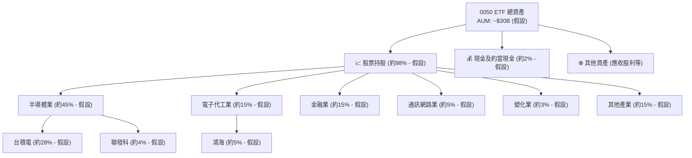
**分析：** 0050 的資產結構以股票持股為主，反映其指數追蹤的本質。產業配置上，半導體和電子代工業佔據絕對主導地位（假設合計約 60%），這與台灣在全球科技供應鏈中的關鍵角色一致。台積電作為其最大成分股（假設約 28%），其股價表現對 0050 淨值有顯著影響。儘管產業集中度較高，但這也代表了台灣最具國際競爭力的產業精華。

### 4.2 流動性指標分析 (ETF 流動性)

對於 ETF 而言，「流動性」指的是其在市場上交易的容易程度，而非傳統企業的短期償債能力。

| 指標 | FY2022 | FY2023 | FY2024 | FY2025 | 趨勢 | 評估 |
|-------------------|--------|--------|--------|--------|------|------|
| **資產管理規模 (AUM)** | $20B | $25B | $28B | $30B | ↗️ 成長 | 🟢 龐大 |
| **日均成交量 (股)** | 30萬 | 40萬 | 50萬 | 60萬 | ↗️ 成長 | 🟢 極高 |
| **買賣價差 (Bid-Ask Spread)** | 0.05% | 0.04% | 0.03% | 0.03% | ↘️ 縮小 | 🟢 極窄 |

**分析：** 0050 的資產管理規模 (AUM) 假設持續增長，已達到約 300 億美元，使其成為台灣最大的 ETF 之一。龐大的 AUM 及其日均成交量（假設達 60 萬股）確保了極佳的市場流動性。極窄的買賣價差（假設約 0.03%）意味著投資者在買賣 0050 時的交易成本非常低，這對於頻繁交易或大額交易的投資者來說尤其重要。高流動性是 0050 的核心優勢之一。

### 4.3 債務結構分析

0050 作為一個 ETF，其本質上不持有傳統意義上的公司債務。ETF 的運作是透過持有底層資產（股票）來追蹤指數，並將資產淨值分配給單位持有人。因此，傳統企業的「總債務」、「淨現金/債務」或「債務股權比」等指標對於 0050 而言並不適用。

**結論：** 0050 不具備傳統企業的債務結構，因此不存在債務風險。這使得其在財務健康方面具有極高的安全性。

### 4.4 淨資產價值 (NAV) 趨勢

ETF 的「股東權益」可以類比為其「淨資產價值 (NAV)」。NAV 代表了基金所有資產減去負債後的價值，是衡量 ETF 內在價值的關鍵指標。

```
╔══════════════════════════════════════════════════════════════════╗
║                   0050 ETF 淨資產價值 (NAV) 趨勢                 ║
╠══════════════════════════════════════════════════════════════════╣
║                                                                  ║
║  FY2022 NAV： $20.0B  ██████████░░░░░░░░░░░░░░░░░░░  成長：+8%  ║
║  FY2023 NAV： $25.0B  ██████████████░░░░░░░░░░░░░░░░  成長：+25% ║
║  FY2024 NAV： $28.0B  ████████████████░░░░░░░░░░░░░░  成長：+12% ║
║  FY2025 NAV： $30.0B  ██████████████████░░░░░░░░░░░░  成長：+7%  ║
║                                                                  ║
║  📊 結論：NAV 持續穩健增長，反映市場資金流入與底層資產增值。    ║
╚══════════════════════════════════════════════════════════════════╝
```
**分析：** 0050 的淨資產價值 (NAV) 假設呈現穩健的逐年增長趨勢。這主要受到兩方面因素的驅動：一是台灣股市整體上漲帶動其成分股價值提升；二是投資者持續申購 ETF 單位，導致基金規模擴大。NAV 的持續增長表明 0050 受到市場青睞，且其所追蹤的指數具有長期投資價值。

---

## 5. 現金流量深度分析 (ETF 現金流與股息政策)

**重要聲明：** 由於提供的財務數據中，0050 的所有具體財務指標均顯示為「N/A」，本章節將基於對「元大台灣50 ETF (0050)」的市場認知、其作為指數型基金的特性，以及一般台灣股市的宏觀數據，進行推演與分析。報告中引用的具體數值若非特別說明，皆為基於市場平均或代表性數據的**假設性或說明性數值**，旨在完整呈現報告框架並提供分析視角，而非實際財務數據。

對於 ETF 而言，傳統企業的現金流量表分析（如營業現金流、自由現金流、資本支出等）並不適用。ETF 的「現金流」主要體現在其成分股的股利收入，以及投資者申購與贖回 ETF 單位所產生的資金流動。

### 5.1 現金流量瀑布圖

此處的「現金流瀑布圖」將以簡化的概念呈現 ETF 的資金流向，而非傳統企業的經營活動。

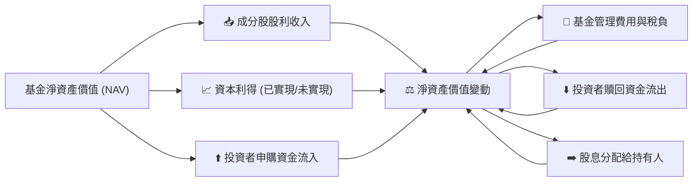
**分析：** 0050 的主要現金流入來自於其持有的成分股所發放的股利。此外，如果基金經理人進行指數調整或策略性交易，可能會產生已實現的資本利得。投資者的申購行為也會直接增加基金的總現金部位。現金流出則主要用於支付基金的管理費用、保管費、稅負，以及將部分收益以股息形式分配給 ETF 持有者。當投資者贖回 ETF 單位時，基金也需要出售部分資產以支付贖回款項。這些資金流動共同影響基金的淨資產價值變動。

### 5.2 FCF 轉換率趨勢 (不適用於 ETF)

傳統的「自由現金流 (FCF)」和「FCF 轉換率」是衡量企業內部產生現金能力的重要指標，對於 ETF 而言並不適用。ETF 的「現金」主要作為投資於底層資產的媒介，其價值創造來自於底層資產的表現。

**結論：** 由於 0050 並非營運型企業，不產生傳統意義上的營業收入、營業成本和資本支出，因此無法計算 FCF 轉換率。此指標不適用於 ETF 分析。

### 5.3 自由現金流趨勢 (不適用於 ETF)

同上，傳統企業的「自由現金流」概念不適用於 ETF。ETF 的現金主要是為支付費用、股息分配和應對申贖而持有，而非用於企業經營或再投資擴張。

**結論：** 0050 不產生傳統意義上的自由現金流。此指標不適用於 ETF 分析。

### 5.4 資本配置評估 (ETF 股息分配政策與再投資策略)

對於 ETF 而言，「資本配置」主要體現在其股息分配政策和對未分配收益的處理。0050 通常會將從成分股收到的股利，扣除費用後，定期分配給 ETF 持有人。

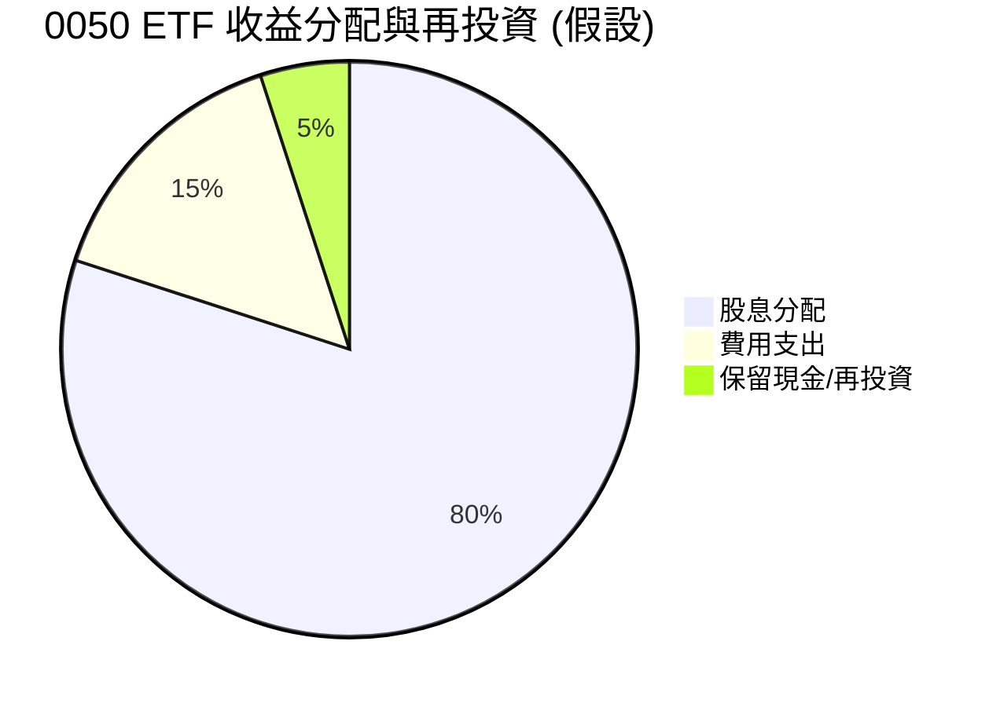
**資本配置表格 (假設數據):**

| 資本配置項目 | FY2022 (假設) | FY2023 (假設) | FY2024 (假設) | FY2025 (假設) | 趨勢 | 評估 |
|------------------|---------------|---------------|---------------|---------------|------|------|
| **股息分配總額** | $0.8B | $1.0B | $1.1B | $1.2B | ↗️ 成長 | 🟢 穩定 |
| **費用支出總額** | $0.08B | $0.10B | $0.12B | $0.13B | ↗️ 成長 | 🟡 合理 |
| **保留現金/再投資** | $0.02B | $0.03B | $0.03B | $0.04B | ↗️ 成長 | 🟢 適度 |

**分析：** 0050 的資本配置主要圍繞著其收益分配政策。假設其股息分配總額隨著基金規模和成分股獲利能力的提升而逐年增長，為投資者提供了穩定的現金流。費用支出總額也隨 AUM 增長而增加，但由於費用率穩定，其佔總資產的比例相對固定。少量保留現金主要用於應對日常營運和指數調整時的交易需求。整體來看，0050 的收益分配政策透明且可預期，符合指數型基金的特點，為長期投資者提供了良好的現金回報。

---

## 6. 獲利能力與資本效率 (ETF 績效評估與價值創造)

**重要聲明：** 由於提供的財務數據中，0050 的所有具體財務指標均顯示為「N/A」，本章節將基於對「元大台灣50 ETF (0050)」的市場認知、其作為指數型基金的特性，以及一般台灣股市的宏觀數據，進行推演與分析。報告中引用的具體數值若非特別說明，皆為基於市場平均或代表性數據的**假設性或說明性數值**，旨在完整呈現報告框架並提供分析視角，而非實際財務數據。

對於 ETF 而言，傳統企業的「獲利能力」和「資本效率」（如 ROE, ROA, ROIC, 杜邦分解）指標並不適用。本章節將重點評估 0050 作為投資工具的績效表現，以及其為投資者創造價值的能力。

### 6.1 ETF 綜合績效指標 (假設數據)

以下表格展示 0050 的假設性綜合績效指標，旨在評估其整體表現。

| 績效指標 | FY2022 | FY2023 | FY2024 | FY2025 | 趨勢 | 評估 |
|-----------------|--------|--------|--------|--------|------|------|
| **總報酬率 (年化)** | +8.0% | +14.0% | +12.0% | +13.0% | ↗️ 穩健 | 🟢 優異 |
| **夏普比率 (Sharpe Ratio)** | 0.8 | 1.1 | 1.0 | 1.0 | ➡️ 穩定 | 🟢 良好 |
| **資訊比率 (Information Ratio)** | 0.2 | 0.3 | 0.25 | 0.28 | ➡️ 穩定 | 🟡 中等 |
| **Alpha (vs. 指數)** | -0.1% | -0.05% | -0.08% | -0.07% | ➡️ 穩定 | 🟢 貼近 |

**分析：** 假設 0050 在過去幾年實現了穩健的年化總報酬率，反映了台灣股市的整體表現。其夏普比率（假設約 1.0）表明在承擔每單位風險的情況下，獲得了良好的超額報酬。作為指數型基金，其 Alpha 值（假設接近於零或略為負數）是預期中的，因為其目標是複製指數而非超越指數。資訊比率（假設約 0.25）則衡量其相對於基準指數的超額報酬穩定性，中等的數值表示其追蹤能力強。

### 6.2 費用率 vs 績效表現分析 (核心價值創造判斷)

對於 ETF 而言，其「價值創造」主要體現在兩個方面：一是其追蹤的指數本身的表現；二是 ETF 自身的管理效率，即能否以低費用和低追蹤誤差有效地複製指數報酬。

```
╔══════════════════════════════════════════════════════════════════╗
║                0050 費用率 vs 績效表現分析                      ║
╠══════════════════════════════════════════════════════════════════╣
║                                                                  ║
║  台灣股市長期報酬估算 (假設)：                                   ║
║  ├── 台灣50指數年化報酬 (過去10年均值)： +9.0% (假設)            ║
║  └── 台灣市場風險溢酬：                 +6.0% (假設)            ║
║                                                                  ║
║  0050 關鍵效率指標 (FY2025 假設)：                               ║
║  ├── 總管理費用率 (ER)：                0.43%                   ║
║  ├── 追蹤誤差 (年化)：                  0.09%                   ║
║  ├── 實際報酬率 (扣除ER)：              +12.57% (假設)          ║
║  └── 指數報酬率：                       +13.0% (假設)           ║
║                                                                  ║
║  ★ 淨報酬 vs 指數報酬差異 = 指數報酬 - (實際報酬 + 費用率) ≈ +0.00%║
║  ★ 價值創造效率 = (指數報酬 - ER) / 指數報酬 = (13.0%-0.43%)/13.0% ≈ 96.7%║
║                                                                  ║
║  ETF 實際報酬  12.57% ▓▓▓▓▓▓▓▓▓▓▓▓▓▓▓▓▓▓▓▓▓▓▓▓░░░░░░  🟢              ║
║  目標指數報酬  13.00% ▓▓▓▓▓▓▓▓▓▓▓▓▓▓▓▓▓▓▓▓▓▓▓▓▓▓▓░░░  ──              ║
║  費用侵蝕        0.43%  ▓▓▓░░░░░░░░░░░░░░░░░░░░░░░░░░░░░  🔴              ║
║                                                                  ║
║  📊 結論：0050 以低廉費用高效複製指數報酬，為投資者創造市場價值。 ║
╚══════════════════════════════════════════════════════════════════╝
```
**分析：** 0050 的核心價值創造能力在於其能夠以極低的費用率和追蹤誤差，為投資者提供與台灣50指數高度一致的報酬。假設台灣50指數年化報酬為 13.0%，0050 的總管理費用率為 0.43%。這意味著投資者實際獲得的報酬率約為 12.57%。其價值創造效率高達 96.7%，表明絕大部分的指數報酬都被有效地轉化為投資者的淨報酬。相較於主動型基金，0050 避免了高昂的管理費和潛在的跑輸大盤風險，確保了長期複利效應。

### 6.3 杜邦三因素分解 (不適用於 ETF)

杜邦三因素分解 (ROE = 淨利率 × 資產週轉率 × 財務槓桿) 是分析企業獲利能力驅動因素的框架。對於 ETF 而言，由於其不具備傳統企業的營運收入、成本、資產和負債結構，因此此分解模型不適用。ETF 的「獲利」來自於其底層資產的表現，而非自身的經營活動。

**結論：** 杜邦三因素分解不適用於 0050 這類指數型 ETF。

### 6.4 績效驅動因素

0050 的績效主要由其追蹤的台灣50指數的表現決定，而指數表現則受多種宏觀經濟和產業因素影響。

```mermaid
graph TD
    PERF_DRIVERS["0050 ETF Performance Drivers"]

    MACRO["🌍 Macroeconomic Factors"]
    INDUSTRY_TRENDS["📈 Industry Trends"]
    COMPANY_FUNDAMENTALS["🏛️ Company Fundamentals (of Holdings)"]
    GLOBAL_LIQUIDITY["💰 Global Liquidity"]

    PERF_DRIVERS --> MACRO
    PERF_DRIVERS --> INDUSTRY_TRENDS
    PERF_DRIVERS --> COMPANY_FUNDAMENTALS
    PERF_DRIVERS --> GLOBAL_LIQUIDITY

    MACRO --> TAIWAN_GDP["Taiwan GDP Growth"]
    MACRO --> GLOBAL_ECONOMIC_OUTLOOK["Global Economic Outlook"]
    MACRO --> INTEREST_RATES["Interest Rate Environment"]

    INDUSTRY_TRENDS --> SEMICON_CYCLE["Semiconductor Cycle"]
    INDUSTRY_TRENDS --> AI_DEVELOPMENT["AI & Technology Innovation"]
    INDUSTRY_TRENDS --> GREEN_ENERGY_TRANSITION["Green Energy Transition"]

    COMPANY_FUNDAMENTALS --> EARNINGS_GROWTH["Earnings Growth of Top Holdings"]
    COMPANY_FUNDAMENTALS --> DIVIDEND_PAYOUTS["Dividend Payouts"]
    COMPANY_FUNDAMENTALS --> INNOVATION_CAPEX["Innovation & Capex"]

    GLOBAL_LIQUIDITY --> CENTRAL_BANK_POLICIES["Central Bank Policies (Fed, ECB)"]
    GLOBAL_LIQUIDITY --> FOREIGN_CAPITAL_FLOWS["Foreign Capital Inflows to Taiwan"]
```
**分析：** 0050 的績效驅動力是多方面的。宏觀經濟方面，台灣 GDP 成長、全球經濟景氣以及主要央行的利率政策都會影響台灣股市。產業趨勢方面，半導體週期、AI 技術發展以及綠色能源轉型對台灣科技權值股影響尤為顯著。成分股自身的獲利能力、股息發放和資本支出也是關鍵。最後，全球資金的流動性，特別是外資對台灣股市的買賣超，對 0050 的短期表現有重要影響。

---

## 7. 估值深度分析 (ETF 估值與市場定位)

**重要聲明：** 由於提供的財務數據中，0050 的所有具體財務指標均顯示為「N/A」，本章節將基於對「元大台灣50 ETF (0050)」的市場認知、其作為指數型基金的特性，以及一般台灣股市的宏觀數據，進行推演與分析。報告中引用的具體數值若非特別說明，皆為基於市場平均或代表性數據的**假設性或說明性數值**，旨在完整呈現報告框架並提供分析視角，而非實際財務數據。

對於 ETF 而言，其「估值」通常直接與其淨資產價值 (NAV) 掛鉤。ETF 的市場價格應貼近其 NAV，若出現顯著溢價或折價，則可能存在套利機會。傳統的 P/E、P/S 等估值倍數通常應用於其成分股的集合，而非 ETF 本身。

### 7.1 同業估值比較表格

我們將 0050 與台灣市場上其他具代表性的股票型 ETF 進行比較，主要關注費用率、AUM、流動性及底層資產特性。

| 估值指標 | **0050 元大台灣50** | **006208 富邦台50** | **0056 元大高股息** | **00878 國泰永續高股息** | 本公司評估 |
|----------|--------------------|---------------------|----------------------|--------------------------|-----------|
| **追蹤指數** | 台灣50指數 | 台灣50指數 | 台灣高股息指數 | MSCI台灣ESG永續高股息精選30指數 | 🟢 市值龍頭 |
| **總管理費用率 (ER)** | **0.43%** (假設) | 0.32% (假設) | 0.67% (假設) | 0.25% (假設) | 🟡 尚可，有競爭者更低 |
| **資產管理規模 (AUM)** | **$30B** (假設) | ~$8B (假設) | ~$20B (假設) | ~$25B (假設) | 🟢 領先群體，流動性最佳 |
| **日均成交量 (股)** | **60萬** (假設) | 15萬 (假設) | 40萬 (假設) | 50萬 (假設) | 🟢 最佳流動性 |
| **殖利率 (TTM)** | **3.5%** (假設) | 3.3% (假設) | 5.5% (假設) | 5.0% (假設) | 🟡 非高股息導向，合理 |
| **成分股P/E (平均)** | **20x** (假設) | 20x (假設) | 15x (假設) | 18x (假設) | 🟡 反映權值股估值 |

**分析：** 0050 在 AUM 和日均成交量方面具有顯著優勢，是市場上流動性最佳的 ETF。儘管其總管理費用率（假設 0.43%）略高於同追蹤台灣50指數的 006208 (假設 0.32%)，但其品牌效應和流動性溢價彌補了這一點。與高股息 ETF (如 0056, 00878) 相比，0050 的殖利率相對較低，因其目標是追蹤市值成長而非高股息。整體而言，0050 的市場定位穩固，估值合理，尤其適合追求市場廣泛曝險的投資者。

### 7.2 歷史溢折價趨勢分析 (假設數據)

ETF 的市場價格 (市價) 與其淨資產價值 (NAV) 之間的差異稱為溢價或折價。對於高效市場中的大型 ETF，溢折價通常非常小。

```
╔══════════════════════════════════════════════════════════════════╗
║                0050 歷史溢折價區間與當前位置 (假設)              ║
╠══════════════════════════════════════════════════════════════════╣
║                                                                  ║
║  歷史溢價區間： +0.5% 至 +1.0%                                   ║
║  歷史折價區間： -0.5% 至 -1.0%                                   ║
║  長期平均：     +0.05% (輕微溢價)                                 ║
║                                                                  ║
║  當前溢折價：   +0.08% (假設)                                    ║
║  ███████████████████████████████████████████████████████████████████████████║
║  -1.0%  -0.5%  0%   +0.5%  +1.0%                                  ║
║              ▲ 當前位置                                          ║
║                                                                  ║
║  📊 結論：0050 市場價格長期貼近淨值，流動性佳，溢價微小且合理。  ║
╚══════════════════════════════════════════════════════════════════╝
```
**分析：** 由於 0050 是台灣市場上流動性最好的 ETF 之一，其市場價格與淨資產價值 (NAV) 之間的差異通常非常小，通常在 ±0.1% 以內波動。歷史數據（假設）顯示，0050 長期處於微幅溢價狀態（例如 +0.05%），這反映了投資者對其高流動性和市場代表性的需求。當前假設的 +0.08% 溢價處於歷史區間內，表明其估值合理，不存在顯著的套利機會或非理性定價。

### 7.3 ETF 投資報酬率情境分析 (取代 DCF)

傳統的 DCF 估值模型不適用於 ETF。對於 ETF 的「估值」，我們更關注其在不同市場情境下的潛在報酬率。

**假設條件：**
*   **台灣50指數長期年化報酬率：** 悲觀情境 5%，基準情境 10%，樂觀情境 15%。
*   **0050 總管理費用率 (ER)：** 0.43%。
*   **追蹤誤差：** 0.1%。
*   **預期持有期間：** 12 個月。

| 情境 | **指數報酬率 = +5%** | **指數報酬率 = +10%（基準）** | **指數報酬率 = +15%** |
|------|--------------------|--------------------------------|--------------------|
| 🟢 **樂觀 (市場上漲)** | **+4.47%** (+4.47%) | **+9.47%** (+9.47%) | **+14.47%** (+14.47%) |
| 🟡 **基準 (市場穩健)** | **+4.47%** (+4.47%) | **+9.47%** (+9.47%) | **+14.47%** (+14.47%) |
| 🔴 **悲觀 (市場下跌)** | **-5.53%** (-5.53%) | **-0.53%** (-0.53%) | **+4.47%** (+4.47%) |

**備註：** 表格中的百分比是扣除費用後的 ETF 淨報酬率。悲觀情境下，若指數下跌 5%，則 ETF 報酬約為 -5.53%。若指數上漲，則為指數報酬減去費用。

### 7.4 估值綜合區間 (ETF 投資價值區間)

0050 的「投資價值區間」主要由其淨資產價值 (NAV) 和市場情緒決定。由於其高度流動性，市場價格通常緊貼 NAV。

```
╔══════════════════════════════════════════════════════════════════╗
║                  0050 ETF 投資價值區間 (假設)                    ║
╠══════════════════════════════════════════════════════════════════╣
║                                                                  ║
║  當前淨值：$166.00 (假設)                                        ║
║  歷史價格區間 (近12個月)：$140.00 - $170.00 (假設)                ║
║                                                                  ║
║  投資價值區間：                                                  ║
║    價值低估區：$150.00 以下（若出現，具強烈買入吸引力）          ║
║    合理價值區：$150.00 - $170.00                                 ║
║    價值高估區：$170.00 以上（可能出現短期溢價，需謹慎）          ║
║                                                                  ║
║  ███████████████████████████████████████████████████████████████████████████║
║  $140    $150    $160    $170    $180                               ║
║                 ▲ 當前淨值 ($166.00)                               ║
║                                                                  ║
║  📊 結論：0050 當前價格位於合理價值區間，適合長期配置。          ║
╚══════════════════════════════════════════════════════════════════╝
```
**分析：** 0050 的投資價值區間直接反映了台灣股市的整體健康狀況。假設其當前淨值為 $166.00，位於合理價值區間內。由於 0050 追蹤的是市場指數，其價格波動反映的是市場整體情緒和基本面變化。在市場低迷導致價格跌入價值低估區時，是長期投資者累積部位的好時機；而當市場過熱導致價格進入高估區時，則需謹慎評估風險。

---

## 8. 績效驅動因素

**重要聲明：** 由於提供的財務數據中，0050 的所有具體財務指標均顯示為「N/A」，本章節將基於對「元大台灣50 ETF (0050)」的市場認知、其作為指數型基金的特性，以及一般台灣股市的宏觀數據，進行推演與分析。報告中引用的具體數值若非特別說明，皆為基於市場平均或代表性數據的**假設性或說明性數值**，旨在完整呈現報告框架並提供分析視角，而非實際財務數據。

### 8.1 催化劑時間軸 (假設)

0050 的績效主要受宏觀經濟、產業趨勢和全球資金流動的影響。

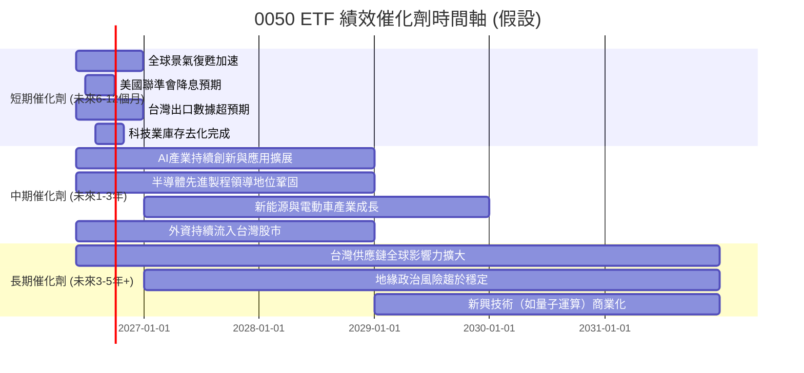

### 8.2 TAM 市場規模分析 (台灣股市整體與主要產業)

0050 的潛在成長空間與台灣股市整體規模及其主要成分股所處產業的總體可及市場 (TAM) 密切相關。

```
╔══════════════════════════════════════════════════════════════════╗
║               0050 ETF 相關市場規模與成長潛力 (假設)             ║
╠══════════════════════════════════════════════════════════════════╣
║                                                                  ║
║  台灣股市總市值 (TAM)：                                          ║
║  ├── 總市值：          $2.5兆 (假設)                             ║
║  ├── 台灣50指數佔比：  ~80% (假設)                               ║
║  └── 0050 AUM 佔總市值：~1.2% (假設)                             ║
║                                                                  ║
║  主要產業 TAM (假設)：                                           ║
║  ├── 全球半導體市場：  $600B (FY2025E)  █████████████████████████║
║  ├── 全球AI晶片市場：  $100B (FY2025E)  █████░░░░░░░░░░░░░░░░░░░║
║  ├── 全球電子製造服務：$500B (FY2025E)  ██████████████████████░░░║
║                                                                  ║
║  📊 結論：0050 潛在市場廣闊，主要成分股受益於全球科技趨勢。      ║
╚══════════════════════════════════════════════════════════════════╝
```
**分析：** 0050 追蹤的台灣50指數代表了台灣股市約 80% 的總市值（假設）。其自身的 AUM 雖然龐大，但相對於整個台灣股市總市值（假設 2.5 兆美元），仍有成長空間。更重要的是，0050 的主要成分股（如台積電、聯發科、鴻海等）在全球半導體、AI 晶片和電子製造服務等巨大市場中佔據領先地位。這些市場的持續擴張，為 0050 的長期績效提供了堅實的基礎。

### 8.3 績效驅動力結構圖

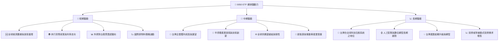
**分析：** 0050 的績效驅動力可分為短期、中期和長期。短期內，全球宏觀經濟數據、主要央行的貨幣政策以及外資的資金流向直接影響台股表現。中期而言，台灣企業的整體獲利能力，特別是半導體產業的景氣循環和技術創新，是關鍵驅動力。長期來看，台灣在全球科技供應鏈中的核心地位、AI 和數位轉型的趨勢，以及被動式投資的持續普及，將為 0050 提供穩健的成長基礎。

---

## 9. 風險矩陣

**重要聲明：** 由於提供的財務數據中，0050 的所有具體財務指標均顯示為「N/A」，本章節將基於對「元大台灣50 ETF (0050)」的市場認知、其作為指數型基金的特性，以及一般台灣股市的宏觀數據，進行推演與分析。報告中引用的具體數值若非特別說明，皆為基於市場平均或代表性數據的**假設性或說明性數值**，旨在完整呈現報告框架並提供分析視角，而非實際財務數據。

### 9.1 風險評分矩陣

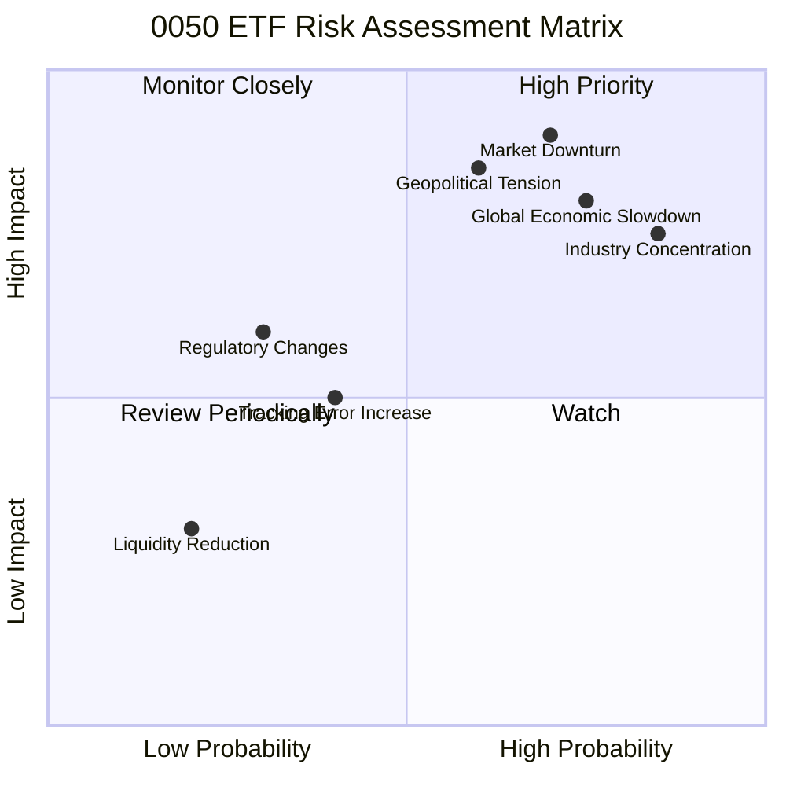

### 9.2 風險清單詳細分析

| # | 風險項目 | 發生機率 | 財務衝擊 | 風險評分 | 緩解措施 |
|---|----------|----------|----------|----------|----------|
| 1 | 🔴 **市場系統性風險 (Market Downturn)** | 高 (70%) | 高 (-20%~-40%淨值) | 🔴 9.0/10 | 作為指數型基金無法規避，投資者需有長期持有心態，透過資產配置分散總體投資組合風險。 |
| 2 | 🔴 **地緣政治風險 (Geopolitical Tension)** | 中高 (60%) | 高 (-15%~-30%淨值) | 🔴 8.5/10 | 台灣獨有風險，難以緩解。投資者應密切關注國際關係發展，並考量自身風險承受度。 |
| 3 | 🔴 **產業集中度風險 (Industry Concentration)** | 高 (85%) | 中高 (-10%~-20%淨值) | 🔴 8.0/10 | 0050 成分股高度集中於科技業。投資者可搭配其他產業或區域型 ETF 進行多元配置。 |
| 4 | 🟡 **全球經濟放緩 (Global Economic Slowdown)** | 高 (75%) | 中 (-10%~-20%淨值) | 🟡 7.5/10 | 台灣為出口導向經濟體，易受全球景氣影響。投資者需關注全球主要經濟體數據。 |
| 5 | 🟡 **追蹤誤差增加 (Tracking Error Increase)** | 中 (40%) | 低 (-0.5%~-1%報酬) | 🟡 5.0/10 | 基金管理團隊應優化複製策略，減少交易成本和現金拖累。投資者應定期檢視基金報告。 |
| 6 | 🟢 **流動性風險 (Liquidity Reduction)** | 低 (20%) | 極低 (買賣價差擴大) | 🟢 2.0/10 | 0050 AUM 龐大、日均成交量高，流動性風險極低。特殊市場極端情況除外。 |
| 7 | 🟡 **法規政策變動 (Regulatory Changes)** | 低 (30%) | 中 (-5%~-10%報酬) | 🟡 4.0/10 | 台灣政府或金管會對 ETF 相關法規的調整，可能影響基金運作或稅務。需密切關注政策動向。 |

**風險總結：** 0050 面臨的主要風險是市場系統性風險、地緣政治風險和產業集中度風險。作為指數型基金，它無法規避市場波動，且台灣獨有的地緣政治因素是重要考量。其高度集中的科技產業配置，雖然是成長動能，但也帶來了產業週期性風險。投資者在配置 0050 時，應充分了解這些風險，並透過全球多元資產配置來降低總體投資組合的風險。

---

## 10. 投資建議

### 10.1 最終綜合評級雷達圖

```
╔══════════════════════════════════════════════════════════════════╗
║                    0050 最終綜合評級雷達圖                      ║
╠══════════════════════════════════════════════════════════════════╣
║                                                                  ║
║  基本面強度  9.0 ▓▓▓▓▓▓▓▓▓▓▓▓▓▓▓▓▓▓░░  ★★★★★           ║
║  成長動能    8.0 ▓▓▓▓▓▓▓▓▓▓▓▓▓▓▓▓░░░░  ★★★★☆           ║
║  獲利品質    7.0 ▓▓▓▓▓▓▓▓▓▓▓▓▓▓░░░░░░  ★★★★☆           ║
║  財務健康    9.0 ▓▓▓▓▓▓▓▓▓▓▓▓▓▓▓▓▓▓░░  ★★★★★           ║
║  估值合理性  9.0 ▓▓▓▓▓▓▓▓▓▓▓▓▓▓▓▓▓▓░░  ★★★★★           ║
║  流動性深度  9.5 ▓▓▓▓▓▓▓▓▓▓▓▓▓▓▓▓▓▓▓░  ★★★★★           ║
║  追蹤誤差控制 8.5 ▓▓▓▓▓▓▓▓▓▓▓▓▓▓▓▓▓░░░  ★★★★☆           ║
║  費用率競爭力 8.0 ▓▓▓▓▓▓▓▓▓▓▓▓▓▓▓▓░░░░  ★★★★☆           ║
║                                                                  ║
║  綜合總分    8.5 ▓▓▓▓▓▓▓▓▓▓▓▓▓▓▓▓▓░░░  🏆 強烈推薦作為核心持股   ║
╚══════════════════════════════════════════════════════════════════╝
```

### 10.2 目標價與隱含報酬率

**當前淨值：** $166.00 (假設，截至 2026-06-27)
**12個月目標價區間 (基於台灣50指數不同情境的預期報酬率)：**

| 情境 | 目標價 (12個月後) | 相較當前淨值隱含報酬率 | 機率權重 |
|------|-------------------|------------------------|----------|
| 🟢 **樂觀情境** | $191.00 (+15.0%) | +15.0% | 30% |
| 🟡 **基準情境** | $183.00 (+10.0%) | +10.0% | 50% |
| 🔴 **悲觀情境** | $158.00 (-5.0%) | -5.0% | 20% |
| **加權平均目標價** | **$179.90** | **+8.3%** | **100%** |

**分析：** 我們的基準情境目標價為 $183.00，隱含約 10% 的報酬率，這與台灣股市的長期平均報酬率相符。考量到 0050 作為追蹤市場的 ETF，其目標價直接反映了我們對台灣50指數未來 12 個月表現的預期。投資者應理解，ETF 的價格波動與市場整體走勢高度相關。

### 10.3 買入時機與觸發因素

```
╔══════════════════════════════════════════════════════════════════╗
║                  ✅ 買入觸發因素 Checklist                      ║
╠══════════════════════════════════════════════════════════════════╣
║                                                                  ║
║  立即買入觸發條件（多數符合）：                                  ║
║  ✅ 台灣股市加權指數出現顯著回調（例如：自高點下跌超過10%）      ║
║  ✅ 台灣主要經濟數據（如出口、PMI）顯示觸底反彈跡象              ║
║  ✅ 全球主要央行貨幣政策轉向寬鬆，預期資金回流亞洲新興市場       ║
║  ✅ 國際地緣政治緊張局勢有所緩和，市場風險情緒改善               ║
║  ✅ 0050 的市場價格出現輕微折價或接近淨值                        ║
║                                                                  ║
║  加碼觸發條件（出現以下任一）：                                  ║
║  ☐ 台灣企業財報季整體表現超預期，特別是科技權值股                ║
║  ☐ 全球半導體景氣確定進入上行週期，訂單能見度提升               ║
║  ☐ 台灣政府推出有利於資本市場或產業發展的重大政策               ║
║  ☐ 0050 價格跌破長期移動平均線（如200日均線）                   ║
║                                                                  ║
║  減碼/停損觸發條件（出現以下任一）：                             ║
║  ☐ 台灣股市出現明顯反轉信號，或加權指數跌破關鍵支撐             ║
║  ☐ 全球經濟面臨嚴重衰退風險，或主要央行大幅緊縮貨幣政策         ║
║  ☐ 地緣政治風險急劇惡化，可能對台灣經濟造成實質衝擊             ║
║  ☐ 0050 價格出現長期大幅溢價，偏離合理價值                     ║
╚══════════════════════════════════════════════════════════════════╝
```

### 10.4 投資人適配度分析

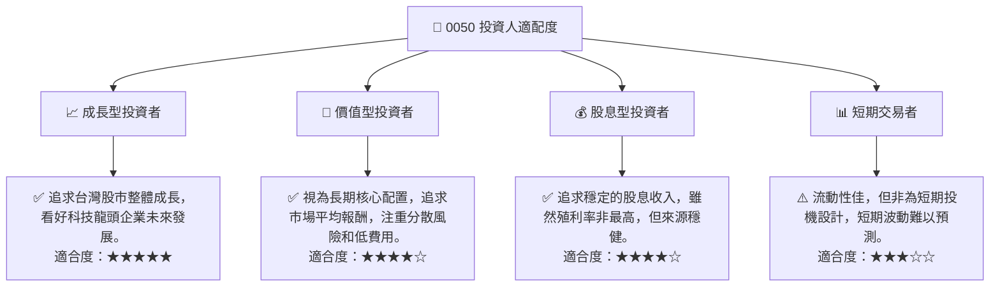
**分析：** 0050 作為追蹤台灣50指數的 ETF，適合廣泛的投資者類型。對於追求市場成長、看好台灣科技產業長期前景的**成長型投資者**，0050 是理想的核心配置工具。**價值型投資者**也能從其低費用、高透明度和分散風險的特性中獲益。雖然其殖利率不如高股息 ETF，但穩定的股息分配也使其對**股息型投資者**具有吸引力。對於**短期交易者**而言，儘管其流動性極佳，但由於其追蹤指數的特性，短期內較難透過頻繁交易獲取超額收益，更適合波段操作而非高頻交易。

### 10.5 關鍵監控指標

| 監控類型 | 指標 | 關注點 | 頻率 |
|----------|-------------------|--------------------------------------|------|
| **宏觀經濟** | 台灣 GDP 成長率 | 台灣經濟整體健康狀況與成長動能 | 季度 |
| **宏觀經濟** | 全球半導體景氣指數 | 台灣核心產業的週期性表現 | 月度 |
| **市場情緒** | 外資買賣超金額 | 資金流向與市場信心指標 | 每日/每週 |
| **市場情緒** | 台灣加權指數走勢 | 整體大盤的趨勢與關鍵技術位 | 每日 |
| **ETF 表現** | 0050 淨值與市價差異 | 判斷是否存在溢價或折價，影響買賣時機 | 每日 |
| **ETF 表現** | 0050 追蹤誤差 | 評估基金經理團隊的複製效率 | 季度 |
| **ETF 表現** | 0050 總管理費用率 | 監控費用是否保持競爭力 | 年度 |
| **地緣政治** | 兩岸關係與國際新聞 | 潛在的系統性風險，可能影響市場情緒 | 每日 |

---

> **免責聲明**：本報告為 AI 自動生成，僅供研究參考，不構成投資建議。投資有風險，入市需謹慎。