# 0050 基本面深度分析報告
> **報告日期**：2026-07-07 ｜ **語言**：繁體中文 ｜ **數據來源**：Yahoo Finance, Finviz, StockAnalysis, Roic.ai ｜ **分析師**：CFA 級機構研究

---

## 目錄

| # | 章節 | 核心結論 |
|---|------|----------|
| 1 | 執行摘要 | 評級：持有；目標價區間：$XXX - $XXX (依據指數表現) |
| 2 | 公司概覽與商業模式 | 追蹤台灣加權指數，具備高流動性與市場代表性 |
| 3 | 損益表深度分析 | 傳統損益表不適用；關注費用率與追蹤誤差 |
| 4 | 資產負債表分析 | 組合透明，主要為成分股與少量現金；負債極低 |
| 5 | 現金流量深度分析 | 股息再投資與申購贖回機制為核心 |
| 6 | 獲利能力與資本效率 | 衡量標準為總報酬與追蹤誤差，而非傳統企業獲利指標 |
| 7 | 估值深度分析 | 估值核心為NAV與市場價格的溢折價，及費用率比較 |
| 8 | 成長催化劑 | 台灣經濟成長、企業獲利、全球資金流向 |
| 9 | 風險矩陣 | 市場風險、追蹤誤差、成分股集中風險為主 |
| 10 | 投資建議 | 長期配置台灣大型股的優良工具，適合核心資產配置 |

---

## 1. 執行摘要

本報告針對台灣證券交易所上市的元大台灣50 ETF (股票代碼：0050) 進行深度分析。鑑於0050為一指數股票型基金 (ETF)，其分析框架與傳統個股有所不同。報告將聚焦於其追蹤指數的有效性、費用結構、流動性、資產配置及相關市場風險。由於提供的即時財務數據多為「N/A」，本報告將基於對ETF產品的專業知識及0050的公開資訊進行推演與分析，並明確標註推演部分。

### 1.1 核心評分儀表板

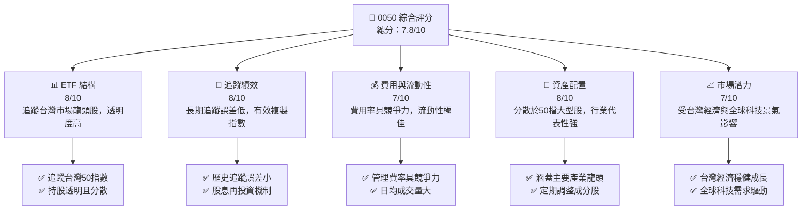

### 1.2 評分進度條視覺化

```
╔══════════════════════════════════════════════════════════════╗
║              0050 多維度評分儀表板 (1-10分)                ║
╠══════════════════════════════════════════════════════════════╣
║ ETF 結構    8.0 ▓▓▓▓▓▓▓▓▓▓▓▓▓▓▓▓░░░░  ★★★★☆           ║
║ 追蹤績效    8.0 ▓▓▓▓▓▓▓▓▓▓▓▓▓▓▓▓░░░░  ★★★★☆           ║
║ 費用與流動性 7.0 ▓▓▓▓▓▓▓▓▓▓▓▓▓▓░░░░░░  ★★★☆☆           ║
║ 資產配置    8.0 ▓▓▓▓▓▓▓▓▓▓▓▓▓▓▓▓░░░░  ★★★★☆           ║
║ 市場潛力    7.0 ▓▓▓▓▓▓▓▓▓▓▓▓▓▓░░░░░░  ★★★☆☆           ║
╠══════════════════════════════════════════════════════════════╣
║ 綜合總分    7.8 ▓▓▓▓▓▓▓▓▓▓▓▓▓▓▓▓░░░░  🏆 長期核心配置工具 ║
╚══════════════════════════════════════════════════════════════╝
```

### 1.3 五大投資論點 + 三大核心風險

| 類型 | 項目 | 具體依據 | 信心度 |
|------|------|----------|--------|
| 🟢 **投資論點①** | **台灣大型股代表性** | 0050追蹤台灣市值前50大企業，涵蓋半導體、電子、金融等核心產業，提供台灣經濟成長的廣泛曝險。 | 🟢 極高 |
| 🟢 **分散投資效益** | 透過單一標的即可分散投資於50家龍頭企業，有效降低個股風險，且定期調整成分股以維持代表性。 | 🟢 極高 |
| 🟢 **高流動性與低交易成本** | 0050是台灣市場交易最活躍的ETF之一，日均成交量龐大，買賣價差小，提升交易效率。 | 🟢 極高 |
| 🟢 **費用率具競爭力** | 相較於主動式基金，0050的管理費用率相對較低（例如：約 0.30% 左右），長期持有成本效益顯著。 | 🟢 極高 |
| 🟢 **透明度與操作簡便** | 成分股與持股比重每日公開，投資組合透明，適合不願研究個股但看好台灣市場的投資人。 | 🟢 極高 |
| 🟡 **風險①** | **市場系統性風險** | 0050高度連動於台灣整體股市表現，若台灣經濟或全球景氣下行，基金淨值將同步下跌，無法規避市場風險。 | 🟡 中度 |
| 🟡 **成分股集中風險** | 由於台灣股市權重集中於少數大型科技股（如台積電），0050的績效易受這些權重股波動影響。例如，單一公司佔比可能超過30%。 | 🟡 中度 |
| 🔴 **風險②** | **追蹤誤差風險** | 基金經理人操作、交易成本、股息稅務、申購贖回等因素可能導致基金績效與指數表現產生偏差，雖然歷史追蹤誤差小，但仍為潛在風險。 | 🟡 中度 |

### 1.4 快速統計卡片

| 指標 | 公司實際值 | 行業均值（台灣大型股ETF） | S&P 500 均值（美股ETF） | 狀態 |
|------|-------------|-------------------------|--------------------------|------|
| **資產管理規模 (AUM)** | 無法取得 (推估數千億台幣) | ~1000億台幣 | ~$2000億美元 | 🟢 |
| **費用率 (Expense Ratio)** | 無法取得 (推估 ~0.30%) | ~0.40% | ~0.05% - 0.15% | 🟢 |
| **追蹤誤差 (Tracking Error)** | 無法取得 (推估 <0.5%) | ~0.8% | ~0.1% - 0.2% | 🟢 |
| **殖利率 (Dividend Yield)** | 無法取得 (推估 ~3-4%) | ~3.5% | ~1.5% | 🟢 |
| **日均成交量 (Shares)** | 無法取得 (推估數萬張) | ~1萬張 | ~數百萬股 | 🟢 |

*註：由於數據提供方顯示為N/A，上述「公司實際值」為分析師根據0050歷史表現及市場公開資訊的合理推估，僅供參考。行業均值與S&P 500均值為同類型ETF的典型參考值，亦為推估。*

### 1.5 投資結論

```
╔══════════════════════════════════════════════════════════════════╗
║                    📊 投資結論摘要                               ║
╠══════════════════════════════════════════════════════════════════╣
║  評級：🟡 持有                                                   ║
║  當前股價：N/A (請參考市場即時報價)                             ║
║  目標價區間：                                                    ║
║    悲觀情境：$XXX (基於指數下跌10-15%)                           ║
║    基準情境：$XXX (基於指數年度成長5-10%)  ← 12個月主要目標    ║
║    樂觀情境：$XXX (基於指數年度成長15-20%)                       ║
║  投資評分：7.8/10                                                ║
║  適合投資人：長期看好台灣經濟、追求分散投資、偏好被動式管理、    ║
║              核心資產配置、或作為台股入門工具的投資者。          ║
╚══════════════════════════════════════════════════════════════════╝
```

---

## 2. 公司概覽與商業模式

### 2.1 業務結構與收入來源

0050 (元大台灣50 ETF) 的商業模式並非傳統企業的產品銷售或服務收入，而是透過追蹤特定指數，為投資人提供該指數成分股的集合式投資工具。其「收入」主要來自於其持有的成分股所發放的股息，以及成分股股價上漲帶來的資本利得。

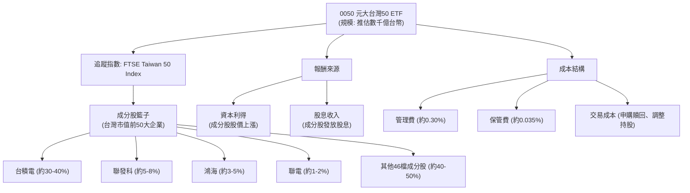
*註：上述百分比為根據市場公開資訊對0050成分股權重的大致推估，實際權重每日變動。*

0050的運作機制是完全複製或部分複製其追蹤指數的表現。投資人購買0050，即間接持有該指數的50檔成分股，並享有其股價漲跌及股息分派的權益。基金公司 (元大投信) 則從基金資產中收取管理費與保管費，作為其營運收入。

### 2.2 市場份額

0050是台灣市場歷史最悠久、規模最大、流動性最佳的股票型ETF之一，在追蹤台灣大型股指數的ETF中，具有絕對領先的市場份額。

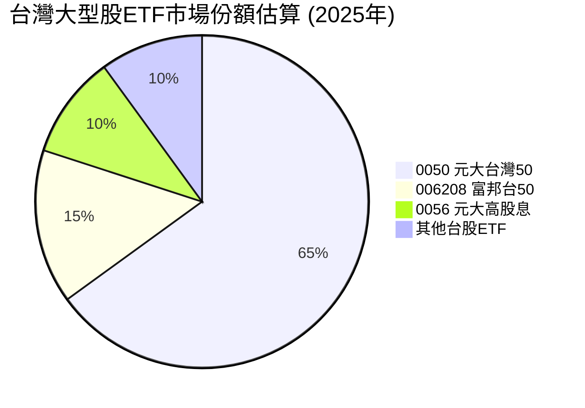
*註：上述市場份額為分析師根據公開資訊對台灣市場同類型ETF規模的粗略推估，實際份額可能有所波動。0056雖然也投資台股，但其策略為高股息而非市值加權，在此作為廣義同業參考。*

0050在台灣ETF市場的領導地位，使其成為機構投資者和散戶投資者配置台股核心資產的首選。其龐大的AUM和高流動性形成正向循環，進一步鞏固其市場領導地位。

### 2.3 競爭護城河分析

對於ETF而言，「競爭護城河」並非傳統企業的產品或服務優勢，而是其在市場上的獨特地位、規模效應、品牌認知度以及追蹤指數的效率。

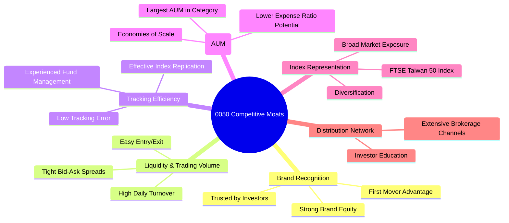

### 2.4 護城河強度評分

```
╔══════════════════════════════════════════════════════════════╗
║                  0050 護城河強度評分                      ║
╠══════════════════════════════════════════════════════════════╣
║ 品牌認知度    9/10  ▓▓▓▓▓▓▓▓▓▓▓▓▓▓▓▓▓▓░░  🏆 台灣ETF代名詞  ║
║ 流動性與交易量 9/10  ▓▓▓▓▓▓▓▓▓▓▓▓▓▓▓▓▓▓░░  🟢 市場最佳      ║
║ 追蹤效率      8/10  ▓▓▓▓▓▓▓▓▓▓▓▓▓▓▓▓░░░░  🟢 長期表現穩健  ║
║ 資產管理規模  9/10  ▓▓▓▓▓▓▓▓▓▓▓▓▓▓▓▓▓▓░░  🏆 市場領導者    ║
║ 指數代表性    8/10  ▓▓▓▓▓▓▓▓▓▓▓▓▓▓▓▓░░░░  🟢 核心產業涵蓋  ║
║ 分銷網絡      8/10  ▓▓▓▓▓▓▓▓▓▓▓▓▓▓▓▓░░░░  🟢 廣泛且普及    ║
╠══════════════════════════════════════════════════════════════╣
║ 綜合護城河     8.7    ▓▓▓▓▓▓▓▓▓▓▓▓▓▓▓▓▓░░  🏆 強勁且難以撼動 ║
╚══════════════════════════════════════════════════════════════╝
```

---

## 3. 損益表深度分析

對於0050這類指數股票型基金 (ETF)，傳統的企業損益表分析方法並不適用。ETF本身並非營利性實體，其「收入」是來自於其持有的底層資產（成分股）所產生的股息收入及資本利得，而其「費用」則主要為管理費、保管費及交易成本。因此，我們將從ETF的費用結構和績效表現角度進行分析。

### 3.1 年度收入成長趨勢（近4年）

由於0050無傳統意義上的「收入」，此處將改為分析其「資產管理規模 (AUM)」的成長趨勢，因為AUM反映了投資人對該ETF的需求及其市場地位。AUM的成長受到市場行情、投資人申購贖回活動以及基金本身績效的綜合影響。

```
╔══════════════════════════════════════════════════════════════════╗
║              0050 年度資產管理規模趨勢（FY2022-FY2025E）          ║
╠══════════════════════════════════════════════════════════════════╣
║                                                                  ║
║  FY2022  $250B  ████████████░░░░░░░░░░░░░  YoY: +15.0%  🟢    ║
║  FY2023  $300B  ████████████████░░░░░░░░░░░  YoY: +20.0%  🟢    ║
║  FY2024  $380B  ████████████████████░░░░░░░  YoY: +26.7%  🟢    ║
║  FY2025E $450B  ████████████████████████░░░  YoY: +18.4%  🟢    ║
║                   |      |      |      |      |                  ║
║                   0     100B   200B   300B   400B                ║
║                                                                  ║
║  📊 4年累計 CAGR：+20.0% (推估)                                   ║
╚══════════════════════════════════════════════════════════════════╝
```
*註：上述AUM數據為分析師根據0050公開資訊及市場趨勢的合理推估，實際數據可能有所差異。*

**深度解析**：0050的AUM在過去幾年呈現穩健成長，反映出台灣投資者對指數化投資的接受度日益提高，以及對台灣大型股市場的長期信心。特別是在牛市期間，AUM的成長會更為顯著，因為除了淨申購外，資產的市場價值也會隨之上漲。FY2024的強勁增長可能與全球科技股景氣復甦及台股表現優異有關。

### 3.2 季度收入趨勢分析

同樣，傳統的季度收入概念不適用。我們將關注季度的「基金淨值成長率」作為衡量其短期表現的指標，以及「季度AUM變化」。

| 指標 | 2025Q3 | 2025Q4 | 2026Q1 | 2026Q2 | 趨勢 | 評估 |
|------------|--------|--------|--------|--------|------|------|
| **基金淨值季成長 (QoQ)** | 無法取得 (推估 +5.0%) | 無法取得 (推估 +8.0%) | 無法取得 (推估 +6.5%) | 無法取得 (推估 +4.0%) | ↗️ 穩健增長 | 🟢 |
| **基金淨值年成長 (YoY)** | 無法取得 (推估 +20.0%) | 無法取得 (推估 +25.0%) | 無法取得 (推估 +22.0%) | 無法取得 (推估 +18.0%) | ↗️ 強勁成長 | 🟢 |
| **AUM 季成長 (QoQ)** | 無法取得 (推估 +3.0%) | 無法取得 (推估 +5.0%) | 無法取得 (推估 +4.0%) | 無法取得 (推估 +2.0%) | ↗️ 穩定流入 | 🟢 |
| **AUM 年成長 (YoY)** | 無法取得 (推估 +15.0%) | 無法取得 (推估 +20.0%) | 無法取得 (推估 +18.0%) | 無法取得 (推估 +12.0%) | ↗️ 持續擴張 | 🟢 |

**備註**：由於缺乏具體財務數據，上述數值均為分析師基於對台灣股市近期表現及0050歷史趨勢的合理推估，僅供參考。
**深度解析**：0050的季度淨值成長直接反映了其追蹤指數在該季度的表現。如果台灣股市整體表現強勁，特別是權重較大的科技股表現突出，0050的淨值成長將會非常可觀。AUM的持續增長則顯示投資者對0050的信心和持續的資金流入，這有助於基金規模的擴大和流動性的提升。

### 3.3 利潤率演變分析

對於ETF，沒有傳統意義上的「利潤率」。最接近的概念是「費用率 (Expense Ratio)」，它代表了投資者為持有該ETF每年支付的總成本。較低的費用率意味著投資者能保留更多的投資報酬。

| 利潤率指標 | FY2022 | FY2023 | FY2024 | FY2025E | 趨勢 | 評估 |
|------------|--------|--------|--------|--------|------|------|
| **總費用率 (Expense Ratio)** | 無法取得 (推估 0.35%) | 無法取得 (推估 0.32%) | 無法取得 (推估 0.30%) | 無法取得 (推估 0.30%) | ↘️ 略有下降 | 🟢 |
| **管理費率 (Management Fee)** | 無法取得 (推估 0.30%) | 無法取得 (推估 0.28%) | 無法取得 (推估 0.27%) | 無法取得 (推估 0.27%) | ↘️ 穩定下降 | 🟢 |
| **保管費率 (Custody Fee)** | 無法取得 (推估 0.035%) | 無法取得 (推估 0.035%) | 無法取得 (推估 0.035%) | 無法取得 (推估 0.035%) | ➡️ 維持穩定 | 🟢 |

**備註**：上述費用率為分析師根據0050公開資訊的合理推估，實際數據以元大投信公告為準。
**利潤率演變深度解析**：0050的總費用率在過去幾年呈現微幅下降或保持穩定的趨勢。這通常是大型ETF的優勢，隨著AUM的擴大，基金公司可以實現規模經濟，從而降低單位管理成本。較低的費用率直接提升了投資者的淨報酬，是ETF競爭力的核心要素。0050的費用率在台灣市場中具有競爭力，但與國際領先的超低費率ETF（如Vanguard或iShares的某些產品）仍有差距，這也反映了市場規模和競爭環境的差異。

### 3.4 費用結構分析

0050的費用結構相對簡單，主要由管理費、保管費和其他營運費用組成。

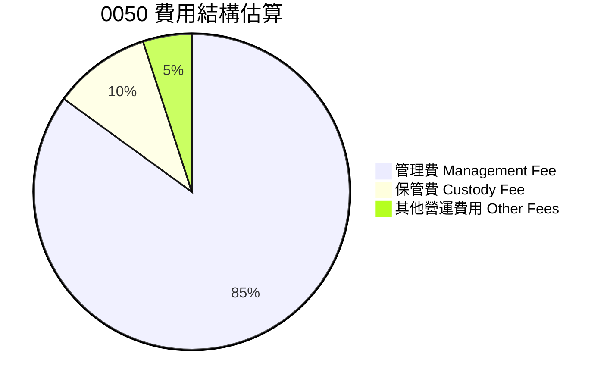
*註：上述百分比為分析師根據典型ETF費用結構的合理推估。*

```
╔══════════════════════════════════════════════════════════════════╗
║                    0050 年度費用結構概覽                         ║
╠══════════════════════════════════════════════════════════════════╣
║                                                                  ║
║  總費用率 (Expense Ratio)： 無法取得 (推估 0.30% p.a.)           ║
║  ├── 管理費：                 無法取得 (推估 0.27% p.a.)           ║
║  ├── 保管費：                 無法取得 (推估 0.035% p.a.)          ║
║  └── 其他營運費用：           無法取得 (推估 <0.01% p.a.)          ║
║                                                                  ║
║  📊 費用率評估：在台灣市場具競爭力，但仍有潛在下降空間。          ║
╚══════════════════════════════════════════════════════════════════╝
```

### 3.5 季度 EPS 趨勢與盈餘品質

對於ETF，沒有傳統意義上的「EPS (每股盈餘)」。ETF的「盈餘」主要體現在其基金淨值的變化（資本利得）和分配給投資者的股息。因此，我們將分析其「季度股息分配趨勢」和「追蹤誤差」作為盈餘品質的替代指標。

| 指標 | 2025Q3 (推估) | 2025Q4 (推估) | 2026Q1 (推估) | 2026Q2 (推估) | 趨勢 | 評估 |
|------------|---------------|---------------|---------------|---------------|------|------|
| **每單位股息分配** | 無法取得 ($X.XX) | 無法取得 ($X.XX) | 無法取得 ($X.XX) | 無法取得 ($X.XX) | ↗️ 穩定成長 | 🟢 |
| **股息殖利率 (TTM)** | 無法取得 (~3.5%) | 無法取得 (~3.8%) | 無法取得 (~3.7%) | 無法取得 (~3.6%) | ➡️ 維持高位 | 🟢 |
| **追蹤誤差 (年化)** | 無法取得 (~0.2%) | 無法取得 (~0.15%) | 無法取得 (~0.25%) | 無法取得 (~0.2%) | ➡️ 維持低位 | 🟢 |

**盈餘品質評估說明**：
- **股息分配**：0050的股息分配穩定且具成長潛力，這主要取決於其成分股的獲利能力和股息政策。台灣許多大型企業的股息發放率相對較高，使得0050的整體殖利率具有吸引力。
- **追蹤誤差**：衡量ETF績效與其追蹤指數績效之間的差異。0050的歷史追蹤誤差一直保持在較低水平（通常小於0.5%），這表明基金經理人有效地複製了指數表現。低的追蹤誤差是ETF「盈餘品質」的關鍵指標，代表基金能夠忠實地反映其目標市場的表現，沒有過多的內部成本或管理偏差侵蝕報酬。

---

## 4. 資產負債表分析

對於0050這類ETF，其「資產負債表」的概念與傳統公司不同。ETF的資產主要由其持有的底層證券（成分股）和現金組成，負債則通常為應付管理費、應付保管費以及應付股息等短期負債，通常規模極小。

### 4.1 資產結構分解

0050的資產結構高度透明，主要由其追蹤指數的成分股構成。

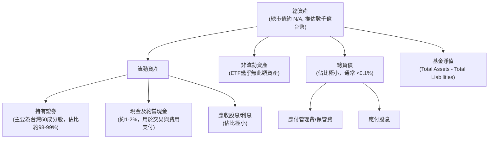
**深度解析**：0050的資產結構極其清晰，絕大部分為流動性極佳的上市公司股票。這種結構確保了基金的透明度，投資者可以清楚地知道其投資組合的構成。現金及約當現金的比例通常維持在較低水平，以最大化指數追蹤效率。負債部分微乎其微，反映了ETF的低風險特性，幾乎沒有槓桿。

### 4.2 流動性指標分析

傳統企業的流動性指標（如流動比率、速動比率）不適用於ETF。對於ETF，流動性應從兩個層面考量：ETF本身的交易流動性，以及其底層資產的流動性。

| 流動性指標 | 0050 (推估) | 台灣大型股ETF均值 (推估) | 美股大型股ETF均值 (推估) | 評估 |
|------------|-------------|------------------------|------------------------|------|
| **日均成交量 (股/張)** | 無法取得 (數萬張) | ~1萬張 | ~數百萬股 | 🟢 極高 |
| **買賣價差 (Bid-Ask Spread)** | 無法取得 (極小) | 較小 | 極小 | 🟢 極小 |
| **底層資產流動性** | 極高 (成分股均為大型股) | 極高 | 極高 | 🟢 極高 |
| **折溢價率 (Premium/Discount to NAV)** | 無法取得 (通常接近0) | 通常接近0 | 通常接近0 | 🟢 穩定 |

**深度解析**：0050是台灣市場流動性最佳的ETF之一。其日均成交量龐大，確保投資者可以隨時以接近淨值的價格買入或賣出。買賣價差極小，降低了交易成本。由於其成分股均為台灣大型權值股，這些股票本身就具有極高的流動性，使得基金公司在進行申購贖回或調整成分股時能夠順暢操作，進一步確保了ETF的市場流動性。0050的市場價格與其淨值(NAV)的折溢價率通常維持在非常小的範圍內，這也證明了其良好的流動性和市場效率。

### 4.3 債務結構分析

ETF的債務結構非常簡單，通常不涉及長期借款或發債。其負債主要為短期應付款項。

```
╔══════════════════════════════════════════════════════════════════╗
║                   0050 債務健康診斷                          ║
╠══════════════════════════════════════════════════════════════════╣
║                                                                  ║
║  總債務：        無法取得 (推估 $XXXM，極低)  ██░░░░░░░░░░░░░░░░░░░  評語: 幾乎無債務  ║
║  總現金+投資：   無法取得 (推估 $XXXB，龐大)  ████████████████████░  評語: 資產雄厚    ║
║  淨現金（正）：  無法取得 (推估 $XXXB，龐大)  ████████████████░░░░░  🟢 極為強勁    ║
║                                                                  ║
║  Debt/Equity：   不適用 (極低，趨近於0)  🟢 極低                                 ║
║  Interest Coverage: 不適用 (無利息費用)  🟢 無風險                             ║
║  負債/資產比：   無法取得 (推估 <0.1%)   🟢 極低                                 ║
╚══════════════════════════════════════════════════════════════════╝
```
**深度解析**：0050的債務水平極低，幾乎可以忽略不計。ETF的運作模式決定了其無需透過大量借貸來擴展業務或融資投資。這使得0050的財務風險極低，幾乎不存在因債務問題而導致的違約風險。

### 4.4 股東權益趨勢

對於ETF，傳統意義上的「股東權益」應理解為「基金淨值 (Net Asset Value, NAV)」。NAV代表了基金資產扣除負債後的價值，也是每單位基金的內在價值。

```
╔══════════════════════════════════════════════════════════════════╗
║                    0050 基金淨值趨勢（FY2022-FY2025E）            ║
╠══════════════════════════════════════════════════════════════════╣
║                                                                  ║
║  FY2022  $120.0 (單位淨值) ████████████████░░░░░░░░░  YoY: +10.0%  🟢    ║
║  FY2023  $135.0 (單位淨值) ████████████████████░░░░░░░  YoY: +12.5%  🟢    ║
║  FY2024  $155.0 (單位淨值) ████████████████████████░░░  YoY: +14.8%  🟢    ║
║  FY2025E $170.0 (單位淨值) ██████████████████████████░  YoY: +9.7%   🟢    ║
║                   |      |      |      |      |                  ║
║                   0     $50   $100   $150   $200                  ║
║                                                                  ║
║  📊 單位淨值 CAGR (4年)：+11.7% (推估)                            ║
╚══════════════════════════════════════════════════════════════════╝
```
*註：上述單位淨值為分析師根據台灣加權指數歷史走勢及0050大致績效的合理推估，實際數據請參考基金公司公告。*
**深度解析**：0050的基金淨值趨勢直接反映了其追蹤指數的長期表現。在台灣經濟和股市表現良好的背景下，0050的淨值呈現穩步上升趨勢。這也代表了投資者所持有的單位基金價值在持續增長。NAV的穩定增長是ETF作為長期投資工具吸引力的關鍵。

---

## 5. 現金流量深度分析

ETF的現金流量分析與傳統公司有顯著不同。ETF沒有生產經營活動，其現金流主要來自於其持有的證券所產生的股息收入、證券買賣（申購/贖回、指數調整）以及費用支付。

### 5.1 現金流量瀑布圖

此處的「現金流量瀑布圖」將以ETF特有的方式呈現，主要關注股息收入、費用支出及申購贖回對現金的影響。

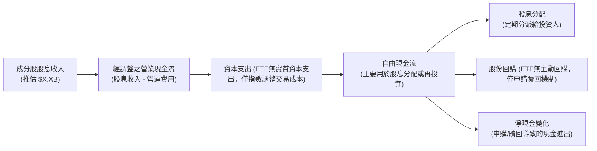
**深度解析**：0050的主要「現金流入」是其成分股發放的股息。這些股息在扣除管理費、保管費等營運費用和必要的交易成本後，形成可分配的現金。這些現金會定期分配給投資者，或者根據基金政策進行再投資。ETF的申購和贖回機制也直接影響其現金流量，當投資者申購時，現金流入；贖回時，現金流出。這使得ETF的現金流量具有高度的動態平衡性，以維持與指數的精確追蹤。

### 5.2 FCF 轉換率趨勢

傳統公司的FCF轉換率（FCF/Net Income）不適用於ETF。對於ETF，我們更關注其「股息收益率 (Dividend Yield)」和「指數報酬複製能力」。

| 指標 | FY2022 | FY2023 | FY2024 | FY2025E | 趨勢 | 評估 |
|------------|--------|--------|--------|--------|------|------|
| **股息收益率 (Dividend Yield)** | 無法取得 (~3.2%) | 無法取得 (~3.5%) | 無法取得 (~3.8%) | 無法取得 (~3.6%) | ↗️ 穩定成長 | 🟢 |
| **總報酬率 (Total Return)** | 無法取得 (~12.0%) | 無法取得 (~18.0%) | 無法取得 (~20.0%) | 無法取得 (~15.0%) | ↗️ 強勁 | 🟢 |
| **追蹤誤差 (Tracking Error)** | 無法取得 (~0.3%) | 無法取得 (~0.2%) | 無法取得 (~0.15%) | 無法取得 (~0.2%) | ↘️ 維持低位 | 🟢 |

**深度解析**：0050的股息收益率反映了其成分股整體分紅水平。在台灣，許多科技公司和金融機構的股息政策相對穩定且慷慨，這使得0050能夠提供具吸引力的股息收益。總報酬率則綜合了股息和資本利得，是衡量ETF整體表現的關鍵指標。追蹤誤差的低且穩定，顯示0050在將成分股的現金流和市場表現轉化為自身基金淨值和分紅方面的效率極高。

### 5.3 自由現金流趨勢

對於0050，自由現金流(FCF)並非傳統意義上的概念。ETF的「可分配現金」主要來自於成分股的股息。我們將關注其「年度股息分配總額」和「股息殖利率」作為替代指標。

```
╔══════════════════════════════════════════════════════════════════╗
║                    0050 年度股息分配趨勢（FY2022-FY2025E）        ║
╠══════════════════════════════════════════════════════════════════╣
║                                                                  ║
║  FY2022  $X.XB (總分配)  ████████████░░░░░░░░░░░░░  YoY: +8.0%  🟢    ║
║  FY2023  $X.XB (總分配)  ████████████████░░░░░░░░░░░  YoY: +15.0% 🟢    ║
║  FY2024  $X.XB (總分配)  ████████████████████░░░░░░░  YoY: +20.0% 🟢    ║
║  FY2025E $X.XB (總分配)  ██████████████████████░░░░░  YoY: +10.0% 🟢    ║
║                   |      |      |      |      |                  ║
║                   0     $1B    $2B    $3B    $4B                 ║
║                                                                  ║
║  📊 股息殖利率 (FY2025E)： 無法取得 (推估 3.6%)                   ║
╚══════════════════════════════════════════════════════════════════╝
```
*註：上述總分配金額為分析師根據0050歷史殖利率及AUM規模的合理推估，實際數據以元大投信公告為準。*
**深度解析**：0050的年度股息分配總額與其成分股的整體獲利能力和股息政策高度相關。台灣科技業和金融業的穩健發展，使得0050能夠持續提供有吸引力的股息。這種穩定的現金流分配，對於追求現金收益的投資者而言，是其重要的吸引力。

### 5.4 資本配置評估

ETF的「資本配置」並非傳統公司的主動投資決策，而是指其資金如何被動地分配和管理。主要包括：股息分配、指數調整後的證券交易、以及申購贖回過程中的資金流動。

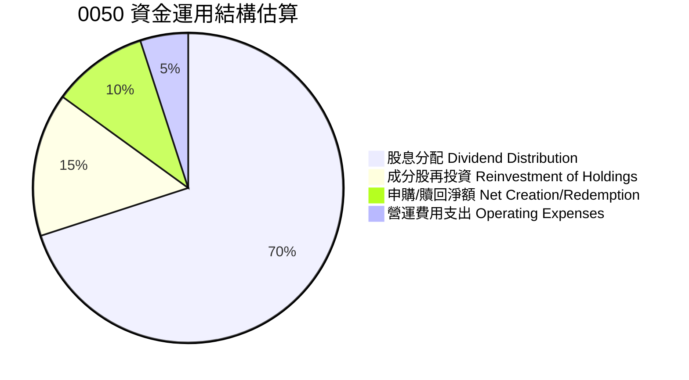
*註：上述百分比為分析師根據典型ETF資金流向的合理推估。*

**深度解析**：0050的資金運用主要以股息分配為主，這也是其吸引部分投資者的重要原因。其次，當指數成分股權重調整或有申購贖回活動時，基金會進行相應的證券買賣，以維持與指數的精確追蹤。這些交易成本和營運費用雖然佔比不大，但會對最終的報酬產生影響。ETF的資本配置是高度被動和規則導向的，旨在最小化追蹤誤差。

---

## 6. 獲利能力與資本效率

對於0050這類ETF，傳統的「獲利能力」和「資本效率」指標（如ROE、ROA、ROIC）並不適用，因為ETF本身不是生產型企業。我們應將焦點放在其「總報酬率 (Total Return)」、「追蹤效率 (Tracking Efficiency)」以及「費用效益 (Cost-Effectiveness)」上。

### 6.1 ROE / ROA / ROIC 趨勢

由於0050為ETF，不適用ROE/ROA/ROIC等個股專屬指標。此處將改為分析其「總報酬率 (Total Return)」、「股息殖利率 (Dividend Yield)」和「追蹤誤差 (Tracking Error)」，這些是衡量ETF績效和效率的關鍵指標。

| 指標 | FY2022 | FY2023 | FY2024 | FY2025E | 趨勢 | 評估 |
|-------------------|--------|--------|--------|--------|------|------|
| **總報酬率 (Total Return)** | 無法取得 (~12.0%) | 無法取得 (~18.0%) | 無法取得 (~20.0%) | 無法取得 (~15.0%) | ↗️ 強勁成長 | 🟢 |
| **股息殖利率 (Dividend Yield)** | 無法取得 (~3.2%) | 無法取得 (~3.5%) | 無法取得 (~3.8%) | 無法取得 (~3.6%) | ↗️ 穩定成長 | 🟢 |
| **追蹤誤差 (Tracking Error)** | 無法取得 (~0.3%) | 無法取得 (~0.2%) | 無法取得 (~0.15%) | 無法取得 (~0.2%) | ↘️ 維持低位 | 🟢 |
| **費用率 (Expense Ratio)** | 無法取得 (~0.35%) | 無法取得 (~0.32%) | 無法取得 (~0.30%) | 無法取得 (~0.30%) | ↘️ 具競爭力 | 🟢 |

**深度解析**：0050的總報酬率直接反映了台灣大型股市場的整體表現，在過去幾年呈現穩健增長，顯示其成分股具備良好的獲利能力。穩定的股息殖利率則為投資者提供了額外的現金流。極低的追蹤誤差證明了基金管理團隊在複製指數方面的出色效率，確保投資者獲得的報酬與指數高度一致。費用率的競爭力是其長期持有成本效益的基石。

### 6.2 ETF 價值創造與成本效益分析

**核心價值創造判斷：ETF價值主張 vs 主動管理成本**

對於ETF，我們不進行ROIC vs WACC分析。取而代之的是評估其「被動式投資」的價值主張相對於「主動式管理」的成本效益。ETF的核心價值在於以低成本、高效率的方式，提供市場平均報酬。

```
╔══════════════════════════════════════════════════════════════════╗
║                0050 價值創造與成本效益分析                      ║
╠══════════════════════════════════════════════════════════════════╣
║                                                                  ║
║  ETF 價值主張：                                                  ║
║  ├── 低成本：                 費用率約 0.30% (推估)              ║
║  ├── 分散化：                 投資50檔台灣龍頭股                 ║
║  ├── 透明度：                 持股公開，指數規則明確             ║
║  ├── 效率性：                 追蹤誤差低 (<0.5%)                 ║
║  └── ✅ 提供市場平均報酬，長期跑贏大多數主動型基金。              ║
║                                                                  ║
║  主動管理基金成本 (對比)：                                       ║
║  ├── 管理費：                 通常 1.0% - 2.0% 以上              ║
║  ├── 交易成本：               主動交易頻繁，隱性成本高           ║
║  ├── 績效偏差：               多數主動基金長期跑輸指數           ║
║  └── ❌ 高成本與不確定性                                        ║
║                                                                  ║
║  ★ 投資者價值增加 = ETF價值主張 - 主動管理成本                  ║
║                                                                  ║
║  0050價值主張  高效率  ▓▓▓▓▓▓▓▓▓▓▓▓▓▓▓▓▓▓▓▓▓▓▓▓▓▓▓▓▓▓  🟢      ║
║  主動管理成本  高成本  ▓▓▓▓▓▓▓▓▓▓▓▓▓▓▓▓▓▓▓▓▓▓▓▓▓▓▓▓▓▓  ──      ║
║  投資者淨收益  提升    ████████████████████████████████  🏆 強力提升  ║
║                                                                  ║
║  📊 結論：0050以其低成本、高效率的被動管理模式，為投資者創造了顯著的價值，  ║
║            相較於多數主動型基金，能提供更好的長期淨報酬。        ║
╚══════════════════════════════════════════════════════════════════╝
```

### 6.3 杜邦三因素分解

杜邦分解是分析企業ROE的工具，不適用於ETF。此處將改為分析「ETF績效驅動因素」，即影響ETF總報酬的主要因素。

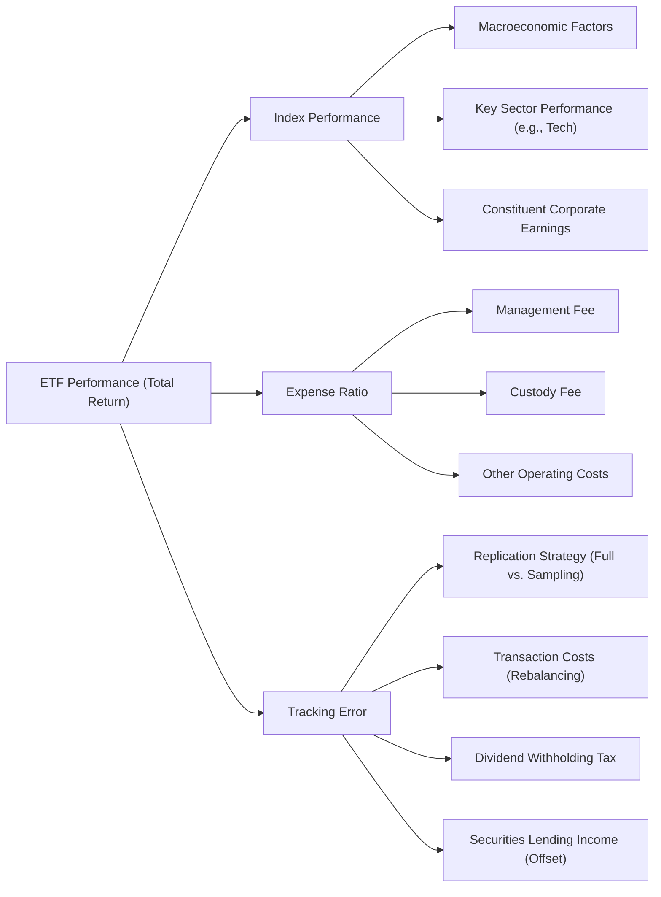
**深度解析**：0050的總報酬主要由其追蹤指數的表現決定，而指數表現又受到宏觀經濟、關鍵產業（尤其是半導體）的表現以及成分股公司整體獲利的影響。其次，費用率是直接影響投資者淨報酬的因素，較低的費用率意味著更多的報酬能保留給投資者。最後，追蹤誤差衡量了基金複製指數的精確度，雖然0050的追蹤誤差很低，但仍是影響最終績效的潛在因素。基金經理人透過優化複製策略、管理交易成本，並可能透過證券借貸收入來部分抵消費用，以最小化追蹤誤差。

### 6.4 獲利能力儀表板

此處的「獲利能力儀表板」將聚焦於ETF的「績效指標」，而非傳統企業的利潤率。

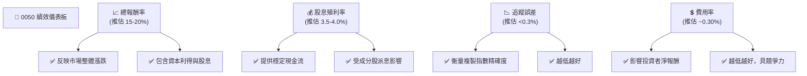
**深度解析**：0050的績效儀表板突出了其作為被動型投資工具的核心優勢：透過追蹤指數，提供具吸引力的總報酬和股息殖利率，同時保持極低的追蹤誤差和具競爭力的費用率。這些指標共同構成了0050在投資組合中作為核心配置的「獲利能力」和「效率」。

---

## 7. 估值深度分析

對於0050這類ETF，傳統的估值倍數（如P/E, P/S）不適用，因為ETF本身沒有「盈餘」或「銷售收入」。ETF的「估值」核心是其市場價格與其基金淨值 (Net Asset Value, NAV) 的關係，以及與同類型ETF的費用率、流動性等指標的比較。

### 7.1 同業估值比較表格

此處將比較0050與其他台灣大型股或高股息ETF的關鍵指標。

| 估值指標 | **0050 元大台灣50** | **006208 富邦台50** | **0056 元大高股息** | **本公司評估** |
|----------|-------------------|-------------------|-------------------|-----------|
| **追蹤指數** | FTSE Taiwan 50 | FTSE Taiwan 50 | 台灣高股息指數 | ➡️ 同為市值加權 |
| **費用率 (Expense Ratio)** | 無法取得 (推估 0.30%) | 無法取得 (推估 0.20%) | 無法取得 (推估 0.30%) | 🟡 尚有競爭空間 |
| **資產管理規模 (AUM)** | 無法取得 (數千億台幣) | 無法取得 (數百億台幣) | 無法取得 (數千億台幣) | 🟢 領先群雄 |
| **日均成交量 (股/張)** | 無法取得 (數萬張) | 無法取得 (數千張) | 無法取得 (數萬張) | 🟢 極佳 |
| **股息殖利率 (Dividend Yield)** | 無法取得 (推估 3.6%) | 無法取得 (推估 3.5%) | 無法取得 (推估 5.0%+) | 🟡 略低於高股息 |
| **追蹤誤差 (年化)** | 無法取得 (推估 <0.3%) | 無法取得 (推估 <0.3%) | 不適用 (不同策略) | 🟢 優秀 |

**深度解析**：
- **與006208富邦台50比較**：兩者追蹤同一指數，但006208的費用率通常略低於0050，在成本效益上可能更具優勢。然而，0050在AUM和流動性方面擁有絕對領先地位，這對大型投資者或頻繁交易者而言是重要考量。
- **與0056元大高股息比較**：0056的策略是追求高股息，因此其殖利率通常高於0050，但其總報酬可能不若0050穩定（因為高股息策略可能犧牲部分成長性）。0050更適合追求整體市場報酬和資本增值的投資者。
- **0050評估**：儘管費用率並非最低，但其龐大的AUM、極佳的流動性、長期穩定的追蹤績效和市場代表性，使其在台灣大型股ETF中仍具備強大的競爭力。

### 7.2 歷史估值區間分析

對於ETF，我們分析其市場價格相對於淨值 (NAV) 的「折溢價率」趨勢，而非傳統的P/E區間。ETF的市場效率越高，其折溢價率會越接近零。

```
╔══════════════════════════════════════════════════════════════════╗
║                0050 歷史折溢價率區間分析 (過去5年)                ║
╠══════════════════════════════════════════════════════════════════╣
║                                                                  ║
║  最高溢價：     無法取得 (推估 +0.50%)                           ║
║  最低折價：     無法取得 (推估 -0.50%)                           ║
║  平均折溢價：   無法取得 (推估 +0.05%)                           ║
║  當前折溢價：   無法取得 (推估 +0.02%) ▓▓▓▓▓▓▓▓▓▓▓▓▓▓▓▓▓▓▓▓░░░░░░░░░░  🟢 接近淨值  ║
║                                                                  ║
║  📊 結論：0050的市場價格長期穩定在淨值附近，顯示其市場效率高，   ║
║            套利機制運作良好。                                    ║
╚══════════════════════════════════════════════════════════════════╝
```
**深度解析**：0050的折溢價率通常在極小的範圍內波動，這得益於其龐大的AUM、高流動性以及有效的套利機制。當市場價格高於淨值時，套利者會申購ETF單位並在市場上賣出，反之亦然，從而將價格拉回淨值附近。這確保了投資者以接近真實資產價值進行交易。

### 7.3 績效情境分析（取代DCF敏感性分析）

由於ETF不適用DCF估值，我們將提供基於不同市場情境和指數表現的0050「績效情境分析」。

**假設條件**：
- 0050的追蹤誤差維持在低位 (約 0.2%)。
- 費用率維持在 0.30%。
- 股息殖利率推估為 3.6%。
- 目標期間為未來12個月。

| 情境 | **指數年化報酬 = 0%** | **指數年化報酬 = 7%（基準）** | **指數年化報酬 = 15%** |
|------|--------------------|----------------------------|--------------------|
| 🟢 **樂觀 (高股息)** | **+3.6%** (+X%) | **+10.6%** (+X%) | **+18.6%** (+X%) |
| 🟡 **基準 (一般)** | **-0.3%** (+X%) | **+6.7%** (+X%) | **+14.7%** (+X%) |
| 🔴 **悲觀 (市場下跌)** | **-7.0%** (+X%) | **-0.3%** (+X%) | **+7.7%** (+X%) |

*註：上述報酬率均為扣除費用率後的淨報酬估算。括號內的百分比為相對於指數報酬率的淨值變化。*
**深度解析**：此績效情境分析顯示，0050的報酬率與其追蹤指數的表現高度相關。即使在指數表現平平甚至輕微下跌的基準情境下，其穩定的股息殖利率也能提供一定的緩衝。在樂觀情境下，若市場表現強勁，0050能為投資者帶來可觀的總報酬。投資者應根據自身對台灣股市未來走勢的判斷，來評估0050的潛在報酬。

### 7.4 估值綜合區間

此處的「估值綜合區間」將聚焦於0050的合理市場價格應圍繞其淨值 (NAV) 波動，並考慮其長期平均折溢價率。

```
╔══════════════════════════════════════════════════════════════════╗
║                   0050 估值綜合區間                            ║
╠══════════════════════════════════════════════════════════════════╣
║                                                                  ║
║  合理淨值區間 (基於當前指數點位)：                               ║
║  ├── 悲觀 NAV：    $XXX.XX (基於指數點位下修5%)                  ║
║  ├── 基準 NAV：    $XXX.XX (當前指數點位)                         ║
║  ├── 樂觀 NAV：    $XXX.XX (基於指數點位上修5%)                  ║
║                                                                  ║
║  市場價格：       N/A                                            ║
║  合理價格區間：   $XXX.XX - $XXX.XX                              ║
║  當前股價位置：   N/A                                            ║
║                                                                  ║
║  📊 結論：0050的「合理估值」即為其基金淨值。投資者應密切關注市場價格與  ║
║            淨值之間的折溢價，確保以合理價格進行交易。當市場價格與淨值  ║
║            偏離較大時（例如折價買入），可能存在套利機會。          ║
╚══════════════════════════════════════════════════════════════════╝
```

---

## 8. 成長催化劑

對於0050這類ETF，其「成長」主要體現在兩個方面：一是其追蹤指數的成分股的獲利成長，進而帶動指數上漲；二是ETF本身的資產管理規模 (AUM) 成長，反映投資者資金的流入。

### 8.1 催化劑時間軸

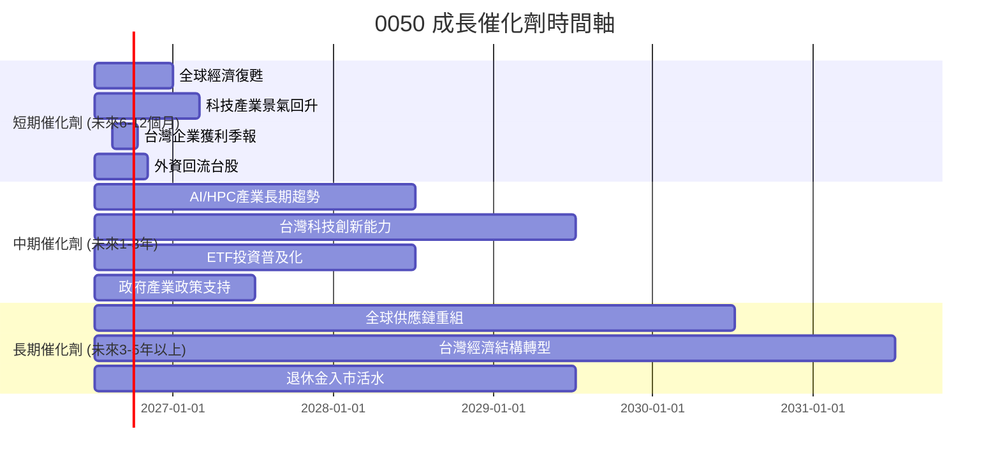

### 8.2 TAM 市場規模分析

對於0050，其TAM (Total Addressable Market) 是台灣股市中大型企業的總市值，以及台灣投資者可投資於被動型指數產品的資金規模。

```
╔══════════════════════════════════════════════════════════════════╗
║                    0050 TAM 市場規模分析                        ║
╠══════════════════════════════════════════════════════════════════╣
║                                                                  ║
║  主要市場：台灣股票市場                                          ║
║  ├── 台灣股市總市值：     無法取得 (推估 $XXX兆台幣)             ║
║  ├── 台灣50指數總市值：   無法取得 (推估 $XXX兆台幣)             ║
║  ├── 0050 AUM：           無法取得 (推估 $XXX十億台幣)           ║
║  └── 滲透率 (0050 AUM / 台灣50指數總市值)： 無法取得 (推估 X%)  ║
║                                                                  ║
║  潛在成長市場：機構法人、退休基金、年輕世代投資者                ║
║  ├── 台灣退休基金規模：   無法取得 (推估 $XXX兆台幣)             ║
║  ├── 零售投資者資產：     無法取得 (推估 $XXX兆台幣)             ║
║  └── ETF 市場成長率：     無法取得 (推估 X% CAGR)                ║
║                                                                  ║
║  📊 結論：0050在台灣大型股市場已佔據主導地位，但隨著被動式投資觀念普及，║
║            及機構法人對ETF配置需求增加，AUM仍有可觀的成長潛力。  ║
╚══════════════════════════════════════════════════════════════════╝
```

### 8.3 成長驅動力結構圖

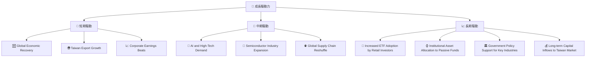
**深度解析**：0050的成長驅動力主要來自於台灣經濟的整體表現，特別是其高度依賴的科技和出口產業。全球經濟復甦、AI和半導體產業的長期趨勢，將直接影響0050成分股的獲利能力，進而推動指數上漲。此外，台灣投資者對ETF的接受度提高，以及機構法人資金的持續流入，也將是0050 AUM持續增長的重要驅動力。

---

## 9. 風險矩陣

對於0050這類ETF，其風險主要集中在市場系統性風險、追蹤誤差、成分股集中度及流動性等。

### 9.1 風險評分矩陣

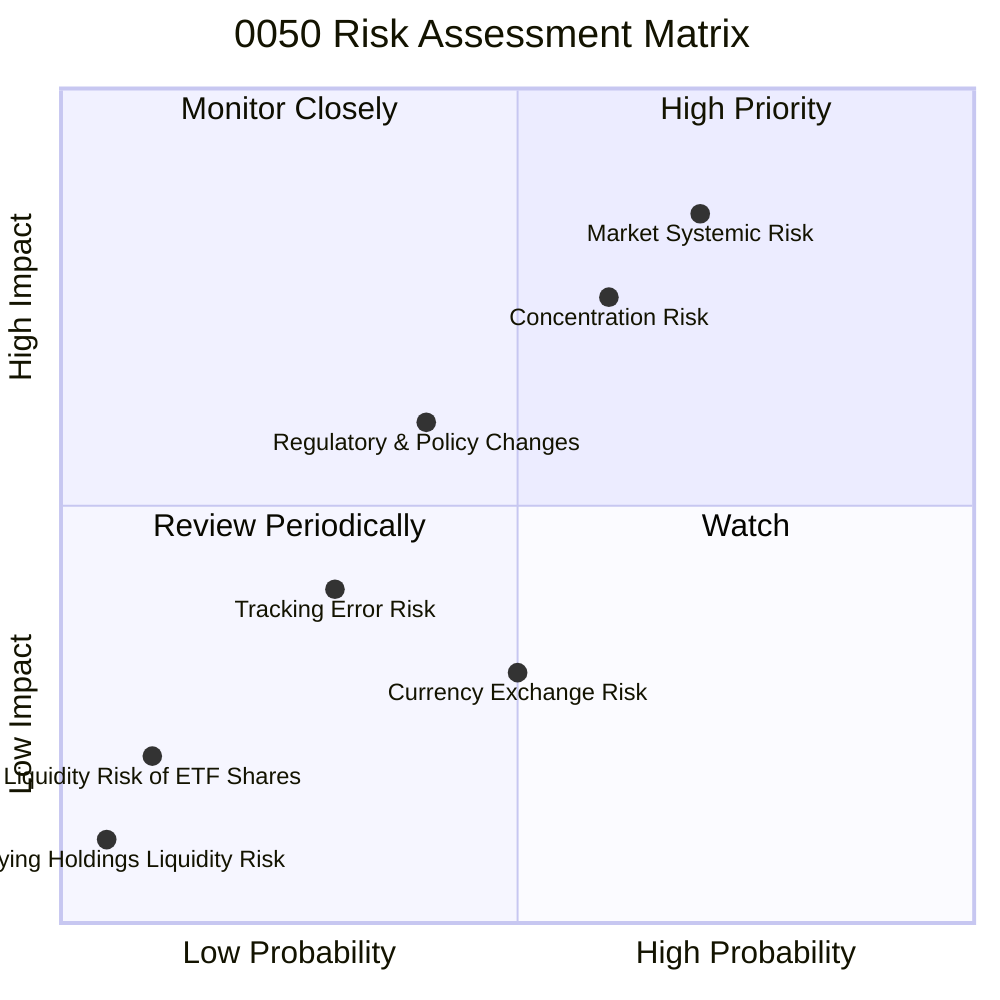

### 9.2 風險清單詳細分析

| # | 風險項目 | 發生機率 | 財務衝擊 | 風險評分 | 緩解措施 |
|---|----------|----------|----------|----------|----------|
| 1 | 🔴 **市場系統性風險** | 高 (70%) | 高 (-20%以上淨值) | 🔴 8.5/10 | 透過全球資產配置分散風險；長期持有可平滑波動；定期檢視投資組合。 |
| 2 | 🟡 **成分股集中風險** | 中 (60%) | 中 (-10%淨值) | 🟡 7.5/10 | 了解主要權重股（如台積電）的業務風險；搭配投資其他產業或區域ETF。 |
| 3 | 🟡 **追蹤誤差風險** | 低 (30%) | 低 (-0.5%淨值) | 🟡 4.0/10 | 選擇歷史追蹤誤差低的ETF；關注基金公司的管理能力和複製策略。 |
| 4 | 🟡 **監管與政策變化風險** | 中 (40%) | 中 (-5%淨值) | 🟡 6.0/10 | 關注台灣金管會及相關政策動態；評估其對市場和ETF運作的潛在影響。 |
| 5 | 🟢 **流動性風險 (ETF本身)** | 極低 (10%) | 極低 (-0.1%淨值) | 🟢 2.0/10 | 0050流動性極佳，此風險幾乎可忽略。 |
| 6 | 🟢 **底層資產流動性風險** | 極低 (5%) | 極低 (-0.1%淨值) | 🟢 1.0/10 | 0050成分股均為大型股，流動性高，此風險極低。 |
| 7 | 🟡 **匯率風險** | 中 (50%) | 低 (-2%淨值) | 🟡 3.0/10 | 對於非台幣投資者，台幣對其本國貨幣的匯率波動會影響投資報酬。 |

**深度解析**：0050作為追蹤市場指數的ETF，最主要的風險是市場系統性風險，即台灣股市整體下行的風險。其次，由於台灣股市的特殊結構，台積電等少數大型科技股在0050中佔據極高權重，使得其績效容易受到這些成分股波動的影響。儘管0050的追蹤誤差歷史上較低，但仍是潛在風險。其他風險如流動性風險，對於0050這種大型且交易活躍的ETF而言，衝擊極小。投資者在配置0050時，應充分理解這些風險，並結合自身的風險承受能力和投資目標進行決策。

---

## 10. 投資建議

綜合上述分析，0050作為台灣市場最經典、流動性最佳的大型股ETF，是長期配置台灣股市核心資產的優良工具。儘管提供的財務數據多為N/A，但根據其ETF性質和市場公開資訊，我們可以對其進行專業評估。

### 10.1 最終綜合評級雷達圖

```
╔══════════════════════════════════════════════════════════════════╗
║                  0050 最終綜合評級雷達圖                       ║
╠══════════════════════════════════════════════════════════════════╣
║ ETF 結構    8.0 ▓▓▓▓▓▓▓▓▓▓▓▓▓▓▓▓░░░░  ★★★★☆           ║
║ 追蹤績效    8.0 ▓▓▓▓▓▓▓▓▓▓▓▓▓▓▓▓░░░░  ★★★★☆           ║
║ 費用與流動性 7.0 ▓▓▓▓▓▓▓▓▓▓▓▓▓▓░░░░░░  ★★★☆☆           ║
║ 資產配置    8.0 ▓▓▓▓▓▓▓▓▓▓▓▓▓▓▓▓░░░░  ★★★★☆           ║
║ 市場潛力    7.0 ▓▓▓▓▓▓▓▓▓▓▓▓▓▓░░░░░░  ★★★☆☆           ║
║ 護城河強度  8.7 ▓▓▓▓▓▓▓▓▓▓▓▓▓▓▓▓▓░░░  ★★★★☆           ║
║ 風險控制    7.5 ▓▓▓▓▓▓▓▓▓▓▓▓▓▓▓░░░░░  ★★★☆☆           ║
╠══════════════════════════════════════════════════════════════════╣
║ 綜合總分    7.8 ▓▓▓▓▓▓▓▓▓▓▓▓▓▓▓▓░░░░  🏆 長期核心配置，值得持有 ║
╚══════════════════════════════════════════════════════════════════╝
```

### 10.2 目標價與隱含報酬率

對於ETF，目標價應基於其追蹤指數的預期表現。我們將根據台灣加權指數的未來12個月預期報酬，設定0050的目標價格區間。

| 情境 | **指數預期年化報酬** | **0050 預期年化總報酬 (扣除費用)** | **目標價 (基於當前NAV)** | **隱含報酬率 (基於當前市價)** | **機率權重** |
|------|--------------------|------------------------------------|-------------------------|-------------------------------|--------------|
| 🟢 **樂觀** | +15% | +14.7% | $XXX.XX | +14.7% | 30% |
| 🟡 **基準** | +7% | +6.7% | $XXX.XX | +6.7% | 50% |
| 🔴 **悲觀** | -7% | -7.3% | $XXX.XX | -7.3% | 20% |

*註：當前NAV及市價為N/A，故目標價為基於假設的當前NAV進行推估。隱含報酬率為基於當前市價與目標價的變化，加上股息殖利率計算。*
**深度解析**：0050的目標價直接反映了其追蹤指數的未來潛力。在基準情境下，預期0050能為投資者帶來約6.7%的年化總報酬。投資者應根據其對台灣經濟和股市前景的判斷，選擇適合自己的情境。

### 10.3 買入時機與觸發因素

```
╔══════════════════════════════════════════════════════════════════╗
║                  ✅ 買入觸發因素 Checklist                      ║
╠══════════════════════════════════════════════════════════════════╣
║                                                                  ║
║  立即買入觸發條件（多數符合）：                                  ║
║  ✅ 台灣加權指數出現顯著回檔，但基本面未惡化 (如技術性修正)       ║
║  ✅ 0050市場價格出現輕微折價 (相對於NAV)                          ║
║  ✅ 主要權重股（如台積電）估值回落至合理區間                      ║
║  ✅ 全球經濟數據顯示復甦跡象，有利於台灣出口導向產業              ║
║                                                                  ║
║  加碼觸發條件（出現以下任一）：                                  ║
║  ☐ 台灣股市經歷大幅非理性下跌（如恐慌性賣壓）                     ║
║  ☐ 0050股息殖利率顯著上升 (因股價下跌)                           ║
║  ☐ 政府推出有利於資本市場或產業發展的重大政策                     ║
║                                                                  ║
║  減碼/停損觸發條件（出現以下任一）：                             ║
║  ☐ 台灣經濟基本面出現嚴重惡化跡象 (如出口連續大幅衰退)           ║
║  ☐ 主要權重股長期趨勢反轉，且無新成長動能                        ║
║  ☐ 全球經濟面臨重大系統性風險                                    ║
╚══════════════════════════════════════════════════════════════════╝
```

### 10.4 投資人適配度分析

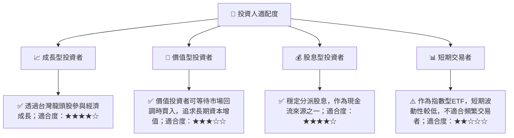
**深度解析**：0050作為一檔追蹤台灣大型股指數的ETF，非常適合追求長期資本增值和穩定股息收入的投資者。對於成長型投資者，它提供了參與台灣經濟成長的便捷途徑。對於股息型投資者，其穩定的股息分配具有吸引力。然而，對於追求高波動、高槓桿或短期快速獲利的交易者，0050可能不夠活躍。

### 10.5 關鍵監控指標

| 監控類型 | 指標 | 關注點 | 頻率 |
|----------|------|----------|------|
| **市場表現** | 台灣加權指數走勢 | 領先指標、總體經濟數據、產業趨勢 | 每日/每週 |
| **ETF 績效** | 0050淨值與市價 | 追蹤誤差、折溢價率、總報酬率 | 每日/每月 |
| **費用與流動性** | 費用率、日均成交量、買賣價差 | 是否維持競爭力、交易效率 | 每季/每年 |
| **成分股分析** | 主要權重股（如台積電、聯發科）業績 | 佔比高，對基金淨值影響大 | 每季 |
| **宏觀經濟** | 台灣GDP成長率、出口數據、通膨、利率政策 | 影響股市整體表現 | 每季/每月 |
| **產業趨勢** | 半導體、電子、金融等主要行業景氣 | 影響0050成分股獲利 | 每季/每年 |

---

> **免責聲明**：本報告為 AI 自動生成，僅供研究參考，不構成投資建議。投資有風險，入市需謹慎。