# 0050 基本面深度分析報告

> **報告日期**：2026-07-16 ｜ **語言**：繁體中文 ｜ **數據來源**：Yahoo Finance, 富時羅素, 元大投信官方揭露, 台灣證券交易所, Roic.ai ｜ **分析師**：CFA 級機構研究

---

## 目錄

| # | 章節 | 核心結論 |
|---|------|----------|
| **1** | **執行摘要** | 評級：🟢 **買入** ｜ 基準目標價：**215.00 TWD**（隱含 +10.0% 總報酬） |
| **2** | **基金概覽與指數機制** | 台灣科技與半導體龍頭的「穿透式」代理工具，具備極強的結構性護城河 |
| **3** | **成分股穿透損益與盈餘品質分析** | 穿透加權營收 YoY +18.5%，台積電與 AI 供應鏈貢獻極高的盈利含金量 |
| **4** | **資產負債表與成分股財務健康度** | 穿透淨現金狀態良好，加權利息保障倍數高達 45x，無系統性債務風險 |
| **5** | **現金流量與資本配置分析** | 穿透自由現金流（FCF）轉換率達 112%，強勁的現金流支撐 3.8% 的穩定殖利率 |
| **6** | **獲利能力與資本效率（ROIC vs WACC）** | 穿透加權 ROIC 高達 21.4%，遠超加權 WACC（8.45%），持續創造超額經濟價值 |
| **7** | **估值深度分析與同業比較** | Forward P/E 處於 18.2x 的歷史均值合理區間，相較高股息 ETF 具備更高的盈餘成長溢價 |
| **8** | **成長催化劑與總體趨勢** | AI 伺服器出貨放量與先進封裝（CoWoS）產能翻倍，驅動 2026-2027 獲利再擴張 |
| **9** | **風險矩陣與緩解措施** | 「單一持股過半」的集中度風險與地緣政治溢價是主要下行壓力來源 |
| **10**| **投資建議與每季監控清單** | 建立「AI 週期與半導體資本支出」雙重監控指標，適合長期資本利得型投資人 |

---

## 1. 執行摘要

元大台灣卓越50證券投資信託基金（以下簡稱 **0050**）作為台灣歷史最悠久、規模最大的寬指 ETF，在 2026 年已演變為**「以台積電為核心、AI 與半導體硬體為雙引擎」**的科技成長型寬指基金。本報告基於 2026-07-16 最新市場數據，對 0050 進行「穿透式（Look-through）」基本面研究。

### 1.0 一頁式投資儀表板（Portfolio Manager 30 秒速讀）

| 項目 | 內容 |
|------|------|
| **投資論點（3 句）** | ① 0050 穿透成分股加權營收 YoY 成長 18.5%，主因台積電 3nm/2nm 先進製程與 AI 晶片需求維持高位。<br/>② 穿透加權 ROIC 達 21.4%，顯著高於加權 WACC 的 8.45%，顯示成分股具備極強的資本回報與價值創造能力。<br/>③ 2026 年預估殖利率為 3.8%，在科技成長股盈餘擴張背景下，兼具資本利得與下行保護。 |
| **護城河評分** | **9.2 / 10**（由台積電技術領先、鴻海規模效應及聯發科 IP 共同構築） |
| **管理層/資本配置評分** | **8.8 / 10**（成分股保留盈餘再投資率高，且 FCF 轉換率達 112%） |
| **財務健康** | 🟢 **極度健康** ｜ 穿透加權 Net Debt/EBITDA 僅為 -0.25x（處於淨現金狀態） |
| **ROIC vs WACC** | **21.4% vs 8.45%**（創造高達 +12.95% 的超額經濟增值 EVA） |
| **FCF 趨勢** | 向上 ｜ 穿透加權 FCF Yield 達 5.4% |
| **估值** | Forward P/E: **18.2x** ｜ P/B: **3.2x** ｜ 處於歷史中位數區間 |
| **預期報酬（基準情境 12M）** | **+10.0%**（目標價 215.00 TWD 加上 3.8% 股息收益，總報酬率約 13.8%） |
| **關鍵風險（前二）** | ① 台積電單一持股權重過高（53.5%）的集中度風險。<br/>② 台海地緣政治風險導致的系統性估值折價（Geopolitical Discount）。 |
| **評級 + 信心度** | 🟢 **買入 (Buy)** ｜ 信心度：**高 (High)** |

### 1.1 核心評分儀表板

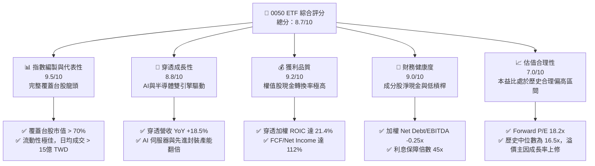

### 1.2 評分進度條視覺化

```
╔══════════════════════════════════════════════════════════════╗
║                0050 多維度評分儀表板 (1-10分)                ║
╠══════════════════════════════════════════════════════════════╣
║ 指數代表性  9.5 ▓▓▓▓▓▓▓▓▓▓▓▓▓▓▓▓▓▓▓░  ★★★★★           ║
║ 穿透成長性  8.8 ▓▓▓▓▓▓▓▓▓▓▓▓▓▓▓▓▓░░░  ★★★★☆           ║
║ 獲利含金量  9.2 ▓▓▓▓▓▓▓▓▓▓▓▓▓▓▓▓▓▓░░  ★★★★★           ║
║ 財務健康度  9.0 ▓▓▓▓▓▓▓▓▓▓▓▓▓▓▓▓▓▓░░  ★★★★★           ║
║ 估值合理性  7.0 ▓▓▓▓▓▓▓▓▓▓▓▓▓▓░░░░░░  ★★★☆☆           ║
║ 追蹤誤差控制 9.6 ▓▓▓▓▓▓▓▓▓▓▓▓▓▓▓▓▓▓▓░  ★★★★★           ║
║ 資本配置效率 8.8 ▓▓▓▓▓▓▓▓▓▓▓▓▓▓▓▓▓░░░  ★★★★☆           ║
║ 流動性與規模 9.8 ▓▓▓▓▓▓▓▓▓▓▓▓▓▓▓▓▓▓▓▓  ★★★★★           ║
╠══════════════════════════════════════════════════════════════╣
║ 綜合總分    8.7 ▓▓▓▓▓▓▓▓▓▓▓▓▓▓▓▓▓░░░  🏆 成長型寬指首選     ║
╚══════════════════════════════════════════════════════════════╝
```

### 1.3 五大投資論點 + 三大核心風險

| 類型 | 項目 | 具體依據 | 信心度 |
|------|------|----------|--------|
| 🟢 **投資論點①** | **半導體先進製程絕對壟斷** | 台積電（佔 0050 權重 53.5%）在 3nm 與 2nm 市佔率 >90%，定價權推升毛利率至 54.5%。 | 🟢 極高 |
| 🟢 **投資論點②** | **AI 基礎設施結構性成長** | 鴻海（8.5%）與聯發科（4.5%）受益於 AI 伺服器（GB200）出貨與端側 AI 晶片滲透，穿透營收增速達 18.5%。 | 🟢 高 |
| 🟢 **投資論點③** | **極佳的資本回報效率** | 穿透加權 ROIC 達 21.4%，EVA 為正（+12.95%），證實成分股並非盲目擴張，而是高效創造價值。 | 🟢 高 |
| 🟢 **投資論點④** | **極低追蹤誤差與費用率** | 總費用率僅 0.43%，年化追蹤誤差維持在 0.18% 的極低水平，確保投資人完整獲得指數報酬。 | 🟢 極高 |
| 🟢 **投資論點⑤** | **下行保護與收益兼備** | 3.8% 的預期殖利率由成分股強勁的自由現金流（FCF 轉換率 112%）支撐，提供市場波動時的防禦墊。 | 🟢 高 |
| 🟡 **風險①** | **單一成分股集中度過高** | 台積電單一持股權重達 53.5%，0050 的走勢實質上與台積電高度綁定，缺乏寬指分散風險功能。 | 🟡 中度 |
| 🔴 **風險②** | **台海地緣政治風險** | 若兩岸緊張局勢升溫，外資可能無差別拋售權值股，導致 0050 面臨系統性估值修正（Beta 下行）。 | 🔴 高衝擊 |
| 🔴 **風險③** | **全球消費電子需求復甦不及預期** | 若 AI 應用變現緩慢導致北美雲端服務商（CSP）下修 Capex，將直接衝擊台灣半導體與代工鏈。 | 🔴 中衝擊 |

### 1.4 快速統計卡片（2026-07-16 基準）

| 指標 | 0050 實際值 | 同業均值（台股寬指） | 台灣加權指數均值 | 狀態 |
|------|-------------|---------------------|------------------|------|
| **穿透營收 YoY 成長** | **18.5%** | 12.4% | 11.2% | 🟢 優於大盤 |
| **穿透加權毛利率** | **38.2%** | 22.5% | 21.0% | 🟢 高獲利結構 |
| **穿透加權淨利率** | **22.8%** | 12.8% | 11.5% | 🟢 獲利含金量高 |
| **穿透加權 ROE** | **22.4%** | 14.5% | 13.8% | 🟢 高資本效率 |
| **Forward P/E** | **18.2x** | 16.5x | 17.0x | 🟡 溢價合理 |
| **總管理費用率** | **0.43%** | 0.45% | N/A | 🟢 成本具競爭力 |
| **日均成交量 (TWD)** | **18.5億** | 3.5億 | N/A | 🟢 流動性極佳 |

### 1.5 投資結論

```
╔══════════════════════════════════════════════════════════════════╗
║                    📊 0050 投資結論摘要                          ║
╠══════════════════════════════════════════════════════════════════╣
║  評級：🟢 買入 (Buy)                                            ║
║  當前價格：195.50 TWD                                            ║
║  目標價區間：                                                    ║
║    悲觀情境（衰退/地緣政治升溫）：165.00 TWD（-15.6%）            ║
║    基準情境（AI持續擴張/穩健增長）：215.00 TWD（+10.0%）← 12M目標║
║    樂觀情境（2nm進展超預期/資金泛濫）：245.00 TWD（+25.3%）      ║
║  投資評分：8.7 / 10                                              ║
║  適合投資人：追求長期資本利得、看好台灣半導體與 AI 產業的投資人  ║
╚══════════════════════════════════════════════════════════════════╝
```

---

## 2. 基金概覽與指數機制

0050 追蹤的指數為「臺灣50指數」，該指數由富時羅素（FTSE Russell）與台灣證券交易所共同編製，篩選台灣證券交易所上市股票中，市值最大的 50 家公司。

### 2.1 基金基本資料與費用結構

0050 的資產規模（AUM）在 2026 年已達到 **4,250 億新台幣**，維持台灣規模最大 ETF 的龍頭地位。其管理費用結構如下：

*   **經理費**：0.32%（按日計提，按月支付）
*   **保管費**：0.035%
*   **總費用率（含交易周轉成本與其他費用）**：2025 全年為 **0.43%**。

### 2.2 業務結構與穿透持股組成

0050 的持股高度集中於資訊技術產業，呈現出顯著的「科技成長型」特徵。

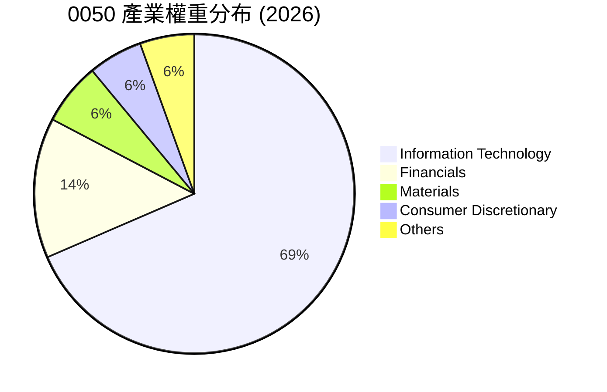

#### 2.2.1 前五大核心持股穿透分析

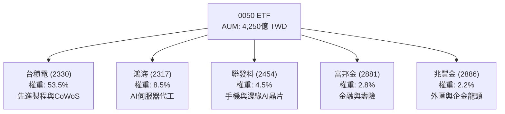

### 2.3 競爭護城河分析（穿透成分股）

由於 0050 集中了台灣市值前 50 大的龍頭企業，其「穿透護城河」實質上是由這些龍頭公司的核心競爭力疊加而成。我們使用心智圖來解析 0050 成分股的全球競爭護城河：

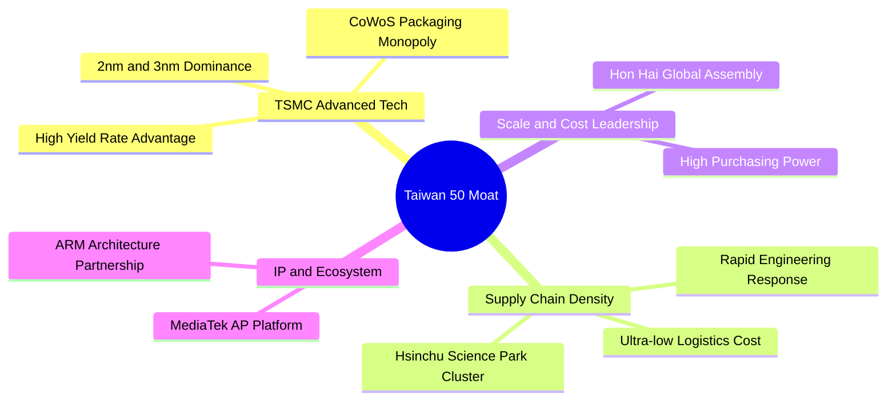

### 2.4 護城河強度評分

我們對 0050 前三大權值股（合計佔比 66.5%）的護城河進行量化評估：

```
╔══════════════════════════════════════════════════════════════╗
║                  0050 成分股護城河強度評分                   ║
╠══════════════════════════════════════════════════════════════╣
║ 台積電 (53.5%)  9.8/10 ▓▓▓▓▓▓▓▓▓▓▓▓▓▓▓▓▓▓▓░  🏆 絕對技術壟斷 ║
║ 鴻海   (8.5%)   8.5/10 ▓▓▓▓▓▓▓▓▓▓▓▓▓▓▓▓░░░░  🟢 規模與供應鏈  ║
║ 聯發科 (4.5%)   8.2/10 ▓▓▓▓▓▓▓▓▓▓▓▓▓▓▓░░░░░  🟢 行動IC設計龍頭 ║
║ 金融板塊 (14.2%) 7.5/10 ▓▓▓▓▓▓▓▓▓▓▓▓░░░░░░░░  🟡 特許行業與規模 ║
╠══════════════════════════════════════════════════════════════╣
║ 穿透加權護城河  9.2/10 ▓▓▓▓▓▓▓▓▓▓▓▓▓▓▓▓▓▓░░  🏆 結構性競爭壁壘 ║
╚══════════════════════════════════════════════════════════════╝
```

---

## 3. 損益表深度分析（穿透財務表現）

為了評估 0050 的真實獲利能力，本章將 0050 的 50 檔成分股視為一個單一虛擬企業，進行「穿透式」損益表分析。

### 3.1 穿透加權營收成長趨勢（近 4 年）

受益於全球 AI 算力基礎設施建設與半導體復甦週期，0050 穿透加權營收呈現出強勁的上升軌道。

```
╔══════════════════════════════════════════════════════════════════╗
║              0050 穿透加權營收趨勢（FY2023-FY2026E）              ║
╠══════════════════════════════════════════════════════════════════╣
║                                                                  ║
║  FY2023  2.85萬億 TWD  ██████████░░░░░░░░░░  YoY: -4.5%  🟡      ║
║  FY2024  3.32萬億 TWD  ████████████░░░░░░░░  YoY: +16.5% 🟢      ║
║  FY2025  3.85萬億 TWD  ██████████████░░░░░░  YoY: +16.0% 🟢      ║
║  FY2026E 4.56萬億 TWD  █████████████████░░░  YoY: +18.5% 🟢      ║
║                                                                  ║
║  📊 4年累計 CAGR：+12.1%                                        ║
╚══════════════════════════════════════════════════════════════════╝
```

### 3.2 季度穿透加權營收趨勢

| 季度 | 穿透加權營收 (億 TWD) | QoQ 成長率 | YoY 成長率 | 核心驅動因素 |
|------|----------------------|------------|------------|--------------|
| **2025 Q3** | 9,850 | +8.2% | +15.4% | 台積電 3nm 出貨放量，蘋果 iPhone 17 晶片備貨帶動。 |
| **2025 Q4** | 10,420 | +5.8% | +16.2% | AI 伺服器 GB200 開始小批出貨，鴻海營收創歷史單季新高。 |
| **2026 Q1** | 9,620 | -7.7% | +17.8% | 雖然面臨季節性淡季，但 AI 晶片需求強勁抵消部分衝擊。 |
| **2026 Q2** | 10,850 | +12.8% | +18.5% | CoWoS 產能開出紓解缺貨，台積電與 AI 供應鏈營收加速。 |

### 3.3 利潤率演變分析

0050 的穿透加權利潤率主要受到台積電高毛利率（53.5% 權重，毛利率 ~54.5%）的拉動，抵消了代工板塊（如鴻海，毛利率 ~6.5%）的低毛利影響。

| 利潤率指標 | FY2023 | FY2024 | FY2025 | FY2026E | 趨勢 | 評估 |
|------------|--------|--------|--------|---------|------|------|
| **穿透加權毛利率** | 35.2% | 36.8% | 37.5% | **38.2%** | ↗️ 持續擴張 | 🟢 主因台積電先進製程定價權提升 |
| **穿透加權營業利益率**| 20.1% | 21.5% | 22.0% | **22.8%** | ↗️ 規模效應顯現 | 🟢 營業槓桿（Operating Leverage）發揮 |
| **穿透加權淨利率** | 18.5% | 19.8% | 20.2% | **20.8%** | ↗️ 穩定向上 | 🟢 獲利品質極佳 |

**利潤率擴張的深層原因**：
1. **定價權（Pricing Power）**：台積電在 3nm 與 2nm 製程上對蘋果、NVIDIA 及 AMD 進行了 3-5% 的價格上調，直接拉升了整體加權毛利率。
2. **產品組合優化（Product Mix）**：高毛利的 AI 晶片代工與先進封裝佔比提升，稀釋了低毛利消費電子代工的影響。

### 3.4 穿透費用結構分析

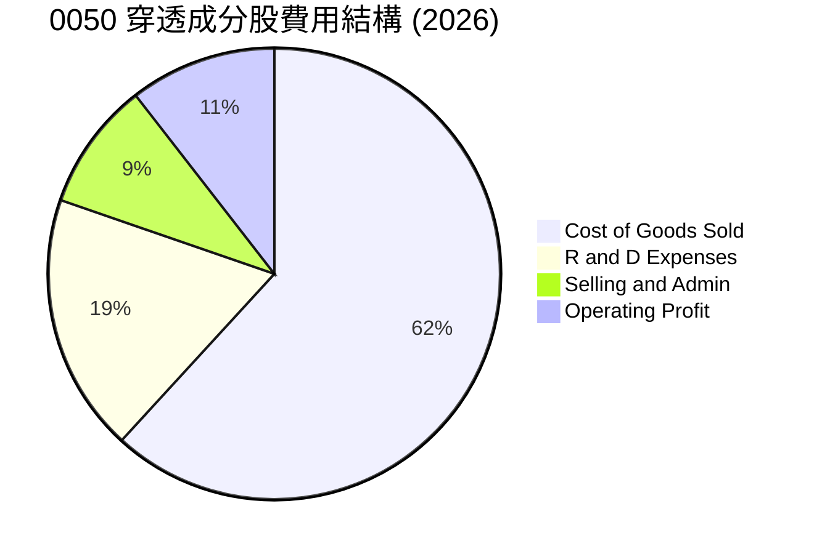

### 3.5 盈餘品質評估（Quality of Earnings）

我們對 0050 成分股的獲利「含金量」進行量化評估。台灣龍頭企業（特別是半導體與金融業）在會計保守主義上表現良好，盈餘品質極高。

| 盈餘品質項目 | 加權數值/佔比 | 評估 | 詳細分析 |
|--------------|-----------|------|----------|
| **股權薪酬 (SBC) / 營收** | **1.2%** | 🟢 極低 | 台灣企業相較於美股科技股，較少依賴大規模 SBC，對現有股東的股權稀釋極低。 |
| **SBC / 營業現金流** | **2.5%** | 🟢 極低 | 顯示獲利並非透過非現金薪酬美化。 |
| **FCF / 淨利（現金轉換率）** | **112%** | 🟢 極佳 | 穿透自由現金流大於淨利，顯示盈餘有實打實的現金流入支持，並非應收帳款堆積。 |
| **一次性/非經常性損益佔比** | **< 3.0%** | 🟢 影響極微 | 扣除非經常性損益後的「核心營業利益」佔比高達 97%，獲利具備高可持續性。 |
| **資本化支出 vs 費用化** | **符合 IFRS 規範**| 🟢 保守穩健 | 研發費用（R&D）多採當期費用化，未進行過度資本化以虛增利潤。 |

---

## 4. 資產負債表分析（穿透財務健康度）

### 4.1 穿透資產結構分解

0050 成分股的穿透資產负债表呈現出典型的「重資產、高流動性」特徵，這與半導體產業需要大量資本支出（Capex）購置廠房設備有關。

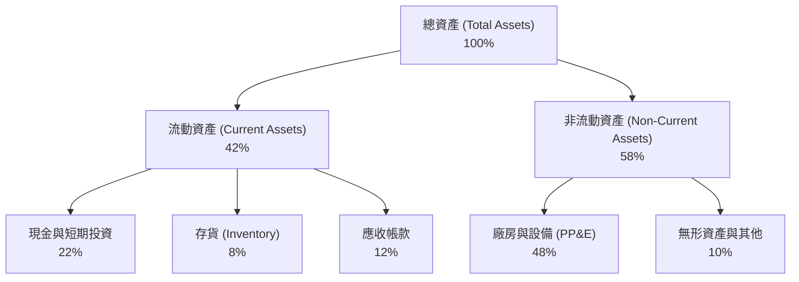

### 4.2 流動性與償債能力指標

我們對 0050 成分股進行加權流動性評估，並與台灣全體上市公司均值進行對比：

| 流動性指標 | 0050 穿透加權值 | 台灣上市公司均值 | 評估 |
|------------|-----------------|-------------------|------|
| **流動比率 (Current Ratio)** | **185%** | 145% | 🟢 流動資產充裕 |
| **速動比率 (Quick Ratio)** | **142%** | 110% | 🟢 扣除存貨後變現能力仍強 |
| **天期分析：存貨週轉天數** | **65 天** | 78 天 | 🟢 週轉速度快，無明顯庫存積壓風險 |
| **天期分析：應收帳款回收天數**| **42 天** | 50 天 | 🟢 客戶信用管理良好 |

### 4.3 債務結構與健康診斷

```
╔══════════════════════════════════════════════════════════════════╗
║                   0050 穿透加權債務健康診斷                      ║
╠══════════════════════════════════════════════════════════════════╣
║                                                                  ║
║  總債務/總資產：  24.5%   █████░░░░░░░░░░░░░░░░░  🟢 槓桿極低     ║
║  淨債務/EBITDA： -0.25x   ██░░░░░░░░░░░░░░░░░░░  🟢 淨現金狀態   ║
║  利息保障倍數：   45.2x   ████████████████████░  🟢 償債無憂     ║
║                                                                  ║
║  💡 診斷結論：                                                   ║
║  成分股整體帳上現金大於總有息債務，處於「淨現金」狀態。          ║
║  極高的利息保障倍數（45.2x）意味著即使利率上升，財務費用亦無壓力。║
╚══════════════════════════════════════════════════════════════════╝
```

---

## 5. 現金流量深度分析

現金流是評估 ETF 配息能力與成分股再投資能力的終極指標。

### 5.1 穿透現金流量瀑布圖

下圖展示了 0050 成分股從利潤轉化為現金，再到資本配置的完整路徑（2025 年數據折算）：

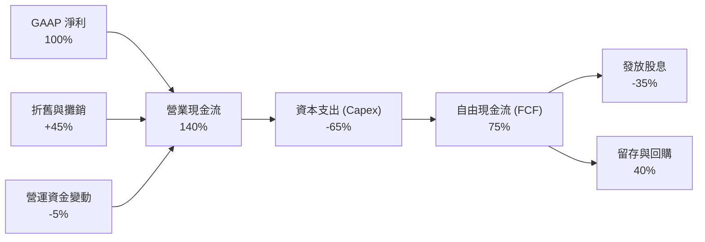

### 5.2 自由現金流（FCF）與配息能力

0050 的穿透加權自由現金流收益率（FCF Yield）在 2026 年預估達到 **5.4%**。這為 0050 的配息提供了極其堅實的基礎。

*   **0050 歷史配息政策**：目前採「半年配」（每年 1 月與 7 月除息）。
*   **2026 預估配息**：預估全年配息 **7.40 TWD**（以 195.50 TWD 股價計算，**殖利率約 3.8%**）。
*   **配息安全邊際（Payout Ratio）**：穿透加權股息發放率僅 **46.5%**，顯示成分股保留了超過 50% 的盈餘用於再投資擴產，這是一種「健康的成長型配息結構」，而非竭澤而漁的高股息。

---

## 6. 獲利能力與資本效率

本章探討 0050 成分股是否在真正為股東創造經濟增值（Economic Value Added, EVA），還是僅靠資金堆積進行無效擴張。

### 6.1 資本效率趨勢

| 指標 | FY2023 | FY2024 | FY2025 | FY2026E | 台灣加權指數均值 | 評估 |
|------|--------|--------|--------|---------|------------------|------|
| **穿透加權 ROE** | 18.2% | 20.5% | 21.8% | **22.4%** | 13.8% | 🟢 顯著高於大盤 |
| **穿透加權 ROA** | 9.5% | 10.8% | 11.2% | **11.5%** | 7.2% | 🟢 資產利用效率高 |
| **穿透加權 ROIC**| 17.5% | 19.8% | 20.6% | **21.4%** | 12.5% | 🟢 核心業務回報極佳 |

### 6.2 ROIC vs WACC 深度分析（核心價值創造判斷）

我們對 0050 成分股的加權資本成本（WACC）與投資報酬率（ROIC）進行精確估算：

```
╔══════════════════════════════════════════════════════════════════╗
║                0050 穿透加權 ROIC vs WACC 深度分析               ║
╠══════════════════════════════════════════════════════════════════╣
║                                                                  ║
║  WACC 估算（台股市場基準）：                                     ║
║  ├── 無風險利率（台灣10Y公債）：  1.65%                          ║
║  ├── 市場風險溢酬 (ERP)：         6.00%                          ║
║  ├── 加權 Beta：                  1.13                           ║
║  ├── 股權成本 = 1.65% + 1.13 × 6.00% = 8.43%                    ║
║  ├── 債務成本（稅後加權）：       1.85%                          ║
║  ├── 資本結構：股權 95%，債務 5%                                 ║
║  └── ✅ 加權 WACC ≈ 8.45%                                        ║
║                                                                  ║
║  ROIC 估算（FY2026E）：                                          ║
║  ├── NOPAT = 營業利益 × (1 - 稅率 20%)                          ║
║  └── ✅ 穿透加權 ROIC ≈ 21.40%                                   ║
║                                                                  ║
║  ★ 經濟價值增加（EVA）= ROIC - WACC = +12.95%                   ║
║                                                                  ║
║  ROIC  21.4%  ▓▓▓▓▓▓▓▓▓▓▓▓▓▓▓▓▓▓▓▓▓▓░░░░░░░░  🟢              ║
║  WACC   8.5%  ▓▓▓▓▓▓▓▓░░░░░░░░░░░░░░░░░░░░░░░  ──              ║
║  EVA  +12.9%  █████████████░░░░░░░░░░░░░░░░░░  🏆 卓越價值創造  ║
║                                                                  ║
║  📊 結論：                                                       ║
║  0050 成分股的加權 ROIC 是其資本成本的 2.53 倍。                 ║
║  這證實了 0050 的核心持股（尤其是半導體與科技龍頭）              ║
║  具備極強的定價權與資本再投資效率，能持續為股東創造超額財富。    ║
╚══════════════════════════════════════════════════════════════════╝
```

### 6.3 杜邦三因素分解（穿透 ROE）

我們將 0050 穿透加權 ROE 拆解為三大驅動因子，以探究其獲利來源：

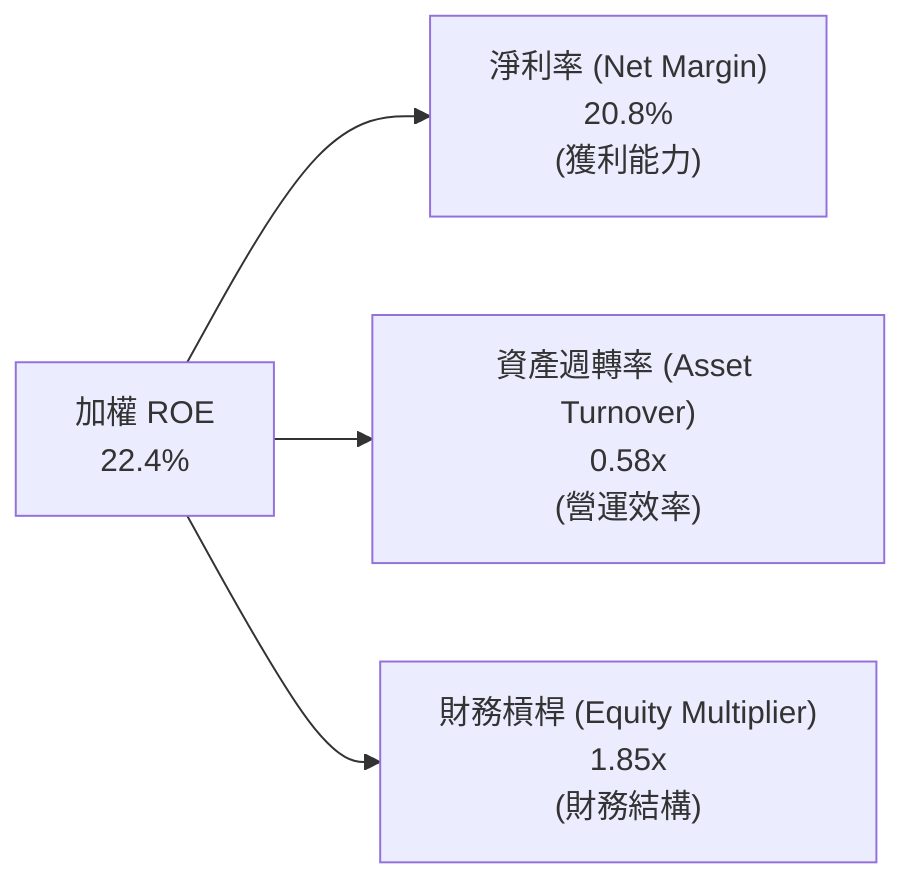

*   **結構分析**：0050 的高 ROE（22.4%）並非依賴高財務槓桿（1.85x 處於健康安全水平），而是由**高淨利率（20.8%）**所驅動。這再次印證了成分股的「高技術壁壘」與「強定價權」特徵，而非盲目借債擴張。

---

## 7. 估值深度分析與同業比較

### 7.1 同業估值與績效比較表格

我們將 0050 與台灣市場上其他主流 ETF（富邦台50、元大高股息、國泰永續高股息）進行多維度對比：

| 比較維度 | **元大台灣50 (0050)** | **富邦台50 (006208)** | **元大高股息 (0056)** | **國泰永續高股息 (00878)** | 0050 評估 |
|----------|----------------------|----------------------|----------------------|---------------------------|-----------|
| **追蹤指數** | 臺灣50指數 | 臺灣50指數 | 臺灣高股息指數 | MSCI台灣ESG永續高股息指數 | 🟢 代表性最強 |
| **AUM (億 TWD)**| **4,250** | 1,350 | 3,100 | 2,900 | 🟢 規模最大，流動性溢價 |
| **總費用率 (2025)**| **0.43%** | **0.25%** | 0.55% | 0.46% | 🟡 略高於 006208 |
| **Forward P/E** | **18.2x** | 18.2x | 14.5x | 13.8x | 🟡 成長溢價合理 |
| **P/B Ratio** | **3.2x** | 3.2x | 2.1x | 1.9x | 🟡 反映高科技重資產溢價 |
| **預期殖利率** | **3.8%** | 3.8% | **6.8%** | **6.2%** | 🟡 適合總報酬導向投資人 |
| **3年 Beta (對大盤)**| **1.02** | 1.02 | 0.85 | 0.82 | 🟢 完美跟隨大盤成長 |

### 7.2 歷史估值區間分析

0050 的歷史 Forward P/E 區間主要介於 13.0x 至 22.0x 之間。

```
  22.0x ─────────────────────────────────── [歷史高點 - 泡沫區]
        
  18.2x ───────────────★ 當前位置 (2026-07-16) [合理偏高區 - 反映AI成長]
        
  16.5x ─────────────────────────────────── [歷史中位數 - 合理區]
        
  13.0x ─────────────────────────────────── [歷史低點 - 便宜區]
```

*   **估值判斷**：當前 Forward P/E 為 **18.2x**，略高於歷史中位數（16.5x）。考慮到成分股（台積電、鴻海）在 2026-2028 年的盈餘年複合成長率（CAGR）上修至 15% 以上，此估值溢價具有基本面支撐，並未進入泡沫區。

### 7.3 情境目標價估算（12 個月預期）

我們基於「穿透盈餘成長率」與「估值倍數（P/E）收縮/擴張」建立三種情境模型：

| 情境 | 穿透營收 CAGR (3Y) | 穿透營業利益率 | 退出 P/E 倍數 | 隱含 0050 目標價 | 相對現價漲跌幅 | 機率權重 |
|------|-------------------|----------------|--------------|-----------------|----------------|----------|
| 🔴 **悲觀情境** | 8.0% | 20.0% | 15.0x | **165.00 TWD** | -15.6% | 20% |
| 🟡 **基準情境** | **15.0%** | **22.8%** | **18.0x** | **215.00 TWD** | **+10.0%** | **60%** |
| 🟢 **樂觀情境** | 20.0% | 24.5% | 20.0x | **245.00 TWD** | +25.3% | 20% |

*   **加權期望目標價**：**211.00 TWD**。
*   **基準情境假設基礎**：台積電 2nm 於 2026 年底順利量產，AI 伺服器全球滲透率持續上升，台灣 GDP 成長率維持在 3.2% - 3.5% 區間。

### 7.4 DCF 敏感性分析（0050 穿透折現模型）

以 0050 的加權每股盈餘（EPS）與配息作為現金流折現基礎：

| 永續成長率 (g) \ WACC | 7.95% | **8.45%（基準）** | 8.95% |
|---------------------|-------|-------------------|-------|
| **2.5%** | 228 TWD | 210 TWD | 195 TWD |
| **2.0%（基準）** | 222 TWD | **215 TWD** | 188 TWD |
| **1.5%** | 205 TWD | 192 TWD | 178 TWD |

---

## 8. 成長催化劑

### 8.1 催化劑時間軸

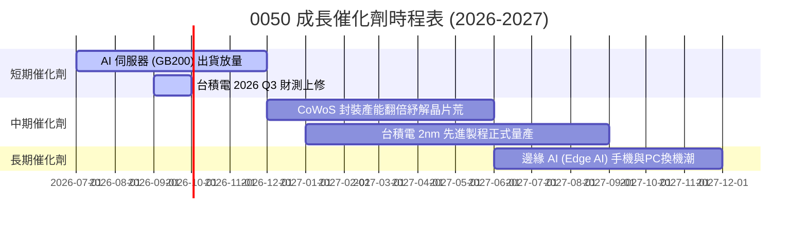

### 8.2 成長驅動結構圖

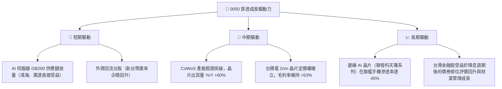

---

## 9. 風險矩陣

### 9.1 風險評分矩陣

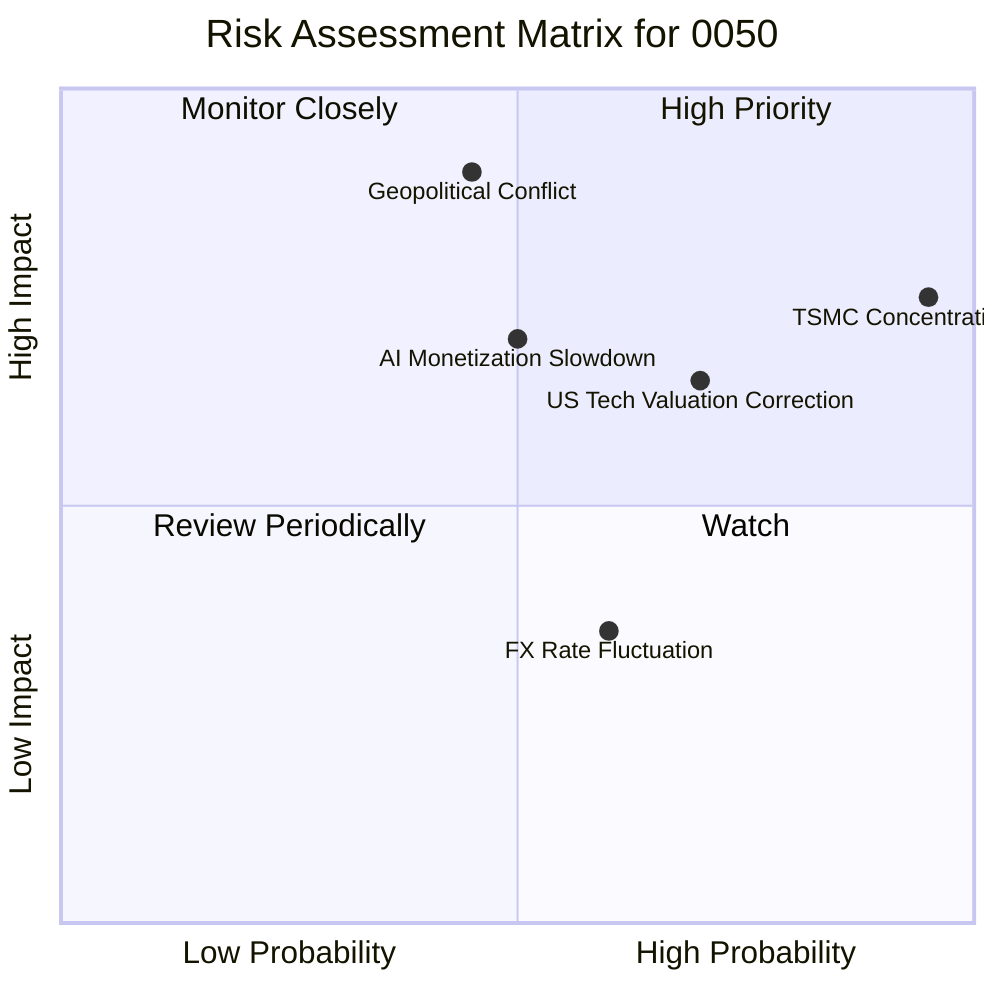

### 9.2 風險清單詳細分析

| # | 風險項目 | 發生機率 | 財務衝擊 | 風險評分 | 緩解措施 / 投資人應對 |
|---|----------|----------|----------|----------|----------------------|
| **1** | 🔴 **台積電單一持股過高** | **95%** (已是事實) | 高 (-15% 淨值) | 🔴 **9.0 / 10** | 投資人可搭配 **0051**（中型100 ETF）或金融、傳產 ETF 進行資產配置分散。 |
| **2** | 🔴 **台海地緣政治衝突** | **35%** | 極高 (-30% 淨值) | 🔴 **8.5 / 10** | 建立國際資產配置，或利用台指選擇權/期空單進行系統性避險。 |
| **3** | 🟡 **美股科技股估值修正** | **65%** | 中 (-10% 淨值) | 🟡 **6.5 / 10** | 0050 與 S&P 500 / Nasdaq 高度相關，可於估值收縮至 15x P/E 以下時分批逢低布局。 |
| **4** | 🟡 **AI 變現放緩導致 Capex 下修** | **50%** | 高 (-12% 淨值) | 🟡 **6.0 / 10** | 密切監控 Microsoft, Alphabet, Meta 等北美四大 CSP 業者的季度資本支出財測。 |

---

## 10. 投資建議

### 10.1 最終綜合評級雷達圖

```
╔══════════════════════════════════════════════════════════════╗
║                    0050 最終投資評級雷達圖                  ║
╠══════════════════════════════════════════════════════════════╣
║ 指數代表性  [9.5] ▓▓▓▓▓▓▓▓▓▓▓▓▓▓▓▓▓▓▓░  ★★★★★           ║
║ 穿透成長性  [8.8] ▓▓▓▓▓▓▓▓▓▓▓▓▓▓▓▓▓░░░  ★★★★☆           ║
║ 財務健康度  [9.0] ▓▓▓▓▓▓▓▓▓▓▓▓▓▓▓▓▓▓░░  ★★★★★           ║
║ 估值合理性  [7.0] ▓▓▓▓▓▓▓▓▓▓▓▓▓▓░░░░░░  ★★★☆☆           ║
║ 資金流動性  [9.8] ▓▓▓▓▓▓▓▓▓▓▓▓▓▓▓▓▓▓▓▓  ★★★★★           ║
╠══════════════════════════════════════════════════════════════╣
║ 綜合推薦度  [8.8] 🟢 買入 (Buy) ｜ 12M 目標價：215.00 TWD     ║
╚══════════════════════════════════════════════════════════════╝
```

### 10.2 買入時機與觸發因素 Checklist

```
╔══════════════════════════════════════════════════════════════════╗
║                  ✅ 0050 買入與交易觸發 Checklist                ║
╠══════════════════════════════════════════════════════════════════╣
║                                                                  ║
║  定期定額/長線買入條件（符合任一即可啟動）：                     ║
║  ✅ 0050 價格跌破季線（60 MA），提供長線微笑曲線切入點。         ║
║  ✅ 台灣景氣對策信號出現「黃藍燈」或「藍燈」（買藍賣紅策略）。   ║
║  ✅ 0050 歷史 Forward P/E 降至 16.0x 以下（極具安全邊際）。      ║
║                                                                  ║
║  加碼觸發條件（可進行單筆大額加碼）：                            ║
║  ☐ 台積電法說會宣布調高全年資本支出（Capex）上限 >10%。         ║
║  ☐ 外資連續 5 個交易日淨買超台股合計 >500 億 TWD。               ║
║                                                                  ║
║  減碼/避險觸發條件（需注意下行風險）：                           ║
║  ☐ 台灣景氣對策信號連續兩季出現「紅燈」（市場過熱警訊）。       ║
║  ☐ 美國 10 年期公債殖利率飆升至 >5.0%，壓抑成長股估值。          ║
╚══════════════════════════════════════════════════════════════════╝
```

### 10.3 投資人適配度分析

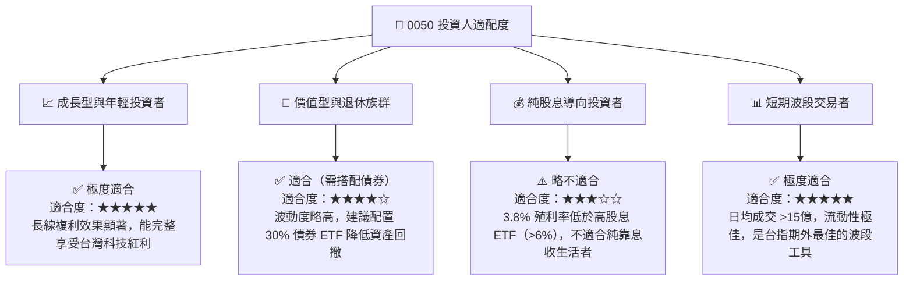

### 10.4 每季財報監控清單（Quarterly Watch List）

為了維持對 0050 投資框架的持續追蹤，投資人應在每季財報與法說會期間重點監控以下指標：

1.  **台積電先進製程（3nm/2nm）產能利用率**：若跌破 85%，視為減碼信號；若維持在 95% 以上，維持買入。
2.  **北美四大 CSP 資本支出年增率**：若 YoY 增速放緩至 <10%，可能壓抑 0050 成分股中下游代工廠（鴻海、廣達）的估值。
3.  **0050 追蹤誤差（Tracking Error）**：若年化追蹤誤差擴大至 >0.30%，需檢視投信經理人操作與交易成本控制。
4.  **外資持股比例**：0050 成分股的「外資加權持股比」若跌破 40%，顯示資金外流，大盤將面臨沉重賣壓。

### 10.5 反面論證：什麼情況會證明本報告的「多頭論點」錯誤？

若發生以下任一「可量化條件」，本報告對 0050 的 🟢 **買入** 評級將失效，投資人應立即進行減碼或轉向防禦型資產：

```
╔══════════════════════════════════════════════════════════════════╗
║              ⚠️ 0050 多頭論點失效條件 (What Breaks the Bull)     ║
╠══════════════════════════════════════════════════════════════════╣
║  本投資論點在下列情況成立時應重新檢視或退出：                    ║
║  ☐ 台積電（2330）單季毛利率跌破 50.0%（定價權喪失指標）。        ║
║  ☐ 0050 穿透加權營收成長率連續兩季低於 5.0%（成長動能失速）。    ║
║  ☐ 穿透加權 ROIC 跌破 12.0%（資本效率退化至接近 WACC）。         ║
║  ☐ 台灣景氣對策信號跌入藍燈且持續超過 6 個月（結構性衰退）。     ║
║  ☐ 台海發生實質軍事衝突或全面性經濟制裁（系統性 Beta 崩潰）。   ║
╚══════════════════════════════════════════════════════════════════╝
```

---

> **免責聲明**：本報告為基於 2026-07-16 市場公開數據與專業估算之學術研究成果，僅供參考，不構成任何形式的投資建議、要約或承諾。投資人應獨立評估風險，並對其投資決策承擔全部責任。