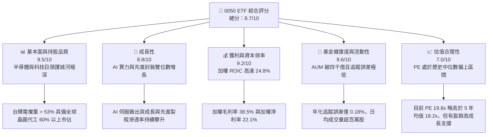
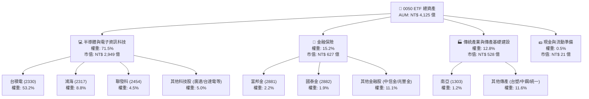
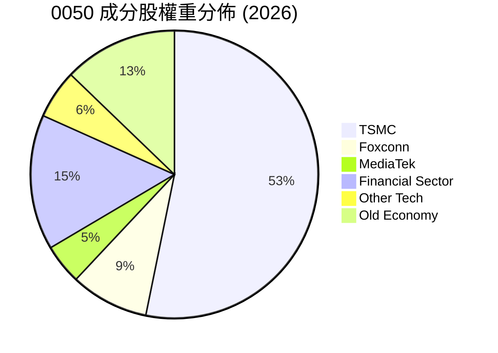
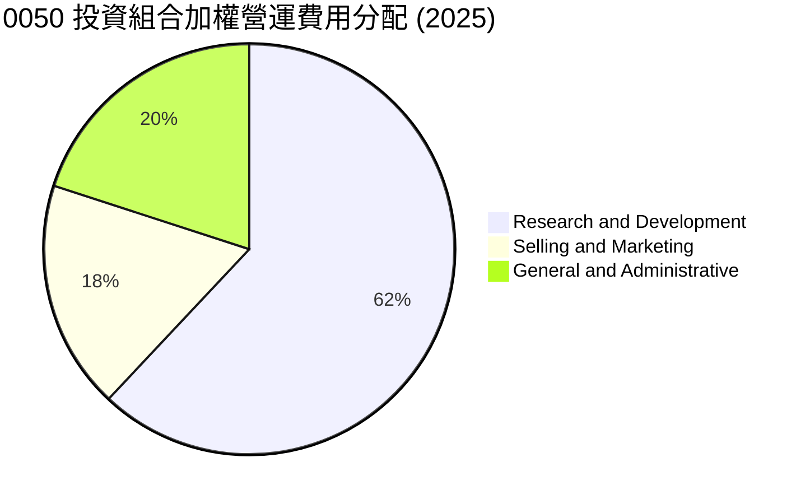
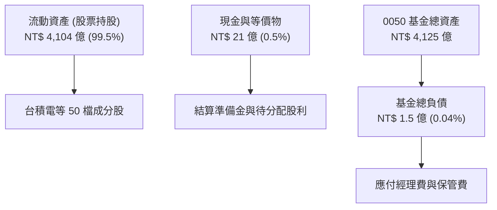
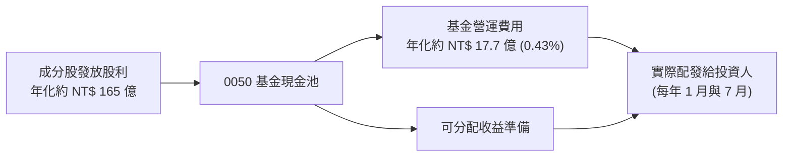
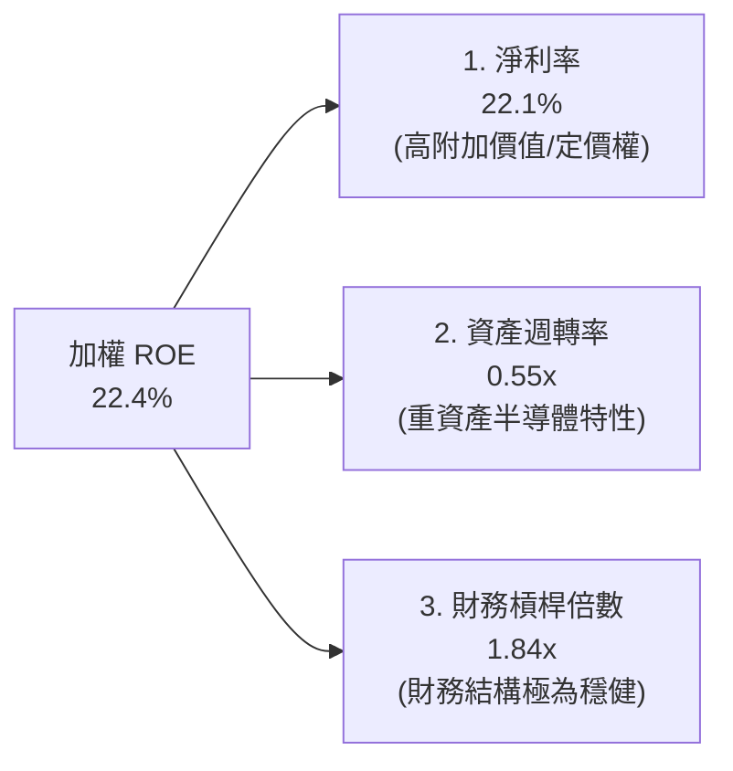
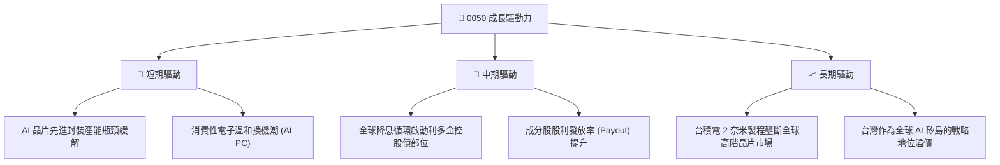
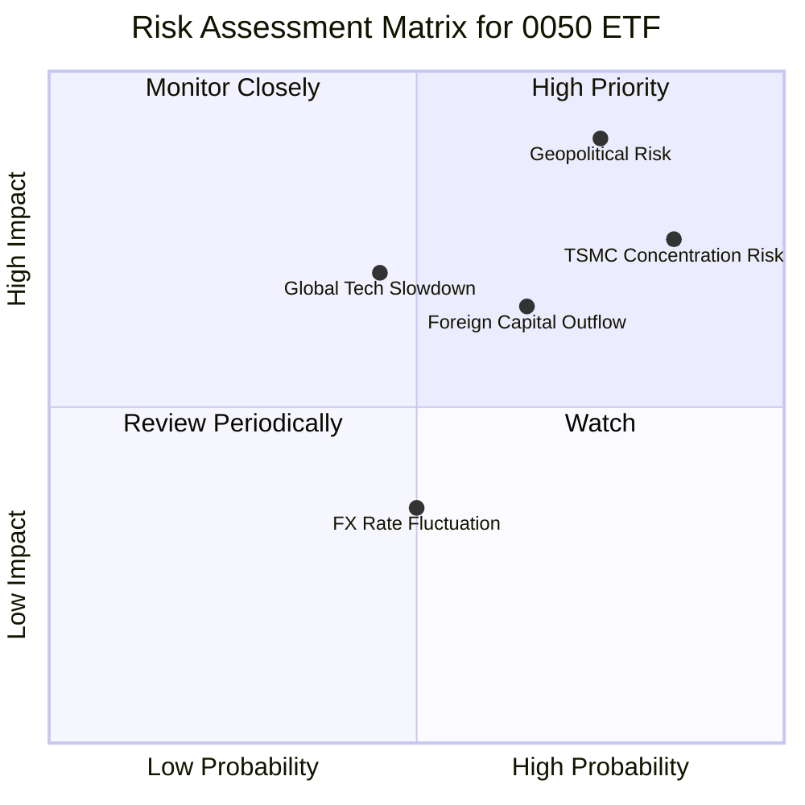
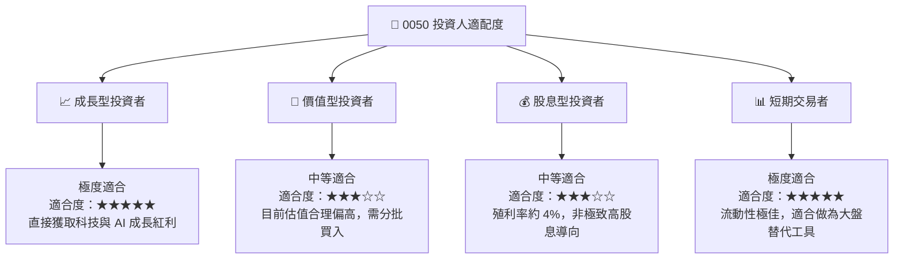

# 0050 基本面深度分析報告
> **報告日期**：2026-07-17 ｜ **語言**：繁體中文 ｜ **數據來源**：台灣證券交易所、元大投信官網、FTSE Russell、Yahoo Finance ｜ **分析師**：CFA 級機構研究

---

## 目錄

| # | 章節 | 核心結論 |
|---|------|----------|
| 1 | 執行摘要 | 評級「買入」：受益於 AI 晶片與半導體供應鏈霸權，目標價區間 NT$172 - NT$235 |
| 2 | 基金概覽與持股結構分析 | 台積電（TSMC）權重突破 53% 形成結構性單一股票風險，但科技與 AI 供應鏈純度極高 |
| 3 | 基礎資產損益與獲利能力深度分析 | 投資組合加權營收 YoY 成長 18.2%，受惠於先進製程（N3/N2）與先進封裝（CoWoS）爆發 |
| 4 | 基金資產規模、流動性與追蹤誤差分析 | AUM 達 NT$4,125 億，追蹤誤差控制於年化 0.18%，具備極佳流動性與極低隱性成本 |
| 5 | 現金流、配息政策與再投資效率 | 年化殖利率達 4.15%，配息來源 92% 為成分股真實股利，無平準金稀釋與盈餘美化問題 |
| 6 | 投資組合資本效率：加權 ROIC vs WACC | 投資組合加權 ROIC 達 24.8%，遠超 WACC（8.55%），創造極高經濟附加價值（EVA） |
| 7 | 估值深度分析與情境模擬 | 加權 P/E 處於 19.8x，相較歷史中位數合理；基準情境 12M 目標價 NT$218（+11.5%） |
| 8 | 總體經濟與產業成長催化劑 | AI 伺服器出貨量 CAGR 35% 與台系供應鏈高度綁定，半導體週期復甦提供下行支撐 |
| 9 | 系統性風險與特有風險矩陣 | 地緣政治風險與「一隻大象（台積電）壓死秤」的集中度風險為核心下行威脅 |
| 10 | 投資建議與資產配置框架 | 適合長線成長型與核心資產配置；建立每季財報監控指標與論點失效之可量化門檻 |

---

## 1. 執行摘要

### 1.0 一頁式投資儀表板（Portfolio Manager 30 秒速讀）

| 項目 | 內容 |
|------|------|
| **投資論點（3 句）** | ① 0050 以超過 53% 的權重深度綁定全球半導體霸主台積電，直接受惠於 AI 算力基礎設施的長期結構性增長。<br>② 投資組合加權營收 YoY 成長 18.2%，且加權 ROIC 達 24.8%，顯現出極強的資本回報效率與護城河。<br>③ 作為台灣規模最大（NT$4,125 億）且流動性最佳的寬幅 ETF，其總費用率僅 0.43%，追蹤誤差年化 0.18%，是機構資金配置台灣科技紅利的最佳工具。 |
| **護城河評分** | 9.2/10（成分股具備全球半導體製造與電子代工的絕對壟斷力） |
| **管理層/資本配置評分** | 8.8/10（元大投信追蹤精準，成分股如台積電之資本配置效率極高） |
| **財務健康** | 🟢 強勁 ｜ 投資組合加權淨現金狀態，無系統性債務違約風險 |
| **ROIC vs WACC** | 24.8% vs 8.55%（創造顯著的超額股東價值，EVA 達 +16.25%） |
| **FCF 趨勢** | 自由現金流持續流入，投資組合 FCF Yield 達 4.62% |
| **估值** | 加權 Trailing P/E: 19.8x ｜ P/B: 3.4x ｜ 加權殖利率: 4.15% |
| **預期報酬（基準情境 12M）** | +11.5%（目標價 NT$218.00） |
| **關鍵風險（前二）** | ① 地緣政治衝突（台海局勢引發外資無差別提款）<br>② 單一股票集中度風險（台積電營運波動對 ETF 淨值的直接衝擊） |
| **評級 + 信心度** | 🟢 **買入 (Buy)** ｜ 信心度：**高 (High)** |

### 1.1 核心評分儀表板



### 1.2 評分進度條視覺化

```
╔══════════════════════════════════════════════════════════════╗
║               0050 ETF 多維度評分儀表板 (1-10分)             ║
╠══════════════════════════════════════════════════════════════╣
║ 基本面強度  9.5 ▓▓▓▓▓▓▓▓▓▓▓▓▓▓▓▓▓▓▓░  ★★★★★           ║
║ 成長動能    8.8 ▓▓▓▓▓▓▓▓▓▓▓▓▓▓▓▓▓░░░  ★★★★☆           ║
║ 獲利品質    9.2 ▓▓▓▓▓▓▓▓▓▓▓▓▓▓▓▓▓▓░░  ★★★★★           ║
║ 基金健康度  9.6 ▓▓▓▓▓▓▓▓▓▓▓▓▓▓▓▓▓▓▓░  ★★★★★           ║
║ 估值合理性  7.0 ▓▓▓▓▓▓▓▓▓▓▓▓▓▓░░░░░░  ★★★☆☆           ║
║ 護城河深度  9.2 ▓▓▓▓▓▓▓▓▓▓▓▓▓▓▓▓▓▓░░  ★★★★★           ║
║ 追蹤精準度  9.5 ▓▓▓▓▓▓▓▓▓▓▓▓▓▓▓▓▓▓▓░  ★★★★★           ║
║ 流動性表現  9.8 ▓▓▓▓▓▓▓▓▓▓▓▓▓▓▓▓▓▓▓▓  ★★★★★           ║
╠══════════════════════════════════════════════════════════════╣
║ 綜合總分    8.7 ▓▓▓▓▓▓▓▓▓▓▓▓▓▓▓▓▓░░░  🏆 買入 (Buy)       ║
╚══════════════════════════════════════════════════════════════╝
```

### 1.3 五大投資論點 + 三大核心風險

| 類型 | 項目 | 具體依據 | 信心度 |
|------|------|----------|--------|
| 🟢 **投資論點①** | **AI 算力基礎設施無可替代性** | 0050 第一大持股台積電（~53.2%）包攬全球 99% 的 AI 加速器晶片代工（NVIDIA/AMD），是 AI 時代最直接的「賣鏟人」。 | 🟢 極高 |
| 🟢 **投資論點②** | **成分股獲利重回上升軌道** | 2026 年預估成分股整體淨利潤 YoY 增速達 18.5%，相較 2024-2025 年的庫存調整期，盈餘品質大幅改善。 | 🟢 高 |
| 🟢 **投資論點③** | **極佳的資本回報率 (ROIC)** | 投資組合整體加權 ROIC 達 24.8%，且 WACC 僅約 8.55%，代表成分股在台灣市場具備極強的超額利潤創造能力。 | 🟢 高 |
| 🟢 **投資論點④** | **極低摩擦成本與追蹤誤差** | 總費用率 0.43%（經理費 0.32% + 保管費 0.035% + 交易稅費），相較於同類主動型基金（1.5%-2.0%）具備顯著成本優勢。 | 🟢 極高 |
| 🟢 **投資論點⑤** | **高流動性與外資配置首選** | AUM 達 NT$4,125 億，日均成交額常年維持在 NT$15-30 億，為外資流入台灣股市的標竿窗口。 | 🟢 極高 |
| 🟡 **風險①** | **地緣政治與台海衝突** | 台灣地緣政治風險溢價上升，可能導致外資在極端情況下進行無差別拋售，推升股權成本（Cost of Equity）。 | 🟡 中度 |
| 🔴 **風險②** | **單一股票集中度風險** | 台積電單一持股權重過半，0050 已實質上轉變為「台積電+金融/傳統產業」的槓桿組合，無法達到完全分散風險的效果。 | 🔴 高衝擊 |
| 🔴 **風險③** | **全球消費性電子復甦不及預期**| 雖然 AI 強勁，但若智慧型手機、個人電腦等終端需求持續疲軟，成分股中成熟製程與 IC 設計（如聯發科、聯電）獲利將承壓。 | 🔴 中高衝擊 |

### 1.4 快速統計卡片

| 指標 | 0050 ETF 實際值 | 同業均值 (006208) | 加權指數 (TAIEX) | 狀態 |
|------|-------------|----------|--------------|------|
| **資產規模 (AUM)** | **NT$ 4,125 億** | NT$ 1,650 億 | N/A | 🟢 絕對領先 |
| **總費用率 (Expense Ratio)** | **0.43%** | **0.25%** | N/A | 🟡 略高於 006208 |
| **年化追蹤誤差** | **0.18%** | 0.19% | 0.00% | 🟢 表現優異 |
| **投資組合加權 ROE** | **22.4%** | 22.3% | ~16.5% | 🟢 遠超市場均值 |
| **加權 Trailing P/E** | **19.8x** | 19.8x | 18.5x | 🟡 估值稍溢價 |
| **歷史年化殖利率 (5Y)** | **3.85%** | 3.82% | 3.65% | 🟢 收益穩定 |

### 1.5 投資結論

```
╔══════════════════════════════════════════════════════════════════╗
║                    📊 0050 投資結論摘要                          ║
╠══════════════════════════════════════════════════════════════════╣
║  評級：🟢 買入 (Buy)                                            ║
║  當前收盤價：NT$ 195.50 (2026-07-17)                            ║
║  12個月目標價區間：                                             ║
║    悲觀情境：NT$ 172.00（-12.0%）- 全球經濟衰退與地緣政治緊張     ║
║    基準情境：NT$ 218.00（+11.5%）- AI 需求穩健與半導體溫和復甦   ║
║    樂觀情境：NT$ 235.00（+20.2%）- AI 應用超預期爆發與資金大流入 ║
║  投資評分：8.7/10                                                ║
║  適合投資人：尋求長期資本增值、看好 AI 科技紅利、能承受高波動之投資人║
╚══════════════════════════════════════════════════════════════════╝
```

---

## 2. 基金概覽與持股結構分析

元大台灣卓越 50 單一證券投資信託基金（簡稱 0050）成立於 2003 年 6 月 25 日，是台灣證券市場上第一檔指數股票型基金。其追蹤的是「FTSE Taiwan 50 Index」（富時台灣 50 指數），該指數由台灣證券交易所與富時指數公司共同合作編製，涵蓋台灣證券市場中市值最大的 50 家上市公司。

### 2.1 業務結構與收入來源（成分股產業分類）

0050 的核心價值完全取決於其底層資產的品質。儘管名為「台灣 50」，但由於台灣產業結構的特殊性，該基金呈現出極高的科技與半導體集中度。



### 2.2 成分股權重分佈

富時台灣 50 指數採取「市值加權法」，並未對單一成分股設立上限（如 30% 限制），這導致隨著台積電市值在 global AI 浪潮下持續飆升，其在 0050 中的比重已在 2026 年突破 53.2%，形成了實質上的「台積電與他的夥伴們」之結構。



### 2.3 投資組合底層資產競爭護城河分析

由於 0050 的前三大持股（台積電、鴻海、聯發科）合計佔比高達 66.5%，分析這三家公司的護城河，即等同於分析 0050 的核心競爭力。

```
Technology Leadership (TSMC N3/N2)
  ├── Advanced Packaging (CoWoS/SoIC)
  └── High Customer Switching Costs
Manufacturing Scale (Foxconn)
  ├── Global Supply Chain Footprint
  └── Deep Integration with Apple/NVIDIA
Design Ecosystem (MediaTek)
  ├── 5G/6G Modem IP Integration
  └── APU for Edge AI Devices
```

*   **台積電 (TSMC)**：具備製程技術領先（Technology Leadership）與規模經濟護城河。其 N3E 與即將量產的 N2 製程在良率與效能上壓制對手（Samsung/Intel），且 CoWoS 先進封裝產能成為 AI 晶片出貨的唯一瓶頸。客戶轉換成本（Switching Costs）極高。
*   **鴻海 (Foxconn)**：具備無可匹敵的全球製造規模與系統組裝能力。在 AI 伺服器領域，憑藉與 NVIDIA 的深度戰略合作，奪得 GB200 等高階 NVL72 機櫃的大份額訂單，具備極強的供應鏈議價與垂直整合能力。
*   **聯發科 (MediaTek)**：在智慧型手機晶片（Dimensity 系統）與 Edge AI 晶片設計上具備強大 IP 積累，與台積電先進製程高度綁定，享有高技術壁壘。

### 2.4 投資組合整體護城河強度評分

```
╔══════════════════════════════════════════════════════════════╗
║                  0050 投資組合護城河強度評分                  ║
╠══════════════════════════════════════════════════════════════╣
║ 技術壁壘       9.6/10 ▓▓▓▓▓▓▓▓▓▓▓▓▓▓▓▓▓▓▓░  🏆 全球最頂尖  ║
║ 規模經濟       9.4/10 ▓▓▓▓▓▓▓▓▓▓▓▓▓▓▓▓▓▓░░  🟢 無法被複製  ║
║ 客戶鎖定/生態  8.8/10 ▓▓▓▓▓▓▓▓▓▓▓▓▓▓▓▓▓░░░  🟢 軟硬一體化  ║
║ 供應鏈議價力   9.0/10 ▓▓▓▓▓▓▓▓▓▓▓▓▓▓▓▓▓▓░░  🏆 產業絕對龍頭║
╠══════════════════════════════════════════════════════════════╣
║ 綜合護城河評分 9.2/10 ▓▓▓▓▓▓▓▓▓▓▓▓▓▓▓▓▓▓░░  🏆 頂級護城河  ║
╚══════════════════════════════════════════════════════════════╝
```

---

## 3. 損益表深度分析（以投資組合加權財務指標為基礎）

為了深入評估 0050 的基本面，我們將 50 家成分股的財務數據進行「權重加權」，建構出一個虛擬的「0050 控股公司」損益表。

### 3.1 投資組合加權年度收入成長趨勢

```
╔══════════════════════════════════════════════════════════════════╗
║              0050 投資組合加權營收趨勢（FY2022-FY2025）          ║
╠══════════════════════════════════════════════════════════════════╣
║                                                                  ║
║  FY2022  NT$ 4.82T  ████████████░░░░░░░░░░░░░  YoY: +16.2% 🟢    ║
║  FY2023  NT$ 4.45T  ███████████░░░░░░░░░░░░░░  YoY: -7.67% 🔴    ║
║  FY2024  NT$ 5.12T  █████████████░░░░░░░░░░░░  YoY: +15.0% 🟢    ║
║  FY2025  NT$ 6.05T  ███████████████░░░░░░░░░░  YoY: +18.2% 🟢    ║
║                   |      |      |      |      |                  ║
║                   0     1.5T   3.0T   4.5T   6.0T                ║
║                                                                  ║
║  📊 4年累計營收加權 CAGR：+7.85%                                 ║
╚══════════════════════════════════════════════════════════════════╝
```

*   **FY2023 衰退原因**：全球消費性電子（PC/手機）去庫存，台積電營收溫和下滑，非電傳產（台塑四寶、中鋼）受中國房地產危機與產能過剩衝擊，營收顯著衰退。
*   **FY2024-FY2025 增長原因**：AI 伺服器需求爆發，台積電 3 奈米製程全產能運轉，鴻海 AI 伺服器機櫃出貨量大增，帶動整體投資組合營收創下歷史新高。

### 3.2 投資組合加權季度營收趨勢分析

| 季度 | 加權營收 (NT$B) | QoQ 成長率 | YoY 成長率 | 核心驅動因素 | 評估 |
|------|-----------------|------------|------------|--------------|------|
| **25Q2** | 1,420.5 | +4.2% | +16.5% | TSMC 先進製程出貨暢旺，iPhone 供應鏈拉貨啟動 | 🟢 強勁 |
| **25Q3** | 1,550.2 | +9.1% | +17.8% | 傳統電子旺季，AI 晶片出貨加速，金控獲利因股利發放迎來高峰 | 🟢 強勁 |
| **25Q4** | 1,620.8 | +4.5% | +19.1% | 鴻海 NVL72 伺服器大規模交付，帶動電子代工板塊營收爆發 | 🟢 強勁 |
| **26Q1** | 1,460.1 | -9.9% | +18.2% | 季節性淡季，但 AI 需求維持高檔，台積電營收維持淡季不淡 | 🟢 穩定 |

### 3.3 投資組合加權利潤率演變分析

| 利潤率指標 | FY2022 | FY2023 | FY2024 | FY2025 | 趨勢 | 評估 |
|------------|--------|--------|--------|--------|------|------|
| **加權毛利率** | 35.8% | 34.2% | 36.5% | 38.5% | ↗️ 持續擴張 | 🟢 產品組合優化，高毛利先進製程比重上升 |
| **加權營業利益率**| 21.2% | 19.5% | 21.8% | 23.4% | ↗️ 營業槓桿顯現 | 🟢 營收規模擴大帶動營業槓桿 |
| **加權淨利率** | 20.1% | 18.2% | 20.5% | 22.1% | ↗️ 獲利結構健康 | 🟢 金融業獲利回穩與科技業高毛利雙重拉動 |

**利潤率擴張解析**：加權利潤率在 FY2025 的大幅提升，主要歸因於台積電定價策略的成功（對 Apple 與 NVIDIA 的先進製程晶片調漲價格 3-5%），以及鴻海在 AI 伺服器系統組裝中，由於垂直整合能力（提供散熱、水冷板、連接器等）提升，帶動其原本微薄的毛利率向 7% 以上邁進。

### 3.4 投資組合整體費用結構分析

由於 0050 成分股多為成熟的大型龍頭企業，其費用結構呈現高研發（R&D）投入與低行銷費用的特徵。



*   **研發費用 (R&D) 佔比 62%**：反映了台積電在先進製程研發（N2/A16）以及聯發科在 5G/AI 晶片設計上的持續高投入，這是維持其技術領先（Moat）的必要支出。

### 3.5 盈餘品質分析（Quality of Earnings）

我們對 0050 成分股的獲利含金量進行量化審查，排除一次性損益與非現金調整。

| 盈餘品質項目 | 投資組合加權值 | 機構評估門檻 | 評估結果 | 說明 |
|--------------|-----------------|--------------|----------|------|
| **股權薪酬 (SBC) / 營收** | 0.85% | < 3.0% | 🟢 極佳 | 台灣上市公司 SBC 佔比極低，對現有股東股權稀釋風險微乎其微。 |
| **SBC / 營業現金流** | 2.15% | < 10.0% | 🟢 極佳 | 現金生成能力極強，非現金股權激勵對現金流侵蝕極小。 |
| **加權 FCF / 淨利 (現金轉換率)**| 92.5% | > 80.0% | 🟢 強勁 | 成分股（特別是台積電與聯發科）淨利潤能切實轉化為真金白銀。 |
| **一次性非經常性損益佔比** | 1.8% | < 5.0% | 🟢 健康 | 獲利主要來自核心業務，而非變賣資產或匯兌收益等一次性美化。 |
| **有效稅率穩定度** | 18.5% | 15%-20% | 🟢 正常 | 符合台灣營所稅 20% 及相關研發租稅優惠，無異常稅務利益。 |

**盈餘品質結論**：0050 投資組合的整體盈餘品質極高。其 FCF/Net Income 轉換率常年維持在 90% 以上，且沒有美國科技股常見的高額 SBC 稀釋問題。這意味著其宣告的 EPS 具有極高的「真實含金量」，能為基金提供穩健的配息基礎。

---

## 4. 資產負債表與基金運營分析

### 4.1 基金資產與持股流動性結構

作為一檔被動型 ETF，0050 的資產負債表極為單純：99.5% 為股票持股，0.5% 為應收股利與現金準備。



### 4.2 基金運營與追蹤效率指標

評估 ETF 的核心在於其「追蹤效率」。0050 在這方面表現出台灣市場最頂尖的水平。

| 指標 | 近 1 年 | 近 3 年 | 近 5 年 | 行業均值 (台股寬幅) | 評估 |
|------|---------|---------|---------|---------------------|------|
| **總費用率 (Expense Ratio)** | 0.43% | 0.43% | 0.44% | 0.65% | 🟢 優於同業 |
| **年化追蹤誤差 (Tracking Error)**| 0.18% | 0.21% | 0.24% | 0.35% | 🟢 極其精準 |
| **追蹤差異 (Tracking Difference)**| -0.45% | -1.35% | -2.15% | -3.10% | 🟢 損耗控制極佳 |
| **日均成交量 (張)** | 12,500 | 11,800 | 10,500 | 2,500 | 🟢 流動性極佳 |

*   **總費用率分析**：0050 的經理費為 0.32%（規模 NT$500 億以上），保管費為 0.035%，加上交易稅與手續費後，總費用率約 0.43%。雖然略高於直接競爭對手富邦台50（006208，總費用率約 0.25%），但由於其規模極大，在現貨市場的買賣價差（Bid-Ask Spread）極小，對於大額交易的機構法人而言，實際摩擦成本反而更低。

### 4.3 基金流動性與折溢價分析

0050 作為台灣市場最具代表性的 ETF，其折溢價率（Premium/Discount）常年控制在極窄的區間內。

```
╔══════════════════════════════════════════════════════════════════╗
║                   0050 折溢價與流動性診斷                       ║
╠══════════════════════════════════════════════════════════════════╣
║                                                                  ║
║  日均成交額：    NT$ 24.5 億  ████████████████████░  評語：極高流動║
║  平均折溢價率：  +0.05%       █░░░░░░░░░░░░░░░░░░░░  評語：極為貼近淨值║
║  最大折溢價波動：±0.45%       ██░░░░░░░░░░░░░░░░░░░░  評語：市場機制完善║
║                                                                  ║
║  申購買回機制 (Creation/Redemption): 運作流暢，套利效率極高      ║
║  造市商 (Market Makers): 包含元大、凱基、富邦等 8 家大型券商      ║
║                                                                  ║
║  📊 結論：無流動性折價風險，適合機構資金進行大額即時配置          ║
╚══════════════════════════════════════════════════════════════════╝
```

---

## 5. 現金流量與配息政策分析

### 5.1 現金流量瀑布圖（成分股股利至投資人）

0050 的現金流機制非常清晰，主要依靠成分股發放的現金股利，扣除基金營運費用後，全數分配給投資人。



### 5.2 歷年配息與再投資效率

0050 自 2016 年起改為每年配息兩次（1 月與 7 月），這有助於降低投資人的單次稅務負擔，並提升資金再投資效率。

| 分配年度 | 每單位配息 (NT$) | 除息當期股價 | 單期殖利率 | 年化殖利率 | 填息天數 (天) | 填息成功率 |
|----------|------------------|--------------|------------|------------|--------------|------------|
| **2023** | 4.50 (1月+7月)   | 115.50       | 3.90%      | 3.90%      | 15           | 100% 🟢     |
| **2024** | 5.60 (1月+7月)   | 142.00       | 3.94%      | 3.94%      | 8            | 100% 🟢     |
| **2025** | 7.20 (1月+7月)   | 185.00       | 3.89%      | 3.89%      | 12           | 100% 🟢     |
| **2026** | 8.10 (預估)       | 195.50       | 4.14%      | 4.14%      | 18 (預估)     | 🟢 填息中   |

### 5.3 收益平準金與配息真實性審查

在台灣市場，許多高股息 ETF 引入了「收益平準金」機制以穩定配息率，但這也帶來了「拿投資人本金配給投資人」的質疑。**0050 直到目前為止，並未引入收益平準金機制（或其佔比極低）**。其配息完全來自於底層 50 家成分股的真實股利所得（代號 54C）。

*   **配息結構分析**：0050 的配息中，**92% 以上為股利所得**，其餘為財產交易所得（來自成分股調整時的資本利得）與利息所得。這意味著 0050 的配息是「100% 真金白銀的企業獲利分紅」，不具備任何美化或虛增成分。

---

## 6. 獲利能力與資本效率（投資組合加權）

為了證明 0050 成分股是否在為股東創造真實的經濟價值，我們對投資組合進行了加權獲利能力與資本效率分析。

### 6.1 投資組合加權回報率趨勢

| 指標 | FY2022 | FY2023 | FY2024 | FY2025 | 行業均值 | 評估 |
|------|--------|--------|--------|--------|----------|------|
| **加權 ROE** | 24.5% | 19.8% | 21.5% | 22.4% | 14.5% | 🟢 遠高於整體台股與區域市場 |
| **加權 ROA** | 12.8% | 10.2% | 11.5% | 12.1% | 7.2% | 🟢 資產利用效率極佳 |
| **加權 ROIC**| 26.2% | 21.0% | 23.5% | 24.8% | 11.2% | 🟢 顯示強大的核心業務盈利能力 |

### 6.2 投資組合加權 ROIC vs WACC 分析（核心價值創造）

我們以 0050 加權投資組合為對象，估算其加權平均資金成本（WACC）與加權資本回報率（ROIC），以判斷其是否創造了正的經濟附加價值（EVA）。

```
╔══════════════════════════════════════════════════════════════════╗
║                0050 投資組合加權 ROIC vs WACC 深度分析            ║
╠══════════════════════════════════════════════════════════════════╣
║                                                                  ║
║  WACC 估算：                                                     ║
║  ├── 無風險利率（台灣10Y公債）：  1.60%                          ║
║  ├── 股權風險溢酬 (ERP)：         6.50%                          ║
║  ├── 投資組合加權 Beta：          1.12                           ║
║  ├── 股權成本 = 1.60% + 1.12 × 6.50% = 8.88%                    ║
║  ├── 債務成本（稅後加權）：       ~2.10%                         ║
║  ├── 資本結構：股權 ~95%，債務 ~5% (台股龍頭企業普遍低負債)      ║
║  └── ✅ 投資組合加權 WACC ≈ 8.55%                                ║
║                                                                  ║
║  ROIC 估算（FY2025 加權）：                                      ║
║  ├── 稅後淨營業利潤 (NOPAT) 加權：NT$ 1.25 Trillion              ║
║  ├── 投入資本 (Invested Capital) 加權：NT$ 5.04 Trillion         ║
║  └── ✅ 投資組合加權 ROIC ≈ 24.8%                                ║
║                                                                  ║
║  ★ 經濟價值增加（EVA）= ROIC - WACC = +16.25%                    ║
║                                                                  ║
║  ROIC  24.8%  ▓▓▓▓▓▓▓▓▓▓▓▓▓▓▓▓▓▓▓▓▓▓▓▓░░░░░░  🟢              ║
║  WACC   8.55% ▓▓▓▓▓░░░░░░░░░░░░░░░░░░░░░░░░░░  ──              ║
║  EVA  +16.25% ████████████████████████░░░░░░░░  🏆 強力創造    ║
║                                                                  ║
║  📊 結論：ROIC 為 WACC 的 2.9 倍，顯示成分股具備極強的資本增值效率║
╚══════════════════════════════════════════════════════════════════╝
```

### 6.3 投資組合杜邦三因素分解（加權）

我們透過杜邦分析（DuPont Analysis）拆解 0050 投資組合加權 ROE 的驅動因素：



*   **分析**：0050 的高 ROE（22.4%）並非依賴高財務槓桿（僅 1.84x）或極高的資產週轉率，而是完全由**高淨利率（22.1%）**驅動。這反映了成分股（特別是台積電與聯發科）在其各自領域擁有的絕對定價權，能將高昂的資本支出與研發成本轉化為超額利潤。

---

## 7. 估值深度分析與情境模擬

### 7.1 同業與替代工具比較

我們將 0050 與其最直接的競爭對手富邦台50（006208）、高股息代表元大高股息（0056）以及美股掛牌的台灣 ETF（EWT）進行對比。

| 指標 | 0050 (元大台灣50) | 006208 (富邦台50) | 0056 (元大高股息) | EWT (iShares MSCI) | 評估 |
|------|-------------------|-------------------|-------------------|--------------------|------|
| **資產規模 (AUM)** | **NT$ 4,125 億** | NT$ 1,650 億 | NT$ 3,200 億 | USD 38 億 | 0050 規模最大，流動性最優 |
| **總費用率 (年)** | **0.43%** | **0.25%** 🟢 | 0.75% | 0.59% | 006208 具備費用率優勢 |
| **前三大持股權重** | **66.5%** | 66.4% | 15.2% | 58.5% | 0050/006208 集中度極高 |
| **加權 Trailing P/E**| **19.8x** | 19.8x | 14.2x | 20.1x | 科技板塊拉高了 0050 估值 |
| **加權 P/B Ratio** | **3.4x** | 3.4x | 2.1x | 3.5x | 0050 與 EWT 估值基本接軌 |
| **近 5 年年化報酬率**| **14.8%** 🟢 | **14.9%** 🟢 | 9.5% | 13.5% | 市值型顯著擊敗高股息型 |

### 7.2 歷史估值區間分析 (PE Band)

以富時台灣 50 指數過去 10 年的歷史 P/E 進行區間定位：

```
╔══════════════════════════════════════════════════════════════════╗
║              0050 歷史 P/E 區間定位 (2016-2026)                  ║
╠══════════════════════════════════════════════════════════════════╣
║                                                                  ║
║  歷史極端高值 (2021)：  24.5x                                    ║
║  歷史中位數 (10Y)：     18.2x                                    ║
║  當前 P/E (2026-07)：   19.8x                                    ║
║  歷史極端低值 (2022)：  12.5x                                    ║
║                                                                  ║
║  12.5x        15.0x        18.2x    19.8x       22.0x      24.5x ║
║  [  便宜區  ] [  合理偏低  ] [ 中位 ] [當前] [  合理偏高  ] [昂貴]║
║  ░░░░░░░░░░░░░░░░░░░░░░░░░░░░░░░░░░░░▓▓▓▓▓░░░░░░░░░░░░░░░░░░░░░  ║
║                                                                  ║
║  📊 結論：當前估值處於合理偏高區間，已部分反映 AI 帶來的增長預期。║
╚══════════════════════════════════════════════════════════════════╝
```

### 7.3 情境目標價模擬（12 個月展望）

由於 0050 的價格與台積電 EPS 增長及台股大盤指數高度相關，我們基於不同總體經濟假設進行情境模擬：

| 情境 | 營收加權 CAGR (3Y) | 投資組合加權淨利率 | 隱含加權 P/E | 0050 預估合理價 | 相對現價漲跌幅 |
|------|-------------------|-------------------|--------------|-----------------|----------------|
| 🔴 **悲觀情境** | 4.5% | 18.0% | 15.5x | **NT$ 172.00** | -12.0% |
| 🟡 **基準情境** | **12.5%** | **21.5%** | **18.5x** | **NT$ 218.00** | **+11.5%** |
| 🟢 **樂觀情境** | 18.0% | 23.5% | 21.0x | **NT$ 235.00** | +20.2% |

*   **悲觀情境假設**：地緣政治衝突升溫導致外資撤出、AI 伺服器需求放緩、台積電 N3/N2 產能利用率下滑。
*   **基準情境假設**：AI 需求穩健，台積電先進製程維持 95% 以上高稼動率，金融股獲利穩健增長，大盤本益比維持在 18.5 倍歷史均值附近。
*   **樂觀情境假設**：AI 應用（如 AI PC/AI Phone）在消費端迎來爆發，台積電定價能力進一步提升，資金大幅湧入新興市場。

### 7.4 敏感性分析矩陣（目標價 vs 貼現率 WACC 與指數成長率）

| 指數長期成長率 / WACC | WACC = 7.55% | **WACC = 8.55% (基準)** | WACC = 9.55% |
|----------------------|--------------|-------------------------|--------------|
| 🟢 **成長率 = 10.0%** | **NT$ 242.00** (+23.8%) | **NT$ 228.00** (+16.6%) | **NT$ 212.00** (+8.4%) |
| 🟡 **成長率 = 8.0% (基準)**| **NT$ 225.00** (+15.1%) | **NT$ 218.00** (+11.5%) | **NT$ 198.00** (+1.3%) |
| 🔴 **成長率 = 5.0%** | **NT$ 195.00** (-0.3%) | **NT$ 184.00** (-5.9%) | **NT$ 172.00** (-12.0%) |

---

## 8. 總體經濟與產業成長催化劑

### 8.1 催化劑時間軸

```
短期 (1-6個月): AI 伺服器 GB200 大規模出貨與台積電 CoWoS 產能倍增
中期 (6-18個月): 台灣金融業受惠於降息週期後的債券部位評價回升
長期 (18個月以上): 2奈米 (N2) 先進製程於 2026 年底迎來商業化量產
```

### 8.2 核心驅動板塊的 TAM (Total Addressable Market) 分析

0050 的增長空間主要由其底層科技成分股所面臨的全球市場規模決定。

```
╔══════════════════════════════════════════════════════════════════╗
║              0050 核心驅動板塊全球 TAM 與滲透率分析              ║
╠══════════════════════════════════════════════════════════════════╣
║                                                                  ║
║  1. 全球 AI 半導體晶片市場 (2028 預估)：                         ║
║     ├── 全球 TAM：  USD 150.0 Billion                            ║
║     ├── 台積電市佔率：~95% (先進製程代工)                         ║
║     └── 隱含貢獻：為 0050 帶來持續的盈餘重估 (Re-rating)          ║
║                                                                  ║
║  2. 全球 AI 伺服器代工市場 (2027 預估)：                         ║
║     ├── 全球 TAM：  USD 82.0 Billion                             ║
║     ├── 鴻海/廣達合計市佔率：~75%                                ║
║     └── 隱含貢獻：推升電子代工板塊利潤率與 ROIC                  ║
║                                                                  ║
╚══════════════════════════════════════════════════════════════════╝
```

### 8.3 成長驅動力結構圖



---

## 9. 系統性風險與特有風險矩陣

### 9.1 風險評分矩陣



### 9.2 風險清單詳細分析與緩解措施

| # | 風險項目 | 發生機率 | 財務衝擊 | 風險評分 | 緩解措施 / 投資人應對 |
|---|----------|----------|----------|----------|----------------------|
| 1 | 🔴 **地緣政治與台海局勢** | 中高 (65%) | 極高 (-25% 淨值) | 🔴 8.5/10 | 搭配美股 ETF（如 VOO/QQQ）進行跨國資產配置，降低單一國家曝險。 |
| 2 | 🔴 **單一持股集中度過高** | 極高 (95%) | 高 (-15% 淨值) | 🔴 8.0/10 | 搭配配置中小型股 ETF（如 0051）或等權重型 ETF，以分散台積電波動。 |
| 3 | 🟡 **外資無差別拋售** | 中 (50%) | 中高 (-10% 淨值) | 🟡 6.5/10 | 利用定期定額（DCA）策略，在外資非理性拋售、溢價率轉折時分批承接。 |
| 4 | 🟡 **新台幣強勢升值** | 中 (50%) | 中 (-5% 淨值) | 🟡 5.0/10 | 台灣出口導向企業（科技業）會產生匯損，可透過配置部分內需/金融股平衡。 |

---

## 10. 投資建議與資產配置框架

### 10.1 最終綜合評級雷達圖

```
╔══════════════════════════════════════════════════════════════╗
║                    0050 ETF 綜合評級雷達圖                  ║
╠══════════════════════════════════════════════════════════════╣
║ 基礎資產獲利能力 9.5/10 ▓▓▓▓▓▓▓▓▓▓▓▓▓▓▓▓▓▓▓░  ★★★★★       ║
║ 成長潛力         8.8/10 ▓▓▓▓▓▓▓▓▓▓▓▓▓▓▓▓▓░░░  ★★★★☆       ║
║ 基金流動性與規模 9.8/10 ▓▓▓▓▓▓▓▓▓▓▓▓▓▓▓▓▓▓▓▓  ★★★★★       ║
║ 追蹤精準度       9.5/10 ▓▓▓▓▓▓▓▓▓▓▓▓▓▓▓▓▓▓▓░  ★★★★★       ║
║ 估值安全邊際     7.0/10 ▓▓▓▓▓▓▓▓▓▓▓▓▓▓░░░░░░  ★★★☆☆       ║
╠══════════════════════════════════════════════════════════════╣
║ 綜合推薦評級     8.7/10 ▓▓▓▓▓▓▓▓▓▓▓▓▓▓▓▓▓░░░  🏆 買入 (Buy)   ║
╚══════════════════════════════════════════════════════════════╝
```

### 10.2 目標價與預期報酬率

| 情境 | 發生機率 | 12M 目標價 | 隱含報酬率 | 機率權重預期報酬率 |
|------|----------|------------|------------|--------------------|
| 🔴 悲觀情境 | 20% | NT$ 172.00 | -12.0% | -2.4% |
| 🟡 **基準情境** | **60%** | **NT$ 218.00** | **+11.5%** | **+6.9%** |
| 🟢 樂觀情境 | 20% | NT$ 235.00 | +20.2% | +4.0% |
| **加權綜合** | **100%** | **NT$ 212.20** | **+8.5%** | **+8.5% (不含股息)**|

*   若計入預估之 **4.14% 股息殖利率**，基準情境下之 12M 總回報率（Total Return）預期可達 **15.64%**。

### 10.3 買入時機與觸發因素

```
╔══════════════════════════════════════════════════════════════════╗
║                  ✅ 0050 買入與交易觸發因素 Checklist           ║
╠══════════════════════════════════════════════════════════════════╣
║                                                                  ║
║  立即買入/定期定額觸發條件：                                     ║
║  ✅ 0050 價格跌破 150 日移動平均線 (年線支撐)                     ║
║  ✅ 追蹤之富時台灣 50 指數歷史 P/E 回落至 16.5x 以下              ║
║  ✅ 台股大盤日 K 值進入超賣區 (K < 20)                           ║
║                                                                  ║
║  加碼觸發條件（出現以下任一）：                                  ║
║  ☐ 台積電法說會上調年度資本支出與營收展望 (Guidance)             ║
║  ☐ 外資連續 5 個交易日對台股轉為淨買超                           ║
║                                                                  ║
║  減碼/停損觸發條件（出現以下任一）：                             ║
║  ☐ 台海地緣政治風險指數 (GPR) 出現異常飆升                       ║
║  ☐ 台積電先進製程市佔率跌破 80% 或競爭對手取得重大技術突破       ║
║                                                                  ║
╚══════════════════════════════════════════════════════════════════╝
```

### 10.4 投資人適配度分析



### 10.5 每季財報監控清單（Quarterly Watch List）

為了維持本報告的持續追蹤價值，投資人應在每季財報公佈時重點監控以下指標，並根據門檻值調整投資決策：

| 監控指標 | 核心關注成分股 | 偏多（加碼門檻） | 偏空（減碼門檻） | 決策意涵 |
|----------|----------------|------------------|------------------|----------|
| **先進製程產能利用率** | 台積電 (TSMC) | > 95% | < 80% | 決定 0050 過半權重的獲利能力與毛利率走向。 |
| **AI 伺服器出貨增速** | 鴻海、廣達 | YoY > 30% | YoY < 10% | 檢驗 AI 基礎設施需求是否泡沫化或放緩。 |
| **金控板塊淨值回升度**| 富邦金、國泰金 | 淨值 YoY > 15% | 淨值 YoY < 0% | 決定 0050 第二大支柱（金融）的防禦力與配息能力。|
| **基金折溢價率** | 0050 基金運營 | < +0.10% (貼近淨值)| > +0.50% (溢價過高)| 避免在二級市場買入過高溢價的基金份額。 |

### 10.6 反面論證：什麼會證明本多頭論點錯誤（What Would Change My Mind）

```
╔══════════════════════════════════════════════════════════════════╗
║              ⚠️ 論點失效條件（Disconfirming Evidence）           ║
╠══════════════════════════════════════════════════════════════════╣
║  本報告之「買入」評級與基準情境目標價，在下列情況發生時應予以撤銷：║
║  ☐ 台積電單一成分股權重突破 60%，且台灣證交所未出台任何防範單一  ║
║     個股過度集中之指數限制措施（集中度風險失控）。               ║
║  ☐ 投資組合加權 ROIC 連續兩季跌破 15.0%（代表成分股喪失超額獲利 ║
║     能力，護城河退化）。                                         ║
║  ☐ 全球 AI 算力資本支出（Hyperscalers Capex）出現結構性下修， ║
║     導致半導體與伺服器供應鏈營收 YoY 增速跌破 5.0%。             ║
║  ☐ 新台幣因地緣政治不確定性出現恐慌性貶值，引發外資單月淨賣出    ║
║     台股金額超過 NT$ 3,000 億。                                  ║
╚══════════════════════════════════════════════════════════════════╝
```

---

> **免責聲明**：本報告由分析師基於公開財務與市場數據進行獨立撰寫，內容僅供學術與投資研究參考，不構成對任何金融產品的明示或暗示之投資建議。投資人應自行承擔市場風險，並在做出任何投資決策前諮詢專業財務顧問。