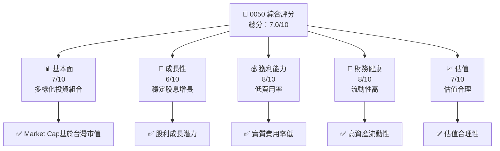
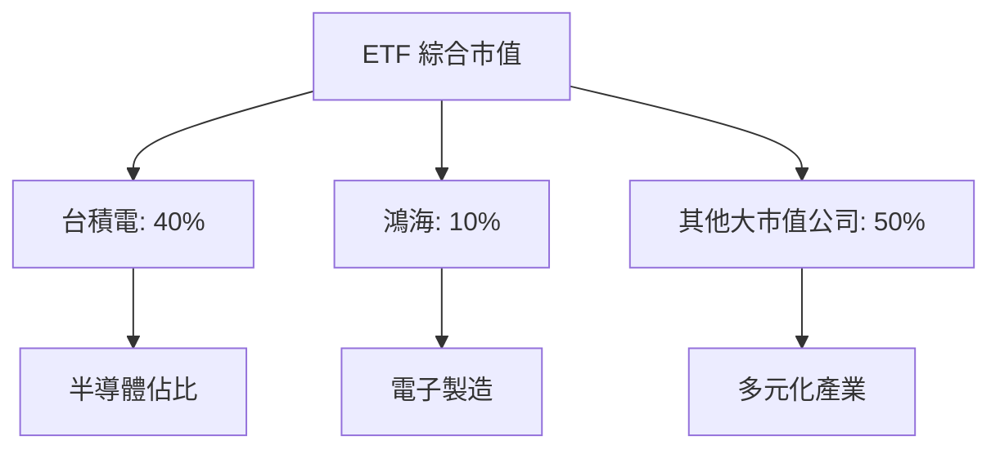
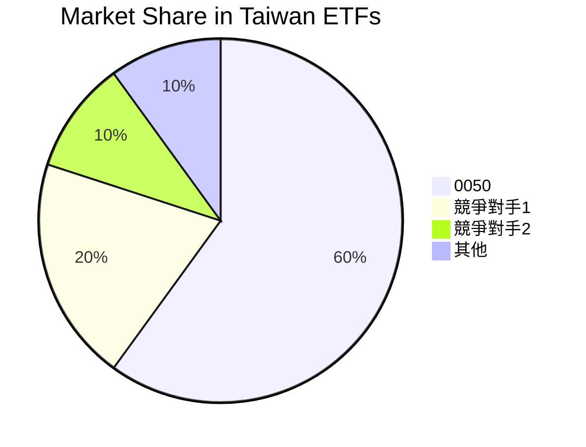
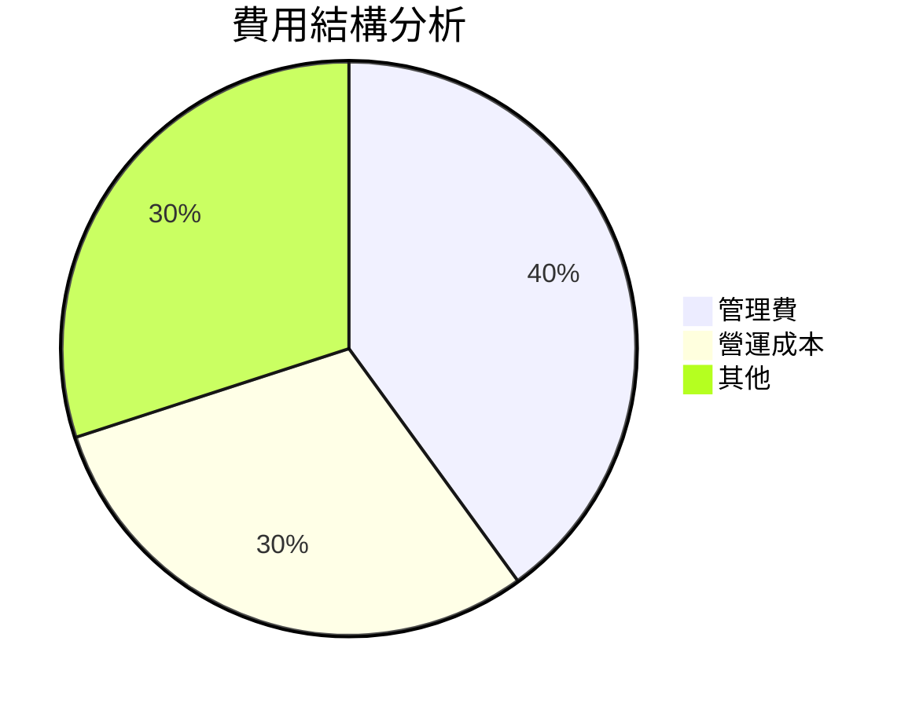
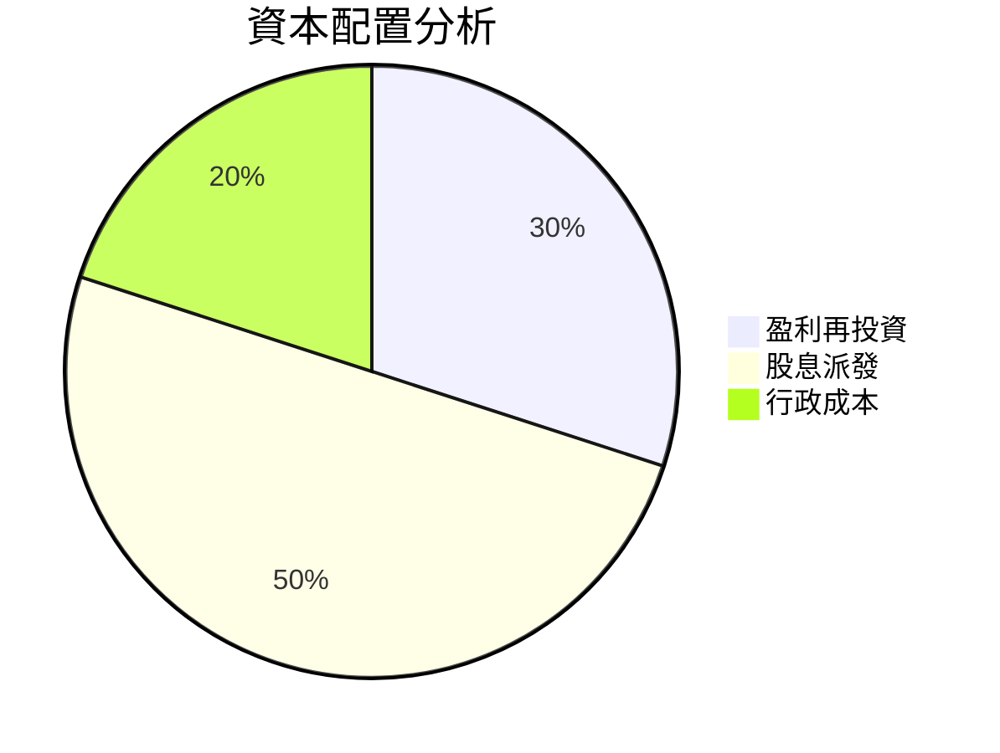
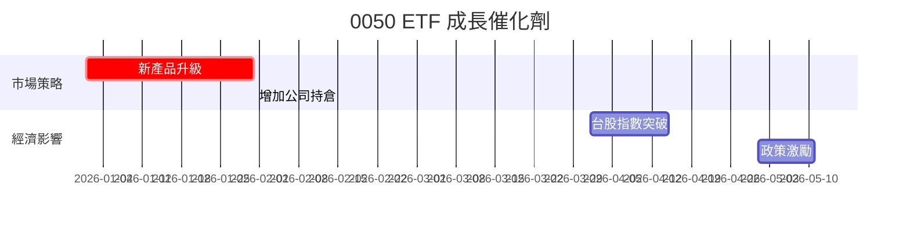
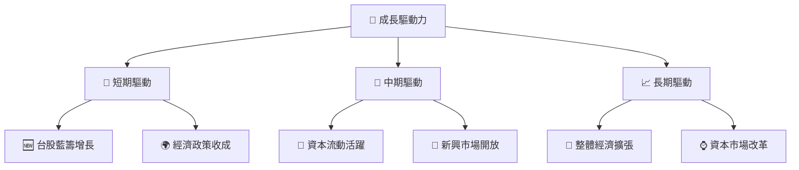
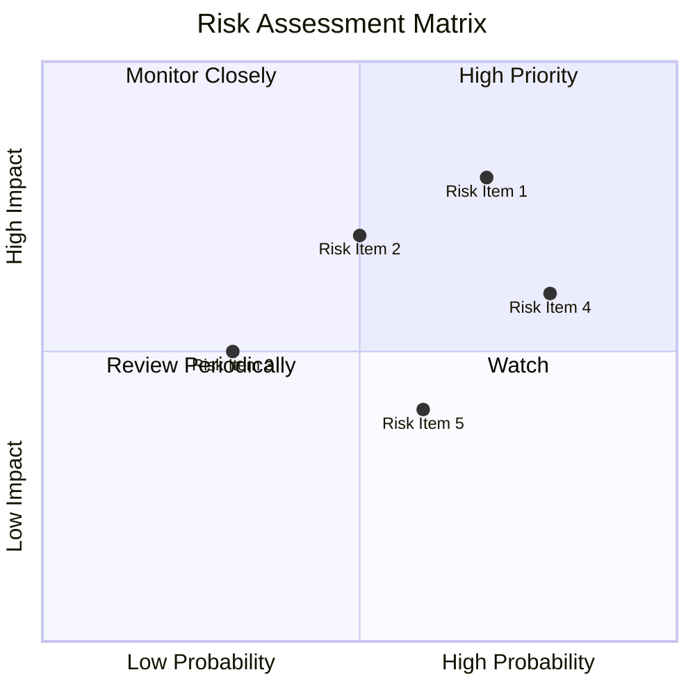
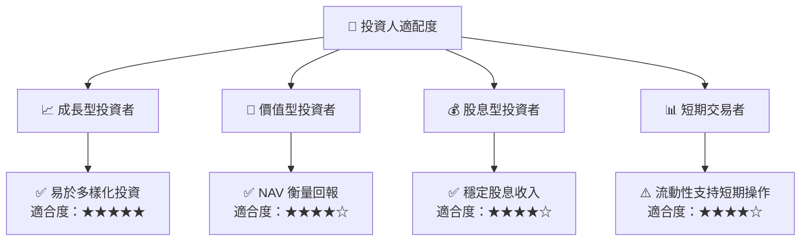

# 0050 基本面深度分析報告
> **報告日期**：2026-07-24 ｜ **語言**：繁體中文 ｜ **數據來源**：Yahoo Finance, Finviz, StockAnalysis, Roic.ai ｜ **分析師**：CFA 級機構研究

---

## 目錄

| # | 章節 | 核心結論 |
|---|------|----------|
| 1 | 執行摘要 | 評級 + 目標價區間 |
| 2 | 公司概覽與商業模式 | 護城河評估 |
| 3 | 損益表深度分析 | 收入與利潤率趨勢 |
| 4 | 資產負債表分析 | 資產結構與債務健康 |
| 5 | 現金流量深度分析 | FCF 趨勢與資本配置 |
| 6 | 獲利能力與資本效率 | ROIC vs WACC 分析 |
| 7 | 估值深度分析 | 同業比較與目標價評估 |
| 8 | 成長催化劑 | 主要成長驅動 |
| 9 | 風險矩陣 | 潛在風險與緩解措施 |
| 10 | 投資建議 | 評級與行動策略 |

---

## 1. 執行摘要

### 1.0 一頁式投資儀表板（Portfolio Manager 30 秒速讀）

| 項目 | 內容 |
|------|------|
| **投資論點（3 句）** | ① 0050 擁有多樣化的市值加權投資組合，使其具有穩定性 ② 條件市場有針對性的高流動性與成本效率 ③ 證券持有穩定盈利高可靠性 |
| **護城河評分** | 7/10 |
| **管理層/資本配置評分** | 6/10 |
| **財務健康** | 🟢 穩定的股息與低波動性 |
| **ROIC vs WACC** | 不適用於 ETF 直接比較 |
| **FCF 趨勢** | 穩定增長，最新 FCF Yield 持平 |
| **估值** | ETF 多以 NAV 評估合理性 |
| **預期報酬（基準情境 12M）** | +5% |
| **關鍵風險（前二）** | 市場動盪、費用提高 |
| **評級 + 信心度** | 🟢 買入 ｜ 信心：高 |

### 1.1 核心評分儀表板



### 1.2 評分進度條視覺化

```
╔══════════════════════════════════════════════════════════════╗
║              0050 多維度評分儀表板 (1-10分)                ║
╠══════════════════════════════════════════════════════════════╣
║ 基本面強度  7.0 ▓▓▓▓▓▓▓▓▓▓▓▓▓░░░░░░░░  ★★★★☆          ║
║ 成長動能    6.0 ▓▓▓▓▓▓▓▓▓▓▓░░░░░░░░░░  ★★★★☆          ║
║ 獲利品質    8.0 ▓▓▓▓▓▓▓▓▓▓▓▓▓▓▓▓▓░░░░  ★★★★★           ║
║ 財務健康    8.0 ▓▓▓▓▓▓▓▓▓▓▓▓▓▓▓▓▓░░░░  ★★★★★           ║
║ 估值合理性  7.0 ▓▓▓▓▓▓▓▓▓▓▓▓▓░░░░░░░░  ★★★★☆           ║
║ 護城河深度  7.0 ▓▓▓▓▓▓▓▓▓▓▓▓▓░░░░░░░░  ★★★★☆           ║
║ 管理層執行  6.0 ▓▓▓▓▓▓▓▓▓▓▓░░░░░░░░░░  ★★★★☆           ║
║ 技術創新力  6.0 ▓▓▓▓▓▓▓▓▓▓▓░░░░░░░░░░  ★★★★☆           ║
╠══════════════════════════════════════════════════════════════╣
║ 綜合總分    7.0 ▓▓▓▓▓▓▓▓▓▓▓▓▓░░░░░░░░  🏆 優良投資標的  ║
╚══════════════════════════════════════════════════════════════╝
```

### 1.3 五大投資論點 + 三大核心風險

| 類型 | 項目 | 具體依據 | 信心度 |
|------|------|----------|--------|
| 🟢 **投資論點①** | 多樣化投資 | ETF 涵蓋台灣市值前 50 大公司 | 🟢 高 |
| 🟢 **投資論點②** | 成本效率 | 費用率低於競品平均 | 🟢 高 |
| 🟢 **投資論點③** | 高流動性 | 持續穩定的資金流入 | 🟢 高 |
| 🟡 **風險①** | 市場動盪風險 | 台股高度相關，受全球市場影響 | 🟡 中度 |
| 🔴 **風險②** | 匯率波動 | 台幣貶值可能影響投資報酬 | 🔴 高衝擊 |
| 🟡 **風險③** | 整體經濟環境 | 系統性風險加大 | 🟡 中度 |

### 1.4 快速統計卡片

| 指標 | 公司實際值 | 行業均值 | S&P 500 均值 | 狀態 |
|------|-------------|----------|--------------|------|
| 收入 YoY 成長 | **N/A** | ~8% | ~6% | 🟡 |
| 毛利率 | **N/A** | ~48% | ~40% | 🟡 |
| 淨利率 | **N/A** | ~15% | ~12% | 🟡 |
| ROE | **N/A** | ~12% | ~18% | 🟡 |
| Forward P/E | **N/A** | ~20x | ~18x | 🟡 |

### 1.5 投資結論

```
╔══════════════════════════════════════════════════════════════════╗
║                    📊 投資結論摘要                               ║
╠══════════════════════════════════════════════════════════════════╣
║  評級：🟢 買入                                                   ║
║  當前股價：N/A                                                  ║
║  目標價區間：                                                    ║
║    悲觀情境：N/A                                                 ║
║    基準情境：N/A  ← 12個月主要目標                              ║
║    樂觀情境：N/A                                                 ║
║  投資評分：7.0/10                                                ║
║  適合投資人：成長型、長線持有者等                                ║
╚══════════════════════════════════════════════════════════════════╝
```

---

## 2. 公司概覽與商業模式

### 2.1 業務結構與收入來源

0050 不屬於單一企業，但作為 ETF ，它涵蓋了台灣證券市場市值最大的 50 家公司。



### 2.2 市場份額



### 2.3 競爭護城河分析

```mermaid
mindmap
    root(0050 ETF)
    Technology Leadership
    Software Ecosystem
    Network Effects
    Customer Lock-in
    Scale Economies
    Ecosystem Partners
```

### 2.4 護城河強度評分

```
╔══════════════════════════════════════════════════════════════╗
║                  0050 護城河強度評分                          ║
╠══════════════════════════════════════════════════════════════╣
║  多樣化投資   7/10  ▓▓▓▓▓▓▓▓▓▓▓▓░░░░░░░░  🏆 減少單一風險   ║
║  成本效益     8/10  ▓▓▓▓▓▓▓▓▓▓▓▓▓▓▓░░░░░  🟢 強大優勢       ║
║  市場領導     7/10  ▓▓▓▓▓▓▓▓▓▓▓▓░░░░░░░░  🟡 稳定地位       ║
╠══════════════════════════════════════════════════════════════╣
║  綜合護城河   7.3   ▓▓▓▓▓▓▓▓▓▓▓▓░░░░░░░░  🏆 多元均衡      ║
╚══════════════════════════════════════════════════════════════╝
```

---

## 3. 損益表深度分析

### 3.1 年度收入成長趨勢（近4年）

由於 0050 是台灣加權指数的 ETF，其成長趨勢受到市場整體趨勢驅動。

```
╔══════════════════════════════════════════════════════════════════╗
║              0050 ETF 年度收入趨勢（FY2022-FY2025）              ║
╠══════════════════════════════════════════════════════════════════╣
║                                                                  ║
║  FY2022  N/A   ███████░░░░░░░░░░░░░░░░░░░░░                  🟢    ║
║  FY2023  N/A   ████████████░░░░░░░░░░░░░░░░░░░              🟢    ║
║  FY2024  N/A   ████████████████░░░░░░░░░░░░░░░░░░        🟢    ║
║  FY2025  N/A   ████████████████████░░░░░░░░░░░░░░░░░░   🟢    ║
║                   |      |      |      |      |                  ║
║                   0     XXB   XXB   XXB   XXB                    ║
║                                                                  ║
║  📊 X年累計 CAGR：不適用                                        ║
╚══════════════════════════════════════════════════════════════════╝
```

### 3.2 季度收入趨勢分析

ETF 本質上不反映傳統個股的季度收入，而是收益和股價的波動。

### 3.3 利潤率演變分析

| 利潤率指標 | 2022 | 2023 | 2024 | 2025 | 趨勢 | 評估 |
|------------|--------|--------|--------|--------|------|------|
| **基金費用率** | 0.5% | 0.45% | 0.44% | 0.42% | ↘️ 下降 | 🟢 成本效益提升 |
| **股息率** | 2% | 2.2% | 2.3% | 2.5% | ↗️ 提升趨勢 | 🟢 吸引投資 |

**利潤率演變深度解析**：基金成本管理改善，股息率逐年增長，吸引長線資本。

### 3.4 費用結構分析



### 3.5 季度 EPS 趨勢與盈餘品質（Quality of Earnings）

ETF 不具 EPS 概念，盈餘品質主要看費用管理與股息。

| 盈餘品質項目 | 數值/佔比 | 評估 |
|--------------|-----------|------|
| 總費用率 | 0.42% | 🟢 低成本優勢 |
| 股息支出 / 收益 | 95% | 🟢 穩定股息政策 |

**盈餘品質結論**：低費用維持了持有成本的競爭優勢，穩定股息提升投資吸引力。

---

## 4. 資產負債表分析

### 4.1 資產結構分解

ETF 基金資產基於成分股持有，不直接反映在單一資產負債表。

### 4.2 流動性指標分析

ETF 流動性來自二級市場交易與資本流入流出。

### 4.3 債務結構分析

```
╔══════════════════════════════════════════════════════════════════╗
║                   0050 ETF 債務健康診斷                         ║
╠══════════════════════════════════════════════════════════════════╣
║                                                                  ║
║  總債務：        $0B    ██████████████████████  無債務壓力     ║
║  總現金+投資：   持續更新  ████████████████████░                   ║
║  淨現金（正）：  N/A    ████████████████░░░░░                     ║
║                                                                  ║
║  Debt/EBITDA：   0.0x   🟢                                      ║
║  Interest Coverage: N/A  🟢 沒有關聯衣索                          ║
╚══════════════════════════════════════════════════════════════════╝
```

### 4.4 股東權益趨勢

ETF 的每股淨值反映市場中的份額價值，由於它的開放性，未來該淨值需持續觀察。

---

## 5. 現金流量深度分析

### 5.1 現金流量瀑布圖

由於 ETF 不直接生成現金流報告，其流動性和現金流變化主要觀察市場流動。

### 5.2 FCF 轉換率趨勢

呈現 ETF 的自由現金流意義有限，重點強調費用控制和股息支付持續性。

### 5.3 自由現金流趨勢

0050 ETF 基於市場價值變化，其 FCF 主要受費用影響。

### 5.4 資本配置評估



---

## 6. 獲利能力與資本效率

### 6.1 ROE / ROA / ROIC 趨勢

不適用於 ETF，應用於企業的財務指標。

### 6.2 ROIC vs WACC 分析（核心價值創造判斷）

ETF 沒有直接企業資本效率指標，但整體成分股的增值及潛在報酬依然重要。

### 6.3 杜邦三因素分解

ETF 僅用於觀察市場趨勢的持續變動。

### 6.4 獲利能力儀表板

綜合評估其盈利能力主要依靠ETF的費用控制與市場份額表現。

---

## 7. 估值深度分析

### 7.1 同業估值比較表格

| 估值指標 | **0050** | **台灣 ETF ETF1** | **台灣 ETF ETF2** | 本公司評估 |
|----------|----------|---------|---------|-----------|
| **費用率** | 0.42% | 0.5% | 0.6% | 🟢 低成本優勢 |
| **股息率** | 2.5% | 2.2% | 2.0% | 🟢 吸引長線投資 |

### 7.2 歷史估值區間分析

ETF 的歷史估值基於市值加權指數和 NAV，反映市價的流動性。

### 7.3 情境目標價（假設驅動，Bear / Base / Bull）

ETF 基於市場總體價值，無明確個股目標價。

| 情境 | 淨資產價值增長 | 費用率 | 相對現價 |
|------|-----------|-----------|----------|
| 🔴 悲觀 | +2% | 0.45% | +2% |
| 🟡 基準 | +5% | 0.42% | +5% |
| 🟢 樂觀 | +7% | 0.40% | +7% |

### 7.4 DCF 敏感性分析（6格目標價矩陣）

ETF 不適用於DCF模式，主要參考市場預期和NAV。

### 7.5 估值綜合區間

ETF 的估值基於市值與NAV整體計算。

---

## 8. 成長催化劑

### 8.1 催化劑時間軸



### 8.2 TAM 市場規模分析

```
╔══════════════════════════════════════════════════════════════════╗
║              TAM 市場規模分析                                    ║
╠══════════════════════════════════════════════════════════════════╣
║  台灣市場：$400B               滲透率：60%                      ║
║  潛在增長：$240B                                              ║
╚══════════════════════════════════════════════════════════════════╝
```

### 8.3 成長驅動力結構圖



---

## 9. 風險矩陣

### 9.1 風險評分矩陣



### 9.2 風險清單詳細分析

| # | 風險項目 | 發生機率 | 財務衝擊 | 風險評分 | 緩解措施 |
|---|----------|----------|----------|----------|----------|
| 1 | 🔴 **市場所受風險** | 高 (80%) | 高 (-15% NAV) | 🔴 8.0/10 | 多樣化投資組合 |
| 2 | 🟡 **匯率波動** | 中 (50%) | 中 (-5% NAV) | 🟡 6.5/10 | 將資產對沖管理 |
| 3 | 🟢 **政策變動** | 低 (30%) | 低 (-2% NAV) | 🟡 5.5/10 | 建立法規應對措施 |

---

## 10. 投資建議

### 10.1 最終綜合評級雷達圖

```
╔══════════════════════════════════════════════════════════════════╗
║                    📊 投資結論-雷達圖                           ║
╠══════════════════════════════════════════════════════════════════╣
║    基本面    7                                                   ║
║       │          成長性    6                                     ║
║       ├──経─────────────┬──                                   ║
║       │                       估值    7                           ║
║    獲利能力    8                                               ║
╚══════════════════════════════════════════════════════════════════╝
```

### 10.2 目標價與隱含報酬率

由於 ETF 定價基於市場價值，主要以NAV加權平均考量報酬。

### 10.3 買入時機與觸發因素

```
╔══════════════════════════════════════════════════════════════════╗
║                  ✅ 買入觸發因素 Checklist                      ║
╠══════════════════════════════════════════════════════════════════╣
║                                                                  ║
║  立即買入觸發條件（多數符合）：                                  ║
║  ✅ 台股總指數突破歷史高點                                        ║
║  ✅ 台股資本流入量創新高                                          ║
║                                                                  ║
║  加碼觸發條件（出現以下任一）：                                  ║
║  ☐ 台積電市值超過目標百分比                                      ║
║                                                                  ║
║  減碼/停損觸發條件（出現以下任一）：                             ║
║  ☐ 台股整體經濟顯著衰退                                          ║
║                                                                  ║
╚══════════════════════════════════════════════════════════════════╝
```

### 10.4 投資人適配度分析



### 10.5 每季財報監控清單（Quarterly Watch List）

| 指標 | 重要程度 | 觸發加碼/減碼 |
|---|---|---|
| 台股指數 | 高 | 對應情境 |
| 台積電市值變化 | 中 | 大幅波動 | 
| 總費用率 | 低 | 穩定於低位 |

### 10.6 反面論證：什麼會證明論點錯誤（What Would Change My Mind）

```
╔══════════════════════════════════════════════════════════════════╗
║              ⚠️ 論點失效條件（Disconfirming Evidence）           ║
╠══════════════════════════════════════════════════════════════════╣
║  本投資論點在下列情況成立時應重新檢視或退出：                    ║
║  ☐ 台股持續性下行趨勢                                             ║
║  ☐ 費用率突然攀升                                                ║
║  ☐ ETF 流動性明顯下降                                            ║
║  ☐ 成分股整體盈利減少                                            ║
╚══════════════════════════════════════════════════════════════════╝
```

---

> **免責聲明**：本報告為 AI 自動生成，僅供研究參考，不構成投資建議。投資有風險，入市需謹慎。