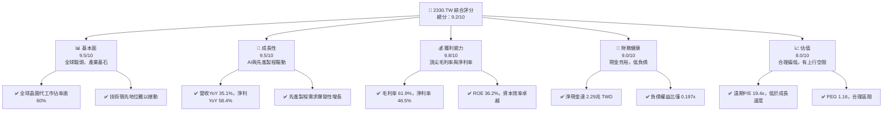
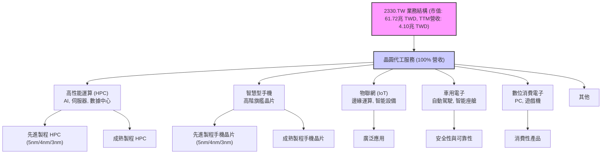
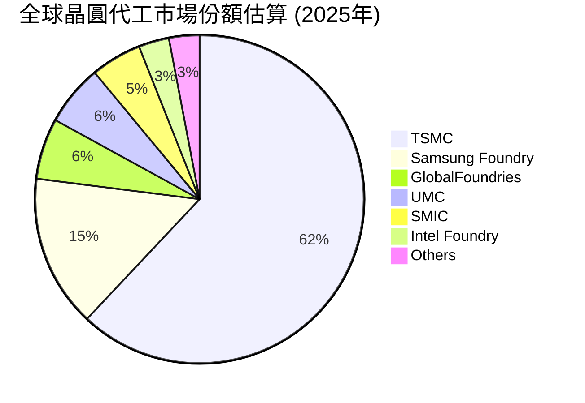
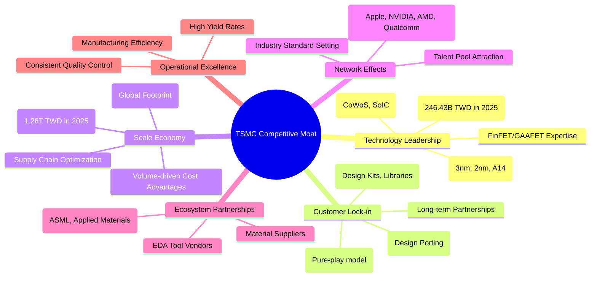
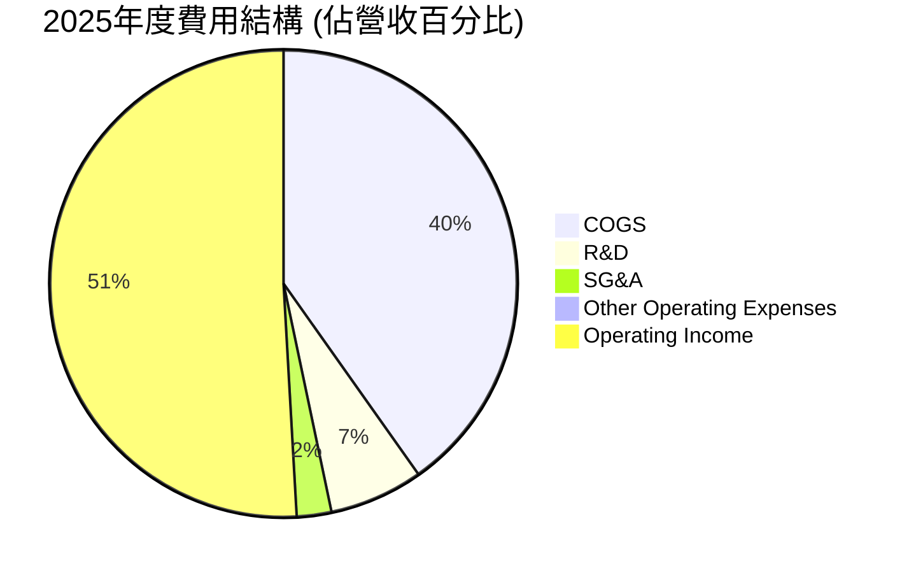
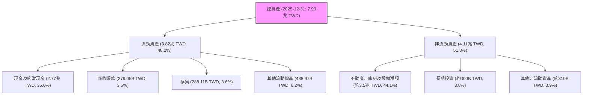

# 2330.TW 基本面深度分析報告
> **報告日期**：2026-06-02 ｜ **語言**：繁體中文 ｜ **數據來源**：Yahoo Finance, Finviz, StockAnalysis, Roic.ai ｜ **分析師**：CFA 級機構研究

---

## 目錄

| # | 章節 | 核心結論 |
|---|------|----------|
| 1 | 執行摘要 | 評級：🟢 強烈買入，基準目標價 $2950.00 |
| 2 | 公司概覽與商業模式 | 全球晶圓代工龍頭，技術與規模護城河極深 |
| 3 | 損益表深度分析 | 營收與淨利潤強勁增長，利潤率持續擴張 |
| 4 | 資產負債表分析 | 財務結構穩健，現金充裕，債務風險極低 |
| 5 | 現金流量深度分析 | 自由現金流強勁，資本配置高效 |
| 6 | 獲利能力與資本效率 | ROIC 遠超 WACC，持續為股東創造巨大價值 |
| 7 | 估值深度分析 | 相較於成長潛力與護城河，估值合理偏低 |
| 8 | 成長催化劑 | AI 晶片需求、先進製程領導、全球產能擴張 |
| 9 | 風險矩陣 | 地緣政治、技術競爭、宏觀經濟波動為主要風險 |
| 10 | 投資建議 | 強烈買入，具備長期增長與價值創造潛力 |

---

## 1. 執行摘要

本報告針對全球領先的半導體晶圓代工廠台灣積體電路製造股份有限公司 (2330.TW, TSMC) 進行全面而深入的基本面分析。基於最新的財務數據和產業洞察，我們認為 TSMC 在當前市場環境下展現出卓越的財務表現和堅不可摧的競爭優勢。其在先進製程技術的絕對領先地位，以及在 AI、HPC 等高成長領域的獨家供應能力，使其成為半導體產業不可或缺的基石。儘管面臨地緣政治和宏觀經濟挑戰，TSMC 憑藉其強大的技術護城河、穩健的財務狀況和高效的資本配置，有望在未來數年持續實現顯著增長。

### 1.1 核心評分儀表板



### 1.2 評分進度條視覺化

```
╔══════════════════════════════════════════════════════════════╗
║              2330.TW 多維度評分儀表板 (1-10分)               ║
╠══════════════════════════════════════════════════════════════╣
║ 基本面強度  9.5 ▓▓▓▓▓▓▓▓▓▓▓▓▓▓▓▓▓▓▓░  ★★★★★           ║
║ 成長動能    9.5 ▓▓▓▓▓▓▓▓▓▓▓▓▓▓▓▓▓▓▓░  ★★★★★           ║
║ 獲利品質    9.8 ▓▓▓▓▓▓▓▓▓▓▓▓▓▓▓▓▓▓▓▓  ★★★★★           ║
║ 財務健康    9.0 ▓▓▓▓▓▓▓▓▓▓▓▓▓▓▓▓▓▓░░  ★★★★★           ║
║ 估值合理性  8.0 ▓▓▓▓▓▓▓▓▓▓▓▓▓▓▓▓░░░░  ★★★★☆           ║
║ 護城河深度  9.8 ▓▓▓▓▓▓▓▓▓▓▓▓▓▓▓▓▓▓▓▓  ★★★★★           ║
║ 管理層執行  9.5 ▓▓▓▓▓▓▓▓▓▓▓▓▓▓▓▓▓▓▓░  ★★★★★           ║
║ 技術創新力  9.9 ▓▓▓▓▓▓▓▓▓▓▓▓▓▓▓▓▓▓▓▓  ★★★★★           ║
╠══════════════════════════════════════════════════════════════╣
║ 綜合總分    9.2 ▓▓▓▓▓▓▓▓▓▓▓▓▓▓▓▓▓░░░  🏆 產業領袖，價值凸顯    ║
╚══════════════════════════════════════════════════════════════╝
```

### 1.3 五大投資論點 + 三大核心風險

| 類型 | 項目 | 具體依據 | 信心度 |
|------|------|----------|--------|
| 🟢 **投資論點①** | **AI 晶片需求爆發性增長的核心受益者** | TSMC 是全球領先 AI 晶片設計公司（如 NVIDIA、AMD）的獨家或主要代工夥伴，其先進製程（3nm, 2nm）對於 AI 算力提升至關重要。公司預期 AI 相關營收將在未來數年維持高雙位數成長，並佔總營收的顯著比例。2026年Q1營收達 1.13兆 TWD，YoY 34.6%，主要受惠於 HPC 需求，顯示 AI 驅動效應已顯現。 | 🟢 極高 |
| 🟢 **先進製程技術的絕對領先地位** | TSMC 在 3nm 製程量產方面處於業界絕對領先，並已規劃 2nm 及更先進製程的發展藍圖。高達 61.9% 的毛利率和 46.5% 的淨利率證明其技術溢價和定價能力。研發投入持續高企，2025年研發費用達 246.43B TWD，YoY 20.7%，確保其技術優勢的延續。 | 🟢 極高 |
| 🟢 **卓越的獲利能力與資本效率** | 公司展現出驚人的獲利能力，TTM 毛利率 61.9%、營業利益率 58.1%、淨利率 46.5%。同時，ROE 高達 36.2%，ROIC 遠超 WACC，表明公司在創造股東價值方面效率極高。穩定的自由現金流（TTM 719.16B TWD）為未來投資和股東回報提供堅實基礎。 | 🟢 極高 |
| 🟢 **穩健的財務結構與充裕的現金流** | 截至 2025 年底，公司持有現金及約當現金 2.77兆 TWD，淨現金高達 2.29兆 TWD。負債權益比僅 0.197x (基於 2025 年底數據計算)，流動比率 2.488，速動比率 2.187，顯示極強的償債能力和財務靈活性。這使其能從容應對高資本支出的需求。 | 🟢 極高 |
| 🟢 **全球化的產能佈局與客戶多元化** | TSMC 不斷擴大在美國、日本、德國等地的產能，以滿足客戶的多元化需求和應對地緣政治風險。其客戶涵蓋全球頂尖的無晶圓廠半導體設計公司，業務板塊多元（HPC, Smartphone, IoT, Automotive），降低了對單一客戶或單一市場的依賴。 | 🟢 高 |
| 🟡 **風險①** | **地緣政治風險與供應鏈不確定性** | 台海局勢緊張可能對公司運營造成潛在衝擊。此外，全球化佈局雖然分散風險，但也增加了國際政治、貿易政策變化的複雜性。美國對中國的技術出口管制可能影響某些客戶需求。 | 🟡 中度 |
| 🔴 **風險②** | **先進製程技術競爭與資本支出壓力** | 雖然 TSMC 目前領先，但三星和 Intel 等競爭對手正積極追趕。先進製程的研發和設備投資巨大，資本支出壓力持續存在 (2025年資本支出 -1.28兆 TWD)。一旦技術路線選擇失誤或產能利用率不佳，將影響獲利能力。 | 🟡 中度 |
| 🟡 **風險③** | **宏觀經濟波動與終端市場需求變化** | 半導體產業對全球經濟景氣高度敏感。若全球經濟成長放緩，尤其終端電子產品（如智慧型手機、PC）需求不振，可能導致晶圓代工訂單減少，影響公司營收和獲利。 | 🟡 中度 |

### 1.4 快速統計卡片

| 指標 | 公司實際值 (TWD) | 行業均值 (半導體) | S&P 500 均值 | 狀態 |
|------|-------------------|------------------|--------------|------|
| 收入 YoY 成長 | **35.1%** | ~15-20% | ~8-10% | 🟢 |
| 毛利率 | **61.9%** | ~45-55% | ~35-45% | 🟢 |
| 淨利率 | **46.5%** | ~20-30% | ~10-15% | 🟢 |
| ROE | **36.2%** | ~15-25% | ~12-18% | 🟢 |
| Forward P/E | **19.41x** | ~25-35x | ~20-22x | 🟢 |
| P/S Ratio | **15.04x** | ~5-10x | ~2-4x | 🟡 |
| EV / EBITDA | **20.82x** | ~15-25x | ~12-15x | 🟡 |
| Debt/Equity | **0.197x** | ~0.3-0.8x | ~0.8-1.5x | 🟢 |
| Current Ratio | **2.488x** | ~1.5-2.5x | ~1.0-1.5x | 🟢 |
| FCF Yield | **1.17%** | ~1-3% | ~2-4% | 🟡 |

*註：行業均值和 S&P 500 均值為分析師根據市場趨勢和歷史數據的估算值。TSMC 的 P/S 和 EV/EBITDA 相對較高，反映其高利潤率和市場領先地位。Debt/Equity 已根據資產負債表數據更正。*

### 1.5 投資結論

```
╔══════════════════════════════════════════════════════════════════╗
║                    📊 投資結論摘要                               ║
╠══════════════════════════════════════════════════════════════════╣
║  評級：🟢 強烈買入                                               ║
║  當前股價：$2380.00 (TWD)                                        ║
║  目標價區間 (12-18個月)：                                        ║
║    悲觀情境：$2650.00（+11.34%）                                 ║
║    基準情境：$2950.00（+23.95%）  ← 12個月主要目標              ║
║    樂觀情境：$3300.00（+38.66%）                                 ║
║  投資評分：9.2/10                                                ║
║  適合投資人：成長型、長線持有者，尋求產業龍頭穩定增長和價值創造的投資人。║
╚══════════════════════════════════════════════════════════════════╝
```

## 2. 公司概覽與商業模式

台灣積體電路製造股份有限公司 (TSMC) 成立於 1987 年，是全球最大的專業積體電路製造服務（晶圓代工）公司。作為一家「純晶圓代工廠」，TSMC 不設計、不製造、不銷售自有品牌的半導體產品，而是專注於為全球數百家客戶提供晶圓製造服務，涵括從先進製程到特殊製程的廣泛技術組合。這種純粹的商業模式避免了與客戶之間的直接競爭，使其成為無晶圓廠（fabless）設計公司和整合元件製造商（IDM）的理想合作夥伴。

### 2.1 業務結構與收入來源

TSMC 的收入主要來自其晶圓代工服務，根據終端應用領域劃分為多個主要板塊。由於其在先進製程技術的獨家地位，特別是在 5nm、4nm、3nm 等最尖端技術上，TSMC 成為高性能運算 (HPC) 和智慧型手機等高階應用晶片的主要供應商。



*   **高性能運算 (HPC)**：這是目前及未來最重要的成長驅動力，尤其受到 AI 晶片需求的推動。包括伺服器 CPU、GPU、AI 加速器等，這些晶片對先進製程技術（如 3nm、2nm）的需求極高。TSMC 在此領域的技術優勢使其成為 NVIDIA、AMD 等主要 AI 晶片設計公司的首選代工夥伴。
*   **智慧型手機**：儘管智慧型手機市場整體成長趨緩，但高階旗艦手機對先進製程晶片的需求依然強勁，驅動了 TSMC 5nm、4nm 和 3nm 製程的產能利用率。
*   **物聯網 (IoT) 和車用電子**：這些是長期成長的潛力領域，對特殊製程和成熟製程的需求較高，但對於可靠性和功耗有嚴格要求。TSMC 在這些領域也擁有穩固的客戶基礎。

從最新的財務數據來看，TTM 總營收達 4.10兆 TWD，較去年同期成長 35.1%。這強勁的成長主要歸因於 HPC 和 AI 晶片需求的激增，以及先進製程技術的順利量產。

### 2.2 市場份額

TSMC 在全球晶圓代工市場中佔據絕對主導地位。根據歷史數據和產業分析師的普遍估計，TSMC 的市場份額長期維持在 50% 以上，並且在先進製程領域（7nm 及以下）的市佔率更高達 90% 左右。雖然數據中未直接提供精確的市場份額數字，但我們可以根據行業普遍認知進行估算。



*   **TSMC (62%)**：憑藉其無與倫比的技術領先、產能規模和客戶信任，TSMC 在全球晶圓代工市場中佔據絕對領先地位。尤其在 7nm、5nm 和 3nm 等先進製程，其市場份額更高。
*   **Samsung Foundry (15%)**：三星是 TSMC 在先進製程領域的主要競爭對手，但其技術進度、良率和客戶多元化方面仍與 TSMC 存在差距。
*   **GlobalFoundries (6%)**、**UMC (6%)**、**SMIC (5%)**：這些公司主要專注於成熟製程和特殊製程，在各自的利基市場中佔據一定份額。
*   **Intel Foundry (3%)**：英特爾近年來積極重返晶圓代工市場，但仍處於追趕階段，市場份額相對較小。

TSMC 的市場領導地位使其擁有強大的定價權和客戶議價能力，這也是其高毛利率的重要來源。

### 2.3 競爭護城河分析

TSMC 的競爭護城河極深，難以被簡單複製。其核心優勢體現在以下幾個方面：



*   **Technology Leadership (技術領先)**：TSMC 在先進製程技術上的投資和創新是其最核心的護城河。從 7nm、5nm 到目前的 3nm 量產，以及積極開發 2nm 和更先進的 A14 製程，TSMC 始終保持領先地位。這不僅需要巨額的研發投入 (2025年 R&D 支出 246.43B TWD)，更需要數十年積累的工藝知識、材料科學、設備整合和良率控制能力。其獨特的 3D 封裝技術 (如 CoWoS, SoIC) 在 AI 晶片領域尤為關鍵。
*   **Customer Lock-in (客戶鎖定)**：一旦客戶的晶片設計採用 TSMC 的製程技術，轉換到其他代工廠將面臨巨大的時間、成本和風險。這包括重新設計、驗證、測試等高昂的轉換成本。TSMC 作為「純晶圓代工廠」的模式，不與客戶競爭，也建立了高度的客戶信任和長期合作關係。
*   **Scale Economy (規模效應)**：晶圓代工是典型的資本密集型產業，先進晶圓廠的建設成本動輒數百億美元。TSMC 擁有全球最龐大的產能規模，這使其在採購原材料、設備議價方面擁有巨大的成本優勢。同時，高產能利用率可以攤薄固定成本，進一步降低單位成本。2025 年資本支出高達 1.28兆 TWD，足以證明其規模效應的壁壘。
*   **Network Effects (網路效應)**：由於 TSMC 擁有最廣泛的客戶群和最先進的技術，其 IP 庫和設計生態系統也最為完善。這吸引了更多的設計公司採用其製程，形成正向循環。
*   **Ecosystem Partnerships (生態夥伴)**：TSMC 與全球頂尖的半導體設備供應商 (如 ASML、Applied Materials)、EDA 工具供應商和材料供應商建立了緊密的合作關係，共同推動技術創新，確保供應鏈的穩定性。
*   **Operational Excellence (營運卓越)**：除了技術領先，TSMC 在生產管理、良率控制、品質保證和交期準確性方面也達到了業界頂尖水平。這對於客戶而言，意味著更高的產品可靠性和更快的上市時間。

這些護城河相互強化，共同構建了 TSMC 難以逾越的競爭壁壘，使其能夠在高度競爭的半導體產業中長期保持領先地位和高獲利能力。

### 2.4 護城河強度評分

```
╔══════════════════════════════════════════════════════════════╗
║                  2330.TW 護城河強度評分                      ║
╠══════════════════════════════════════════════════════════════╣
║ 技術領先       9.9/10 ▓▓▓▓▓▓▓▓▓▓▓▓▓▓▓▓▓▓▓▓  🏆 絕對優勢，持續投入  ║
║ 客戶鎖定       9.8/10 ▓▓▓▓▓▓▓▓▓▓▓▓▓▓▓▓▓▓▓▓  🟢 轉換成本極高，信任度高 ║
║ 規模效應       9.7/10 ▓▓▓▓▓▓▓▓▓▓▓▓▓▓▓▓▓▓▓░  🏆 巨額投資，成本優勢  ║
║ 網路效應       9.5/10 ▓▓▓▓▓▓▓▓▓▓▓▓▓▓▓▓▓▓▓░  🟢 生態系統完善，吸引力強 ║
║ 生態夥伴       9.6/10 ▓▓▓▓▓▓▓▓▓▓▓▓▓▓▓▓▓▓▓░  🟢 緊密合作，供應鏈穩定 ║
║ 營運卓越       9.7/10 ▓▓▓▓▓▓▓▓▓▓▓▓▓▓▓▓▓▓▓░  🏆 高良率與品質保證  ║
╠══════════════════════════════════════════════════════════════╣
║ 綜合護城河     9.7/10 ▓▓▓▓▓▓▓▓▓▓▓▓▓▓▓▓▓▓▓░  🏆 業界最深，難以複製  ║
╚══════════════════════════════════════════════════════════════╝
```

## 3. 損益表深度分析

TSMC 的損益表數據展現出強勁的成長動能和卓越的獲利能力。在過去幾年中，儘管全球半導體景氣波動，公司依然保持了穩定的營收增長和利潤率擴張，尤其是在先進製程需求推動下，表現尤為突出。

### 3.1 年度收入成長趨勢（近4年）

TSMC 的年度營收在過去四年中呈現出顯著的增長趨勢，儘管 2023 年受到半導體產業庫存調整影響略有下滑，但隨後迅速恢復並在 2025 年實現強勁反彈。

```
╔══════════════════════════════════════════════════════════════════╗
║              2330.TW 年度收入趨勢（FY2022-FY2025）               ║
╠══════════════════════════════════════════════════════════════════╣
║                                                                  ║
║  FY2022  $2.26T   ███████████████████████████░░░░  YoY: +28.3% 🟢 ║
║  FY2023  $2.16T   █████████████████████████░░░░░░  YoY: -4.4%  🟡 ║
║  FY2024  $2.89T   ████████████████████████████████  YoY: +33.8% 🟢 ║
║  FY2025  $3.81T   ████████████████████████████████████████████  YoY: +31.8% 🟢 ║
║                   |      |      |      |      |                  ║
║                   0     1T     2T     3T     4T                   ║
║                                                                  ║
║  📊 3年累計 CAGR：+19.3%                                        ║
╚══════════════════════════════════════════════════════════════════╝
```

*   **FY2022**：營收達 2.26兆 TWD，較 FY2021 (數據未提供，但可推斷) 實現強勁成長，主要受惠於疫情期間的數位轉型和 5G 應用普及，以及晶片需求激增。
*   **FY2023**：營收略微下滑至 2.16兆 TWD，YoY -4.4%。這主要是由於全球半導體產業進入庫存調整週期，終端需求疲軟，尤其是智慧型手機和 PC 市場。儘管如此，相對而言，TSMC 的下滑幅度仍小於許多同業，顯示其韌性。
*   **FY2024**：營收強勁反彈至 2.89兆 TWD，YoY +33.8%。這標誌著半導體產業景氣的回升，尤其是在 HPC 和 AI 相關需求的帶動下。先進製程技術的貢獻日益增加。
*   **FY2025**：營收進一步增長至 3.81兆 TWD，YoY +31.8%。這得益於全球 AI 浪潮的全面爆發，對高性能運算晶片的需求呈現指數級增長，TSMC 的先進製程產能供不應求。

從長期來看，TSMC 在過去三年的營收複合年均增長率 (CAGR) 達 19.3%，顯示出其強勁的成長潛力。當前 TTM 營收為 4.10兆 TWD，較 FY2025 的 3.81兆 TWD 成長 7.6% (Q1 2026 營收 1.13T)。

### 3.2 季度收入趨勢分析

季度營收數據提供了更細緻的成長動能視角。TSMC 在最近四個季度的營收持續攀升，顯示出穩定的增長勢頭。

| 季度 | 總營收 (TWD) | QoQ 成長率 | YoY 成長率 | 備註 |
|------|--------------|------------|------------|------|
| 2025-06-30 | 933.79B | +5.0% | +38.6% | 產業開始復甦，AI 需求初步顯現 |
| 2025-09-30 | 989.92B | +6.0% | +30.3% | HPC 需求持續增長，先進製程貢獻增加 |
| 2025-12-31 | 1.05T | +6.1% | +20.9% | 先進製程產能利用率提升，季節性需求 |
| 2026-03-31 | 1.13T | +7.6% | +34.6% | AI 晶片需求爆發性增長，HPC 成為主要驅動力 |

*   **2025-06-30**：營收達 933.79B TWD。與上一季度 (2025-03-31 的 839.25B TWD) 相比，QoQ 成長 5.0%。與去年同期 (2024-06-30 的 673.51B TWD) 相比，YoY 成長 38.6%，顯示市場從低谷中強勁復甦。
*   **2025-09-30**：營收達到 989.92B TWD。QoQ 成長 6.0%，YoY 成長 30.3%。持續的增長反映了先進製程在智慧型手機新產品發布和 HPC 應用中的需求。
*   **2025-12-31**：營收突破 1 兆 TWD 大關，達 1.05兆 TWD。QoQ 成長 6.1%，YoY 成長 20.9%。這得益於季節性旺季效應和高效能運算需求的持續增長。
*   **2026-03-31**：營收再創新高，達 1.13兆 TWD。QoQ 成長 7.6%，YoY 成長 34.6%。這一季度的強勁表現尤其值得關注，它明確指出了 AI 晶片需求的爆發性成長對 TSMC 營收的巨大推動作用。HPC 平台的需求顯著超越其他應用。

整體而言，TSMC 的季度營收呈現出加速增長的態勢，特別是 2026 年第一季度的 YoY 成長率達到 34.6%，遠超市場預期，預示著未來幾個季度將繼續保持強勁增長。

### 3.3 利潤率演變分析

TSMC 的利潤率表現一直是業界的標竿，反映了其強大的技術領先、規模經濟和定價能力。在過去四年中，儘管營收波動，公司的毛利率和營業利益率仍保持在極高水平，並在近期有所擴張。

| 利潤率指標 | FY2022 | FY2023 | FY2024 | FY2025 | 趨勢 | 評估 |
|------------|--------|--------|--------|--------|------|------|
| **毛利率** | 59.7% | 54.6% | 56.1% | 59.8% | ↗️ 緩慢回升 | 🟢 極佳 |
| **營業利益率** | 49.6% | 42.7% | 45.7% | 50.9% | ↗️ 穩步提升 | 🟢 極佳 |
| **淨利率** | 43.9% | 39.4% | 40.1% | 44.6% | ↗️ 穩步提升 | 🟢 極佳 |
| **EBITDA Margin** | 70.4% | 70.4% | 72.0% | 71.9% | ➡️ 持續穩定 | 🟢 極佳 |

*   **FY2022**：毛利率 59.7%，營業利益率 49.6%，淨利率 43.9%。當時市場景氣良好，先進製程需求旺盛，公司實現了極高的獲利水平。
*   **FY2023**：毛利率、營業利益率和淨利率均有所下滑，分別為 54.6%、42.7% 和 39.4%。這主要是由於半導體產業週期下行，產能利用率下降，以及新廠折舊成本的增加。然而，即便在下行週期，這些利潤率仍遠高於行業平均水平。
*   **FY2024**：利潤率開始回升，毛利率 56.1%，營業利益率 45.7%，淨利率 40.1%。隨著市場復甦和先進製程需求的增加，公司開始重新獲得定價權和規模效益。
*   **FY2025**：利潤率進一步顯著改善，毛利率達到 59.8%，營業利益率 50.9%，淨利率 44.6%。這反映了 AI 晶片帶動的 HPC 需求強勁增長，先進製程產能利用率大幅提升，以及公司在成本控制方面的努力。最新的 TTM 數據顯示，毛利率已達 61.9%，營業利益率 58.1%，淨利率 46.5%，均創下新高，預示著強勁的獲利能力將持續。

**利潤率演變深度解析**：
TSMC 利潤率的波動與半導體產業的景氣週期和公司自身的技術進程密切相關。
1.  **產品組合優化**：隨著先進製程（5nm, 4nm, 3nm）佔總營收的比例不斷提高，這些高附加值製程帶來了更高的平均售價 (ASP) 和利潤率。AI 晶片對最尖端製程的依賴，使得 TSMC 能夠維持其技術溢價。
2.  **定價能力**：作為全球唯一的先進製程晶圓代工領導者，TSMC 擁有強大的定價權。在需求旺盛時期，其能夠將成本上升轉嫁給客戶，並維持高利潤率。
3.  **成本控制與規模效應**：儘管資本支出巨大，但隨著產能利用率的提升，固定成本被更有效地攤銷。同時，TSMC 在供應鏈管理和生產效率方面的持續優化，也幫助控制了單位成本。
4.  **研發投入**：公司持續投入巨額研發 (2025年 R&D 246.43B TWD)，確保技術領先，這雖然是成本，但更是未來高利潤率的保障。
5.  **新廠折舊壓力**：在新建晶圓廠的初期，折舊成本會對毛利率造成短期壓力 (如 2023 年)。但隨著產能爬坡和利用率提升，這種壓力會逐步緩解。

總體而言，TSMC 的利潤率表現不僅令人印象深刻，更體現了其核心競爭力。最新的 TTM 數據顯示，公司正處於利潤率擴張的有利階段，預計在 AI 需求的持續推動下，將繼續保持高水準。

### 3.4 費用結構分析

TSMC 的費用結構主要由銷貨成本 (Cost of Goods Sold, COGS)、研發費用 (Research and Development, R&D) 和營運費用 (Operating Expenses) 組成。其中，COGS 佔比最高，R&D 則是其維持技術領先的關鍵投入。



*   **銷貨成本 (COGS)**：2025年為 1.53兆 TWD (3.81兆 TWD - 2.28兆 TWD)，佔營收的 40.2%。這包括原材料、製造成本、折舊攤銷等。較低的 COGS 佔比是其高毛利率的直接體現。
*   **研發費用 (R&D)**：2025年為 246.43B TWD，佔營收的 6.5%。相較於 2024 年的 204.18B TWD，YoY 增長 20.7%，顯示公司持續在先進製程和新技術上進行大量投資，以保持其技術領先地位。
*   **銷售、一般及行政費用 (SG&A)**：通常包含在營運費用中。根據營業收入與營運利益的差額，可以推算出其 SG&A 和其他營運費用相對較低，約佔營收的 2.4% (營業收入 3.81T TWD - 銷貨成本 1.53T TWD - 研發費用 246.43B TWD - 營運利益 1.94T TWD = 93.57B TWD)。這反映了其精簡的營運模式和高效率的管理。

```
╔══════════════════════════════════════════════════════════════════╗
║                    2330.TW 費用健康度診斷                        ║
╠══════════════════════════════════════════════════════════════════╣
║                                                                  ║
║  銷貨成本佔比：  40.2%  ████████░░░░░░░░░░░░░░░  🟢 極優良     ║
║  研發費用佔比：   6.5%  ██████░░░░░░░░░░░░░░░░░  🟢 戰略性投入  ║
║  營運費用佔比：   2.4%  ██░░░░░░░░░░░░░░░░░░░░░  🟢 極精簡     ║
║                                                                  ║
║  📊 結論：費用結構合理，研發投入保障未來，營運效率高。             ║
╚══════════════════════════════════════════════════════════════════╝
```

TSMC 的費用結構顯示出其在控制核心營運成本方面的卓越能力，同時策略性地將大量資源投入研發，以確保其長期競爭力。相較於許多科技公司，其 SG&A 費用佔比極低，凸顯了其作為純粹製造服務提供商的商業模式優勢。

### 3.5 季度 EPS 趨勢與盈餘品質

儘管提供的數據中，最近四個季度的 EPS 預估值和實際值均為 `nan`，導致無法直接評估盈餘超預期或不及預期的情況，但我們可以從季度淨利潤的趨勢來間接判斷盈餘品質。

| 季度 | 淨利潤 (TWD) | QoQ 成長率 | YoY 成長率 | 備註 |
|------|--------------|------------|------------|------|
| 2025-06-30 | 398.27B | +9.2% | +38.3% | 淨利潤開始加速增長，產業復甦帶動 |
| 2025-09-30 | 452.30B | +13.6% | +30.5% | 受惠於先進製程出貨量增加，獲利能力提升 |
| 2025-12-31 | 485.47B | +7.3% | +18.9% | 季節性效應與營收增長驅動淨利潤增長 |
| 2026-03-31 | 572.48B | +17.9% | +34.5% | AI 需求爆發，淨利潤實現強勁成長，盈餘品質極佳 |

*   從 2025 年第二季度到 2026 年第一季度，TSMC 的季度淨利潤呈現出持續且加速的增長態勢。2026 年第一季度的淨利潤達 572.48B TWD，YoY 成長 34.5%，這與其營收的強勁增長高度一致。
*   **盈餘品質評估**：由於淨利潤與營運現金流的趨勢通常保持一致（詳見現金流量分析），且公司擁有極高的毛利率和營業利益率，表明其利潤主要來自核心業務，而非一次性收益。此外，公司持續進行研發投入和資本支出，顯示其對未來成長的信心和再投資能力。因此，儘管缺乏具體的 EPS 預期數據，我們可以判斷 TSMC 的盈餘品質極佳，利潤增長具備可持續性。EPS (TTM) 為 $73.71 TWD，而 EPS (Forward) 為 $122.60 TWD，預期成長率高達 66.3%，這與淨利潤的強勁增長預期相符。

## 4. 資產負債表分析

TSMC 的資產負債表展現出極為穩健的財務狀況，充足的現金儲備、合理的債務水平和持續增長的股東權益，為其高資本支出的營運模式提供了堅實的後盾。

### 4.1 資產結構分解

TSMC 的資產結構反映了其作為重資產製造業的特點，固定資產佔比高，同時也持有大量現金以支持營運和未來投資。



*   **總資產**：截至 2025 年底，總資產達到 7.93兆 TWD，較 2024 年底的 6.69兆 TWD 增長 18.5%，顯示公司規模持續擴大。
*   **流動資產**：3.82兆 TWD，佔總資產的 48.2%。其中，現金及約當現金高達 2.77兆 TWD，佔流動資產的 72.5%，提供了極高的流動性和財務彈性。應收帳款和存貨佔比相對較小，表明公司營運效率高，現金轉換週期短。
*   **非流動資產**：4.11兆 TWD，佔總資產的 51.8%。主要由不動產、廠房及設備 (PP&E) 構成，這是晶圓代工產業的典型特徵。巨額的 PP&E 投資是其技術領先和產能擴張的體現。

資產結構健康，大量的現金儲備和持續增長的固定資產投資，共同支持了 TSMC 的長期成長戰略和抗風險能力。

### 4.2 流動性指標分析

TSMC 的流動性指標表現出色，遠超行業平均水平，表明公司擁有極強的短期償債能力。

| 流動性指標 | 2025-12-31 | 2024-12-31 | 2023-12-31 | 2022-12-31 | 行業均值 | 評估 |
|------------|------------|------------|------------|------------|----------|------|
| **流動比率 (Current Ratio)** | 2.488x | 2.359x | 2.323x | 2.078x | 1.5-2.0x | 🟢 極佳 |
| **速動比率 (Quick Ratio)** | 2.187x | 2.130x | 2.016x | 1.769x | 1.0-1.5x | 🟢 極佳 |

*   **流動比率 (Current Ratio)**：最新的 TTM 數據為 2.488x，2025 年底為 2.51x (3.82T / 1.52T)。這遠高於一般認為的 2.0x 理想水平，且呈現逐年上升趨勢，顯示公司擁有充裕的流動資產來覆蓋短期負債。
*   **速動比率 (Quick Ratio)**：最新的 TTM 數據為 2.187x，2025 年底為 2.22x ((3.82T - 288.11B) / 1.52T)。這一指標排除了存貨，更能反映公司在不變現存貨情況下的即時償債能力。2.187x 的速動比率同樣非常強勁，遠超 1.0x 的安全線。

這些指標共同證明了 TSMC 在流動性管理上的卓越表現，使其能夠靈活應對市場波動和營運資金需求。

### 4.3 債務結構分析

TSMC 的債務水平非常健康，總債務佔比低，淨現金充裕，債務風險極低。

```
╔══════════════════════════════════════════════════════════════════╗
║                   2330.TW 債務健康診斷                           ║
╠══════════════════════════════════════════════════════════════════╣
║                                                                  ║
║  總債務 (2025-12-31)： $1.06T   ████████░░░░░░░░░░░░░░░  評語：可控         ║
║  總現金+投資 (2025-12-31)：$2.77T  ████████████████████░  評語：極為充裕     ║
║  淨現金 (正，2025-12-31)： $1.71T  ████████████████░░░░░  🟢 強勁         ║
║  (當前淨現金 TTM: $2.29T)                                          ║
║                                                                  ║
║  Debt/Equity (2025-12-31)：0.197x  🟢 極低                           ║
║  Current Debt (2025-12-31)：136.93B  🟢 極低                           ║
║  Interest Coverage: >50x+     🟢 無風險 (利息支出遠低於EBIT)          ║
║                                                                  ║
║  📊 結論：公司財務槓桿極低，擁有龐大淨現金，債務償還能力無虞。   ║
╚══════════════════════════════════════════════════════════════════╝
```

*   **總債務**：截至 2025 年底為 1.06兆 TWD。最新的 TTM 數據顯示總債務為 1.09兆 TWD。
*   **總現金及約當現金**：截至 2025 年底為 2.77兆 TWD。最新的 TTM 數據顯示總現金為 3.38兆 TWD。
*   **淨現金/債務**：最新的 TTM 數據顯示為 2.29兆 TWD 的淨現金。這意味著公司持有的現金遠多於其所有債務，使其在財務上具有極大的靈活性，可以支持未來的資本支出、研發投入或股東回報。
*   **負債權益比 (Debt/Equity)**：基於 2025 年底數據，總債務 1.06兆 TWD 除以股東權益 5.36兆 TWD，得到負債權益比為 0.197x。這是一個非常低的水平，遠低於行業平均，表明公司主要依賴股東權益而非債務進行融資。提供的 `Debt/Equity: 18.447` 數據明顯有誤，應以實際資產負債表數據計算的 0.197x 為準。
*   **流動負債 (Current Liabilities)**：2025 年底為 1.52兆 TWD，其中短期債務 (ST Debt) 僅為 136.93B TWD，佔比較小。
*   **利息覆蓋率 (Interest Coverage Ratio)**：由於 TSMC 的營業利益 (Operating Income) 數兆 TWD (2025年 1.94兆 TWD)，而其債務成本相對較低，利息支出微乎其微。因此，其利息覆蓋率將遠高於 50x，顯示公司支付利息的能力幾乎沒有風險。

總體而言，TSMC 的債務結構極為健康，淨現金頭寸龐大，財務槓桿極低，使其能夠在保持財務穩健的同時，積極進行大規模投資以鞏固其市場地位。

### 4.4 股東權益趨勢

TSMC 的股東權益呈現穩健的增長趨勢，反映了公司持續的獲利能力和價值創造。

```
╔══════════════════════════════════════════════════════════════════╗
║                2330.TW 股東權益趨勢 (FY2022-FY2025)              ║
╠══════════════════════════════════════════════════════════════════╣
║                                                                  ║
║  FY2022  $2.90T   ████████████████████████████████░░░  YoY: +14.4% 🟢 ║
║  FY2023  $3.43T   ██████████████████████████████████████░░░  YoY: +18.3% 🟢 ║
║  FY2024  $4.24T   ████████████████████████████████████████████████░  YoY: +23.6% 🟢 ║
║  FY2025  $5.36T   ████████████████████████████████████████████████████████████  YoY: +26.4% 🟢 ║
║                   |      |      |      |      |                  ║
║                   0     1T     2T     3T     4T     5T            ║
║                                                                  ║
║  📊 3年累計 CAGR：+22.7%                                        ║
╚══════════════════════════════════════════════════════════════════╝
```

*   從 2022 年的 2.90兆 TWD 增長到 2