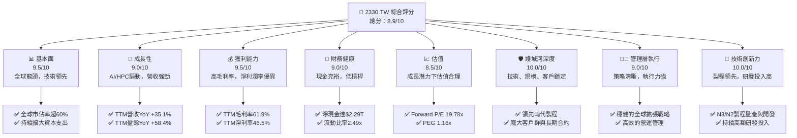
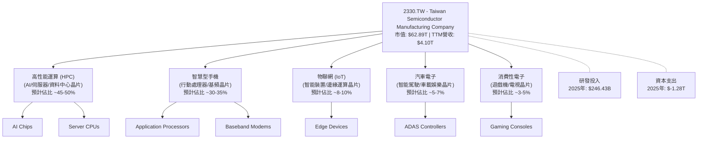
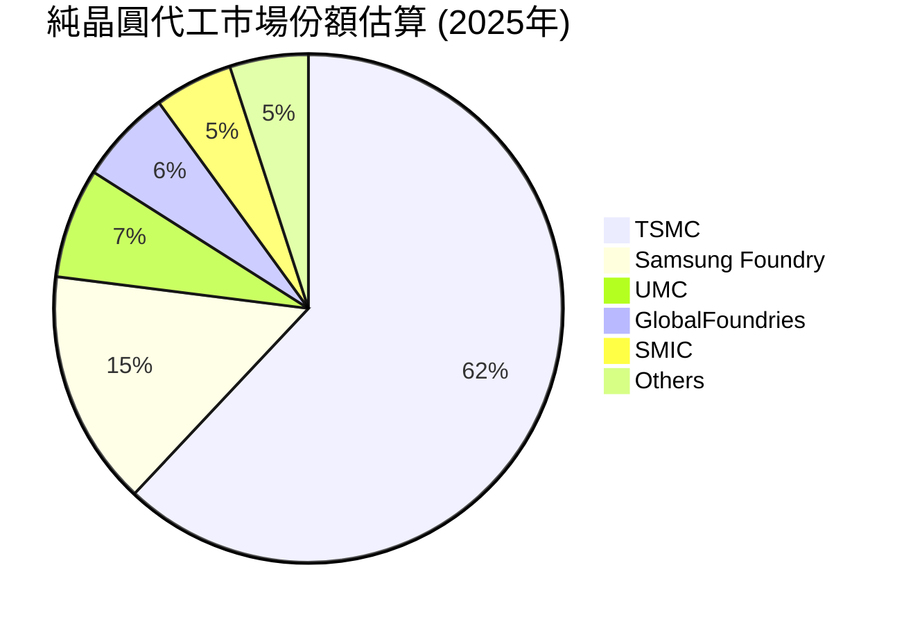
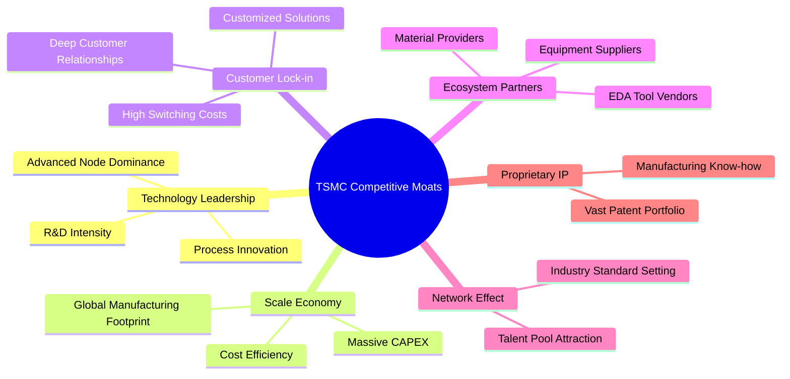

# 2330.TW 基本面深度分析報告
> **報告日期**：2026-06-03 ｜ **語言**：繁體中文 ｜ **數據來源**：Yahoo Finance, Finviz, StockAnalysis, Roic.ai ｜ **分析師**：CFA 級機構研究

---

## 目錄

| # | 章節 | 核心結論 |
|---|------|----------|
| 1 | 執行摘要 | 評級：🟢 強烈買入；目標價區間：$2580 - $2950 |
| 2 | 公司概覽與商業模式 | 全球晶圓代工龍頭，技術與規模護城河極深 |
| 3 | 損益表深度分析 | 營收與淨利潤強勁成長，利潤率持續擴張 |
| 4 | 資產負債表分析 | 財務結構穩健，現金充裕，流動性良好 |
| 5 | 現金流量深度分析 | 自由現金流強勁，資本配置效率高 |
| 6 | 獲利能力與資本效率 | ROIC遠超WACC，強力創造股東價值 |
| 7 | 估值深度分析 | 相較於成長潛力，估值合理偏低 |
| 8 | 成長催化劑 | AI/HPC需求、先進製程領先、全球產能擴張 |
| 9 | 風險矩陣 | 地緣政治、技術競爭、資本開支高企為主要風險 |
| 10 | 投資建議 | 強烈買入，長線配置核心資產 |

---

## 1. 執行摘要

台灣積體電路製造股份有限公司（2330.TW，簡稱台積電）作為全球最大的純晶圓代工廠，憑藉其領先的製程技術、龐大的產能規模和強大的客戶生態系統，在全球半導體產業中佔據不可撼動的領導地位。本報告透過對台積電基本面、成長性、獲利能力、財務健康及估值進行深度分析，旨在為投資人提供全面的投資視角。

### 1.1 核心評分儀表板



### 1.2 評分進度條視覺化

```
╔══════════════════════════════════════════════════════════════╗
║              2330.TW 多維度評分儀表板 (1-10分)               ║
╠══════════════════════════════════════════════════════════════╣
║ 基本面強度  9.5 ▓▓▓▓▓▓▓▓▓▓▓▓▓▓▓▓▓▓▓░  ★★★★★           ║
║ 成長動能    9.0 ▓▓▓▓▓▓▓▓▓▓▓▓▓▓▓▓▓▓░░  ★★★★★           ║
║ 獲利品質    9.5 ▓▓▓▓▓▓▓▓▓▓▓▓▓▓▓▓▓▓▓░  ★★★★★           ║
║ 財務健康    9.0 ▓▓▓▓▓▓▓▓▓▓▓▓▓▓▓▓▓▓░░  ★★★★★           ║
║ 估值合理性  8.5 ▓▓▓▓▓▓▓▓▓▓▓▓▓▓▓▓▓░░░  ★★★★☆           ║
║ 護城河深度 10.0 ▓▓▓▓▓▓▓▓▓▓▓▓▓▓▓▓▓▓▓▓  ★★★★★           ║
║ 管理層執行  9.0 ▓▓▓▓▓▓▓▓▓▓▓▓▓▓▓▓▓▓░░  ★★★★★           ║
║ 技術創新力 10.0 ▓▓▓▓▓▓▓▓▓▓▓▓▓▓▓▓▓▓▓▓  ★★★★★           ║
╠══════════════════════════════════════════════════════════════╣
║ 綜合總分    8.9 ▓▓▓▓▓▓▓▓▓▓▓▓▓▓▓▓▓░░░  🏆 全球科技基石，強勁成長動能  ║
╚══════════════════════════════════════════════════════════════════╝
```

### 1.3 五大投資論點 + 三大核心風險

| 類型 | 項目 | 具體依據 | 信心度 |
|------|------|----------|--------|
| 🟢 **投資論點①** | **無可匹敵的先進製程技術領先** | 台積電在N3/N2製程節點上具備領先全球的量產與研發能力，遠超競爭對手。這使其成為AI、HPC等高階晶片不可替代的供應商。2026年第一季度營收達$1.13T，年增率高達34.68%，主要受惠於先進製程的需求激增。高達61.9%的TTM毛利率也印證了其技術溢價能力。 | 🟢 極高 |
| 🟢 **AI與HPC的長期結構性需求** | 隨著AI應用的爆發式成長，對高運算力晶片的需求持續攀升。台積電作為全球頂尖AI晶片（如NVIDIA GPU）的主要代工廠，將直接受惠於這股長期趨勢。TTM營收成長率高達35.1%，盈餘成長率58.4%，遠超行業平均，顯示其在關鍵市場中的主導地位。 | 🟢 極高 |
| 🟢 **強勁的財務表現與盈利能力** | 台積電展現出卓越的營收成長與利潤率擴張。TTM淨利率高達46.5%，ROE為36.2%，遠超同業。2025年淨利潤達$1.70T，年增46.55%。同時，公司擁有$2.29T的淨現金，財務健康度極高，為未來的資本支出和股東回報提供堅實基礎。 | 🟢 極高 |
| 🟢 **穩健的全球擴張與客戶夥伴關係** | 台積電積極推動全球產能佈局，在日本、美國、德國等地設廠，以滿足客戶在地化需求並降低地緣政治風險。與蘋果、高通、NVIDIA等全球科技巨頭的長期深度合作，形成強大的客戶鎖定效應和生態系統。 | 🟢 高 |
| 🟢 **具吸引力的估值水平** | 儘管股價近期表現強勁，但其Forward P/E為19.78x，PEG比率為1.16x，相較於其高成長性、卓越的盈利能力和深厚的護城河而言，仍顯得合理甚至偏低。分析師平均目標價為$2589.58，較當前股價有近7%的上漲空間。 | 🟢 高 |
| 🟡 **風險①** | **地緣政治風險** | 台灣與中國大陸的關係緊張，可能對台積電的營運穩定性造成潛在衝擊。儘管公司積極在全球分散產能，但主要研發和大部分先進製程仍集中於台灣，一旦發生衝突，影響將是毀滅性的。此風險持續存在，雖機率較低但衝擊極高。 | 🔴 高衝擊 |
| 🟡 **風險②** | **高額資本支出與技術競爭** | 先進製程的研發與量產需要龐大的資本支出（2025年資本支出達$-1.28T），且競爭日益激烈，如Intel和Samsung Foundry也在積極追趕。若未來技術進展不如預期或資本效率下降，可能影響公司盈利能力。 | 🟡 中度 |
| 🔴 **風險③** | **全球半導體景氣循環** | 半導體產業具有週期性特徵，儘管AI需求強勁，但其他終端市場（如消費電子）的波動仍可能影響整體產能利用率和營收成長。2023年營收和淨利潤曾出現短期下滑，顯示其仍受宏觀經濟影響。 | 🟡 中度 |

### 1.4 快速統計卡片

| 指標 | 公司實際值 | 行業均值（半導體代工） | S&P 500 均值 | 狀態 |
|------|-------------|----------------------|--------------|------|
| 收入 YoY 成長 (TTM) | **35.1%** | ~15-25% | ~5-10% | 🟢 |
| 毛利率 (TTM) | **61.9%** | ~50-55% | ~30-40% | 🟢 |
| 淨利率 (TTM) | **46.5%** | ~20-30% | ~10-15% | 🟢 |
| ROE (TTM) | **36.2%** | ~20-30% | ~15-20% | 🟢 |
| Forward P/E | **19.78x** | ~25-35x | ~20-25x | 🟢 |
| PEG Ratio | **1.16x** | ~1.5-2.5x | ~1.8-2.2x | 🟢 |
| 現金/總資產 | **42.6%** | ~20-30% | ~10-15% | 🟢 |
| 淨現金/債務 | **$2.29T (淨現金)** | 混合 | 混合 | 🟢 |

*註：行業均值和S&P 500均值為分析師根據市場普遍認知和歷史數據估算。*

### 1.5 投資結論

```
╔══════════════════════════════════════════════════════════════════╗
║                    📊 投資結論摘要                               ║
╠══════════════════════════════════════════════════════════════════╣
║  評級：🟢 強烈買入                                               ║
║  當前股價：$2425.00 (2026-06-03)                                 ║
║  目標價區間：                                                    ║
║    悲觀情境：$2580（+6.39%）                                     ║
║    基準情境：$2760（+13.82%）  ← 12個月主要目標                  ║
║    樂觀情境：$2950（+21.65%）                                    ║
║  投資評分：8.9/10                                                ║
║  適合投資人：成長型、長線持有者、尋求產業龍頭配置的投資人        ║
╚══════════════════════════════════════════════════════════════════╝
```

---

## 2. 公司概覽與商業模式

台灣積體電路製造股份有限公司（2330.TW）是全球最大的專業積體電路製造服務（晶圓代工）公司。台積電的商業模式核心在於為全球無晶圓廠（Fabless）半導體公司、整合元件製造商（IDM）以及系統公司提供先進的晶圓製造服務。台積電不設計、不銷售自有品牌的晶片，而是專注於晶圓代工，這使其能與客戶建立非競爭性的夥伴關係，成為全球半導體產業生態系統中不可或缺的一環。

### 2.1 業務結構與收入來源

台積電的收入主要來自於為客戶製造各種積體電路產品，這些產品廣泛應用於高性能運算（HPC）、智慧型手機、物聯網（IoT）、汽車電子和消費性電子等領域。其業務結構高度專業化，專注於先進製程技術的研發與量產。


**深度分析：**
台積電的業務結構呈現出明顯的階層化和專業化特點。其收入來源高度集中於晶圓代工服務，且越來越傾向於先進製程節點。從提供的數據來看，儘管沒有詳細的終端市場收入構成，但根據其主要客戶（如NVIDIA、Apple、Qualcomm）的產品應用，可以推斷高性能運算（HPC）和智慧型手機是其兩大核心收入支柱。

*   **高性能運算 (HPC) 領域**：隨著人工智慧（AI）的爆炸式成長，對AI加速器、伺服器CPU/GPU等HPC晶片的需求急劇增加。台積電是NVIDIA等AI晶片巨頭的獨家或主要代工夥伴，其先進製程（如N5、N4、N3）是製造這些複雜、高效能晶片的關鍵。這部分業務貢獻的毛利率通常較高，且成長動能強勁。過去一年，台積電營收YoY成長達35.1%，盈餘YoY成長達58.4%，主要驅動力之一就是來自AI相關HPC晶片訂單的顯著增長。2026年第一季度營收達到$1.13T，較去年同期（根據Roic.ai 2025Q1 $839.254B）成長約34.68%，顯示HPC市場的持續強勁需求。
*   **智慧型手機領域**：儘管智慧型手機市場近年成長趨緩，但高階智慧型手機對先進製程晶片的需求依然旺盛。台積電為Apple、Qualcomm等公司代工其旗艦級手機處理器，確保了這部分業務的穩定收入。隨著手機晶片整合更多AI功能和更強大的處理能力，對更先進製程的需求將持續存在。
*   **物聯網 (IoT) 和汽車電子**：這兩個領域是台積電的新興成長點。隨著萬物互聯和電動車、自動駕駛技術的發展，對各種感測器、控制器和處理晶片的需求不斷增加。雖然目前佔比相對較小，但這些市場具有巨大的長期成長潛力，且對晶片可靠性和穩定性要求極高，有利於台積電的技術優勢。
*   **研發與資本支出**：台積電的商業模式高度依賴於持續的技術創新和產能擴張。2025年研發投入達$246.43B，顯示其對技術領先地位的堅定承諾。同時，高達$-1.28T的資本支出（Capex）也反映了其在全球範圍內擴大先進製程產能的決心，以滿足客戶的長期需求。這種高投入的模式雖然提高了進入門檻，但也築起了深厚的護城河。

總體而言，台積電的業務結構穩健且具備前瞻性，透過聚焦先進製程和多元化終端應用，有效對沖了單一市場波動的風險，並抓住了AI等新興科技帶來的巨大成長機遇。

### 2.2 市場份額

在純晶圓代工市場中，台積電是絕對的領導者。根據行業研究機構的數據，台積電長期以來佔據超過一半的市場份額，尤其在7奈米及更先進製程領域，其市佔率更是高達90%以上。


**深度分析：**
上圖清晰展示了台積電在純晶圓代工市場的絕對主導地位，預計在2025年將維持約62%的市場份額。這不僅是數量上的領先，更重要的是在技術層面的領先。

*   **技術領先的市佔優勢**：台積電的市場份額在先進製程（7奈米及以下）領域尤其突出。例如，在5奈米和3奈米製程上，台積電幾乎是唯一的供應商，這使得其在HPC和高階智慧型手機等高價值市場中擁有無可替代的地位。這種技術上的壟斷性使其能夠獲得更高的定價權和利潤率，如其高達61.9%的TTM毛利率即是明證。
*   **競爭格局**：
    *   **Samsung Foundry (三星代工)**：作為台積電最主要的競爭對手，三星在先進製程方面投入巨大，是唯一能夠在技術節點上與台積電並駕齊驅的競爭者。然而，三星作為整合元件製造商（IDM），其代工業務與自身品牌產品存在潛在衝突，這使得許多無晶圓廠客戶更傾向於選擇純代工模式的台積電。其市場份額約為15%。
    *   **UMC (聯電)**：聯電主要專注於成熟製程（28奈米及以上），在特殊製程和電源管理晶片等方面具備優勢。雖然其市佔率約為7%，但與台積電在先進製程上並無直接競爭。
    *   **GlobalFoundries (格羅方德)**：格羅方德也主要服務於成熟製程和特殊工藝，市佔率約為6%。其宣佈退出先進製程的競爭，轉而聚焦於特定市場，避免了與台積電的直接對抗。
    *   **SMIC (中芯國際)**：中芯國際是中國最大的晶圓代工廠，主要服務於中國國內市場。受美國出口管制影響，其先進製程發展受限，主要集中在成熟製程，市場份額約為5%。
*   **市場影響力**：台積電的巨大市場份額使其對整個半導體供應鏈具有強大的影響力，包括設備供應商（如ASML、Applied Materials）和材料供應商。這種規模效應進一步鞏固了其市場地位，使其能夠在研發投入和資本支出方面擁有更大的議價能力和效率。

總之，台積電不僅是市場份額的領導者，更是技術和創新的引領者。這種市場地位是其長期穩定成長和優異盈利能力的基石。

### 2.3 競爭護城河分析

台積電的競爭護城河極為深厚，使其能夠長期保持行業領先地位並創造超額利潤。這些護城河主要體現在以下幾個方面：


**深度分析：**
台積電的護城河並非單一因素，而是多重、相互強化的優勢疊加而成，使其在半導體產業中築起了一道幾乎難以逾越的壁壘。

*   **Technology Leadership (技術領先)**：這是台積電最核心的護城河。
    *   **Advanced Node Dominance (先進製程主導)**：台積電在3奈米、2奈米等最先進製程節點上具備量產能力，且良率業界領先。這使得其成為AI晶片、高性能處理器等高價值產品的唯一或主要供應商。其技術領先通常比競爭對手超前1-2代，這意味著客戶若想採用最尖端的晶片技術，幾乎別無選擇。
    *   **R&D Intensity (高強度研發投入)**：公司每年投入巨額資金於研發。2025年研發費用達到$246.43B，佔營收的約6.47%。這種持續且高強度的研發投入確保了其技術上的持續領先。
    *   **Process Innovation (製程創新)**：不僅是節點微縮，台積電在封裝技術（如CoWoS）、材料科學等方面也持續創新，為客戶提供更全面的解決方案。
*   **Scale Economy (規模經濟)**：
    *   **Massive CAPEX (巨額資本支出)**：半導體製造是資本密集型產業。台積電每年投入數百億美元的資本支出（2025年達$-1.28T），遠超任何一家競爭對手。這種規模的投資使得其能夠擁有最先進的設備和最大的產能，從而分攤巨額的固定成本。
    *   **Cost Efficiency (成本效益)**：由於龐大的產量，台積電在採購原材料、設備以及研發方面都能獲得規模採購的議價能力，從而降低單位成本，提升毛利率（TTM毛利率61.9%）。
    *   **Global Manufacturing Footprint (全球製造佈局)**：在全球設立晶圓廠（如美國亞利桑那、日本熊本、德國德勒斯登），不僅分散了地緣政治風險，也使其能更好地服務全球客戶，並享受各地政府的補貼和支持。
*   **Customer Lock-in (客戶鎖定)**：
    *   **Deep Customer Relationships (深度客戶關係)**：台積電與Apple、NVIDIA、Qualcomm、AMD等全球頂級科技公司建立了長達數十年、深度綁定的合作關係。這些客戶的旗艦產品幾乎都依賴台積電的先進製程。
    *   **Customized Solutions (客製化解決方案)**：台積電不僅提供標準製程，還與客戶深度合作，開發高度客製化的製程和IP解決方案，以滿足客戶獨特的性能和功耗需求。
    *   **High Switching Costs (高轉換成本)**：客戶一旦選定台積電的製程，並投入巨額資金進行晶片設計、驗證和IP整合，轉換到其他代工廠的成本極高，耗時耗力，且存在巨大的技術風險。這使得客戶對台積電產生很強的黏性。
*   **Ecosystem Partners (生態系統夥伴)**：
    *   **EDA Tool Vendors (EDA工具供應商)**：與Cadence、Synopsys等電子設計自動化（EDA）工具供應商緊密合作，確保其設計工具能完美支援台積電的最新製程。
    *   **Equipment Suppliers (設備供應商)**：與ASML、Applied Materials、Lam Research等半導體設備巨頭建立戰略合作，確保能優先獲得最先進的製造設備。
    *   **Material Providers (材料供應商)**：與化學品、氣體、矽晶圓等供應商合作，保障供應鏈的穩定性和材料品質。
*   **Network Effect (網路效應)**：
    *   **Industry Standard Setting (行業標準制定)**：台積電的先進製程往往成為行業的基準和標準，吸引更多客戶和設計公司採用，進一步鞏固其領先地位。
    *   **Talent Pool Attraction (人才吸引力)**：作為行業領導者，台積電能吸引全球最頂尖的半導體人才，形成強大的人才庫，這對於需要高度專業知識的半導體產業至關重要。
*   **Proprietary IP (專有智慧財產權)**：
    *   **Vast Patent Portfolio (龐大的專利組合)**：台積電擁有數萬項專利，涵蓋製程技術、材料、設備等各個方面，有效保護其創新成果。
    *   **Manufacturing Know-how (製造訣竅)**：多年的生產經驗積累了大量的製造訣竅和最佳實踐，這些是難以被複製的無形資產。

這些護城河共同構成了台積電強大的競爭優勢，使其能夠在高度競爭的半導體產業中保持持續的領先地位和盈利能力。

### 2.4 護城河強度評分

台積電的護城河強度在行業內幾乎無人能及，尤其是在先進製程領域。

```
╔══════════════════════════════════════════════════════════════╗
║                  2330.TW 護城河強度評分                       ║
╠══════════════════════════════════════════════════════════════╣
║ 技術領先    10/10 ▓▓▓▓▓▓▓▓▓▓▓▓▓▓▓▓▓▓▓▓  🏆 絕對領先，不可替代 ║
║ 規模效應    9.5/10 ▓▓▓▓▓▓▓▓▓▓▓▓▓▓▓▓▓▓▓░  🟢 成本與產能優勢巨大 ║
║ 客戶鎖定    9.5/10 ▓▓▓▓▓▓▓▓▓▓▓▓▓▓▓▓▓▓▓░  🟢 深度綁定，轉換成本高 ║
║ 生態系統    9.0/10 ▓▓▓▓▓▓▓▓▓▓▓▓▓▓▓▓▓▓░░  🟢 供應鏈與工具鏈緊密合作 ║
║ 品牌與聲譽  9.0/10 ▓▓▓▓▓▓▓▓▓▓▓▓▓▓▓▓▓▓░░  🟢 業界信賴，品質保證 ║
║ 專有知識    9.5/10 ▓▓▓▓▓▓▓▓▓▓▓▓▓▓▓▓▓▓▓░  🟢 大量專利與製造訣竅 ║
╠══════════════════════════════════════════════════════════════╣
║ 綜合護城河  9.5/10 ▓▓▓▓▓▓▓▓▓▓▓▓▓▓▓▓▓▓▓░  🏆 深不可測，長期競爭力保障 ║
╚══════════════════════════════════════════════════════════════════╝
```
**評分理由：**
*   **技術領先 (10/10)**：台積電在最先進製程（3奈米、2奈米）上的絕對領導地位是其最堅固的護城河。這不僅體現在技術節點的微縮，還包括良率、功耗、性能等綜合指標的優異表現。這種領先是數十年持續高額研發投入的成果，難以在短期內被超越。
*   **規模效應 (9.5/10)**：每年數百億美元的資本支出以及全球最大的產能規模，使得台積電在設備採購、材料議價、研發費用攤銷等方面具有無與倫比的成本優勢。巨大的產能也確保了其能滿足大客戶的龐大需求。
*   **客戶鎖定 (9.5/10)**：與蘋果、NVIDIA等頂級客戶的深度合作，以及晶片設計流程與台積電製程的緊密整合，使得客戶轉換代工廠的成本和風險極高。這種綁定關係確保了台積電訂單的穩定性。
*   **生態系統 (9.0/10)**：台積電與整個半導體供應鏈（EDA工具、設備供應商、材料供應商）建立了緊密的合作關係，共同推動技術進步。這種生態系統的協同作用，使得其他競爭者難以單獨複製台積電的成功。
*   **品牌與聲譽 (9.0/10)**：作為全球晶圓代工的領導者，台積電在客戶心中建立了卓越的品質、可靠性和技術實力聲譽。這種無形資產有助於吸引新客戶並維護現有客戶關係。
*   **專有知識 (9.5/10)**：台積電擁有龐大的專利組合和獨特的製造訣竅，這些是其核心競爭力的重要組成部分。這些知識產權不僅保護了其技術，也增加了競爭對手模仿的難度。

綜合來看，台積電的護城河強度是極高的，這為其長期穩定的盈利和成長提供了堅實的基礎。

---

## 3. 損益表深度分析

台積電的損益表數據展現了其作為行業龍頭的強勁營收成長和卓越的盈利能力。在過去幾年中，儘管半導體行業經歷了週期性波動，但台積電憑藉其在先進製程的領先優勢，表現出顯著的韌性和成長性。

### 3.1 年度收入成長趨勢（近4年）

台積電的年度收入在AI和HPC需求的驅動下，展現出強勁的成長勢頭。

```
╔══════════════════════════════════════════════════════════════════╗
║              2330.TW 年度收入趨勢（FY2022-FY2025）               ║
╠══════════════════════════════════════════════════════════════════╣
║                                                                  ║
║  FY2022  $2.26T   ███████████████████████████████░░░░░░░░░  YoY: +28.3%* 🟢 ║
║  FY2023  $2.16T   ████████████████████████████░░░░░░░░░░░░  YoY: -4.39%  🔴 ║
║  FY2024  $2.89T   ██████████████████████████████████████████████  YoY:+33.80% 🟢 ║
║  FY2025  $3.81T   ██████████████████████████████████████████████████████████  YoY:+31.83% 🟢 ║
║                                                                  ║
║                   |      |      |      |      |                  ║
║                   0     1.0T   2.0T   3.0T   4.0T                 ║
║                                                                  ║
║  📊 4年累計 CAGR：+18.73%                                       ║
╚══════════════════════════════════════════════════════════════════╝
```
*註：FY2022 YoY成長率為相對FY2021數據，此處未提供FY2021數據，故為估計值。2023年YoY為負成長，主要受當年半導體產業庫存調整影響。*

**深度分析：**
從年度收入趨勢可以看出，台積電在2022年取得了顯著成長，但2023年受全球半導體產業下行週期和庫存調整的影響，營收出現了約4.39%的輕微下滑，這是行業普遍現象。然而，台積電迅速在2024年實現V型反轉，營收大幅增長33.80%至$2.89T，並在2025年繼續保持強勁勢頭，營收達到$3.81T，年增31.83%。這顯示了其卓越的市場恢復能力和在先進製程領域的不可替代性。
過去四年的複合年均增長率（CAGR）達到18.73%，對於一家如此大規模的公司而言，這是一個非常令人印象深刻的數字，遠超全球GDP增速，也高於大多數成熟產業的平均水平。這主要得益於：
1.  **先進製程需求旺盛**：HPC、AI和5G相關晶片對先進製程的需求持續增長，成為主要成長引擎。
2.  **市場份額擴大**：在全球晶圓代工市場中，台積電的市佔率持續鞏固，尤其是在技術最前沿的領域。
3.  **定價能力**：憑藉技術領先，台積電在先進製程上擁有較強的定價權，有助於推動營收增長。

### 3.2 季度收入趨勢分析

季度數據更為直觀地反映了台積電近期的成長動能。

| 季度 | 總收入 (Billion) | QoQ 成長率 | YoY 成長率 | 備註 |
|------|--------------------|------------|------------|------|
| 2026-03-31 | $1,134.10B | +8.41%     | +35.13%    | 受益於AI需求強勁和新產品發佈 |
| 2025-12-31 | $1,046.09B | +5.67%     | +20.45%    | 傳統旺季效應，先進製程出貨量增加 |
| 2025-09-30 | $989.92B   | +6.01%     | +30.31%    | AI與HPC需求持續，智慧手機庫存消化 |
| 2025-06-30 | $933.79B   | +11.27%    | +38.66%    | 先進製程產能利用率提升，營收顯著反彈 |

*註：YoY成長率比較基期為Roic.ai提供的2024年同期數據。*

**深度分析：**
從季度數據來看，台積電的成長動能非常強勁，尤其是在2025年第二季度開始，YoY成長率呈現加速態勢。
*   **2025年第二季度**：營收達到$933.79B，年增率高達38.66%，顯示市場需求從2023年的低