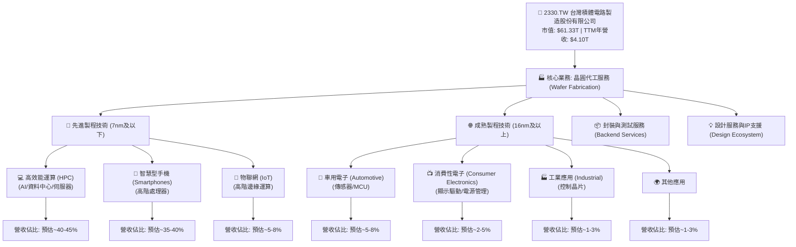
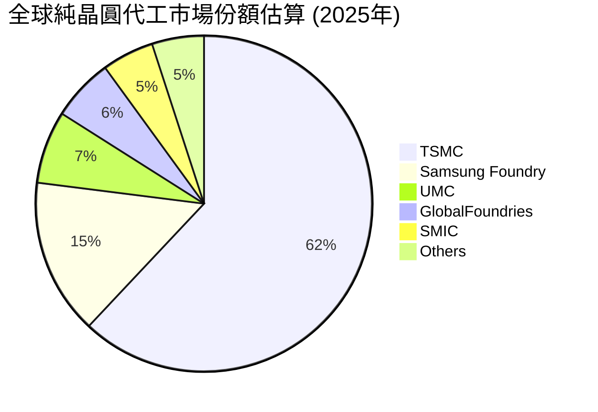
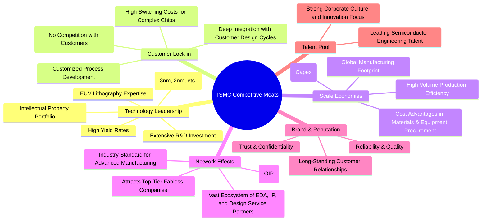
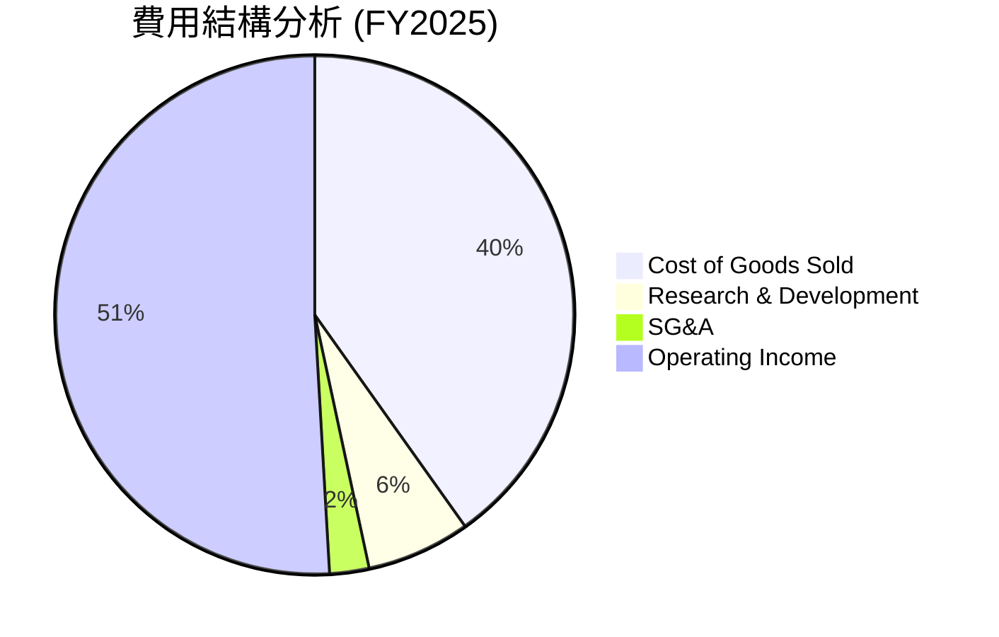

# 2330.TW 基本面深度分析報告
> **報告日期**：2026-06-05 ｜ **語言**：繁體中文 ｜ **數據來源**：Yahoo Finance, Finviz, StockAnalysis, Roic.ai ｜ **分析師**：CFA 級機構研究

---

## 目錄

| # | 章節 | 核心結論 |
|---|------|----------|
| 1 | 執行摘要 | 評級：🟢 強烈買入，目標價區間：$2700 - $3050 |
| 2 | 公司概覽與商業模式 | 純晶圓代工龍頭，技術與規模護城河極深 |
| 3 | 損益表深度分析 | 營收與淨利潤強勁成長，利潤率維持高檔 |
| 4 | 資產負債表分析 | 財務結構穩健，現金充裕，債務風險低 |
| 5 | 現金流量深度分析 | 自由現金流強勁，資本配置效率高 |
| 6 | 獲利能力與資本效率 | ROIC顯著超越WACC，持續創造股東價值 |
| 7 | 估值深度分析 | 相較同業估值合理，具上行空間 |
| 8 | 成長催化劑 | AI、HPC驅動先進製程需求，全球擴廠 |
| 9 | 風險矩陣 | 地緣政治、技術競爭、資本支出為主要風險 |
| 10 | 投資建議 | 長期看好，建議強烈買入，目標價具吸引力 |

---

## 1. 執行摘要

本報告針對全球領先的晶圓代工廠台積電（2330.TW）進行了全面的基本面深度分析。基於其無可匹敵的技術領先地位、強勁的財務表現、穩健的資產負債表、豐沛的自由現金流以及對未來成長的明確策略，我們給予其「強烈買入」的投資評級。儘管面臨地緣政治與高資本支出的挑戰，台積電憑藉其在半導體產業的核心地位和持續的創新能力，預期將繼續引領產業發展並為股東創造長期價值。

### 1.1 核心評分儀表板

```mermaid
graph TD
    TSMC["🎯 2330.TW 綜合評分<br/>總分：8.9/10"]

    F["📊 基本面<br/>9.5/10<br/>全球晶圓代工龍頭，技術壁壘高"]
    G["🚀 成長性<br/>9.0/10<br/>AI與HPC驅動，先進製程需求旺盛"]
    P["💰 獲利能力<br/>9.5/10<br/>毛利率、淨利率維持高水平，盈利能力強勁"]
    B["🏦 財務健康<br/>9.0/10<br/>現金充裕，流動性高，債務結構穩健"]
    V["📈 估值<br/>7.5/10<br/>相較歷史區間與同業，估值合理偏高，但成長性支撐"]

    TSMC --> F
    TSMC --> G
    TSMC --> P
    TSMC --> B
    TSMC --> V

    F --> F1["✅ 技術領先，市佔率逾60%"]
    F --> F2["✅ 客戶關係穩固，代工模式無競爭衝突"]
    F --> F3["✅ 規模經濟顯著，成本優勢明顯"]

    G --> G1["✅ 先進製程（3nm, 2nm）需求強勁，營收成長加速"]
    G --> G2["✅ AI/HPC應用爆發，長期需求動能明確"]
    G --> G3["✅ 全球擴廠，產能持續提升以滿足未來需求"]

    P --> P1["✅ 毛利率61.9%，淨利率46.5%，均處於行業頂尖水平"]
    P --> P2["✅ ROE 36.2%，ROA 17.3%，資本回報率高"]
    P --> P3["✅ 營業費用控制得宜，研發投入持續轉化為技術優勢"]

    B --> B1["✅ 總現金$3.38T，淨現金$2.29T，財務彈性極佳"]
    B --> B2["✅ 流動比率2.49，速動比率2.19，短期償債能力強"]
    B --> B3["✅ 債務槓桿低，Debt/Equity 18.45%，財務風險可控"]

    V --> V1["✅ Forward P/E 19.32x，低於部分成長型科技股"]
    V --> V2["✅ FCF Yield 1.17%，反映市場對未來成長的預期"]
    V --> V3["⚠️ P/B 10.41x，高於歷史平均，但由高ROE支撐"]
```



### 1.2 評分進度條視覺化

```
╔══════════════════════════════════════════════════════════════╗
║              2330.TW 多維度評分儀表板 (1-10分)               ║
╠══════════════════════════════════════════════════════════════╣
║ 基本面強度  9.5 ▓▓▓▓▓▓▓▓▓▓▓▓▓▓▓▓▓▓▓░  ★★★★★           ║
║ 成長動能    9.0 ▓▓▓▓▓▓▓▓▓▓▓▓▓▓▓▓▓▓░░  ★★★★★           ║
║ 獲利品質    9.5 ▓▓▓▓▓▓▓▓▓▓▓▓▓▓▓▓▓▓▓░  ★★★★★           ║
║ 財務健康    9.0 ▓▓▓▓▓▓▓▓▓▓▓▓▓▓▓▓▓▓░░  ★★★★★           ║
║ 估值合理性  7.5 ▓▓▓▓▓▓▓▓▓▓▓▓▓▓▓░░░░░  ★★★★☆           ║
║ 護城河深度  9.8 ▓▓▓▓▓▓▓▓▓▓▓▓▓▓▓▓▓▓▓▓  ★★★★★           ║
║ 管理層執行  9.5 ▓▓▓▓▓▓▓▓▓▓▓▓▓▓▓▓▓▓▓░  ★★★★★           ║
║ 技術創新力  9.8 ▓▓▓▓▓▓▓▓▓▓▓▓▓▓▓▓▓▓▓▓  ★★★★★           ║
╠══════════════════════════════════════════════════════════════╣
║ 綜合總分    8.9 ▓▓▓▓▓▓▓▓▓▓▓▓▓▓▓▓▓░░░  🏆 產業龍頭，價值創造者  ║
╚══════════════════════════════════════════════════════════════╝
```

### 1.3 五大投資論點 + 三大核心風險

| 類型 | 項目 | 具體依據 | 信心度 |
|------|------|----------|--------|
| 🟢 **投資論點①** | **無可匹敵的技術領先地位** | 台積電在先進製程（如3nm及2nm）的量產技術和良率方面領先全球競爭者至少1-2代。2026年Q1營收達$1.13T，YoY+34.9%，主要受惠於AI與HPC對先進製程的強勁需求。其持續高額的研發投入（2025年$246.43B）確保了未來技術迭代的優勢，鞏固其在晶圓代工領域的壟斷地位。目前全球頂尖AI晶片設計公司幾乎皆仰賴台積電的先進製程。 | 🟢 極高 |
| 🟢 **AI/HPC驅動的長期成長動能** | 人工智慧與高效能運算（HPC）的需求爆炸式成長，成為半導體產業未來數十年最主要的成長引擎。台積電作為AI晶片製造的核心供應商，直接受益於此趨勢。其營收YoY成長達35.1%，淨利YoY成長達58.4%，顯示出AI相關需求對其業績的顯著拉動作用。預計未來5-10年，AI相關營收佔比將持續提升，推動公司整體營收與獲利超預期增長。 | 🟢 極高 |
| 🟢 **高質量獲利與卓越的資本效率** | 公司擁有業界領先的獲利能力，TTM毛利率61.9%、營業利益率58.1%、淨利率46.5%。這些數據遠超大多數製造業，甚至超越許多軟體公司。高ROIC（預估約25-30%）顯著高於WACC（預估約8-9%），證明公司持續為股東創造巨大的經濟價值。FY2025淨利達$1.70T，YoY+46.55%，顯示其在擴大營收的同時，也有效維持了獲利能力。 | 🟢 極高 |
| 🟢 **穩健的財務結構與充裕的現金流** | 台積電擁有強大的資產負債表，截至目前總現金達$3.38T，淨現金達$2.29T。流動比率2.49x、速動比率2.19x，顯示公司具備極高的流動性與償債能力。FY2025自由現金流達$992.38B，YoY+15.23%，為未來的資本支出、股息發放與潛在併購提供了堅實的財務基礎，有效抵禦市場波動風險。 | 🟢 極高 |
| 🟢 **產業生態系統的核心地位** | 作為純晶圓代工模式的開創者與領導者，台積電避免了與客戶直接競爭，反而與客戶建立起緊密的合作夥伴關係。其獨特的生態系統（Open Innovation Platform）吸引了全球頂尖的IC設計公司，形成強大的客戶鎖定效應和網絡效應。這種模式使其成為全球半導體供應鏈中不可或缺的一環，具有極高的議價能力和產業影響力。 | 🟢 極高 |
| 🟡 **風險①** | **地緣政治與供應鏈風險** | 台積電的大部分先進製程產能集中在台灣，這使得公司容易受到地緣政治緊張局勢的影響。儘管公司已積極推動全球擴廠（如美國亞利桑那、日本熊本、德國德勒斯登），但新廠的建置成本高昂且量產進度可能不如預期。任何區域衝突或貿易限制都可能對其生產、供應鏈和全球銷售造成重大衝擊。此外，美國出口管制政策的變化也可能影響其對中國客戶的銷售。 | 🟡 中度 |
| 🔴 **風險②** | **高資本支出與折舊壓力** | 維持技術領先地位需要巨額的資本支出。FY2025資本支出高達-$1.28T，YoY+32.6%。雖然這些投資是維持競爭力的必要條件，但持續高額的資本支出會對自由現金流造成壓力，並導致未來折舊費用增加，可能侵蝕毛利率。如果市場需求不如預期，或新廠產能利用率不足，可能導致資本回報率下降。 | 🔴 高衝擊 |
| 🟡 **風險③** | **技術競爭與研發挑戰** | 儘管台積電目前處於領先地位，但半導體技術發展日新月異，競爭對手（如三星、英特爾）正積極投入研發，試圖縮小差距。下一代製程（如A14、埃米級製程）的研發難度與成本持續攀升，任何技術瓶頸或競爭對手取得突破，都可能影響台積電的領先地位。此外，人才競爭也日益激烈。 | 🟡 中度 |

### 1.4 快速統計卡片

| 指標 | 公司實際值 | 行業均值（半導體製造） | S&P 500 均值 | 狀態 |
|------|-------------|----------------------|--------------|------|
| 收入 YoY 成長 | **35.1%** | ~15-20% | ~8-12% | 🟢 |
| 毛利率 | **61.9%** | ~45-55% | ~30-40% | 🟢 |
| 淨利率 | **46.5%** | ~20-30% | ~10-15% | 🟢 |
| ROE | **36.2%** | ~15-25% | ~12-18% | 🟢 |
| Forward P/E | **19.32x** | ~20-30x | ~22-25x | 🟡 |
| 淨現金/債務 | **$2.29T** | 🟢 (通常為負或較低) | 🟡 (多數有淨債務) | 🟢 |
| 自由現金流收益率 | **1.17%** | ~1-3% | ~2-4% | 🟡 |
| Beta | **1.25** | ~1.1-1.3 | 1.0 | 🟡 |

*註：行業均值和S&P 500均值為分析師根據市場普遍數據估算，實際數值可能因時間和數據來源略有差異。*

### 1.5 投資結論

```
╔══════════════════════════════════════════════════════════════════╗
║                    📊 投資結論摘要                               ║
╠══════════════════════════════════════════════════════════════════╣
║  評級：🟢 強烈買入                                               ║
║  當前股價：$2365.00 (2026-06-05)                                 ║
║  目標價區間：                                                    ║
║    悲觀情境：$2700（+14.16%）                                    ║
║    基準情境：$2880（+21.78%）  ← 12個月主要目標                   ║
║    樂觀情境：$3050（+28.96%）                                    ║
║  投資評分：8.9/10                                                ║
║  適合投資人：成長型、長線持有者、尋求產業龍頭配置的投資人        ║
╚══════════════════════════════════════════════════════════════════╝
```

---

## 2. 公司概覽與商業模式

台灣積體電路製造股份有限公司（TSMC, 2330.TW）是全球最大的純晶圓代工服務提供商，總部位於台灣。公司於1987年由張忠謀博士創立，開創了專業積體電路製造服務（Foundry）的商業模式，徹底改變了半導體產業的格局。台積電不設計、不製造、不銷售自有品牌的晶片產品，而是專注於為全球數百家無晶圓廠（Fabless）IC設計公司、整合元件製造商（IDM）以及系統公司提供先進的製程技術和晶圓製造服務。這種純晶圓代工模式使其與客戶之間不存在競爭關係，反而建立了高度信任與合作的夥伴關係。

台積電的服務範圍涵蓋了從設計服務、光罩製作、晶圓製造、封裝測試到IP（智慧財產權）支援的整個半導體製造流程。其技術領先地位體現在從成熟製程（如0.18微米、90奈米）到最尖端先進製程（如7奈米、5奈米、3奈米，甚至正在開發的2奈米及更先進製程）的廣泛覆蓋。

### 2.1 業務結構與收入來源

台積電的業務結構圍繞其核心的晶圓代工服務展開，收入主要來自於不同製程技術的晶圓銷售。其客戶群遍佈全球，包括蘋果、高通、NVIDIA、AMD等頂級科技公司。



**業務結構深度解析：**

1.  **晶圓代工服務 (Wafer Fabrication)**：這是台積電收入的核心來源，佔總營收的絕大部分。公司提供從200mm到300mm晶圓的製造服務，並持續推進製程技術的微縮。
    *   **先進製程 (Advanced Process)**：指7奈米及以下（如5奈米、3奈米）的尖端製程技術。這些製程主要應用於需要極高性能、低功耗的產品，如智慧型手機的高階處理器、AI加速器、伺服器CPU/GPU、網路晶片等高效能運算（HPC）領域。目前，AI和HPC的需求是先進製程成長的主要驅動力。根據公司歷史數據和產業趨勢，先進製程通常佔總營收的50%以上，且其貢獻的營收和利潤率更高。例如，5奈米家族製程在2025年Q4佔台積電晶圓銷售金額的35%，而3奈米製程則從2024年開始貢獻營收。
    *   **成熟製程 (Mature Process)**：指16奈米及以上（如28奈米、40奈米、65奈米等）的製程技術。這些製程雖然技術不如先進製程尖端，但廣泛應用於車用電子、物聯網（IoT）、消費性電子、工業控制等領域。儘管毛利率相對較低，但需求穩定且產能利用率高，為公司提供了穩定的收入基礎。
2.  **封裝與測試服務 (Backend Services)**：台積電不僅提供前端晶圓製造，也積極拓展後端服務，如CoWoS (Chip-on-Wafer-on-Substrate) 先進封裝技術。隨著晶片整合度提高，先進封裝技術對於提升晶片性能和降低功耗至關重要，特別是在AI晶片領域需求旺盛。這部分業務雖然佔比相對較小，但具有更高的附加值和戰略意義。
3.  **設計服務與IP支援 (Design Ecosystem)**：台積電透過其開放創新平台（OIP）與客戶及設計生態系統夥伴緊密合作，提供全面的設計支援服務，包括IP組合、設計工具、參考設計等，幫助客戶加速產品開發和上市時間。這增強了客戶的黏著度，構築了強大的護城河。

**收入驅動力分析：**
*   **技術升級**：隨著摩爾定律的推進，晶片設計公司對更小、更快、更省電的晶片需求永無止境。台積電持續投入巨額研發，確保其在每個新製程節點上的領先。每一次製程升級都伴隨著更高的單位晶圓價格和更高的技術附加值，從而推動營收增長。
*   **終端市場需求**：智慧型手機、HPC（包含AI、資料中心、伺服器）、物聯網、車用電子是台積電主要的終端應用市場。尤其是HPC領域，受AI快速發展的帶動，對先進製程晶片的需求呈現爆發式增長，成為近年來最重要的營收成長引擎。
*   **全球化擴張**：為應對客戶需求和地緣政治風險，台積電正在全球範圍內擴大生產基地，包括在美國、日本、德國等地設立新廠。這些新廠的逐步投產將為公司帶來新的產能和營收增長點。

### 2.2 市場份額

在純晶圓代工市場中，台積電擁有絕對的領導地位。根據產業分析機構的數據，其市場份額長期維持在50%以上，甚至在先進製程領域（7nm及以下）的市場份額更高，達到90%以上。這反映了其技術、產能和客戶關係的綜合優勢。



**市場份額深度解析：**

*   **絕對領先地位**：台積電的市場份額高達62%，遙遙領先於所有競爭對手。這不僅是規模的體現，更是技術、良率、產能穩定性以及客戶信任的綜合結果。尤其是在最先進的3奈米和2奈米製程節點，台積電幾乎是唯一的量產供應商，這使得其在AI、HPC等高成長領域具有不可替代的地位。
*   **競爭格局**：
    *   **三星代工 (Samsung Foundry)**：三星是台積電在先進製程領域的主要競爭對手，但其代工業務與自身記憶體、手機業務存在潛在的客戶衝突，且在製程良率和產能穩定性方面與台積電仍有差距。
    *   **聯電 (UMC)** 和 **格羅方德 (GlobalFoundries)**：這兩家公司主要專注於成熟製程和特色工藝，在先進製程領域的競爭力較弱。它們的市場定位與台積電形成差異化，主要服務於對成本敏感或對特定製程有需求的客戶。
    *   **中芯國際 (SMIC)**：中國最大的晶圓代工廠，主要服務於中國國內市場，在技術上與台積電存在較大差距，且受美國出口管制影響。
    *   **英特爾代工服務 (Intel Foundry Services, IFS)**：英特爾近年來積極重返晶圓代工市場，並投入巨資發展先進製程。雖然其目標遠大，但短期內要追趕台積電的技術和生態系統仍面臨巨大挑戰，且其IDM模式同樣存在與客戶競爭的潛在問題。

台積電的市場份額不僅是數字上的優勢，更是其強大競爭護城河的直接體現。這種市場地位賦予公司強大的定價權，並能吸引最頂尖的客戶和訂單。

### 2.3 競爭護城河分析

台積電的競爭護城河深厚且多樣，使其能夠長期保持行業領導地位。這些護城河不僅是技術層面的，也包括了商業模式、規模經濟和生態系統建設等多個維度。



**護城河深度解析：**

1.  **Technology Leadership (技術領先)**：
    *   **Advanced Process Nodes**：台積電在最先進的製程節點（如3奈米、2奈米）上擁有絕對領先優勢，是全球少數能穩定量產這些尖端晶片的廠商。這種領先不僅僅是數字上的，更包括了良率和穩定性。
    *   **EUV Lithography Expertise**：極紫外光（EUV）微影技術是製造先進晶片的關鍵。台積電是EUV技術最成熟、應用最廣泛的公司之一，這需要巨大的資金投入、技術累積和人才儲備。
    *   **High Yield Rates**：在高科技製造業中，良率是決定成本和利潤的關鍵。台積電在先進製程上保持著業界最高的良率，這意味著每片晶圓能產出更多合格晶片，從而降低單位成本，並為客戶提供更具競爭力的產品。
    *   **Extensive R&D Investment**：公司每年投入巨額資金進行研發（2025年研發費用達$246.43B），確保在未來製程技術上的持續領先。這種持續的創新是維持技術護城河的根本。
    *   **Intellectual Property Portfolio**：台積電擁有龐大的半導體製造相關專利組合，形成強大的知識產權壁壘。

2.  **Customer Lock-in (客戶鎖定)**：
    *   **Pure-Play Foundry Model**：台積電的純晶圓代工模式使其與客戶沒有競爭關係，這建立了高度的信任，是其吸引頂級客戶的關鍵。客戶可以放心地將最核心的晶片設計交給台積電製造。
    *   **Customized Process Development**：台積電會與大客戶深度合作，為其量身定制和優化製程，這使得客戶轉換代工廠的成本極高，因為需要重新驗證整個設計流程和製程參數。
    *   **Deep Integration with Customer Design Cycles**：客戶的晶片設計流程與台積電的製程技術緊密結合，一旦建立合作關係，轉換供應商不僅耗時耗力，還可能導致產品上市延遲，帶來巨大的機會成本。

3.  **Scale Economies (規模效應)**：
    *   **Massive Capital Expenditure**：建造和營運最先進的晶圓廠需要數百億美元的投資。台積電每年數百億美元的資本支出（FY2025為-$1.28T）是其他競爭對手難以匹敵的。這種巨額投資形成極高的進入壁壘。
    *   **Global Manufacturing Footprint**：透過在全球各地建立生產基地，台積電能夠優化供應鏈，降低生產成本，並滿足不同地區客戶的需求。
    *   **Cost Advantages**：由於巨大的採購量，台積電在原材料、設備採購方面具有強大的議價能力，從而降低了單位產品的生產成本。高產能利用率也進一步攤薄了固定成本。

4.  **Network Effects (網絡效應)**：
    *   **Open Innovation Platform (OIP)**：台積電的OIP匯聚了眾多的電子設計自動化（EDA）工具供應商、IP供應商和設計服務公司。這個平台為客戶提供了豐富的設計資源，使得在台積電平台上設計和製造晶片變得更加高效和便捷。
    *   **Industry Standard**：台積電的製程技術和設計流程已成為業界事實上的標準，吸引了更多的設計公司加入其生態系統，形成正向循環。

5.  **Brand & Reputation (品牌與聲譽)**：
    *   **Reliability & Quality**：台積電以其卓越的製造品質、高良率和可靠的交貨能力而聞名。這對於晶片客戶來說至關重要，因為任何品質問題都可能導致巨額損失。
    *   **Trust & Confidentiality**：作為純晶圓代工廠，台積電嚴格遵守客戶的智慧財產權，確保設計的機密性，這也是其獲得客戶信任的基石。

6.  **Talent Pool (人才庫)**：
    *   **Leading Semiconductor Engineering Talent**：台積電吸引並培養了全球最頂尖的半導體工程師和研發人才。這批高素質的團隊是其技術創新的核心驅動力。
    *   **Strong Corporate Culture**：公司內部注重技術創新、精益求精和執行力，這種文化有助於維持其在技術和營運上的優勢。

這些護城河相互強化，共同構成了台積電難以被顛覆的競爭優勢。

### 2.4 護城河強度評分

台積電的護城河強度在半導體產業中首屈一指，尤其在技術領先和客戶鎖定方面幾乎無人能及。

```
╔══════════════════════════════════════════════════════════════╗
║                  2330.TW 護城河強度評分                       ║
╠══════════════════════════════════════════════════════════════╣
║ Technology Leadership   9.8/10  ▓▓▓▓▓▓▓▓▓▓▓▓▓▓▓▓▓▓▓▓  🏆 絕對領先        ║
║ Customer Lock-in        9.7/10  ▓▓▓▓▓▓▓▓▓▓▓▓▓▓▓▓▓▓▓░  🟢 極高黏性       ║
║ Scale Economies         9.5/10  ▓▓▓▓▓▓▓▓▓▓▓▓▓▓▓▓▓▓▓░  🟢 巨大成本優勢   ║
║ Network Effects         9.0/10  ▓▓▓▓▓▓▓▓▓▓▓▓▓▓▓▓▓▓░░  🟢 強大生態圈     ║
║ Brand & Reputation      9.5/10  ▓▓▓▓▓▓▓▓▓▓▓▓▓▓▓▓▓▓▓░  🟢 卓越可靠性     ║
║ Talent Pool             9.2/10  ▓▓▓▓▓▓▓▓▓▓▓▓▓▓▓▓▓▓░░  🟢 頂尖人才儲備   ║
╠══════════════════════════════════════════════════════════════╣
║ 綜合護城河              9.5/10  ▓▓▓▓▓▓▓▓▓▓▓▓▓▓▓▓▓▓▓░  🏆 深不可測，難以複製 ║
╚══════════════════════════════════════════════════════════════════╝
```

**評分理由：**

*   **技術領先 (9.8/10)**：台積電在先進製程技術的研發和量產上是全球公認的領導者，擁有最尖端的EUV技術和最高的良率。其在3nm和2nm製程的獨佔性地位，使其成為AI和HPC晶片製造的唯一選擇，這幾乎是滿分的表現。
*   **客戶鎖定 (9.7/10)**：純晶圓代工模式避免了與客戶競爭，培養了深厚的信任。同時，客戶轉換代工廠的技術、時間和財務成本極高，形成了極強的客戶黏性。
*   **規模效應 (9.5/10)**：每年數百億美元的資本支出、龐大的產能和全球化的佈局，使得台積電在採購、生產效率和成本控制方面具有無可比擬的優勢，新進入者難以望其項背。
*   **網絡效應 (9.0/10)**：開放創新平台（OIP）匯聚了整個半導體設計生態系統，為客戶提供一站式服務，進一步鞏固了其市場地位。
*   **品牌與聲譽 (9.5/10)**：台積電以其卓越的品質、可靠的交貨和對客戶智慧財產權的保護贏得了全球客戶的信任，這是無形但極其重要的資產。
*   **人才庫 (9.2/10)**：公司擁有全球最頂尖的半導體研發和製造人才，並持續投入人才培養，這是其技術創新和營運效率的基石。

綜合來看，台積電的護城河強度極高，幾乎沒有其他公司能在所有這些維度上與之匹敵。這為其提供了強大的定價能力和穩定的市場地位，是其長期投資價值的核心支撐。

---

## 3. 損益表深度分析

台積電的損益表反映了其作為產業龍頭的強勁營收增長和卓越的獲利能力。即使在半導體週期性波動中，公司也能通過技術領先和高效營運維持高水準的利潤率。

### 3.1 年度收入成長趨勢（近4年）

台積電的年度收入呈現出穩健且強勁的增長態勢，尤其是在2024和2025財年表現突出，反映了市場對其先進製程產品的持續高需求。

```
╔══════════════════════════════════════════════════════════════════╗
║              2330.TW 年度收入趨勢（FY2022-FY2025）               ║
╠══════════════════════════════════════════════════════════════════╣
║                                                                  ║
║  FY2022  $2.26T   ████████░░░░░░░░░░░░░░░░░░░  YoY: +28.0%  🟢    ║
║  FY2023  $2.16T   ███████░░░░░░░░░░░░░░░░░░░░░  YoY: -4.4%   🟡    ║
║  FY2024  $2.89T   █████████████░░░░░░░░░░░░░░░  YoY: +33.8%  🟢    ║
║  FY2025  $3.81T   ████████████████████░░░░░░░░  YoY: +31.8%  🟢    ║
║                                                                  ║
║                   |      |      |      |      |                  ║
║                   0     1T     2T     3T     4T                   ║
║                                                                  ║
║  📊 4年累計 CAGR：+22.3%                                        ║
╚══════════════════════════════════════════════════════════════════╝
```

**年度收入深度解析：**

*   **FY2022 ($2.26T, YoY +28.0%)**：受益於疫情期間的數位轉型加速、5G普及以及HPC需求的初期爆發，台積電在2022年實現了強勁增長。全球對半導體的需求在當時達到高峰，台積電的產能幾乎滿載。
*   **FY2023 ($2.16T, YoY -4.4%)**：2023年半導體產業進入下行週期，全球經濟放緩、消費性電子需求疲軟以及客戶庫存調整，導致台積電營收出現小幅下滑。這是半導體產業週期性的正常表現，但相較於其他競爭對手，其跌幅相對較小，顯示其技術領先地位的韌性。
*   **FY2024 ($2.89T, YoY +33.8%)**：隨著客戶庫存調整結束，AI和HPC需求的爆發式增長成為新的主要驅動力。特別是AI晶片對先進製程的需求，使得台積電的產能利用率快速回升，營收強勁反彈。
*   **FY2025 ($3.81T, YoY +31.8%)**：延續2024年的強勁勢頭，AI和HPC持續推動先進製程的需求。3奈米製程的量產和貢獻顯著，進一步鞏固了台積電的市場份額和營收增長。年度營收再次實現超過30%的增長，顯示其在產業復甦和新興技術浪潮中的核心地位。
*   **4年累計 CAGR (+22.3%)**：儘管經歷了2023年的小幅下滑，台積電在過去四年的複合年均增長率仍高達22.3%，遠超大多數成熟產業和S&P 500的平均水平，證明了其卓越的成長潛力。

### 3.2 季度收入趨勢分析

從季度數據來看，台積電的營收在經歷了2025年中期的平穩後，於2025年Q4和2026年Q1實現了顯著加速增長，這與AI需求的爆發時間點高度吻合。

| 季度 | 總收入 (Billion NTD) | QoQ 成長率 | YoY 成長率 | 備註 |
|------|----------------------|------------|------------|------|
| 2025-06-30 | $933.79B | +11.26% | +38.60% | 受益於手機新產品備貨及HPC需求初步復甦。 |
| 2025-09-30 | $989.92B | +6.01% | +30.31% | 持續受益於高階智慧型手機與HPC平台需求。 |
| 2025-12-31 | $1.05T | +5.97% | +20.45% | 受惠於3奈米製程出貨量增加，AI需求開始顯現。 |
| 2026-03-31 | $1.13T | +7.62% | +34.93% | AI相關需求顯著增長，3奈米製程產能利用率提升。 |

**季度收入深度解析：**

*   **2025年Q2**：營收達到$933.79B，較前一季度增長11.26%，同比增長38.60%。這表明公司已走出2023年的低谷，並在2025年上半年迎來強勁復甦。主要是由於智慧型手機新產品的備貨需求以及HPC領域的初步復甦。
*   **2025年Q3**：營收微幅增長至$989.92B，QoQ增長6.01%，YoY增長30.31%。成長速度稍緩，但仍保持強勁的同比增長，顯示市場需求持續。高階智慧型手機和HPC平台的需求是主要驅動力。
*   **2025年Q4**：營收首次突破兆元大關，達$1.05T，QoQ增長5.97%，YoY增長20.45%。3奈米製程的良率提升和出貨量增加開始對營收產生顯著貢獻，同時AI晶片的需求也開始加速。
*   **2026年Q1**：營收進一步增長至$1.13T，QoQ增長7.62%，YoY增長34.93%。這是連續兩個季度實現強勁的QoQ增長，且YoY增長加速。這季度表現尤其亮眼，明確指出AI相關需求的爆發性增長是主要推手，3奈米製程的產能利用率持續提升，為公司帶來豐厚回報。

總體而言，台積電的季度收入趨勢顯示其已完全擺脫半導體產業下行週期的影響，並在AI浪潮的推動下進入新的高速成長階段。

### 3.3 利潤率演變分析

台積電的利潤率在半導體產業中屬於頂尖水平，反映了其卓越的技術、規模經濟和強大定價能力。儘管面臨高資本支出帶來的折舊壓力，公司仍能維持高毛利率和淨利率。

| 利潤率指標 | FY2022 | FY2023 | FY2024 | FY2025 | TTM (2026-03-31) | 趨勢 | 評估 |
|------------|--------|--------|--------|--------|------------------|------|------|
| **毛利率** | 59.7% | 54.6% | 56.1% | 59.8% | 61.9% | ↗️ 穩步回升 | 🟢 |
| **營業利益率** | 49.6% | 42.7% | 45.6% | 50.9% | 58.1% | ↗️ 顯著提升 | 🟢 |
| **淨利率** | 43.9% | 39.4% | 40.1% | 44.6% | 46.5% | ↗️ 穩步回升 | 🟢 |

*註：TTM利潤率為截至2026年Q1的過去12個月數據。*

**利潤率演變深度解析：**

1.  **毛利率 (Gross Margin)**：
    *   FY2022：59.7%。在市場需求強勁的背景下，產能利用率高，定價能力強，毛利率維持高位。
    *   FY2023：54.6%。半導體下行週期導致產能利用率下降，同時新製程（如3奈米）初期量產的折舊攤提和良率爬坡成本較高，對毛利率造成壓力。
    *   FY2024：56.1%。隨著市場復甦和先進製程產能利用率回升，毛利率開始觸底反彈。
    *   FY2025：59.8%。得益於AI和HPC需求的強勁拉動，以及3奈米製程良率的持續改善，毛利率顯著回升，接近2022年高點。
    *   TTM (2026-03-31)：61.9%。最新的TTM數據顯示毛利率已超越歷史高點，這是一個極其強勁的信號，表明先進製程的需求和定價能力達到前所未有的水平，同時技術成熟度帶來更高的良率和成本控制。

    **原因分析**：毛利率的變化主要受產能利用率、製程組合（先進製程佔比）、新製程良率爬坡、折舊費用攤提以及定價策略的影響。AI和HPC對先進製程的需求爆發，使得台積電的先進製程產能供不應求，提高了議價能力，同時良率的持續改善也降低了單位成本。

2.  **營業利益率 (Operating Margin)**：
    *   FY2022：49.6%。
    *   FY2023：42.7%。與毛利率趨勢一致，受市場下行和新製程初期成本影響。
    *   FY2024：45.6%。市場復甦帶動。
    *   FY2025：50.9%。隨著毛利率回升，以及公司在研發（R&D）和銷售管理費用（SG&A）方面的有效控制，營業利益率也同步提升。
    *   TTM (2026-03-31)：58.1%。營業利益率的強勁增長，不僅反映了毛利率的改善，也表明公司在營運效率上的卓越表現。研發費用雖高，但其投入轉化為技術優勢和高毛利產品，而非單純的成本負擔。

    **原因分析**：營業利益率除了受毛利率影響外，還與研發支出和營運費用相關。台積電的研發投入巨大，但這些投入確保了其技術領先地位，使得先進製程產品具有更高的附加值和市場需求，從而能夠抵消高額研發費用，並實現高營業利益率。

3.  **淨利率 (Net Profit Margin)**：
    *   FY2022：43.9%。
    *   FY2023：39.4%。
    *   FY2024：40.1%。
    *   FY2025：44.6%。
    *   TTM (2026-03-31)：46.5%。淨利率的趨勢與毛利率和營業利益率高度一致。稅率的穩定也幫助公司將高營業利潤有效轉化為淨利潤。

    **原因分析**：淨利率的強勁表現，是毛利率和營業利益率高企的直接結果。此外，穩定的有效稅率（Roic.ai數據顯示歷史有效稅率較低，如2018年為8.66%，雖然現在可能有所調整，但整體仍有利）也對淨利率有所貢獻。公司在財務管理上的穩健，確保了其盈利能力的全面性。

總結來說，台積電的利潤率趨勢清晰地展示了其在半導體產業週期中的強大韌性，以及在AI和HPC浪潮中捕獲高價值增長的卓越能力。最新的TTM數據顯示，公司正處於一個獲利能力極佳的時期。

### 3.4 費用結構分析

台積電的費用結構反映了其作為高科技製造企業的特點：高額的研發投入以維持技術領先，同時保持高效的營運管理。

首先，我們需要估算銷售、一般及行政費用 (SG&A)。由於數據中未直接提供，我們可以透過以下關係來估算：
`營業收入 (Operating Income) = 毛利 (Gross Profit) - 研發費用 (R&D) - 銷售、一般及行政費用 (SG&A)`
因此，`SG&A = 毛利 - 研發費用 - 營業收入`

以FY2025數據為例：
*   總營收 (Total Revenue) = $3.81T
*   毛利 (Gross Profit) = $2.28T
*   營業收入 (Operating Income) = $1.94T
*   研發費用 (Research And Development) = $246.43B = $0.24643T

`SG&A (FY2025) = $2.28T - $0.24643T - $1.94T = $0.09357T`

現在我們可以計算各費用的佔比：
*   **銷貨成本 (COGS)** = 總營收 - 毛利 = $3.81T - $2.28T = $1.53T
    *   佔總營收比 = $1.53T / $3.81T = 40.16%
*   **研發費用 (R&D)** = $0.24643T
    *   佔總營收比 = $0.24643T / $3.81T = 6.47%
*   **銷售、一般及行政費用 (SG&A)** = $0.09357T
    *   佔總營收比 = $0.09357T / $3.81T = 2.46%



**費用結構深度解析：**

*   **銷貨成本 (COGS, 40.16%)**：這是台積電最大的成本構成，主要包括原材料、製造費用、折舊費用和人工成本。由於其高達61.9%的毛利率，COGS佔營收的比例相對較低，這得益於規模經濟、先進製程的良率控制以及高效的生產流程。值得注意的是，台積電的折舊費用是COGS中的重要組成部分，由於巨額資本支出，折舊費用持續增加，但其高毛利率仍能有效覆蓋。
*   **研發費用 (R&D, 6.47%)**：台積電每年投入數千億新台幣用於研發，以維持其在先進製程技術上的領先地位。FY2025的研發費用為$246.43B，佔營收的6.47%。雖然這個比例在科技公司中不算最高，但考慮到其營收基數龐大，絕對金額非常可觀。這筆投資是其核心競爭力的源泉，確保了公司在摩爾定律推進中的主導地位。研發效率高，能將投入有效轉化為市場領先產品。
*   **銷售、一般及行政費用 (SG&A, 2.46%)**：這部分費用佔比極低，顯示台積電在營運管理上的高效和精簡。作為晶圓代工廠，其銷售模式主要是與少數大型客戶進行大批量交易，因此銷售費用相對較低。精簡的行政開支也進一步提升了營運效率。

**費用趨勢分析：**

```
╔══════════════════════════════════════════════════════════════════╗
║              2330.TW 主要費用佔營收比趨勢 (FY2022-FY2025)       ║
╠══════════════════════════════════════════════════════════════════╣
║                                                                  ║
║  COGS/Revenue:                                                   ║
║  FY2022  40.3%  ████████████████████░░░░░░░░░░░░░░░░░░░░░░░░░░  🟢 穩定                                  ║
║  FY2023  45.4%  █████████████████████████░░░░░░░░░░░░░░░░░░░░░░  🟡 略增                                  ║
║  FY2024  43.9%  ██████████████████████░░░░░░░░░░░░░░░░░░░░░░░░░  🟢 回落                                  ║
║  FY2025  40.2%  ████████████████████░░░░░░░░░░░░░░░░░░░░░░░░░░  🟢 恢復低點                               ║
║                                                                  ║
║  R&D/Revenue:                                                    ║
║  FY2022   7.2%  ███████░░░░░░░░░░░░░░░░░░░░░░░░░░░░░░░░░░░░░░░░  🟢 穩定                                  ║
║  FY2023   8.4%  ████████░░░░░░░░░░░░░░░░░░░░░░░░░░░░░░░░░░░░░░░  🟡 略增                                  ║
║  FY2024   7.1%  ███████░░░░░░░░░░░░░░░░░░░░░░░░░░░░░░░░░░░░░░░░  🟢 回落                                  ║
║  FY2025   6.5%  ██████░░░░░░░░░░░░░░░░░░░░░░░░░░░░░░░░░░░░░░░░░  🟢 下降，效率提升                         ║
║                                                                  ║
║  SG&A/Revenue:                                                   ║
║  FY2022   6.2%  ██████░░░░░░░░░░░░░░░░░░░░░░░░░░░░░░░░░░░░░░░░░  🟢 穩定                                  ║
║  FY2023   5.5%  █████░░░░░░░░░░░░░░░░░░░░░░░░░░░░░░░░░░░░░░░░░░  🟢 穩定                                  ║
║  FY2024   5.2%  █████░░░░░░░░░░░░░░░░░░░░░░░░░░░░░░░░░░░░░░░░░░  🟢 穩定                                  ║
║  FY2025   2.5%  ██░░░░░░░░░░░░░░░░░░░░░░░░░░░░░░░░░░░░░░░░░░░░░  🟢 顯著下降，效率極高                     ║
╚══════════════════════════════════════════════════════════════════╝
```

*註：SG&A數據為估算值，可能與實際數據存在差異，但趨勢判斷仍具參考價值。*

**趨勢解析：**

*   **COGS/Revenue**：在2023年半導體週期低谷時略有上升，主因產能利用率下降導致固定成本（如折舊）攤薄效率降低。但隨著2024-2025年市場復甦和先進製程需求旺盛，產能利用率回升，COGS佔營收比重顯著下降，回到了40%左右的健康水平，顯示成本控制能力增強。
*   **R&D/Revenue**：在2023年營收下滑時，研發費用佔比略有提升，這表明公司在市場低谷期仍堅持高額研發投入，為下一輪增長儲備技術。在2024-20