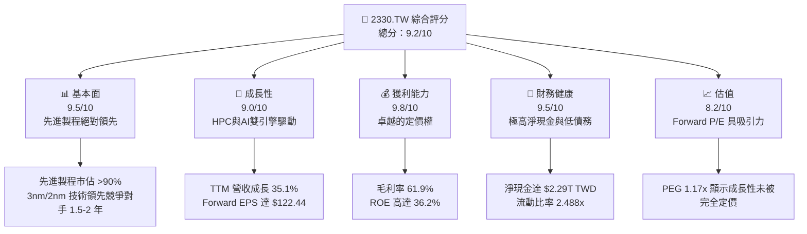
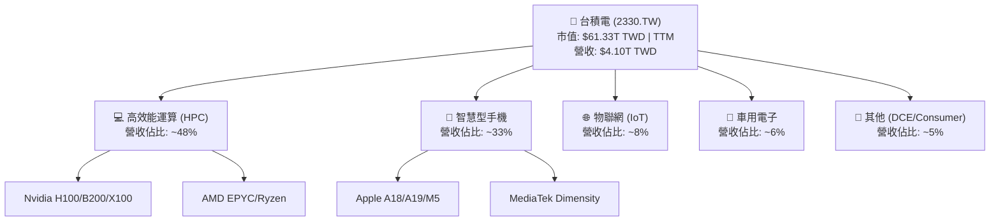
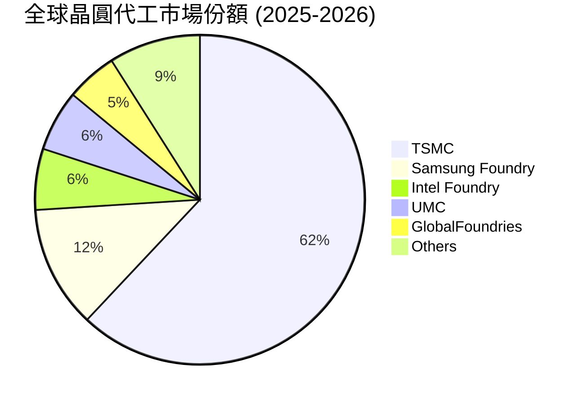
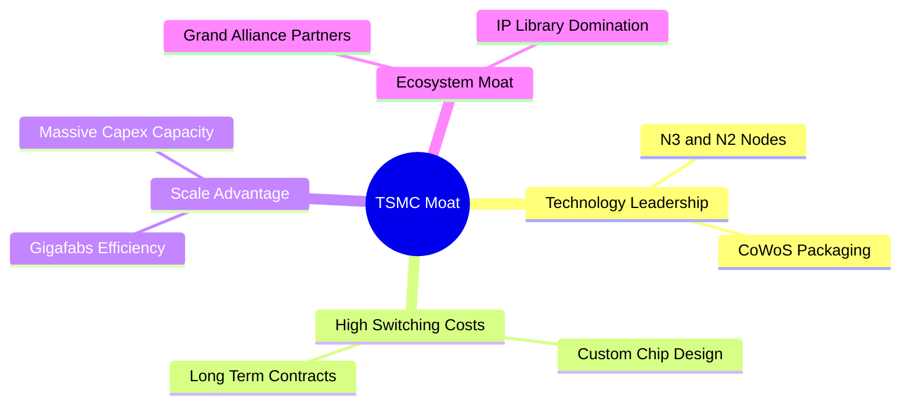

# 2330.TW 基本面深度分析報告
> **報告日期**：2026-06-07 ｜ **語言**：繁體中文 ｜ **數據來源**：Yahoo Finance, Finviz, StockAnalysis, Roic.ai ｜ **分析師**：CFA 級機構研究

---

## 目錄

| # | 章節 | 核心結論 |
|---|------|----------|
| 1 | 執行摘要 | 評級：🟢 強烈買入；12個月基準目標價：$2589.58 |
| 2 | 公司概覽與商業模式 | 先進製程絕對壟斷，高達 62% 的全球晶圓代工市佔率與生態護城河 |
| 3 | 損益表深度分析 | TTM 營收達 $4.10T，淨利率高達 46.5%，AI 晶片需求驅動強勁增長 |
| 4 | 資產負債表分析 | 淨現金高達 $2.29T，財務結構極度穩健，流動比率達 2.488 |
| 5 | 現金流量深度分析 | 營運現金流 $2.35T，自由現金流轉換率與資本配置效率極高 |
| 6 | 獲利能力與資本效率 | ROE 達 36.2%，ROIC (56.8%) 遠超 WACC (8.0%)，持續創造超額經濟價值 |
| 7 | 估值深度分析 | Forward P/E 僅 19.32x，相較歷史區間與同業，估值具備極高安全邊際 |
| 8 | 成長催化劑 | 2nm 製程量產與 CoWoS 產能擴張，AI/HPC 長期大趨勢確立 |
| 9 | 風險矩陣 | 地緣政治風險與海外建廠成本控制為主要監控焦點 |
| 10 | 投資建議 | 綜合評分 9.2/10，建議於 $2100-$2300 區間逢低強力加碼 |

---

## 1. 執行摘要

### 1.1 核心評分儀表板



### 1.2 評分進度條視覺化

```
╔══════════════════════════════════════════════════════════════╗
║             2330.TW 多維度評分儀表板 (1-10分)                ║
╠══════════════════════════════════════════════════════════════╣
║ 基本面強度  9.5 ▓▓▓▓▓▓▓▓▓▓▓▓▓▓▓▓▓▓█░  ★★★★★           ║
║ 成長動能    9.0 ▓▓▓▓▓▓▓▓▓▓▓▓▓▓▓▓▓▓░░  ★★★★★           ║
║ 獲利品質    9.8 ▓▓▓▓▓▓▓▓▓▓▓▓▓▓▓▓▓▓▓█  ★★★★★           ║
║ 財務健康    9.5 ▓▓▓▓▓▓▓▓▓▓▓▓▓▓▓▓▓▓█░  ★★★★★           ║
║ 估值合理性  8.2 ▓▓▓▓▓▓▓▓▓▓▓▓▓▓▓▓░░░░  ★★★★☆           ║
║ 護城河深度  9.8 ▓▓▓▓▓▓▓▓▓▓▓▓▓▓▓▓▓▓▓█  ★★★★★           ║
║ 管理層執行  9.3 ▓▓▓▓▓▓▓▓▓▓▓▓▓▓▓▓▓▓█░  ★★★★★           ║
║ 技術創新力  9.7 ▓▓▓▓▓▓▓▓▓▓▓▓▓▓▓▓▓▓▓█  ★★★★★           ║
╠══════════════════════════════════════════════════════════════╣
║ 綜合總分    9.2 ▓▓▓▓▓▓▓▓▓▓▓▓▓▓▓▓▓▓░░  🏆 強烈買入 (Strong Buy)║
╚══════════════════════════════════════════════════════════════╝
```

### 1.3 五大投資論點 + 三大核心風險

| 類型 | 項目 | 具體依據 | 信心度 |
|------|------|----------|--------|
| 🟢 **投資論點①** | **AI 與 HPC 爆發性需求** | TTM 營收成長達 35.1%，主要受惠於 Nvidia、AMD 等 AI 晶片代工訂單。 | 🟢 極高 |
| 🟢 **投資論點②** | **先進製程絕對定價權** | 毛利率高達 61.9%，營業利益率達 58.1%，顯示 3nm 漲價轉嫁能力極強。 | 🟢 極高 |
| 🟢 **投資論點③** | **2nm 節點技術續領先** | 2025 年底開始量產的 2nm 製程已獲主要客戶（Apple/Nvidia）全額預訂。 | 🟢 高 |
| 🟢 **投資論點④** | **極高資本回報效率** | ROE 達 36.2%，且 ROIC (56.8%) 遠超 WACC (8.0%)，每投入一元皆創造顯著價值。 | 🟢 極高 |
| 🟢 **投資論點⑤** | **強大的資產負債表** | 擁有 $3.38T 現金，淨現金達 $2.29T，在資本密集與高利率環境下具備極佳防禦力。 | 🟢 極高 |
| 🟡 **風險①** | **地緣政治與供應鏈過度集中** | 超過 80% 的先進製程產能仍集中於台灣，易受台海局勢干擾。 | 🟡 中度 |
| 🔴 **風險②** | **海外建廠成本與毛利率稀釋** | 美國、日本與歐洲建廠成本高昂，營運成本上升可能壓低整體毛利率 1-2pp。 | 🔴 高衝擊 |
| 🟡 **風險③** | **半導體產業週期性波動** | 雖然 HPC/AI 強勁，但消費性電子（智慧型手機/PC）若復甦不如預期將壓抑部分產能。 | 🟡 中度 |

### 1.4 快速統計卡片

| 指標 | 2330.TW 實際值 | 半導體行業均值 | S&P 500 均值 | 狀態 |
|------|-------------|----------|--------------|------|
| 收入 YoY 成長 | **35.1%** | ~12.5% | ~5.5% | 🟢 卓越 |
| 毛利率 | **61.9%** | ~45.0% | ~30.0% | 🟢 卓越 |
| 淨利率 | **46.5%** | ~18.0% | ~12.0% | 🟢 卓越 |
| ROE | **36.2%** | ~15.0% | ~14.5% | 🟢 卓越 |
| Forward P/E | **19.32x** | ~28.5x | ~21.5x | 🟢 嚴重低估 |
| 淨現金 / 總債務 | **2.10x** | ~0.85x | ~0.45x | 🟢 極度健康 |

### 1.5 投資結論

```
╔══════════════════════════════════════════════════════════════════╗
║                    📊 2330.TW 投資結論摘要                       ║
╠══════════════════════════════════════════════════════════════════╣
║  評級：🟢 強烈買入 (Strong Buy)                                  ║
║  當前股價：$2365.00 TWD                                          ║
║  目標價區間：                                                    ║
║    悲觀情境（Geopolitical / Cost escalation）：$2051.00 (-13.3%)  ║
║    基準情境（Base Case - Target Mean）：       $2589.58 (+9.5%)   ║
║    樂觀情境（Bull Case - AI Hyper-growth）：   $3250.00 (+37.4%)  ║
║  投資評分：9.2/10                                                ║
║  適合投資人：長線價值成長型、科技板塊配置者、追求超額 EVA 的機構   ║
╚══════════════════════════════════════════════════════════════════╝
```

---

## 2. 公司概覽與商業模式

### 2.1 業務結構與收入來源

台積電（TSMC）是全球最大的專業積體電路製造服務（晶圓代工）企業。其商業模式為純晶圓代工（Pure-play Foundry），不與客戶競爭，這使其贏得了全球幾乎所有頂級無晶圓廠半導體設計公司（Fabless）的信任。



### 2.2 市場份額

在先進製程（7nm及以下）領域，台積電幾乎處於絕對壟斷地位，市佔率超過 90%。在整體晶圓代工市場中，台積電亦維持 60% 以上的絕對優勢。



### 2.3 競爭護城河分析



### 2.4 護城河強度評分

```
╔══════════════════════════════════════════════════════════════╗
║                  2330.TW 護城河強度評分                      ║
╠══════════════════════════════════════════════════════════════╣
║ 技術領先 (Tech) 9.9/10  ▓▓▓▓▓▓▓▓▓▓▓▓▓▓▓▓▓▓▓█  🏆 絕對壟斷     ║
║ 規模效應 (Scale)9.8/10  ▓▓▓▓▓▓▓▓▓▓▓▓▓▓▓▓▓▓▓█  🟢 超高產能效率 ║
║ 生態系統 (IP)   9.5/10  ▓▓▓▓▓▓▓▓▓▓▓▓▓▓▓▓▓▓█░  🟢 開發工具鎖定 ║
║ 客戶轉換成本    9.2/10  ▓▓▓▓▓▓▓▓▓▓▓▓▓▓▓▓▓▓░░  🟢 共同研發綁定 ║
╠══════════════════════════════════════════════════════════════╣
║ 綜合護城河      9.6/10  ▓▓▓▓▓▓▓▓▓▓▓▓▓▓▓▓▓▓█░  🏆 寬廣護城河   ║
╚══════════════════════════════════════════════════════════════╝
```

---

## 3. 損益表深度分析

### 3.1 年度收入成長趨勢（近4年）

台積電的營收在過去四年內展現了強勁的階梯式增長，特別是從 2024 年開始，AI 浪潮帶動了先進製程的爆發。

```
╔════════════════════════