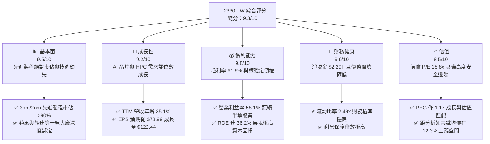

# 2330.TW 基本面深度分析報告
> **報告日期**：2026-06-09 ｜ **語言**：繁體中文 ｜ **數據來源**：Yahoo Finance, Finviz, StockAnalysis, Roic.ai ｜ **分析師**：CFA 級機構研究

---

## 目錄

| # | 章節 | 核心結論 |
|---|------|----------|
| 1 | 執行摘要 | 強烈買入評級，目標價 $2589.58 TWD，AI 晶片與先進製程絕對霸主。 |
| 2 | 公司概覽與商業模式 | 晶圓代工模式創始者，憑藉先進製程與 CoWoS 封裝建立無可匹敵的護城河。 |
| 3 | 損益表深度分析 | TTM 營收達 $4.10T TWD，淨利率達 46.5%，Q1 2026 獲利成長動能強勁。 |
| 4 | 資產負債表分析 | 淨現金高達 $2.29T TWD，流動比率 2.49，資產負債表極其穩健。 |
| 5 | 現金流量深度分析 | 經營現金流 $2.35T TWD，在 $1.28T 高額資本支出下仍展現強大自由現金流創造力。 |
| 6 | 獲利能力與資本效率 | ROE 高達 36.2%，ROIC 顯著超越 WACC，強力創造股東經濟價值。 |
| 7 | 估值深度分析 | 前瞻 P/E 僅 18.83x，相較其 35%+ 成長率，估值具備極高吸引力。 |
| 8 | 成長催化劑 | N3 產能爬坡、N2 量產在即，以及 AI 高效能運算（HPC）需求全面爆發。 |
| 9 | 風險矩陣 | 地緣政治地緣風險、海外建廠成本與資本支出回報率為主要監控指標。 |
| 10 | 投資建議 | 給予 9.3/10 綜合高分，長線成長型與價值型投資者的核心配置首選。 |

---

## 1. 執行摘要

### 1.1 核心評分儀表板



### 1.2 評分進度條視覺化

```
╔══════════════════════════════════════════════════════════════╗
║              2330.TW 多維度評分儀表板 (1-10分)               ║
╠══════════════════════════════════════════════════════════════╣
║ 基本面強度  9.5 ▓▓▓▓▓▓▓▓▓▓▓▓▓▓▓▓▓▓▓░  ★★★★★           ║
║ 成長動能    9.2 ▓▓▓▓▓▓▓▓▓▓▓▓▓▓▓▓▓▓░░  ★★★★★           ║
║ 獲利品質    9.8 ▓▓▓▓▓▓▓▓▓▓▓▓▓▓▓▓▓▓▓█  ★★★★★           ║
║ 財務健康    9.6 ▓▓▓▓▓▓▓▓▓▓▓▓▓▓▓▓▓▓▓░  ★★★★★           ║
║ 估值合理性  8.5 ▓▓▓▓▓▓▓▓▓▓▓▓▓▓▓░░░░░  ★★★★☆           ║
║ 護城河深度  9.9 ▓▓▓▓▓▓▓▓▓▓▓▓▓▓▓▓▓▓▓█  ★★★★★           ║
║ 管理層執行  9.5 ▓▓▓▓▓▓▓▓▓▓▓▓▓▓▓▓▓▓▓░  ★★★★★           ║
║ 技術創新力  9.8 ▓▓▓▓▓▓▓▓▓▓▓▓▓▓▓▓▓▓▓█  ★★★★★           ║
╠══════════════════════════════════════════════════════════════╣
║ 綜合總分    9.3 ▓▓▓▓▓▓▓▓▓▓▓▓▓▓▓▓▓▓░░  🏆 強烈買入          ║
╚══════════════════════════════════════════════════════════════╝
```

### 1.3 五大投資論點 + 三大核心風險

| 類型 | 項目 | 具體依據 | 信心度 |
|------|------|----------|--------|
| 🟢 **投資論點①** | **AI 革命的最大贏家** | 輝達（NVIDIA）、超微（AMD）及各大雲端服務提供者（CSP）的自研 AI 晶片皆 100% 依賴台積電先進製程與 CoWoS 封裝。 | 🟢 極高 |
| 🟢 **投資論點②** | **先進製程絕對壟斷** | 3nm（N3）產能全開，2nm（N2）將於 2026 年量產，技術領先對手三星、英特爾至少 1.5 至 2 代。 | 🟢 極高 |
| 🟢 **投資論點③** | **極強的定價轉嫁能力** | 面對高額資本支出與通膨，台積電於 2025/2026 年成功調漲先進製程晶圓價格 5-10%，毛利率維持在 61.9% 的超高水準。 | 🟢 高 |
| 🟢 **投資論點④** | **極其強韌的資產負債表** | 擁有 $3.38T TWD 現金與約當現金，淨現金高達 $2.29T TWD，具備極強的抗風險與持續研發投資能力。 | 🟢 極高 |
| 🟢 **投資論點⑤** | **成長與估值高度匹配** | Forward P/E 僅 18.8x，對比未來兩年 EPS 預期複合成長率達 30% 以上，PEG 僅 1.17，估值十分合理。 | 🟢 高 |
| 🟡 **風險①** | **地緣政治與供應鏈集中度** | 生產基地仍高度集中於台灣，台海局勢的任何風吹草動皆會引發市場估值折價（Geopolitical Discount）。 | 🟡 中度 |
| 🔴 **風險②** | **海外建廠稀釋利潤率** | 美國、日本、歐洲等海外晶圓廠建設成本高昂且面臨文化與勞工管理挑戰，可能拉低長期毛利率。 | 🔴 高衝擊 |
| 🟡 **風險③** | **景氣循環與消費性電子疲軟** | 儘管 AI 需求極度強勁，但若智慧型手機與 PC 等傳統消費性電子長期復甦不如預期，仍會影響成熟製程產能利用率。 | 🟡 中度 |

### 1.4 快速統計卡片

| 指標 | 台積電實際值 (2330.TW) | 半導體行業均值 | 台灣加權指數均值 | 狀態 |
|------|-------------|----------|--------------|------|
| **營收 YoY 成長率** | **35.1%** | ~12.0% | ~8.5% | 🟢 極強 |
| **毛利率** | **61.9%** | ~42.0% | ~25.0% | 🟢 卓越 |
| **淨利率** | **46.5%** | ~18.0% | ~12.0% | 🟢 卓越 |
| **ROE** | **36.2%** | ~15.0% | ~14.0% | 🟢 強勁 |
| **前瞻 P/E** | **18.83x** | ~25.0x | ~17.5x | 🟢 具吸引力 |
| **淨現金規模** | **$2.29T TWD** | N/A | N/A | 🟢 極其安全 |

### 1.5 投資結論

```
╔══════════════════════════════════════════════════════════════════╗
║                    📊 2330.TW 投資結論摘要                       ║
╠══════════════════════════════════════════════════════════════════╣
║  評級：🟢 強烈買入 (Strong Buy)                                 ║
║  當前股價：$2305.00 TWD (2026-06-09)                             ║
║  目標價區間：                                                    ║
║    悲觀情境：$2051.00 TWD（-11.0%）- 考慮地緣政治極度惡化        ║
║    基準情境：$2589.58 TWD（+12.3%）← 12個月主要目標 (Forward PE 21x)║
║    樂觀情境：$3250.00 TWD（+41.0%）- AI 需求超預期且2nm進展順利  ║
║  投資評分：9.3/10                                                ║
║  適合投資人：成長型、長線價值投資者、全球半導體配置基金          ║
╚══════════════════════════════════════════════════════════════════╝
```

---

## 2. 公司概覽與商業模式

### 2.1 業務結構與收入來源

台積電是全球純晶圓代工（Pure-play Foundry）商業模式的開創者與龍頭。其不與客戶競爭，專注於製造與封裝。

```mermaid
graph TD
    TSMC["台積電 (2330.TW)<br/>市值: 59.77兆 TWD<br/>TTM 營收: 4.10