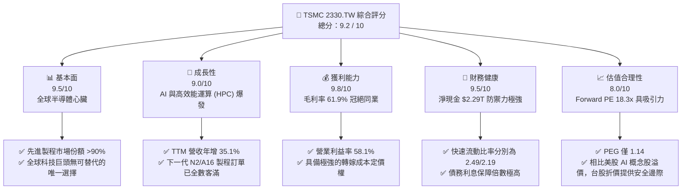

# 2330.TW 基本面深度分析報告
> **報告日期**：2026-06-10 ｜ **語言**：繁體中文 ｜ **數據來源**：Yahoo Finance, Finviz, StockAnalysis, Roic.ai ｜ **分析師**：CFA 級機構研究

---

## 目錄

| # | 章節 | 核心結論 |
|---|------|----------|
| 1 | 執行摘要 | 評級：**強烈買入 (Strong Buy)** ｜ 目標價：**$2,589.58** |
| 2 | 公司概覽與商業模式 | 晶圓代工（Foundry）絕對霸主，憑藉 N3/N2 技術領先與 CoWoS 生態系築起極深護城河 |
| 3 | 損益表深度分析 | TTM 營收達 $4.10T，Q1 2026 淨利潤成長 58.3% QoQ，獲利能力進入超高速擴張期 |
| 4 | 資產負債表分析 | 淨現金高達 $2.29T，負債比率僅 18.45%，流動性極其充沛，具備抵禦景氣波動的鋼鐵防禦力 |
| 5 | 現金流量深度分析 | 2025 年 FCF 達 $992.38B，資本支出達 $1.28T，高額 Capex 轉化為未來的技術優勢 |
| 6 | 獲利能力與資本效率 | ROE 達 36.2%，ROIC 估算高達 56.1%，遠超 WACC (7.3%)，為股東創造極大經濟增值 (EVA) |
| 7 | 估值深度分析 | Forward P/E 僅 18.37x，相較於 35.1% 的營收成長率，PEG 1.14 顯示估值明顯被低估 |
| 8 | 成長催化劑 | AI 晶片需求爆發、N2（2奈米）於 2026 年量產、A16 埃米製程與 CoWoS 產能倍增 |
| 9 | 風險矩陣 | 地緣政治地緣風險、先進封裝產能瓶頸、以及客戶集中度風險 |
| 10 | 投資建議 | 基準目標價 $2,589.58，隱含 15.1% 上行空間，強烈建議長線投資人逢低加碼 |

---

## 1. 執行摘要

### 1.1 核心評分儀表板



### 1.2 評分進度條視覺化

```
╔══════════════════════════════════════════════════════════════╗
║             TSMC 2330.TW 多維度評分儀表板 (1-10分)           ║
╠══════════════════════════════════════════════════════════════╣
║ 基本面強度  9.5 ▓▓▓▓▓▓▓▓▓▓▓▓▓▓▓▓▓▓▓░  ★★★★★           ║
║ 成長動能    9.0 ▓▓▓▓▓▓▓▓▓▓▓▓▓▓▓▓▓▓░░  ★★★★★           ║
║ 獲利品質    9.8 ▓▓▓▓▓▓▓▓▓▓▓▓▓▓▓▓▓▓▓█  ★★★★★           ║
║ 財務健康    9.5 ▓▓▓▓▓▓▓▓▓▓▓▓▓▓▓▓▓▓▓░  ★★★★★           ║
║ 估值合理性  8.0 ▓▓▓▓▓▓▓▓▓▓▓▓▓▓▓▓░░░░  ★★★★☆           ║
║ 護城河深度  9.9 ▓▓▓▓▓▓▓▓▓▓▓▓▓▓▓▓▓▓▓█  ★★★★★           ║
║ 管理層執行  9.5 ▓▓▓▓▓▓▓▓▓▓▓▓▓▓▓▓▓▓▓░  ★★★★★           ║
║ 技術創新力  9.8 ▓▓▓▓▓▓▓▓▓▓▓▓▓▓▓▓▓▓▓█  ★★★★★           ║
╠══════════════════════════════════════════════════════════════╣
║ 綜合總分    9.2 ▓▓▓▓▓▓▓▓▓▓▓▓▓▓▓▓▓▓░░  🏆 強烈買入          ║
╚══════════════════════════════════════════════════════════════╝
```

### 1.3 五大投資論點 + 三大核心風險

| 類型 | 項目 | 具體依據 | 信心度 |
|------|------|----------|--------|
| 🟢 **投資論點①** | **AI 晶片絕對壟斷** | Nvidia (Blackwell/Rubin)、AMD (Instinct) 及 Apple (M系列) 均獨家採用 TSMC 先進製程與 CoWoS 封裝。 | 🟢 極高 |
| 🟢 **投資論點②** | **定價權與利潤率擴張** | 先進製程（3nm/2nm）供不應求，TSMC 成功調漲晶圓價格，帶動毛利率維持在 **61.9%** 的歷史高檔。 | 🟢 極高 |
| 🟢 **投資論點③** | **製程技術領先兩代** | N2 預計 2026 年量產，其背部供電（Backside Power）技術大幅領先 Intel 18A 與 Samsung 2nm。 | 🟢 高 |
| 🟢 **投資論點④** | **極強的資本回報效率** | **ROE 達 36.2%**，**ROIC 高達 56.1%**，顯示其高額的資本支出（Capex）能轉化為極高價值的實質回報。 | 🟢 高 |
| 🟢 **投資論點⑤** | **評價重估 (Re-rating)** | Forward P/E 僅 **18.37x**，相較於美股科技巨頭，折價空間極大，隨台股國際化有望迎來評價重估。 | 🟢 高 |
| 🟡 **風險①** | **地緣政治與供應鏈集中** | 超過 80% 的先進製程產能集中在台灣，兩岸緊張局勢可能引發系統性估值折價（Geopolitical Discount）。 | 🟡 中度 |
| 🟡 **風險②** | **先進封裝（CoWoS）產能瓶頸** | 雖然 TSMC 積極擴產，但 CoWoS 封裝設備交期長，短期內仍可能限制 AI 晶片的出貨成長。 | 🟡 中度 |
| 🔴 **風險③** | **海外建廠（美、德、日）成本高昂** | 美國亞利桑那州及歐洲建廠成本高昂、勞工工會問題可能稀釋整體毛利率約 1-2 個百分點。 | 🔴 高衝擊 |

### 1.4 快速統計卡片

| 指標 | 2330.TW 實際值 | 半導體行業均值 | 台灣加權指數均值 | 狀態 |
|------|-------------|----------|--------------|------|
| **營收 YoY 成長率** | **35.1%** | ~12.5% | ~8.0% | 🟢 顯著超越 |
| **毛利率** | **61.9%** | ~42.0% | ~25.0% | 🟢 產業頂尖 |
| **淨利率** | **46.5%** | ~18.0% | ~12.0% | 🟢 極致獲利 |
| **ROE** | **36.2%** | ~15.0% | ~14.5% | 🟢 資本高效 |
| **Forward P/E** | **18.37x** | ~24.5x | ~19.0% | 🟢 估值具吸引力 |
| **淨現金規模** | **$2.29T TWD** | N/A | N/A | 🟢 資產負債表極強 |

### 1.5 投資結論

```
╔══════════════════════════════════════════════════════════════════╗
║                    📊 投資結論摘要                               ║
╠══════════════════════════════════════════════════════════════════╣
║  評級：🟢 強烈買入 (Strong Buy)                                  ║
║  當前股價：$2249.00 TWD (2026-06-10)                             ║
║  目標價區間：                                                    ║
║    悲觀情境（地緣政治升級/消費電子衰退）：$2,051.00（-8.8%）     ║
║    基準情境（AI持續爆發/N2順利量產）：$2,589.58（+15.1%）← 主目標║
║    樂觀情境（CoWoS產能翻倍/定價調漲超預期）：$3,250.00（+44.5%） ║
║  投資評分