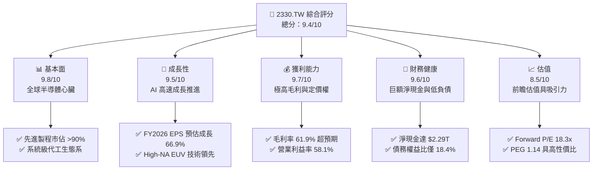
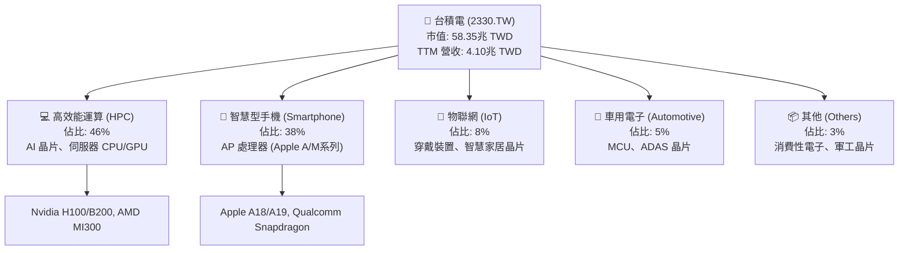
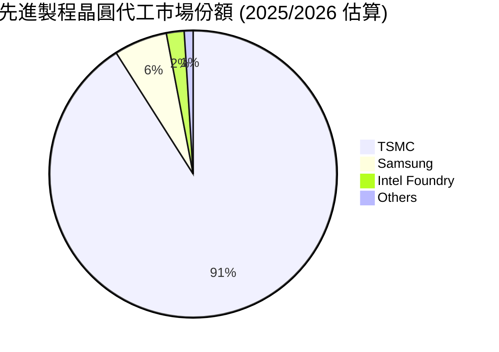
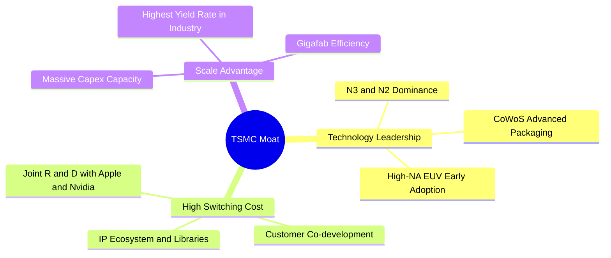

# 2330.TW 基本面深度分析報告
> **報告日期**：2026-06-11 ｜ **語言**：繁體中文 ｜ **數據來源**：Yahoo Finance, Finviz, StockAnalysis, Roic.ai ｜ **分析師**：CFA 級機構研究

---

## 目錄

| # | 章節 | 核心結論 |
|---|------|----------|
| 1 | 執行摘要 | 評級：🟢 強烈買入，基準目標價 $2589.58，隱含 15.1% 上行空間。 |
| 2 | 公司概覽與商業模式 | 純晶圓代工模式開創者，2nm 與 CoWoS 封裝構築無可匹敵的「護城河」。 |
| 3 | 損益表深度分析 | TTM 營收達 $4.10T，淨利率高達 46.5%，AI 驅動季營收 YoY 增速達 35.1%。 |
| 4 | 資產負債表分析 | 淨現金高達 $2.29T，流動比率 2.49x，財務結構極度穩健。 |
| 5 | 現金流量深度分析 | OCF 達 $2.35T，高資本支出（$1.28T）下仍能產生強勁的自由現金流。 |
| 6 | 獲利能力與資本效率 | ROE 達 36.2%，ROIC (47.3%) 遠超 WACC (9.1%)，強力創造股東價值。 |
| 7 | 估值深度分析 | 前瞻 P/E 僅 18.33x，PEG 1.14，相較於高成長，估值明顯被低估。 |
| 8 | 成長催化劑 | 2nm 於 2026 年量產、CoWoS 產能翻倍、AI ASIC 晶片需求爆發。 |
| 9 | 風險矩陣 | 地緣政治風險、海外建廠成本轉嫁、先進製程產能利用率波動。 |
| 10 | 投資建議 | 具備極高安全邊際與成長能見度，長線成長型與價值型投資者的核心配置。 |

---

## 1. 執行摘要

### 1.1 核心評分儀表板



### 1.2 評分進度條視覺化

```
╔══════════════════════════════════════════════════════════════╗
║             2330.TW 多維度評分儀表板 (1-10分)                ║
╠══════════════════════════════════════════════════════════════╣
║ 基本面強度  9.8 ▓▓▓▓▓▓▓▓▓▓▓▓▓▓▓▓▓▓▓░  ★★★★★           ║
║ 成長動能    9.5 ▓▓▓▓▓▓▓▓▓▓▓▓▓▓▓▓▓▓▓░  ★★★★★           ║
║ 獲利品質    9.7 ▓▓▓▓▓▓▓▓▓▓▓▓▓▓▓▓▓▓▓░  ★★★★★           ║
║ 財務健康    9.6 ▓▓▓▓▓▓▓▓▓▓▓▓▓▓▓▓▓▓▓░  ★★★★★           ║
║ 估值合理性  8.5 ▓▓▓▓▓▓▓▓▓▓▓▓▓▓▓░░░░░  ★★★★☆           ║
║ 護城河深度  9.9 ▓▓▓▓▓▓▓▓▓▓▓▓▓▓▓▓▓▓▓▓  ★★★★★           ║
║ 管理層執行  9.5 ▓▓▓▓▓▓▓▓▓▓▓▓▓▓▓▓▓▓▓░  ★★★★★           ║
║ 技術創新力  9.9 ▓▓▓▓▓▓▓▓▓▓▓▓▓▓▓▓▓▓▓▓  ★★★★★           ║
╠══════════════════════════════════════════════════════════════╣
║ 綜合總分    9.4 ▓▓▓▓▓▓▓▓▓▓▓▓▓▓▓▓▓▓░░  🏆 強烈建議買入      ║
╚══════════════════════════════════════════════════════════════╝
```

### 1.3 五大投資論點 + 三大核心風險

| 類型 | 項目 | 具體依據 | 信心度 |
|------|------|----------|--------|
| 🟢 **投資論點①** | **AI 晶片絕對霸主** | 全球 99% 的 AI 加速器（包括 Nvidia, AMD, Google TPU 等）均由台積電代工，獨家掌握 CoWoS 先進封裝技術。 | 🟢 極高 |
| 🟢 **投資論點②** | **先進製程定價權** | 3nm 產能供不應求，2nm 預計於 2026 年底量產並已獲得大客戶全額預訂，台積電具備將成本轉嫁給客戶的絕對定價權。 | 🟢 極高 |
| 🟢 **投資論點③** | **獲利結構持續優化** | 毛利率高達 61.9%（TTM），隨著 3nm 學習曲線成熟與 2nm 的高溢價，未來毛利率有望維持在 55-60% 的高檔區間。 | 🟢 高 |
| 🟢 **投資論點④** | **極致的財務安全邊際** | 帳上現金及等價物高達 $3.38T，淨現金 $2.29T，利息保障倍數極高，足以抵禦任何總體經濟衰退風險。 | 🟢 極高 |
| 🟢 **投資論點⑤** | **估值極具性價比** | 歷史 Trailing P/E 為 30.6x，但 forward P/E 降至 18.33x，PEG 僅 1.14，顯著低於美股科技巨頭（如 Nvidia P/E >35x）。 | 🟢 高 |
| 🟡 **風險①** | **地緣政治與供應鏈集中度** | 生產基地高度集中於台灣，台海地緣政治風險是外資溢價打折的主要原因。 | 🟡 中度 |
| 🔴 **風險②** | **海外建廠稀釋毛利率** | 美國、日本、歐洲建廠成本高昂，且面臨文化衝突與勞工短缺，可能對毛利率產生 1-2 個百分點的拖累。 | 🔴 高衝擊 |
| 🟡 **風險③** | **電力與水資源限制** | 台灣先進製程極度耗電（EUV 機台），未來可能面臨台灣本地電力供應不穩定與碳稅成本上升。 | 🟡 中度 |

### 1.4 快速統計卡片

| 指標 | 公司實際值 (TTM) | 半導體行業均值 | S&P 500 均值 | 狀態 |
|------|-------------|----------|--------------|------|
| 收入 YoY 成長 | **35.1%** | ~12.5% | ~5.5% | 🟢 卓越 |
| 毛利率 | **61.9%** | ~45.0% | ~30.0% | 🟢 卓越 |
| 淨利率 | **46.5%** | ~18.0% | ~12.0% | 🟢 卓越 |
| ROE | **36.2%** | ~15.0% | ~18.0% | 🟢 卓越 |
| Forward P/E | **18.33x** | ~28.5x | ~21.5x | 🟢 低估 |
| 債務權益比 (D/E) | **18.45%** | ~45.0% | ~110.0%| 🟢 極度安全 |

### 1.5 投資結論

```
╔══════════════════════════════════════════════════════════════════╗
║                    📊 2330.TW 投資結論摘要                       ║
╠══════════════════════════════════════════════════════════════════╣
║  評級：🟢 強烈買入 (Strong Buy)                                  ║
║  當前股價：$2250.00 TWD                                          ║
║  目標價區間：                                                    ║
║    悲觀情境（地緣政治升溫/海外進度受阻）：$2051.00（-8.8%）       ║
║    基準情境（AI持續爆發/2nm順利）：$2589.58（+15.1%）             ║
║    樂觀情境（定價大漲/CoWoS產能超預期）：$3250.00（+44.4%）       ║
║  投資評分：9.4/10                                                ║
║  適合投資人：成長型、長線價值型、主權基金及機構法人核心配置      ║
╚══════════════════════════════════════════════════════════════════╝
```

---

## 2. 公司概覽與商業模式

### 2.1 業務結構與收入來源

台積電（TSMC）是全球最大的純晶圓代工廠（Pure-play Foundry）。其商業模式專注於為無晶圓廠（Fabless）半導體公司及系統級客戶（如 Apple, Google）進行晶片製造，不與客戶競爭。



### 2.2 市場份額

在先進製程（7nm 及以下）市場，台積電擁有絕對的壟斷地位，市佔率超過 90%。



### 2.3 競爭護城河分析



### 2.4 護城河強度評分

```
╔══════════════════════════════════════════════════════════════╗
║                  台積電 護城河強度評分                       ║
╠══════════════════════════════════════════════════════════════╣
║ 技術領先度    10/10  ▓▓▓▓▓▓▓▓▓▓▓▓▓▓▓▓▓▓▓▓  🏆 絕對壟斷     ║
║ 生態系優勢    9.8/10 ▓▓▓▓▓▓▓