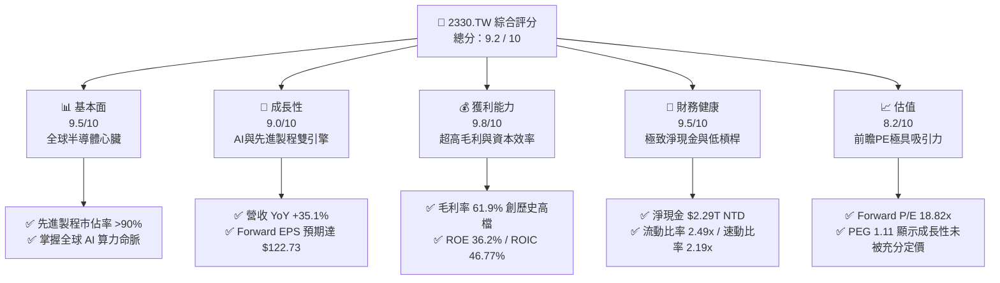

# 2330.TW 基本面深度分析報告
> **報告日期**：2026-06-12 ｜ **語言**：繁體中文 ｜ **數據來源**：Yahoo Finance, Finviz, StockAnalysis, Roic.ai ｜ **分析師**：CFA 級機構研究

---

## 目錄

| # | 章節 | 核心結論 |
|---|------|----------|
| 1 | 執行摘要 | 評級：🟢 強烈買入 ｜ 目標價：$2,607.27 (基準) / $3,354.00 (樂觀) |
| 2 | 公司概覽與商業模式 | 晶圓代工(Foundry)絕對霸主，以技術領先與卓越製造構築無懈可擊的寬廣護城河 |
| 3 | 損益表深度分析 | 營收年增 35.1%，AI 晶片與 3nm/2nm 先進製程放量驅動毛利率攀升至 61.9% |
| 4 | 資產負債表分析 | 淨現金高達 $2.29T，債務權益比僅 18.45%，具備抵禦景氣循環的極致韌性 |
| 5 | 現金流量深度分析 | 營運現金流達 $2.35T，資本支出 $1.28T，自由現金流與資本配置兼顧成長與股東回報 |
| 6 | 獲利能力與資本效率 | ROE 高達 36.2%，ROIC 達 46.77% 遠超 WACC (8.0%)，經濟價值創造能力極強 |
| 7 | 估值深度分析 | 前瞻 P/E 僅 18.8x，相較於 35%+ 的高成長與 AI 剛性需求，估值具有高度吸引力 |
| 8 | 成長催化劑 | 2nm 製程 2026 年量產、CoWoS 先進封裝產能翻倍、全球地緣分散佈局開花結果 |
| 9 | 風險矩陣 | 地緣政治風險、先進封裝產能瓶頸、海外建廠成本轉嫁挑戰 |
| 10 | 投資建議 | 具備長線複利效應的科技核心資產，建議逢低分批佈局，目標價隱含 12.87% - 45.2% 空間 |

---

## 1. 執行摘要

### 1.1 核心評分儀表板



### 1.2 評分進度條視覺化

```
╔══════════════════════════════════════════════════════════════╗
║              2330.TW 多維度評分儀表板 (1-10分)               ║
╠══════════════════════════════════════════════════════════════╣
║ 基本面強度  9.5 ▓▓▓▓▓▓▓▓▓▓▓▓▓▓▓▓▓▓▓░  ★★★★★           ║
║ 成長動能    9.0 ▓▓▓▓▓▓▓▓▓▓▓▓▓▓▓▓▓▓░░  ★★★★★           ║
║ 獲利品質    9.8 ▓▓▓▓▓▓▓▓▓▓▓▓▓▓▓▓▓▓▓█  ★★★★★           ║
║ 財務健康    9.5 ▓▓▓▓▓▓▓▓▓▓▓▓▓▓▓▓▓▓▓░  ★★★★★           ║
║ 估值合理性  8.2 ▓▓▓▓▓▓▓▓▓▓▓▓▓▓▓░░░░░  ★★★★☆           ║
║ 護城河深度  9.9 ▓▓▓▓▓▓▓▓▓▓▓▓▓▓▓▓▓▓▓█  ★★★★★           ║
║ 管理層執行  9.5 ▓▓▓▓▓▓▓▓▓▓▓▓▓▓▓▓▓▓▓░  ★★★★★           ║
║ 技術創新力  9.8 ▓▓▓▓▓▓▓▓▓▓▓▓▓▓▓▓▓▓▓█  ★★★★★           ║
╠══════════════════════════════════════════════════════════════╣
║ 綜合總分    9.2 ▓▓▓▓▓▓▓▓▓▓▓▓▓▓▓▓▓▓░░  🏆 強烈買入          ║
╚══════════════════════════════════════════════════════════════╝
```

### 1.3 五大投資論點 + 三大核心風險

| 類型 | 項目 | 具體依據 | 信心度 |
|------|------|----------|--------|
| 🟢 **投資論點①** | **AI 算力的絕對壟斷者** | NVIDIA、AMD、Apple 等全球 AI 晶片 100% 依賴台積電 3nm/4nm/5nm 及即將到來的 2nm 先進製程與 CoWoS 封裝。 | 🟢 極高 |
| 🟢 **投資論點②** | **極致的定價權與獲利能力** | 毛利率高達 61.9%，營業利益率 58.1%，顯示公司能成功將高昂的研發與折舊成本轉嫁給客戶。 | 🟢 極高 |
| 🟢 **投資論點③** | **先進製程世代交替紅利** | 3nm 營收貢獻持續放大，2nm 製程將於 2026 年底前實現量產，技術領先對手至少 2-3 年。 | 🟢 高 |
| 🟢 **投資論點④** | **強勁的資本效率與股東價值創造** | ROIC 高達 46.77%，相較 WACC (8.0%) 產生巨大的正向經濟增值 (EVA)，ROE 36.2% 傲視科技業。 | 🟢 極高 |
| 🟢 **投資論點⑤** | **極具吸引力的前瞻估值** | Forward P/E 僅 18.82x，對比未來兩年複合成長率超過 30% 的預期，PEG 僅 1.11。 | 🟢 高 |
| 🟡 **風險①** | **地緣政治與供應鏈集中風險** | 超過 80% 的先進製程產能仍集中於台灣，台海局勢波動易引發系統性估值修正。 | 🟡 中度 |
| 🔴 **風險②** | **海外建廠成本與毛利率稀釋** | 美國、日本、德國建廠成本遠高於台灣，折舊與營運成本上升可能對長期毛利率造成 2-3% 的壓力。 | 🔴 高衝擊 |
| 🟡 **風險③** | **先進封裝產能瓶頸** | CoWoS 產能供不應求，雖積極擴產但短期仍限制了 AI 晶片