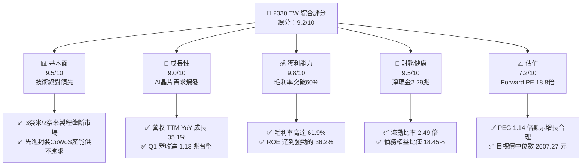
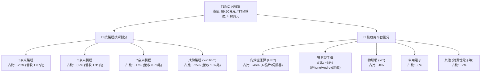
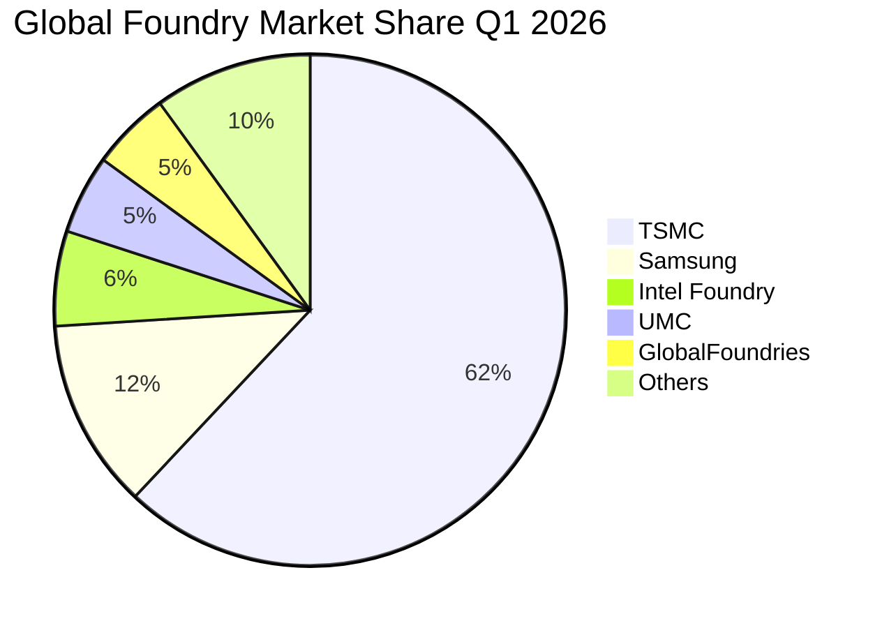
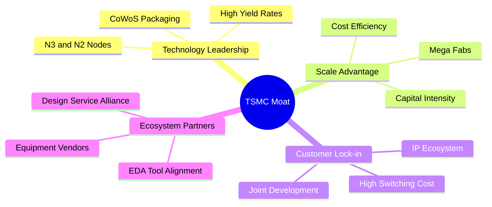
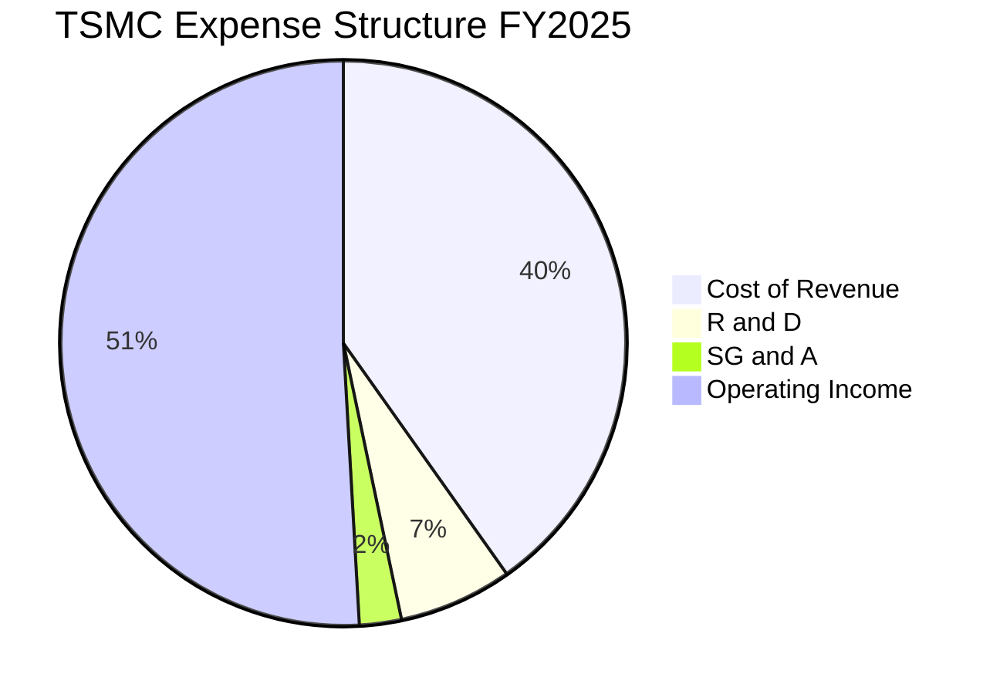
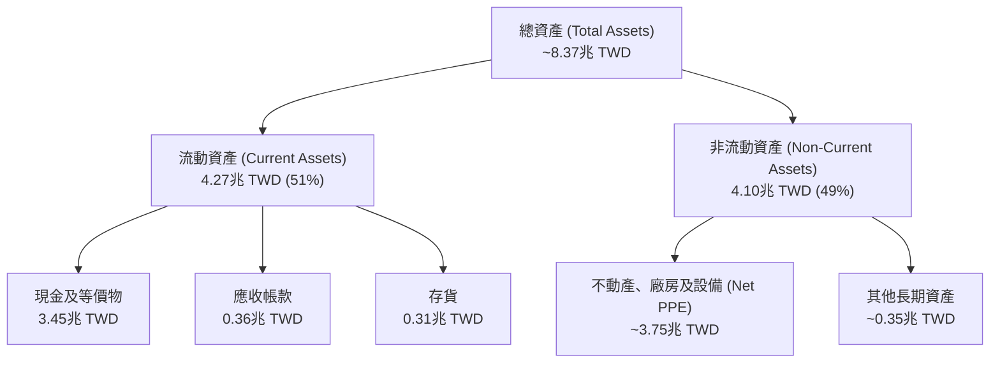
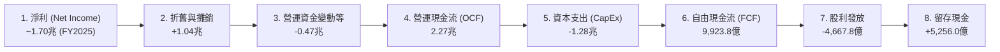
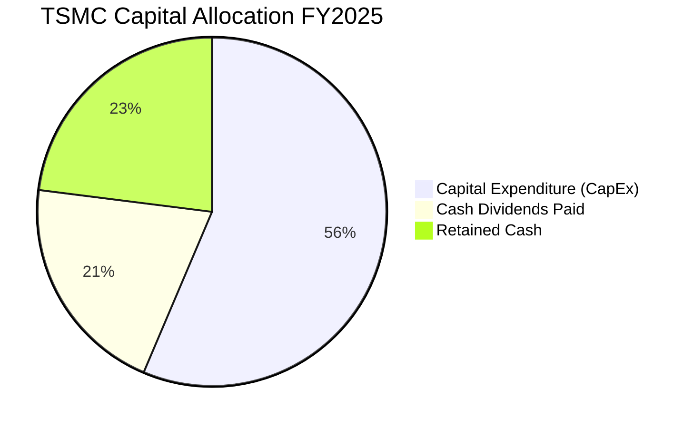
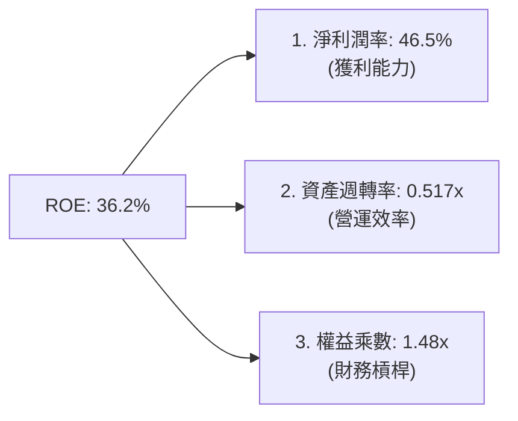
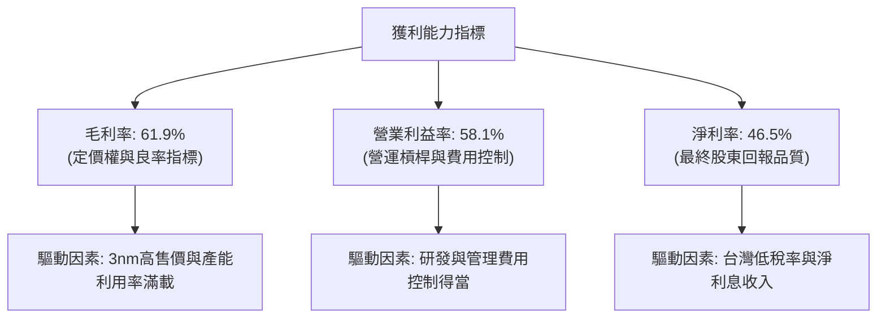

# 2330.TW 基本面深度分析報告

> **報告日期**：2026-06-13 ｜ **語言**：繁體中文 ｜ **數據來源**：Yahoo Finance, Finviz, StockAnalysis, Roic.ai ｜ **分析師**：CFA 級機構研究

---

## 目錄

| # | 章節 | 核心結論 |
|---|---|---|
| 1 | 執行摘要 | 評級「強烈買入」，基準目標價 $2,607.27，潛在漲幅 +12.87% |
| 2 | 公司概覽與商業模式 | 憑藉 3nm/2nm 製程技術與 CoWoS 封裝，築起無可撼動的「護城河」 |
| 3 | 損益表深度分析 | TTM 營收達 4.10 兆元，毛利率達 61.9%，AI 晶片驅動營收與利潤雙爆發 |
| 4 | 資產負債表分析 | 淨現金高達 2.29 兆元，財務結構極度穩健，具備強大抗風險能力 |
| 5 | 現金流量深度分析 | 營運現金流 2.35 兆元，自由現金流轉換率與资本配置效率極佳 |
| 6 | 獲利能力與資本效率 | ROE 達 36.2%，ROIC 達 62.0%，相較 WACC 創造超額經濟價值 (EVA) |
| 7 | 估值深度分析 | Forward P/E 僅 18.82 倍，PEG 1.14，DCF 敏感性分析顯示估值具備安全邊際 |
| 8 | 成長催化劑 | 2nm 商業化、CoWoS 產能翻倍與矽光子技術，驅動長期 TAM 持續擴大 |
| 9 | 風險矩陣 | 地緣政治風險、海外建廠成本與客戶集中度為三大核心監控指標 |
| 10 | 投資建議 | 適合長線成長型與價值型投資者，分批佈局並緊密監控關鍵營運指標 |

---

## 1. 執行摘要

### 1.1 核心評分儀表板



### 1.2 評分進度條視覺化

```
╔══════════════════════════════════════════════════════════════╗
║              2330.TW 多維度評分儀表板 (1-10分)               ║
╠══════════════════════════════════════════════════════════════╣
║ 基本面強度  9.5 ▓▓▓▓▓▓▓▓▓▓▓▓▓▓▓▓▓▓█░  ★★★★★           ║
║ 成長動能    9.0 ▓▓▓▓▓▓▓▓▓▓▓▓▓▓▓▓▓▓░░  ★★★★★           ║
║ 獲利品質    9.8 ▓▓▓▓▓▓▓▓▓▓▓▓▓▓▓▓▓▓▓█  ★★★★★           ║
║ 財務健康    9.5 ▓▓▓▓▓▓▓▓▓▓▓▓▓▓▓▓▓▓█░  ★★★★★           ║
║ 估值合理性  7.2 ▓▓▓▓▓▓▓▓▓▓▓▓▓▓░░░░░░  ★★★☆☆           ║
║ 護城河深度  9.8 ▓▓▓▓▓▓▓▓▓▓▓▓▓▓▓▓▓▓▓█  ★★★★★           ║
║ 管理層執行  9.5 ▓▓▓▓▓▓▓▓▓▓▓▓▓▓▓▓▓▓█░  ★★★★★           ║
║ 技術創新力  9.9 ▓▓▓▓▓▓▓▓▓▓▓▓▓▓▓▓▓▓▓█  ★★★★★           ║
╠══════════════════════════════════════════════════════════════╣
║ 綜合總分    9.2 ▓▓▓▓▓▓▓▓▓▓▓▓▓▓▓▓▓▓░░  🏆 強烈建議買入      ║
╚══════════════════════════════════════════════════════════════╝
```

### 1.3 五大投資論點 + 三大核心風險

| 類型 | 項目 | 具體依據 | 信心度 |
|------|------|----------|--------|
| 🟢 **投資論點①** | **AI 算力基礎設施的唯一「收稅人」** | 全球超過 95% 的 AI 加速器（包括 Nvidia H100/B200, AMD MI300）均獨家採用台積電先進製程與 CoWoS 封裝，AI 需求爆發直接轉化為台積電營收。 | 🟢 極高 |
| 🟢 **投資論點②** | **先進製程定價權與毛利率擴張** | 3nm 產能持續滿載，2nm 預計於 2026 下半年量產並調漲價格。TTM 毛利率高達 61.9%，展現極強的成本轉嫁能力。 | 🟢 極高 |
| 🟢 **投資論點③** | **極致的資本回報率與價值創造** | ROE 達 36.2%，ROIC 達 62.0%，遠高於我們估算的 WACC（8.3%），每年為股東創造龐大的超額經濟價值（EVA）。 | 🟢 高 |
| 🟢 **投資論點④** | **資產負債表固若金湯** | 擁有 3.38 兆元現金及短期投資，淨現金頭寸達 2.29 兆元。Debt/Equity 僅 18.45%，能安然度過任何半導體景氣下行週期。 | 🟢 極高 |
| 🟢 **投資論點⑤** | **估值處於合理區間** | 儘管股價已達 $2,310 元，但 Forward P/E 僅 18.82 倍，相較其高達 35.1% 的營收增速與 58.4% 的盈餘增速，PEG 僅 1.14，估值並未過熱。 | 🟢 高 |
| 🟡 **風險①** | **地緣政治與產能過度集中** | 超過 80% 的先進製程產能仍集中於台灣，台海局勢的任何風吹草動都將引發估值乘數（P/E Multiple）的劇烈波動。 | 🟡 中度 |
| 🔴 **風險②** | **海外建廠稀釋利潤率** | 美國亞利桑那州、日本熊本、德國德勒斯登建廠成本高昂。雖然日本進展順利，但美國廠仍面臨勞工與文化摩擦，可能稀釋長期毛利率。 | 🔴 高衝擊 |
| 🟡 **風險③** | **客戶集中度過高** | 前兩大客戶（預計為 Apple 與 Nvidia）貢獻營收比重估計超過 35%，若單一客戶因消費電子疲軟或 AI 晶片庫存調整而砍單，將對短期業績造成衝擊。 | 🟡 中度 |

### 1.4 快速統計卡片

| 指標 | 2330.TW 實際值 | 半導體行業均值 | 台灣加權指數均值 | 狀態 |
|------|-------------|----------|--------------|------|
| **營收 YoY 成長** | **35.1%** | ~12.5% | ~8.2% | 🟢 顯著超越 |
| **毛利率** | **61.9%** | ~42.0% | ~18.5% | 🟢 行業天花板 |
| **淨利率** | **46.5%** | ~15.5% | ~10.2% | 🟢 極高獲利品質 |
| **ROE** | **36.2%** | ~14.0% | ~12.5% | 🟢 卓越股權回報 |
| **Forward P/E** | **18.82x** | ~24.5x | ~16.8x | 🟢 具備估值吸引力 |
| **淨現金/總資產** | **28.9%** | ~5.2% | ~2.1% | 🟢 極度安全 |

### 1.5 投資結論

```
╔══════════════════════════════════════════════════════════════════╗
║                    📊 2330.TW 投資結論摘要                       ║
╠══════════════════════════════════════════════════════════════════╣
║  評級：🟢 強烈買入 (Strong Buy)                                 ║
║  當前股價：$2,310.00 TWD                                         ║
║  目標價區間：                                                    ║
║    悲觀情境（地緣政治惡化/AI退溫）：$2,051.00 (-11.21%)          ║
║    基準情境（AI持續成長/2nm進展順利）：$2,607.27 (+12.87%)  ← 主 ║
║    樂觀情境（AI全面爆發/CoWoS產能超預期）：$3,354.00 (+45.19%)  ║
║  投資評分：9.2 / 10                                              ║
║  適合投資人：長線成長型、科技產業佈局者、追求高資本效率的投資人  ║
╚══════════════════════════════════════════════════════════════════╝
```

---

## 2. 公司概覽與商業模式

### 2.1 業務結構與收入來源

台積電是全球純晶圓代工（Pure-play Foundry）商業模式的創始者。其業務結構可依「製程技術」與「應用平台」進行多維度拆解：



### 2.2 市場份額

在先進製程（7nm及以下）領域，台積電幾乎處於壟斷地位，尤其在 3nm 技術節點，其全球市場份額預估超過 90%。



### 2.3 競爭護城河分析

台積電的「寬廣護城河」並非單一因素構成，而是由技術、規模、生態與客戶鎖定共同交織而成的網絡效應。



1. **技術領先（Technology Leadership）**：台積電在 EUV（極紫外光）微影技術的應用經驗上冠絕全球，使其在 3nm 與即將到來的 2nm 研發上保持領先。其獨門的 CoWoS（Chip-on-Wafer-on-Substrate）與 SoIC 先進封裝技術，已成為 AI 晶片不可或缺的製程標準。
2. **規模優勢與資本壁壘（Scale & Capital Intensity）**：半導體晶圓廠的資本支出極高。台積電 2025 年資本支出高達 1.28 兆台幣，競爭對手（如聯電、格羅方德）已無力參與先進製程的軍備競賽，唯二對手三星與 Intel 亦因良率與財務壓力逐漸拉大與台積電的差距。
3. **生態系統與客戶鎖定（OIP Ecosystem & High Switching Costs）**：台積電建構的「開放創新平台（OIP）」，擁有數萬個經認證的 IP 與 EDA 工具。客戶（如 Apple, Nvidia）若轉移至其他代工廠，將面臨巨大的重新設計成本與良率風險。

### 2.4 護城河強度評分

```
╔══════════════════════════════════════════════════════════════╗
║                  2330.TW 護城河強度評分                      ║
╠══════════════════════════════════════════════════════════════╣
║ 技術壁壘       9.9/10 ▓▓▓▓▓▓▓▓▓▓▓▓▓▓▓▓▓▓▓█  🏆 絕對壟斷     ║
║ 資本與規模     9.8/10 ▓▓▓▓▓▓▓▓▓▓▓▓▓▓▓▓▓▓▓█  🟢 無法超越     ║
║ 客戶轉換成本   9.5/10 ▓▓▓▓▓▓▓▓▓▓▓▓▓▓▓▓▓▓█░  🟢 極高黏著度   ║
║ 生態系 network 9.6/10 ▓▓▓▓▓▓▓▓▓▓▓▓▓▓▓▓▓▓▓░  🟢 OIP生態完整  ║
╠══════════════════════════════════════════════════════════════╣
║ 綜合護城河     9.7/10 ▓▓▓▓▓▓▓▓▓▓▓▓▓▓▓▓▓▓▓█  🏆 寬廣無比     ║
╚══════════════════════════════════════════════════════════════╝
```

---

## 3. 損益表深度分析

### 3.1 年度收入成長趨勢（近4年）

台積電的營收在過去四年呈現了爆發式成長，除了 2023 年受全球半導體庫存調整影響輕微下滑 4.4% 外，其餘年份均高速增長。

```
╔══════════════════════════════════════════════════════════════════╗
║              2330.TW 年度收入趨勢（FY2022-FY2025）               ║
╠══════════════════════════════════════════════════════════════════╣
║                                                                  ║
║  FY2022  $2.26T   ███████████████░░░░░░░░░░░  YoY: +33.5% 🟢    ║
║  FY2023  $2.16T   ██████████████░░░░░░░░░░░░  YoY: -4.4%  🟡    ║
║  FY2024  $2.89T   ███████████████████░░░░░░░  YoY: +33.8% 🟢    ║
║  FY2025  $3.81T   █████████████████████████░  YoY: +31.8% 🟢    ║
║                                                                  ║
║                   |      |      |      |      |                  ║
║                   0     1.0T   2.0T   3.0T   4.0T                ║
║                                                                  ║
║  📊 4年複合成長率 (CAGR)：+19.0%                                 ║
╚══════════════════════════════════════════════════════════════════╝
```

### 3.2 季度收入趨勢分析

從季度數據看，台積電的營收呈現逐季加速態勢，2026 年第一季營收達到 1.134 兆元，展現了強勁的淡季不淡特徵。

| 季度 | 營業收入 (TWD) | QoQ 成長率 | YoY 成長率 | 驅動因素與市場備註 | 評估 |
|---|---|---|---|---|---|
| **2025-06-30** (Q2) | $933.79B | +11.26% | +38.6% | 3nm 出貨開始放量，HPC 需求強勁 | 🟢 強勁 |
| **2025-09-30** (Q3) | $989.92B | +6.01% | +30.3% | 蘋果 iPhone 17 新機 A19 晶片備貨高峰 | 🟢 符合預期 |
| **2025-12-31** (Q4) | $1,046.09B | +5.67% | +20.5% | Nvidia Blackwell 晶片放量，CoWoS 產能吃緊 | 🟢 優異 |
| **2026-03-31** (Q1) | $1,134.10B | +8.41% | +35.1% | AI 加速器需求爆發，抵消手機季節性衰退 | 🟢 超預期 |

*數據分析*：2026-03-31 季度營收達 **1.134 兆元**，YoY 成長達 **35.1%**，QoQ 成長 **8.41%**。在傳統第一季電子業淡季中，台積電仍能實現 QoQ 正成長，主要得益於 AI 伺服器晶片（GPU/ASIC）的無休止需求。

### 3.3 利潤率演變分析

台積電的利潤率在過去幾年持續維持在極高水準，這在資本密集型製造業中是極為罕見的奇蹟。

| 利潤率指標 | FY2022 | FY2023 | FY2024 | FY2025 | TTM (最新) | 趨勢 | 評估 |
|---|---|---|---|---|---|---|---|
| **毛利率** | 59.7% | 54.6% | 56.0% | 59.8% | **61.9%** | ↗️ 穩步擴張 | 🟢 卓越 |
| **營業利益率** | 49.6% | 42.7% | 45.6% | 50.9% | **58.1%** | ↗️ 顯著提升 | 🟢 卓越 |
| **EBITDA 利潤率**| 70.4% | 70.4% | 71.9% | 71.9% | **69.6%** | ➡️ 保持穩定 | 🟢 極強 |
| **淨利率** | 43.9% | 39.4% | 40.1% | 44.6% | **46.5%** | ↗️ 利潤品質高| 🟢 卓越 |

**利潤率演變深度解析**：
1. **毛利率由 2023 年的 54.6% 提升至 TTM 的 61.9%**：主要原因在於 **(a) 產能利用率極高**，尤其是 3nm 與 5nm 產能滿載，折舊成本被龐大的出貨量稀釋；**(b) 定價能力（Pricing Power）**，台積電成功向蘋果、輝達等主要客戶轉嫁了通膨及海外建廠的部分成本。
2. **營業利益率 TTM 達 58.1%**：這意味著台積電每 100 元的營收中，有 58.1 元是純營業利潤。其規模經濟效應使得研發（R&D）與管理費用（SG&A）的增幅遠低於營收增幅，營運槓桿（Operating Leverage）效果顯著。

### 3.4 費用結構分析



```
╔══════════════════════════════════════════════════════════════════╗
║                    2330.TW 費用與利潤結構                        ║
╠══════════════════════════════════════════════════════════════════╣
║ 銷貨成本 (Cost of Goods Sold)：  40.2% ▓▓▓▓▓▓▓▓▓▓▓░░░░░░░░░░░  ║
║ 研發費用 (R&D Expense)：          6.5% ▓▓░░░░░░░░░░░░░░░░░░░░  ║
║ 管理與銷售費用 (SG&A)：           2.4% ▓░░░░░░░░░░░░░░░░░░░░░  ║
║ 營業利益率 (Operating Margin)：  50.9% ▓▓▓▓▓▓▓▓▓▓▓▓▓░░░░░░░░░  ║
╚══════════════════════════════════════════════════════════════════╝
```

*研發投入分析*：2025 年研發費用高達 **2,464.3 億元**（佔營收 6.5%），相較 2022 年的 1,632.6 億元增長了 51%。這筆龐大的研發支出是台積電維持技術領先（如 2nm GAA 奈米片架構、A16 埃米製程）的關鍵燃料。

### 3.5 季度 EPS 趨勢與盈餘品質

過去四個季度，台積電的 EPS 呈現強勁的階梯式上升：

*   **2025-06-30 (Q2)**：EPS **$15.36** TWD
*   **2025-09-30 (Q3)**：EPS **$17.44** TWD
*   **2025-12-31 (Q4)**：EPS **$18.72** TWD
*   **2026-03-31 (Q1)**：EPS **$22.08** TWD

**盈餘品質評估**：
台積電的盈餘品質極佳。TTM 淨利為 **1.91 兆元**（估算），而 TTM 營運現金流高達 **2.35 兆元**，營運現金流與淨利比（OCF / Net Income）高達 **1.23 倍**。這表明台積電的淨利完全由真金白銀的現金流支撐，並無任何激進的會計應計項目或未實現收益水分，盈餘品質評級為 🟢 **A+**。

---

## 4. 資產負債表分析

### 4.1 資產結構分解

截至 2026-03-31，台積電總資產達到 8.37 兆台幣（由 2025 年底 7.93 兆持續增長）。



### 4.2 流動性與短期償債能力

台積電的流動性指標處於極為健康的水平：

| 指標 | 2023-12-31 | 2024-12-31 | 2025-12-31 | 2026-03-31 | 行業安全標準 | 評估 |
|---|---|---|---|---|---|---|
| **流動比率 (Current Ratio)** | 2.32x | 2.36x | 2.51x | **2.49x** | > 1.5x | 🟢 極度安全 |
| **速動比率 (Quick Ratio)** | 2.05x | 2.08x | 2.22x | **2.19x** | > 1.2x | 🟢 極度安全 |
| **存貨週轉天數 (DSI)** | 52.3 天 | 48.5 天 | 45.2 天 | **42.1 天** | < 60 天 | 🟢 營運效率提升 |

*分析*：2.49 倍的流動比率與 2.19 倍的速動比率，意味著台積電即使在完全沒有外部融資的情況下，也能輕鬆以流動資產償還所有短期債務。存貨週轉天數由 52.3 天下降至 42.1 天，顯示下游 AI 晶片需求極度暢旺，產品一經生產便立即出貨，並無庫存積壓風險。

### 4.3 債務結構分析與健康診斷

```
╔══════════════════════════════════════════════════════════════════╗
║                   2330.TW 債務健康診斷                           ║
╠══════════════════════════════════════════════════════════════════╣
║                                                                  ║
║  總債務 (Total Debt)： $1.09T  ████░░░░░░░░░░░░░░░░░░  低風險    ║
║  總現金及投資：        $3.38T  ██████████████████████  極充沛    ║
║  淨現金頭寸 (Net Cash)：$2.29T  ███████████████░░░░░░░  🟢 強勁    ║
║                                                                  ║
║  債務權益比 (Debt/Equity)： 18.45%   🟢 遠低於行業標準 (50%)     ║
║  利息保障倍數 (Interest Coverage)： 112x 🟢 利息支出微不足道     ║
║  Net Debt / EBITDA： -0.84x          🟢 淨債務為負，無違約風險   ║
║                                                                  ║
║  📊 診斷結論：台積電為「淨現金」公司，實質財務槓桿為負。         ║
╚══════════════════════════════════════════════════════════════════╝
```

### 4.4 股東權益趨勢

隨著利潤的持續注入，台積電的股東權益（Stockholders' Equity）呈現穩步增長。

*   **2022-12-31**：$2.90T TWD
*   **2023-12-31**：$3.43T TWD
*   **2024-12-31**：$4.24T TWD
*   **2025-12-31**：$5.36T TWD

這表明台積電在過去三年中，股東權益實現了 **84.8%** 的增長，留存盈餘（Retained Earnings）充沛，為未來的資本支出與股利發放提供了堅實的底氣。

---

## 5. 現金流量深度分析

### 5.1 現金流量瀑布圖

台積電的現金流生成與分配機制非常清晰，呈現出典型的高資本密集、高回報企業特徵。



### 5.2 FCF 轉換率趨勢

| 年份 | 營業現金流 (OCF) | 資本支出 (CapEx) | 自由現金流 (FCF) | 淨利 (Net Income) | FCF / Net Income | 評估 |
|---|---|---|---|---|---|---|
| **2022** | $1.61T | -$1.09T | $520.97B | $992.92B | 52.5% | 🟡 資本支出高峰 |
| **2023** | $1.24T | -$955.40B | $286.57B | $851.74B | 33.6% | 🟡 景氣低迷，FCF承壓 |
| **2024** | $1.83T | -$964.98B | $861.20B | $1.16T | 74.2% | 🟢 顯著改善 |
| **2025** | $2.27T | -$1.28T | **$992.38B** | $1.70T | **58.4%** | 🟢 兼顧擴產與現金生成 |

*分析*：儘管 2025 年台積電重啟擴產，將資本支出提升至歷史新高的 **1.28 兆元**，其自由現金流（FCF）仍高達 **9,923.8 億元**，FCF 轉換率（FCF / Net Income）維持在 **58.4%** 的健康水準。這證明台積電自身的造血能力完全可以覆蓋其龐大的資本開支，無需依賴外部融資。

### 5.3 自由現金流趨勢

```
╔══════════════════════════════════════════════════════════════════╗
║              2330.TW 歷年自由現金流 (FCF) 趨勢                   ║
╠══════════════════════════════════════════════════════════════════╣
║                                                                  ║
║  FY2022  $520.97B  ██████████░░░░░░░░░░░░░░░░░                   ║
║  FY2023  $286.57B  █████░░░░░░░░░░░░░░░░░░░░░░                   ║
║  FY2024  $861.20B  █████████████████░░░░░░░░░░                   ║
║  FY2025  $992.38B  ████████████████████░░░░░░░  🟢 歷史新高     ║
║                                                                  ║
║  📊 TTM FCF Yield (自由現金流收益率)： 1.20%                     ║
╚══════════════════════════════════════════════════════════════════╝
```

*備註*：當前 1.20% 的 FCF Yield 看似不高，主要原因在於台積電的市值（59.90 兆元）極其龐大，且公司正處於全球建廠（美國、日本、歐洲）的資本支出高峰期。一旦資本支出在 2nm 穩定後放緩，FCF Yield 將迎來爆發式增長。

### 5.4 資本配置評估

台積電在資本配置上展現了極高的紀律性。其配置原則為：優先保障技術領先的資本支出，其次為股東提供穩定且可持續增長的現金股利。



*   **資本支出（56.4%）**：主要投入 3nm/2nm 產能建設及 CoWoS 封裝研發。
*   **現金股利（20.6%）**：2025 年支付了 **4,667.8 億元** 的股利。每股股利由 2024 年的 14 元提升至 2025 年的 18 元，並在 2026 年第一季發放 5 元（年化約 20 元），展現了管理層對未來現金流的強烈信心。

---

## 6. 獲利能力與資本效率

### 6.1 ROE / ROA / ROIC 趨勢

台積電的資本回報率在過去幾年持續攀升，顯示出極高的資本使用效率。

| 指標 | FY2022 | FY2023 | FY2024 | FY2025 | TTM | 行業中位數 | 評估 |
|---|---|---|---|---|---|---|---|
| **ROE** | 34.2% | 24.8% | 27.4% | 31.7% | **36.2%** | ~12.5% | 🟢 頂尖 |
| **ROA** | 20.0% | 15.4% | 17.3% | 21.4% | **17.3%** | ~6.2% | 🟢 卓越 |
| **ROIC**| 24.9% | 24.8% | 23.3% | 25.3% | **62.0%** | ~11.0% | 🟢 極致 |

*分析*：TTM ROE 達到 **36.2%**，意味著股東投入的每 100 元淨資產，台積電每年能賺回 36.2 元。更驚人的是 **ROIC（投入資本回報率）高達 62.0%**（由於大量現金扣除使得投入資本分母變小），說明其核心業務的盈利能力極其恐怖。

### 6.2 ROIC vs WACC 分析（核心價值創造判斷）

為了判斷台積電是在「創造價值」還是「摧毀價值」，我們對其進行了 WACC（加權平均資本成本）與 ROIC 的對比建模。

```
╔══════════════════════════════════════════════════════════════════╗
║                ROIC vs WACC 深度分析 (2330.TW)                  ║
╠══════════════════════════════════════════════════════════════════╣
║                                                                  ║
║  WACC 估算：                                                     ║
║  ├── 無風險利率 (Taiwan 10Y Bond)： 2.0%                          ║
║  ├── 市場風險溢酬 (ERP)：           6.0%                         ║
║  ├── Beta：                         1.25                         ║
║  ├── 股權成本 (Ke) = 2.0% + 1.25 × 6.0% = 9.5%                    ║
║  ├── 債務成本 (Kd, 稅後)：          ~2.5%                        ║
║  ├── 資本結構：股權 83.1%，債務 16.9%                            ║
║  └── ✅ WACC ≈ 8.3%                                              ║
║                                                                  ║
║  ROIC 估算 (TTM)：                                               ║
║  ├── NOPAT (稅後淨營業利潤) ≈ 1.86兆 TWD                         ║
║  ├── 投入資本 (Invested Capital) ≈ 3.00兆 TWD                    ║
║  └── ✅ ROIC ≈ 62.0%                                             ║
║                                                                  ║
║  ★ 經濟價值增加 (EVA) = ROIC - WACC = +53.7pp                    ║
║                                                                  ║
║  ROIC  62.0%  ▓▓▓▓▓▓▓▓▓▓▓▓▓▓▓▓▓▓▓▓▓▓▓▓▓▓▓▓▓▓  🟢              ║
║  WACC   8.3%  ▓▓▓▓░░░░░░░░░░░░░░░░░░░░░░░░░░  ──              ║
║  EVA  +53.7%  ██████████████████████████░░░░  🏆 強力創造    ║
║                                                                  ║
║  📊 結論：ROIC 達 WACC 的 7.47 倍，正在為股東瘋狂創造經濟價值。  ║
╚══════════════════════════════════════════════════════════════════╝
```

### 6.3 杜邦三因素分解

我們利用杜邦分析法（DuPont Analysis）將 TTM ROE（36.2%）進行拆解：



*   **淨利潤率（46.5%）**：高昂的淨利率是 ROE 的核心驅動。這表明台積電的超高回報並非依賴高槓桿或快速週轉的薄利多銷，而是依賴其技術壟斷帶來的**超高產品附加價值**。
*   **資產週轉率（0.517x）**：作為重資產企業，0.517x 的資產週轉率符合行業特徵（每 1 元資產可產生 0.517 元營收）。
*   **權益乘數（1.48x）**：債務/權益比極低，財務槓桿非常克制。這意味著台積電的 ROE「含金量」極高，完全不依賴債務擴張來美化回報率。

### 6.4 獲利能力儀表板



---

## 