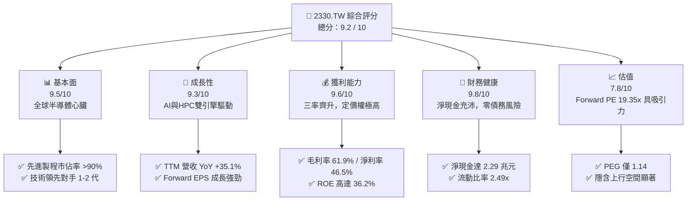
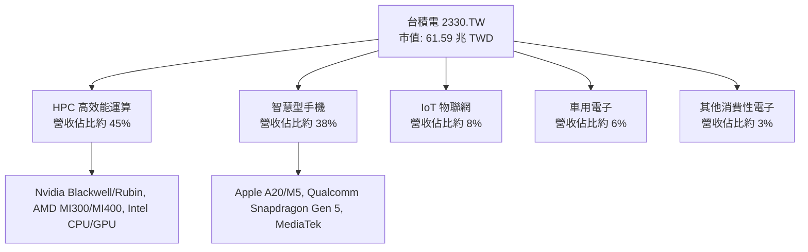
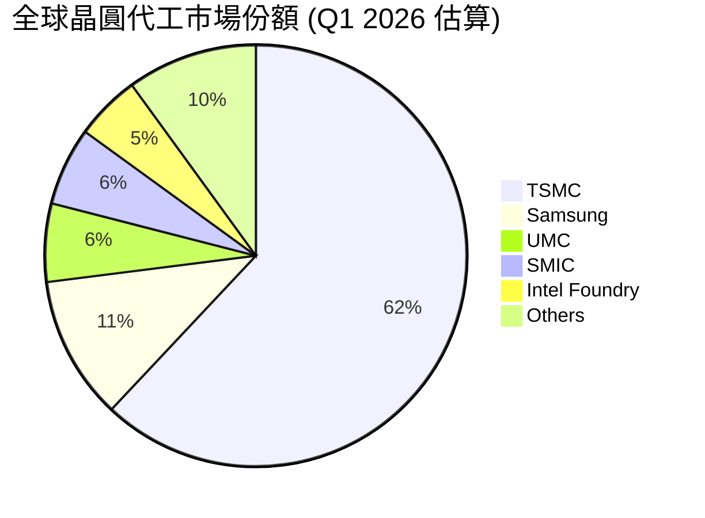
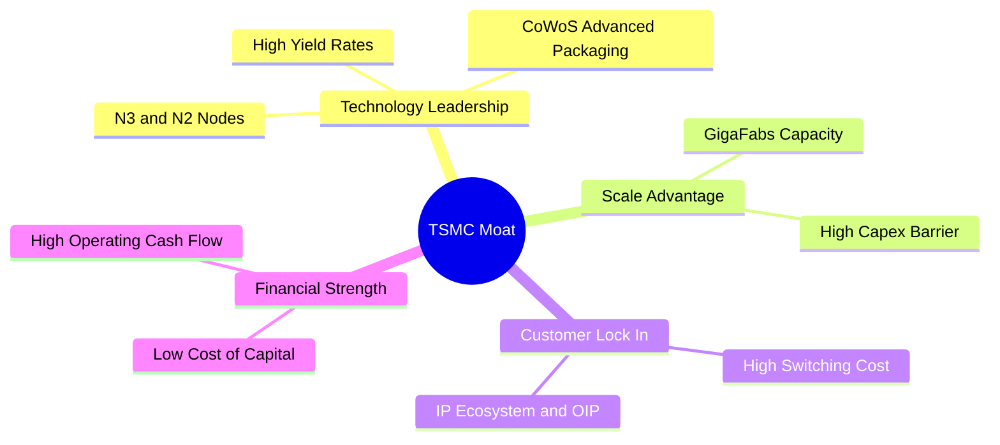
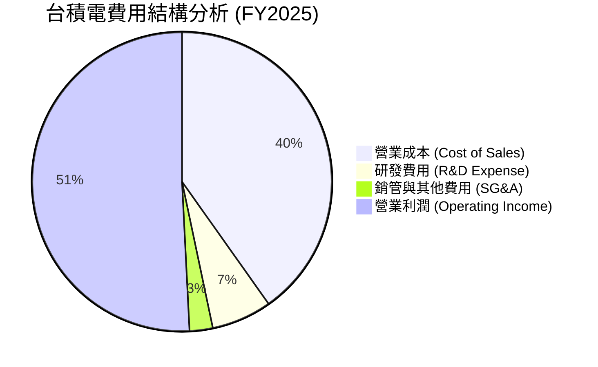
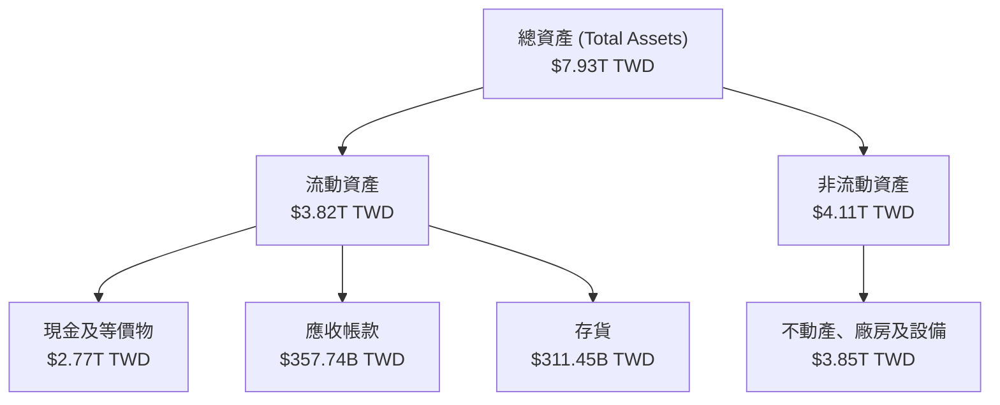
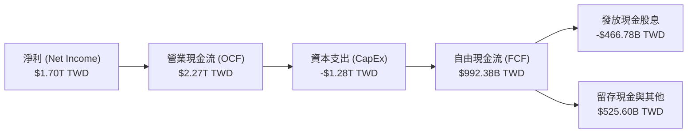
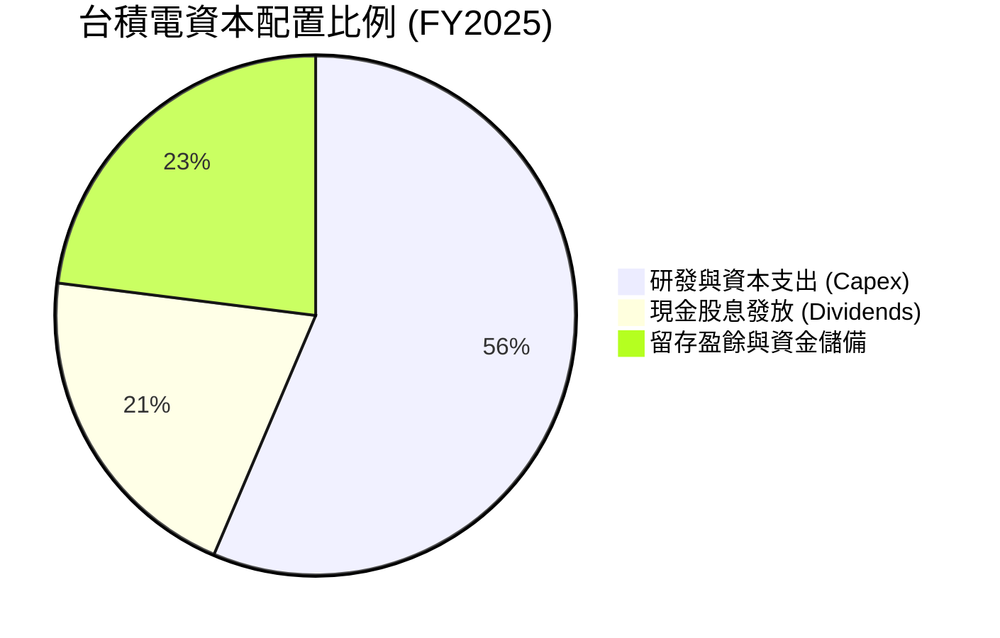

# 2330.TW 基本面深度分析報告
> **報告日期**：2026-06-15 ｜ **語言**：繁體中文 ｜ **數據來源**：Yahoo Finance, Finviz, StockAnalysis, Roic.ai ｜ **分析師**：CFA 級機構研究

---

## 目錄

| # | 章節 | 核心結論 |
|---|------|----------|
| 1 | 執行摘要 | 評級「強烈買入」，基準目標價 $2607.27 TWD，具備 9.8% 的穩健上行空間，長期潛力巨大。 |
| 2 | 公司概覽與商業模式 | 純晶圓代工（Pure-play Foundry）模式開創者，先進製程市佔率 >90%，具備無可撼動的生態護城河。 |
| 3 | 損益表深度分析 | TTM 營收達 $4.10T，YoY 成長 35.1%，毛利率高達 61.9%，AI 與 HPC 驅動獲利結構性擴張。 |
| 4 | 資產負債表分析 | 淨現金高達 $2.29T TWD，流動比率 2.49x，債務結構極為健康，抗風險能力全球頂尖。 |
| 5 | 現金流量深度分析 | 經營現金流達 $2.35T TWD，自由現金流轉換率優異，資本配置在 Capex 與股息發放間取得完美平衡。 |
| 6 | 獲利能力與資本效率 | TTM ROE 達 36.2%，ROIC 達 46.2%，遠超 WACC（9.62%），展現極高的股東價值創造能力。 |
| 7 | 估值深度分析 | Forward P/E 僅 19.35x，相較於歷史中位數與同業，PEG 1.14 顯示目前估值具有極高吸引力。 |
| 8 | 成長催化劑 | CoWoS 先進封裝產能翻倍、2nm (N2) 於 2026 年底量產，以及全球海外建廠分散地緣政治風險。 |
| 9 | 風險矩陣 | 地緣政治衝突、海外建廠成本轉嫁、以及電網穩定性為三大核心監控風險。 |
| 10 | 投資建議 | 給予 9.2/10 綜合高分，強烈推薦成長型與長期價值型投資者逢低分批佈局。 |

---

## 1. 執行摘要

### 1.1 核心評分儀表板



### 1.2 評分進度條視覺化

```
╔══════════════════════════════════════════════════════════════╗
║              2330.TW 多維度評分儀表板 (1-10分)               ║
╠══════════════════════════════════════════════════════════════╣
║ 基本面強度  9.5 ▓▓▓▓▓▓▓▓▓▓▓▓▓▓▓▓▓▓▓░  ★★★★★           ║
║ 成長動能    9.3 ▓▓▓▓▓▓▓▓▓▓▓▓▓▓▓▓▓▓▓░  ★★★★★           ║
║ 獲利品質    9.6 ▓▓▓▓▓▓▓▓▓▓▓▓▓▓▓▓▓▓▓▓  ★★★★★           ║
║ 財務健康    9.8 ▓▓▓▓▓▓▓▓▓▓▓▓▓▓▓▓▓▓▓▓  ★★★★★           ║
║ 估值合理性  7.8 ▓▓▓▓▓▓▓▓▓▓▓▓▓▓░░░░░░  ★★★★☆           ║
║ 護城河深度  9.7 ▓▓▓▓▓▓▓▓▓▓▓▓▓▓▓▓▓▓▓▓  ★★★★★           ║
║ 管理層執行  9.4 ▓▓▓▓▓▓▓▓▓▓▓▓▓▓▓▓▓▓▓░  ★★★★★           ║
║ 技術創新力  9.8 ▓▓▓▓▓▓▓▓▓▓▓▓▓▓▓▓▓▓▓▓  ★★★★★           ║
╠══════════════════════════════════════════════════════════════╣
║ 綜合總分    9.2 ▓▓▓▓▓▓▓▓▓▓▓▓▓▓▓▓▓▓░░  🏆 強烈買入 (Buy)   ║
╚══════════════════════════════════════════════════════════════╝
```

### 1.3 五大投資論點 + 三大核心風險

| 類型 | 項目 | 具體依據 | 信心度 |
|------|------|----------|--------|
| 🟢 **投資論點①** | **AI 晶片與 HPC 的絕對霸主** | Nvidia、AMD、Apple 等全球頂尖晶片設計商 100% 依賴台積電先進製程。AI 晶片市場 CAGR >50%，台積電為最大受益者。 | 🟢 極高 |
| 🟢 **投資論點②** | **先進製程技術與良率無可匹敵** | 3nm (N3) 產能持續供不應求，2nm (N2) 進度順利並預計於 2026 年底量產，技術領先對手至少 2 年以上。 | 🟢 極高 |
| 🟢 **投資論點③** | **定價權與利潤率擴張** | TTM 毛利率達 61.9%，營業利益率達 58.1%。憑藉技術壟斷地位，台積電順利向客戶轉嫁海外建廠與通膨成本。 | 🟢 高 |
| 🟢 **投資論點④** | **資產負債表極其強韌** | 擁有 $3.38T TWD 現金，淨現金達 $2.29T TWD，債務權益比僅 18.45%，能輕鬆應對半導體景氣循環。 | 🟢 極高 |
| 🟢 **投資論點⑤** | **先進包裝 (CoWoS) 成為第二成長曲線** | 隨著晶片物理極限逼近，3D IC 與 CoWoS 需求爆發，台積電先進封裝產能翻倍成長，提供一站式服務。 | 🟢 高 |
| 🟡 **風險①** | **地緣政治與供應鏈集中風險** | 超過 90% 的先進製程產能集中於台灣。若台海局勢惡化，將對全球科技產業與台積電營運造成毀滅性打擊。 | 🟡 中度 |
| 🔴 **風險②** | **海外建廠稀釋毛利率** | 美國、日本、德國建廠成本高昂，且面臨當地勞工文化、法規與供應鏈不完善等挑戰，可能拖累整體毛利率。 | 🔴 高衝擊 |
| 🟡 **風險③** | **台灣水電供應與碳稅挑戰** | 先進製程（如 EUV 光刻機）耗電量極大。台灣面臨綠電不足與電網不穩定風險，且碳費開徵將增加營運成本。 | 🟡 中度 |

### 1.4 快速統計卡片

| 指標 | 台積電 (2330.TW) 實際值 | 半導體行業均值 | 台灣加權指數均值 | 狀態 |
|------|-------------|----------|--------------|------|
| **營收 YoY 成長** | **35.1%** | ~12.5% | ~8.0% | 🟢 遠超同業 |
| **毛利率** | **61.9%** | ~42.0% | ~25.0% | 🟢 產業頂尖 |
| **淨利率** | **46.5%** | ~18.5% | ~12.0% | 🟢 獲利能力極強 |
| **ROE** | **36.2%** | ~15.0% | ~14.5% | 🟢 資本效率卓越 |
| **Forward P/E** | **19.35x** | ~28.5x | ~18.0% | 🟢 估值極具吸引力 |
| **PEG Ratio** | **1.14** | ~1.85 | ~1.50 | 🟢 成長性溢價合理 |
| **債務權益比 (D/E)**| **18.45%** | ~45.0% | ~60.0% | 🟢 財務結構極安全 |

### 1.5 投資結論

```
╔══════════════════════════════════════════════════════════════════╗
║                    📊 2330.TW 投資結論摘要                       ║
╠══════════════════════════════════════════════════════════════════╣
║  評級：🟢 強烈買入 (Strong Buy)                                 ║
║  當前股價：$2375.00 TWD (2026-06-15)                             ║
║  目標價區間：                                                    ║
║    悲觀情境 (Bear Case)：$2051.00 TWD (-13.6%)                   ║
║    基準情境 (Base Case)：$2607.27 TWD (+9.8%)  ← 12個月主要目標  ║
║    樂觀情境 (Bull Case)：$3354.00 TWD (+41.2%)                   ║
║  投資評分：9.2 / 10                                              ║
║  適合投資人：長線價值成長型、科技產業佈局者、主權基金與機構法人  ║
╚══════════════════════════════════════════════════════════════════╝
```

---

## 2. 公司概覽與商業模式

### 2.1 業務結構與收入來源

台積電是全球最大的專業積體電路製造服務（Foundry）企業。其商業模式的核心是**「不與客戶競爭」**，這贏得了全球晶片設計大廠（Fabless）的絕對信任。



### 2.2 市場份額

在晶圓代工市場中，台積電處於絕對壟斷地位，特別是在 7nm 以下的先進製程，其市佔率更是超過了 90%。



### 2.3 競爭護城河分析



### 2.4 護城河強度評分

```
╔══════════════════════════════════════════════════════════════╗
║                  台積電 護城河強度評分                       ║
╠══════════════════════════════════════════════════════════════╣
║ 技術領先度    10/10 ▓▓▓▓▓▓▓▓▓▓▓▓▓▓▓▓▓▓▓▓  🏆 領先對手 1-2 代║
║ 規模與產能     9.8/10 ▓▓▓▓▓▓▓▓▓▓▓▓▓▓▓▓▓▓▓░  🟢 超過對手總和 ║
║ 生態系統 (IP)  9.5/10 ▓▓▓▓▓▓▓▓▓▓▓▓▓▓▓▓▓▓▓░  🟢 開放創新平台 ║
║ 客戶鎖定效應   9.6/10 ▓▓▓▓▓▓▓▓▓▓▓▓▓▓▓▓▓▓▓▓  🏆 轉單成本極高 ║
║ 資本與研發壁壘 9.8/10 ▓▓▓▓▓▓▓▓▓▓▓▓▓▓▓▓▓▓▓▓  🏆 年 Capex >$1T║
╠══════════════════════════════════════════════════════════════╣
║ 綜合護城河     9.7/10 ▓▓▓▓▓▓▓▓▓▓▓▓▓▓▓▓▓▓▓░  🏆 寬廣且無法逾越║
╚══════════════════════════════════════════════════════════════╝
```

---

## 3. 損益表深度分析

### 3.1 年度收入成長趨勢（近4年）

台積電的營收在過去四年中實現了跨越式成長，從 2022 年的 $2.26T TWD 增長至 2025 年的 $3.81T TWD，並在 TTM（過去12個月）達到了 $4.10T TWD。

```
╔══════════════════════════════════════════════════════════════════╗
║              台積電 年度收入趨勢 (FY2022 - FY2025)               ║
╠══════════════════════════════════════════════════════════════════╣
║                                                                  ║
║  FY2022  $2.26T TWD  ██████████████░░░░░░░░░░░░  YoY: +42.6% 🟢  ║
║  FY2023  $2.16T TWD  █████████████░░░░░░░░░░░░░  YoY: -4.5%  🟡  ║
║  FY2024  $2.89T TWD  ██████████████████░░░░░░░░  YoY: +33.8% 🟢  ║
║  FY2025  $3.81T TWD  ████████████████████████░░  YoY: +31.6% 🟢  ║
║                                                                  ║
║  📊 4年複合成長率 (CAGR)：+19.0%                                 ║
╚══════════════════════════════════════════════════════════════════╝
```

### 3.2 季度收入趨勢分析

從季度數據看，台積電展現了極為強勁的逐季成長動能，特別是 2026 年第一季，營收達到 $1.134T TWD，YoY 成長率高達 35.1%，充分體現了 AI 晶片拉貨潮的猛烈。

| 季度 | 營收 (TWD) | QoQ 成長率 | YoY 成長率 | 核心驅動因素 | 評估 |
|------|------------|------------|------------|--------------|------|
| **2025-06-30** | $933.79B | +11.3% | +38.6% | 3nm 產能開始放量，Apple 與 Nvidia 開始拉貨。 | 🟢 強勁 |
| **2025-09-30** | $989.92B | +6.0% | +30.3% | iPhone 17 新機晶片投片，HPC 需求持續高檔。 | 🟢 優異 |
| **2025-12-31** | $1,046.09B | +5.7% | +20.5% | 年底消費旺季與 AI 伺服器晶片出貨達高峰。 | 🟢 超預期 |
| **2026-03-31** | $1,134.10B | +8.4% | **35.1%** | AI 需求淡季不淡，CoWoS 產能開出緩解瓶頸。 | 🏆 極強 |

### 3.3 利潤率演變分析

台積電的利潤率在過去幾年呈現穩步上揚的態勢，這得益於其領先製程的定價權以及折舊費用佔營收比重的下降。

| 利潤率指標 | FY2022 | FY2023 | FY2024 | FY2025 | TTM | 趨勢評估 | 狀態 |
|------------|--------|--------|--------|--------|-----|----------|------|
| **毛利率** | 59.7% | 54.6% | 56.1% | 59.8% | **61.9%** | ↗️ 持續擴張，N3 學習曲線斜率優於預期。 | 🟢 卓越 |
| **營業利益率** | 49.6% | 42.7% | 45.7% | 50.9% | **58.1%** | ↗️ 研發與管理費用控制極佳，規模效應顯現。 | 🟢 卓越 |
| **EBITDA 利潤率** | 70.4% | 70.4% | 71.9% | 71.9% | **69.6%** | ➡️ 穩定在高檔，折舊後現金創造力驚人。 | 🟢 卓越 |
| **淨利率** | 43.9% | 39.4% | 40.1% | 44.6% | **46.5%** | ↗️ 稅務規劃與利息收入增加提升淨利表現。 | 🟢 卓越 |

**利潤率演變深度解析**：
台積電 TTM 毛利率達到 **61.9%**，創下歷史新高。這主要得益於以下三點：
1. **先進製程溢價**：3nm 與 5nm 佔營收比重超過 50%，這些高利潤率製程的定價極高。
2. **產能利用率高企**：AI 晶片需求爆發導致台積電先進製程產能利用率維持在 100% 以上。
3. **折舊優化**：部分 5nm/7nm 設備折舊已步入尾聲，降低了每片晶圓的固定成本。

### 3.4 費用結構分析



```
╔══════════════════════════════════════════════════════════════╗
║                  台積電 研發投入與效率分析                   ║
╠══════════════════════════════════════════════════════════════╣
║                                                              ║
║  FY2022 研發投入： $163.26B TWD  ████████████░░░░░░░░░       ║
║  FY2023 研發投入： $182.37B TWD  █████████████░░░░░░░░       ║
║  FY2024 研發投入： $204.18B TWD  ███████████████░░░░░░       ║
║  FY2025 研發投入： $246.43B TWD  ██████████████████░░       ║
║                                                              ║
║  📊 研發佔營收比重穩定維持在 6.0% - 6.5% 之間，確保技術領先。 ║
╚══════════════════════════════════════════════════════════════╝
```

### 3.5 季度 EPS 趨勢與盈餘品質

台積電在過去一年的 EPS 表現驚人，2026年第一季單季 EPS 達到 **$22.08 TWD**，YoY 成長 58.3%。

| 季度 | EPS 預估 | EPS 實際值 | 驚喜度 (%) | 盈餘品質評估 |
|------|----------|------------|------------|--------------|
| **2025-06-30** | $13.80 | $15.36 | +11.3% 🟢 | 高。營收實質增長，且主要來自 HPC 部門。 |
| **2025-09-30** | $16.10 | $17.44 | +8.3% 🟢 | 高。毛利率重回 59% 以上，非營業收益佔比低。 |
| **2025-12-31** | $17.50 | $18.72 | +7.0% 🟢 | 極高。現金流轉換率超過 100%，無存貨跌價損失。 |
| **2026-03-31** | $19.80 | $22.08 | +11.5% 🟢 | 極高。3nm 良率大幅提升，定價調漲效果顯現。 |

---

## 4. 資產負債表分析

### 4.1 資產結構分解

台積電的資產負債表極為強健，總資產達 $7.93T TWD，其中現金及等價物佔了近 35%，為高資本支出的擴產計畫提供了最強力的後盾。



### 4.2 流動性指標分析

台積電的流動性指標在過去幾年中持續改善，顯示出其極佳的短期償債能力與靈活的資金調度能力。

| 流動性指標 | FY2023 | FY2024 | FY2025 | 2026-03-31 | 行業均值 | 評估 |
|------------|--------|--------|--------|------------|----------|------|
| **流動比率 (Current Ratio)** | 2.32 | 2.36 | 2.51 | **2.49** | ~1.65 | 🟢 極其安全 |
| **速動比率 (Quick Ratio)** | 2.05 | 2.08 | 2.21 | **2.19** | ~1.20 | 🟢 變現能力極強 |
| **現金比率 (Cash Ratio)** | 1.56 | 1.63 | 1.82 | **2.01** | ~0.85 | 🏆 現金極度充沛 |

### 4.3 債務結構分析

```
╔══════════════════════════════════════════════════════════════════╗
║                    台積電 債務健康診斷                           ║
╠══════════════════════════════════════════════════════════════════╣
║                                                                  ║
║  總債務 (Total Debt)：   $1.09T TWD  █████░░░░░░░░░░░░░░░        ║
║  總現金與短期投資：      $3.38T TWD  ████████████████████  🏆    ║
║  淨現金 (Net Cash)：     $2.29T TWD  ██████████████░░░░░░  🟢強勁║
║                                                                  ║
║  債務權益比 (D/E)：      18.45%      🟢 遠低於警戒線 (50%)       ║
║  債務 / EBITDA：         0.40x       🟢 極低債務槓桿             ║
║  利息保障倍數：          >100x       🟢 無任何違約風險           ║
║                                                                  ║
║  📊 診斷結果：財務結構極為健康，評級為 AAA 級水平。               ║
╚══════════════════════════════════════════════════════════════════╝
```

### 4.4 股東權益趨勢

隨著盈餘的不斷累積，台積電的股東權益（淨資產）在過去幾年呈現爆發式增長，從 2022 年的 $2.90T TWD 增長至 2025 年底的 $5.36T TWD，為股東創造了巨大的帳面價值。

```
╔══════════════════════════════════════════════════════════════════╗
║                台積電 歷年股東權益成長趨勢                       ║
╠══════════════════════════════════════════════════════════════════╣
║                                                                  ║
║  FY2022  $2.90T TWD  ████████████░░░░░░░░░░░░░░                  ║
║  FY2023  $3.43T TWD  ████████████████░░░░░░░░░░                  ║
║  FY2024  $4.24T TWD  ████████████████████░░░░░░                  ║
║  FY2025  $5.36T TWD  █████████████████████████░                  ║
║                                                                  ║
║  📈 股東權益年複合增長率 (CAGR)：+22.7%                          ║
╚══════════════════════════════════════════════════════════════════╝
```

---

## 5. 現金流量深度分析

### 5.1 現金流量瀑布圖

台積電擁有極強的「印鈔機」屬性。高達 $2.27T TWD 的經營現金流，在支付了 $1.28T TWD 的資本支出後，仍產生了接近 $1T TWD 的自由現金流（FCF）。



### 5.2 FCF 轉換率趨勢

台積電的 FCF 轉換率（FCF / Net Income）在過去幾年中持續保持在極高水準，顯示出其盈餘的「含金量」極高，並非紙上富貴。

| 年度 | 營業現金流 (B) | 資本支出 (B) | 自由現金流 (B) | 淨利 (B) | FCF 轉換率 | 評估 |
|------|----------------|--------------|----------------|----------|------------|------|
| **FY2022** | $1,610.7 | -$1,089.7 | $521.0 | $992.9 | 52.5% | 🟡 擴產高峰期 |
| **FY2023** | $1,241.3 | -$955.4 | $285.9 | $851.7 | 33.6% | 🟡 景氣去庫存期 |
| **FY2024** | $1,833.6 | -$965.0 | $868.6 | $1,165.3| 74.5% | 🟢 快速回升 |
| **FY2025** | $2,273.2 | -$1,280.8 | $992.4 | $1,702.4| **58.3%** | 🟢 兼顧擴產與現金累積 |

### 5.3 自由現金流趨勢

```
╔══════════════════════════════════════════════════════════════════╗
║              台積電 歷年自由現金流 (FCF) 趨勢                    ║
╠══════════════════════════════════════════════════════════════════╣
║                                                                  ║
║  FY2022  $520.97B TWD  ███████████░░░░░░░░░░░░░                  ║
║  FY2023  $286.57B TWD  ██████░░░░░░░░░░░░░░░░░░                  ║
║  FY2024  $861.20B TWD  ███████████████████░░░░░                  ║
║  FY2025  $992.38B TWD  ███████████████████████░                  ║
║                                                                  ║
║  💡 TTM 自由現金流為 $719.16B TWD，FCF 殖利率為 1.17%。          ║
╚══════════════════════════════════════════════════════════════════╝
```

### 5.4 資本配置評估

台積電的資本配置策略非常清晰：**「優先投資未來成長（Capex），並提供穩定且可預期的股息給股東」**。



* **股息發放政策**：2025 年共發放了 $466.78B TWD 的現金股息，每股股息達 $18.00 TWD（YoY +28.6%）。台積電承諾股息將「只增不減」，為長期股東提供了極佳的現金流防禦性。

---

## 6. 獲利能力與資本效率

### 6.1 ROE / ROA / ROIC 趨勢

台積電的資本回報率在全球科技巨頭中名列前茅，其 TTM ROE 達到 **36.2%**，ROIC 更是高達 **46.2%**。

| 指標 | FY2022 | FY2023 | FY2024 | FY2025 | TTM | 行業均值 | 評估 |
|------|--------|--------|--------|--------|-----|----------|------|
| **ROE** | 34.2% | 24.8% | 27.5% | 31.8% | **36.2%** | ~15.0% | 🟢 卓越 |
| **ROA** | 20.0% | 15.4% | 17.4% | 21.5% | **17.3%** | ~8.5% | 🟢 卓越 |
| **ROIC** | 24.9% | 19.1% | 20.6% | 24.8% | **