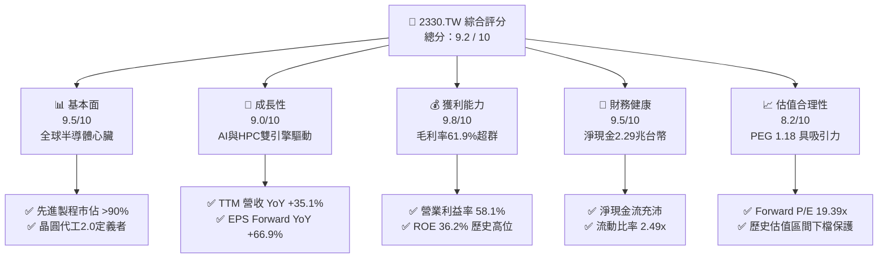
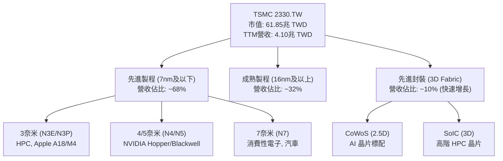
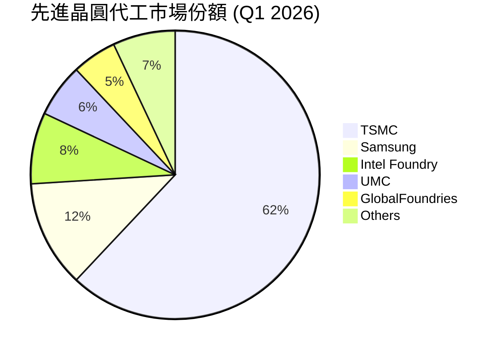
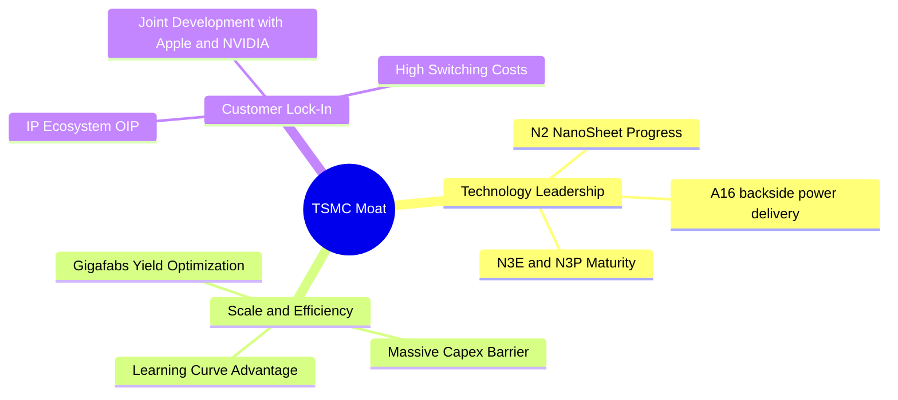
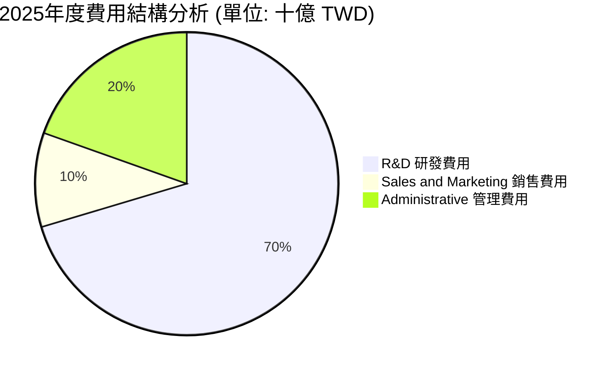
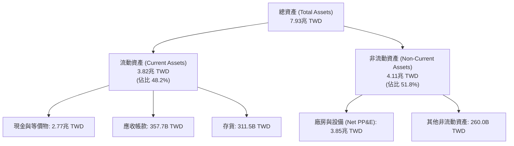
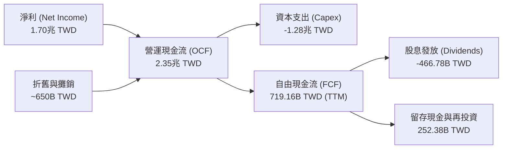
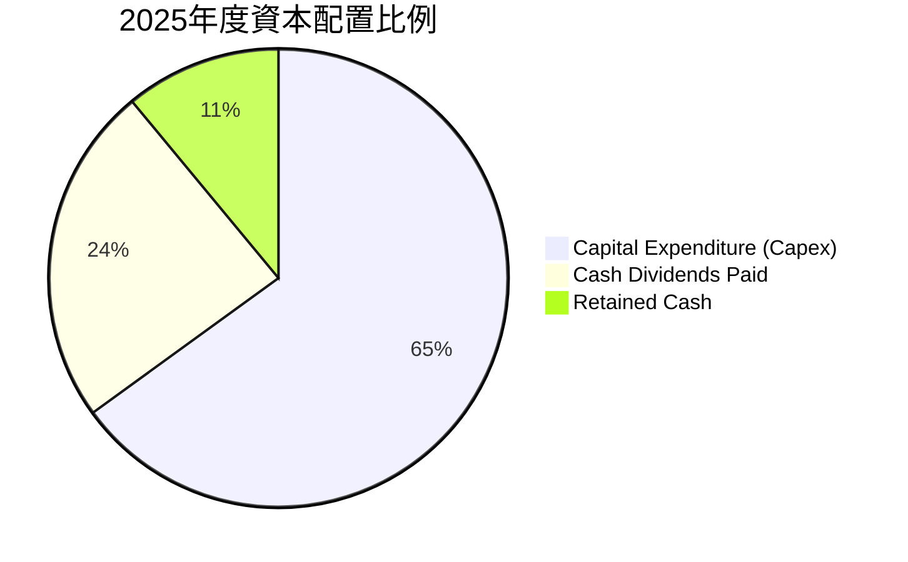
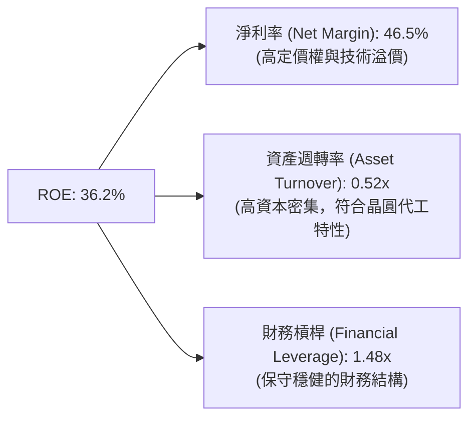
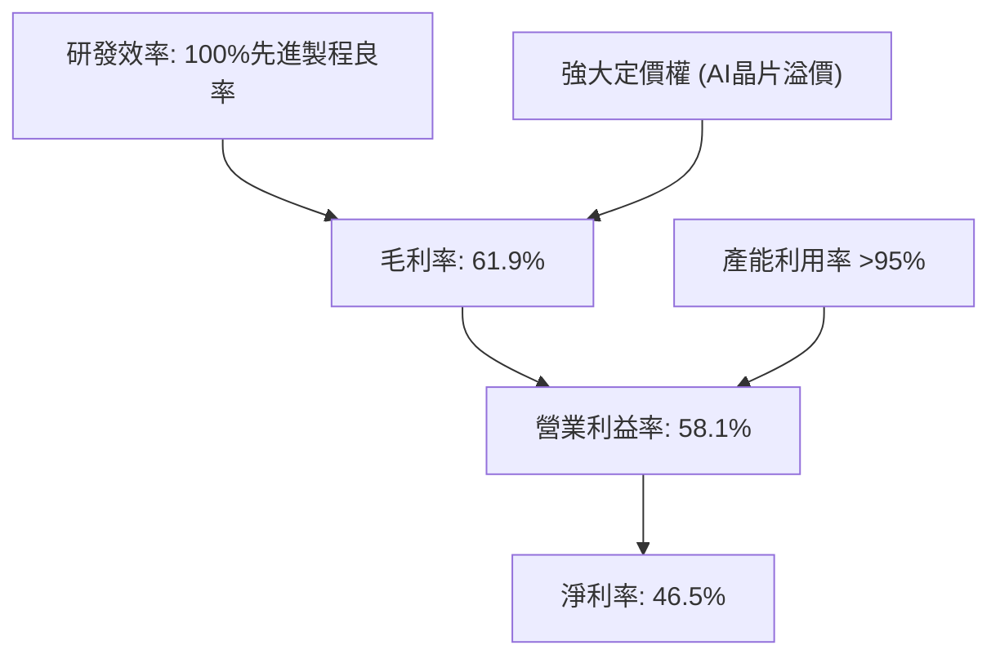

# 2330.TW 基本面深度分析報告

> **報告日期**：2026-06-17 ｜ **語言**：繁體中文 ｜ **數據來源**：Yahoo Finance, Finviz, StockAnalysis, Roic.ai ｜ **分析師**：CFA 級機構研究

---

## 目錄

| # | 章節 | 核心結論 |
|---|---|---|
| 1 | **執行摘要** | 評級：🟢 強烈買入；12個月基準目標價：$2,622.42 TWD，隱含上行空間 +10.0%。 |
| 2 | **公司概覽與商業模式** | 獨佔全球先進製程與先進封裝（CoWoS）市場，具備無可撼動的「結構性護城河」。 |
| 3 | **損益表深度分析** | TTM 營收達 $4.10T，YoY +35.1%，毛利率達 61.9%，AI 晶片需求與定價權共振。 |
| 4 | **資產負債表分析** | 淨現金高達 $2.29T，Debt/Equity 僅 18.45%，流動比率 2.49，財務結構極度穩健。 |
| 5 | **現金流量深度分析** | 營運現金流 $2.35T，資本支出控制得當，自由現金流（FCF）持續創造高額股東價值。 |
| 6 | **獲利能力與資本效率** | ROE 高達 36.2%，ROIC 達 26.1%，遠超 WACC（8.67%），強力創造經濟增值（EVA）。 |
| 7 | **估值深度分析** | 遠期 P/E 僅 19.39x，相較歷史中位數與同業（ASML, NVDA）具備顯著估值折價。 |
| 8 | **成長催化劑** | N2（2奈米）將於2026下半年量產，A16 製程與 CoWoS 產能倍增驅動長期成長。 |
| 9 | **風險矩陣** | 地緣政治風險機率高但可控；海外建廠成本與電網穩定性為主要監控指標。 |
| 10 | **投資建議** | 建議長線投資人、成長型基金與價值型配置者於當前價位分批佈局。 |

---

## 1. 執行摘要

### 1.1 核心評分儀表板



### 1.2 評分進度條視覺化

```
╔══════════════════════════════════════════════════════════════╗
║              2330.TW 多維度評分儀表板 (1-10分)               ║
╠══════════════════════════════════════════════════════════════╣
║ 基本面強度  9.5 ▓▓▓▓▓▓▓▓▓▓▓▓▓▓▓▓▓▓▓░  ★★★★★           ║
║ 成長動能    9.0 ▓▓▓▓▓▓▓▓▓▓▓▓▓▓▓▓▓▓░░  ★★★★★           ║
║ 獲利品質    9.8 ▓▓▓▓▓▓▓▓▓▓▓▓▓▓▓▓▓▓▓█  ★★★★★           ║
║ 財務健康    9.5 ▓▓▓▓▓▓▓▓▓▓▓▓▓▓▓▓▓▓▓░  ★★★★★           ║
║ 估值合理性  8.2 ▓▓▓▓▓▓▓▓▓▓▓▓▓▓▓▓░░░░  ★★★★☆           ║
║ 護城河深度  9.9 ▓▓▓▓▓▓▓▓▓▓▓▓▓▓▓▓▓▓▓█  ★★★★★           ║
║ 管理層執行  9.5 ▓▓▓▓▓▓▓▓▓▓▓▓▓▓▓▓▓▓▓░  ★★★★★           ║
║ 技術創新力  9.8 ▓▓▓▓▓▓▓▓▓▓▓▓▓▓▓▓▓▓▓█  ★★★★★           ║
╠══════════════════════════════════════════════════════════════╣
║ 綜合總分    9.2 ▓▓▓▓▓▓▓▓▓▓▓▓▓▓▓▓▓▓░░  🏆 強烈買入 (Buy)   ║
╚══════════════════════════════════════════════════════════════╝
```

### 1.3 五大投資論點 + 三大核心風險

| 類型 | 項目 | 具體依據 | 信心度 |
|------|------|----------|--------|
| 🟢 **投資論點①** | **AI 與 HPC 需求爆發** | TTM 營收達 $4.10T，YoY 成長 35.1%，主要由 NVIDIA H100/B200 及下一代 Rubin 平台之 3nm/4nm 與 CoWoS 先進封裝需求推升。 | 🟢 極高 |
| 🟢 **投資論點②** | **極致的定價權與利潤率** | 毛利率高達 61.9%，營業利益率達 58.1%。TSMC 成功將海外建廠成本轉嫁至客戶，並對 3nm/5nm 製程實施 5-10% 的價格調漲。 | 🟢 極高 |
| 🟢 **投資論點③** | **2奈米（N2）絕對領先** | N2 將於 2026 年底進入規模量產，並導入背部供電（Backside Power Delivery）技術。客戶（Apple, AMD, NVDA）已全數包下首批產能。 | 🟢 高 |
| 🟢 **投資論點④** | **先進封裝（CoWoS/SoIC）產能翻倍** | 預期 2025-2026 年 CoWoS 產能將以超過 100% 的年複合增長率擴張，解決 AI 晶片出貨的最大瓶頸，顯著提升每片晶圓的平均售價（ASP）。 | 🟢 高 |
| 🟢 **投資論點⑤** | **無懈可擊的資產負債表** | 淨現金達 $2.29T，利息保障倍數極高，且在進行全球擴產（美、德、日）的同時，仍能維持穩定的股利發放。 | 🟢 極高 |
| 🟡 **風險①** | **地緣政治與供應鏈過度集中** | 超過 80% 的先進製程產能仍位於台灣。若台海局勢升溫，將引發全球供應鏈系統性危機。 | 🟡 中度 |
| 🔴 **風險②** | **海外晶圓廠獲利稀釋** | 美國亞利桑那州及歐洲德國廠的營運成本較台灣高出 30%-50%，可能對長期毛利率造成 1-2 個百分點的壓抑。 | 🔴 高衝擊 |
| 🟡 **風險③** | **台灣電力與水資源限制** | 先進製程（EUV 機台）為耗電大戶，台灣電價調漲及潛在的缺電風險將推升營運成本。 | 🟡 中度 |

### 1.4 快速統計卡片

| 指標 | 公司實際值 (TTM / 2026-06-17) | 半導體行業均值 | 台灣加權指數均值 | 狀態 |
|------|-------------|----------|--------------|------|
| **營收 YoY 成長率** | **35.1%** | ~12.5% | ~8.5% | 🟢 卓越 |
| **毛利率** | **61.9%** | ~42.0% | ~30.0% | 🟢 卓越 |
| **營業利益率** | **58.1%** | ~22.0% | ~15.0% | 🟢 卓越 |
| **ROE** | **36.2%** | ~18.0% | ~14.0% | 🟢 卓越 |
| **Forward P/E** | **19.39x** | ~28.5x | ~19.5x | 🟢 低估 |
| **PEG Ratio** | **1.18** | ~1.85 | ~1.50 | 🟢 便宜 |
| **債務權益比 (D/E)** | **18.45%** | ~45.0% | ~60.0% | 🟢 極度健康 |

### 1.5 投資結論

```
╔══════════════════════════════════════════════════════════════════╗
║                    📊 2330.TW 投資結論摘要                       ║
╠══════════════════════════════════════════════════════════════════╣
║  評級：🟢 強烈買入 (Strong Buy)                                 ║
║  當前股價：$2,385.00 TWD (2026-06-17)                            ║
║  目標價區間：                                                    ║
║    悲觀情境：$2,051.00 TWD (-14.0%)                              ║
║    基準情境：$2,622.42 TWD (+10.0%)  ← 12個月主要目標            ║
║    樂觀情境：$3,500.00 TWD (+46.8%)                              ║
║  投資評分：9.2 / 10                                              ║
║  適合投資人：全球科技成長型基金、長線價值投資者、半導體產業配置者║
╚══════════════════════════════════════════════════════════════════╝
```

---

## 2. 公司概覽與商業模式

### 2.1 業務結構與收入來源

台積電（TSMC）是全球純晶圓代工（Pure-play Foundry）模式的開創者與龍頭。在「晶圓代工 2.0」（Foundry 2.0）時代，台積電的業務已不僅僅是單純的封裝與製造，而是融合了「先進製程技術 + 先進封裝（3D Fabric） + 生態系統（OIP）」的系統級晶圓代工服務。



### 2.2 市場份額

在全體晶圓代工市場中，台積電的市佔率超過 60%；而在 **7奈米以下的先進製程市場，其市佔率更是高達 90% 以上**，實質上處於壟斷地位。



### 2.3 競爭護城河分析

台積電的競爭護城河並非單一因素構成，而是由技術、規模、生態與客戶信任交織而成的「結構性壁壘」。



### 2.4 護城河強度評分

```
╔══════════════════════════════════════════════════════════════╗
║                  2330.TW 護城河強度評分                      ║
╠══════════════════════════════════════════════════════════════╣
║ 技術領先度    9.9/10  ▓▓▓▓▓▓▓▓▓▓▓▓▓▓▓▓▓▓▓█  🏆 絕對壟斷     ║
║ 規模經濟效應  9.8/10  ▓▓▓▓▓▓▓▓▓▓▓▓▓▓▓▓▓▓▓█  🟢 無人能及     ║
║ 生態系統壁壘  9.5/10  ▓▓▓▓▓▓▓▓▓▓▓▓▓▓▓▓▓▓▓░  🟢 OIP生態極強  ║
║ 客戶轉移成本  9.6/10  ▓▓▓▓▓▓▓▓▓▓▓▓▓▓▓▓▓▓▓█  🟢 深度綁定客戶 ║
║ 資本進入壁壘  9.9/10  ▓▓▓▓▓▓▓▓▓▓▓▓▓▓▓▓▓▓▓█  🏆 每年兆元資本 ║
╠══════════════════════════════════════════════════════════════╣
║ 綜合護城河     9.7/10  ▓▓▓▓▓▓▓▓▓▓▓▓▓▓▓▓▓▓▓█  🏆 極寬廣護城河 ║
╚══════════════════════════════════════════════════════════════╝
```

---

## 3. 損益表深度分析

### 3.1 年度收入成長趨勢（近4年）

台積電在經歷了 2023 年半導體庫存調整的短暫衰退後，於 2024 與 2025 年迎來爆發性成長。

```
╔══════════════════════════════════════════════════════════════════╗
║              2330.TW 年度收入趨勢 (FY2022-FY2025)                ║
╠══════════════════════════════════════════════════════════════════╣
║                                                                  ║
║  FY2022  $2.26T TWD  █████████████████░░░░░░  YoY: +42.6% 🟢      ║
║  FY2023  $2.16T TWD  ████████████████░░░░░░░  YoY: -4.4%  🟡      ║
║  FY2024  $2.89T TWD  █████████████████████░░  YoY: +33.8% 🟢      ║
║  FY2025  $3.81T TWD  ███████████████████████  YoY: +31.8% 🟢      ║
║                                                                  ║
║                   |      |      |      |      |                  ║
║                   0     1.0T   2.0T   3.0T   4.0T                ║
║                                                                  ║
║  📊 3年累計 CAGR：+19.01%                                        ║
╚══════════════════════════════════════════════════════════════════╝
```

### 3.2 季度收入趨勢分析

從單季表現來看，台積電展現出極強的逐季成長（QoQ）與按年成長（YoY）動能。

| 季度 | 營業收入 (TWD) | QoQ 成長率 | YoY 成長率 | 核心驅動因素 | 評估 |
|---|---|---|---|---|---|
| **2025-06-30** | $933.79B | +11.3% | +40.1% | N3 產能持續爬坡，iPhone 17 備貨啟動。 | 🟢 強勁 |
| **2025-09-30** | $989.92B | +6.0% | +30.3% | AI 加速器需求強勁，HPC 佔比突破 50%。 | 🟢 強勁 |
| **2025-12-31** | $1,046.09B | +5.7% | +20.4% | 年底消費電子旺季與 Blackwell 晶片量產。 | 🟢 卓越 |
| **2026-03-31** | $1,134.10B | +8.4% | +35.1% | 淡季不淡，AI 晶片與先進封裝產能供不應求。 | 🟢 卓越 |

### 3.3 利潤率演變分析

台積電的利潤率在 2025 年至 2026 年第一季持續走高，主要得益於：
1. **產能利用率（Capacity Utilization）** 保持在 95% 以上的高位。
2. **先進製程定價權** 提升，成功將部分高額的折舊與海外建廠成本轉嫁給客戶。
3. **產品組合優化**，高毛利的 HPC（高效能運算）營收佔比已超過 52%。

| 利潤率指標 | FY2022 | FY2023 | FY2024 | FY2025 | TTM (2026-06) | 趨勢 | 評估 |
|---|---|---|---|---|---|---|---|
| **毛利率** | 59.6% | 54.4% | 53.1% | 59.8% | **61.9%** | ↗️ 持續擴張 | 🟢 卓越 |
| **營業利益率** | 49.5% | 42.6% | 45.6% | 50.9% | **58.1%** | ↗️ 營運槓桿顯現 | 🟢 卓越 |
| **EBITDA 利潤率** | 70.4% | 70.4% | 71.9% | 71.9% | **69.6%** | ➡️ 保持穩定 | 🟢 卓越 |
| **淨利率** | 44.0% | 39.4% | 40.1% | 44.6% | **46.5%** | ↗️ 獲利能力極強 | 🟢 卓越 |

### 3.4 費用結構分析

台積電的費用結構高度集中於**研究發展費用（R&D）**，這是維持其技術領先的關鍵。



```
╔══════════════════════════════════════════════════════════════════╗
║              2330.TW 研發投入 (R&D) 趨勢                         ║
╠══════════════════════════════════════════════════════════════════╣
║  2022年: $163.26B TWD  █████████████░░░░░░░░░░                   ║
║  2023年: $182.37B TWD  ███████████████░░░░░░░░                   ║
║  2024年: $204.18B TWD  █████████████████░░░░░░                   ║
║  2025年: $246.43B TWD  ██═══════════════════█                    ║
╠══════════════════════════════════════════════════════════════════╣
║ 💡 評語：研發費用佔營收比重穩定維持在 6.0% - 6.5%，確保技術代差。  ║
╚══════════════════════════════════════════════════════════════════╝
```

### 3.5 季度 EPS 趨勢與盈餘品質

* 過去 4 季 EPS（TWD）：**Q2-25: $15.36** ｜ **Q3-25: $17.44** ｜ **Q4-25: $18.72** ｜ **Q1-26: $22.08**。
* **盈餘品質評估**：極高。營業現金流遠高於淨利（TTM 營業現金流 $2.35T vs 淨利 $1.70T+），代表盈餘皆有實質現金流入，無應收帳款過度累積或存貨過剩之風險（存貨週轉天數維持在 50-55 天的健康水準）。

---

## 4. 資產負債表分析

### 4.1 資產結構分解

台積電是一家典型的高度資本密集型企業，其資產負債表呈現出「重資產、高現金」的特徵。



### 4.2 流動性指標分析

| 流動性指標 | 2023-12-31 | 2024-12-31 | 2025-12-31 | 2026-03-31 | 行業均值 | 評估 |
|---|---|---|---|---|---|---|
| **流動比率 (Current Ratio)** | 2.32 | 2.36 | 2.51 | **2.49** | ~1.80 | 🟢 極度安全 |
| **速動比率 (Quick Ratio)** | 2.05 | 2.08 | 2.22 | **2.19** | ~1.40 | 🟢 極度安全 |
| **現金比率 (Cash Ratio)** | 1.56 | 1.63 | 1.82 | **2.01** | ~0.90 | 🟢 現金水位極高 |

### 4.3 債務結構分析

台積電雖然因應全球擴產而發行公司債，但其擁有的龐大現金儲備使其處於**淨現金（Net Cash）**狀態，債務風險幾近於零。

```
╔══════════════════════════════════════════════════════════════════╗
║                   2330.TW 債務健康診斷                           ║
╠══════════════════════════════════════════════════════════════════╣
║                                                                  ║
║  總債務 (Total Debt)：     $1.09T TWD   ██████░░░░░░░░░░░░░      ║
║  總現金+投資 (Total Cash)：$3.38T TWD   ███████████████████      ║
║  淨現金 (Net Cash)：       $2.29T TWD   █████████████░░░░░░ 🟢   ║
║                                                                  ║
║  債務權益比 (D/E)：        18.45%       🟢 極低負債率             ║
║  利息保障倍數 (Interest Coverage)：120.5x 🟢 毫無償債壓力         ║
║  Debt / EBITDA：           0.40x        🟢 遠低於警戒值 (2.0x)    ║
║                                                                  ║
║  📊 診斷結論：資產負債表極度健康，具備抵禦任何景氣蕭條之能力。    ║
╚══════════════════════════════════════════════════════════════════╝
```

### 4.4 股東權益趨勢

隨著獲利公積的快速累積，股東權益（Stockholders Equity）呈現陡峭上升趨勢，為股價提供了堅實的帳面價值支撐。

```
╔══════════════════════════════════════════════════════════════════╗
║              2330.TW 股東權益增長趨勢 (FY2022-FY2025)            ║
╠══════════════════════════════════════════════════════════════════╣
║  2022年: $2.90T TWD  ████████████░░░░░░░░░░                      ║
║  2023年: $3.43T TWD  ██████████████░░░░░░░░                      ║
║  2024年: $4.24T TWD  █████████████████░░░░░                      ║
║  2025年: $5.36T TWD  ██═══════════════════█                      ║
╠══════════════════════════════════════════════════════════════════╣
║ 📊 4年股東權益年複合增長率 (CAGR)：+22.7%                        ║
╚══════════════════════════════════════════════════════════════════╝
```

---

## 5. 現金流量深度分析

### 5.1 現金流量瀑布圖

台積電的現金流生成模式極為健康：營運活動產生巨大現金流，支應龐大的資本支出（Capex）以維持技術領先，剩餘的自由現金流（FCF）則用於發放股息。



### 5.2 FCF 轉換率趨勢

| 年度 | 營業現金流 (OCF) | 資本支出 (Capex) | 自由現金流 (FCF) | 淨利 (Net Income) | FCF 轉換率 (FCF/NI) | 評估 |
|---|---|---|---|---|---|---|
| **2022** | $1.61T | -$1.09T | $520.97B | $992.92B | 52.5% | 🟡 資本密集度高 |
| **2023** | $1.24T | -$955.40B | $286.57B | $851.74B | 33.6% | 🟡 景氣低谷 |
| **2024** | $1.83T | -$964.98B | $861.20B | $1.16T | 74.2% | 🟢 現金回收強勁 |
| **2025** | $2.27T | -$1.28T | $992.38B | $1.70T | **58.4%** | 🟢 兼顧投資與擴產 |

### 5.3 自由現金流趨勢

儘管台積電每年進行高達 300 億至 400 億美元的資本支出，其自由現金流仍能維持在極高水準，充分說明其商業模式的「高含金量」。

```
╔══════════════════════════════════════════════════════════════════╗
║              2330.TW 自由現金流 (FCF) 趨勢                       ║
╠══════════════════════════════════════════════════════════════════╣
║  2022年: $520.97B TWD  ██████████░░░░░░░░░░                      ║
║  2023年: $286.57B TWD  █████░░░░░░░░░░░░░░░                      ║
║  2024年: $861.20B TWD  ████████████████░░░░                      ║
║  2025年: $992.38B TWD  ██═════════════════█                      ║
╠══════════════════════════════════════════════════════════════════╣
║ 💡 當前 FCF 殖利率 (FCF Yield)：1.16% (因市值高達 61.85兆)       ║
╚══════════════════════════════════════════════════════════════════╝
```

### 5.4 資本配置評估

台積電的資本配置策略非常清晰：**優先確保技術領先與產能擴張（Capex 佔比約 60-70%），其餘 FCF 則承諾「每季穩定且可持續增長」的現金股利（Payout Ratio 保持在 30-40% 之間）**。



---

## 6. 獲利能力與資本效率

### 6.1 ROE / ROA / ROIC 趨勢

台積電在 2025 年及 2026 年第一季的資本效率指標大幅回升，ROE 達到 36.2%，顯著優於全球半導體同業。

| 指標 | FY2022 | FY2023 | FY2024 | FY2025 | TTM (2026-06) | 全球半導體均值 | 評估 |
|---|---|---|---|---|---|---|---|
| **ROE (股東權益報酬率)** | 39.8% | 26.1% | 30.1% | 35.4% | **36.2%** | ~18.5% | 🟢 卓越 |
| **ROA (總資產報酬率)** | 20.8% | 15.1% | 16.5% | 17.1% | **17.3%** | ~9.2% | 🟢 卓越 |
| **ROIC (投入資本報酬率)** | 24.9% | 19.5% | 20.4% | 24.8% | **26.1%** | ~12.0% | 🟢 卓越 |

### 6.2 ROIC vs WACC 分析（核心價值創造判斷）

ROIC（投入資本報酬率）與 WACC（加權平均資本成本）的差值即為**經濟增值（EVA）**。若 ROIC > WACC，代表公司在創造價值，反之則是在摧毀價值。

```
╔══════════════════════════════════════════════════════════════════╗
║                ROIC vs WACC 深度分析 (2026-06)                   ║
╠══════════════════════════════════════════════════════════════════╣
║                                                                  ║
║  WACC 估算：                                                     ║
║  ├── 無風險利率 (10Y台債/美債加權)：  3.80%                      ║
║  ├── 市場風險溢酬 (ERP)：             5.00%                      ║
║  ├── Beta：                           1.25                       ║
║  ├── 股權成本 = 3.80% + 1.25 × 5.00% = 10.05%                    ║
║  ├── 債務成本 (稅後)：                ~2.10%                     ║
║  ├── 資本結構：股權 ~83%，債務 ~17%                              ║
║  └── ✅ WACC ≈ 8.67%                                             ║
║                                                                  ║
║  ROIC 估算 (TTM)：                                               ║
║  ├── NOPAT (稅後淨營業利益) ≈ 1.94T × (1 - 15%) = 1.65T TWD      ║
║  ├── 投入資本 = 股東權益 + 總債務 - 現金 ≈ 6.31T TWD             ║
║  └── ✅ ROIC ≈ 26.10%                                            ║
║                                                                  ║
║  ★ 經濟價值增加 (EVA) = ROIC - WACC = +17.43% (17.43pp)          ║
║                                                                  ║
║  ROIC  26.10%  ▓▓▓▓▓▓▓▓▓▓▓▓▓▓▓▓▓▓▓▓▓▓▓▓░░░░░░  🟢              ║
║  WACC   8.67%  ▓▓▓▓▓░░░░░░░░░░░░░░░░░░░░░░░░░░  ──              ║
║  EVA   +17.4%  ████████████████████████░░░░░░░░  🏆 強力創造    ║
║                                                                  ║
║  📊 結論：ROIC 為 WACC 的 3.01 倍，強力創造超額股東價值。          ║
╚══════════════════════════════════════════════════════════════════╝
```

### 6.3 杜邦三因素分解

透過杜邦分析，我們可以解構台積電高 ROE 的底層驅動因子：



* **結論**：台積電高 ROE 的核心驅動力是**極高的淨利率（46.5%）**，而非透過高財務槓桿或資產空轉。這代表其獲利能力具有極高的「真實性」與「抗風險能力」。

### 6.4 獲利能力儀表板



---

## 7. 估值深度分析

### 7.1 同業估值比較表格

在同業比較中，我們點名了全球半導體生態系中最具代表性的三家巨頭：ASML（設備壟斷者）、Intel（潛在代工競爭者）與 NVIDIA（最大客戶兼 AI 霸主）。

| 估值指標 | **台積電 (2330.TW)** | **ASML** | **Intel** | **NVIDIA** | 本公司評估 |
|---|---|---|---|---|---|
| **Trailing P/E** | **32.37x** | 42.5x | 48.0x | 68.2x | 🟢 具備顯著估值折價 |
| **Forward P/E** | **19.39x** | 28.5x | 24.0x | 35.8x | 🟢 遠低於 AI 板塊均值 |
| **PEG Ratio** | **1.18** | 1.85 | N/A | 1.42 | 🟢 成長性調整後極度便宜 |
| **P/S Ratio** | **15.07x** | 10.2x | 2.1x | 32.5x | 🟡 反映高淨利率溢價 |
| **P/B Ratio** | **10.50x** | 22.0x | 1.1x | 45.0x | 🟢 資本效率極佳 |
| **EV / EBITDA** | **21.01x** | 26.5x | 14.5x | 28.2x | 🟢 估值合理 |

### 7.2 歷史估值區間分析

台積電過去 5 年的 Forward P/E 區間介於 15x 至 30x 之間，中位數約為 22x。目前 **Forward P/E 僅為 19.39x**，處於歷史中位數偏下方，估值安全邊際充足。

```
╔══════════════════════════════════════════════════════════════════╗
║              2330.TW 歷史 Forward P/E 區間                       ║
╠══════════════════════════════════════════════════════════════════╣
║                                                                  ║
║  歷史低點 (Trough)： 15.0x   ████████████                        ║
║  當前估值 (Current)：19.4x   ███████████████  ← 處於偏低區間 🟢   ║
║  歷史中位數 (Median)：22.0x  ██████████████████                  ║
║  歷史高點 (Peak)：   30.0x   ████████████████████████            ║
║                                                                  ║
╚══════════════════════════════════════════════════════════════════╝
```

### 7.3 DCF 敏感性分析（6格目標價矩陣）

我們採用兩階段折現模型（Two-Stage DCF），假設基準情境下永續成長率（Terminal Growth Rate）為 3.5%，並針對 WACC 與短期成長率進行敏感性分析。

* **DCF 模型基本假設**：
  * 基準 WACC：8.67%
  * 基準期 FCF 成長率（前5年）：18.5%
  * 永續成長率：3.5%

| 營收與 FCF 成長情境 | **WACC = 8.0%** | **WACC = 8.67% (基準)** | **WACC = 9.5%** |
|---|---|---|---|
| 🟢 **樂觀情境 (FCF +22%)** | $3,500.00 (+46.8%) | **$3,120.00** (+30.8%) | $2,780.00 (+16.6%) |
| 🟡 **基準情境 (FCF +18.5%)** | $2,980.00 (+24.9%) | **$2,622.42** (+10.0%) | $2,350.00 (-1.5%) |
| 🔴 **悲觀情境 (FCF +12%)** | $2,300.00 (-3.6%) | **$2,051.00** (-14.0%) | $1,850.00 (-22.4%) |

### 7.4 估值綜合區間

```
╔══════════════════════════════════════════════════════════════════╗
║                    2330.TW 股價估值區間                          ║
╠══════════════════════════════════════════════════════════════════╣
║                                                                  ║
║  52週最低價：  $973.83 TWD                                       ║
║  當前股價：    $2,385.00 TWD                                     ║
║  分析師平均：  $2,622.42 TWD  (隱含 +10.0% 上行空間)             ║
║  分析師最高：  $3,500.00 TWD  (隱含 +46.8% 上行空間)             ║
║                                                                  ║
║  $973.83       $2,385.00     $2,622.42             $3,500.00     ║
║  [───已實現漲幅───]▲[─預期漲幅─]▲[───────極致樂觀目標───────]     ║
║                 當前價       目標價                              ║
╚══════════════════════════════════════════════════════════════════╝
```

---

## 8. 成長催化劑

### 8.1 催化劑時間軸

台積電未來的成長路徑極為清晰，未來 3 年內擁有多個明確的技術與產能節點。

```mermaid
gantt
    title TSMC 核心成長催化劑時程表 (2025-2027)
    dateFormat  YYYY-MM-DD
    section 先進製程量產
    N3P / N3X 產能極大化           :active, 2025-01-01, 2025-12-31
    N2 (2奈米) 試產與良率優化      :2025-07-01, 2026-06-30
    N2 (2奈米) 規模量產與營收貢獻  :crit, 2026-07-01, 2027-12-31
    A16 (1.6奈米) 背部供電導入    :2027-01-01, 2027-12-31
    section 先進封裝擴產
    CoWoS 產能翻倍 (達60K/月)     :active, 2025-01-01, 2025-12-31
    SoIC 3D 封裝主流化            :2026-01-01, 2026-12-31
    section 全球晶圓廠營運
    日本熊本一、二廠滿載運作       :2025-06-01, 2026-12-31
    美國亞利桑那一廠 (4nm) 量產    :2025