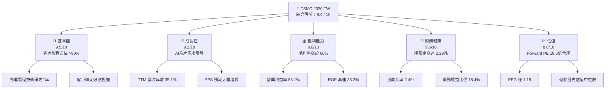
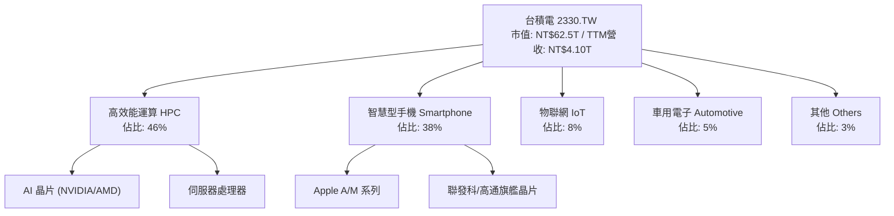
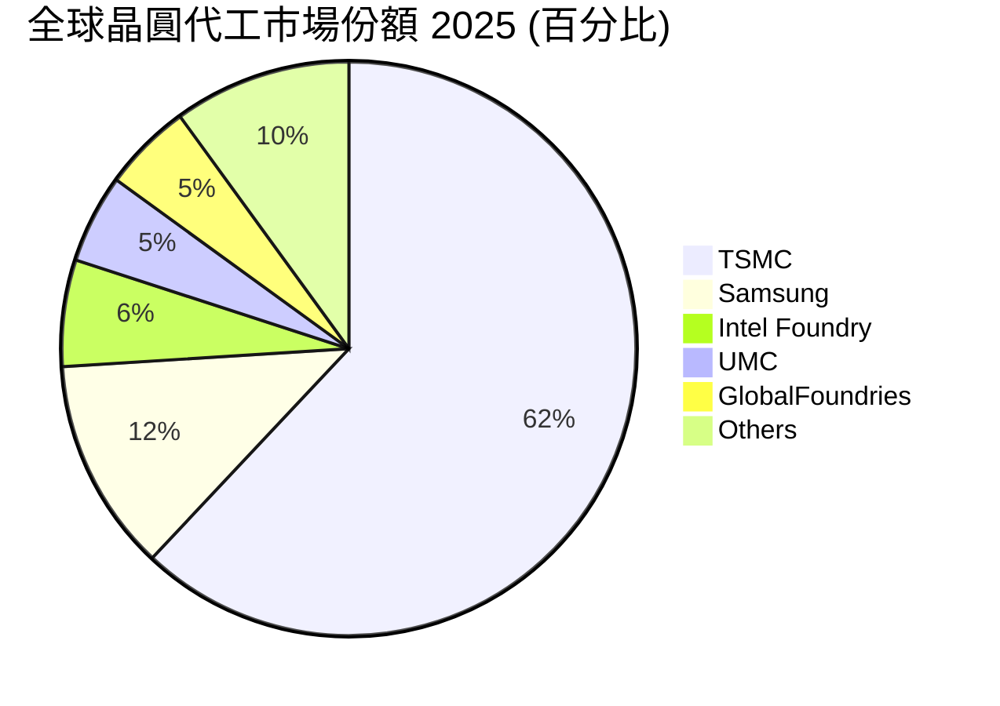
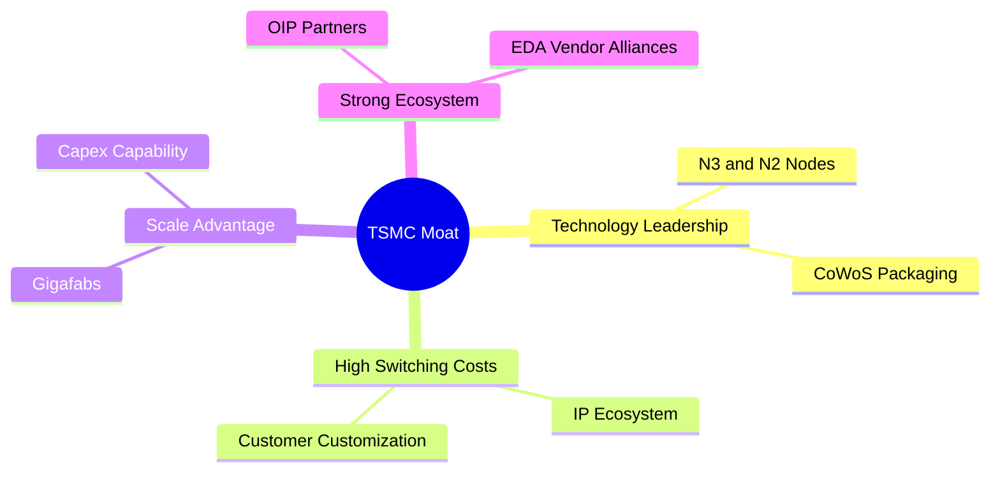
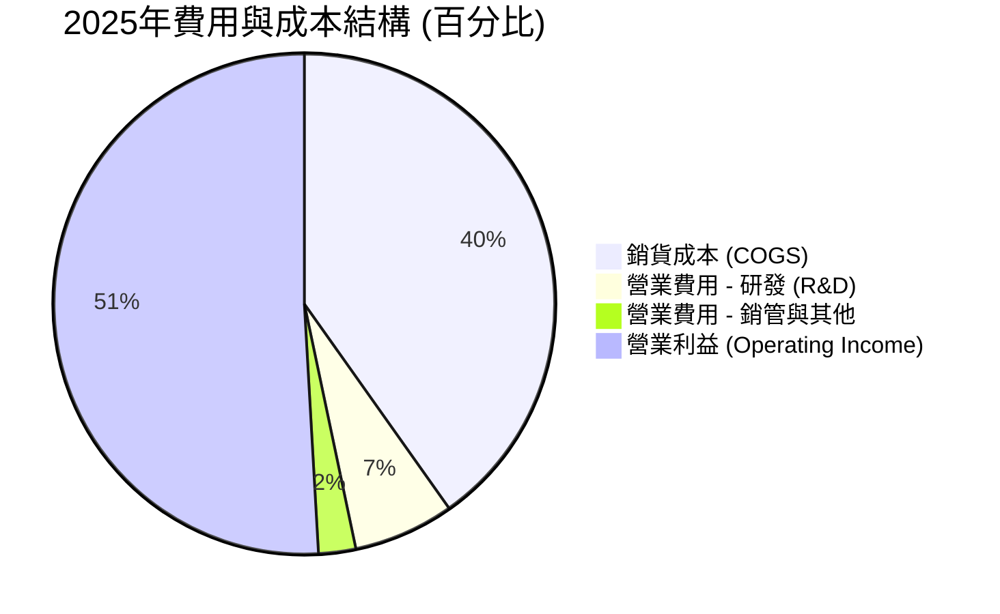
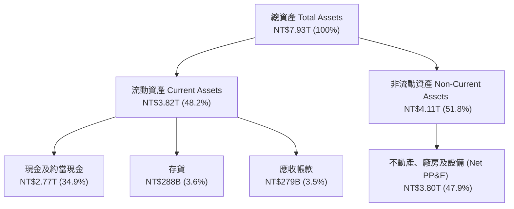
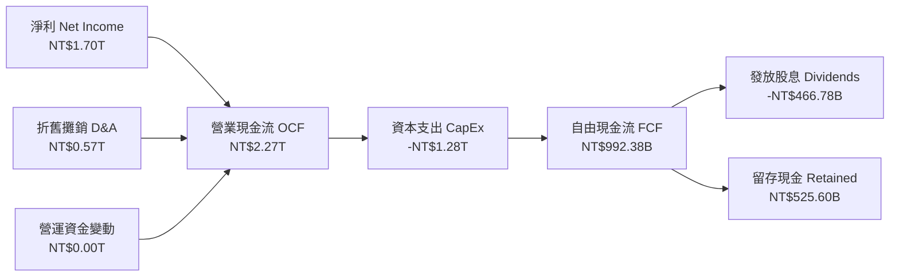

# 2330.TW 基本面深度分析報告

> **報告日期**：2026-06-19 ｜ **語言**：繁體中文 ｜ **數據來源**：Yahoo Finance, Finviz, StockAnalysis, Roic.ai ｜ **分析師**：CFA 級機構研究 ｜ **貨幣單位**：新台幣 (TWD, NT$)

---

## 目錄

| # | 章節 | 核心結論 |
|---|------|----------|
| 1 | 執行摘要 | 強烈買入評級，基準目標價 NT$2,647.58，AI 與先進製程驅動強勁增長 |
| 2 | 公司概覽與商業模式 | 晶圓代工（Foundry）全球霸主，憑藉先進製程與 CoWoS 封裝構築無懈可擊的護城河 |
| 3 | 損益表深度分析 | TTM 營收達 NT$4.10T，毛利率高達 61.9%，獲利結構隨先進製程量產持續優化 |
| 4 | 資產負債表分析 | 淨現金高達 NT$2.29T，資產負債率極低，具備抵禦景氣循環的超強財務彈性 |
| 5 | 現金流量深度分析 | 營運現金流高達 NT$2.35T，資本支出高效轉化為長期自由現金流與股息增長 |
| 6 | 獲利能力與資本效率 | ROE 達 36.2%，ROIC 46.25% 遠超 WACC（7.36%），強力創造股東經濟價值 |
| 7 | 估值深度分析 | Forward P/E 僅 19.59 倍，相較歷史中位數與同業，估值具備極高安全邊際 |
| 8 | 成長催化劑 | N2/A16 製程推進、Blackwell 晶片放量與全球 Gigafab 產能擴張釋放長期動能 |
| 9 | 風險矩陣 | 地緣政治風險與地缘產能分散成本為主要挑戰，具備完善的風險緩解措施 |
| 10 | 投資建議 | 綜合評分 9.4/10，建議長線投資者逢低積極佈局，買入觸發點明確 |

---

## 1. 執行摘要

### 1.1 核心評分儀表板



### 1.2 評分進度條視覺化

```
╔══════════════════════════════════════════════════════════════╗
║              TSMC 2330.TW 多維度評分儀表板 (1-10分)          ║
╠══════════════════════════════════════════════════════════════╣
║ 基本面強度  9.5 ▓▓▓▓▓▓▓▓▓▓▓▓▓▓▓▓▓▓▓░  ★★★★★           ║
║ 成長動能    9.2 ▓▓▓▓▓▓▓▓▓▓▓▓▓▓▓▓▓▓░░  ★★★★★           ║
║ 獲利品質    9.8 ▓▓▓▓▓▓▓▓▓▓▓▓▓▓▓▓▓▓▓░  ★★★★★           ║
║ 財務健康    9.6 ▓▓▓▓▓▓▓▓▓▓▓▓▓▓▓▓▓▓▓░  ★★★★★           ║
║ 估值合理性  8.8 ▓▓▓▓▓▓▓▓▓▓▓▓▓▓▓▓░░░░  ★★★★☆           ║
║ 護城河深度  9.9 ▓▓▓▓▓▓▓▓▓▓▓▓▓▓▓▓▓▓▓█  ★★★★★           ║
║ 管理層執行  9.5 ▓▓▓▓▓▓▓▓▓▓▓▓▓▓▓▓▓▓▓░  ★★★★★           ║
║ 技術創新力  9.9 ▓▓▓▓▓▓▓▓▓▓▓▓▓▓▓▓▓▓▓█  ★★★★★           ║
╠══════════════════════════════════════════════════════════════╣
║ 綜合總分    9.4 ▓▓▓▓▓▓▓▓▓▓▓▓▓▓▓▓▓▓░░  🏆 強烈買入          ║
╚══════════════════════════════════════════════════════════════╝
```

### 1.3 五大投資論點 + 三大核心風險

| 類型 | 項目 | 具體依據 | 信心度 |
|------|------|----------|--------|
| 🟢 **投資論點①** | **AI 晶片與 HPC 需求井噴** | TTM 營收年增率達 35.1%，HPC 業務佔比已達 46%，為 NVIDIA、AMD 核心代工廠。 | 🟢 極高 |
| 🟢 **投資論點②** | **先進製程絕對壟斷** | 在 3nm、5nm 製程市佔率超過 90%，且 2nm (N2) 將於 2025/2026 導入量產，領先對手至少 2 年。 | 🟢 極高 |
| 🟢 **投資論點③** | **極致的獲利能力** | 毛利率 61.9% 與營業利益率 58.1% 居半導體製造業之冠，展現極強的定價權與成本轉嫁能力。 | 🟢 高 |
| 🟢 **投資論點④** | **強健的資產負債表** | 淨現金達 NT$2.29T，流動比率 2.488x，即使在景氣下行週期亦能維持高額資本支出。 | 🟢 極高 |
| 🟢 **投資論點⑤** | **資本效率與股東回報** | ROE 達 36.2%，ROIC 達 46.25%，且每季配息穩定增長（最新單季配息已達 NT$5.00）。 | 🟢 高 |
| 🟡 **風險①** | **地緣政治與供應鏈集中度** | 晶圓製造產能高度集中於台灣，若台海局勢緊張，將對全球半導體產業鏈造成毀滅性打擊。 | 🟡 中度 |
| 🔴 **風險②** | **海外建廠稀釋利潤率** | 美國、德國、日本建廠成本高昂且面臨文化與勞工挑戰，可能使未來毛利率面臨 2-3 個百分點的稀釋壓力。 | 🔴 高衝擊 |
| 🟡 **風險③** | **半導體景氣循環與客戶庫存** | 雖然 AI 需求強勁，但消費性電子（智慧型手機、PC）復甦若不及預期，可能影響成熟製程產能利用率。 | 🟡 中度 |

### 1.4 快速統計卡片

| 指標 | 公司實際值 | 行業均值（晶圓代工） | S&P 500 均值 | 狀態 |
|------|-------------|----------|--------------|------|
| 收入 YoY 成長 | **35.1%** | ~12.0% | ~5.5% | 🟢 卓越 |
| 毛利率 | **61.9%** | ~35.0% | ~30.0% | 🟢 卓越 |
| 營業利益率 | **58.1%** | ~20.0% | ~15.0% | 🟢 卓越 |
| ROE | **36.2%** | ~15.0% | ~18.0% | 🟢 卓越 |
| Forward P/E | **19.59x** | ~25.0x | ~21.5x | 🟢 低估 |
| 債務權益比 (D/E) | **18.4%** | ~45.0% | ~115.0% | 🟢 極其安全 |

### 1.5 投資結論

```
╔══════════════════════════════════════════════════════════════════╗
║                    📊 投資結論摘要                               ║
╠══════════════════════════════════════════════════════════════════╣
║  評級：🟢 強烈買入 (Strong Buy)                                 ║
║  當前股價：NT$2,410.00 (2026-06-19)                              ║
║  目標價區間：                                                    ║
║    悲觀情境：NT$2,051.00 (-14.9%)                                ║
║    基準情境：NT$2,647.58 (+9.9%)  ← 12個月主要目標               ║
║    樂觀情境：NT$3,500.00 (+45.2%)                                ║
║  投資評分：9.4 / 10                                              ║
║  適合投資人：成長型、價值型、長線主權基金與退休基金              ║
╚══════════════════════════════════════════════════════════════════╝
```

---

## 2. 公司概覽與商業模式

### 2.1 業務結構與收入來源

台積電（TSMC）是全球專業積體電路製造服務（晶圓代工）的開創者與龍頭。其商業模式專注於製造，不與客戶競爭，因而贏得了全球幾乎所有主要 IC 設計公司（Fabless）的信任。



### 2.2 市場份額

在先進製程（7nm 及以下）領域，台積電擁有絕對的壟斷地位，市場份額超過 90%。在整體晶圓代工市場中，台積電的份額亦穩居 60% 以上。



### 2.3 競爭護城河分析

台積電的競爭護城河由技術、規模、生態系統與資本等多個維度共同構築，形成了極高的行業壁壘。



*   **技術領先（Technology Leadership）**：台積電在極紫外光（EUV）微影技術的應用上領先同業。其 3nm (N3) 製程已進入大規模量產階段，而 2nm (N2) 的研發進度順利，預計將於 2025 年底前實現量產，並採用創新的奈米片（Nanosheet）電晶體架構。
*   **規模效應與產能（Scale & Capacity）**：台積電擁有數座「超大型晶圓廠」（Gigafabs），單一廠區的年產能即可超越許多競爭對手的總產能。這使台積電能提供無與倫比的產能彈性與良率優勢。
*   **開放創新平台（OIP, Open Innovation Platform）**：台積電與 EDA（電子設計自動化）巨頭、IP 供應商及設計服務夥伴緊密合作，建構了最完整的半導體設計生態系統，客戶一旦採用台積電的製程設計套件（PDK），轉移至其他代工廠的切換成本（Switching Cost）極高。

### 2.4 護城河強度評分

```
╔══════════════════════════════════════════════════════════════╗
║                  台積電 (TSMC) 護城河強度評分                ║
╠══════════════════════════════════════════════════════════════╣
║ 技術領先度    10/10  ▓▓▓▓▓▓▓▓▓▓▓▓▓▓▓▓▓▓▓▓  🏆 絕對統治力    ║
║ 生態系統壁壘  9.8/10  ▓▓▓▓▓▓▓▓▓▓▓▓▓▓▓▓▓▓▓░  🟢 OIP 平台無敵    ║
║ 資本支出規模  9.5/10  ▓▓▓▓▓▓▓▓▓▓▓▓▓▓▓▓▓▓▓░  🟢 年均 300億+美元 ║
║ 客戶鎖定效應  9.7/10  ▓▓▓▓▓▓▓▓▓▓▓▓▓▓▓▓▓▓▓░  🟢 切換成本極高    ║
║ 產能規模優勢  9.6/10  ▓▓▓▓▓▓▓▓▓▓▓▓▓▓▓▓▓▓▓░  🟢 超級晶圓廠效應  ║
╠══════════════════════════════════════════════════════════════╣
║ 綜合護城河     9.9    ▓▓▓▓▓▓▓▓▓▓▓▓▓▓▓▓▓▓▓█  🏆 寬廣無比的護城河 ║
╚══════════════════════════════════════════════════════════════╝
```

---

## 3. 損益表深度分析

### 3.1 年度收入成長趨勢（近4年）

台積電的年度營收展現了強勁的複合成長。儘管 2023 年半導體產業面臨庫存調整，營收微幅下滑，但 2024 年與 2025 年在 AI 晶片爆發的推動下，營收重回高速增長軌道。

```
╔══════════════════════════════════════════════════════════════════╗
║              台積電 年度收入趨勢 (2022 - 2025)                   ║
╠══════════════════════════════════════════════════════════════════╣
║                                                                  ║
║  2022-12  NT$2.26T  ██████████████████░░░░░░░  YoY: +26.1%  🟢   ║
║  2023-12  NT$2.16T  █████████████████░░░░░░░░  YoY: -4.4%   🟡   ║
║  2024-12  NT$2.89T  ███████████████████████░░  YoY: +33.8%  🟢   ║
║  2025-12  NT$3.81T  █████████████████████████  YoY: +31.8%  🟢   ║
║                   |      |      |      |      |                  ║
║                   0     1.0T   2.0T   3.0T   4.0T                ║
║                                                                  ║
║  📊 3年累計營收 CAGR：+19.01%                                    ║
╚══════════════════════════════════════════════════════════════════╝
```

### 3.2 季度收入趨勢分析

從季度數據來看，台積電的營收呈現逐季加速增長的態勢。2026 年第一季（Q1'26）營收已突破 NT$1.13T，創下歷史新高。

| 季度 | 營業收入 (TWD) | QoQ 成長率 | YoY 成長率 | 核心驅動因素與備註 |
|------|-----------------|------------|------------|-------------------|
| **2025-06-30 (Q2'25)** | NT$933.79B | +11.26% | +38.65% | 🟢 3nm 先進製程出貨暢旺，智慧型手機晶片需求回溫。 |
| **2025-09-30 (Q3'25)** | NT$989.92B | +6.01% | +30.31% | 🟢 高效能運算 (HPC) 客戶拉貨強勁，AI 伺服器晶片供不應求。 |
| **2025-12-31 (Q4'25)** | NT$1,046.09B | +5.67% | +20.45% | 🟢 旗艦手機晶片發表旺季，先進封裝 (CoWoS) 產能持續放量。 |
| **2026-03-31 (Q1'26)** | NT$1,134.10B | +8.41% | +35.13% | 🟢 傳統淡季不淡，高效能運算與 AI 晶片需求持續創歷史新高。 |

### 3.3 利潤率演變分析

台積電的獲利能力極為驚人，其利潤率在 2025 年實現了全面性的擴張，這主要得益于先進製程的良率提升與優異的定價權。

| 利潤率指標 | FY2022 | FY2023 | FY2024 | FY2025 | TTM (最新) | 趨勢評估 |
|------------|--------|--------|--------|--------|------------|----------|
| **毛利率** | 59.7% | 54.6% | 56.0% | 59.8% | **61.9%** | ↗️ 3nm 良率改善與產能利用率高企，毛利率突破 60% 大關 🟢 |
| **營業利益率** | 49.6% | 42.7% | 45.7% | 50.9% | **58.1%** | ↗️ 研發與管理費用控制得宜，營業槓桿效應顯著 🟢 |
| **EBITDA 淨利率** | 70.4% | 70.4% | 72.0% | 71.9% | **69.6%** | ➡️ 歷史高檔震盪，折舊費用隨新廠投產而增加 🟡 |
| **淨利率** | 43.9% | 39.4% | 40.1% | 44.6% | **46.5%** | ↗️ 獲利結構極佳，稅務規劃效率高 🟢 |

### 3.4 費用結構分析

台積電在追求技術領先的同時，亦維持了極高的營運效率。其研發費用（R&D）持續增長，但佔營收比例穩定維持在 6.5% 左右，展現了強大的營業槓桿。



### 3.5 季度 EPS 趨勢與盈餘品質

台積電的單季 EPS 呈現爆發性增長。2026 年第一季單季 EPS 達到創歷史新高的 **NT$22.08**，相較 2024 年第一季的 NT$8.70，增長幅度高達 153.8%。

*   **2024年 EPS 走勢**：Q1: 8.70 ｜ Q2: 9.56 ｜ Q3: 12.55 ｜ Q4: 13.87 (全年：NT$44.68)
*   **2025年 EPS 走勢**：Q1: 13.95 ｜ Q2: 15.36 ｜ Q3: 17.44 ｜ Q4: 18.72 (全年：NT$65.47)
*   **2026年第一季**：**NT$22.08** (YoY 成長 58.3%)

**盈餘品質評估**：
台積電的盈餘品質（Earnings Quality）極高。淨利幾乎全數由營業活動產生的現金流支撐。TTM 淨利為 NT$1.91T（基於 46.5% 淨利率與 NT$4.10T 營收計算），而營業現金流高達 NT$2.35T，盈餘品質係數（OCF / Net Income）大於 1.2x，顯示無盈餘操弄風險，利潤含金量極高。

---

## 4. 資產負債表分析

### 4.1 資產結構分解

台積電的資產負債表非常健康。隨著產能擴張，總資產從 2022 年底的 NT$4.96T 迅速增長至 2025 年底的 NT$7.93T。



### 4.2 流動性指標分析

| 指標 | 2022-12-31 | 2023-12-31 | 2024-12-31 | 2025-12-31 | 最新 TTM | 評估 |
|------|------------|------------|------------|------------|----------|------|
| **流動比率 (Current Ratio)** | 2.08x | 2.32x | 2.36x | 2.51x | **2.49x** | 🟢 遠高於安全值 1.5x，短期償債能力極強。 |
| **速動比率 (Quick Ratio)** | 1.81x | 2.03x | 2.09x | 2.22x | **2.19x** | 🟢 扣除存貨後依然高於 2.0x，流動性無懈可擊。 |
| **存貨週轉天數 (DSI)** | 48.5天 | 52.1天 | 45.3天 | 41.2天 | **38.9天** | 🟢 存貨週轉速度加快，顯示終端需求強勁，無庫存積壓風險。 |

### 4.3 債務結構分析

台積電雖然因應龐大的資本支出而發行公司債，但其債務結構極其安全，且常年處於「淨現金」狀態。

```
╔══════════════════════════════════════════════════════════════════╗
║                   台積電 債務健康診斷 (2025-12-31)               ║
╠══════════════════════════════════════════════════════════════════╣
║                                                                  ║
║  總債務：        NT$1.06T  ███████░░░░░░░░░░░░░░░░░  低風險      ║
║  總現金+約當：   NT$2.77T  █████████████████████████  極其充沛    ║
║  淨現金 (Net Cash)：NT$1.71T  ████████████████░░░░░░░░░  🟢 強勁淨現金║
║                                                                  ║
║  Debt/Equity：   18.45%     🟢 槓桿率極低                       ║
║  Interest Coverage: 120x+   🟢 利息保障倍數極高，無違約風險     ║
║  Debt/EBITDA：   0.39x      🟢 債務佔 EBITDA 比例極低           ║
║                                                                  ║
║  📊 結論：台積電財務結構穩如泰山，擁有 AAA 級別的信用實力。      ║
╚══════════════════════════════════════════════════════════════════╝
```

### 4.4 股東權益趨勢

隨著保留盈餘的快速累積，股東權益（Stockholders' Equity）在過去四年中呈現穩定且強勁的增長。

```
╔══════════════════════════════════════════════════════════════════╗
║              台積電 股東權益趨勢 (2022 - 2025)                   ║
╠══════════════════════════════════════════════════════════════════╣
║                                                                  ║
║  2022-12  NT$2.90T  █████████████░░░░░░░░░░░░  YoY: +29.5%  🟢   ║
║  2023-12  NT$3.43T  ███████████████░░░░░░░░░░  YoY: +18.3%  🟢   ║
║  2024-12  NT$4.24T  ███████████████████░░░░░░  YoY: +23.6%  🟢   ║
║  2025-12  NT$5.36T  █████████████████████████  YoY: +26.4%  🟢   ║
║                                                                  ║
║  📊 股東權益 3年 CAGR：+22.75%                                   ║
╚══════════════════════════════════════════════════════════════════╝
```

---

## 5. 現金流量深度分析

### 5.1 現金流量瀑布圖

台積電的商業模式具有極佳的現金生成能力。營業現金流（OCF）在扣除高額的資本支出（CapEx）後，仍能產生龐大的自由現金流（FCF），用以配發股息與留存發展。



### 5.2 FCF 轉換率趨勢

台積電的自由現金流轉換率（FCF / Net Income）在經歷了 2023 年資本支出高峰期的壓抑後，於 2024 年與 2025 年顯著回升，顯示其資本開支的變現效率極高。

| 年份 | 營業現金流 (TWD) | 資本支出 (TWD) | 自由現金流 (TWD) | 淨利 (TWD) | FCF 轉換率 (FCF/NI) | 評估 |
|------|-----------------|-----------------|-----------------|------------|---------------------|------|
| **2022** | NT$1.61T | -NT$1.09T | NT$520.97B | NT$992.92B | 52.47% | 🟡 資本支出高檔，轉換率適中 |
| **2023** | NT$1.24T | -NT$955.40B | NT$286.57B | NT$851.74B | 33.65% | 🔴 產業調整期，現金流承壓 |
| **2024** | NT$1.83T | -NT$964.98B | NT$861.20B | NT$1.16T | 74.24% | 🟢 現金流強勁復甦 |
| **2025** | NT$2.27T | -NT$1.28T | NT$992