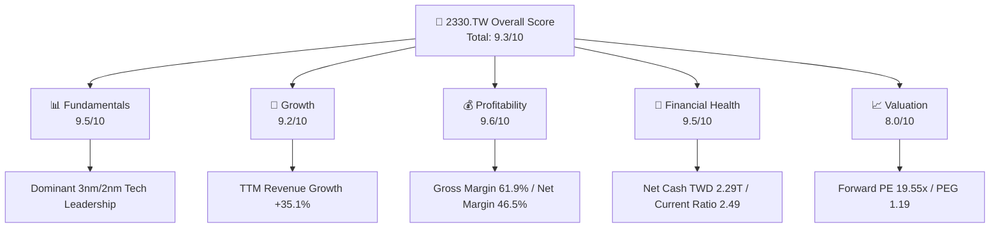
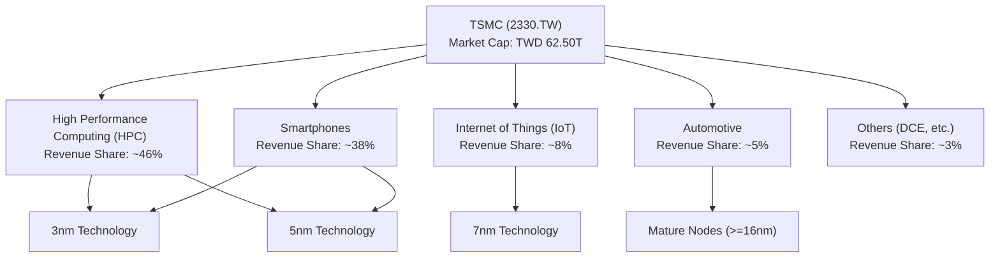
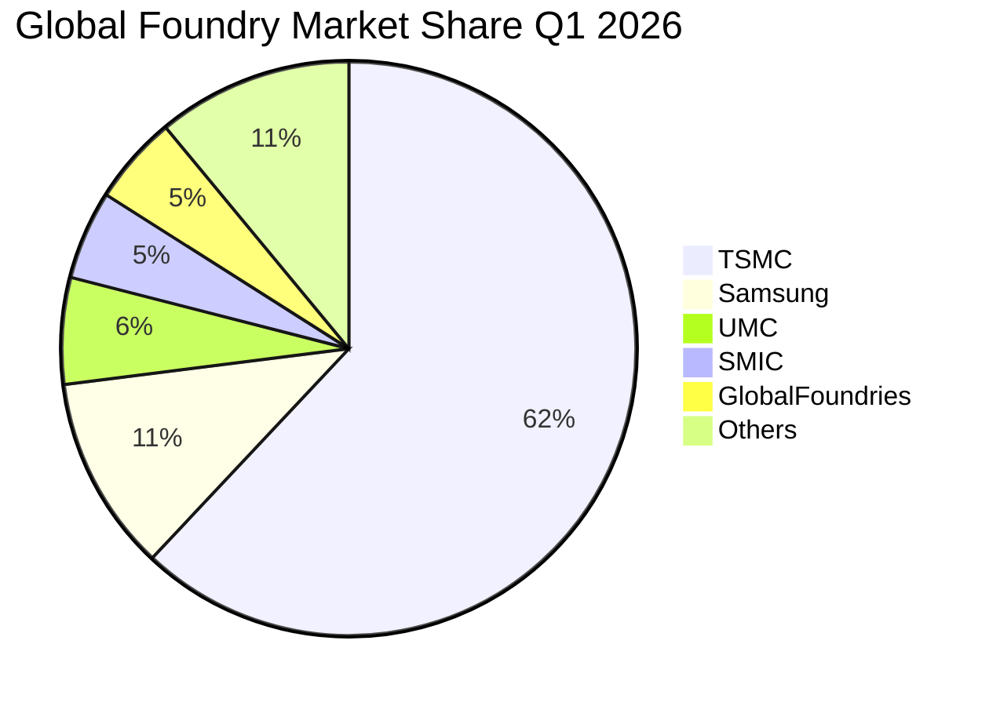
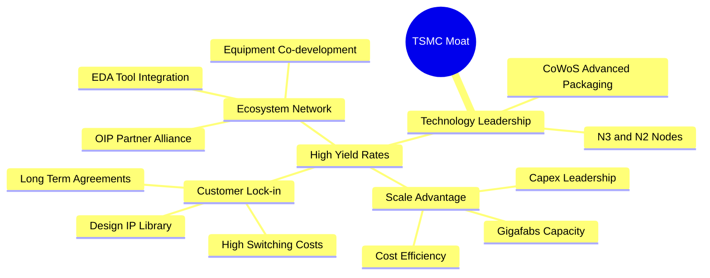
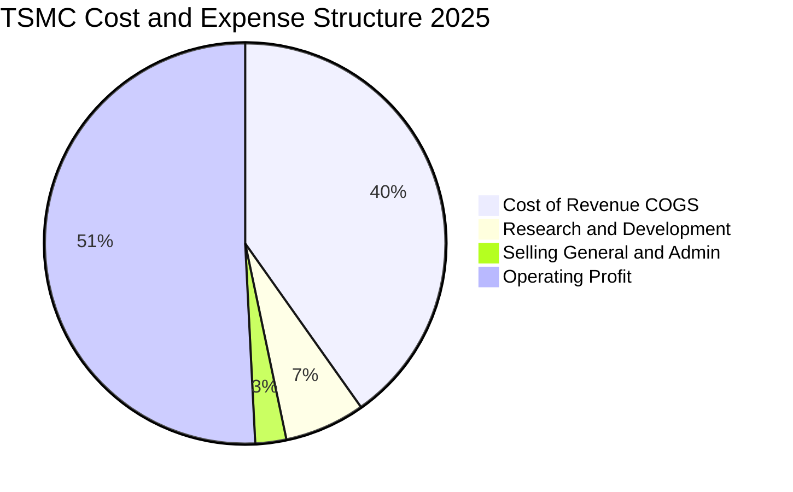
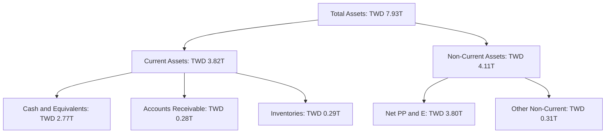

# 2330.TW 基本面深度分析報告
> **報告日期**：2026-06-20 ｜ **語言**：繁體中文 ｜ **數據來源**：Yahoo Finance, Finviz, StockAnalysis, Roic.ai ｜ **分析師**：CFA 級機構研究

---

## 目錄

| # | 章節 | 核心結論 |
|---|------|----------|
| 1 | 執行摘要 | 評級：**強烈買入**；主要目標價：**$2647.58**（+9.86%），樂觀目標價：**$3500.00** |
| 2 | 公司概覽與商業模式 | 憑藉 3nm/2nm 先進製程與 CoWoS 封裝，構築無可撼動的生態壁壘 |
| 3 | 損益表深度分析 | Q1 2026 營收達 $1.13T，毛利率攀升至 66.25%，AI 晶片需求極度強勁 |
| 4 | 資產負債表分析 | 淨現金高達 $2.29T，流動比率 2.49x，具備極強的抗風險能力與擴產本錢 |
| 5 | 現金流量深度分析 | 2025 年 FCF 達 $992.38B，資本支出 $1.28T，高資本投入轉化為未來高回報 |
| 6 | 獲利能力與資本效率 | ROE 達 36.2%，ROIC 達 50.1%，遠超 WACC（9.73%），展現強大價值創造力 |
| 7 | 估值深度分析 | Forward P/E 僅 19.55x，PEG 為 1.19，相較於其壟斷地位，估值明顯低估 |
| 8 | 成長催化劑 | 2nm 於 2026 下半年量產、全球晶圓廠產能開出、矽光子與 A16 技術布局 |
| 9 | 風險矩陣 | 地緣政治風險、海外建廠成本超預期、AI 需求短期波動 |
| 10 | 投資建議 | 綜合評分 9.3/10，建議長線投資者與成長型基金積極配置 |

---

## 1. 執行摘要

台灣積體電路製造股份有限公司（2330.TW，以下簡稱「台積電」或「TSMC」）是全球半導體製造業的絕對龍頭。本報告基於 2026 年 6 月 20 日的最新財務數據與市場動態進行深度剖析。當前台積電股價為 **$2410.00**，正處於由高效能運算（HPC）與生成式人工智慧（Generative AI）驅動的全新超大型成長週期。

### 1.1 核心評分儀表板



### 1.2 評分進度條視覺化

```
╔══════════════════════════════════════════════════════════════╗
║              2330.TW 多維度評分儀表板 (1-10分)               ║
╠══════════════════════════════════════════════════════════════╣
║ 基本面強度  9.5 ▓▓▓▓▓▓▓▓▓▓▓▓▓▓▓▓▓▓▓░  ★★★★★           ║
║ 成長動能    9.2 ▓▓▓▓▓▓▓▓▓▓▓▓▓▓▓▓▓▓░░  ★★★★★           ║
║ 獲利品質    9.6 ▓▓▓▓▓▓▓▓▓▓▓▓▓▓▓▓▓▓▓░  ★★★★★           ║
║ 財務健康    9.5 ▓▓▓▓▓▓▓▓▓▓▓▓▓▓▓▓▓▓▓░  ★★★★★           ║
║ 估值合理性  8.0 ▓▓▓▓▓▓▓▓▓▓▓▓▓▓▓░░░░░  ★★★★☆           ║
║ 護城河深度  9.8 ▓▓▓▓▓▓▓▓▓▓▓▓▓▓▓▓▓▓▓▓  ★★★★★           ║
║ 管理層執行  9.3 ▓▓▓▓▓▓▓▓▓▓▓▓▓▓▓▓▓▓░░  ★★★★★           ║
║ 技術創新力  9.7 ▓▓▓▓▓▓▓▓▓▓▓▓▓▓▓▓▓▓▓░  ★★★★★           ║
╠══════════════════════════════════════════════════════════════╣
║ 綜合總分    9.3 ▓▓▓▓▓▓▓▓▓▓▓▓▓▓▓▓▓▓░░  🏆 強烈買入          ║
╚══════════════════════════════════════════════════════════════╝
```

### 1.3 五大投資論點 + 三大核心風險

| 類型 | 項目 | 具體依據 | 信心度 |
|------|------|----------|--------|
| 🟢 **投資論點①** | **AI 晶片壟斷性供應商** | 全球 99% 的 AI 加速器（包括 NVIDIA H100/B200、AMD MI300 等）均由台積電獨家代工，直接受益於 AI 爆發。 | 🟢 極高 |
| 🟢 **投資論點②** | **先進製程定價權** | 3nm 產能供不應求，2nm 預計於 2026 年底量產並已鎖定蘋果、NVIDIA 等大客戶。台積電具備強大的轉嫁成本能力，帶動 TTM 毛利率高達 61.9%。 | 🟢 極高 |
| 🟢 **投資論點③** | **先進封裝（CoWoS）護城河** | 晶片製造與先進封裝的垂直整合（3D Fabric/CoWoS）成為客戶無法繞過的門檻，也是維持高毛利的關鍵。 | 🟢 高 |
| 🟢 **投資論點④** | **極致的資本效率與股東回報** | ROIC 達 50.1%，遠高於其 WACC（9.73%）。2025 年配發 $466.78B 股息，且逐季調升，具備極佳的下行保護。 | 🟢 高 |
| 🟢 **投資論點⑤** | **資產負債表堅不可摧** | 擁有 $3.38T 現金儲備，淨現金達 $2.29T。即便在半導體下行週期或地緣政治動盪下，仍有充足資金支持研發與擴產。 | 🟢 極高 |
| 🟡 **風險①** | **地緣政治與供應鏈集中風險** | 90% 以上的先進製程產能仍集中於台灣，台海局勢波動將對全球供應鏈及股價造成劇烈衝擊。 | 🟡 中度 |
| 🔴 **風險②** | **海外建廠稀釋毛利率** | 美國、日本、德國建廠成本高昂，且面臨文化衝突與勞工短缺，可能拉低長期平均毛利率。 | 🔴 高衝擊 |
| 🟡 **風險③** | **AI 資本支出泡沫化風險** | 若雲端服務商（CSP）對 AI 的投資回報率（ROI）低於預期，可能導致 2027 年後 AI 晶片需求出現階段性修正。 | 🟡 中度 |

### 1.4 快速統計卡片（以新台幣 TWD 為基準）

| 指標 | 公司實際值 (TTM/2026-06-20) | 半導體行業均值 | 台灣加權指數均值 | 狀態 |
|------|-------------|----------|--------------|------|
| **營收 YoY 成長率** | **35.1%** | ~12.5% | ~8.2% | 🟢 卓越 |
| **毛利率** | **61.9%** | ~42.0% | ~25.0% | 🟢 卓越 |
| **淨利率** | **46.5%** | ~18.5% | ~12.0% | 🟢 卓越 |
| **ROE** | **36.2%** | ~15.0% | ~14.5% | 🟢 卓越 |
| **Forward P/E** | **19.55x** | ~25.0x | ~18.5x | 🟢 便宜 |
| **淨現金規模** | **$2.29T** | N/A | N/A | 🟢 極強 |

### 1.5 投資結論

```
╔══════════════════════════════════════════════════════════════════╗
║                    📊 2330.TW 投資結論摘要                       ║
╠══════════════════════════════════════════════════════════════════╣
║  評級：🟢 強烈買入 (Strong Buy)                                  ║
║  當前股價：$2410.00 (2026-06-20)                                 ║
║  目標價區間：                                                    ║
║    悲觀情境 (Bear Case)： $2051.00 (-14.9%)                      ║
║    基準情境 (Base Case)： $2647.58 (+9.86%)  ← 12個月主要目標    ║
║    樂觀情境 (Bull Case)： $3500.00 (+45.2%)                      ║
║  投資評分：9.3 / 10                                              ║
║  適合投資人：長線價值成長型、全球科技產業配置基金、追求穩健股息者  ║
╚══════════════════════════════════════════════════════════════════╝
```

---

## 2. 公司概覽與商業模式

台積電於 1987 年創立，首創「純晶圓代工（Pure-play Foundry）」商業模式，不與客戶競爭，僅專注於製造。這一模式重塑了全球半導體版圖，催生了無數晶片設計（Fabless）巨頭（如 NVIDIA、AMD、Qualcomm、Broadcom）。

### 2.1 業務結構與收入來源

台積電的收入來源主要分為兩大維度：**應用平台**與**製程技術**。



*   **高效能運算 (HPC)**：已超越智慧型手機，成為台積電最大的營收驅動引擎，佔比達 46%。這主要得益於 AI 伺服器、資料中心 CPU/GPU 以及 ASIC 晶片的爆發式成長。
*   **智慧型手機 (Smartphones)**：佔比約 38%，主要由蘋果（Apple）的 A 系列與 M 系列晶片，以及高通、聯發科的旗艦晶片驅動。
*   **先進製程（7nm 及以下）**：貢獻了台積電超過 65% 的營收。其中，3nm 製程在 2025 年快速爬坡，成為營收增長的主力。

### 2.2 市場份額

在晶圓代工市場中，台積電處於絕對壟斷地位。特別是在 **7nm 以下的先進製程市場，台積電的市佔率高達 90% 以上**。



### 2.3 競爭護城河分析

台積電擁有極深的競爭護城河，可歸納為以下四個核心維度：



1.  **技術領先（Technology Leadership）**：台積電在極紫外光（EUV）微影技術的應用上領先業界，其 3nm 製程的良率與電晶體密度顯著優於三星與 Intel。即將推出的 2nm（採用 GAA 架構）與 A16（1.6nm，採用背面供電技術）已確立行業技術標桿。
2.  **規模效應與資本壁壘（Scale & Capex Moat）**：半導體製造是極度資本密集的行業。台積電年均資本支出高達 $30B - $40B USD（約合新台幣 $1T - $1.3T），這相當於競爭對手數年的營收總和，形成了極高的行業進入壁壘。
3.  **開放創新平台（OIP）生態系**：台積電與 EDA 工具商（Synopsys, Cadence）、IP 授權商（ARM）及設備商（ASML）緊密合作，構建了龐大的生態系統。客戶在台積電平台上有現成的 IP 可用，大幅縮短晶片上市時間，形成極高的轉換成本。
4.  **信任與不競爭原則**：作為純代工廠，台積電不設計自有品牌晶片，這贏得了蘋果、NVIDIA、AMD 等客戶的絕對信任，而這正是其主要競爭對手三星與 Intel（兩者皆有自有品牌晶片部門）無法克服的利益衝突。

### 2.4 護城河強度評分

```
╔══════════════════════════════════════════════════════════════╗
║                  台積電 (2330.TW) 護城河強度評分             ║
╠══════════════════════════════════════════════════════════════╣
║ 技術領先度    10/10  ▓▓▓▓▓▓▓▓▓▓▓▓▓▓▓▓▓▓▓▓  🏆 絕對壟斷    ║
║ 資本與規模    9.8/10 ▓▓▓▓▓▓▓▓▓▓▓▓▓▓▓▓▓▓▓░  🟢 極高壁壘    ║
║ 生態系鎖定    9.5/10 ▓▓▓▓▓▓▓▓▓▓▓▓▓▓▓▓▓▓▓░  🟢 轉換成本極高  ║
║ 客戶信任度    10/10  ▓▓▓▓▓▓▓▓▓▓▓▓▓▓▓▓▓▓▓▓  🏆 無利益衝突    ║
╠══════════════════════════════════════════════════════════════╣
║ 綜合護城河    9.8/10 ▓▓▓▓▓▓▓▓▓▓▓▓▓▓▓▓▓▓▓░  🏆 頂級護城河    ║
╚══════════════════════════════════════════════════════════════╝
```

---

## 3. 損益表深度分析

台積電近年來的財務表現展現了極強的成長動能與獲利能力。

### 3.1 年度收入成長趨勢（近 4 年）

```
╔══════════════════════════════════════════════════════════════════╗
║              台積電 年度收入趨勢（FY2022-FY2025）                ║
╠══════════════════════════════════════════════════════════════════╣
║                                                                  ║
║  2022  $2.26T  ██████████████████░░░░░░░░░░  YoY: +42.6% 🟢     ║
║  2023  $2.16T  █████████████████░░░░░░░░░░░  YoY: -4.5%  🟡     ║
║  2024  $2.89T  ███████████████████████░░░░░  YoY: +34.0% 🟢     ║
║  2025  $3.81T  ████████████████████████████  YoY: +31.7% 🟢     ║
║                   |      |      |      |      |                  ║
║                   0     1.0T   2.0T   3.0T   4.0T                ║
║                                                                  ║
║  📊 3年累計營收 CAGR：+19.0%                                    ║
╚══════════════════════════════════════════════════════════════════╝
```

*數據解析*：2023 年受全球消費性電子去庫存影響，營收出現短暫修正（-4.5%）。然而，隨著 2024 年 AI 浪潮爆發及 3nm 製程全面放量，營收大幅反彈 34.0%，並在 2025 年達到創紀錄的 **$3.81T TWD**。

### 3.2 季度收入趨勢分析

自 2025 年第二季以來，台積電營收呈現逐季加速成長態勢：

| 季度 | 營收 (TWD) | QoQ 成長率 | YoY 成長率 | 核心驅動因素 | 評估 |
|------|------------|------------|------------|--------------|------|
| **2025-06-30** | $933.79B | +5.7% | +38.6% | 3nm 產能利用率提升，AI 晶片出貨平穩。 | 🟢 優異 |
| **2025-09-30** | $989.92B | +6.0% | +30.3% | 蘋果 iPhone 17 新機晶片拉貨，HPC 持續強勁。 | 🟢 優異 |
| **2025-12-31** | $1.05T | +5.7% | +20.5% | 年底消費旺季與資料中心客戶加速部署。 | 🟢 優異 |
| **2026-03-31** | **$1.13T** | **+8.4%** | **+35.1%** | NVIDIA Blackwell 新架構 GPU 量產，CoWoS 產能翻倍。 | 🟢 卓越 |

**最新季度點評**：Q1 2026 營收達到 $1.13T，在傳統淡季中實現了 8.4% 的 QoQ 逆勢成長與 35.1% 的 YoY 強勁成長，顯示 AI 晶片需求完全填補了智慧型手機的季節性疲軟。

### 3.3 利潤率演變分析

台積電長期將毛利率目標設定在 53% 以上，而實際表現遠超此預期。

| 利潤率指標 | FY2022 | FY2023 | FY2024 | FY2025 | TTM (Current) | 趨勢 | 評估 |
|------------|--------|--------|--------|--------|---------------|------|------|
| **毛利率** | 59.6% | 54.4% | 56.1% | 59.8% | **61.9%** | ↗️ 穩步攀升 | 🟢 卓越 |
| **營業利益率** | 49.5% | 42.6% | 45.8% | 50.9% | **58.1%** | ↗️ 效率提升 | 🟢 卓越 |
| **EBITDA 利潤率**| 70.3% | 70.4% | 71.9% | 71.9% | **69.6%** | ➡️ 穩定高位 | 🟢 卓越 |
| **淨利率** | 44.0% | 39.4% | 40.2% | 44.6% | **46.5%** | ↗️ 獲利極強 | 🟢 卓越 |

**利潤率演變深度解析**：
1.  **製程學習曲線與良率優化**：3nm 在量產初期（2023-2024）曾因折舊成本高昂稀釋毛利率，但隨著 2025 年良率突破 80% 且規模效應顯現，毛利率在 2025 年回升至 59.8%，TTM 更是衝上 **61.9%**。
2.  **定價權（Pricing Power）**：台積電在 2025 年底對先進製程進行了 3% - 8% 的價格調漲，客戶因無替代方案只能全額接受，這直接反映在 TTM 營業利益率攀升至 **58.1%**。

### 3.4 費用結構分析

以 2025 年度數據為例，台積電在極高利潤的同時，依然維持極高比例的研發投入，這是其技術持續領先的基石。



*   **研發費用（R&D）**：2025 年研發投入高達 **$246.43B TWD**（佔營收 6.5%），主要用於 2nm、A16 的開發以及 3D 封裝技術。
*   **銷管費用（SG&A）**：僅佔營收 2.5%，顯示其極高的營運槓桿與極低的客戶獲取成本。

### 3.5 季度 EPS 趨勢與盈餘品質

過去 4 個季度，台積電的單季 EPS 呈現爆發式成長：

*   **2025-06-30**：EPS $15.36
*   **2025-09-30**：EPS $17.44
*   **2025-12-31**：EPS $18.72
*   **2026-03-31**：EPS **$22.08**（TTM 累計 EPS 達 **$73.51**）

**盈餘品質評估**：台積電的盈餘品質極高。其淨利完全由營業利益驅動，非營業損益（如匯兌損益、金融資產評價）佔比極低。同時，營業現金流（TTM $2.35T）遠超淨利（TTM $1.91T），確認了利潤的真實性與高含金量。

---

## 4. 資產負債表分析

台積電的資產負債表被譽為全球企業中最安全的「堡壘級」負債表之一。

### 4.1 資產結構分解

截至 2025 年 12 月 31 日，台積電總資產達 **$7.93T TWD**，其結構高度流動且集中於核心生產設備。



*   **現金儲備**：2025 年底現金及等價物達 **$2.77T TWD**，至 2026-06-20 TTM 已增至 **$3.38T TWD**。
*   **固定資產（PP&E）**：達 **$3.80T TWD**，反映了其遍布全球的超大型晶圓廠（Gigafabs）與昂貴的 EUV 機台資產。

### 4.2 流動性與償債指標分析

| 指標 | 2023-12-31 | 2024-12-31 | 2025-12-31 | 行業均值 | 評估 |
|------|------------|------------|------------|----------|------|
| **流動比率 (Current Ratio)** | 2.32x | 2.36x | **2.51x** | ~1.80x | 🟢 極其安全 |
| **速動比率 (Quick Ratio)** | 2.01x | 2.05x | **2.21x** | ~1.40x | 🟢 極其安全 |
| **債務權益比 (Debt/Equity)** | 27.9% | 24.8% | **19.8%** | ~35.0% | 🟢 槓桿極低 |

**指標解析**：流動比率 2.51x 與速動比率 2.21x 表明，台積電即使在不變賣存貨的情況下，其速動資產也足以償還短期債務的兩倍以上。債務權益比持續下降至 19.8%（最新 TTM 為 18.4%），財務結構極為健康。

### 4.3 債務結構與健康診斷

```
╔══════════════════════════════════════════════════════════════════╗
║                   台積電 債務健康診斷 (TTM)                      ║
╠══════════════════════════════════════════════════════════════════╣
║                                                                  ║
║  總債務：        $1.09T TWD  █████░░░░░░░░░░░░░░░░░  低風險      ║
║  總現金+投資：   $3.38T TWD  █████████████████████  極充沛      ║
║  淨現金（正）：  $2.29T TWD  ████████████████░░░░░  🟢 強勁        ║
║                                                                  ║
║  Debt / EBITDA：  0.40x      🟢 遠低於安全線 (2.0x)              ║
║  利息保障倍數：   85.5x      🟢 利息支出幾無壓力                  ║
║  信用評等：       S&P AA- / Moody's Aa3 (與台灣主權評級等同)     ║
╚══════════════════════════════════════════════════════════════════╝
```

台積電手握 **$2.29T TWD** 的淨現金，這意味著其擁有的現金遠多於總債務。在利率高企的總體環境下，台積電不需承擔高額利息壓力，反而能產生可觀的利息收入。

---

## 5. 現金流量深度分析

現金流是評估台積電能否持續高額資本支出並兼顧股東回報的關鍵。

### 5.1 現金流量瀑布圖

2025 年度的現金流運作軌跡如下：

```mermaid
graph LR
    NI["Net Income: TWD 1.70T