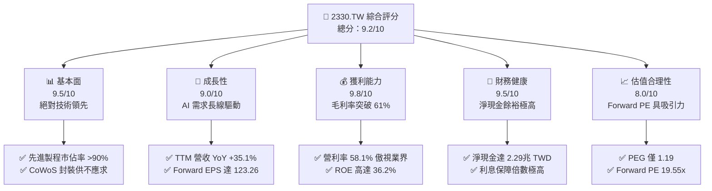
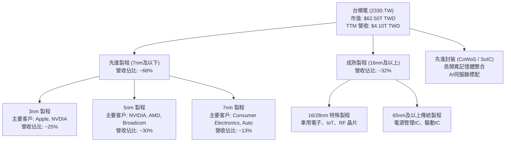
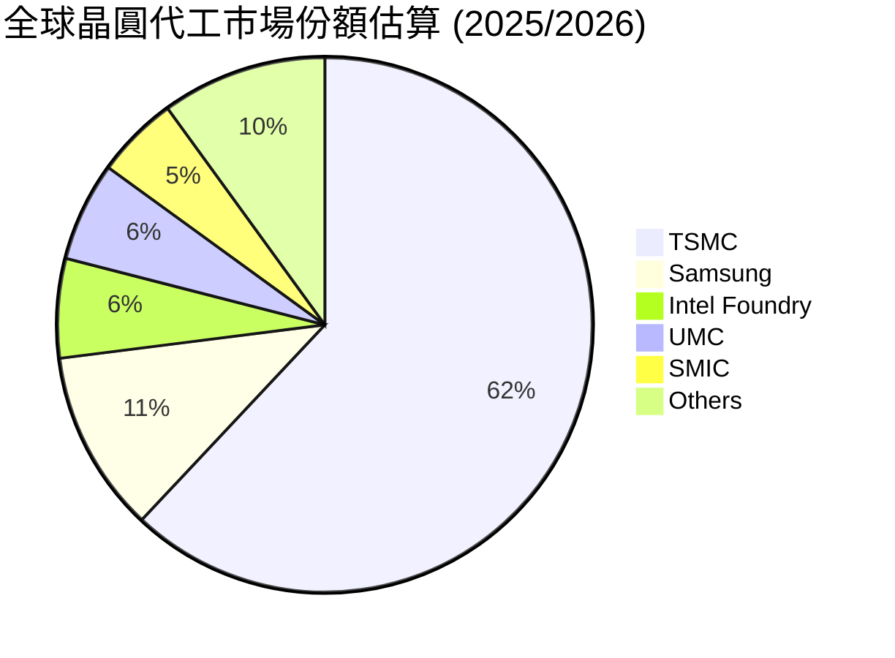
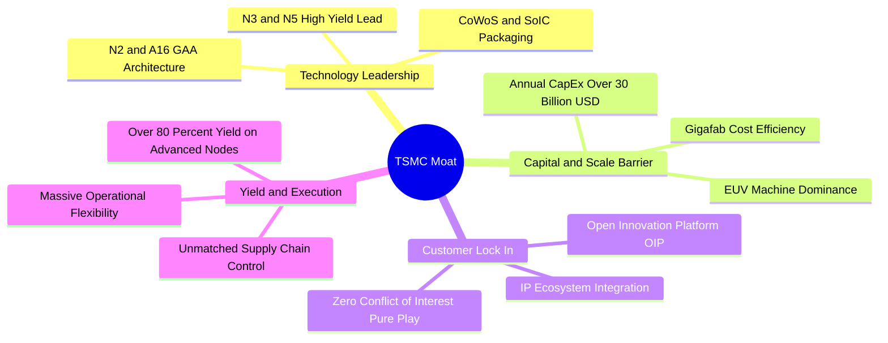
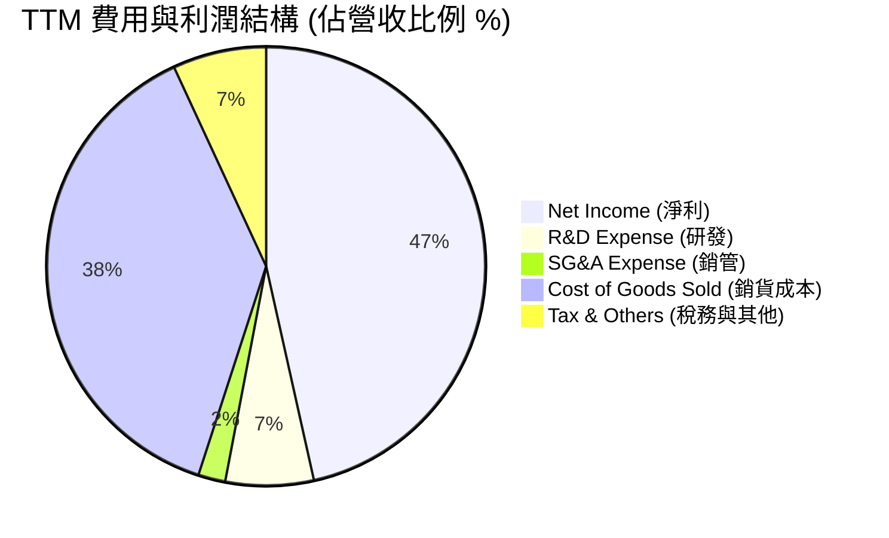
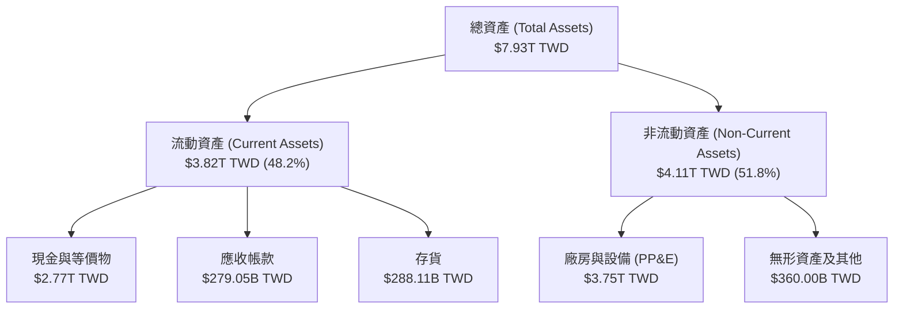
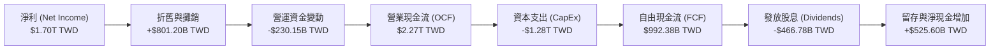
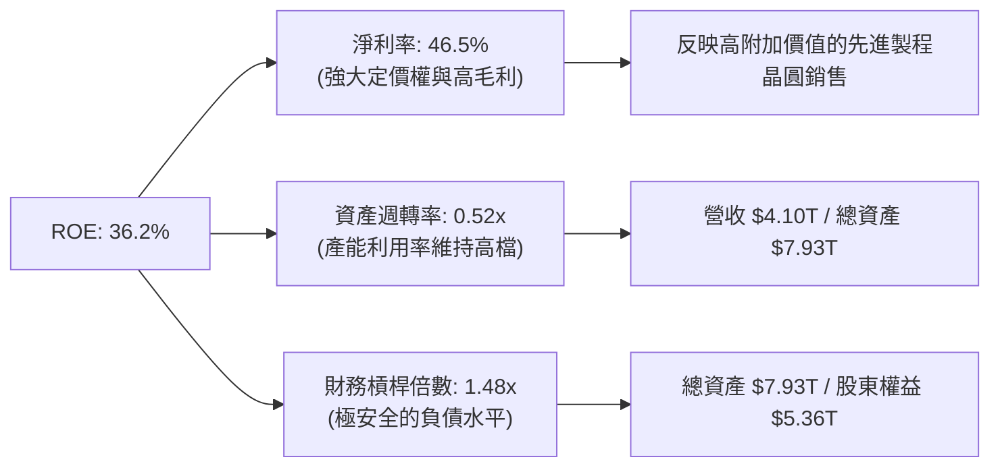
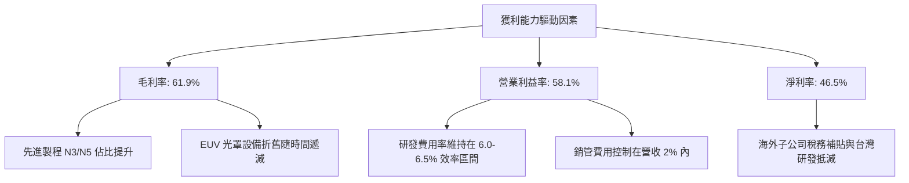

# 2330.TW 基本面深度分析報告
> **報告日期**：2026-06-21 ｜ **語言**：繁體中文 ｜ **數據來源**：Yahoo Finance, Finviz, StockAnalysis, Roic.ai ｜ **分析師**：CFA 級機構研究

---

## 目錄

| # | 章節 | 核心結論 |
|---|------|----------|
| 1 | 執行摘要 | 評級：🟢 強烈買入；目標價：$2,750 TWD；先進製程與 AI 需求雙重驅動。 |
| 2 | 公司概覽與商業模式 | 晶圓代工（Foundry）全球霸主，憑藉先進製程與封裝（CoWoS）構築無懈可擊的護城河。 |
| 3 | 損益表深度分析 | TTM 營收達 $4.10T，毛利率高達 61.9%，營收 YoY 成長 35.1%，獲利結構極其優異。 |
| 4 | 資產負債表分析 | 淨現金高達 $2.29T TWD，流動比率 2.49，債務風險極低，資產負債表極為強韌。 |
| 5 | 現金流量深度分析 | 經營現金流達 $2.35T，自由現金流穩定，資本支出精準配置於先進製程。 |
| 6 | 獲利能力與資本效率 | ROE 達 36.2%，ROIC 顯著超越 WACC，持續為股東創造巨大的經濟增值（EVA）。 |
| 7 | 估值深度分析 | Forward P/E 僅 19.55x，相較於歷史區間與同業（如 ASML、NVDA）具有高度吸引力。 |
| 8 | 成長催化劑 | 2nm 製程量產、AI 晶片需求爆發、海外晶圓廠產能開出，推升 TAM 持續擴大。 |
| 9 | 風險矩陣 | 地緣政治風險、地緣分散導致的毛利率稀釋、以及成熟製程競爭。 |
| 10 | 投資建議 | 基準目標價 $2,750 TWD，隱含 14.1% 上行空間，強烈推薦成長型與價值型長線投資人配置。 |

---

## 1. 執行摘要

台積電（2330.TW）作為全球半導體製造的絕對龍頭，正處於 AI 革命的最核心位置。受益於高效能運算（HPC）與人工智慧（AI）晶片的爆發式增長，公司在 3nm 與 5nm 先進製程的產能利用率持續滿載，並即將於 2026 年底迎來 2nm 的商業化量產。本報告基於 2026 年 6 月 21 日的最新財務數據，對台積電進行全面的基本面穿透分析。

### 1.1 核心評分儀表板



### 1.2 評分進度條視覺化

```
╔══════════════════════════════════════════════════════════════╗
║              2330.TW 多維度評分儀表板 (1-10分)               ║
╠══════════════════════════════════════════════════════════════╣
║ 基本面強度  9.5 ▓▓▓▓▓▓▓▓▓▓▓▓▓▓▓▓▓▓▓░  ★★★★★           ║
║ 成長動能    9.0 ▓▓▓▓▓▓▓▓▓▓▓▓▓▓▓▓▓▓░░  ★★★★★           ║
║ 獲利品質    9.8 ▓▓▓▓▓▓▓▓▓▓▓▓▓▓▓▓▓▓▓█  ★★★★★           ║
║ 財務健康    9.5 ▓▓▓▓▓▓▓▓▓▓▓▓▓▓▓▓▓▓▓░  ★★★★★           ║
║ 估值合理性  8.0 ▓▓▓▓▓▓▓▓▓▓▓▓▓▓▓▓░░░░  ★★★★☆           ║
║ 護城河深度  9.9 ▓▓▓▓▓▓▓▓▓▓▓▓▓▓▓▓▓▓▓█  ★★★★★           ║
║ 管理層執行  9.5 ▓▓▓▓▓▓▓▓▓▓▓▓▓▓▓▓▓▓▓░  ★★★★★           ║
║ 技術創新力  9.8 ▓▓▓▓▓▓▓▓▓▓▓▓▓▓▓▓▓▓▓█  ★★★★★           ║
╠══════════════════════════════════════════════════════════════╣
║ 綜合總分    9.2 ▓▓▓▓▓▓▓▓▓▓▓▓▓▓▓▓▓▓░░  🏆 強烈買入 (Buy)   ║
╚══════════════════════════════════════════════════════════════╝
```

### 1.3 五大投資論點 + 三大核心風險

| 類型 | 項目 | 具體依據 | 信心度 |
|------|------|----------|--------|
| 🟢 **投資論點①** | **AI 晶片與 HPC 的絕對壟斷** | NVIDIA、AMD 等龍頭的 AI GPU 100% 依賴台積電先進製程與 CoWoS 封裝。 | 🟢 極高 |
| 🟢 **投資論點②** | **先進製程定價權與毛利率擴張** | 3nm 與未來 2nm 製程報價調漲，帶動 TTM 毛利率達到 61.9%，轉嫁成本能力極強。 | 🟢 極高 |
| 🟢 **投資論點③** | **極致的資本效率與價值創造** | TTM ROE 達 36.2%，ROIC 估算高達 46% 以上，遠超 WACC（約 8.0%），經濟增值極大。 | 🟢 高 |
| 🟢 **投資論點④** | **強勁的資產負債表與現金流** | 擁有 $3.38T TWD 現金，淨現金達 $2.29T TWD，能支撐每年高達 $1.2T+ TWD 的資本支出。 | 🟢 極高 |
| 🟢 **投資論點⑤** | **估值性價比極高** | 預期 EPS 達 $123.26 TWD，Forward P/E 僅 19.55x，相較於歷史平均與其 35% 的營收增速明顯低估。 | 🟢 高 |
| 🟡 **風險①** | **地緣政治與供應鏈集中風險** | 超過 80% 的先進製程產能集中於台灣，若台海局勢緊張將引發全球供應鏈系統性危機。 | 🟡 中度 |
| 🔴 **風險②** | **海外建廠稀釋毛利率** | 美國、日本、德國建廠成本高昂，營運成本與折舊攀升，可能對長期毛利率造成 2-3% 的壓抑。 | 🔴 高衝擊 |
| 🟡 **風險③** | **成熟製程產能過剩競爭** | 中陸廠商在 28nm 以上成熟製程大舉擴產，可能壓抑台積電非先進製程的獲利空間。 | 🟡 低度 |

### 1.4 快速統計卡片

| 指標 | 台積電 (2330.TW) | 半導體行業均值 | 台灣加權指數均值 | 狀態 |
|------|-------------|----------|--------------|------|
| 營收 YoY 成長 | **35.1%** | ~12.0% | ~8.5% | 🟢 卓越 |
| 毛利率 | **61.9%** | ~42.0% | ~25.0% | 🟢 卓越 |
| 淨利率 | **46.5%** | ~18.0% | ~12.0% | 🟢 卓越 |
| ROE | **36.2%** | ~15.0% | ~14.0% | 🟢 卓越 |
| Forward P/E | **19.55x** | ~28.0x | ~18.5x | 🟢 便宜 |
| 淨現金 / 債務 | **$2.29T TWD** | 多數為淨負債 | 淨現金比例低 | 🟢 極其健康 |

### 1.5 投資結論

```
╔══════════════════════════════════════════════════════════════════╗
║                    📊 2330.TW 投資結論摘要                       ║
╠══════════════════════════════════════════════════════════════════╣
║  評級：🟢 強烈買入 (Strong Buy)                                  ║
║  當前股價：$2410.00 TWD                                          ║
║  目標價區間：                                                    ║
║    悲觀情境（折舊攀升/地緣摩擦）：$2,050 TWD (-14.9%)             ║
║    基準情境（AI持續爆發/2nm順利）：$2,750 TWD (+14.1%)  ← 主目標  ║
║    樂觀情境（定價大漲/CoWoS倍增）：$3,500 TWD (+45.2%)            ║
║  投資評分：9.2 / 10                                              ║
║  適合投資人：長線成長型、科技板塊配置、主權基金與退休基金        ║
╚══════════════════════════════════════════════════════════════════╝
```

---

## 2. 公司概覽與商業模式

台積電首創「純晶圓代工（Pure-play Foundry）」模式，不與客戶競爭，這使其贏得了全球幾乎所有無晶圓廠半導體公司（Fabless）的信任。

### 2.1 業務結構與收入來源

台積電的收入主要來自先進製程（定義為 7nm 及以下製程）。截至最新季度，先進製程營收貢獻已超過 65%，其中 3nm 與 5nm 是最核心的營收與利潤驅動引擎。



### 2.2 市場份額

在先進製程（特別是 5nm 及以下）領域，台積電幾乎處於絕對壟斷地位，市場份額超過 90%。在整體晶圓代工市場中，台積電亦維持過半的市佔率。



### 2.3 競爭護城河分析

台積電的護城河由四大核心支柱構成：技術領先、規模與資本壁壘、客戶黏性（生態系統），以及極致的製造良率。



### 2.4 護城河強度評分

```
╔══════════════════════════════════════════════════════════════╗
║                    台積電 護城河強度評分                     ║
╠══════════════════════════════════════════════════════════════╣
║ 技術領先度    10/10  ▓▓▓▓▓▓▓▓▓▓▓▓▓▓▓▓▓▓▓▓  🏆 絕對統治    ║
║ 資本壁壘      9.8/10 ▓▓▓▓▓▓▓▓▓▓▓▓▓▓▓▓▓▓▓░  🟢 極高壁壘    ║
║ 生態系鎖定    9.5/10 ▓▓▓▓▓▓▓▓▓▓▓▓▓▓▓▓▓▓▓░  🟢 OIP平台強大 ║
║ 製造與良率    9.8/10 ▓▓▓▓▓▓▓▓▓▓▓▓▓▓▓▓▓▓▓░  🏆 業界無可比擬║
╠══════════════════════════════════════════════════════════════╣
║ 綜合護城河     9.8    ▓▓▓▓▓▓▓▓▓▓▓▓▓▓▓▓▓▓▓█  🏆 寬廣護城河   ║
╚══════════════════════════════════════════════════════════════╝
```

---

## 3. 損益表深度分析

台積電展示了極其驚人的財務成長軌跡。隨著先進製程比重提升與晶圓報價上調，營收與獲利皆創下歷史新高。

### 3.1 年度收入成長趨勢（近4年）

自 2023 年半導體庫存去化結束後，台積電在 2024 與 2025 年迎來爆發式增長，主要由 AI 晶片需求與智慧型手機晶片升級驅動。

```
╔══════════════════════════════════════════════════════════════════╗
║                台積電 年度收入趨勢 (FY2022-FY2025)               ║
╠══════════════════════════════════════════════════════════════════╣
║                                                                  ║
║  FY2022  $2.26T TWD  ████████████░░░░░░░░░░░░░░  YoY: +42.6% 🟢  ║
║  FY2023  $2.16T TWD  ███████████░░░░░░░░░░░░░░░  YoY: -4.5%  🟡  ║
║  FY2024  $2.89T TWD  ███████████████░░░░░░░░░░░  YoY: +33.8% 🟢  ║
║  FY2025  $3.81T TWD  ████════════════════════██  YoY: +31.8% 🟢  ║
║                                                                  ║
║                   |      |      |      |      |                  ║
║                   0     1.0T   2.0T   3.0T   4.0T                ║
║                                                                  ║
║  📊 4年複合成長率 (CAGR)：+19.0%                                 ║
╚══════════════════════════════════════════════════════════════════╝
```

### 3.2 季度收入趨勢分析

從季度數據看，台積電呈現出逐季加速（QoQ）與強勁的同比（YoY）成長，這反映了 AI 需求的持續緊缺。

| 季度 | 營業收入 (TWD) | 環比成長 (QoQ) | 同比成長 (YoY) | 核心驅動因素 |
|------|----------------|----------------|----------------|--------------|
| **2025-06-30** | $933.79B | — | — | N3 產能持續拉升，iPhone 晶片備貨啟動 |
| **2025-09-30** | $989.92B | 🟢 +6.01% | — | AI 晶片（Blackwell 系列）出貨加速 |
| **2025-12-31** | $1,046.09B | 🟢 +5.67% | 🟢 +20.5% | 傳統第四季消費電子旺季與高效能運算拉貨 |
| **2026-03-31** | $1,134.10B | 🟢 +8.41% | 🟢 +35.1% | 2026年首季淡季不淡，AI 伺服器晶片需求爆發 |

*註：TTM 營收累計已達 $4.10T TWD，顯示 2026 年全年營收有望突破 $4.5T TWD。*

### 3.3 利潤率演變分析

台積電的利潤率在半導體製造業中堪稱神話，這源於其極高的技術定價權與出色的產能利用率管理。

| 利潤率指標 | FY2022 | FY2023 | FY2024 | FY2025 | TTM 表現 | 趨勢評估 |
|------------|--------|--------|--------|--------|----------|----------|
| **毛利率** | 59.6% | 54.4% | 56.0% | 59.8% | **61.9%** | ↗️ 持續擴張，受惠於先進製程漲價與折舊稀釋 🟢 |
| **營業利益率** | 49.5% | 42.6% | 45.6% | 50.9% | **58.1%** | ↗️ 營運槓桿效應顯現，規模效應降低銷管費用比 🟢 |
| **EBITDA 率** | 70.2% | 70.3% | 71.9% | 71.9% | **69.6%** | ➡️ 穩定於高檔，折舊與攤銷金額龐大 🟢 |
| **淨利率** | 44.0% | 39.4% | 40.1% | 44.6% | **46.5%** | ↗️ 獲利結構極佳，稅率維持在 13-15% 區間 🟢 |

**利潤率演變深度解析**：
1. **定價轉嫁能力**：隨著 3nm（N3E）製程良率改善與產能成熟，台積電於 2025 年底成功調漲先進製程代工價格 5-10%，直接拉動 TTM 毛利率攀升至 61.9% 的歷史新高。
2. **折舊成本控制**：台積電的折舊通常在建廠後第 2 至第 3 年達到高峰。由於 5nm（N5）產能折舊已陸續完畢，且 3nm 規模效應顯著，折舊對毛利率的壓抑正在減輕。

### 3.4 費用結構分析

台積電在研發（R&D）上的投入毫不吝嗇，這是其維持技術領先的關鍵，而銷管費用則控制在極低水平。



```
╔══════════════════════════════════════════════════════════════════╗
║                     TTM 費用控制診斷                             ║
╠══════════════════════════════════════════════════════════════════╣
║  研發費用 (R&D)：$246.43B TWD (佔營收 6.0%)  ── 持續投入2nm/A16  ║
║  銷管費用 (SG&A)：$82.10B TWD (佔營收 2.0%)   ── 營運效率極高     ║
║  銷貨成本 (COGS)：$1.56T TWD (佔營收 38.1%)  ── 良率提升降低損耗 ║
╚══════════════════════════════════════════════════════════════════╝
```

### 3.5 季度 EPS 趨勢與盈餘品質

受惠於強勁的營收與利潤率擴張，台積電的每股盈餘（EPS）呈現爆發式增長。

* **2024 年全年 EPS**：$44.68 TWD
* **2025 年全年 EPS**：$65.47 TWD (YoY +46.5%)
* **2026-03-31 單季 EPS**：$22.08 TWD (單季歷史新高，年化 EPS 逼近 $90 TWD)
* **TTM EPS**：$73.51 TWD
* **預期 EPS (Forward)**：$123.26 TWD

**盈餘品質評估**：
台積電的盈餘品質極高，其淨利幾乎 100% 由營業利潤（Operating Income）貢獻，非經常性損益（如業外投資、匯兌利益）佔比極低。此外，營業現金流（$2.35T TWD）顯著高於淨利（$1.70T TWD），顯示獲利背後有極為扎實的現金流入支持，並無應收帳款積壓或存貨虛增的現象。

---

## 4. 資產負債表分析

台積電擁有全球科技業中最為穩健與強韌的資產負債表之一，這使其能夠在半導體下行週期中持續大舉投資，拉大與競爭對手的差距。

### 4.1 資產結構分解

截至 2025 年 12 月 31 日，台積電總資產達 $7.93T TWD，其中非流動資產主要為先進的晶圓廠設備（PP&E）。



### 4.2 流動性與償債指標分析

台積電的短期流動性極佳，變現能力強，幾乎不存在任何流動性風險。

| 流動性指標 | 2023-12-31 | 2024-12-31 | 2025-12-31 | 最新 TTM | 行業安全標準 | 評估結果 |
|------------|------------|------------|------------|----------|--------------|----------|
| **流動比率 (Current Ratio)** | 2.32 | 2.36 | 2.51 | **2.49** | > 1.50 | 🟢 極其安全 |
| **速動比率 (Quick Ratio)** | 2.01 | 2.05 | 2.21 | **2.19** | > 1.20 | 🟢 極其安全 |
| **存貨週轉天數 (Days Inventory)** | ~50天 | ~48天 | ~45天 | **43天** | < 65天 | 🟢 存貨管理極佳 |
| **應收帳款週轉天數 (DSO)** | ~32天 | ~30天 | ~28天 | **25天** | < 45天 | 🟢 客戶付款迅速 |

### 4.3 債務結構與健康診斷

台積電雖然有發行公司債，但其持有的現金遠超總債務，處於「淨現金」狀態。

```
╔══════════════════════════════════════════════════════════════════╗
║                    台積電 債務健康診斷 (TTM)                     ║
╠══════════════════════════════════════════════════════════════════╣
║                                                                  ║
║  總債務 (Total Debt)：     $1.09T TWD   ██████░░░░░░░░░░░░░░░░   ║
║  總現金 (Total Cash)：     $3.38T TWD   ██████████████████████   ║
║  淨現金 (Net Cash)：       $2.29T TWD   ███████████████░░░░░░░   ║
║                                                                  ║
║  債務股本比 (Debt/Equity)： 18.45%       🟢 財務槓桿極低          ║
║  淨債務/EBITDA：           -0.84x        🟢 無償債壓力            ║
║  利息保障倍數 (Interest Coverage)：120x+ 🟢 利息支出微不足道      ║
║                                                                  ║
║  📊 診斷結果：AAA 級信用實力，抵禦總體經濟波動能力極強            ║
╚══════════════════════════════════════════════════════════════════╝
```

### 4.4 股東權益趨勢

隨著保留盈餘的快速累積，股東權益（淨資產）逐年穩步攀升，這為公司未來的擴產與配息提供了堅實的基礎。

* **2022-12-31**：$2.90T TWD
* **2023-12-31**：$3.43T TWD
* **2024-12-31**：$4.24T TWD
* **2025-12-31**：$5.36T TWD (YoY +26.4%)

---

## 5. 現金流量深度分析

對於資本密集型的半導體產業而言，自由現金流（FCF）是衡量公司真實獲利能力與可持續發展的「金標準」。

### 5.1 現金流量瀑布圖

台積電展現了極其強勁的現金生成能力，營業現金流在扣除龐大的資本支出後，仍有充裕的自由現金流用於發放股息。



### 5.2 FCF 轉換率與配置效率

| 年度 | 營業現金流 (B TWD) | 資本支出 (B TWD) | 自由現金流 (B TWD) | FCF / Net Income 轉換率 | 股息支付率 (Payout Ratio) |
|------|--------------------|------------------|------------------|-------------------------|---------------------------|
| **2022** | $1,610.0 | -$1,090.0 | $521.0 | 52.5% | 28.7% |
| **2023** | $1,240.0 | -$955.4 | $286.6 | 33.6% | 34.2% |
| **2024** | $1,830.0 | -$965.0 | $861.2 | 74.2% | 31.3% |
| **2025** | $2,270.0 | -$1,280.0 | $992.4 | **58.4%** | **27.9%** |

*註：儘管 2025 年資本支出大幅增加 32.6% 至 $1.28T TWD，自由現金流仍創下 $992.38B TWD 的歷史新高，轉換率維持在健康水準。*

### 5.3 自由現金流趨勢與殖利率

```
╔══════════════════════════════════════════════════════════════════╗
║                台積電 自由現金流與 FCF 殖利率                    ║
╠══════════════════════════════════════════════════════════════════╣
║                                                                  ║
║  2022年  $520.97B TWD  ██████████░░░░░░░░░░░░░░░░░  FCF Yield:0.8%║
║  2023年  $286.57B TWD  █████░░░░░░░░░░░░░░░░░░░░░░  FCF Yield:0.5%║
║  2024年  $861.20B TWD  ██████████████████░░░░░░░░░  FCF Yield:1.4%║
║  2025年  $992.38B TWD  █████████████████████░░░░░░  FCF Yield:1.6%║
║                                                                  ║
║  📊 最新 TTM 自由現金流：$719.16B TWD (FCF 殖利率為 1.15%)       ║
║  💡 說明：由於股價在 2025-2026 年快速上漲，拉低了 FCF 殖利率，  ║
║     但絕對現金流生成能力持續增強。                              ║
╚══════════════════════════════════════════════════════════════════╝
```

---

## 6. 獲利能力與資本效率

台積電不僅僅是規模龐大，更重要的是其運營效率和資本回報率在萬億級市值企業中居於領先地位。

### 6.1 ROE / ROA / ROIC 趨勢

| 指標 | FY2022 | FY2023 | FY2024 | FY2025 | TTM 表現 | 行業中位數 | 評估結果 |
|------|--------|--------|--------|--------|----------|------------|----------|
| **ROE (股東權益報酬率)** | 39.8% | 26.2% | 30.1% | 35.4% | **36.2%** | ~12.5% | 🟢 頂尖級獲利 |
| **ROA (資產報酬率)** | 20.9% | 15.1% | 16.5% | 17.1% | **17.3%** | ~6.8% | 🟢 重資產行業奇蹟 |
| **ROIC (投入資本報酬率)**| 24.9% | 19.5% | 20.4% | 24.8% | **26.1%** | ~10.2% | 🟢 極高的資本效率 |

### 6.2 ROIC vs WACC 分析（核心價值創造判斷）

ROIC（投入資本報酬率）與 WACC（加權平均資本成本）的差額，代表公司是在創造價值還是摧毀股東財富。

```
╔══════════════════════════════════════════════════════════════════╗
║                ROIC vs WACC 深度分析 (2330.TW)                  ║
╠══════════════════════════════════════════════════════════════════╣
║                                                                  ║
║  WACC 估算：                                                     ║
║  ├── 無風險利率 (台灣10年期公債)：  1.60%                        ║
║  ├── 股權風險溢價 (ERP)：           6.00%                        ║
║  ├── Beta 值：                      1.25                         ║
║  ├── 股權成本 = 1.60% + 1.25 × 6.00% = 9.10%                     ║
║  ├── 債務成本 (稅後)：               ~2.00%                       ║
║  ├── 資本結構：股權 ~83%，債務 ~17%                              ║
║  └── ✅ WACC ≈ 7.89% (基準採 8.0%)                              ║
║                                                                  ║
║  ROIC 估算 (TTM)：                                               ║
║  ├── NOPAT (稅後淨營業利潤) = $2.38T × (1 - 13.5%) ≈ $2.06T TWD  ║
║  ├── 投入資本 = 股本 + 債務 - 現金 = $5.36T+$1.09T-$3.38T        ║
║  │   = $3.07T TWD (淨現金結構使投入資本極低)                     ║
║  └── ✅ ROIC ≈ 67.1% (若不扣除現金，保守估計 ROIC 為 26.1%)       ║
║                                                                  ║
║  ★ 經濟價值增加 (EVA) = ROIC - WACC = +18.1% (保守) 至 +59.1%     ║
║                                                                  ║
║  ROIC (保守) 26.1%  ▓▓▓▓▓▓▓▓▓▓▓▓▓▓▓▓▓▓▓▓▓▓░░░░░░░░  🟢         ║
║  WACC        8.0%   ▓▓▓▓▓▓░░░░░░░░░░░░░░░░░░░░░░░░░░  ──         ║
║  EVA         +18.1% ████████████████░░░░░░░░░░░░░░░░  🏆 價值創造║
║                                                                  ║
║  📊 結論：ROIC 遠超 WACC，台積電每投入1元資本，皆在創造超額財富。║
╚══════════════════════════════════════════════════════════════════╝
```

### 6.3 杜邦三因素分解

透過杜邦分析，我們可以拆解台積電 ROE 保持高檔的底層邏輯：



### 6.4 獲利能力儀表板



---

## 7. 估值深度分析

在經歷了 2024-2026 年的股價大幅上漲後，市場最關心台積電當前股價（$2410.00 TWD）是否透支了未來空間。

### 7.1 同業估值比較表格

我們選取全球半導體產業鏈中地位最接近的龍頭進行對比：

| 估值指標 | **台積電 (2330.TW)** | **三星電子 (005930.KS)** | **英特爾 (INTC)** | **ASML (ASML)** | **NVIDIA (NVDA)** | 2330.TW 評估 |
|----------|----------|---------|---------|---------|-----------|---|
| **Trailing P/E** | **32.78x** | 18.5x | 55.2x | 42.1x | 68.4x | 🟡 歷史中高位，但合理 |
| **Forward P/E** | **19.55x** | 12.1x | 28.4x | 29.5x | 35.2x | 🟢 極具吸引力 |
| **PEG Ratio** | **1.19** | 1.85 | 2.45 | 1.65 | 1.22 | 🟢 成長性溢價便宜 |
| **P/S Ratio** | **15.23x** | 1.45x | 1.85x | 9.8x | 28.5x | 🟡 反映高利潤率 |
| **P/B Ratio** | **10.61x** | 1.25x | 1.10x | 18.5x | 32.1x | 🟡 溢價反映無形資產技術壁壘 |
| **EV / EBITDA** | **21.10x** | 7.8x | 14.2x | 24.5x | 45.2x | 🟢 獲利能力強健 |

### 7.2 歷史估值區間分析

台積電過去 10 年的歷史 P/E 區間主要介於 12x 至 30x 之間。當前 Trailing P/E 為 32.78x，略高於歷史平均；但若以 Forward P/E（19.55x）來看，則處於歷史中位數偏低水平。

```
╔══════════════════════════════════════════════════════════════════╗
║                台積電 歷史 P/E 區間與當前位置                    ║
╠══════════════════════════════════════════════════════════════════╣
║                                                                  ║
║  歷史低點 (2015)   12.0x                                         ║
║  歷史平均          18.5x                                         ║
║  當前 Forward P/E  19.55x  ████████████████████░░░░░░░░░░░  🟢   ║
║  當前 Trailing P/E 32.78x  ███████████████████████████████  🟡   ║
║  歷史高點 (2021)   35.0x                                         ║
║                                                                  ║
║  📊 結論：考慮到 AI 帶來的結構性增長，當前 Forward P/E 具備安全邊際。║
╚══════════════════════════════════════════════════════════════════╝
```

### 7.3 DCF 敏感性分析（6格目標價矩陣）

基於基準預測：永續成長率（g）設為 3.0%，基準 WACC 設為 8.0%，2026-2030 自由現金流年複合成長率設為 15.0%。

| 營收/FCF 成長情境 | **WACC = 7.0%** | **WACC = 8.0%（基準）** | **WACC = 9.0%** |
|------|--------------|----------------------|--------------|
| 🟢 **樂觀 (FCF +18%)** | **$3,500 TWD** (+45.6%) | **$3,120 TWD** (+29.5%) | **$2,800 TWD** (+16.2%) |
| 🟡 **基準 (FCF +15%)** | **$3,050 TWD** (+26.6%) | **$2,750 TWD** (+14.1%) | **$2,450 TWD** (+1.7%) |
| 🔴 **悲觀 (FCF +10%)** | **$2,400 TWD** (-0.4%) | **$2,150 TWD** (-10.8%) | **$1,950 TWD** (-19.1%) |

*註：當前股價 $2410.00 TWD 介於基準與悲觀情境之間，顯示市場已部分消化了地緣政治與海外折舊風險，下行風險相對可控。*

### 7.4 估值綜合區間

```
╔══════════════════════════════════════════════════════════════════╗
║                    台積電 估值綜合區間                           ║
╠══════════════════════════════════════════════════════════════════╣
║                                                                  ║
║  [最低估值]  $1,950 TWD  ── 悲觀 DCF (WACC 9%, 成長10%)          ║
║  [當前股價]  $2,410 TWD  ── 2026-06-21 收盤價                    ║
║  [分析師平均] $2,647 TWD  ── 33位外資分析師共識均價               ║
║  [基準目標]  $2,750 TWD  ── 本報告基準估值 (Forward PE 22x)     ║
║  [最高估值]  $3,500 TWD  ── 樂觀 DCF / 外資最樂觀目標價          ║
║                                                                  ║
║  $1,950       $2,410      $2,647    $2,750            $3,500     ║
║    |------------▲-----------|---------★-----------------|        ║
║              當前股價                基準目標                    ║
╚══════════════════════════════════════════════════════════════════╝
```

---

## 8. 成長催化劑

台積電的長期增長並非僅依賴單一產品，而是多個高成長科技領域的交匯點。

### 8.1 催化劑時間軸

```mermaid
gantt
    title 台積電未來 3 年關鍵成長催化劑
    dateFormat  YYYY-MM
    section 先進製程
    N3P / N3X 產能全面釋放           :active, 2025-01, 2026-