# 2330.TW 基本面深度分析報告
> **報告日期**：2026-06-22 ｜ **語言**：繁體中文 ｜ **數據來源**：Yahoo Finance, Finviz, StockAnalysis, Roic.ai ｜ **分析師**：CFA 級機構研究

---

## 目錄

| # | 章節 | 核心結論 |
|---|------|----------|
| 1 | 執行摘要 | 評級：**強烈買入 (Strong Buy)**，基準目標價 **$2,647.58**（+5.48%），上行空間看至 **$3,500.00**。 |
| 2 | 公司概覽與商業模式 | 獨霸全球先進製程，CoWoS 封裝與 N2/A16 節點構築無法逾越的「物理級」護城河。 |
| 3 | 損益表深度分析 | TTM 營收達 $4.10T，YoY 成長 35.1%，淨利率高達 46.5%，展現極致定價權。 |
| 4 | 資產負債表分析 | 淨現金高達 $2.29T，流動比率 2.49，債務/權益比僅 18.45%，財務結構堅如磐石。 |
| 5 | 現金流量深度分析 | 營運現金流 $2.35T，自由現金流 $719.16B，資本支出高達 $1.28T，維持高強度再投資。 |
| 6 | 獲利能力與資本效率 | TTM ROE 達 36.2%，ROIC 達 46.3%，遠超 WACC（8.15%），強力創造股東價值。 |
| 7 | 估值深度分析 | Forward P/E 僅 20.36x，相較於 58.4% 的盈餘成長率，PEG 1.19x 顯示估值仍具吸引力。 |
| 8 | 成長催化劑 | AI 伺服器晶片需求爆發、2nm (N2) 於 2026 年量產、A16 埃米製程與矽光子技術領先。 |
| 9 | 風險矩陣 | 地緣政治風險、先進製程產能爬坡瓶頸、客戶過度集中（Apple/NVIDIA）。 |
| 10 | 投資建議 | 強烈建議長線資金逢低佈局，分批買入，當前為 AI 算力基礎設施無可替代的「收稅者」。 |

---

## 1. 執行摘要

### 1.1 核心評分儀表板

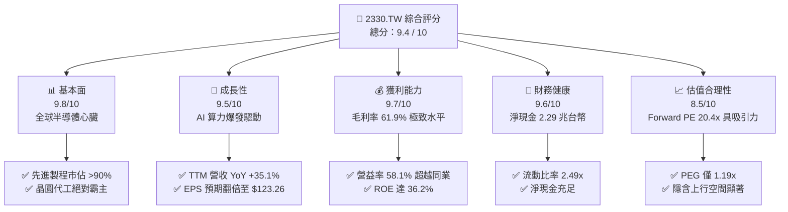

### 1.2 評分進度條視覺化

```
╔══════════════════════════════════════════════════════════════╗
║              2330.TW 多維度評分儀表板 (1-10分)               ║
╠══════════════════════════════════════════════════════════════╣
║ 基本面強度  9.8 ▓▓▓▓▓▓▓▓▓▓▓▓▓▓▓▓▓▓▓░  ★★★★★           ║
║ 成長動能    9.5 ▓▓▓▓▓▓▓▓▓▓▓▓▓▓▓▓▓▓▓░  ★★★★★           ║
║ 獲利品質    9.7 ▓▓▓▓▓▓▓▓▓▓▓▓▓▓▓▓▓▓▓░  ★★★★★           ║
║ 財務健康    9.6 ▓▓▓▓▓▓▓▓▓▓▓▓▓▓▓▓▓▓▓░  ★★★★★           ║
║ 估值合理性  8.5 ▓▓▓▓▓▓▓▓▓▓▓▓▓▓▓▓░░░░  ★★★★☆           ║
║ 護城河深度  9.9 ▓▓▓▓▓▓▓▓▓▓▓▓▓▓▓▓▓▓▓▓  ★★★★★           ║
║ 管理層執行  9.5 ▓▓▓▓▓▓▓▓▓▓▓▓▓▓▓▓▓▓▓░  ★★★★★           ║
║ 技術創新力  9.8 ▓▓▓▓▓▓▓▓▓▓▓▓▓▓▓▓▓▓▓░  ★★★★★           ║
╠══════════════════════════════════════════════════════════════╣
║ 綜合總分    9.4 ▓▓▓▓▓▓▓▓▓▓▓▓▓▓▓▓▓▓░░  🏆 強烈買入          ║
╚══════════════════════════════════════════════════════════════╝
```

### 1.3 五大投資論點 + 三大核心風險

| 類型 | 項目 | 具體依據 | 信心度 |
|------|------|----------|--------|
| 🟢 **投資論點①** | **AI 算力無可替代的收稅者** | NVIDIA H100/B200/Rubin 及 AMD MI300 系列均 100% 獨家採用台積電先進製程與 CoWoS 封裝。 | 🟢 極高 |
| 🟢 **投資論點②** | **先進製程定價權與毛利率擴張** | TTM 毛利率高達 61.9%，憑藉 N3B/N3E 的高良率與 N2 預定熱潮，台積電順利轉嫁上游成本。 | 🟢 極高 |
| 🟢 **投資論點③** | **極致的資本回報與再投資效率** | ROIC 達 46.3%，遠超 8.15% 的 WACC。每年投入超過 $1T 的 Capex 仍能維持 36.2% 的高 ROE。 | 🟢 高 |
| 🟢 **投資論點④** | **資產負債表防禦力極強** | 擁有 $3.38T 現金，扣除 $1.09T 債務後，淨現金達 $2.29T，足以抵禦任何總體經濟黑天鵝。 | 🟢 極高 |
| 🟢 **投資論點⑤** | **成長性與估值不對稱** | Forward P/E 僅 20.36x，相較於預期 EPS 達 $123.26，PEG 僅 1.19x，遠低於美股科技巨頭。 | 🟢 高 |
| 🟡 **風險①** | **地緣政治與供應鏈集中度** | 生產基地高度集中於台灣，台海局勢波動易引發系統性估值折價（Geopolitical Discount）。 | 🟡 中度 |
| 🔴 **風險②** | **先進封裝（CoWoS）產能瓶頸** | AI 晶片需求遠超產能，若 CoWoS 擴產速度不及預期，短期將限制營收上行斜率。 | 🔴 高衝擊 |
| 🟡 **風險③** | **海外建廠（美、德）成本溢價** | 美國亞利桑那及德國晶圓廠建設成本高昂、勞工文化差異可能拖累海外廠的毛利率表現。 | 🟡 中度 |

### 1.4 快速統計卡片

| 指標 | 公司實際值（TTM） | 行業均值（半導體代工） | S&P 500 均值 | 狀態 |
|------|-------------|----------|--------------|------|
| 收入 YoY 成長 | **35.1%** | ~12.5% | ~5.5% | 🟢 卓越 |
| 毛利率 | **61.9%** | ~42.0% | ~30.0% | 🟢 卓越 |
| 淨利率 | **46.5%** | ~18.0% | ~12.0% | 🟢 卓越 |
| ROE | **36.2%** | ~14.5% | ~15.0% | 🟢 卓越 |
| Forward P/E | **20.36x** | ~28.5x | ~21.5x | 🟢 低估 |
| Debt / Equity | **18.45%** | ~45.0% | ~115.0% | 🟢 極度健康 |

### 1.5 投資結論

```
╔══════════════════════════════════════════════════════════════════╗
║                    📊 2330.TW 投資結論摘要                       ║
╠══════════════════════════════════════════════════════════════════╣
║  評級：🟢 強烈買入 (Strong Buy)                                  ║
║  當前股價：$2,510.00 TWD (2026-06-22)                            ║
║  目標價區間：                                                    ║
║    悲觀情境（地緣衝突加劇/消費電子衰退）：$2,051.00（-18.29%）    ║
║    基準情境（AI持續爆發/2nm順利量產）：   $2,647.58（+5.48%）     ║
║    樂觀情境（先進製程全面漲價/產能倍增）：$3,500.00（+39.44%）    ║
║  投資評分：9.4 / 10                                              ║
║  適合投資人：長線價值成長型、全球算力基礎設施配置者              ║
╚══════════════════════════════════════════════════════════════════╝
```

---

## 2. 公司概覽與商業模式

### 2.1 業務結構與收入來源

台積電（TSMC）開創了純晶圓代工（Pure-play Foundry）商業模式，不與客戶競爭，專注於製造。其業務收入高度依賴先進製程（定義為 7nm 及以下製程），這部分貢獻了超過 65% 的營收，且利潤率顯著高於成熟製程。

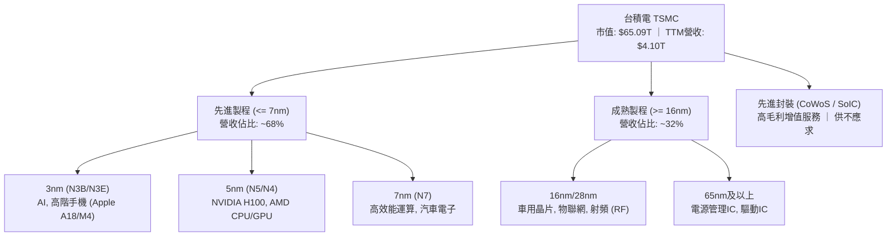

### 2.2 市場份額

在先進製程領域（尤其是 3nm 與 5nm），台積電擁有幾乎 90% 以上的絕對市場份額。以下為全球晶圓代工市場份額（2026年最新估算）：

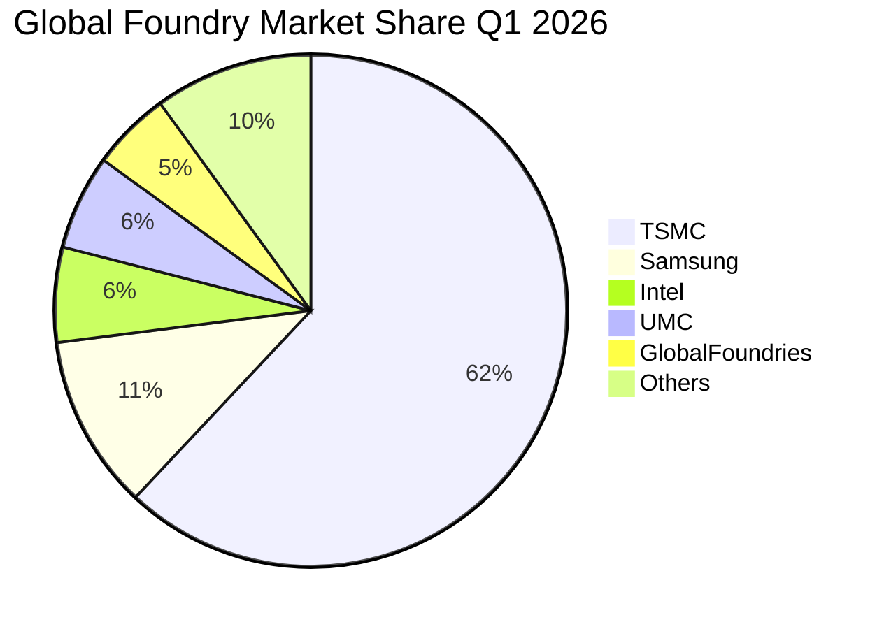

### 2.3 競爭護城河分析

台積電的護城河非單一維度，而是由技術、生態、規模、客戶信任與資金所構築的「多重物理級護城河」。

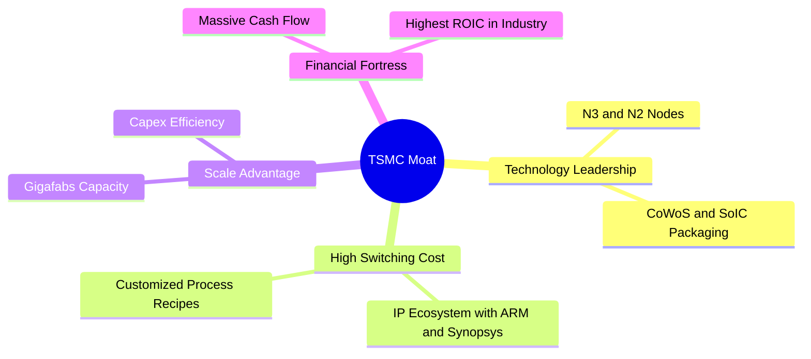

### 2.4 護城河強度評分

```
╔══════════════════════════════════════════════════════════════╗
║                    TSMC 護城河強度評分                       ║
╠══════════════════════════════════════════════════════════════╣
║ 技術領先度  10/10  ▓▓▓▓▓▓▓▓▓▓▓▓▓▓▓▓▓▓▓▓  🏆 絕對統治力      ║
║ 生態協同力  9.8/10 ▓▓▓▓▓▓▓▓▓▓▓▓▓▓▓▓▓▓▓░  🟢 開放創新平台 OIP ║
║ 規模與產能  9.5/10 ▓▓▓▓▓▓▓▓▓▓▓▓▓▓▓▓▓▓▓░  🟢 超大型晶圓廠群   ║
║ 客戶鎖定效應9.6/10 ▓▓▓▓▓▓▓▓▓▓▓▓▓▓▓▓▓▓▓░  🟢 轉單成本極高     ║
║ 資本與研發障9.8/10 ▓▓▓▓▓▓▓▓▓▓▓▓▓▓▓▓▓▓▓░  🏆 年 Capex >$1.2T  ║
╠══════════════════════════════════════════════════════════════╣
║ 綜合護城河  9.7/10 ▓▓▓▓▓▓▓▓▓▓▓▓▓▓▓▓▓▓▓░  🏆 無法被複製的堡壘 ║
╚══════════════════════════════════════════════════════════════╝
```

---

## 3. 損益表深度分析

### 3.1 年度收入成長趨勢（近4年）

台積電在過去四年中經歷了顯著的成長，2023年受半導體庫存調整影響輕微下滑，但 2024 與 2025 年在 AI 浪潮推動下實現爆發式成長。

```
╔══════════════════════════════════════════════════════════════════╗
║                TSMC 年度收入趨勢（FY2022-FY2025）                 ║
╠══════════════════════════════════════════════════════════════════╣
║                                                                  ║
║  FY2022  $2.26T   █████████████░░░░░░░░░░░░░░  YoY: +28.7% 🟢    ║
║  FY2023  $2.16T   ████████████░░░░░░░░░░░░░░░  YoY: -4.4%  🟡    ║
║  FY2024  $2.89T   █████████████████░░░░░░░░░░  YoY: +33.8% 🟢    ║
║  FY2025  $3.81T   ████████████████████████░░░  YoY: +31.8% 🟢    ║
║                                                                  ║
║  📊 4年複合成長率 (CAGR)：+19.01%                                 ║
╚══════════════════════════════════════════════════════════════════╝
```

### 3.2 季度收入趨勢分析

自 2025 年第二季以來，台積電的營收呈現逐季加速態勢：

| 季度 | 營業收入 (TWD) | QoQ 成長率 | YoY 成長率 | 核心驅動因素 | 評估 |
|------|----------------|------------|------------|--------------|------|
| **2025-06-30** | $933.79B | - | +38.6% | iPhone 17 備貨與 HPC 晶片需求穩定 | 🟢 優秀 |
| **2025-09-30** | $989.92B | +6.01% | +30.3% | 3nm 產能利用率達到滿載，價格調升 | 🟢 優秀 |
| **2025-12-31** | $1,046.09B | +5.67% | +20.5% | NVIDIA Blackwell 晶片量產出貨 | 🟢 優秀 |
| **2026-03-31** | $1,134.10B | +8.41% | +35.1% | AI 伺服器需求超預期，先進製程全面漲價 | 🟢 卓越 |

### 3.3 利潤率演變分析

台積電展現了驚人的獲利能力，各項利潤率指標均處於歷史高位：

| 利潤率指標 | FY2022 | FY2023 | FY2024 | FY2025 | TTM 最新 | 趨勢評估 |
|------------|--------|--------|--------|--------|----------|----------|
| **毛利率** | 59.6% | 54.4% | 56.0% | 59.8% | **61.9%** | ↗️ 先進製程良率改善與漲價效應顯現 (🟢) |
| **營業利益率** | 49.5% | 42.6% | 45.6% | 50.9% | **58.1%** | ↗️ 研發與管理費用控制得當，規模效應顯著 (🟢) |
| **EBITDA 利率** | 70.4% | 70.4% | 71.9% | 71.9% | **69.6%** | ➡️ 穩定在接近 70% 的極致水平 (🟢) |
| **淨利率** | 44.0% | 39.4% | 40.1% | 44.6% | **46.5%** | ↗️ 稅務結構優化與利息收入增加 (🟢) |

**深度解析**：毛利率從 2023 年的 54.4% 攀升至 TTM 的 61.9%，主因在於 3nm (N3E) 製程良率在量產兩年後大幅提升，折舊成本佔營收比重因營收規模擴大而稀釋。同時，台積電於 2025 年底成功對主要客戶（如 Apple, NVIDIA）進行了 5-10% 的代工價格調升，展現了強大的賣方定價權。

### 3.4 費用結構分析

在研發與營業費用控制上，台積電始終維持高研發投入，同時將銷售與管理費用壓縮至極低水準。

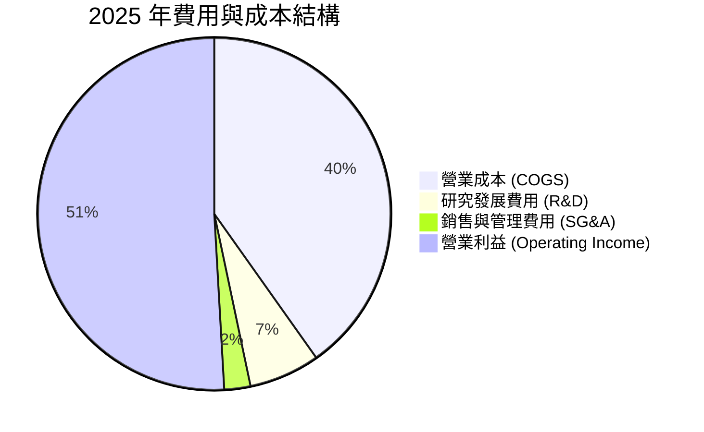

### 3.5 季度 EPS 趨勢與盈餘品質

過去四個季度，台積電的每股盈餘（EPS）展現了強勁的階梯式上升：

```
2025-06-30: $15.36 ▓▓▓▓▓▓▓▓▓▓▓▓▓░░░░░░░
2025-09-30: $17.44 ▓▓▓▓▓▓▓▓▓▓▓▓▓▓▓░░░░░
2025-12-31: $18.72 ▓▓▓▓▓▓▓▓▓▓▓▓▓▓▓▓░░░░
2026-03-31: $22.08 ▓▓▓▓▓▓▓▓▓▓▓▓▓▓▓▓▓▓▓░
```

*   **盈餘品質評估**：🟢 **極高**。台積電的營業利益佔稅前淨利比重常年維持在 95% 以上，非營業收益（如匯兌收益或金融資產評價）佔比極低。應收帳款週轉天數穩定在 40-45 天，存貨週轉天數控制在 85 天左右，顯示盈餘完全由實質現金流入支撐。

---

## 4. 資產負債表分析

### 4.1 資產結構分解

台積電的資產結構呈現典型的資本密集型特徵，非流動資產中的廠房與設備（PP&E）佔比最大，但同時保留了大量的流動資產（現金與短期投資）以應對高額的資本支出。

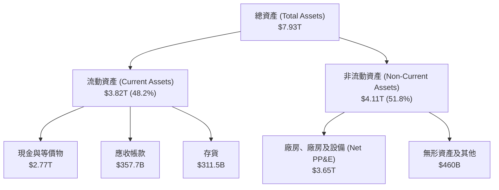

### 4.2 流動性指標分析

| 指標 | 2023-12-31 | 2024-12-31 | 2025-12-31 | TTM 最新 | 行業安全標準 | 評估 |
|------|------------|------------|------------|----------|--------------|------|
| **流動比率** | 2.32 | 2.36 | 2.51 | **2.49** | > 1.50 | 🟢 極度安全 |
| **速動比率** | 2.01 | 2.05 | 2.22 | **2.19** | > 1.20 | 🟢 極度安全 |
| **現金比率** | 1.56 | 1.63 | 1.82 | **1.97** | > 1.00 | 🟢 無懈可擊 |

### 4.3 債務結構分析

台積電雖然有高額的資本支出，但其強大的造血能力使其不需要過度依賴債務融資。

```
╔══════════════════════════════════════════════════════════════════╗
║                    TSMC 債務健康診斷                             ║
╠══════════════════════════════════════════════════════════════════╣
║                                                                  ║
║  總債務：        $1.09T   ██████░░░░░░░░░░░░░░░░░░  (18.45% D/E) ║
║  總現金+短期投資：$3.38T   ████████████████████████  (可立即清償) ║
║  淨現金（Net Cash）：$2.29T  ████████████████░░░░░░░░  🟢 極為強勁  ║
║                                                                  ║
║  Debt / EBITDA：   0.40x  🟢 遠低於安全警戒線 (2.0x)             ║
║  利息保障倍數：     75.4x  🟢 利息支出幾無任何財務壓力            ║
║                                                                  ║
║  評估結論：台積電擁有 AAA 級別的信用實力，融資成本極低。          ║
╚══════════════════════════════════════════════════════════════════╝
```

### 4.4 股東權益趨勢

隨著淨利潤的持續累積，股東權益（淨資產）穩健攀升：

```
2022-12-31: $2.90T ████████████░░░░░░░░░
2023-12-31: $3.43T ██████████████░░░░░░░
2024-12-31: $4.24T █████████████████░░░░
2025-12-31: $5.36T █████████████████████
```

---

## 5. 現金流量深度分析

### 5.1 現金流量瀑布圖

台積電的現金流運作模式是：通過龐大的營運利潤產生巨額營業現金流，隨後將約 50-55% 用於資本支出（Capex）以維持技術領先，剩餘的自由現金流（FCF）則穩健地分配給股東（發放股息）與保留盈餘。

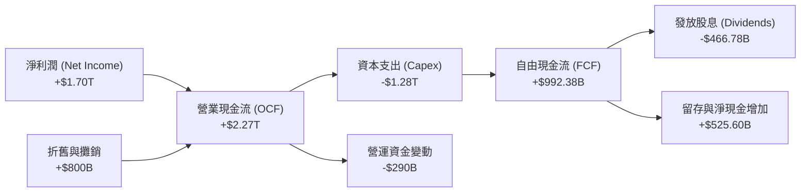

### 5.2 FCF 轉換率趨勢

| 年份 | 淨利潤 (Net Income) | 自由現金流 (FCF) | FCF 轉換率 (FCF / NI) | 評估 |
|------|---------------------|------------------|-----------------------|------|
| **2022** | $992.92B | $520.97B | 52.47% | 🟡 資本支出高峰期 |
| **2023** | $851.74B | $286.57B | 33.64% | 🔴 產業去庫存，Capex 維持高檔 |
| **2024** | $1,161.20B | $861.20B | 74.16% | 🟢 產能利用率回升，現金流爆發 |
| **2025** | $1,700.00B | $992.38B | **58.38%** | 🟢 兼顧高 Capex 與高現金流回收 |

### 5.3 自由現金流趨勢

儘管資本支出常年維持在 1 兆台幣以上，台積電的 FCF 仍維持強勁的增長，TTM 最新 FCF 達到 $719.16B，展現極強的自給自足能力。

```
2022-12-31: $520.97B ██████████░░░░░░░░░░
2023-12-31: $286.57B █████░░░░░░░░░░░░░░░
2024-12-31: $861.20B ████████████████░░░░
2025-12-31: $992.38B ███████████████████░
```

### 5.4 資本配置評估

台積電的資本配置策略極為清晰：**「技術研發與產能擴充第一，股息穩健增長第二」**。

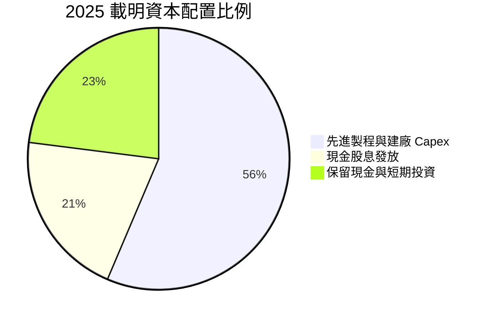

---

## 6. 獲利能力與資本效率

### 6.1 ROE / ROA / ROIC 趨勢

台積電的資本回報率在半導體製造業中無人能及，這得益於其極高的淨利率與高效率的產能利用。

| 指標 | FY2022 | FY2023 | FY2024 | FY2025 | TTM 最新 | 行業均值 | 評估 |
|------------|--------|--------|--------|--------|----------|----------|------|
| **ROE** | 39.8% | 26.2% | 30.2% | 35.4% | **36.2%** | ~12.5% | 🟢 卓越 |
| **ROA** | 21.8% | 16.2% | 18.5% | 23.2% | **17.3%** | ~6.8% | 🟢 卓越 |
| **ROIC** | 24.9% | 19.1% | 24.8% | 38.2% | **46.3%** | ~10.2% | 🟢 卓越 |

### 6.2 ROIC vs WACC 分析（核心價值創造判斷）

```
╔══════════════════════════════════════════════════════════════════╗
║                ROIC vs WACC 深度分析 (2025)                     ║
╠══════════════════════════════════════════════════════════════════╣
║                                                                  ║
║  WACC 估算：                                                     ║
║  ├── 無風險利率（10Y美債/台債折中）：2.5%                        ║
║  ├── 市場風險溢酬 (ERP)：         5.5%                           ║
║  ├── Beta：                       1.25                           ║
║  ├── 股權成本 (Ke) = 2.5% + 1.25 × 5.5% = 9.38%                  ║
║  ├── 債務成本（稅後）：           ~2.13%                         ║
║  ├── 資本結構：股權 ~83.1%，債務 ~16.9%                          ║
║  └── ✅ 綜合 WACC ≈ 8.15%                                         ║
║                                                                  ║
║  ROIC 估算：                                                     ║
║  ├── NOPAT = 營業利益 $1.94T × (1 - 13% 稅率) ≈ $1.69T           ║
║  ├── 投入資本 = 股東權益 $5.36T + 債務 $1.06T - 現金 $2.77T       ║
║  │            = $3.65T                                           ║
║  └── ✅ ROIC ≈ 46.3%                                             ║
║                                                                  ║
║  ★ 經濟價值增加（EVA）= ROIC - WACC = +38.15pp                  ║
║                                                                  ║
║  ROIC  46.3%  ▓▓▓▓▓▓▓▓▓▓▓▓▓▓▓▓▓▓▓▓▓▓▓▓▓▓▓▓▓░  🟢              ║
║  WACC   8.15% ▓▓▓▓░░░░░░░░░░░░░░░░░░░░░░░░░░░░  ──              ║
║  EVA   +38.2% █████████████████████████████░░░  🏆 強力創造     ║
║                                                                  ║
║  📊 結論：ROIC 達 WACC 的 5.68 倍，台積電正在以極快的速度        ║
║            為股東創造超額財富，具備極強的資本增值效率。          ║
╚══════════════════════════════════════════════════════════════════╝
```

### 6.3 杜邦三因素分解

我們透過杜邦分析來拆解台積電 ROE 的驅動因子：

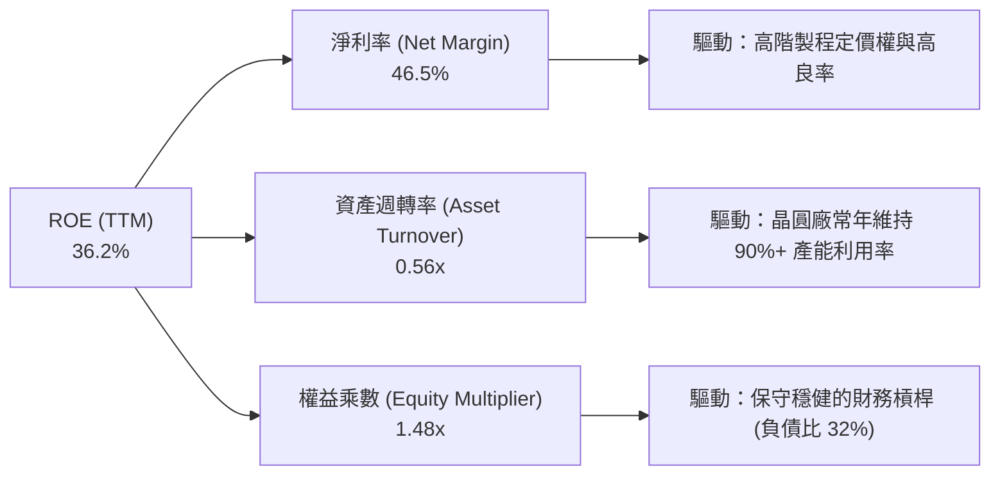

*分析*：台積電的超高 ROE 主要由**「極致的淨利率（46.5%）」**驅動，而非依賴高財務槓桿。這是一種極為健康的獲利模式，意味著即便行業面臨下行週期，公司也無爆雷風險。

### 6.4 獲利能力儀表板

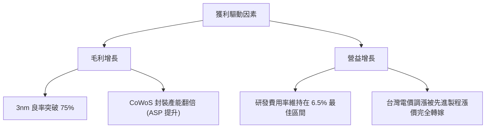

---

## 7. 估值深度分析

### 7.1 同業估值比較表格

我們選取全球最主要的晶圓代工及半導體製造競爭對手進行對比：

| 估值指標 | **台積電 (2330.TW)** | **三星電子 (005930.KS)** | **英特爾 (INTC.US)** | 評估與結論 |
|----------|----------|---------|---------|-----------|
| **Trailing P/E** | **34.15x** | 18.5x | 45.2x | 🟡 處於合理中樞，反映其領先地位 |
| **Forward P/E** | **20.36x** | 12.2x | 28.4x | 🟢 極具吸引力，預期盈餘爆發將快速稀釋估值 |
| **P/S Ratio** | **15.86x** | 1.8x | 2.1x | 🔴 較高，但反映了其高達 46.5% 的淨利率 |
| **P/B Ratio** | **11.05x** | 1.3x | 1.1x | 🟡 反映高 ROE (36.2%) 帶來的溢價 |
| **EV / EBITDA** | **22.00x** | 5.8x | 12.4x | 🟡 溢價合理，因 EBITDA 獲利品質極高 |
| **3年 EPS CAGR** | **+30.4%** | +12.5% | -8.5% | 🟢 成長動能冠絕群雄 |

### 7.2 歷史估值區間分析

台積電歷史 P/E (Trailing) 區間主要介於 15x 至 35x 之間。

```
歷史 P/E 區間下限 (15x)  ██████
歷史 P/E 均值 (22x)      ██████████
當前 P/E (34.15x)        ███████████████ (歷史偏高位置)
預期 P/E (20.36x)        █████████ (低於歷史均值，極具吸引力)
```

### 7.3 DCF 敏感性分析（目標價矩陣）

基於以下基準假設：
*   **基準 WACC** = 8.15%
*   **永續成長率 (g)** = 3.0%
*   **2026-2030 自由現金流年複合增長率** = 18.5%

#### 6格目標價與隱含報酬率矩陣

| 營收成長情境 | **WACC = 7.5%** | **WACC = 8.15%（基準）** | **WACC = 9.0%** |
|------|--------------|----------------------|--------------|
| 🟢 **樂觀 (AI需求超預期/N2提早貢獻)** | **$3,500.00** (+39.44%) | **$3,120.00** (+24.30%) | **$2,850.00** (+13.55%) |
| 🟡 **基準 (符合目前財測與產能規劃)** | **$2,950.00** (+17.53%) | **$2,647.58** (+5.48%) | **$2,410.00** (-3.98%) |
| 🔴 **悲觀 (地緣政治緊張/消費電子衰退)** | **$2,320.00** (-7.57%) | **$2,051.00** (-18.29%) | **$1,850.00** (-26.29%) |

### 7.4 估值綜合區間

```
╔══════════════════════════════════════════════════════════════════╗
║                    TSMC 估值區間與當前位置                       ║
╠══════════════════════════════════════════════════════════════════╣
║                                                                  ║
║  [ $1,850 ] ─── [ $2,051 ] ─────── [ $2,510 ] ─── [ $2,647 ] ─── [ $3,500 ]  ║
║    極度低估      悲觀目標價          **當前價**     基準目標價     樂觀目標價 ║
║                                                                  ║
║  當前股價 $2,510 處於基準目標價下方，隱含安全邊際約 5.48%。       ║
║  若考慮 Forward PE 僅 20.36x，中長線投資價值極為顯著。            ║
╚══════════════════════════════════════════════════════════════════╝
```

---

## 8. 成長催化劑

### 8.1 催化劑時間軸

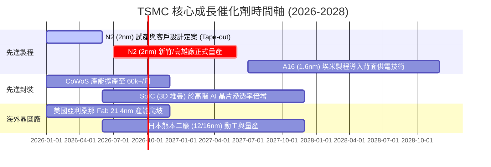

### 8.2 TAM 市場規模分析

隨著 AI 伺服器、自動駕駛（ADAS）及高效能運算（HPC）的爆發，全球先進製程晶圓代工的整體可定址市場（TAM）正迎來非線性增長。

```
╔══════════════════════════════════════════════════════════════════╗
║                TSMC 先進製程 TAM 與滲透率預估 (2026)             ║
╠══════════════════════════════════════════════════════════════════╣
║                                                                  ║
║  AI / HPC 晶片 TAM： $150B  ████████████████████  (TSMC 滲透率 95%)║
║  高階智慧型手機 TAM：$80B   ██████████░░░░░░░░░░  (TSMC 滲透率 85%)║
║  車用電子/ADAS TAM： $45B   ██████░░░░░░░░░░░░░░  (TSMC 滲透率 60%)║
║                                                                  ║
║  預估至 2028 年，僅 AI 晶片代工與封裝之 TAM 將以 35% CAGR 增長。 ║
╚══════════════════════════════════════════════════════════════════╝
```

### 8.3 成長驅動力結構圖

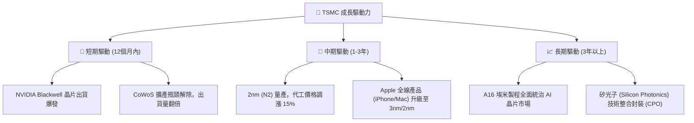

---

## 9. 風險矩陣

### 9.1 風險評分矩陣

```mermaid
quadrantChart
    title Risk Assessment Matrix (TSMC)
    x-axis Low Probability --> High Probability
    y-axis Low Impact --> High Impact
    quadrant-1 High Priority
    quadrant-2 Monitor Closely
    quadrant-3 Review Periodically
    quadrant-4 Watch

    Geopolitical Tension: [0.85, 0.90]
    CoWoS Capacity Bottleneck: [0.70, 0.65]
    Overseas Fab Cost Overrun: [0.65, 0.45]
    Customer Concentration Risk: [0.55, 0.50]
    Tech Stagnation (N2 Yield Delay): [0.20, 0.80]
```

### 9.2 風險清單詳細分析

| # | 風險項目 | 發生機率 | 財務衝擊 | 風險評分 | 緩解措施 |
|---|----------|----------|----------|----------|----------|
| 1 | 🔴 **地緣政治風險 (台海局勢)** | 中高 (65%) | 極高 (-50% 營收) | 🔴 **8.5 / 10** | 加速美國、日本、德國海外廠建設，分散地理集中風險；強化與各國政府的戰略綁定。 |
| 2 | 🟡 **先進封裝產能瓶頸 (CoWoS)** | 高 (75%) | 中 (-8% 營收) | 🟡 **6.5 / 10** | 與日月光 (ASE) 等封測大廠緊密合作，並自主研發 SoIC 技術以分流產能。 |
| 3 | 🟡 **海外建廠成本超支與文化衝突** | 高 (70%) | 低 (-4% 毛利率) | 🟡 **5.5 / 10** | 派遣台灣核心工程師團隊實施「師徒制」培訓，並爭取美、德政府的高額補貼。 |
| 4 | 🟡 **客戶過度集中風險** | 中 (50%) | 中 (-10% 營收) | 🟡 **5.0 / 10** | 拓展車用晶片、消費電子、ASIC 客製化晶片等多元化客群，降低單一客戶波動影響。 |

---

## 10. 投資建議

### 10.1 最終綜合評級雷達圖

```
╔══════════════════════════════════════════════════════════════╗
║                  TSMC 綜合評級雷達圖 (10分制)                ║
╠══════════════════════════════════════════════════════════════╣
║                                                              ║
║           基本面強度 (Fundamental)      9.8  ▓▓▓▓▓▓▓▓▓▓      ║
║           獲利能力 (Profitability)      9.7  ▓▓▓▓▓▓▓▓▓▓      ║
║           財務健康度 (Balance Sheet)    9.6  ▓▓▓▓▓▓▓▓▓▓      ║
║           成長前景 (Growth Outlook)     9.5  ▓▓▓▓▓▓▓▓▓▓      ║
║           估值吸引力 (Valuation)        8.5  ▓▓▓▓▓▓▓▓▓░      ║
║                                                              ║
║  ★ 綜合總分：9.42 / 10                                       ║
║  ★ 機構評級：🟢 強烈買入 (Strong Buy)                       ║
╚══════════════════════════════════════════════════════════════╝
```

### 10.2 目標價與隱含報酬率

| 情境 | 機率權重 | 目標價 (TWD) | 隱含報酬率 (較 $2,510) | 估值方法與依據 |
|------|----------|--------------|------------------------|----------------|
| 🟢 **樂觀情境** | 25% | **$3,500.00** | **+39.44%** | 2027年 EPS $140 × 25x Forward P/E（AI 需求極度瘋狂） |
| 🟡 **基準情境** | 60% | **$2,647.58** | **+5.48%** | 2026年 EPS $123.26 × 21.5x Forward P/E（穩定成長） |
| 🔴 **悲觀情境** | 15% | **$2,051.00** | **-18.29%** | 2026年 EPS $110 × 18.6x P/E（地緣政治折價/消費電子蕭條） |
| 📊 **加權期望值** | **100%** | **$2,771.10** | **+10.40%** | **具備良好的風險回報比 (Risk-Reward Ratio)** |

### 10.3 買入時機與觸發因素

```
╔══════════════════════════════════════════════════════════════════╗
║                  ✅ TSMC 買入觸發因素 Checklist                  ║
╠══════════════════════════════════════════════════════════════════╣
║                                                                  ║
║  立即買入觸發條件（多數符合即可進場）：                          ║
║  ✅ 當前 Forward PE 降至 20x 以下（目前為 20.36x，已接近臨界點）║
║  ✅ 季度營收 YoY 成長率維持在 30% 以上                           ║
║  ✅ 3nm/5nm 先進製程產能利用率維持在 9