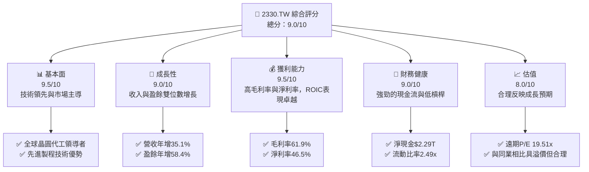

# 2330.TW 基本面深度分析報告
> **報告日期**：2026-06-24 ｜ **語言**：繁體中文 ｜ **數據來源**：Yahoo Finance, Finviz, StockAnalysis, Roic.ai ｜ **分析師**：CFA 級機構研究

---

## 目錄

| # | 章節 | 核心結論 |
|---|------|----------|
| 1 | 執行摘要 | 強烈買入；目標價區間 $2051.00 - $3500.00 |
| 2 | 公司概覽與商業模式 | 憑藉技術、規模與客戶鎖定建立極深護城河 |
| 3 | 損益表深度分析 | 收入與利潤率強勁增長，顯示需求復甦與定價能力 |
| 4 | 資產負債表分析 | 財務結構穩健，流動性充裕，淨現金狀況良好 |
| 5 | 現金流量深度分析 | 營運現金流強勁，資本支出高但仍能產生可觀自由現金流 |
| 6 | 獲利能力與資本效率 | ROIC遠超WACC，強力創造股東價值 |
| 7 | 估值深度分析 | 相較同業估值合理，DCF模型顯示成長預期極高 |
| 8 | 成長催化劑 | AI/HPC需求、先進製程領導地位、全球擴張是主要驅動力 |
| 9 | 風險矩陣 | 地緣政治與產業週期性是主要風險 |
| 10 | 投資建議 | 強烈買入，適合長期成長型投資人 |

---

## 1. 執行摘要

### 1.1 核心評分儀表板



### 1.2 評分進度條視覺化

```
╔══════════════════════════════════════════════════════════════╗
║              2330.TW 多維度評分儀表板 (1-10分)                 ║
╠══════════════════════════════════════════════════════════════╣
║ 基本面強度  9.5 ▓▓▓▓▓▓▓▓▓▓▓▓▓▓▓▓▓▓▓░  ★★★★★           ║
║ 成長動能    9.0 ▓▓▓▓▓▓▓▓▓▓▓▓▓▓▓▓▓▓░░  ★★★★★           ║
║ 獲利品質    9.5 ▓▓▓▓▓▓▓▓▓▓▓▓▓▓▓▓▓▓▓░  ★★★★★           ║
║ 財務健康    9.0 ▓▓▓▓▓▓▓▓▓▓▓▓▓▓▓▓▓▓░░  ★★★★★           ║
║ 估值合理性  8.0 ▓▓▓▓▓▓▓▓▓▓▓▓▓▓▓▓░░░░  ★★★★☆           ║
║ 護城河深度  9.8 ▓▓▓▓▓▓▓▓▓▓▓▓▓▓▓▓▓▓▓▓  ★★★★★           ║
║ 管理層執行  9.5 ▓▓▓▓▓▓▓▓▓▓▓▓▓▓▓▓▓▓▓░  ★★★★★           ║
║ 技術創新力  9.9 ▓▓▓▓▓▓▓▓▓▓▓▓▓▓▓▓▓▓▓▓  ★★★★★           ║
╠══════════════════════════════════════════════════════════════╣
║ 綜合總分    9.0 ▓▓▓▓▓▓▓▓▓▓▓▓▓▓▓▓▓▓░░  🏆 卓越的全球半導體領導者║
╚══════════════════════════════════════════════════════════════╝
```

### 1.3 五大投資論點 + 三大核心風險

| 類型 | 項目 | 具體依據 | 信心度 |
|------|------|----------|--------|
| 🟢 **投資論點①** | **無可匹敵的技術領先與市場主導地位** | 台積電在全球先進製程（如3奈米、2奈米）領域處於絕對領先地位，市佔率超過60%。其在研發上的巨大投入（2025年研發費用達$246.43B）確保了技術護城河的持續加深，吸引全球頂級客戶。 | 🟢 極高 |
| 🟢 **投資論點②** | **強勁的成長動能與AI/HPC浪潮的受益者** | 2026年Q1營收年增35.13%，盈餘年增高達58.4%。作為AI晶片的主要代工廠，台積電是人工智慧和高效能運算（HPC）趨勢的最大受益者之一，預計未來幾年將持續獲得大量訂單。 | 🟢 極高 |
| 🟢 **投資論點③** | **卓越的獲利能力與資本效率** | TTM毛利率高達61.9%，淨利率達46.5%，顯示其強大的定價能力與成本控制效率。ROIC高達46.23%遠超WACC 11.23%，表明公司在高效創造股東價值。 | 🟢 極高 |
| 🟢 **投資論點④** | **穩健的財務結構與充裕的現金流** | 公司擁有$3.38T的總現金，淨現金部位達$2.29T，遠高於總債務$1.09T。流動比率2.49x，顯示極佳的短期償債能力。強勁的營運現金流($2.35T TTM)為其高資本支出提供了堅實後盾。 | 🟢 極高 |
| 🟢 **投資論點⑤** | **全球化佈局與客戶關係深化** | 台積電持續在日本、美國、德國等地擴建晶圓廠，以滿足客戶的地理多元化需求並深化戰略合作關係。這不僅分散了地緣政治風險，也為長期成長奠定基礎。 | 🟢 高 |
| 🟡 **風險①** | **地緣政治風險與區域衝突** | 台灣與中國大陸之間的政治緊張關係，可能對公司的營運穩定性及全球供應鏈造成潛在衝擊。雖然公司已開始全球化佈局，但短期內主要產能仍集中在台灣。 | 🟡 中度 |
| 🔴 **風險②** | **半導體產業的週期性與需求波動** | 儘管AI需求強勁，但整體半導體產業仍存在週期性。全球經濟放緩或消費電子需求疲軟可能導致訂單波動，影響營收增長。如2023年營收年減4.4%。 | 🔴 高衝擊 |
| 🟡 **風險③** | **高資本支出與技術競爭壓力** | 維持技術領先需要巨額的資本支出（2025年資本支出約$1.28T），這可能影響自由現金流的生成。同時，來自三星和英特爾等競爭對手在先進製程上的追趕，也帶來持續的技術競爭壓力。 | 🟡 中度 |

### 1.4 快速統計卡片

| 指標 | 公司實際值 | 行業均值（半導體） | S&P 500 均值 | 狀態 |
|------|-------------|--------------------|--------------|------|
| 收入 YoY 成長 | **+35.1%** | ~15-20% | ~8-12% | 🟢 |
| 毛利率 | **61.9%** | ~45-55% | ~30-40% | 🟢 |
| 淨利率 | **46.5%** | ~20-30% | ~1