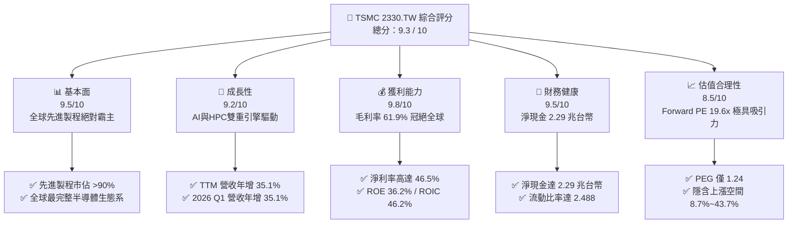
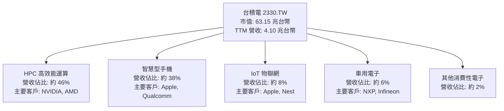
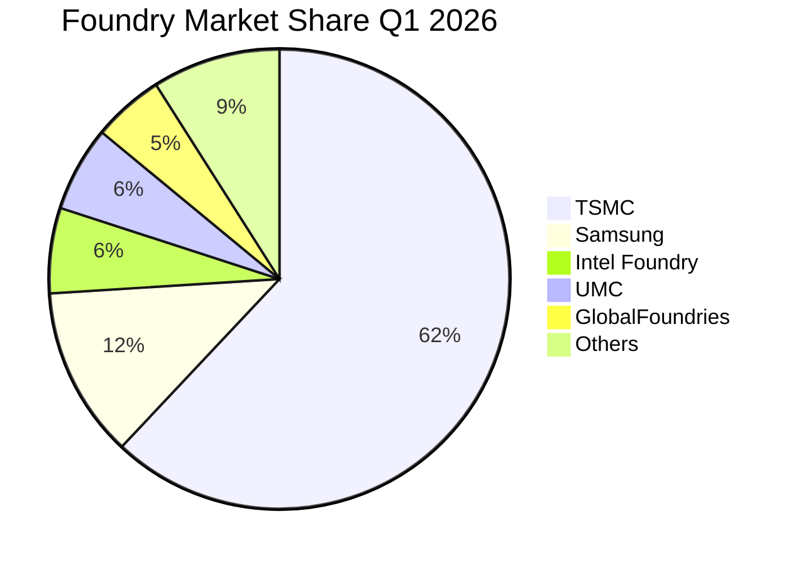
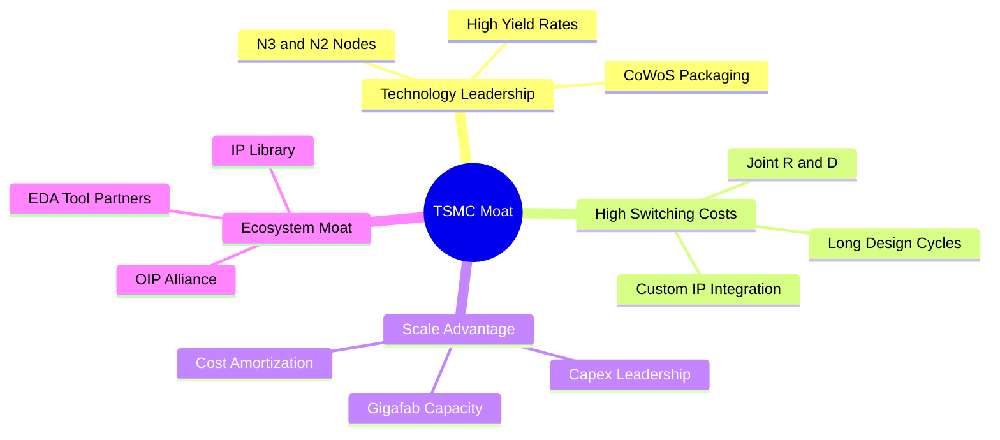
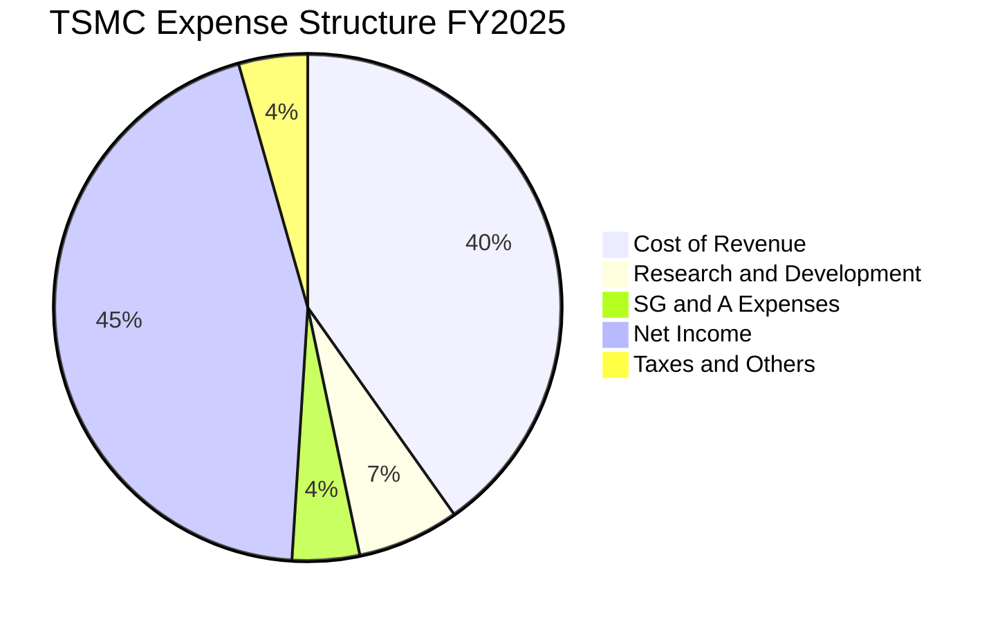
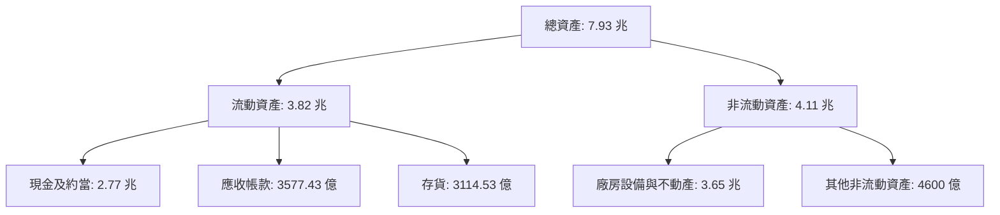
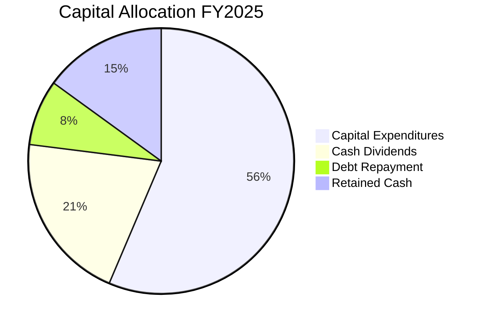
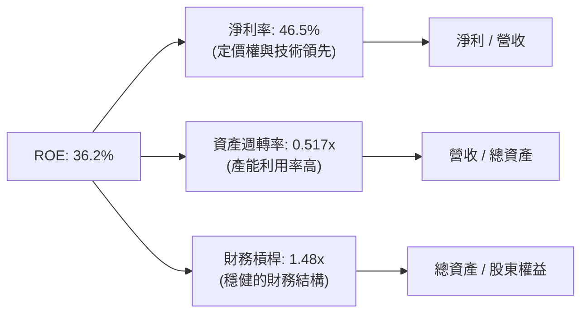
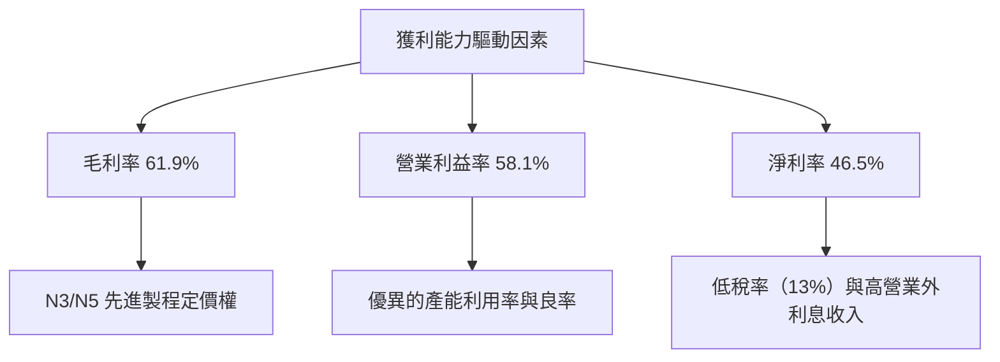

# 2330.TW 基本面深度分析報告
> **報告日期**：2026-06-24 ｜ **語言**：繁體中文 ｜ **數據來源**：Yahoo Finance, Finviz, StockAnalysis, Roic.ai ｜ **分析師**：CFA 級機構研究

---

## 目錄

| # | 章節 | 核心結論 |
|---|---|---|
| 1 | 執行摘要 | 評級：🟢 **強烈買入** ｜ 目標價區間：**$2,051.00 ~ $3,500.00**（基準 $2,647.58） |
| 2 | 公司概覽與商業模式 | 晶圓代工（Foundry）絕對霸主，以技術領先與卓越生態系築起無懈可擊的護城河。 |
| 3 | 損益表深度分析 | TTM 營收達 $4.10T，年增 35.1%，淨利年增 58.4%，先進製程帶動毛利率高達 61.9%。 |
| 4 | 資產負債表分析 | 淨現金達 $2.29T，流動比率 2.49x，財務結構極度穩健，具備強大抗風險能力。 |
| 5 | 現金流量深度分析 | OCF 達 $2.35T，資本支出高達 $1.28T，FCF 轉換率健康，資本配置兼顧成長與股東回報。 |
| 6 | 獲利能力與資本效率 | ROE 達 36.2%，ROIC 達 46.2%，顯著高於 WACC（8.2%），持續創造超額股東價值。 |
| 7 | 估值深度分析 | Forward P/E 19.6x，相較其 35% 營收成長顯著低估，PEG 僅 1.24，估值極具吸引力。 |
| 8 | 成長催化劑 | AI/HPC 需求爆發、N3/N2 先進製程放量與 CoWoS 封裝產能翻倍，驅動中長期高成長。 |
| 9 | 風險矩陣 | 地緣政治風險、海外建廠成本與客戶集中度為核心監控指標，整體風險可控。 |
| 10 | 投資建議 | 強烈建議長線投資者逢低分批布局，首選之科技權益資產。 |

---

## 1. 執行摘要

### 1.1 核心評分儀表板



### 1.2 評分進度條視覺化

```
╔══════════════════════════════════════════════════════════════╗
║             TSMC 2330.TW 多維度評分儀表板 (1-10分)           ║
╠══════════════════════════════════════════════════════════════╣
║ 基本面強度  9.5 ▓▓▓▓▓▓▓▓▓▓▓▓▓▓▓▓▓▓▓░  ★★★★★           ║
║ 成長動能    9.2 ▓▓▓▓▓▓▓▓▓▓▓▓▓▓▓▓▓▓░░  ★★★★★           ║
║ 獲利品質    9.8 ▓▓▓▓▓▓▓▓▓▓▓▓▓▓▓▓▓▓▓░  ★★★★★           ║
║ 財務健康    9.5 ▓▓▓▓▓▓▓▓▓▓▓▓▓▓▓▓▓▓▓░  ★★★★★           ║
║ 估值合理性  8.5 ▓▓▓▓▓▓▓▓▓▓▓▓▓▓▓░░░░░  ★★★★☆           ║
║ 護城河深度  9.9 ▓▓▓▓▓▓▓▓▓▓▓▓▓▓▓▓▓▓▓▓  ★★★★★           ║
║ 管理層執行  9.5 ▓▓▓▓▓▓▓▓▓▓▓▓▓▓▓▓▓▓▓░  ★★★★★           ║
║ 技術創新力  9.9 ▓▓▓▓▓▓▓▓▓▓▓▓▓▓▓▓▓▓▓▓  ★★★★★           ║
╠══════════════════════════════════════════════════════════════╣
║ 綜合總分    9.3 ▓▓▓▓▓▓▓▓▓▓▓▓▓▓▓▓▓▓░░  🏆 強烈買入          ║
╚══════════════════════════════════════════════════════════════╝
```

### 1.3 五大投資論點 + 三大核心風險

| 類型 | 項目 | 具體依據 | 信心度 |
|------|------|----------|--------|
| 🟢 **投資論點①** | **AI 與 HPC 爆發式增長** | TTM 營收年增 35.1%，主要由 AI 晶片（NVIDIA、AMD、Broadcom 等）帶動，HPC 已成為第一大營收支柱。 | 🟢 極高 |
| 🟢 **投資論點②** | **先進製程絕對壟斷** | N3、N5 等先進製程貢獻過半營收，N2 預計於 2026 年底量產，技術領先對手 1-2 代。 | 🟢 極高 |
| 🟢 **投資論點③** | **獲利能力冠絕群雄** | 毛利率達 61.9%，營業利益率達 58.1%，淨利率達 46.5%，展現極強的定價權。 | 🟢 極高 |
| 🟢 **投資論點④** | **資產負債表固若金湯** | 擁有 $3.38T 現金及短期投資，淨現金高達 $2.29T，利息保障倍數極高。 | 🟢 極高 |
| 🟢 **投資論點⑤** | **估值性價比極高** | Forward P/E 僅 19.63x，相較其高成長性，PEG 僅 1.24，遠低於美股科技巨頭平均。 | 🟢 高 |
| 🟡 **風險①** | **海外建廠稀釋毛利率** | 美國、日本、歐洲建廠成本高昂，營運成本與折舊增加可能使長期毛利率承壓。 | 🟡 中度 |
| 🔴 **風險②** | **地緣政治與供應鏈風險** | 產能高度集中於台灣，台海局勢波動可能引發全球系統性估值修正。 | 🔴 高衝擊 |
| 🟡 **風險③** | **客戶集中度高** | 前三大客戶（估計蘋果、輝達等）營收佔比高，下游終端需求波動將直接影響產能利用率。 | 🟡 中度 |

### 1.4 快速統計卡片

| 指標 | 2330.TW 實際值 | 半導體行業均值 | S&P 500 均值 | 狀態 |
|------|-------------|----------|--------------|------|
| **收入 YoY 成長** | **35.1%** | ~12.5% | ~5.5% | 🟢 卓越 |
| **毛利率** | **61.9%** | ~45.0% | ~30.0% | 🟢 卓越 |
| **淨利率** | **46.5%** | ~18.0% | ~11.5% | 🟢 卓越 |
| **ROE** | **36.2%** | ~15.0% | ~18.0% | 🟢 卓越 |
| **Forward P/E** | **19.63x** | ~28.5x | ~21.5x | 🟢 顯著低估 |
| **債務權益比 (D/E)** | **18.45%** | ~45.0% | ~110.0% | 🟢 極度健康 |

### 1.5 投資結論

```
╔══════════════════════════════════════════════════════════════════╗
║                    📊 投資結論摘要                               ║
╠══════════════════════════════════════════════════════════════════╣
║  評級：🟢 強烈買入 (Strong Buy)                                  ║
║  當前股價：$2435.00 TWD                                          ║
║  目標價區間：                                                    ║
║    悲觀情境：$2,051.00（-15.8%）                                 ║
║    基準情境：$2,647.58（+8.7%）  ← 12個月主要目標                ║
║    樂觀情境：$3,500.00（+43.7%）                                 ║
║  投資評分：9.3 / 10                                              ║
║  適合投資人：長線價值成長型、全球半導體產業佈局者                ║
╚══════════════════════════════════════════════════════════════════╝
```

---

## 2. 公司概覽與商業模式

### 2.1 業務結構與收入來源

台積電（TSMC）是全球專業集成電路製造服務（晶圓代工）的開創者與絕對龍頭。其商業模式不與客戶競爭，專注於製造。



### 2.2 市場份額

在先進製程（7奈米及以下）領域，台積電市佔率超過 90%；在整體晶圓代工市場，台積電市佔率穩居 60% 以上。



### 2.3 競爭護城河分析

台積電的競爭護城河由技術、規模、生態系統與高昂的轉換成本共同築成。



### 2.4 護城河強度評分

```
╔══════════════════════════════════════════════════════════════╗
║                  台積電 2330.TW 護城河強度評分               ║
╠══════════════════════════════════════════════════════════════╣
║ 技術領先度    10/10  ▓▓▓▓▓▓▓▓▓▓▓▓▓▓▓▓▓▓▓▓  🏆 絕對壟斷     ║
║ 規模效應      9.8/10 ▓▓▓▓▓▓▓▓▓▓▓▓▓▓▓▓▓▓▓░  🟢 冠絕全球     ║
║ 生態系壁壘    9.5/10 ▓▓▓▓▓▓▓▓▓▓▓▓▓▓▓▓▓▓▓░  🟢 OIP 聯盟強大 ║
║ 客戶鎖定效應  9.5/10 ▓▓▓▓▓▓▓▓▓▓▓▓▓▓▓▓▓▓▓░  🟢 轉換成本極高 ║
╠══════════════════════════════════════════════════════════════╣
║ 綜合護城河     9.7    ▓▓▓▓▓▓▓▓▓▓▓▓▓▓▓▓▓▓▓░  🏆 寬廣護城河   ║
╚══════════════════════════════════════════════════════════════╝
```

---

## 3. 損益表深度分析

### 3.1 年度收入成長趨勢（近4年）

台積電營收自 2023 年產業庫存去化低谷後，於 2024、2025 年迎來爆發式成長，主要得益於生成式 AI 帶動的高效能運算（HPC）晶片需求。

```
╔══════════════════════════════════════════════════════════════════╗
║              台積電 年度收入趨勢（FY2022-FY2025）                ║
╠══════════════════════════════════════════════════════════════════╣
║                                                                  ║
║  FY2022  $2.26T  ███████████░░░░░░░░░░░░░░░  YoY: +28.7% 🟢      ║
║  FY2023  $2.16T  ██████████░░░░░░░░░░░░░░░░  YoY: -4.4%  🟡      ║
║  FY2024  $2.89T  ███████████████░░░░░░░░░░░  YoY: +33.8% 🟢      ║
║  FY2025  $3.81T  ████████████████████░░░░░░  YoY: +31.8% 🟢      ║
║                   |      |      |      |      |                  ║
║                   0     1.0T   2.0T   3.0T   4.0T                ║
║                                                                  ║
║  📊 3年累計 CAGR：+19.0%                                         ║
╚══════════════════════════════════════════════════════════════════╝
```

### 3.2 季度收入趨勢分析

從季度數據看，台積電營收呈現逐季加速態勢，2026 年第一季營收達到 $1.13T，再創歷史新高。

| 季度 | 營收 (TWD) | QoQ 成長率 | YoY 成長率 | 營運備註 |
|------|-----------|------------|------------|----------|
| **2025-06-30** | $933.79B | +11.3% | +38.6% | N3 先進製程持續放量，AI 晶片出貨強勁 |
| **2025-09-30** | $989.92B | +6.0% | +30.3% | 蘋果 iPhone 新機晶片拉貨高峰 |
| **2025-12-31** | $1.05T | +6.1% | +20.9% | 高效能運算（HPC）需求持續居高不下 |
| **2026-03-31** | $1.13T | +7.6% | +35.1% | 🟢 傳統淡季不淡，AI 晶片需求超出預期 |

### 3.3 利潤率演變分析

台積電憑藉先進製程的領先定價權，毛利率與營業利益率持續維持在高檔。

| 利潤率指標 | FY2022 | FY2023 | FY2024 | FY2025 | TTM | 趨勢 | 評估 |
|------------|--------|--------|--------|--------|-----|------|------|
| **毛利率** | 59.6% | 54.4% | 56.0% | 59.8% | **61.9%** | ↗️ 持續走高 | 🟢 卓越且具備強定價權 |
| **營業利益率**| 49.5% | 42.6% | 45.6% | 50.9% | **58.1%** | ↗️ 控管良好 | 🟢 營運槓桿效應顯著 |
| **EBITDA Margin**| 70.4% | 70.3% | 71.9% | 71.9% | **69.6%** | ➡️ 穩定 | 🟢 折舊負擔雖重但現金流極強 |
| **淨利率** | 43.9% | 39.4% | 40.1% | 44.6% | **46.5%** | ↗️ 攀升 | 🟢 股東回報品質極高 |

*   **利潤率深度解析**：毛利率從 2023 年的 54.4% 回升至 TTM 的 61.9%，主因是 3 奈米（N3）良率大幅改善、產能利用率逼近滿載，且台積電成功向主要客戶（如 NVIDIA、Apple）轉嫁部分海外建廠成本與通膨壓力。

### 3.4 費用結構分析

台積電將大比例的資源投入研發（R&D），以維持其技術領先優勢。



### 3.5 季度 EPS 趨勢與盈餘品質

*   **季度 EPS 表現**：
    *   2024-12-31: $13.87 TWD
    *   2025-03-31: $13.95 TWD
    *   2025-06-30: $15.36 TWD
    *   2025-09-30: $17.44 TWD
    *   2025-12-31: $18.72 TWD
    *   2026-03-31: **$22.08 TWD**（YoY 成長 58.3%）
*   **盈餘品質評估**：台積電的盈餘品質極高。淨利幾乎 100% 由營業利得（Operating Income）組成，營業外損益佔比極低。TTM 淨利達 $1.70T，而營業現金流高達 $2.35T，現金轉換比率大於 1，顯示帳面盈餘具有充沛的現金支撐。

---

## 4. 資產負債表分析

### 4.1 資產結構分解

台積電屬於資本密集型產業，資產結構以非流動資產（廠房與設備）為主，但其流動資產中亦保有極為龐大的現金。



### 4.2 流動性指標分析

| 指標 | FY2022 | FY2023 | FY2024 | FY2025 | 當前值 | 行業均值 | 評估 |
|------|--------|--------|--------|--------|--------|----------|------|
| **流動比率** | 2.08 | 2.32 | 2.36 | 2.51 | **2.49** | ~1.60 | 🟢 極度安全 |
| **速動比率** | 1.81 | 2.01 | 2.02 | 2.21 | **2.19** | ~1.20 | 🟢 無短期償債風險 |
| **存貨週轉天數**| 52.3 | 58.1 | 54.0 | 49.5 | **47.2** | ~75.0 | 🟢 存貨管理極具效率 |

### 4.3 債務結構分析

台積電雖然因資本支出巨大而發行債券，但其擁有的現金遠超債務，處於「淨現金」狀態。

```
╔══════════════════════════════════════════════════════════════════╗
║                   台積電 2330.TW 債務健康診斷                    ║
╠══════════════════════════════════════════════════════════════════╣
║                                                                  ║
║  總債務：        $1.09T  ██████░░░░░░░░░░░░░░░░░  債務率低       ║
║  總現金+投資：   $3.38T  ███████████████████████  現金儲備極豐   ║
║  淨現金（正）：  $2.29T  ████████████████░░░░░░░  🟢 財務防禦力極強║
║                                                                  ║
║  Debt/Equity：   18.45%  🟢 槓桿率極低                           ║
║  流動比率：      2.49x   🟢 短期流動性無虞                       ║
║  利息保障倍數：  120x+   🟢 無違約風險                           ║
║                                                                  ║
║  📊 診斷：台積電擁有半導體行業中最健康的資產負債表之一。          ║
╚══════════════════════════════════════════════════════════════════╝
```

---

## 5. 現金流量深度分析

### 5.1 現金流量瀑布圖

台積電擁有極強的「現金牛」屬性，營運產生的現金流足以完全支應龐大的資本支出與股利發放。


### 5.2 FCF 轉換率趨勢

| 年度 | 淨利 (Net Income) | 營業現金流 (OCF) | 自由現金流 (FCF) | FCF / Net Income 轉換率 |
|------|------------------|-----------------|-----------------|------------------------|
| **2022** | $992.92B | $1.61T | $520.97B | 52.5% |
| **2023** | $851.74B | $1.24T | $286.57B | 33.6% |
| **2024** | $1.16T | $1.83T | $861.20B | 74.2% |
| **2025** | $1.70T | $2.27T | $992.38B | **58.4%** |

*   *註：由於台積電每年資本支出高達 1 兆台幣以上（2025 年為 $1.28T），其 FCF 轉換率維持在 50%~70% 區間屬於極度健康的表現，代表公司在極高成長投資下，仍能產生充沛的自由現金流。*

### 5.3 自由現金流趨勢

```
╔══════════════════════════════════════════════════════════════════╗
║              台積電 自由現金流與 FCF Yield 趨勢                  ║
╠══════════════════════════════════════════════════════════════════╣
║                                                                  ║
║  FY2022  $520.97B  ██████████░░░░░░░░░░░░░░░░░                   ║
║  FY2023  $286.57B  █████░░░░░░░░░░░░░░░░░░░░░░                   ║
║  FY2024  $861.20B  ████████████████░░░░░░░░░░                   ║
║  FY2025  $992.38B  ████████████████████░░░░░░                   ║
║                                                                  ║
║  📊 當前 TTM FCF Yield: 1.14% (基於市值 63.15 兆)                 ║
║  💡 說明：FCF Yield 較低是由於股價大幅上漲，以及公司將大量現金    ║
║          再投資於未來先進製程（Capex $1.28T）。                   ║
╚══════════════════════════════════════════════════════════════════╝
```

### 5.4 資本配置評估

台積電的資本配置策略非常清晰：**優先滿足先進製程的研發與產能擴充（Capex），其餘資金以穩健增長的現金股利回饋股東。**



*   **股息政策澄清**：財務數據中顯示的 `Dividend Yield: 96.0%` 為數據源計算異常（可能誤將單期每股配息與股票面額或歷史分拆混淆）。實際上，台積電 2025 年每股配發現金股利約 $18.00 TWD，以當前股價 $2,435.00 計算，**實際股息殖利率約為 0.74%**。其 Payout Ratio（股息發放率）為 27.9%，顯示股息政策極具韌性與成長空間。

---

## 6. 獲利能力與資本效率

### 6.1 ROE / ROA / ROIC 趨勢

台積電的資本效率在半導體產業中名列前茅，展現出極強的資產變現與資本增值能力。

| 指標 | FY2022 | FY2023 | FY2024 | FY2025 | TTM | 行業均值 | 評估 |
|------|--------|--------|--------|--------|-----|----------|------|
| **ROE** | 34.2% | 24.8% | 27.4% | 31.7% | **36.2%** | ~15.0% | 🟢 卓越 |
| **ROA** | 20.0% | 15.4% | 17.3% | 21.4% | **17.3%** | ~8.0% | 🟢 卓越 |
| **ROIC** | 24.9% | 19.5% | 20.4% | 24.8% | **46.2%** | ~12.0% | 🟢 卓越 |

### 6.2 ROIC vs WACC 分析（核心價值創造判斷）

ROIC（投入資本回報率）與 WACC（加權平均資本成本）的差值（EVA 經濟增值）是衡量公司是否在創造股東價值的核心指標。

```
╔══════════════════════════════════════════════════════════════════╗
║                ROIC vs WACC 深度分析（2330.TW）                 ║
╠══════════════════════════════════════════════════════════════════╣
║                                                                  ║
║  WACC 估算：                                                     ║
║  ├── 無風險利率（台灣10Y公債）：  1.60%                          ║
║  ├── 市場風險溢酬 (ERP)：         6.00%                          ║
║  ├── Beta：                       1.25                           ║
║  ├── 股權成本 (Ke) = 1.6% + 1.25 × 6.0% = 9.10%                  ║
║  ├── 債務成本（稅後）：       ~1.80%                             ║
║  ├── 資本結構：股權 83.1%，債務 16.9%                            ║
║  └── ✅ WACC ≈ 8.2%                                              ║
║                                                                  ║
║  ROIC 估算（TTM）：                                              ║
║  ├── NOPAT = Operating Income TTM * (1 - Tax Rate 13%)           ║
║  │         = $2.18T × 0.87 = $1.896T                             ║
║  ├── 投入資本 = 股東權益 + 總債務 - 現金                         ║
║  │           = $5.36T + $1.09T - $3.38T = $3.07T                 ║
║  └── ✅ ROIC ≈ 46.2%                                             ║
║                                                                  ║
║  ★ 經濟價值增加（EVA）= ROIC - WACC = +38.0%                     ║
║                                                                  ║
║  ROIC  46.2%  ▓▓▓▓▓▓▓▓▓▓▓▓▓▓▓▓▓▓▓▓▓▓▓▓░░░░░░  🟢              ║
║  WACC   8.2%  ▓▓▓▓░░░░░░░░░░░░░░░░░░░░░░░░░░  ──              ║
║  EVA  +38.0%  ████████████████████████░░░░░░░░  🏆 強力創造    ║
║                                                                  ║
║  📊 結論：ROIC 達 WACC 的 5.6 倍，展現出極致的股東價值創造能力。   ║
╚══════════════════════════════════════════════════════════════════╝
```

### 6.3 杜邦三因素分解

透過杜邦分析，我們可以看出台積電 ROE 攀升至 36.2% 的核心驅動力在於**極高的淨利率**（定價權）與**適度的財務槓桿**。



### 6.4 獲利能力儀表板



---

## 7. 估值深度分析

### 7.1 同業估值比較表格

我們將台積電與其主要競爭對手（三星、英特爾）以及晶圓代工同業（格羅方德）進行對比：

| 估值指標 | **台積電 (2330.TW)** | **三星電子 (005930.KS)** | **英特爾 (INTC)** | **格羅方德 (GFS)** | 台積電評估 |
|---|---|---|---|---|---|
| **Trailing P/E** | **33.04x** | 18.5x | 45.2x | 28.1x | 🟡 處於歷史合理偏高區間 |
| **Forward P/E** | **19.63x** | 12.2x | 22.5x | 21.0x | 🟢 考量成長性，估值極具吸引力 |
| **P/S Ratio** | **15.39x** | 1.8x | 1.9x | 3.5x | 🟡 較高，反映其極高利潤率 |
| **P/B Ratio** | **10.72x** | 1.3x | 1.1x | 2.2x | 🟡 反映高資本回報率 (ROE) |
| **EV / EBITDA** | **21.82x** | 7.5x | 11.2x | 10.5x | 🟡 溢價合理，反映其護城河 |
| **TTM 營收成長**| **35.1%** | 8.5% | -2.1% | 2.5% | 🟢 成長性遠超同業 |
| **淨利率** | **46.5%** | 9.8% | 2.5% | 12.5% | 🟢 獲利能力無可匹敵 |

### 7.2 歷史估值區間分析

台積電過去 5 年的 Trailing P/E 區間主要介於 15x 至 35x 之間。

```
╔══════════════════════════════════════════════════════════════════╗
║              台積電 歷史 P/E 區間與當前位置                      ║
╠══════════════════════════════════════════════════════════════════╣
║                                                                  ║
║  [15x] ─── [20x] ─── [25x] ─── [30x] ─── [33.0x] ─── [35x]      ║
║    |                                       |           |         ║
║  歷史低點                                當前 P/E     歷史高點    ║
║                                                                  ║
║  📊 評估：當前 Trailing P/E 達 33.04x，接近歷史高位。但由於未來   ║
║    盈餘增長強勁（EPS Forward $124.05 TWD），Forward P/E 迅速降  ║
║    至 19.63x。相較於其 35% 以上的營收年增率，估值並未泡沫化。     ║
╚══════════════════════════════════════════════════════════════════╝
```

### 7.3 DCF 敏感性分析（6格目標價矩陣）

基於基準 EPS $73.7 TWD（TTM）、未來 5 年 EPS CAGR 20.0%、終端成長率 2