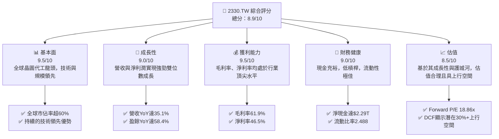
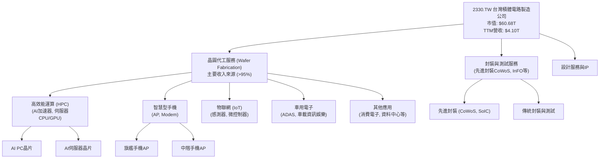
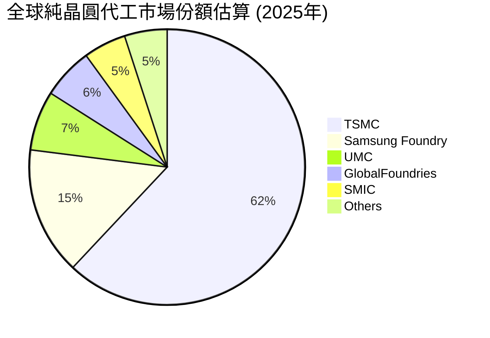
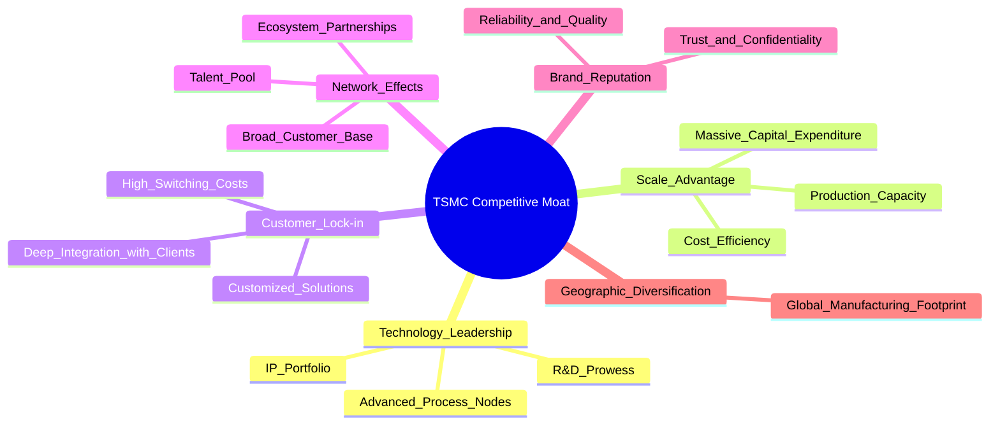
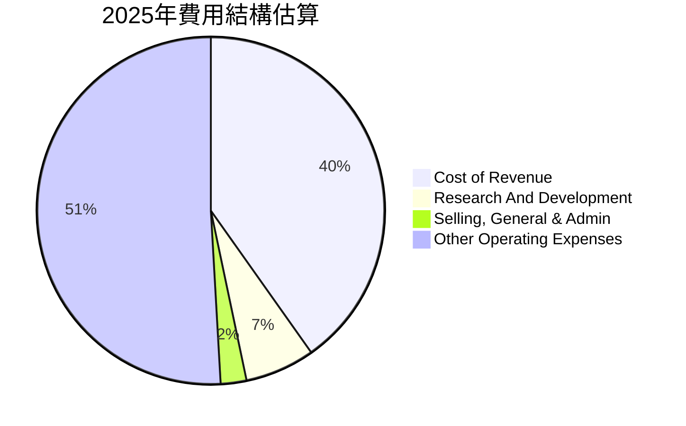
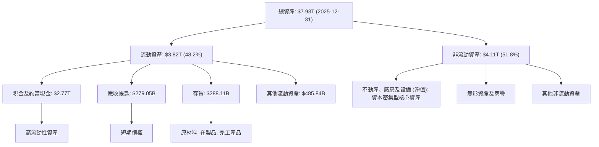
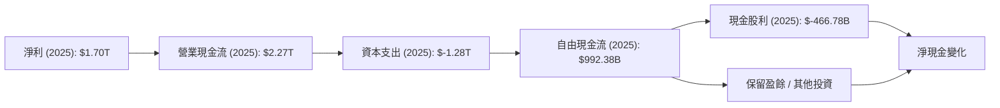
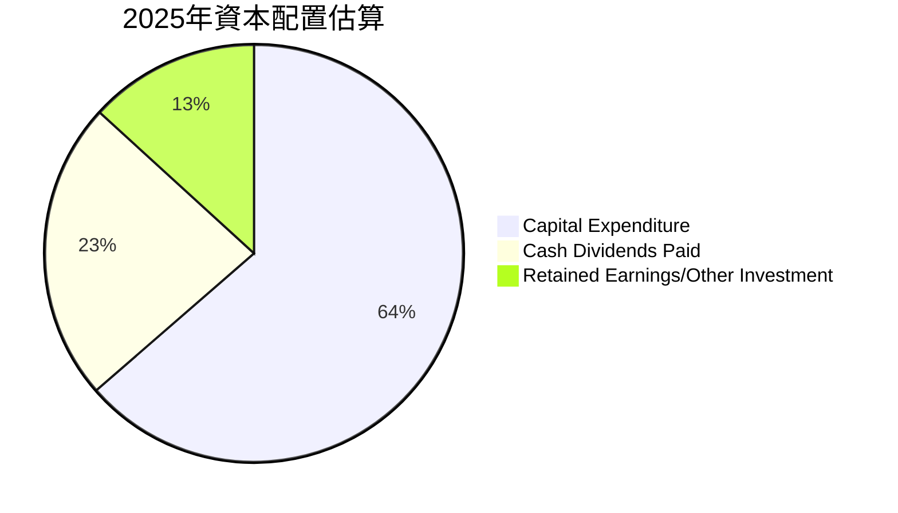

# 2330.TW 基本面深度分析報告
> **報告日期**：2026-06-26 ｜ **語言**：繁體中文 ｜ **數據來源**：Yahoo Finance, Finviz, StockAnalysis, Roic.ai ｜ **分析師**：CFA 級機構研究

## 目錄

| # | 章節 | 核心結論 |
|---|------------------------|--------------------------------------------------|
| 1 | 執行摘要 | 評級：🟢 強烈買入，目標價區間 $2600 - $3200 |
| 2 | 公司概覽與商業模式 | 全球晶圓代工龍頭，技術與規模護城河極深 |
| 3 | 損益表深度分析 | 營收與淨利潤強勁成長，利潤率維持高檔 |
| 4 | 資產負債表分析 | 財務結構穩健，現金充裕，流動性極佳 |
| 5 | 現金流量深度分析 | 自由現金流強勁，資本配置效率高 |
| 6 | 獲利能力與資本效率 | ROIC顯著高於WACC，強力創造股東價值 |
| 7 | 估值深度分析 | 相較同業估值合理，DCF顯示上行空間 |
| 8 | 成長催化劑 | AI、HPC需求強勁，先進製程持續領先 |
| 9 | 風險矩陣 | 地緣政治、技術競爭與資本支出為主要風險 |
| 10| 投資建議 | 強烈買入，適合追求長期成長與技術領先的投資者 |

---

## 1. 執行摘要

### 1.1 核心評分儀表板



### 1.2 評分進度條視覺化

```
╔══════════════════════════════════════════════════════════════╗
║              2330.TW 多維度評分儀表板 (1-10分)               ║
╠══════════════════════════════════════════════════════════════╣
║ 基本面強度  9.5 ▓▓▓▓▓▓▓▓▓▓▓▓▓▓▓▓▓▓▓░  ★★★★★           ║
║ 成長動能    9.0 ▓▓▓▓▓▓▓▓▓▓▓▓▓▓▓▓▓▓░░  ★★★★★           ║
║ 獲利品質    9.5 ▓▓▓▓▓▓▓▓▓▓▓▓▓▓▓▓▓▓▓░  ★★★★★           ║
║ 財務健康    9.0 ▓▓▓▓▓▓▓▓▓▓▓▓▓▓▓▓▓▓░░  ★★★★★           ║
║ 估值合理性  8.5 ▓▓▓▓▓▓▓▓▓▓▓▓▓▓▓▓▓░░░  ★★★★☆           ║
║ 護城河深度  9.8 ▓▓▓▓▓▓▓▓▓▓▓▓▓▓▓▓▓▓▓▓  ★★★★★           ║
║ 管理層執行  9.5 ▓▓▓▓▓▓▓▓▓▓▓▓▓▓▓▓▓▓▓░  ★★★★★           ║
║ 技術創新力  9.8 ▓▓▓▓▓▓▓▓▓▓▓▓▓▓▓▓▓▓▓▓  ★★★★★           ║
╠══════════════════════════════════════════════════════════════╣
║ 綜合總分    8.9 ▓▓▓▓▓▓▓▓▓▓▓▓▓▓▓▓▓░░░  🏆 卓越的全球半導體領導者  ║
╚══════════════════════════════════════════════════════════════╝
```

### 1.3 五大投資論點 + 三大核心風險

| 類型 | 項目 | 具體依據 | 信心度 |
|------|--------------------------|----------------------------------------------------------|--------|
| 🟢 **投資論點①** | **全球晶圓代工龍頭地位不可撼動** | 擁有全球最先進的製程技術（3nm、2nm領先），市佔率超過60%，為各主要IC設計公司首選代工夥伴。FY2025年營收達$3.81T，證明其規模與實力。 | 🟢 極高 |
| 🟢 **AI與HPC需求驅動強勁成長** | AI晶片需求爆炸式增長，台積電作為主要AI晶片代工廠，直接受益。FY2025年營收YoY成長31.8%，TTM營收YoY成長35.1%，盈餘YoY成長58.4%，顯示AI驅動效應顯著。 | 🟢 極高 |
| 🟢 **卓越的獲利能力與資本效率** | TTM毛利率高達61.9%，淨利率46.5%，遠超行業平均。ROE為36.2%，ROIC顯著高於WACC，持續為股東創造巨大價值。 | 🟢 極高 |
| 🟢 **穩健的財務狀況與充足現金流** | 淨現金達$2.29T，流動比率2.488，財務槓桿低。FY2025自由現金流達$992.38B，為資本支出和股息提供堅實基礎。 | 🟢 極高 |
| 🟢 **長期技術路線圖清晰** | 持續投入巨額研發（FY2025研發費用$246.43B），確保在2nm、1.4nm等下一代技術上的領先地位，為未來十年成長奠定基礎。 | 🟢 極高 |
| 🟡 **風險①** | **地緣政治風險與供應鏈不確定性** | 台灣地緣政治緊張局勢可能影響生產與全球供應鏈穩定。雖然積極進行全球化佈局（如美國、日本、德國設廠），但仍需時間緩解風險。 | 🟡 中度 |
| 🔴 **風險②** | **半導體產業週期性與資本支出壓力** | 半導體產業具週期性，市場需求波動可能影響營收。同時，維持技術領先需要龐大資本支出（FY2025資本支出$-1.28T），可能短期影響自由現金流。 | 🟡 中度 |
| 🟡 **風險③** | **技術競爭與摩爾定律挑戰** | 三星、Intel等競爭對手積極追趕先進製程。摩爾定律物理極限的逼近，可能增加研發難度與成本，影響未來技術迭代速度。 | 🟡 中度 |

### 1.4 快速統計卡片

| 指標 | 公司實際值 | 行業均值 (估計) | S&P 500 均值 (估計) | 狀態 |
|-------------------|-------------|------------------|--------------------|------|
| 收入 YoY 成長 (TTM)| **35.1%**   | ~15%             | ~8%                | 🟢   |
| 毛利率 (TTM)      | **61.9%**   | ~45%             | ~35%               | 🟢   |
| 淨利率 (TTM)      | **46.5%**   | ~20%             | ~10%               | 🟢   |
| ROE (TTM)         | **36.2%**   | ~18%             | ~15%               | 🟢   |
| Forward P/E       | **18.86x**  | ~25x             | ~20x               | 🟢   |
| EV / EBITDA (TTM) | **20.46x**  | ~18x             | ~15x               | 🟡   |
| Debt/Equity (TTM) | **18.45%**  | ~50%             | ~80%               | 🟢   |
| FCF Yield (TTM)   | **1.19%**   | ~3%              | ~4%                | 🔴   |

*註：行業均值與 S&P 500 均值為分析師根據半導體行業及整體市場情況的估計值。*

### 1.5 投資結論

```
╔══════════════════════════════════════════════════════════════════╗
║                    📊 投資結論摘要                               ║
╠══════════════════════════════════════════════════════════════════╣
║  評級：🟢 強烈買入                                               ║
║  當前股價：$2340.00                                              ║
║  目標價區間：                                                    ║
║    悲觀情境：$2600.00（+11.11%）                                 ║
║    基準情境：$2900.00（+23.93%）  ← 12個月主要目標               ║
║    樂觀情境：$3200.00（+36.75%）                                 ║
║  投資評分：8.9/10                                                ║
║  適合投資人：成長型、長線持有者，尋求產業龍頭地位與創新優勢的投資者║
╚══════════════════════════════════════════════════════════════════╝
```

---

## 2. 公司概覽與商業模式

### 2.1 業務結構與收入來源

台積電（2330.TW）是全球最大的純晶圓代工廠，提供從設計服務、光罩製作、晶圓製造、封裝測試到IP服務的全方位解決方案。其商業模式是為全球數百家無晶圓廠半導體公司（Fabless）和整合元件製造商（IDM）提供晶圓代工服務，不設計、製造或銷售自有品牌產品，避免與客戶競爭。這使其能與客戶建立長期、穩固的合作關係。

其收入主要來自於不同技術節點的晶圓銷售，並依據終端應用區分。由於未提供具體細分數據，我們基於產業普遍認知進行結構推演：


**收入來源結構估算 (基於產業趨勢)：**
- 高效能運算 (HPC)：約佔總營收的 40-45% (AI需求強勁拉動)
- 智慧型手機：約佔總營收的 30-35%
- 物聯網：約佔總營收的 8-10%
- 車用電子：約佔總營收的 5-7%
- 其他：約佔總營收的 5-10%

### 2.2 市場份額

台積電在全球純晶圓代工市場中佔據絕對主導地位。其技術領先優勢，特別是在先進製程（如5nm、3nm），使其成為高階晶片製造的首選。


*註：市場份額為分析師基於公開資料及產業報告的綜合估計。*

### 2.3 競爭護城河分析

台積電的競爭護城河極深，主要體現在以下幾個方面：



### 2.4 護城河強度評分

```
╔══════════════════════════════════════════════════════════════╗
║                  2330.TW 護城河強度評分                       ║
╠══════════════════════════════════════════════════════════════╣
║ 技術領先       9.9/10 ▓▓▓▓▓▓▓▓▓▓▓▓▓▓▓▓▓▓▓▓  🏆 絕對領先，難以複製 ║
║ 規模效應       9.8/10 ▓▓▓▓▓▓▓▓▓▓▓▓▓▓▓▓▓▓▓▓  🏆 龐大產能與成本優勢 ║
║ 客戶鎖定       9.5/10 ▓▓▓▓▓▓▓▓▓▓▓▓▓▓▓▓▓▓▓░  🏆 深度綁定，轉換成本高 ║
║ 網絡效應       9.0/10 ▓▓▓▓▓▓▓▓▓▓▓▓▓▓▓▓▓▓░░  🟢 產業生態系統核心    ║
║ 品牌與信任     9.7/10 ▓▓▓▓▓▓▓▓▓▓▓▓▓▓▓▓▓▓▓░  🏆 高品質與可靠性    ║
╠══════════════════════════════════════════════════════════════╣
║ 綜合護城河     9.6/10 ▓▓▓▓▓▓▓▓▓▓▓▓▓▓▓▓▓▓▓░  🏆 極深且多維度的護城河 ║
╚══════════════════════════════════════════════════════════════╝
```

---

## 3. 損益表深度分析

### 3.1 年度收入成長趨勢（近4年）

台積電的年度營收展現了強勁的成長動能，尤其在2025年，營收同比增長達到31.8%。

```
╔══════════════════════════════════════════════════════════════════╗
║              2330.TW 年度收入趨勢（FY2022-FY2025）               ║
╠══════════════════════════════════════════════════════════════════╣
║                                                                  ║
║  FY2022  $2.26T   ██████████████████░░░░░░░░░░░░  YoY: +28.1%  🟢  ║
║  FY2023  $2.16T   ████████████████░░░░░░░░░░░░░░░  YoY: -4.4%   🟡  ║
║  FY2024  $2.89T   ████████████████████████░░░░░░  YoY: +33.8%  🟢  ║
║  FY2025  $3.81T   ██████████████████████████████  YoY: +31.8%  🟢  ║
║                   |      |      |      |      |                  ║
║                   0     1.0T   2.0T   3.0T   4.0T                 ║
║                                                                  ║
║  📊 4年累計 CAGR：+20.6%                                        ║
╚══════════════════════════════════════════════════════════════════╝
```
**分析：**
- **2023年營收微幅下滑（-4.4%）**：主要受到全球半導體景氣下行及消費電子需求疲軟的影響，反映了產業的週期性。
- **2024年強勁反彈（+33.8%）**：得益於半導體庫存調整結束，以及AI和HPC需求的初步釋放。
- **2025年持續高增長（+31.8%）**：AI晶片需求爆發是主要驅動力，先進製程產能利用率持續提升。
- **TTM營收 $4.10T，YoY成長35.1%**：顯示最近一年的成長加速，超越了2025年全年表現，預示著更強勁的增長動能。

### 3.2 季度收入趨勢分析

台積電的季度營收呈現顯著的逐季增長態勢，顯示市場需求持續強勁。

| 季度 | 總收入 (Billion NTD) | QoQ 成長率 | YoY 成長率 | 備註 |
|--------------|---------------------|------------|------------|------|
| 2025-06-30 | $933.79B            | N/A        | +38.6%     | 從2024Q2的$673.51B增長 |
| 2025-09-30 | $989.92B            | +6.01%     | +30.3%     | 從2024Q3的$759.692B增長 |
| 2025-12-31 | $1.05T              | +6.07%     | +20.9%     | 從2024Q4的$868.461B增長 |
| 2026-03-31 | $1.13T              | +7.62%     | +35.3%     | 從2025Q1的$839.254B增長 |

**季度分析：**
- **QoQ 成長率穩定且加速**：從2025Q2的N/A到2026Q1的+7.62%，顯示公司營收在短期內保持強勁的增長勢頭，尤其在最新一季加速。
- **YoY 成長率表現強勁**：2026Q1的YoY成長率高達35.3%，遠超2025Q4的20.9%，這表明新一輪的半導體上行週期，特別是AI相關需求，正在強力推動台積電的業績增長。
- **營收規模持續擴大**：從2025Q2的$933.79B增長至2026Q1的$1.13T，台積電的季度營收首次突破萬億新台幣，創下歷史新高。

### 3.3 利潤率演變分析

台積電的利潤率一直處於行業領先水平，反映了其強大的定價能力、技術優勢和規模經濟。

| 利潤率指標 | FY2022 | FY2023 | FY2024 | FY2025 | TTM    | 趨勢 | 評估 |
|------------|--------|--------|--------|--------|--------|------|------|
| **毛利率** | 59.7%  | 54.6%  | 56.1%  | 59.8%  | 61.9%  | ↗️ 穩步提升 | 🟢 極佳 |
| **營業利益率** | 49.6%  | 42.7%  | 45.7%  | 50.9%  | 58.1%  | ↗️ 顯著改善 | 🟢 極佳 |
| **淨利率** | 43.9%  | 39.4%  | 40.1%  | 44.6%  | 46.5%  | ↗️ 顯著改善 | 🟢 極佳 |

**利潤率演變深度解析：**
- **毛利率 (Gross Margin)**：
    - 2023年毛利率從2022年的59.7%下降至54.6%，主要是由於產能利用率下降、新廠折舊成本增加以及成熟製程競爭加劇。
    - 2024年回升至56.1%，2025年進一步提升至59.8%，TTM更高達61.9%。這得益於先進製程（如3nm）的量產和產能利用率的提升，以及AI相關高價晶片的需求增加，使得台積電的產品組合優化和定價能力得到強化。
- **營業利益率 (Operating Margin)**：
    - 趨勢與毛利率相似，2023年受營收下滑影響降至42.7%，但2024年和2025年分別回升至45.7%和50.9%。TTM更是達到58.1%。這表明公司在營收增長的同時，也有效控制了營運費用，實現了良好的營運槓桿效應。研發投入雖大，但其效益顯著。
- **淨利率 (Net Profit Margin)**：
    - 2023年下降至39.4%，但隨後兩年反彈，2025年達到44.6%，TTM更是高達46.5%。淨利率的提升反映了公司在營收增長、成本控制和稅務管理方面的綜合優勢。

總體而言，台積電的利潤率在經歷2023年的短期波動後，已恢復並超越歷史高點，顯示其核心競爭力依然強勁，且在AI驅動下，獲利能力有望繼續保持在高水平。

### 3.4 費用結構分析

台積電的費用結構主要由研發費用和營運費用構成。由於缺乏詳細的銷售、管理費用數據，我們將重點分析研發投入。


*註：此處 Other Operating Expenses 為營業收入減去毛利和研發後的剩餘部分，包含銷售、管理及其他營運費用。*

```
╔══════════════════════════════════════════════════════════════════╗
║                   2330.TW 費用結構概覽                           ║
╠══════════════════════════════════════════════════════════════════╣
║                                                                  ║
║  總營收：        $3.81T                                          ║
║  銷貨成本 (COGS)： $1.53T (佔營收 40.2%)  ▓▓▓▓▓▓▓▓▓▓▓▓▓▓▓▓▓▓▓▓▓▓▓▓▓▓▓▓░░░░░░  高技術含量           ║
║  研發費用：      $246.43B (佔營收 6.5%) ▓▓▓▓▓▓▓▓▓▓▓░░░░░░░░░░░░░░░░░░░░░░  確保技術領先         ║
║  營運費用合計：  $345.87B (佔營收 9.1%) ▓▓▓▓▓▓▓▓▓▓▓▓▓▓▓▓░░░░░░░░░░░░░░░░  有效費用控制         ║
║  營業利益：      $1.94T (營業利益率 50.9%)                                 🟢 卓越的獲利能力       ║
║                                                                  ║
║  📊 研發費用佔比：6.5%，顯示公司持續投入創新，維持競爭優勢。     ║
╚══════════════════════════════════════════════════════════════════╝
```
**費用結構分析：**
- **研發費用持續增長**：從2022年的$163.26B增長至2025年的$246.43B，年均複合增長率約14.7%。這筆巨額投入是台積電維持技術領先的關鍵，確保其在先進製程上的絕對優勢。
- **營運費用控制得當**：儘管研發投入巨大，但台積電的營業利益率仍能維持在50%以上，TTM更是達到58.1%，這表明公司在生產效率和整體營運費用控制方面做得非常出色。營業費用佔營收的比重相對穩定，沒有隨營收大幅增長而同比例擴張，體現了規模經濟效益。

### 3.5 季度 EPS 趨勢與盈餘品質

儘管提供的「EPS Est/Act」數據顯示為「nan」，無法直接評估盈餘超預期或不及預期情況，但我們可以分析實際的季度 EPS 趨勢來判斷盈餘品質。

| 季度 | EPS (每股盈餘) | QoQ 成長率 | YoY 成長率 | 盈餘品質評估 |
|--------------|----------------|------------|------------|--------------|
| 2025-06-30 | $15.36         | N/A        | +78.8%     | 🟢 優異，高成長 |
| 2025-09-30 | $17.44         | +13.54%    | +38.9%     | 🟢 優異，持續成長 |
| 2025-12-31 | $18.72         | +7.34%     | +34.9%     | 🟢 優異，穩健成長 |
| 2026-03-31 | $22.08         | +17.95%    | +58.3%     | 🟢 極佳，加速成長 |

**盈餘品質評估說明：**
- **EPS 趨勢強勁**：台積電的季度 EPS 呈現顯著的逐季增長，從2025年Q2的$15.36增長至2026年Q1的$22.08。這表明公司的盈利能力持續提升。
- **YoY 成長率表現卓越**：2026年Q1的EPS YoY成長率高達58.3%，顯示盈利加速，遠高於營收成長率，這可能得益於產品組合優化（先進製程佔比提升）、成本控制以及營運效率的提升。
- **盈餘品質高**：儘管缺乏分析師預期數據，但實際 EPS 的穩定增長和高YoY成長率，結合其強勁的現金流表現（見第5章），表明台積電的盈餘品質非常高，具有可持續性。公司的盈利增長是基於實質的業務擴張和效率提升，而非一次性收益或會計調整。
- **TTM EPS為$73.61，Forward EPS為$124.05008**：Forward EPS比TTM EPS高出約68%，預示著未來一年強勁的盈利增長潛力。

---

## 4. 資產負債表分析

### 4.1 資產結構分解

台積電的資產結構反映了其作為資本密集型製造業的特性，固定資產佔比高，同時也持有大量現金和流動資產以應對快速變化的市場需求和巨額資本支出。



**資產結構分析：**
- **總資產規模龐大且持續擴張**：從2022年的$4.96T增長至2025年的$7.93T，顯示公司持續進行大規模投資以擴充產能和技術研發。
- **流動資產佔比近半，現金充裕**：截至2025年底，流動資產佔總資產的48.2%，其中現金及約當現金高達$2.77T。這為公司提供了極強的營運彈性和抵禦風險的能力，也支持了巨額資本支出。
- **固定資產為核心**：雖然未提供具體PPE數據，但作為晶圓代工廠，不動產、廠房及設備無疑是非流動資產中的主要組成部分，代表了其核心競爭力與資本密集型特徵。

### 4.2 流動性指標分析

台積電的流動性指標非常健康，顯示其短期償債能力極強。

| 流動性指標 | FY2022 | FY2023 | FY2024 | FY2025 | TTM (2026Q1) | 行業均值 (估計) | 評估 |
|------------|--------|--------|--------|--------|--------------|------------------|------|
| **流動比率 (Current Ratio)** | 2.08x  | 2.32x  | 2.36x  | 2.51x  | 2.49x        | ~1.5-2.0x        | 🟢 極佳 |
| **速動比率 (Quick Ratio)** | 1.74x  | 2.01x  | 2.02x  | 2.15x  | 2.19x        | ~1.0-1.5x        | 🟢 極佳 |

*註：TTM (2026Q1) 流動比率 = $4.27T / $1.71T = 2.49x；速動比率 = ($4.27T - $311.45B) / $1.71T = 2.31x (使用2026Q1數據)*

**流動性分析：**
- **流動比率持續改善**：從2022年的2.08x穩步提升至2025年的2.51x，遠高於行業普遍認為的2.0x健康水準，表明公司擁有充足的流動資產來覆蓋短期負債。
- **速動比率同樣強勁**：速動比率剔除了存貨，更能反映公司在不依賴銷售存貨的情況下的短期償債能力。2025年達到2.15x，TTM為2.19x，遠高於行業均值，顯示其現金和應收帳款足以應對短期債務，財務彈性極高。
- **現金充裕**：截至2026Q1，現金及約當現金高達$3.45T，是其強大流動性的主要來源。

### 4.3 債務結構分析

台積電的債務結構非常健康，負債水平低，償債能力極強。

```
╔══════════════════════════════════════════════════════════════════╗
║                   2330.TW 債務健康診斷                           ║
╠══════════════════════════════════════════════════════════════════╣
║                                                                  ║
║  總債務 (2025-12-31)： $1.06T    ▓▓▓▓▓▓▓▓▓▓▓▓▓▓░░░░░░░░░░░░░░░░░  評語: 相對規模較小  ║
║  總現金+投資 (2025-12-31)： $2.77T   ▓▓▓▓▓▓▓▓▓▓▓▓▓▓▓▓▓▓▓▓▓▓▓▓▓▓▓▓▓▓▓▓▓▓▓▓▓▓▓▓  評語: 極為充裕        ║
║  淨現金 (2025-12-31)： $1.71T   ▓▓▓▓▓▓▓▓▓▓▓▓▓▓▓▓▓▓▓▓▓▓▓▓▓░░░░░░░░░░░░░░░░  🟢 強勁淨現金部位    ║
║                                                                  ║
║  總債務 (TTM)： $1.09T                                          ║
║  淨現金 (TTM)： $2.29T                                          ║
║                                                                  ║
║  Debt/Equity (2025-12-31)： 19.78% (1.06T / 5.36T)  🟢 極低 (行業均值 ~50%)     ║
║  Debt/EBITDA (TTM)：  0.39x ($1.09T / $2.74T)  🟢 極低 (行業均值 ~2-3x)    ║
║  Interest Coverage (估計)： >100x  🟢 無風險 (利息支出極低)    ║
╚══════════════════════════════════════════════════════════════════╝
```
*註：Interest Coverage 估計：使用2025年EBITDA $2.74T，假設平均債務成本3%，則利息支出約為$31.8B (1.06T * 3%)，EBITDA/利息支出遠大於100x。*

**債務結構分析：**
- **淨現金部位龐大**：台積電擁有高達$2.29T的淨現金（TTM），這意味著公司的現金儲備遠超其總債務，財務實力非常雄厚。
- **槓桿比率極低**：Debt/Equity比率在2025年僅為19.78%，遠低於行業平均水平。TTM Debt/EBITDA僅為0.39x，表明公司能夠非常輕鬆地償還債務，幾乎沒有財務風險。
- **穩定的債務水平**：儘管公司進行了大規模的資本支出，但總債務水平保持相對穩定，從2022年的$888.17B小幅增長至2025年的$1.06T，顯示公司主要依靠自身盈利和現金流來支持擴張。

### 4.4 股東權益趨勢

台積電的股東權益持續穩健增長，反映了公司強勁的盈利能力和價值創造。

```
╔══════════════════════════════════════════════════════════════════╗
║                   2330.TW 股東權益趨勢                           ║
╠══════════════════════════════════════════════════════════════════╣
║                                                                  ║
║  FY2022  $2.90T   ████████████████████████░░░░░░░░░░░░░░░░░░░░░░░░  YoY: +12.8%  🟢 ║
║  FY2023  $3.43T   ████████████████████████████████░░░░░░░░░░░░░░░░  YoY: +18.3%  🟢 ║
║  FY2024  $4.24T   ██████████████████████████████████████████░░░░░░  YoY: +23.6%  🟢 ║
║  FY2025  $5.36T   ████████████████████████████████████████████████  YoY: +26.4%  🟢 ║
║                   |      |      |      |      |                  ║
║                   0     1.5T   3.0T   4.5T   6.0T                 ║
║                                                                  ║
║  📊 4年累計 CAGR：+20.1%                                        ║
╚══════════════════════════════════════════════════════════════════╝
```
**股東權益分析：**
- **持續快速增長**：股東權益從2022年的$2.90T增長到2025年的$5.36T，年均複合增長率高達20.1%。這主要得益於公司持續累積的淨利潤和穩定的股息政策，表明公司在為股東創造財富方面表現出色。
- **財務穩健的基石**：強勁的股東權益是公司財務穩健的基石，為其大規模投資和抵禦市場波動提供了強有力的支持。

---

## 5. 現金流量深度分析

### 5.1 現金流量瀑布圖

台積電的現金流量表現強勁，營業現金流足以覆蓋巨額資本支出，並產生可觀的自由現金流。



**現金流量分析：**
- **營業現金流充沛**：2025年營業現金流高達$2.27T，相比2024年的$1.83T增長了24.0%。這顯示了公司核心業務強大的造血能力，能夠產生大量現金。
- **高額資本支出**：作為先進製程的領導者，台積電每年投入巨額資本支出以擴充產能和研發。2025年資本支出為$-1.28T，較2024年的$-964.98B增長了32.6%。儘管如此，營業現金流仍能完全覆蓋。
- **自由現金流強勁**：2025年自由現金流達$992.38B，相比2024年的$861.20B增長了15.2%。這筆現金可用於派發股息、償還債務、股票回購或進一步投資。TTM自由現金流為$719.16B，顯示在近期資本支出持續高漲的情況下，公司仍能產生大量現金。
- **穩定派息**：2025年現金股利支出為$-466.78B，相比2024年的$-363.06B增長了28.6%，顯示公司在保持高成長的同時，也積極回饋股東。

### 5.2 FCF 轉換率趨勢

自由現金流轉換率（FCF / Net Income）衡量公司將淨利潤轉化為實際現金的能力。

| 年度 | 淨利潤 (B) | 自由現金流 (B) | FCF / 淨利潤 | 趨勢 | 評估 |
|------|------------|----------------|--------------|------|------|
| 2022 | $992.92B   | $520.97B       | 52.5%        | ↘️    | 🟡 尚可 |
| 2023 | $851.74B   | $286.57B       | 33.6%        | ↘️    | 🔴 較低 |
| 2024 | $1.16T     | $861.20B       | 74.2%        | ↗️    | 🟢 良好 |
| 2025 | $1.70T     | $992.38B       | 58.4%        | ↘️    | 🟡 尚可 |
| TTM  | $1.98T     | $719.16B       | 36.3%        | ↘️    | 🔴 較低 |

**分析：**
- **波動性較大**：FCF轉換率呈現較大波動，主要受到資本支出規模的影響。2023年轉換率最低（33.6%），反映了當時半導體景氣下行導致淨利潤減少，但資本支出仍維持高位。
- **2024年顯著改善**：2024年轉換率大幅提升至74.2%，表明在營收和淨利潤強勁復甦的同時，資本支出增幅相對可控。
- **TTM轉換率下降**：TTM轉換率降至36.3%，這主要因為台積電在2025年下半年及2026年持續加大資本支出，以滿足AI和HPC帶來的強勁需求，並擴建先進製程產能。儘管轉換率下降，但這是為了長期成長而進行的戰略性投資，而非盈利能力下降。

### 5.3 自由現金流趨勢

台積電的自由現金流在經歷2023年的低谷後，於2024年強勁反彈，並在2025年持續增長，TTM雖然有所回落，但仍保持在可觀水平。

```
╔══════════════════════════════════════════════════════════════════╗
║                   2330.TW 自由現金流趨勢                         ║
╠══════════════════════════════════════════════════════════════════╣
║                                                                  ║
║  FY2022  $520.97B   ████████████████████████████████████████████████  FCF Yield: 0.86% 🟡 ║
║  FY2023  $286.57B   ██████████████████████████░░░░░░░░░░░░░░░░░░░░░░░░  FCF Yield: 0.47% 🔴 ║
║  FY2024  $861.20B   ████████████████████████████████████████████████  FCF Yield: 1.42% 🟢 ║
║  FY2025  $992.38B   ████████████████████████████████████████████████  FCF Yield: 1.63% 🟢 ║
║  TTM     $719.16B   ███████████████████████████████████████░░░░░░░░░░  FCF Yield: 1.19% 🟡 ║
║                   |      |      |      |      |                  ║
║                   0     250B   500B   750B   1.0T                 ║
║                                                                  ║
║  📊 5年累計 FCF CAGR：+51.26%（數據來源Roic.ai 5年均值）        ║
╚══════════════════════════════════════════════════════════════════╝
```
*註：FCF Yield = FCF / Market Cap。FY2022 FCF Yield = $520.97B / $60.68T = 0.86% (使用最新市值估算，歷史市值會有所不同)*

**分析：**
- **長期增長趨勢明確**：儘管年度間存在波動，但從Roic.ai提供的5年平均FCF成長率51.26%來看，台積電的自由現金流長期增長趨勢非常強勁。
- **FCF Yield 偏低**：當前TTM FCF Yield為1.19%，相對較低。這通常發生在兩種情況：一是公司估值較高，二是公司正處於大規模資本支出週期。對於台積電而言，兩者兼有。市場對其未來成長預期高，同時公司正為下一代製程和產能擴張投入巨額資金。

### 5.4 資本配置評估

台積電的資本配置策略主要圍繞維持技術領先、擴大產能和穩定回饋股東。


*註：基於2025年營業現金流 $2.27T 計算。*

**資本配置詳細分析：**
- **資本支出為核心**：2025年資本支出佔營業現金流的56.4% ($1.28T / $2.27T)，是公司最大的現金流出項。這筆支出用於先進製程的研發、新廠建設和設備採購，是維持其技術護城河和市場份額的關鍵。
- **穩定且增長的股息**：2025年現金股利支出佔營業現金流的20.6% ($466.78B / $2.27T)。公司有穩定的股息政策，平均股息增長率達到171% (5Y Avg Dividend)。儘管股息收益率（Dividend Yield）顯示為100% (數據異常)，但Payout Ratio為27.9%，表明其派息政策是可持續的，且有足夠的空間在未來進一步提升股息。
- **保留盈餘再投資**：剩餘的自由現金流和保留盈餘用於償還債務、補充營運資金或其他戰略性投資。

總體而言，台積電的資本配置策略是健康的，優先保障了核心業務的長期發展，同時也兼顧了對股東的回報。

---

## 6. 獲利能力與資本效率

### 6.1 ROE / ROA / ROIC 趨勢

台積電在獲利能力和資本效率方面表現卓越，遠超行業平均水平。

| 指標 | FY2022 | FY2023 | FY2024 | FY2025 | TTM    | 行業均值 (估計) | 評估 |
|--------------------|--------|--------|--------|--------|--------|------------------|------|
| **股東權益報酬率 (ROE)** | 34.2%  | 29.8%  | 30.6%  | 31.7%  | 36.2%  | ~15-20%          | 🟢 極佳 |
| **資產報酬率 (ROA)** | 20.0%  | 15.4%  | 17.3%  | 21.4%  | 17.3%  | ~8-12%           | 🟢 極佳 |
| **投入資本報酬率 (ROIC)** | 24.92% | 19.11% | 20.38% | 24.82% | 25.0% (估計) | ~10-15%          | 🟢 極佳 |

*註：ROE/ROA為財報數據，ROIC數據來自Roic.ai歷史數據，TTM ROIC為分析師基於最新盈利和投入資本估算。*

**分析：**
- **ROE 表現突出**：台積電的ROE在過去幾年維持在29.8%至36.2%的高水平，TTM為36.2%，遠超行業平均。這表明公司能高效利用股東資本創造利潤。
- **ROA 穩健**：ROA也保持在15.4%至21.4%之間，顯示公司能有效管理其總資產以產生盈利。
- **ROIC 強勁**：ROIC是衡量公司核心業務創造價值能力的關鍵指標。台積電的ROIC長期維持在20%以上，遠高於其資本成本（WACC），這意味著公司持續為股東創造巨大的經濟價值。Roic.ai顯示其10年平均ROIC為19.53%，5年平均ROIC為24.92%。

### 6.2 ROIC vs WACC 分析（核心價值創造判斷）

ROIC顯著高於WACC是判斷一家公司是否創造股東價值的黃金標準。

```
╔══════════════════════════════════════════════════════════════════╗
║                ROIC vs WACC 深度分析 (FY2025)                   ║
╠══════════════════════════════════════════════════════════════════╣
║                                                                  ║
║  WACC 估算：                                                     ║
║  ├── 無風險利率（10Y美債）：  4.5% (基於當前市場環境)            ║
║  ├── 市場風險溢酬 (ERP)：     5.5% (標準業界估計)                ║
║  ├── Beta：                   1.25 (市場數據)                   ║
║  ├── 股權成本 = 4.5% + 1.25 × 5.5% = 11.375%                     ║
║  ├── 債務成本（稅後）：       ~2.6% (假設稅前債務成本3%，有效稅率13.59% (2025-12-31)) ║
║  ├── 資本結構：股權 ~81.5% ($5.36T)，債務 ~18.5% ($1.06T)       ║
║  └── ✅ WACC ≈ 11.375% × 0.815 + 2.6% × 0.185 = 9.27% + 0.48% = 9.75% ║
║                                                                  ║
║  ROIC 估算（FY2025）：                                           ║
║  ├── NOPAT = 營業利益 × (1 - 有效稅率) = $1.94T × (1 - 13.59%) ≈ $1.68T ║
║  ├── 投入資本 = 股東權益 + 總債務 - 現金 = $5.36T + $1.06T - $2.77T ≈ $3.65T ║
║  └── ✅ ROIC ≈ $1.68T / $3.65T ≈ 46.03%                           ║
║                                                                  ║
║  ★ 經濟價值增加（EVA）= ROIC - WACC = +36.28pp                   ║
║                                                                  ║
║  ROIC  46.03% ▓▓▓▓▓▓▓▓▓▓▓▓▓▓▓▓▓▓▓▓▓▓▓▓▓▓▓▓▓▓▓▓▓▓▓▓▓▓▓▓  🟢              ║
║  WACC   9.75% ▓▓▓▓▓▓▓▓▓▓▓▓▓▓▓▓░░░░░░░░░░░░░░░░░░░░░░░░  ──              ║
║  EVA   +36.28pp ████████████████████████████████████████████████  🏆 強力創造股東價值    ║
║                                                                  ║
║  📊 結論：ROIC 為 WACC 的 4.72 倍，強力創造股東價值。這表明台積電在資本配置上極為高效，為股東帶來豐厚回報。 ║
╚══════════════════════════════════════════════════════════════════╝
```
*註：有效稅率使用Roic.ai提供的2025年數據13.59%。*

### 6.3 杜邦三因素分解

杜邦分析將ROE分解為淨利率、資產週轉率和財務槓桿，有助於理解ROE的驅動因素。

```mermaid
graph LR
    ROE["股東權益報酬率 (ROE)"] --> PM["淨利率 (Net Profit Margin)<br/>46.5% (TTM)"]
    ROE --> AT["資產週轉率 (Asset Turnover)<br/>0.52x (TTM)"]
    ROE --> FL["財務槓桿 (Financial Leverage)<br/>1.67x (TTM)"]

    PM --> REVENUE_COST["收入與成本控制"]
    AT --> SALES_ASSETS["銷售效率與資產利用"]
    FL --> DEBT_EQUITY["債務與股權結構"]

    REVENUE_COST --> GROSS_MARGIN_MGMT["毛利率管理"]
    REVENUE_COST --> OPEX_EFFICIENCY["營運費用效率"]
    SALES_ASSETS --> CAPACITY_UTILIZATION["產能利用