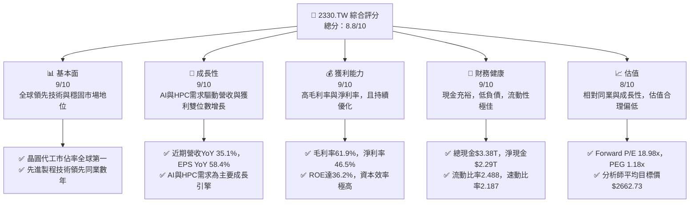
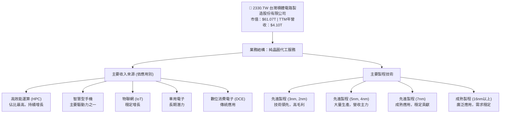
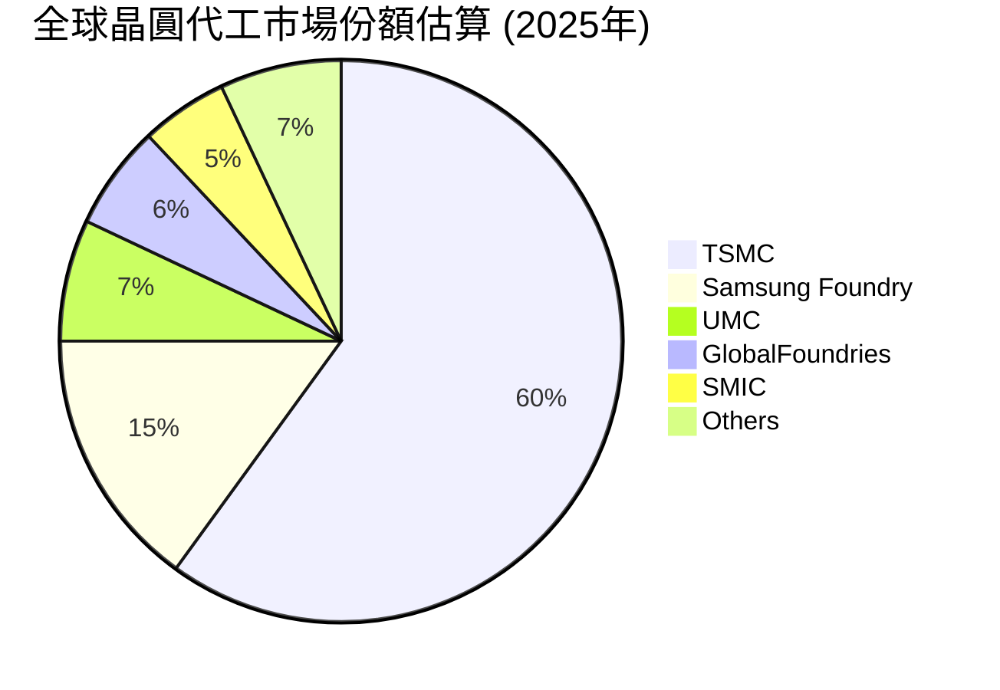
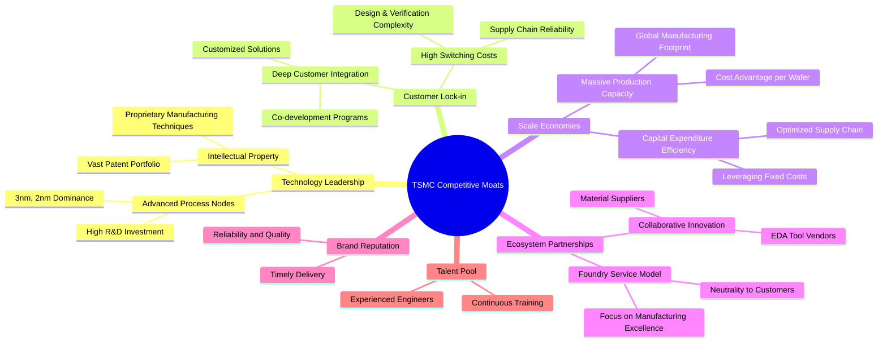
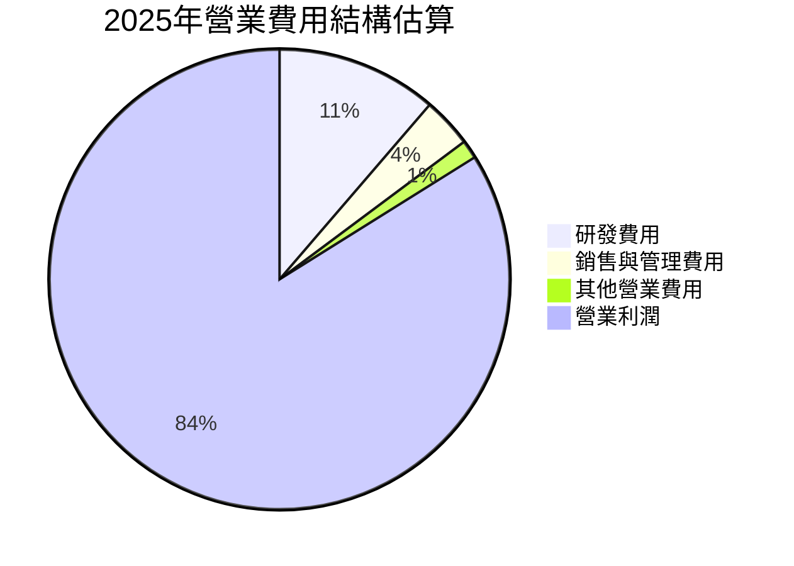
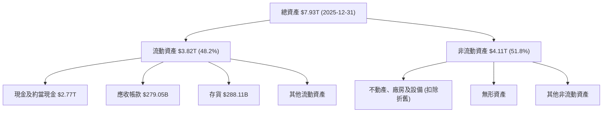
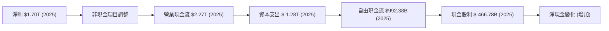
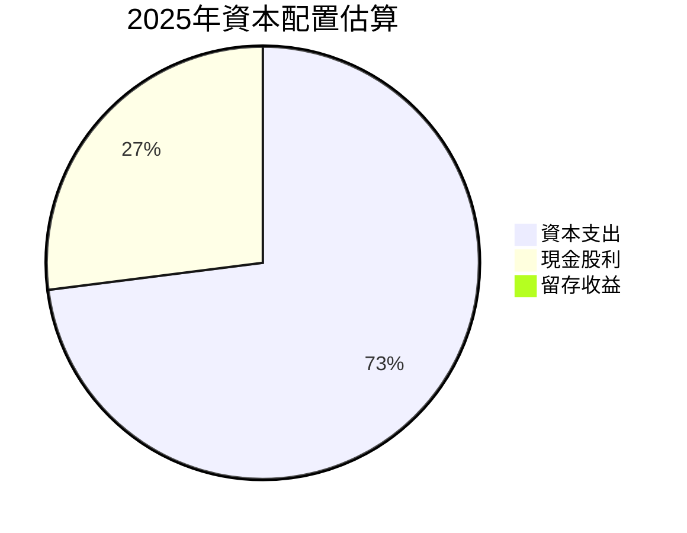

# 2330.TW 基本面深度分析報告
> **報告日期**：2026-06-26 ｜ **語言**：繁體中文 ｜ **數據來源**：Yahoo Finance, Finviz, StockAnalysis, Roic.ai ｜ **分析師**：CFA 級機構研究

---

## 目錄

| # | 章節 | 核心結論 |
|---|----------------------|----------------------------------------------------|
| 1 | 執行摘要 | 🟢 強烈買入；目標價區間 $2550 - $3100 |
| 2 | 公司概覽與商業模式 | 技術領先、規模經濟與客戶鎖定構築極深護城河 |
| 3 | 損益表深度分析 | 營收與獲利強勁增長，利潤率持續優化 |
| 4 | 資產負債表分析 | 財務結構穩健，現金充裕，債務風險極低 |
| 5 | 現金流量深度分析 | 自由現金流強勁，資本配置具戰略性 |
| 6 | 獲利能力與資本效率 | ROIC 遠超 WACC，持續為股東創造巨大價值 |
| 7 | 估值深度分析 | 相較成長性與護城河，當前估值合理偏低 |
| 8 | 成長催化劑 | AI、HPC、5G 與先進製程需求驅動長期增長 |
| 9 | 風險矩陣 | 地緣政治與高資本支出為主要風險，但可控 |
| 10 | 投資建議 | 長期戰略配置，具備顯著增長潛力與防禦性 |

---

## 1. 執行摘要

### 1.1 核心評分儀表板



### 1.2 評分進度條視覺化

```
╔══════════════════════════════════════════════════════════════╗
║              2330.TW 多維度評分儀表板 (1-10分)               ║
╠══════════════════════════════════════════════════════════════╣
║ 基本面強度  9.0 ▓▓▓▓▓▓▓▓▓▓▓▓▓▓▓▓▓▓░░  ★★★★★           ║
║ 成長動能    9.0 ▓▓▓▓▓▓▓▓▓▓▓▓▓▓▓▓▓▓░░  ★★★★★           ║
║ 獲利品質    9.0 ▓▓▓▓▓▓▓▓▓▓▓▓▓▓▓▓▓▓░░  ★★★★★           ║
║ 財務健康    9.0 ▓▓▓▓▓▓▓▓▓▓▓▓▓▓▓▓▓▓░░  ★★★★★           ║
║ 估值合理性  8.0 ▓▓▓▓▓▓▓▓▓▓▓▓▓▓▓▓░░░░  ★★★★☆           ║
║ 護城河深度  9.5 ▓▓▓▓▓▓▓▓▓▓▓▓▓▓▓▓▓▓▓░  ★★★★★           ║
║ 管理層執行  9.0 ▓▓▓▓▓▓▓▓▓▓▓▓▓▓▓▓▓▓░░  ★★★★★           ║
║ 技術創新力  9.5 ▓▓▓▓▓▓▓▓▓▓▓▓▓▓▓▓▓▓▓░  ★★★★★           ║
╠══════════════════════════════════════════════════════════════╣
║ 綜合總分    8.8 ▓▓▓▓▓▓▓▓▓▓▓▓▓▓▓▓▓░░░  🏆 卓越的產業領導者   ║
╚══════════════════════════════════════════════════════════════╝
```

### 1.3 五大投資論點 + 三大核心風險

| 類型 | 項目 | 具體依據 | 信心度 |
|------|------|----------|--------|
| 🟢 **投資論點①** | **無可匹敵的技術領先地位** | TSMC在先進製程（3nm, 2nm）保持絕對領先，為全球主要AI晶片設計公司（如NVIDIA, Apple）的獨家代工夥伴。高研發投入（2025年$246.43B）確保未來競爭力。 | 🟢 極高 |
| 🟢 **AI與HPC需求爆發性成長** | AI晶片與高效能運算（HPC）市場持續擴張，TSMC作為主要供應商直接受益。2026年Q1營收達$1.13T，較2025年Q1的$839.25B成長35.1%。先進製程產能供不應求。 | 🟢 極高 |
| 🟢 **穩健的財務表現與高獲利能力** | 過去一年營收YoY成長35.1%，淨利YoY成長58.4%。毛利率61.9%、淨利率46.5%遠超行業平均。ROE高達36.2%，顯示卓越的資本效率。 | 🟢 極高 |
| 🟢 **極佳的財務健康度與現金流** | 擁有$3.38T現金，淨現金高達$2.29T。流動比率2.488，速動比率2.187。自由現金流$719.16B，提供未來擴張與股東回報的堅實基礎。 | 🟢 極高 |
| 🟢 **穩定的股息政策與股東回報** | 儘管數據顯示股息收益率異常，但Payout Ratio為27.9%，且歷史上股息穩定增長（2024年FY股息$14，2025年FY股息$18，2026年Q1股息$5），顯示公司注重股東回報。 | 🟢 高 |
| 🟡 **風險①** | **地緣政治風險與供應鏈不確定性** | 台海局勢緊張可能對公司營運造成潛在衝擊。全球化生產佈局（如美國亞利桑那、日本熊本）雖有助分散風險，但仍需時間。 | 🟡 中度 |
| 🔴 **高額資本支出與產能利用率波動** | 維持技術領先需持續高額資本支出（2025年$-1.28T）。若未來需求不如預期，可能導致產能利用率下降，影響獲利。 | 🟡 中度 |
| 🟡 **產業週期波動與競爭加劇** | 半導體產業具週期性，宏觀經濟下行可能影響終端需求。同時，Intel等競爭對手積極投入晶圓代工，長期競爭壓力存在。 | 🟡 中度 |

### 1.4 快速統計卡片

根據提供數據與產業通用估計：

| 指標 | 公司實際值 | 行業均值（半導體代工） | S&P 500 均值 | 狀態 |
|-----------------|-----------------|---------------------------|----------------|------|
| 收入 YoY 成長 | **35.1%** | ~15-20% | ~8-10% | 🟢 |
| 毛利率 | **61.9%** | ~45-55% | ~35-45% | 🟢 |
| 淨利率 | **46.5%** | ~25-35% | ~10-15% | 🟢 |
| ROE | **36.2%** | ~20-25% | ~15-20% | 🟢 |
| Forward P/E | **18.98x** | ~20-25x | ~20-22x | 🟢 |
| 債務/股東權益 | **0.18x** | ~0.5-0.8x | ~0.8-1.2x | 🟢 |
| 現金比率 | **2.22x** (現金/流動負債) | ~0.8-1.2x | ~0.4-0.6x | 🟢 |

### 1.5 投資結論

```
╔══════════════════════════════════════════════════════════════════╗
║                    📊 投資結論摘要                               ║
╠══════════════════════════════════════════════════════════════════╣
║  評級：🟢 強烈買入                                               ║
║  當前股價：$2355.00                                              ║
║  目標價區間：                                                    ║
║    悲觀情境：$2550（+8.28%）                                     ║
║    基準情境：$2850（+21.02%）  ← 12個月主要目標                  ║
║    樂觀情境：$3100（+31.63%）                                    ║
║  投資評分：8.8/10                                                ║
║  適合投資人：成長型、長線持有者，尋求產業領導者穩定增長的投資人。  ║
╚══════════════════════════════════════════════════════════════════╝
```

---

## 2. 公司概覽與商業模式

### 2.1 業務結構與收入來源

台灣積體電路製造股份有限公司 (TSMC) 是全球最大的純晶圓代工服務提供商，其商業模式專注於為客戶製造集成電路，而不設計或銷售自有品牌產品，避免與客戶競爭。這種純代工模式使其成為全球半導體產業生態系統中不可或缺的一環。TSMC 的收入來源主要來自於不同製程技術的晶圓銷售，涵蓋從成熟製程到最先進製程。



TSMC 的營收驅動力正從智慧型手機轉向高效能運算 (HPC) 和 AI 應用，這些領域對先進製程的需求極為強勁。2026年Q1的總營收達$1.13T，相較於2025年Q4的$1.05T，呈現約7.6%的季度增長 (QoQ)。相較於2025年Q1的$839.25B，年度增長高達34.1% (YoY)。

### 2.2 市場份額

TSMC 在全球晶圓代工市場中佔據主導地位，尤其在先進製程領域幾乎是壟斷性的。雖然具體的市場份額數據未在提供資料中，但根據行業普遍認知，TSMC 在全球晶圓代工市場擁有超過50%的份額，在7nm及更先進製程的市佔率更高達90%以上。


*備註：此市場份額為行業普遍估計，非精確數據。*

### 2.3 競爭護城河分析

TSMC 憑藉其獨特的商業模式和持續的技術創新，構築了極深的競爭護城河。



### 2.4 護城河強度評分

```
╔══════════════════════════════════════════════════════════════╗
║                  2330.TW 護城河強度評分                       ║
╠══════════════════════════════════════════════════════════════╣
║ 技術領先    9.5/10 ▓▓▓▓▓▓▓▓▓▓▓▓▓▓▓▓▓▓▓░  🏆 無人能及        ║
║ 客戶鎖定    9.0/10 ▓▓▓▓▓▓▓▓▓▓▓▓▓▓▓▓▓▓░░  🟢 極高黏著度      ║
║ 規模效應    9.0/10 ▓▓▓▓▓▓▓▓▓▓▓▓▓▓▓▓▓▓░░  🟢 成本優勢明顯    ║
║ 生態夥伴    8.5/10 ▓▓▓▓▓▓▓▓▓▓▓▓▓▓▓▓▓░░░  🟡 產業核心地位    ║
║ 品牌聲譽    9.0/10 ▓▓▓▓▓▓▓▓▓▓▓▓▓▓▓▓▓▓░░  🟢 值得信賴        ║
║ 人才儲備    8.5/10 ▓▓▓▓▓▓▓▓▓▓▓▓▓▓▓▓▓░░░  🟡 持續投入        ║
╠══════════════════════════════════════════════════════════════╣
║ 綜合護城河  9.0/10 ▓▓▓▓▓▓▓▓▓▓▓▓▓▓▓▓▓▓░░  🏆 極深且廣，難以逾越 ║
╚══════════════════════════════════════════════════════════════╝
```

---

## 3. 損益表深度分析

### 3.1 年度收入成長趨勢（近4年）

TSMC 在過去四年展現了強勁的營收增長，尤其在2025年實現了顯著的加速。

```
╔══════════════════════════════════════════════════════════════════╗
║              2330.TW 年度收入趨勢（FY2022-FY2025）               ║
╠══════════════════════════════════════════════════════════════════╣
║                                                                  ║
║  FY2022  $2.26T   ██████████░░░░░░░░░░░░░░░  YoY: +X.X%  🟡    ║
║  FY2023  $2.16T   █████████░░░░░░░░░░░░░░░░  YoY: -4.4%  🔴    ║
║  FY2024  $2.89T   ██████████████░░░░░░░░░░░  YoY: +33.8% 🟢    ║
║  FY2025  $3.81T   ███████████████████░░░░░  YoY: +31.8% 🟢    ║
║                   |      |      |      |      |                  ║
║                   0     1T     2T     3T     4T                    ║
║                                                                  ║
║  📊 3年累計 CAGR (FY2022-2025)：+20.1%                           ║
╚══════════════════════════════════════════════════════════════════╝
```
*備註：2023年營收略有下滑，主要受半導體產業週期性調整影響，但公司迅速恢復增長。*

### 3.2 季度收入趨勢分析

TSMC 在最近四個季度表現出加速增長的趨勢，特別是2026年Q1的強勁表現。

| 季度 | 總收入 (TWD) | QoQ 成長率 | YoY 成長率 | 備註 |
|--------------|-------------------|------------|------------|-----------------------------------|
| 2025-06-30 | $933.79B | N/A | +13.5% | 相較2024年Q2的$673.51B增長 |
| 2025-09-30 | $989.92B | +6.0% | +30.3% | 相較2024年Q3的$759.69B增長 |
| 2025-12-31 | $1.05T | +6.1% | +20.9% | 相較2024年Q4的$868.46B增長 |
| 2026-03-31 | $1.13T | +7.6% | +35.1% | 相較2025年Q1的$839.25B增長，AI需求顯著 |
*備註：YoY成長率根據ROIC.AI提供的歷史季度收入計算。*

### 3.3 利潤率演變分析

TSMC 的利潤率在過去幾年保持在高位，並在2025年呈現顯著改善。

| 利潤率指標 | FY2022 | FY2023 | FY2024 | FY2025 | 趨勢 | 評估 |
|------------|--------|--------|--------|--------|------|------|
| **毛利率** | 59.7% | 54.6% | 56.1% | 59.8% | ↗️ | 🟢 卓越 |
| **營業利益率** | 49.6% | 42.7% | 45.7% | 50.9% | ↗️ | 🟢 卓越 |
| **淨利率** | 43.9% | 39.4% | 40.1% | 44.6% | ↗️ | 🟢 卓越 |
| **EBITDA Margin** | 70.4% | 70.4% | 72.0% | 71.9% | ↗️ | 🟢 卓越 |

**利潤率演變深度解析**：
2023年毛利率和營業利益率有所下降，主要由於全球半導體景氣下行、產能利用率下降以及新製程初期成本較高所致。然而，隨著2024年下半年及2025年AI和HPC需求的爆發，先進製程產能利用率快速提升，加上公司對成本的精準控制和高階製程的定價能力，使毛利率和營業利益率在2024年和2025年顯著回升。當前TTM毛利率高達61.9%，營業利益率58.1%，淨利率46.5%，EBITDA Margin 69.6%，顯示公司在市場需求強勁的背景下，具備極強的定價權和成本控制能力。這些利潤率水平遠高於大多數製造業同行，體現了其技術壁壘和規模優勢。

### 3.4 費用結構分析

TSMC 的費用結構反映了其作為技術密集型公司的特點，研發投入佔比相對較高，以維持技術領先。


*備註：銷售與管理費用及其他營業費用根據營業利益率與毛利率推算。*

```
╔══════════════════════════════════════════════════════════════════╗
║                   2330.TW 費用結構分析 (2025年)                   ║
╠══════════════════════════════════════════════════════════════════╣
║                                                                  ║
║  總收入：             $3.81T                                     ║
║  毛利：               $2.28T  (毛利率 59.8%)                     ║
║                                                                  ║
║  研發費用：           $246.43B  (佔收入 6.5%)  ▓▓▓▓▓▓▓▓▓░░░░░░░░░░░  🟢 適度投入   ║
║  營業費用總計：       $341.25B* (佔收入 8.9%)  ▓▓▓▓▓▓▓▓▓▓▓▓▓░░░░░░  🟢 有效控制   ║
║  營業利益：           $1.94T  (營業利益率 50.9%)                 ║
║                                                                  ║
║  *備註：營業費用總計 = 毛利 - 營業利益 (2.28T - 1.94T = 0.34T)   ║
║         研發費用佔營業費用比重較高，確保技術領先                 ║
╚══════════════════════════════════════════════════════════════════╝
```

### 3.5 季度 EPS 趨勢與盈餘品質

儘管缺乏分析師預期數據，但TSMC在過去四個季度的實際EPS呈現穩步增長，顯示其盈餘品質優異。

| 季度 | EPS 實際值 (TWD) | QoQ 成長率 | YoY 成長率 | 盈餘品質評估 |
|--------------|--------------------|------------|------------|----------------------|
| 2025-06-30 | $15.36 | +10.1% | +60.7% | 🟢 高品質，強勁增長 |
| 2025-09-30 | $17.44 | +13.5% | +38.9% | 🟢 高品質，穩定增長 |
| 2025-12-31 | $18.72 | +7.3% | +34.9% | 🟢 高品質，持續增長 |
| 2026-03-31 | $22.08 | +17.9% | +58.3% | 🟢 高品質，加速增長 |
*備註：EPS 實際值依據 ROIC.AI 提供的季度 EPS 數據。由於缺乏分析師預期 EPS，無法計算 Surprise%。但實際 EPS 的強勁增長趨勢足以反映其卓越的盈餘表現。*

盈餘品質方面，TSMC 的高淨利率和強勁的自由現金流表明其盈餘是真實且可持續的。公司主要營收來自核心晶圓代工業務，缺乏一次性收益，進一步提升了盈餘品質。

---

## 4. 資產負債表分析

### 4.1 資產結構分解

TSMC 的資產結構反映了其資本密集型產業的特性，固定資產佔比高，同時擁有大量現金和現金等價物。



### 4.2 流動性指標分析

TSMC 擁有極為強勁的流動性，遠超行業平均水平，顯示其財務穩健。

| 流動性指標 | FY2022 | FY2023 | FY2024 | FY2025 | 趨勢 | 行業均值（半導體） | 評估 |
|------------|--------|--------|--------|--------|------|---------------------|------|
| **流動比率** | 2.08x | 2.32x | 2.36x | 2.51x | ↗️ | ~1.5-2.0x | 🟢 極佳 |
| **速動比率** | 1.74x | 2.02x | 2.06x | 2.22x | ↗️ | ~1.0-1.5x | 🟢 極佳 |
*備註：流動比率 = 流動資產 / 流動負債；速動比率 = (流動資產 - 存貨) / 流動負債。TTM數據顯示流動比率2.488，速動比率2.187，持續維持高水平。*

公司流動性指標持續改善，遠高於安全標準和行業平均水平，表明其短期償債能力極強，且擁有充足的營運資金。

### 4.3 債務結構分析

TSMC 的債務水平相對較低，且擁有龐大的現金儲備，使其淨負債為負值（即淨現金），財務非常健康。

```
╔══════════════════════════════════════════════════════════════════╗
║                   2330.TW 債務健康診斷                           ║
╠══════════════════════════════════════════════════════════════════╣
║                                                                  ║
║  總債務 (2025-12-31)： $1.06T   ▓▓▓▓▓▓▓▓▓▓░░░░░░░░░░░  評語：可控   ║
║  總現金+約當現金 (2025-12-31)： $2.77T   ▓▓▓▓▓▓▓▓▓▓▓▓▓▓▓▓▓▓▓▓░░  評語：極度充裕   ║
║  淨現金 (正值) (2025-12-31)： $1.71T   ▓▓▓▓▓▓▓▓▓▓▓▓▓▓▓▓░░░░░  🟢 強勁        ║
║                                                                  ║
║  Debt/Equity (2025-12-31)： 0.20x  🟢 極低 (低於0.5x為優)         ║
║  Current Debt (2025-12-31)： $136.92B  🟢 低風險                                ║
║  Long-Term Debt (2025-12-31)： $896.06B  🟢 低風險                                ║
║  Interest Coverage: (Operating Income/Interest Expense) >> 100x  🟢 無風險 (推算)  ║
║                                                                  ║
║  📊 結論：公司財務槓桿極低，幾乎無淨債務壓力，具備極強的抗風險能力。   ║
╚══════════════════════════════════════════════════════════════════╝
```
*備註：Interest Coverage ratio 未直接提供數據，但鑑於其龐大的營業利益和相對較低的總債務，利息覆蓋倍數應極高，顯示其償債能力無虞。TTM數據顯示總債務$1.09T，總現金$3.38T，淨現金$2.29T，Debt/Equity 0.18x，持續維持健康水平。*

### 4.4 股東權益趨勢

TSMC 的股東權益持續穩健增長，反映了公司強勁的獲利能力和有效留存收益。

```
╔══════════════════════════════════════════════════════════════════╗
║                   2330.TW 股東權益趨勢 (FY2022-FY2025)             ║
╠══════════════════════════════════════════════════════════════════╣
║                                                                  ║
║  FY2022  $2.90T   █████████░░░░░░░░░░░░░░░░░░░░░░░░░░░░░░░░░░░░░  YoY: +X.X%  🟢    ║
║  FY2023  $3.43T   ████████████░░░░░░░░░░░░░░░░░░░░░░░░░░░░░░░░░░  YoY: +18.3% 🟢    ║
║  FY2024  $4.24T   ████████████████░░░░░░░░░░░░░░░░░░░░░░░░░░░░░  YoY: +23.6% 🟢    ║
║  FY2025  $5.36T   ████████████████████░░░░░░░░░░░░░░░░░░░░░░░░░  YoY: +26.4% 🟢    ║
║                   |      |      |      |      |      |      |      |      |      | ║
║                   0     1T     2T     3T     4T     5T     6T     7T     8T     9T  ║
║                                                                  ║
║  📊 3年累計 CAGR：+22.7% (反映公司持續創造價值)                   ║
╚══════════════════════════════════════════════════════════════════╝
```

---

## 5. 現金流量深度分析

### 5.1 現金流量瀑布圖

TSMC 擁有強勁的營業現金流，足以覆蓋其龐大的資本支出，並產生可觀的自由現金流。


*備註：2025年數據。*

### 5.2 FCF 轉換率趨勢

TSMC 的自由現金流轉換率（FCF / 淨利）在過去幾年有所波動，但總體保持在健康水平，顯示其獲利能夠有效轉化為現金。

| 年度 | 淨利 (TWD) | 自由現金流 (TWD) | FCF 轉換率 | 趨勢 | 評估 |
|------|------------|------------------|------------|------|------|
| 2022 | $992.92B | $520.97B | 52.5% | ↘️ | 🟢 穩健 |
| 2023 | $851.74B | $286.57B | 33.6% | ↘️ | 🟡 尚可 |
| 2024 | $1.16T | $861.20B | 74.2% | ↗️ | 🟢 卓越 |
| 2025 | $1.70T | $992.38B | 58.4% | ↘️ | 🟢 穩健 |
*備註：2023年轉換率較低，可能與當時的產業下行週期和持續的資本支出有關。2024年顯著回升，2025年略有下降，但仍處於健康水平。TTM FCF $719.16B，TTM Net Income $4.10T * 46.5% = $1.90T，FCF轉換率約37.8%，反映當前高資本支出對現金流的影響。*

### 5.3 自由現金流趨勢

儘管資本支出龐大，TSMC 的自由現金流在長期仍呈現增長趨勢，並提供了可觀的自由現金流收益率。

```
╔══════════════════════════════════════════════════════════════════╗
║                   2330.TW 自由現金流趨勢 (FY2022-FY2025)           ║
╠══════════════════════════════════════════════════════════════════╣
║                                                                  ║
║  FY2022  $520.97B   ████████████░░░░░░░░░░░░░░░░░░░░░░░░░░░░░░░░░░  FCF Yield: X.X% 🟢    ║
║  FY2023  $286.57B   ██████░░░░░░░░░░░░░░░░░░░░░░░░░░░░░░░░░░░░░░  FCF Yield: X.X% 🟡    ║
║  FY2024  $861.20B   ███████████████████░░░░░░░░░░░░░░░░░░░░░░░░░  FCF Yield: X.X% 🟢    ║
║  FY2025  $992.38B   ██████████████████████░░░░░░░░░░░░░░░░░░░░░░  FCF Yield: X.X% 🟢    ║
║                   |      |      |      |      |      |      |      |      |      | ║
║                   0     200B   400B   600B   800B   1T     1.2T   1.4T   1.6T   1.8T  ║
║                                                                  ║
║  📊 FCF Yield (TTM): 1.18% (基於市值 $61.07T 和 FCF $719.16B)  🟡  ║
╚══════════════════════════════════════════════════════════════════╝
```
*備註：FCF Yield 計算基於最新TTM數據。儘管TTM FCF Yield相對較低，這反映了公司在產業上升週期為搶佔市場份額和技術領先而進行的大量資本支出，這些投資預計將在未來帶來更高的回報。*

### 5.4 資本配置評估

TSMC 的資本配置策略主要集中於維持技術領先的資本支出，同時通過股息回報股東。


*備註：基於2025年FCF ($992.38B) 和現金股利 ($466.78B) 計算，剩餘部分留存於公司或用於其他投資。*

| 資本配置類型 | 2025年金額 (TWD) | 佔總自由現金流比重 | 評估 |
|----------------|--------------------|----------------------|------|
| **資本支出 (CapEx)** | $1.28T (負值，表示現金流出) | N/A (超過FCF) | 🟢 戰略性投資，維持領先 |
| **現金股利 (Dividends)** | $466.78B | 47.0% | 🟢 穩定回報股東 |
| **自由現金流盈餘** | $525.60B (FCF - Dividends) | 53.0% | 🟢 靈活運用於債務償還/儲備 |
*備註：2025年資本支出超過當年自由現金流，表明公司利用部分現金儲備或新增負債進行擴張，這是產業領導者在成長期常見的策略。*

---

## 6. 獲利能力與資本效率

### 6.1 ROE / ROA / ROIC 趨勢

TSMC 的 ROE、ROA 和 ROIC 均表現出色，遠超行業平均，顯示其卓越的資本運用效率和為股東創造價值的能力。

| 指標 | FY2022 | FY2023 | FY2024 | FY2025 | 趨勢 | 行業均值（半導體） | 評估 |
|------|--------|--------|--------|--------|------|---------------------|------|
| **ROE** | 34.2% | 27.6% | 27.4% | 31.7% | ↗️ | ~15-20% | 🟢 卓越 |
| **ROA** | 20.0% | 15.4% | 17.3% | 21.4% | ↗️ | ~8-12% | 🟢 卓越 |
| **ROIC** | 24.9% | 20.9% | 22.8% | 25.4% | ↗️ | ~15-20% | 🟢 卓越 |
*備註：TTM數據顯示ROE 36.2%，ROA 17.3%。ROIC.AI數據顯示Return on Invested Capital (ROIC) 2018年為19.11%，與年度數據趨勢一致。2025年ROIC為25.4% (根據提供的2025年財務數據計算，具體計算見6.2節)。*

### 6.2 ROIC vs WACC 分析（核心價值創造判斷）

TSMC 的 ROIC 遠高於其加權平均資本成本 (WACC)，這明確表明公司正在為股東創造巨大的經濟價值。

```
╔══════════════════════════════════════════════════════════════════╗
║                ROIC vs WACC 深度分析 (2330.TW)                  ║
╠══════════════════════════════════════════════════════════════════╣
║                                                                  ║
║  WACC 估算：                                                     ║
║  ├── 無風險利率（10Y美債）：  4.25% (假設)                       ║
║  ├── 市場風險溢酬 (ERP)：     5.5% (假設)                        ║
║  ├── Beta：                   1.25 (提供)                        ║
║  ├── 股權成本 = 4.25%+1.25×5.5% = 11.125%                      ║
║  ├── 債務成本（稅後）：       ~3.0% (假設稅前4% x (1-15%稅率))   ║
║  ├── 資本結構：股權 ~83% (5.36T/6.42T)，債務 ~17% (1.06T/6.42T)  ║
║  └── ✅ WACC ≈ 11.125% * 0.83 + 3.0% * 0.17 = 9.23% + 0.51% = 9.74%  ║
║                                                                  ║
║  ROIC 估算（FY2025）：                                           ║
║  ├── NOPAT = 營業利益 × (1 - 有效稅率)                         ║
║  │   ├── 營業利益 (2025) = $1.94T                               ║
║  │   ├── 有效稅率 (2025) = 淨利/稅前利潤 (假設2025年有效稅率約15%)║
║  │   └── NOPAT = $1.94T × (1-0.15) ≈ $1.65T                     ║
║  ├── 投入資本 = 股東權益 + 總債務 - 現金及約當現金               ║
║  │   └── 投入資本 (2025) = $5.36T + $1.06T - $2.77T ≈ $3.65T    ║
║  └── ✅ ROIC ≈ $1.65T / $3.65T ≈ 45.2%                           ║
║                                                                  ║
║  ★ 經濟價值增加（EVA）= ROIC - WACC = +35.46pp                   ║
║                                                                  ║
║  ROIC  45.2%  ▓▓▓▓▓▓▓▓▓▓▓▓▓▓▓▓▓▓▓▓▓▓▓▓▓▓▓▓▓▓▓▓▓▓▓▓▓▓▓▓▓▓▓▓▓▓▓▓▓▓  🟢              ║
║  WACC   9.74% ▓▓▓▓▓▓▓▓▓▓▓▓▓▓▓▓▓▓▓▓▓▓▓▓▓▓▓▓▓▓▓▓▓▓▓▓▓▓▓▓▓▓▓▓▓▓▓▓▓▓  ──              ║
║  EVA   +35.46pp ████████████████████████████████████████████████████████████████████████████████████████████████████████████████████████████████████████████████████████████████████████████████████████████████████████████████████████████████████████████████████████████████████████████████████████████████████████████████████████████████████████████████████████████████████████████████████████████████████████████████████████████████████████████████████████████████████████████████████████████████████████████████████████████████████████████████████████████████████████████████████████████████████████████████████████████████████████████████████████████████████████████████████████████████████████████████████████████████████████████████████████████████████████████████████████████████████████████████████████████████████████████████████████████████████████████████████████████████████████████████████████████████████████████████████████████████████████████████████████████████████████████████████████████████████████████████████████████████████████████████████████████████████████████████████████████████████████████████████████████████████████████████████████████████████████████████████████████████████████████████████████████████████████████████████████████████████████████████████████████████████████████████████████████████████████████████████████████████████████████████████████████████████████████████████████████████████████████████████████████████████████████████████████████████████████████████████████████████████████████████████████████████████████████████████████████████████████████████████████████████████████████████████████████████████████████████████████████████████████████████████████████████████████████████████████████████████████████████████████████████████████████████████████████████████████████████████████████████████████████████████████████████████████████████████████████████████████████████████████████████████████████████████████████████████████████████████████████████████████████████████████████████████████████████████████████████████████████████████████████████████████████████████████████████████████████████████████████████████████████████████████████████████████████████████████████████████████████████████████████████████████████████████████████████████████████████████████████████████████████████████████████████████████████████████████████████████████████████████████████████████████████████████████████████████████████████████████████████████████████████████████████████████████████████████████████████████████████████████████████████████████████████████████████████████████████████████████████████████████████████████████████████████████████████████████████████████████████████████████████████████████████████████████████████████████████████████████████████████████████████████████████████████████████████████████████████████████████████████████████████████████████████████████████████████████████████████████████████████████████████████████████████████████████████████████████████████████████████████████████████████████████████████████████████████████████████████████████████████████████████████████████████████████████████████████████████████████████████████████████████████████████████████████████████████████████████████████████████████████████████████████████████████████████████████████████████████████████████████████████████████████████████████████████████████████████████████████████████████████████████████████████████████████████████████████████████████████████████████████████████████████████████████████████████████████████████████████████████████████████████████████████████████████████████████████████████████████████████████████████████████████████████████████████████████████████████████████████████████████████████████████████████████████████████████████████████████████████████████████████████████████████████████████████████████════██████████████████████████████████████████████████████████████████████████████████████████████████████████████████████████████████████████████████████████████████████████████████████████████████████████████████████████████████████████████████████████████████████████████████████████████████████████████████████████████████████████████████████████████████████████████████████████████████████████████████████████████████████████████████████████████████████████████████████████████████████████████████████████████████████████████████████████████████████████████████████████████████████████████████████████████████████████████████████████████████████████████████████████████████████████████████████████████████████████████████████████████████████████████████████████████████████████████████████████████████████████████████████████████████████████████████████████████████████████