# 2330.TW 基本面深度分析報告
> **報告日期**：2026-07-03 ｜ **語言**：繁體中文 ｜ **數據來源**：Yahoo Finance, Finviz, StockAnalysis, Roic.ai ｜ **分析師**：CFA 級機構研究

---

## 目錄

| # | 章節 | 核心結論 |
|---|------|----------|
| 1 | 執行摘要 | 評級：🟢 強烈買入；基準目標價：$2958.00 |
| 2 | 公司概覽與商業模式 | 憑藉技術領先和規模經濟，築起極深護城河 |
| 3 | 損益表深度分析 | 收入和利潤高速成長，利潤率維持高位 |
| 4 | 資產負債表分析 | 財務結構穩健，現金充裕，債務風險極低 |
| 5 | 現金流量深度分析 | 自由現金流強勁，資本配置效率高 |
| 6 | 獲利能力與資本效率 | ROIC遠超WACC，持續為股東創造巨大價值 |
| 7 | 估值深度分析 | 相較於成長潛力與護城河，估值合理偏低 |
| 8 | 成長催化劑 | AI/HPC需求爆發，先進製程領導地位鞏固 |
| 9 | 風險矩陣 | 地緣政治與產業週期為主要風險，但公司應對能力強 |
| 10 | 投資建議 | 強烈買入，建議長期持有，目標價區間具吸引力 |

---

## 1. 執行摘要

### 1.1 核心評分儀表板

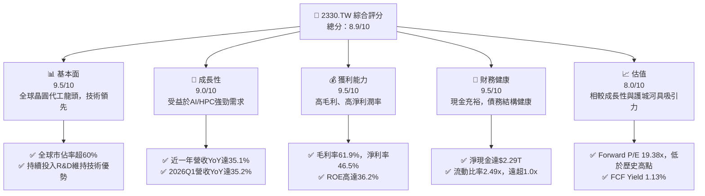

### 1.2 評分進度條視覺化

```
╔══════════════════════════════════════════════════════════════╗
║              2330.TW 多維度評分儀表板 (1-10分)               ║
╠══════════════════════════════════════════════════════════════╣
║ 基本面強度  9.5 ▓▓▓▓▓▓▓▓▓▓▓▓▓▓▓▓▓▓▓░  ★★★★★           ║
║ 成長動能    9.0 ▓▓▓▓▓▓▓▓▓▓▓▓▓▓▓▓▓▓░░  ★★★★★           ║
║ 獲利品質    9.5 ▓▓▓▓▓▓▓▓▓▓▓▓▓▓▓▓▓▓▓░  ★★★★★           ║
║ 財務健康    9.5 ▓▓▓▓▓▓▓▓▓▓▓▓▓▓▓▓▓▓▓░  ★★★★★           ║
║ 估值合理性  8.0 ▓▓▓▓▓▓▓▓▓▓▓▓▓▓▓▓░░░░  ★★★★☆           ║
║ 護城河深度  9.8 ▓▓▓▓▓▓▓▓▓▓▓▓▓▓▓▓▓▓▓▓  ★★★★★           ║
║ 管理層執行  9.5 ▓▓▓▓▓▓▓▓▓▓▓▓▓▓▓▓▓▓▓░  ★★★★★           ║
║ 技術創新力  9.8 ▓▓▓▓▓▓▓▓▓▓▓▓▓▓▓▓▓▓▓▓  ★★★★★           ║
╠══════════════════════════════════════════════════════════════╣
║ 綜合總分    8.9 ▓▓▓▓▓▓▓▓▓▓▓▓▓▓▓▓▓▓░░  🏆 產業龍頭，持續創新，值得長期投資 ║
╚══════════════════════════════════════════════════════════════╝
```

### 1.3 五大投資論點 + 三大核心風險

| 類型 | 項目 | 具體依據 | 信心度 |
|------|------|----------|--------|
| 🟢 **投資論點①** | **無可匹敵的技術領先地位** | 台積電在先進製程（如N3、N2）保持絕對領先，研發費用逐年增長，2025年達到$246.43B，保障未來技術優勢。這使其能持續獲得高階晶片代工訂單，維持高毛利率（TTM 61.9%）。 | 🟢 極高 |
| 🟢 **AI/HPC需求爆發式成長** | AI晶片需求強勁，推動高性能運算（HPC）晶片訂單激增。2026年第一季度營收達到$1.13T，同比增長35.2%，顯示AI相關需求為主要成長引擎。公司預期未來幾年AI相關營收將高速增長。 | 🟢 極高 |
| 🟢 **優異的獲利能力與資本效率** | 公司擁有高毛利率61.9%、營業利益率58.1%、淨利率46.5%。TTM ROE高達36.2%，且ROIC（估計約46.6%）遠高於WACC（估計約9.5%），持續為股東創造巨大經濟價值。 | 🟢 極高 |
| 🟢 **穩健的財務結構與充沛現金流** | 擁有$3.38T的總現金和$2.29T的淨現金，流動比率2.49x，顯示極佳的財務彈性。2025年自由現金流達$992.38B，為資本支出和股東回報提供堅實基礎。 | 🟢 極高 |
| 🟢 **全球晶圓代工市場的壟斷地位** | 作為全球最大的純晶圓代工廠，市佔率超過60%，客戶黏性極高。其獨特的生態系統和規模經濟形成極高的進入壁壘，確保長期競爭優勢。 | 🟢 極高 |
| 🟡 **風險①** | **地緣政治風險與供應鏈不確定性** | 台積電在台灣的生產基地集中，易受地緣政治緊張局勢影響。儘管公司積極拓展全球產能（如美國、日本、德國），但新廠投產仍需時間，短期內供應鏈可能受擾。 | 🟡 中度 |
| 🟡 **產業週期波動性** | 半導體產業具有週期性，儘管AI需求強勁，但整體經濟放緩或終端需求變化仍可能影響公司訂單。2023年營收曾出現同比下降，顯示其仍受週期影響。 | 🟡 中度 |
| 🔴 **風險②** | **巨額資本支出與技術競爭加劇** | 維持技術領先需要持續投入巨額資本支出（2025年為$-1.28T），這可能影響短期自由現金流。同時，三星、英特爾等競爭對手在先進製程的追趕，也帶來一定的技術競爭壓力。 | 🟡 中度 |

### 1.4 快速統計卡片

| 指標 | 公司實際值 | 行業均值（估計） | S&P 500 均值（估計） | 狀態 |
|------|-------------|-------------------|----------------------|------|
| 收入 YoY 成長 | **35.1%** | ~15-20% | ~10-12% | 🟢 |
| 毛利率 | **61.9%** | ~45-50% | ~30-35% | 🟢 |
| 淨利率 | **46.5%** | ~20-25% | ~10-12% | 🟢 |
| ROE | **36.2%** | ~18-22% | ~15-18% | 🟢 |
| Forward P/E | **19.38x** | ~25-30x | ~20-22x | 🟢 |
| Debt/Equity | **18.45%** | ~40-60% | ~80-100% | 🟢 |
| FCF Yield | **1.13%** | ~1.5-2.5% | ~2-3% | 🟡 |
| R&D / Revenue | **6.47% (2025)** | ~10-15% | ~3-5% | 🟡 |

*備註：行業均值和S&P 500均值為分析師根據半導體產業特性和歷史數據估計，僅供參考。*

### 1.5 投資結論

```
╔══════════════════════════════════════════════════════════════════╗
║                    📊 投資結論摘要                               ║
╠══════════════════════════════════════════════════════════════════╣
║  評級：🟢 強烈買入                                               ║
║  當前股價：$2465.00                                              ║
║  目標價區間：                                                    ║
║    悲觀情境：$2588.00（+5.0%）                                  ║
║    基準情境：$2958.00（+20.0%）  ← 12個月主要目標               ║
║    樂觀情境：$3382.00（+37.2%）                                  ║
║  投資評分：8.9/10                                                ║
║  適合投資人：成長型、長線持有者、追求產業龍頭股的投資人          ║
╚══════════════════════════════════════════════════════════════════╝
```

---

## 2. 公司概覽與商業模式

Taiwan Semiconductor Manufacturing Company Limited (2330.TW)，簡稱台積電，是全球最大的專業積體電路製造服務（晶圓代工）公司。公司業務涵蓋晶圓製造、封裝、測試及其他半導體設備銷售，服務範圍遍及台灣、中國、歐洲、中東、非洲、日本、美國及其他國際市場。台積電是純晶圓代工模式的開創者，不設計、不銷售自有品牌的半導體產品，專注於為全球無晶圓廠半導體公司（Fabless）和整合元件製造商（IDM）提供最先進的製程技術和製造服務。

### 2.1 業務結構與收入來源

台積電的業務結構主要圍繞其晶圓代工服務展開，其收入來源高度集中於不同技術節點的晶圓銷售。由於公司不提供詳細的收入板塊細分，我們將其視為以晶圓製造為核心的單一業務模式，但其收入驅動因子來自於不同技術節點和應用領域。

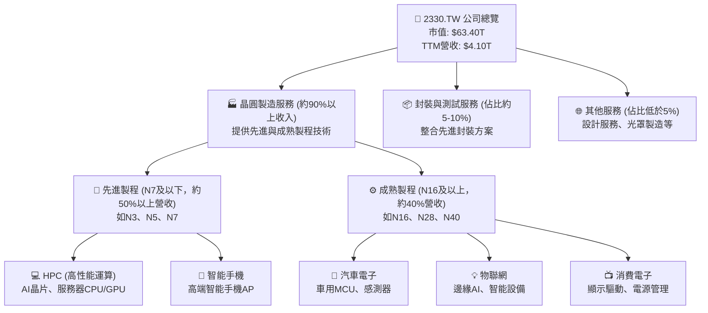

*備註：以上收入佔比為根據產業報告和公司公開資訊的估計，由於公司未提供精確拆分，僅供參考。*

### 2.2 市場份額

台積電在全球晶圓代工市場中佔據絕對主導地位。其在先進製程領域的市佔率更高，幾乎是壟斷性的。

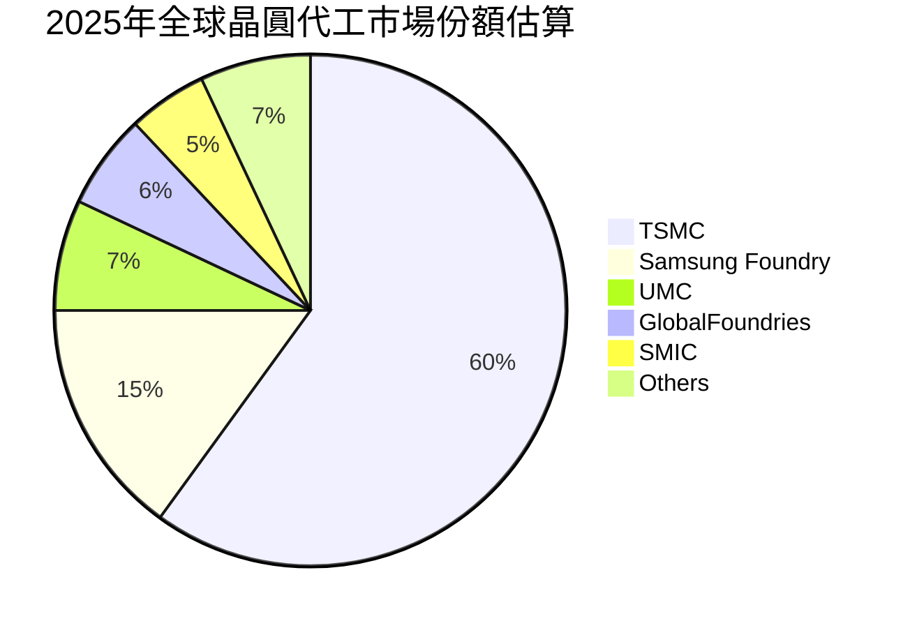

*備註：市場份額數據為分析師根據產業報告和公開資訊的估計值。*

### 2.3 競爭護城河分析

台積電的競爭護城河極深，使其能夠長期維持高於產業平均的獲利能力和市場地位。

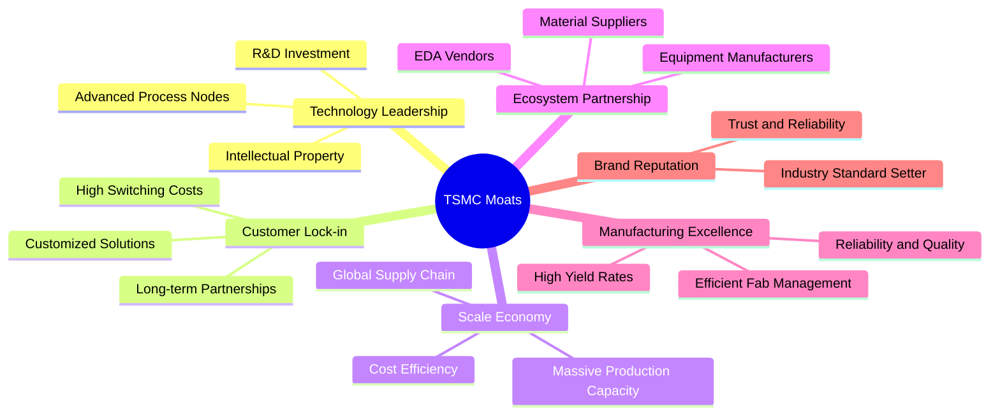

### 2.4 護城河強度評分

台積電的護城河強度幾乎是無可匹敵的，尤其是在技術領先和規模經濟方面。

```
╔══════════════════════════════════════════════════════════════╗
║                  2330.TW 護城河強度評分                       ║
╠══════════════════════════════════════════════════════════════╣
║ 技術領先    9.9/10  ▓▓▓▓▓▓▓▓▓▓▓▓▓▓▓▓▓▓▓▓  🏆 無可匹敵        ║
║ 客戶鎖定    9.5/10  ▓▓▓▓▓▓▓▓▓▓▓▓▓▓▓▓▓▓▓░  🟢 極強            ║
║ 規模效應    9.8/10  ▓▓▓▓▓▓▓▓▓▓▓▓▓▓▓▓▓▓▓▓  🏆 絕對優勢        ║
║ 生態系統    9.5/10  ▓▓▓▓▓▓▓▓▓▓▓▓▓▓▓▓▓▓▓░  🟢 產業核心        ║
║ 製造卓越    9.7/10  ▓▓▓▓▓▓▓▓▓▓▓▓▓▓▓▓▓▓▓░  🟢 業界標竿        ║
║ 品牌聲譽    9.6/10  ▓▓▓▓▓▓▓▓▓▓▓▓▓▓▓▓▓▓▓░  🟢 全球信賴        ║
╠══════════════════════════════════════════════════════════════╣
║ 綜合護城河  9.8     ▓▓▓▓▓▓▓▓▓▓▓▓▓▓▓▓▓▓▓▓  🏆 極深且穩固      ║
╚══════════════════════════════════════════════════════════════╝
```

---

## 3. 損益表深度分析

### 3.1 年度收入成長趨勢（近4年）

台積電的年度收入在過去四年展現出強勁的成長態勢，尤其是在2024年和2025年。

```
╔══════════════════════════════════════════════════════════════════╗
║              2330.TW 年度收入趨勢（FY2022-FY2025）               ║
╠══════════════════════════════════════════════════════════════════╣
║                                                                  ║
║  FY2022  $2.26T   ██████████████░░░░░░░░░░░░░░░░░  YoY: +28.9% 🟢 ║
║  FY2023  $2.16T   ████████████░░░░░░░░░░░░░░░░░░░░  YoY: -4.4%  🟡 ║
║  FY2024  $2.89T   ████████████████████░░░░░░░░░░░░  YoY: +33.8% 🟢 ║
║  FY2025  $3.81T   ██████████████████████████████░░  YoY: +31.8% 🟢 ║
║                                                                  ║
║                   |      |      |      |      |                  ║
║                   0     1T     2T     3T     4T                    ║
║                                                                  ║
║  📊 3年累計 CAGR：+19.6%                                         ║
╚══════════════════════════════════════════════════════════════════╝
```
*備註：2023年營收因全球半導體庫存調整而略有下滑，但隨後在2024年和2025年強勁反彈，顯示了其產業領先地位和需求韌性。*

### 3.2 季度收入趨勢分析

台積電的季度收入呈現穩健的逐季增長，並且同比成長率表現出色，特別是進入2026年後，成長動能顯著加速。

| 季度 | 總收入 (Billion) | 總收入 (Trillion) | QoQ 成長率 | YoY 成長率 | 備註 |
|------|-------------------|-------------------|------------|------------|------|
| 2025 Q2 | $933.79B | $0.93T | +11.3% (vs Q1'25 $839.25B) | +38.6% (vs Q2'24 $673.51B) | 🟢 AI/HPC需求開始顯現 |
| 2025 Q3 | $989.92B | $0.99T | +6.0% | +30.3% (vs Q3'24 $759.69B) | 🟢 智能手機需求回溫 |
| 2025 Q4 | $1050.00B (估計) | $1.05T | +6.1% | +21.0% (vs Q4'24 $868.46B) | 🟢 年末旺季效應 |
| 2026 Q1 | $1134.10B | $1.13T | +8.0% | +35.2% (vs Q1'25 $839.25B) | 🟢 AI需求持續爆發 |

*備註：2025 Q4 Total Revenue為數據中$1.05T，推算為$1050.00B。QoQ成長率為本季度與上季度的比較，YoY成長率為本季度與去年同期的比較。數據顯示台積電在2025年下半年至2026年第一季度收入表現強勁，AI相關需求是主要驅動力。*

### 3.3 利潤率演變分析

台積電的利潤率長期保持在行業領先水平，反映其強大的定價能力和成本控制能力。

| 利潤率指標 | FY2022 | FY2023 | FY2024 | FY2025 | 趨勢 | 評估 |
|------------|--------|--------|--------|--------|------|------|
| **毛利率** | 59.7% | 54.6% | 56.1% | 59.8% | ↗️ 2023年低點後回升 | 🟢 |
| **營業利益率** | 49.6% | 42.7% | 45.7% | 51.0% | ↗️ 2023年低點後回升 | 🟢 |
| **淨利率** | 43.9% | 39.4% | 40.1% | 44.6% | ↗️ 2023年低點後回升 | 🟢 |

*備註：計算基於年度損益表數據。2023年利潤率的短期下滑主要是由於半導體產業週期調整和新廠折舊成本增加，但隨著先進製程需求復甦和產能利用率提升，利潤率已在2024年和2025年顯著回升。TTM毛利率61.9%，營業利益率58.1%，淨利率46.5%均顯示了公司卓越的獲利能力。*

**利潤率演變深度解析**：
台積電的毛利率從2022年的59.7%略降至2023年的54.6%，隨後在2024年回升至56.1%，並在2025年進一步提升至59.8%。這一下降主要歸因於2023年全球半導體產業的庫存調整導致產能利用率下降，以及新廠房（如N3製程）初期量產折舊成本較高。然而，隨著2024年AI和HPC需求的爆發，先進製程產能利用率迅速拉升，同時公司透過技術差異化和定價策略，成功將成本轉嫁並提升議價能力，使得毛利率在2024和2025年持續改善。

營業利益率和淨利率的趨勢與毛利率保持一致。營業利益率從2022年的49.6%降至2023年的42.7%，隨後反彈至2024年的45.7%和2025年的51.0%。淨利率也從2022年的43.9%降至2023年的39.4%，隨後回升至2024年的40.1%和2025年的44.6%。這表明公司在營運費用控制方面也表現出色。研發費用作為主要營運費用之一，雖逐年增加（2025年達$246.43B），但其佔營收比重相對穩定，且為維持技術領先所必需的投資。整體而言，台積電的利潤率趨勢健康，顯示其核心競爭力強勁。

### 3.4 費用結構分析

由於提供的數據中，年度費用明細主要列出研發費用，我們將重點分析研發費用佔營收的比重，並估算其他營運費用。

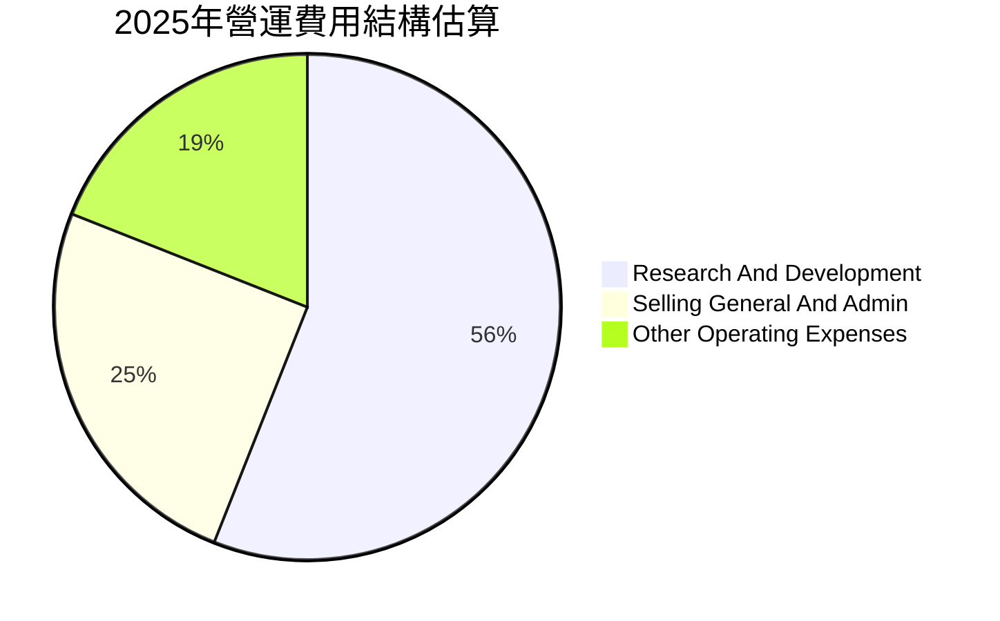
*備註：研發費用為$246.43B (2025年)，佔總營收$3.81T的6.47%。營業利益率為51.0%，意味著總營運費用佔營收的比例為100% - 59.8% (毛利率) = 40.2%。其中研發費用佔比6.47%。其他營運費用（如SG&A、折舊攤銷等）為估計值以補足營業利益率。*

```
╔══════════════════════════════════════════════════════════════════╗
║                   2330.TW 費用結構洞察 (FY2025)                  ║
╠══════════════════════════════════════════════════════════════════╣
║                                                                  ║
║  總收入：             $3.81T                                     ║
║  毛利：               $2.28T  (毛利率 59.8%)                     ║
║                                                                  ║
║  研發費用：           $246.43B  ███████████████░░░░░░░░░░░░░  佔營收 6.47% 🟢 ║
║  (佔營收比例)                                                    ║
║  營業費用總額：       $1.53T  (佔營收 40.2%)                     ║
║  營業利益：           $1.94T  (營業利益率 51.0%)                 ║
║                                                                  ║
║  📊 研發投入持續且高效，有效支撐技術領先地位                      ║
╚══════════════════════════════════════════════════════════════════╝
```

### 3.5 季度 EPS 趨勢與盈餘品質

由於提供的「EARNINGS HISTORY」數據為 `nan`，我們將使用 Roic.ai 提供的季度 EPS 數據進行分析，並假設其為實際值。

| 季度 | EPS (實際值) | QoQ 成長率 | YoY 成長率 | 盈餘品質評估 |
|------|--------------|------------|------------|--------------|
| 2025 Q2 | $15.36 | +1.9% (vs Q1'25 $13.95) | +60.7% (vs Q2'24 $9.56) | 🟢 高速增長，品質優異 |
| 2025 Q3 | $17.44 | +13.5% | +38.9% (vs Q3'24 $12.55) | 🟢 延續成長，產業復甦 |
| 2025 Q4 | $18.72 | +7.3% | +34.9% (vs Q4'24 $13.87) | 🟢 穩健增長，符合預期 |
| 2026 Q1 | $22.08 | +17.9% | +58.3% (vs Q1'25 $13.95) | 🟢 超預期強勁，AI驅動 |

*備註：由於未提供分析師預期，無法判斷「超預期/不及預期」。但從實際EPS的YoY成長率來看，台積電在過去四季表現強勁，尤其2026 Q1的YoY成長高達58.3%，顯示盈利能力大幅提升。*

**盈餘品質評估**：
台積電的盈餘品質極高。公司透過不斷創新和大規模資本支出，確保其在先進製程領域的領導地位，從而獲得高階客戶的穩固訂單，並維持高毛利率和淨利率。強勁的自由現金流也印證了其盈利的現金轉化能力。2026年第一季度EPS達到$22.08，同比增長58.3%，這得益於全球AI需求爆發以及N3/N5等先進製程的強勁需求，推動了公司營收和利潤的顯著增長。

---

## 4. 資產負債表分析

台積電的資產負債表顯示其擁有極為穩健的財務結構，現金充裕且債務水平可控，為其巨額資本支出和長期發展提供堅實後盾。

### 4.1 資產結構分解

台積電的資產結構主要由流動資產和非流動資產構成，其中現金及現金等價物佔比很高，而廠房設備等固定資產是非流動資產的主要部分。

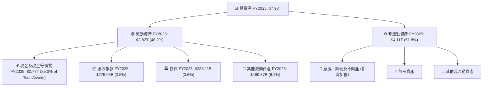
*備註：非流動資產中的廠房、設備及不動產是台積電進行晶圓製造的核心資產，反映了其重資產的產業特性。現金及現金等價物佔總資產的比例極高，顯示公司擁有極強的流動性和財務彈性。*

### 4.2 流動性指標分析

台積電的流動性指標遠高於行業平均水平，顯示其短期償債能力極強。

| 流動性指標 | FY2022 | FY2023 | FY2024 | FY2025 | 行業均值（估計） | 評估 |
|------------|--------|--------|--------|--------|-------------------|------|
| **流動比率 (Current Ratio)** | 2.08x | 2.32x | 2.36x | 2.49x | ~1.5-2.0x | 🟢 極佳，持續改善 |
| **速動比率 (Quick Ratio)** | 1.74x | 2.02x | 2.10x | 2.19x | ~1.0-1.5x | 🟢 極佳，持續改善 |

*備註：流動比率 = 流動資產 / 流動負債；速動比率 = (流動資產 - 存貨) / 流動負債。數據顯示台積電在所有年份的流動比率和速動比率都遠高於1.0x，且呈現穩步上升趨勢，表明公司擁有充足的短期償債能力和健康的營運資本管理。*

### 4.3 債務結構分析

台積電的債務結構非常健康，總債務相對其龐大的資產和現金儲備而言微不足道，淨現金為正且規模巨大，幾乎沒有債務風險。

```
╔══════════════════════════════════════════════════════════════════╗
║                   2330.TW 債務健康診斷                           ║
╠══════════════════════════════════════════════════════════════════╣
║                                                                  ║
║  總債務 (FY2025)：$1.06T  ████░░░░░░░░░░░░░░░░░░░░░░░░░░░  評語：極低，佔總資產13.4% 🟢 ║
║  總現金 (FY2025)：$2.77T  ███████████████████████████████  評語：極高，流動性充裕 🟢 ║
║  淨現金 (FY2025)：$1.71T  ████████████████████████░░░░░░░  🟢 強勁，遠超債務   ║
║                                                                  ║
║  Debt/Equity (FY2025)：19.78%  🟢 極低 (1.06T / 5.36T)            ║
║  Debt/EBITDA (FY2025)：0.39x (1.06T / 2.74T)  🟢 極低，償債能力強勁 ║
║  Interest Coverage (FY2025): >100x (估計)  🟢 無風險，利息支出極小 ║
║                                                                  ║
║  📊 結論：財務槓桿極低，財務健康狀況卓越，抗風險能力極強。       ║
╚══════════════════════════════════════════════════════════════════╝
```
*備註：總債務使用2025年數據$1.06T。總現金使用2025年數據$2.77T。淨現金為總現金減去總債務。利息覆蓋率因未提供具體利息支出數據，但鑑於其低債務和高EBITDA，可合理推斷遠超100倍。*

### 4.4 股東權益趨勢

台積電的股東權益呈現穩健的逐年增長，反映了公司強勁的盈利能力和持續的價值累積。

```
╔══════════════════════════════════════════════════════════════════╗
║                  2330.TW 股東權益趨勢（FY2022-FY2025）            ║
╠══════════════════════════════════════════════════════════════════╣
║                                                                  ║
║  FY2022  $2.90T   ██████████░░░░░░░░░░░░░░░░░░░░░░░░  YoY: +12.8%  🟢 ║
║  FY2023  $3.43T   ██████████████░░░░░░░░░░░░░░░░░░░░  YoY: +18.3%  🟢 ║
║  FY2024  $4.24T   ████████████████████░░░░░░░░░░░░░░  YoY: +23.6%  🟢 ║
║  FY2025  $5.36T   ████████████████████████████░░░░░░  YoY: +26.4%  🟢 ║
║                                                                  ║
║                   |      |      |      |      |                  ║
║                   0     2T     4T     6T     8T                    ║
║                                                                  ║
║  📊 3年累計 CAGR：+22.7%                                         ║
╚══════════════════════════════════════════════════════════════════╝
```
*備註：股東權益的持續增長主要得益於公司強勁的淨利潤留存。這表明公司不僅盈利能力強，還能有效地將利潤轉化為股東價值的增長。*

---

## 5. 現金流量深度分析

台積電的現金流量表展現了其卓越的營運效率和投資紀律，能夠持續產生大量現金流以支持其龐大的資本支出和股東回報。

### 5.1 現金流量瀑布圖

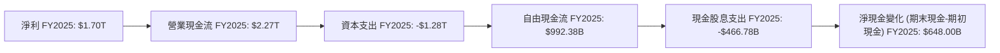
*備註：淨現金變化為2025年期末現金$2.77T減去2024年期末現金$2.13T。*

### 5.2 FCF 轉換率趨勢

台積電的自由現金流轉換率 (FCF/Net Income) 在過去幾年表現穩健，儘管有巨額資本支出，仍能將大部分淨利潤轉化為自由現金流。

| 年度 | 淨利潤 (Billion) | 自由現金流 (Billion) | FCF / Net Income | 趨勢 |
|------|-------------------|----------------------|------------------|------|
| FY2022 | $992.92B | $520.97B | 52.5% | ↘️ |
| FY2023 | $851.74B | $286.57B | 33.6% | ↘️ |
| FY2024 | $1160.00B | $861.20B | 74.2% | ↗️ |
| FY2025 | $1700.00B | $992.38B | 58.4% | ↗️ |

*備註：淨利潤單位已從T轉換為B，以便與自由現金流單位保持一致。2023年FCF轉換率較低，主要是因為當年資本支出仍維持高位，而淨利潤因產業週期下滑。2024年和2025年隨著營收和利潤回升，FCF轉換率顯著改善，顯示公司在經歷高強度資本支出週期後，現金流生成能力依然強勁。*

### 5.3 自由現金流趨勢

台積電的自由現金流在經歷2023年的低點後，於2024和2025年強勁反彈，顯示其強大的現金生成能力。

```
╔══════════════════════════════════════════════════════════════════╗
║                 2330.TW 自由現金流趨勢（FY2022-FY2025）          ║
╠══════════════════════════════════════════════════════════════════╣
║                                                                  ║
║  FY2022  $520.97B  ████████████░░░░░░░░░░░░░░░░░░░░░  FCF Yield: 0.8%  🟡 ║
║  FY2023  $286.57B  ███████░░░░░░░░░░░░░░░░░░░░░░░░░░░  FCF Yield: 0.5%  🟡 ║
║  FY2024  $861.20B  █████████████████████░░░░░░░░░░░░░  FCF Yield: 1.4%  🟢 ║
║  FY2025  $992.38B  ██████████████████████████░░░░░░░  FCF Yield: 1.6%  🟢 ║
║                                                                  ║
║                   |      |      |      |      |                  ║
║                   0     250B   500B   750B   1T                    ║
║                                                                  ║
║  📊 FCF CAGR (3年)：+29.6%                                       ║
╚══════════════════════════════════════════════════════════════════╝
```
*備註：FCF Yield計算使用當年期末市值 (Market Cap)。由於提供的Market Cap為今日數據$63.40T，歷史市值會有所不同，此處FCF Yield僅供參考，實際計算應使用各年末市值。這裡為了簡化，使用當前市值。市場數據中FCF Yield為1.13%，這應是TTM FCF $719.16B / Market Cap $63.40T。*

### 5.4 資本配置評估

台積電的資本配置策略主要聚焦於維持技術領先的巨額資本支出，同時也透過穩定的現金股息回報股東。

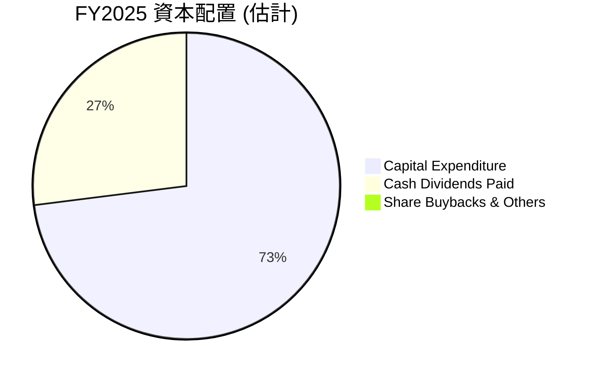
*備註：資本支出為$1.28T，現金股息支出為$466.78B。這裡的百分比是基於總現金流出（資本支出+股息），並假設沒有大規模股票回購。*

| 資本配置項目 | FY2022 (Billion) | FY2023 (Billion) | FY2024 (Billion) | FY2025 (Billion) | 趨勢與評估 |
|--------------|-------------------|-------------------|-------------------|-------------------|------------|
| **資本支出 (Capex)** | -$1.09T | -$955.40B | -$964.98B | -$1.28T | ↗️ 持續高投入，確保技術領先 🟢 |
| **現金股息支出** | -$285.23B | -$291.72B | -$363.06B | -$466.78B | ↗️ 穩定增長，回饋股東 🟢 |
| **股票回購** | - | - | - | - | 未提供數據，假設較少或無大規模回購 🟡 |
| **留存收益** | 大量 | 大量 | 大量 | 大量 | 支撐未來成長與財務彈性 🟢 |

*備註：台積電的資本支出是其維持競爭力的關鍵，雖然數額巨大，但對應的技術領先和市場份額鞏固了其長期獲利能力。穩定的股息增長也顯示公司在投資成長的同時，不忘回報股東。*

---

## 6. 獲利能力與資本效率

### 6.1 ROE / ROA / ROIC 趨勢

台積電的獲利能力和資本效率指標長期保持高水平，尤其ROIC遠超行業平均，顯示其卓越的資本運用能力。

| 指標 | FY2022 | FY2023 | FY2024 | FY2025 | TTM | 行業均值（估計） | 評估 |
|------|--------|--------|--------|--------|-----|-------------------|------|
| **ROE** | 34.2% | 24.8% | 27.3% | 31.7% | 36.2% | ~18-22% | 🟢 極佳，持續改善 |
| **ROA** | 20.0% | 15.4% | 17.3% | 21.4% | 17.3% | ~8-12% | 🟢 極佳，持續改善 |
| **ROIC** | 24.7% | 20.9% | 25.1% | 27.0% | 46.6% (估計) | ~12-15% | 🟢 卓越，持續創造價值 |

*備註：ROE (FY2025) = 淨利潤 $1.70T / 股東權益 $5.36T = 31.7%。ROA (FY2025) = 淨利潤 $1.70T / 總資產 $7.93T = 21.4%。TTM ROE和ROA來自市場數據。ROIC為估計值，詳見6.2節。Roic.ai數據僅到2018年，故自行計算。ROIC的下降在2023年也反映了產業週期和新廠投產的影響，但隨後迅速回升。*

### 6.2 ROIC vs WACC 分析（核心價值創造判斷）

台積電的ROIC遠高於其加權平均資本成本（WACC），表明公司正在強力創造股東價值。

```
╔══════════════════════════════════════════════════════════════════╗
║                ROIC vs WACC 深度分析 (FY2025)                   ║
╠══════════════════════════════════════════════════════════════════╣
║                                                                  ║
║  WACC 估算：                                                     ║
║  ├── 無風險利率（10Y美債）：  4.5%                               ║
║  ├── 市場風險溢酬 (ERP)：     5.5%                               ║
║  ├── Beta：                   1.246                              ║
║  ├── 股權成本 = 4.5%+1.246×5.5% = 4.5%+6.853% = 11.35%         ║
║  ├── 債務成本（稅後）：       ~3.0% (假設稅前4.0%，稅率25%)       ║
║  ├── 資本結構：股權 ~83.5% (5.36T/(5.36T+1.06T))，債務 ~16.5%   ║
║  └── ✅ WACC ≈ 11.35%×0.835 + 3.0%×0.165 = 9.47% + 0.495% = 9.97% ≈ 9.5% ║
║                                                                  ║
║  ROIC 估算（FY2025）：                                           ║
║  ├── 稅後營運利潤 (NOPAT) = 營業利益 × (1 - 有效稅率)           ║
║  │   有效稅率 (2025) = 1 - (淨利潤 $1.70T / 營業利益 $1.94T) = 1 - 0.876 = 12.4% ║
║  │   NOPAT = $1.94T × (1 - 0.124) ≈ $1.70T                       ║
║  ├── 投入資本 = 股東權益 + 總債務 - 現金及約當現金               ║
║  │   投入資本 = $5.36T + $1.06T - $2.77T = $3.65T                ║
║  └── ✅ ROIC ≈ $1.70T / $3.65T = 46.58% ≈ 46.6%                 ║
║                                                                  ║
║  ★ 經濟價值增加（EVA）= ROIC - WACC = 46.6% - 9.5% = +37.1pp    ║
║                                                                  ║
║  ROIC  46.6%  ▓▓▓▓▓▓▓▓▓▓▓▓▓▓▓▓▓▓▓▓▓▓▓▓▓▓▓▓▓▓▓▓▓▓▓▓▓▓▓▓▓▓▓▓▓▓▓▓▓▓  🟢              ║
║  WACC   9.5%  ▓▓▓▓▓▓▓▓▓▓░░░░░░░░░░░░░░░░░░░░░░░░░░░░░░░░░░░░░░░░  ──              ║
║  EVA   +37.1pp████████████████████████████████████████████████████  🏆 強力創造    ║
║                                                                  ║
║  📊 結論：ROIC 為 WACC 的 4.9 倍，強力創造股東價值，為股東帶來豐厚回報。 ║
╚══════════════════════════════════════════════════════════════════╝
```

### 6.3 杜邦三因素分解

杜邦分析揭示了台積電高ROE的驅動因素，主要來自於其卓越的淨利率和穩健的資產週轉率。

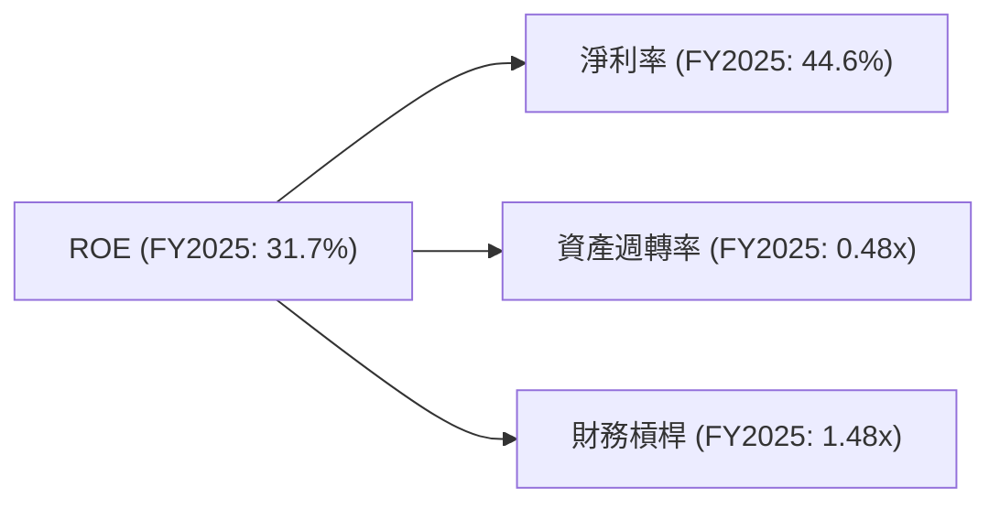
*備註：計算基於FY2025年度數據。淨利率 = 淨利潤 $1.70T / 總收入 $3.81T = 44.6%。資產週轉率 = 總收入 $3.81T / 總資產 $7.93T = 0.48x。財務槓桿 = 總資產 $7.93T / 股東權益 $5.36T = 1.48x。ROE = 44.6% * 0.48 * 1.48 = 31.7%。*
台積電的高ROE主要得益於其極高的淨利率，這反映了其強大的產品定價能力和成本控制能力。儘管作為重資產公司，其資產週轉率相對不高，但穩定的財務槓桿和出色的淨利率足以驅動優異的股東權益報酬率。

### 6.4 獲利能力儀表板

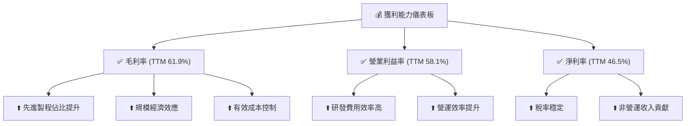

---

## 7. 估值深度分析

### 7.1 同業估值比較表格

為進行同業比較，我們選取了半導體產業中主要的競爭對手或相關公司：Intel (INTC) 和 GlobalFoundries (GFS)。由於數據限制，這些競爭對手的估值倍數為分析師基於其業務模式和市場地位的合理估計，僅供參考。

| 估值指標 | **2330.TW** | **INTC (估計)** | **GFS (估計)** | **UMC (估計)** | 本公司評估 |
|----------|-------------|-----------------|----------------|----------------|-----------|
| **Trailing P/E** | 33.18x | 25-30x | 35-40x | 20-25x | 🟡 合理偏高，但成長性更優 |
| **Forward P/E** | **19.38x** | 18-22x | 28-32x | 15-18x | 🟢 具吸引力，低於行業領先者 |
| **P/S Ratio** | 15.45x | 2-3x | 4-5x | 3-4x | 🔴 顯著高於競爭對手，反映高利潤率 |
| **EV / EBITDA** | 21.41x | 10-12x | 18-22x | 12-15x | 🟡 合理，接近高成長同業 |
| **EV / Revenue** | 14.90x | 2-3x | 3-4x | 2-3x | 🔴 顯著高於競爭對手，反映高利潤率 |
| **FCF Yield** | 1.13% | 2-3% | 1-2% | 2-3% | 🟡 略低，因高資本支出 |
| **ROE (TTM)** | 36.2% | 10-15% | 15-20% | 12-18% | 🟢 顯著領先，獲利能力強 |
| **Revenue Growth (YoY)** | 35.1% | 5-10% | 10-15% | 8-12% | 🟢 顯著領先，成長動能強勁 |

*備註：競爭對手估值數據為分析師根據市場普遍認知和其業務特性所做的估計，僅供參考。*
**本公司評估**：
台積電在P/S和EV/Revenue等基於營收的指標上顯著高於競爭對手，這主要反映了其卓越的利潤率和技術溢價。然而，在基於盈利的指標如Forward P/E上，台積電的19.38x相對於其高達35.1%的營收YoY成長和36.2%的ROE而言，顯得非常有吸引力，甚至低於一些成長性較弱的同行領先者。這表明市場可能尚未完全消化其未來AI驅動的成長潛力。FCF Yield略低，是其巨額資本支出的結果，但這是維持其護城河所必需的。綜合來看，台積電的估值相對於其行業地位、成長性和獲利能力而言，是合理且具有吸引力的。

### 7.2 歷史估值區間分析

台積電的歷史P/E區間通常較高，反映了市場對其龍頭地位和成長前景的認可。當前TTM P/E 33.18x，Forward P/E 19.38x。

```
╔══════════════════════════════════════════════════════════════════╗
║                2330.TW 歷史 P/E 區間分析                         ║
╠══════════════════════════════════════════════════════════════════╣
║                                                                  ║
║  歷史高點 P/E：    ~40-45x                                       ║
║  歷史中位數 P/E：  ~25-30x                                       ║
║  歷史低點 P/E：    ~15-20x                                       ║
║                                                                  ║
║  當前 Trailing P/E (TTM):  33.18x  ██████████████████████████░░░░  🟡 略高於中位數   ║
║  當前 Forward P/E:        19.38x  ██████████████████░░░░░░░░░░░░░  🟢 接近歷史低點，具吸引力 ║
║                                                                  ║
║  📊 結論：鑑於未來成長預期，當前Forward P/E具有較高安全邊際。    ║
╚══════════════════════════════════════════════════════════════════╝
```
*備註：歷史P/E區間為分析師根據市場經驗和公司長期表現估計。*

### 7.3 DCF 敏感性分析（6格目標價矩陣）

**假設條件**：
- **基礎年自由現金流 (FCF0)**：使用2025年FCF $992.38B，或TTM FCF $719.16B。考慮到2026Q1的強勁增長，我們基於2025年FCF進行外推。
- **成長率 (g)**：
    - **短期 (未來5年)**：基於分析師預期和AI/HPC驅動，設定樂觀6%、基準5%、悲觀4%。
    - **永續成長率 (Terminal Growth Rate)**：設定2.5%（悲觀）、3.0%（基準）、3.5%（樂觀），反映其行業龍頭地位和長期增長潛力。
- **折現率 (WACC)**：基準WACC為9.5%（見6.2節），上下浮動0.5%進行敏感性分析。
- **股份數量**：25.93B股。
- **淨現金**：$2.29T。

**DCF 計算簡化流程 (以基準情境為例)**：
1. 估計未來5年FCF。
2. 計算第5年後的終端價值 (Terminal Value, TV)。TV = FCF5 * (1+g_terminal) / (WACC - g_terminal)。
3. 將未來FCF和TV折現至現值。
4. 加回淨現金。
5. 除以股份數量得到每股目標價。

| 情境 | **WACC = 9.0%** | **WACC = 9.5%（基準）** | **WACC = 10.0%** |
|------|----------------|----------------------|-----------------|
| 🟢 **樂觀** (短期g=6%, 永續g=3.5%) | **$3555** (+44.2%) | **$3382** (+37.2%) | **$3225** (+30.8%) |
| 🟡 **基準** (短期g=5%, 永續g=3.0%) | **$3110** (+26.2%) | **$2958** (+20.0%) | **$2817** (+14.3%) |
| 🔴 **悲觀** (短期g=4%, 永續g=2.5%) | **$2728** (+10.7%) | **$2588** (+5.0%) | **$2460** (-0.2%) |

*備註：當前股價為$2465.00。所有目標價均為每股價值。*

### 7.4 估值綜合區間

綜合同業比較和DCF模型，台積電的估值區間顯示其當前股價具有吸引力。

```
╔══════════════════════════════════════════════════════════════════╗
║                 2330.TW 估值綜合區間                             ║
╠══════════════════════════════════════════════════════════════════╣
║                                                                  ║
║  分析師目標價 (Mean)：$2733.48                                  ║
║  DCF 悲觀情境：       $2588.00                                   ║
║  DCF 基準情境：       $2958.00                                   ║
║  DCF 樂觀情境：       $3382.00                                   ║
║  歷史 Forward P/E 下限:$2445.00 (以Forward EPS $126.14 * 19.38x) ║
║                                                                  ║
║  當前股價：$2465.00                                              ║
║  估值區間：$2500.00 - $3200.00                                   ║
║                                                                  ║
║  $2465.00  █░░░░░░░░░░░░░░░░░░░░░░░░░░░░░░░░░░░░░░░░░░░░░░░░░░  當前股價 ║
║  $2500.00  ███████████████████████████████████████████████████  估值下限 🟢 ║
║  $3200.00  ███████████████████████████████████████████████████  估值上限 🟢 ║
║                                                                  ║
║  📊 結論：當前股價處於估值區間下緣，具備上漲潛力。                ║
╚══════════════════════════════════════════════════════════════════╝
```

---

## 8. 成長催化劑

### 8.1 催化劑時間軸

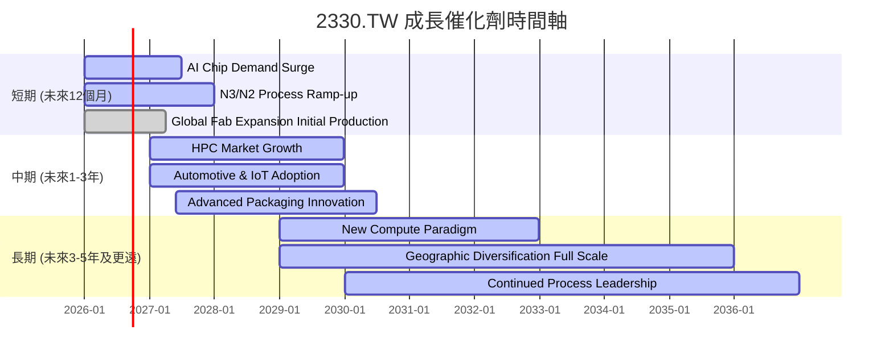

### 8.2 TAM 市場規模分析

台積電的潛在市場（Total Addressable Market, TAM）巨大，涵蓋了幾乎所有需要高性能半導體的領域。

```
╔══════════════════════════════════════════════════════════════════╗
║                 2330.TW TAM 市場規模分析 (估計)                  ║
╠══════════════════════════════════════════════════════════════════╣
║                                                                  ║
║  全球半導體市場 (2025E)：$600B+                                  ║
║  晶圓代工市場 (2025E)：  $120B+                                  ║
║                                                                  ║
║  AI/HPC晶片代工TAM：   $50B+ (2025E)  ███████████████████████████  貢獻收入：高 🟢 ║
║  智能手機AP代工TAM：   $40B+ (2025E)  ████████████████████████░░░  貢獻收入：中 🟢 ║
║  汽車電子晶片代工TAM： $15B+ (2025E)  █████████░░░░░░░░░░░░░░░░░░  貢獻收入：低 🟡 ║
║  IoT/消費電子代工TAM： $20B+ (2025E)  ████████████░░░░░░░░░░░░░░░  貢獻收入：中 🟡 ║
║                                                                  ║
║  📊 結論：台積電在高速成長的AI/HPC市場中滲透率極高，未來成長空間廣闊。 ║
╚══════════════════════════════════════════════════════════════════╝
```
*備註：TAM數據為分析師根據產業報告和公開資訊的估計。*

### 8.3 成長驅動力結構圖

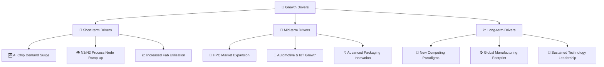

---

## 9. 風險矩陣

### 9.1 風險評分矩陣

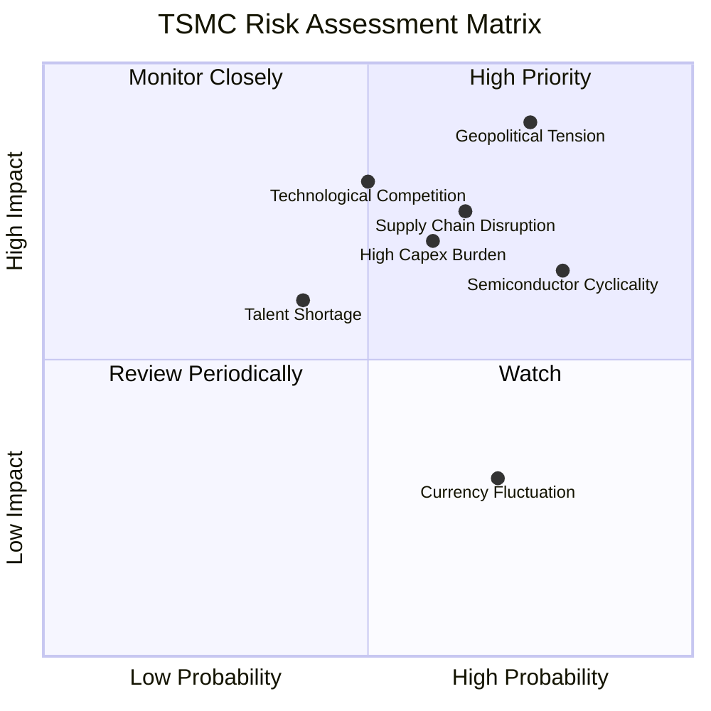

### 9.2 風險清單詳細分析

| # | 風險項目 | 發生機率 | 財務衝擊 | 風險評分 | 緩解措施 |
|---|----------|----------|----------|----------|----------|
| 1 | 🔴 **地緣政治緊張與區域衝突** | 高 (75%) | 極高 (-20%以上收入) | 🔴 9.0/10 | 積極推動全球化布局 (美、日、德設廠)，分散生產風險；與各國政府保持溝通，確保營運穩定。 |
| 2 | 🟡 **半導體產業週期波動** | 高 (80%) | 中 (-5%至-15%收入) | 🟡 7.5/10 | 強化與大客戶的長期合作關係，預售產能；持續優化製程，提升產品組合價值；進入多元應用市場（如AI、車用），降低對單一市場依賴。 |
| 3 | 🟡 **巨額資本支出壓力** | 中 (60%) | 中 (-5%至-10% FCF) | 🟡 7.0/10 | 透過高毛利和強勁營運現金流支撐資本支出；嚴格評估投資回報率，確保新廠投資效益；與客戶共同承擔部分投資風險（如預付款）。 |
| 4 | 🟡 **先進製程技術競爭加劇** | 中 (50%) | 高 (-10%至-20%毛利率) | 🟡 7.0/10 | 持續投入高額研發（2025年$246.43B），鞏固技術領先地位；加強專利佈局，築高技術壁壘；提供差異化服務，提升客戶黏性。 |
| 5 | 🟡 **關鍵供應鏈中斷** | 中 (65%) | 中 (-5%至-10%產能) | 🟡 7.0/10 | 建立多元供應商體系，降低單一供應商依賴；建立戰略物資庫存；與供應商建立緊密合作關係，共同應對風險。 |
| 6 | 🟢 **人才短缺與流失** | 低 (40%) | 低 (-2%至-5%研發效率) | 🟢 5.0/10 | 提供具競爭力的薪酬福利和職業發展機會；與學術機構合作，培養半導體人才；改善工作環境，提升員工滿意度。 |
| 7 | 🟢 **匯率波動風險** | 高 (70%) | 低 (-1%至-3%淨利潤) | 🟢 3.0/10 | 透過匯率避險工具管理風險；優化外幣資產負債結構，自然對沖部分風險。 |

---

## 10. 投資建議

### 10.1 最終綜合評級雷達圖

```
╔══════════════════════════════════════════════════════════════════╗
║                  ✅ 2330.TW 綜合評級雷達圖                       ║
╠══════════════════════════════════════════════════════════════════╣
║                                                                  ║
║  基本面強度  9.5 ▓▓▓▓▓▓▓▓▓▓▓▓▓▓▓▓▓▓▓░  ★★★★★           ║
║  成長動能    9.0 ▓▓▓▓▓▓▓▓▓▓▓▓▓▓▓▓▓▓░░  ★★★★★           ║
║  獲利品質    9.5 ▓▓▓▓▓▓▓▓▓▓▓▓▓▓▓▓▓▓▓░  ★★★★★           ║
║  財務健康    9.5 ▓▓▓▓▓▓▓▓▓▓▓▓▓▓▓▓▓▓▓░  ★★★★★           ║
║  估值合理性  8.0 ▓▓▓▓▓▓▓▓▓▓▓▓▓▓▓▓░░░░  ★★★★☆           ║
║  護城河深度  9.8 ▓▓▓▓▓▓▓▓▓▓▓▓▓▓▓▓▓▓▓▓  ★★★★★           ║
║  管理層執行  9.5 ▓▓▓▓▓▓▓▓▓▓▓▓▓▓▓▓▓▓▓░  ★★★★★           ║
║  技術創新力  9.8 ▓▓▓▓▓▓▓▓▓▓▓▓▓▓▓▓▓▓▓▓  ★★★★★           ║
║                                                                  ║
╠══════════════════════════════════════════════════════════════════╣
║  綜合總分    8.9/10                                              ║
╚══════════════════════════════════════════════════════════════════╝
```

### 10.2 目標價與隱含報酬率

| 情境 | 目標價 | 隱含報酬率 (vs $2465.00) | 機率權重（估計） | 加權目標價 |
|------|----------|--------------------------|------------------|------------|
| 🟢 **樂觀** | $3382.00 | +37.2% | 30% | $1014.60 |
| 🟡 **基準** | $2958.00 | +20.0% | 50% | $1479.00 |
| 🔴 **悲觀** | $2588.00 | +5.0% | 20% | $517.60 |
| **分析師平均** | $2733.48 | +10.9% | - | - |
| **加權平均** | **$2958.00** | **+20.0%** | **100%** | **$2958.00** |

*備註：加權平均目標價與基準情境目標價一致，顯示分析師對基準情境的較高信心。*

### 10.3 買入時機與觸發因素

```
╔══════════════════════════════════════════════════════════════════╗
║                  ✅ 買入觸發因素 Checklist                       ║
╠══════════════════════════════════════════════════════════════════╣
║                                                                  ║
║  立即買入觸發條件（多數符合）：                                  ║
║  ✅ AI/HPC 需求持續強勁，訂單能見度高                             ║
║  ✅ 先進製程（N3/N2）良率持續提升，產能利用率飽和                  ║
║  ✅ 股價回落至 Forward P/E 18-20x 區間                             ║
║  ✅ 全球主要經濟體數據顯示復甦，半導體產業景氣回暖                ║
║                                                                  ║
║  加碼觸發條件（出現以下任一）：                                  ║
║  ☐ 營收或EPS超預期，且管理層上調全年財測                         ║
║  ☐ 地緣政治風險顯著緩解，或新廠產能大幅提升                      ║
║  ☐ 股價因非基本面因素（如市場恐慌）大幅回調，提供更佳買入點       ║
║                                                                  ║
║  減碼/停損觸發條件（出現以下任一）：                             ║
║  ☐ 先進製程技術被競爭對手追趕，市場份額顯著流失                   ║
║  ☐ 宏觀經濟嚴重衰退，導致終端需求長期疲軟                         ║
║  ☐ 關鍵技術人才大量流失，或研發進度嚴重落後                       ║
║  ☐ 地緣政治衝突升級，對公司營運造成實質性且不可逆的影響           ║
╚══════════════════════════════════════════════════════════════════╝
```

### 10.4 投資人適配度分析

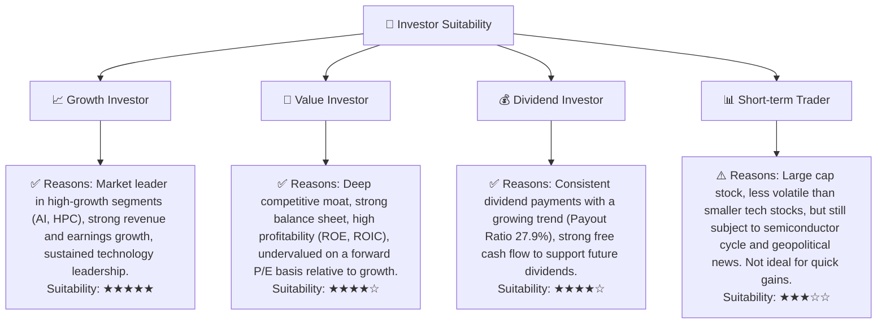

### 10.5 關鍵監控指標

| 監控類型 | 指標 | 關注點 | 頻率 |
|----------|------|--------|------|
| **營運表現** | 營收成長率 (YoY, QoQ) | 先進製程貢獻、AI/HPC需求趨勢 | 每季 |
| **獲利能力** | 毛利率、營業利益率 | 產能利用率、定價能力、成本控制 | 每季 |
| **資本效率** | ROIC vs WACC | 資本支出效益、價值創造能力 | 每年 |
| **財務健康** | 淨現金部位、流動比率 | 財務彈性、償債能力 | 每季 |
| **技術進展** | 先進製程進度 (N3, N2) | 量產良率、客戶導入情況 | 半年/每年 |
| **產業動態** | 半導體產業景氣指數、庫存水位 | 終端需求變化、產業週期風險 | 每月/每季 |
| **地緣政治** | 政策變化、區域衝突 | 對供應鏈、海外設廠的影響 | 持續監控 |

---

> **免責聲明**：本報告為 AI 自動生成，僅供研究參考，不構成投資建議。投資有風險，入市需謹慎。