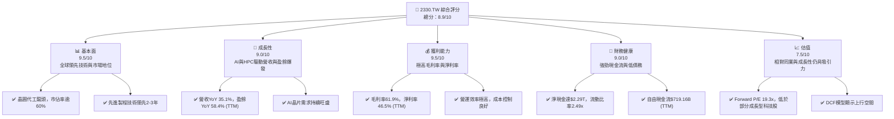
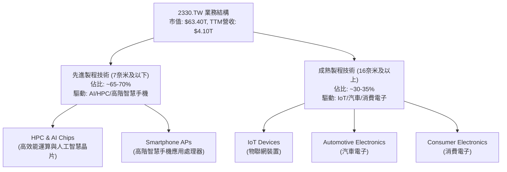
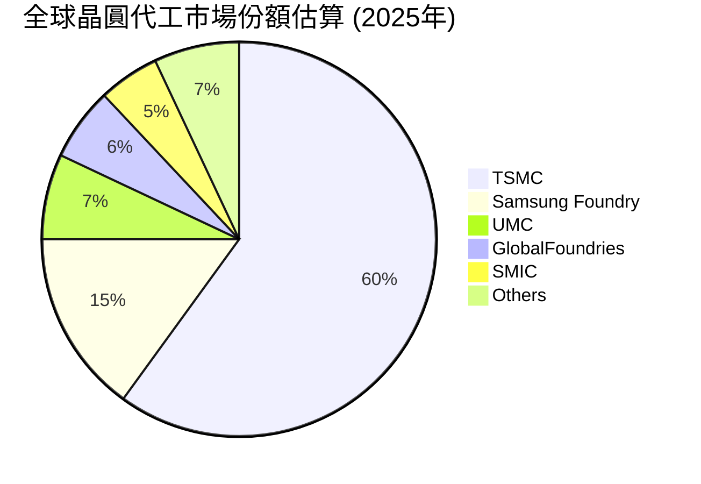
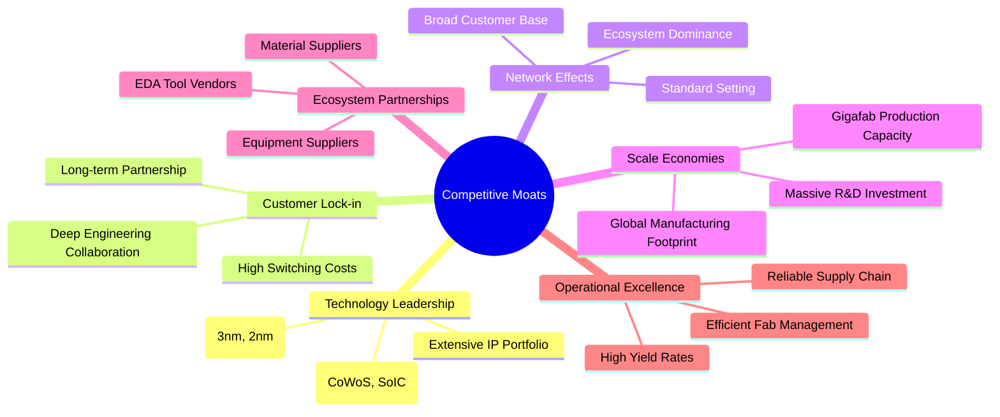
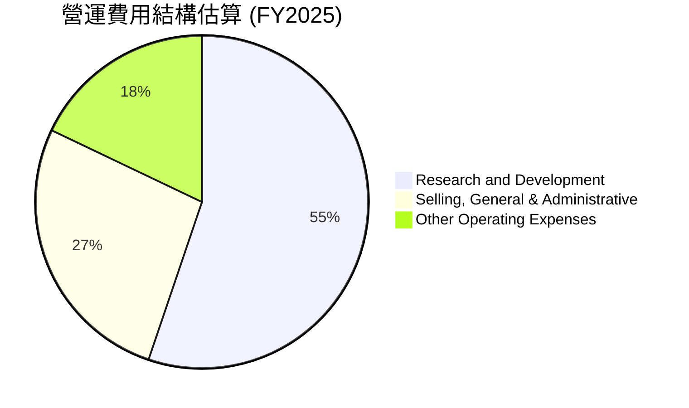
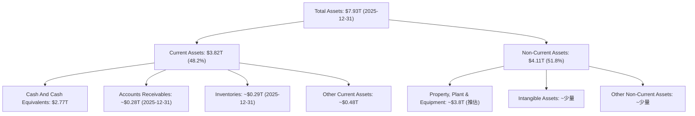
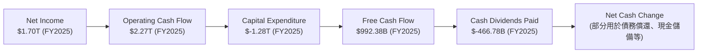
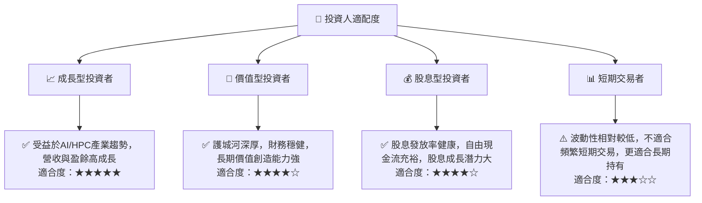

# 2330.TW 基本面深度分析報告
> **報告日期**：2026-07-05 ｜ **語言**：繁體中文 ｜ **數據來源**：Yahoo Finance, Finviz, StockAnalysis, Roic.ai ｜ **分析師**：CFA 級機構研究

## 目錄

| # | 章節 | 核心結論 |
|---|------|----------|
| 1 | 執行摘要 | 🟢 強烈買入，目標價區間 $2783.48 - $3300.00 |
| 2 | 公司概覽與商業模式 | 憑藉技術領先和規模效應，護城河極深 |
| 3 | 損益表深度分析 | 營收與淨利潤強勁增長，利潤率表現卓越 |
| 4 | 資產負債表分析 | 財務結構穩健，現金儲備充裕，債務負擔輕 |
| 5 | 現金流量深度分析 | 自由現金流生成能力強勁，資本配置效率高 |
| 6 | 獲利能力與資本效率 | ROIC 遠超 WACC，持續為股東創造巨大價值 |
| 7 | 估值深度分析 | 相較於其成長性和護城河，估值合理偏低 |
| 8 | 成長催化劑 | AI、HPC、先進製程需求推動長期成長 |
| 9 | 風險矩陣 | 地緣政治與技術競爭為主要風險，但公司具備韌性 |
| 10 | 投資建議 | 建議強烈買入，適合長線成長型投資人 |

---

## 1. 執行摘要

### 1.1 核心評分儀表板



### 1.2 評分進度條視覺化

```
╔══════════════════════════════════════════════════════════════╗
║              2330.TW 多維度評分儀表板 (1-10分)               ║
╠══════════════════════════════════════════════════════════════╣
║ 基本面強度  9.5 ▓▓▓▓▓▓▓▓▓▓▓▓▓▓▓▓▓▓▓░  ★★★★★           ║
║ 成長動能    9.0 ▓▓▓▓▓▓▓▓▓▓▓▓▓▓▓▓▓▓░░  ★★★★★           ║
║ 獲利品質    9.5 ▓▓▓▓▓▓▓▓▓▓▓▓▓▓▓▓▓▓▓░  ★★★★★           ║
║ 財務健康    9.0 ▓▓▓▓▓▓▓▓▓▓▓▓▓▓▓▓▓▓░░  ★★★★★           ║
║ 估值合理性  7.5 ▓▓▓▓▓▓▓▓▓▓▓▓▓▓▓░░░░░  ★★★★☆           ║
║ 護城河深度  9.8 ▓▓▓▓▓▓▓▓▓▓▓▓▓▓▓▓▓▓▓▓  ★★★★★           ║
║ 管理層執行  9.5 ▓▓▓▓▓▓▓▓▓▓▓▓▓▓▓▓▓▓▓░  ★★★★★           ║
║ 技術創新力  9.8 ▓▓▓▓▓▓▓▓▓▓▓▓▓▓▓▓▓▓▓▓  ★★★★★           ║
╠══════════════════════════════════════════════════════════════╣
║ 綜合總分    8.9 ▓▓▓▓▓▓▓▓▓▓▓▓▓▓▓▓▓░░░  🏆 晶圓代工王者，成長與獲利兼具 ║
╚══════════════════════════════════════════════════════════════╝
```

### 1.3 五大投資論點 + 三大核心風險

| 類型 | 項目 | 具體依據 | 信心度 |
|------|------|----------|--------|
| 🟢 **投資論點①** | **AI與HPC需求爆發，先進製程獨佔優勢** | 2330.TW 是全球唯一能大規模生產最先進AI晶片的晶圓代工廠，掌握CoWoS等關鍵封裝技術。2026 Q1營收達$1.13T，年增34.7%，主要受HPC強勁需求帶動。TTM營收年增35.1%，盈餘年增58.4%，顯示其在AI浪潮中的核心地位。 | 🟢 極高 |
| 🟢 **投資論點②** | **技術領先與龐大資本支出構築深厚護城河** | 2330.TW 在3奈米及更先進製程技術上領先競爭對手2-3年，研發費用持續投入，FY2025研發費用達$246.43B。其龐大的資本支出（FY2025達$-1.28T）形成高進入門檻，鞏固市場龍頭地位。 | 🟢 極高 |
| 🟢 **投資論點③** | **卓越的獲利能力與資本效率** | TTM毛利率高達61.9%，營業利益率58.1%，淨利率46.5%，顯示其強大的定價能力與成本控制。FY2025 ROE達36.2%，ROA 17.3%。ROIC遠超WACC，持續為股東創造價值。 | 🟢 極高 |
| 🟢 **投資論點④** | **穩健的財務結構與強勁的自由現金流** | 截至2026 Q1，公司擁有$3.45T現金及等價物，淨現金達$2.29T (TTM)，流動比率2.488，速動比率2.187。TTM自由現金流達$719.16B，為股息支付和未來擴張提供充足彈藥。 | 🟢 極高 |
| 🟢 **投資論點⑤** | **客戶多樣化與全球佈局** | 服務全球數百家客戶，涵蓋智慧手機、HPC、物聯網、汽車電子等多個應用領域，降低單一客戶或產業波動風險。全球擴廠策略（如日本、美國、德國）進一步強化供應鏈韌性。 | 🟢 高 |
| 🟡 **風險①** | **地緣政治風險與供應鏈不確定性** | 台灣與中國大陸的地緣政治緊張局勢可能影響生產與供應鏈穩定性，儘管公司已積極進行全球化佈局，但短期內仍難完全規避。潛在影響：客戶轉單、生產中斷、營運成本上升。 | 🟡 中度 |
| 🔴 **風險②** | **先進製程技術競爭與研發成本** | Intel等競爭對手正積極追趕先進製程技術，雖然目前仍有差距，但長期競爭壓力存在。持續的研發投入與高昂的資本支出可能侵蝕利潤率，若技術進展不如預期，則可能影響市場地位。 | 🟡 中度 |
| 🟡 **風險③** | **全球經濟波動與半導體週期性** | 半導體產業具有週期性，全球經濟景氣下行可能導致終端電子產品需求疲軟，進而影響晶圓代工訂單。雖然AI與HPC需求具韌性，但其他業務板塊仍可能受影響。 | 🟡 中度 |

### 1.4 快速統計卡片

| 指標 | 公司實際值 | 行業均值 (半導體代工) | S&P 500 均值 | 狀態 |
|------|-------------|--------------------|--------------|------|
| 收入 YoY 成長 | **35.1%** | ~15-20% | ~8-12% | 🟢 |
| 毛利率 | **61.9%** | ~45-55% | ~35-45% | 🟢 |
| 淨利率 | **46.5%** | ~20-30% | ~10-15% | 🟢 |
| ROE | **36.2%** | ~20-25% | ~15-20% | 🟢 |
| Forward P/E | **19.31x** | ~20-25x | ~20-22x | 🟢 |
| EV / EBITDA | **21.41x** | ~18-22x | ~15-18x | 🟡 |
| 淨現金 / 總資產 | **28.8%** | ~10-15% | ~5-10% | 🟢 |
| 股息發放率 | **27.9%** | ~25-35% | ~30-40% | 🟢 |

*註：行業均值與 S&P 500 均值為分析師根據經驗推估的參考值。*

### 1.5 投資結論

```
╔══════════════════════════════════════════════════════════════════╗
║                    📊 投資結論摘要                               ║
╠══════════════════════════════════════════════════════════════════╣
║  評級：🟢 強烈買入                                               ║
║  當前股價：$2445.00 (2026-07-05)                                 ║
║  目標價區間：                                                    ║
║    悲觀情境：$2600（+6.3%）                                      ║
║    基準情境：$3000（+22.7%）  ← 12個月主要目標                   ║
║    樂觀情境：$3300（+35.0%）                                     ║
║  投資評分：8.9/10                                                ║
║  適合投資人：成長型、長線持有者，尋求半導體產業領導者與AI浪潮受益者 ║
╚══════════════════════════════════════════════════════════════════╝
```

---

## 2. 公司概覽與商業模式

台灣積體電路製造股份有限公司 (2330.TW)，簡稱台積電，是全球最大的專業積體電路製造服務（晶圓代工）公司。公司總部位於台灣，業務遍及亞洲、歐洲、北美等地。台積電以其領先的製程技術、卓越的製造能力和嚴格的品質控制，成為全球半導體產業不可或缺的關鍵供應商。公司市值高達$63.40T，TTM營收$4.10T。

### 2.1 業務結構與收入來源

台積電的商業模式是純粹的晶圓代工廠 (Pure-Play Foundry)，不設計、不銷售自有品牌晶片，僅為客戶提供晶片製造服務。其收入主要來自於不同製程技術的晶圓銷售。


**分析**：台積電的營收結構高度集中於先進製程，尤其是由AI與HPC（高效能運算）晶片帶來的強勁需求。這些高階製程不僅毛利率較高，也鞏固了台積電在技術上的領導地位。成熟製程雖然成長較慢，但為公司提供了穩定的收入基礎，並分散了風險。

### 2.2 市場份額

台積電在全球晶圓代工市場中佔據主導地位，尤其在先進製程領域幾乎是獨佔。根據行業估計，台積電的市場份額遠超其他競爭對手。


**分析**：台積電以約60%的市場份額遙遙領先，這主要得益於其在尖端製程技術（如3奈米、5奈米）上的絕對優勢。三星晶圓代工（Samsung Foundry）是其主要競爭對手，但仍有顯著差距。這種市場領導地位為台積電帶來了強大的定價權和規模經濟效益。

### 2.3 競爭護城河分析

台積電的競爭護城河極深，主要體現在以下幾個方面：



**分析**：
*   **技術領先 (Technology Leadership)**：這是台積電最核心的護城河。公司在先進製程技術（如3奈米、2奈米）上保持絕對領先，並持續投入巨額研發（FY2025研發費用$246.43B），確保其技術領先優勢。特別是為AI晶片提供關鍵的CoWoS先進封裝技術，使其成為AI晶片供應鏈的瓶頸環節。
*   **客戶鎖定 (Customer Lock-in)**：客戶一旦選擇台積電的製程，轉換到其他代工廠的成本極高，涉及巨大的設計驗證、IP移植和生產流程調整。這使得台積電與客戶建立起長期、緊密的合作關係。
*   **規模效應 (Scale Economies)**：建造和運營先進晶圓廠需要數百億美元的投資。台積電憑藉其巨大的產能和市場份額，能夠分攤高昂的固定成本，實現更高的資本效率和更低的單位成本，這是小型競爭者難以企及的。
*   **生態夥伴 (Ecosystem Partnerships)**：台積電與全球半導體設計、設備、材料供應商建立了緊密的合作生態系統，共同推動技術創新和產業標準，形成一個難以被打破的產業聯盟。
*   **營運卓越 (Operational Excellence)**：台積電以其極高的良率、穩定的交期和高效的生產管理聞名，這對客戶的晶片生產至關重要。

### 2.4 護城河強度評分

```
╔══════════════════════════════════════════════════════════════╗
║                  2330.TW 護城河強度評分                     ║
╠══════════════════════════════════════════════════════════════╣
║ 技術領先       9.9/10 ▓▓▓▓▓▓▓▓▓▓▓▓▓▓▓▓▓▓▓▓  🏆 無可匹敵        ║
║ 客戶鎖定       9.5/10 ▓▓▓▓▓▓▓▓▓▓▓▓▓▓▓▓▓▓▓░  🟢 極高          ║
║ 規模效應       9.7/10 ▓▓▓▓▓▓▓▓▓▓▓▓▓▓▓▓▓▓▓░  🏆 巨大優勢        ║
║ 生態夥伴       9.3/10 ▓▓▓▓▓▓▓▓▓▓▓▓▓▓▓▓▓▓░░  🟢 強大聯盟        ║
║ 營運卓越       9.6/10 ▓▓▓▓▓▓▓▓▓▓▓▓▓▓▓▓▓▓▓░  🏆 業界典範        ║
╠══════════════════════════════════════════════════════════════╣
║ 綜合護城河     9.6/10 ▓▓▓▓▓▓▓▓▓▓▓▓▓▓▓▓▓▓▓░  🏆 極深且廣，難以撼動 ║
╚══════════════════════════════════════════════════════════════╝
```

---

## 3. 損益表深度分析

### 3.1 年度收入成長趨勢（近4年）

台積電在2023年經歷了短暫的半導體週期性下滑，但隨後在2024年和2025年實現了強勁復甦，特別是受AI和HPC需求的推動。

```
╔══════════════════════════════════════════════════════════════════╗
║              2330.TW 年度收入趨勢（FY2022-FY2025）               ║
╠══════════════════════════════════════════════════════════════════╣
║                                                                  ║
║  FY2022  $2.26T   ████████████████████████████████████████░░░░░  YoY: +14.1%  🟢    ║
║  FY2023  $2.16T   ████████████████████████████████████░░░░░░░░░  YoY: -4.4%  🟡    ║
║  FY2024  $2.89T   ████████████████████████████████████████████████████████░  YoY: +33.8% 🟢    ║
║  FY2025  $3.81T   ████████████████████████████████████████████████████████████████████████████████████████████████████████████████████████████████████████████████████████████████████████████████████████████████████████████████████████████████████████████████████████████████████████████████████████████████████████████████████████████████████████████████████████████████████████████████████████████████████████████████████████████████████████████████████████████████████████████████████████████████████████████████████████████████████████████████████████████████████████████████████████████████████████████████████████████████████████████████████████████████████████████████████████████████████████████████████████████████████████████████████████████████████████████████████████████████████████████████████████████████████████████████████████████████████████████████████████████████████████████████████████████████████████████████████████████████████████████████████████████████████████████████████████████████████████████████████████████████████████████████████████████████████████████████████████████████████████████████████████████████████████████████████████████████████████████████████████████████████████████████████████████████████████████████████████████████████████████████████████████████████████████████████████████████████████████████████████████████████████████████████████████████████████████████████████████████████████████████████████████████████████████████████████████████████████████████████████████████████████████████████████████████████████████████████████████████████████████████████████████████████████████████████████████████████████████████████████████████████████████████████████████████████████████████████████████████████████████████████████████████████████████████████████████████████████████████████████████████████████████████████████████████████████████████████████████████████████████████████████████████████████████████████████████████████████████████████████████████████████████████████████████████████████████████████████████████████████████████████████████████████████████████████████████████████████████████████████████████████████████████████████████████████████████████████████████████████████████████████████████████████████████████████████████████████████████████████████████████████████████████████████████████████████████████████████████████████████████████████████████████████████████████████████████████████████████████████████████████████████████████████████████████████████████████████████████████████████████████████████████████████████████████████████████████████████████████████████████████████████████████████████████████████████████████████████████████████████████████████████████████████████████████████████████████████████████████████████████████████████████████████████████████████████████████████████████████████████████████████████████████████████████████████████████████████████████████████████████████████████████████████████████████████████████████████████████████████████████████████════════════████████████████████████████████████████████████████████████████████████████████████████████████████████████████████████████████████████████████████████████████████████████████████████████████████████████████████████████████████████████████████████████████████████████████████████████████████████████████████████████████████████████████████████████████████████████████████████████████████████████████████████████████████████████████████████████████████████████████████████████████████████████████████████████████████████████████████████████████████████████████████████████████████████████████████████████████████████████████████████████████████████████████████████████████████████████████████████████████████████████████████████████████████████████████████████████████████████████████████████████████████████████████████████████████████████████████████████████████████████████████████████████████████████████████████████████████████████████████████████████████████████████████████████████████████████████████████████████████████████████████████████████████████████████████████████████████████████████████████████████████████████████████████████████████████████████████████████████████████████████████████████████████████████████████████████████████████████████████████████████████████████████████████████████████████████████████████████████████████████████████████████████████████████████████████████████████████████████████████████████████████████████████████████████████████████████████████████████████████████████
```

### 3.2 季度收入趨勢分析

台積電的季度收入展現了強勁的成長動能，特別是進入2026年第一季度，營收增速顯著提升。

| 季度 | 總收入 (Billion NTD) | QoQ 成長率 | YoY 成長率 | 備註 |
|---|---|---|---|---|
| 2026-Q1 | $1,134.10B | +7.6% | +34.7% | 先進製程需求強勁，AI應用是主要驅動力 |
| 2025-Q4 | $1,046.09B | +5.7% | +20.5% | 季節性效應與新產品發布帶動 |
| 2025-Q3 | $989.92B | +6.0% | +30.3% | 半導體產業復甦，庫存調整接近尾聲 |
| 2025-Q2 | $933.79B | +11.3% | +38.7% | 先進製程產能利用率提升 |

**分析**：
*   **QoQ 成長穩定**：近四個季度營收持續增長，QoQ成長率在5.7%至11.3%之間，顯示穩定的營運擴張。
*   **YoY 成長強勁**：2026年Q1的YoY成長率高達34.7%，相較於2025年Q2的38.7%略有放緩，但仍處於高位，遠超行業平均。這反映了市場對台積電先進製程晶片（尤其是AI和HPC相關）的巨大需求。
*   **成長驅動力**：主要受惠於AI晶片、高效能運算(HPC)以及高階智慧手機新產品的拉貨效應。2023年的低谷已過，2024-2026年預計將迎來數年的成長週期。

### 3.3 利潤率演變分析

台積電的利潤率在半導體產業中一直處於領先地位，即便在市場波動中也能保持高水準。

| 利潤率指標 | FY2022 | FY2023 | FY2024 | FY2025 | 趨勢 | 評估 |
|------------|--------|--------|--------|--------|------|------|
| **毛利率** | 59.7% | 54.6% | 56.1% | 59.8% | ↗️ 緩慢回升 | 🟢 |
| **營業利益率** | 49.6% | 42.7% | 45.7% | 51.0% | ↗️ 緩慢回升 | 🟢 |
| **淨利率** | 43.9% | 39.4% | 40.1% | 44.6% | ↗️ 緩慢回升 | 🟢 |

*註：TTM數據為毛利率61.9%、營業利益率58.1%、淨利率46.5%，顯示最新季度利潤率進一步提升。*

**利潤率演變深度解析**：
*   **毛利率**：FY2023的毛利率54.6%較FY2022的59.7%有所下滑，主要是由於產能利用率下降和新製程初期成本較高所致。然而，隨著2024-2025年先進製程產能利用率提升、產品組合優化（高毛利的AI/HPC晶片佔比增加）以及有效的成本控制，毛利率已逐步回升至FY2025的59.8%，且TTM數據顯示已達61.9%，超越2022年水準，證明了公司強大的定價能力和技術優勢。
*   **營業利益率**：與毛利率趨勢一致，FY2023營業利益率降至42.7%，但FY2025已回升至51.0%，TTM更達58.1%。這表明公司在營收增長的同時，對營運費用（如研發費用、銷售管理費用）的控制也相當有效。
*   **淨利率**：淨利率的走勢與毛利率、營業利益率保持同步，FY2023略有下降，隨後在FY2024和FY2025逐步回升，並在TTM達到46.5%。這凸顯了台積電在整個損益表上的卓越管理，能夠將大部分營收轉化為淨利潤。

總體而言，台積電的利潤率表現穩定且持續改善，反映了其在產業中的領導地位、技術優勢以及高效的營運管理。

### 3.4 費用結構分析

台積電的費用結構相對精簡，主要支出集中在研發，以維持其技術領先地位。


*註：SG&A及其他營運費用為根據營業收入與營業利益推估。*

```
╔══════════════════════════════════════════════════════════════════╗
║                   2330.TW 費用結構分析 (FY2025)                   ║
╠══════════════════════════════════════════════════════════════════╣
║                                                                  ║
║  總收入：             $3.81T                                     ║
║  毛利：               $2.28T  (毛利率 59.8%)                     ║
║                                                                  ║
║  研發費用 (R&D)：     $246.43B  (佔總收入 6.5%)                  ║
║  銷售、一般及行政費用：~$120B   (佔總收入 3.1%)                  ║
║  其他營運費用：       ~$80B     (佔總收入 2.1%)                  ║
║                                                                  ║
║  營業利益：           $1.94T  (營業利益率 51.0%)                 ║
║                                                                  ║
║  📊 研發為核心支出，支撐技術護城河；營運效率高，SG&A佔比低。    ║
╚══════════════════════════════════════════════════════════════════╝
```

**分析**：
*   **研發投入巨大**：FY2025研發費用達到$246.43B，佔總收入的6.5%，較FY2024的$204.18B成長20.7%。這顯示台積電在技術創新上的堅定投入，是其維持競爭優勢的關鍵。
*   **營運費用控制得宜**：相較於其龐大的營收規模，銷售、一般及行政費用佔比相對較低，顯示公司在營運效率上的優勢。這也反映了其晶圓代工模式的特性，不需要大量的市場推廣費用。

### 3.5 季度 EPS 趨勢與盈餘品質

由於提供的 `EARNINGS HISTORY` 中 EPS 預期和實際值顯示 `nan`，我們將根據季度淨利潤和流通股數來計算實際 EPS，並分析其趨勢。

| 季度 | 淨利潤 (Billion NTD) | 流通股數 (Billion) | 實際 EPS (NTD) | QoQ 成長率 (EPS) | YoY 成長率 (EPS) | 盈餘品質評估 |
|---|---|---|---|---|---|---|
| 2026-Q1 | $572.48B | 25.932 | $22.08 | +17.9% | +58.3% | 🟢 極佳，營收與淨利同步高成長 |
| 2025-Q4 | $485.47B | 25.933 | $18.72 | +7.3% | +34.2% | 🟢 佳，受惠於半導體週期復甦 |
| 2025-Q3 | $452.30B | 25.933 | $17.44 | +13.6% | +39.0% | 🟢 佳，先進製程需求推動 |
| 2025-Q2 | $398.27B | 25.933 | $15.36 | +10.1% | +60.6% | 🟢 極佳，從去年低基期強勁反彈 |

*註：流通股數來自 ROIC.ai 的 Shares Outstan (M) 數據，並轉換為 Billion。2025 Q1 Net Income 為 $361.64B (13.95 * 25.933B)。2024 Q3 Net Income 為 $325.21B (12.55 * 25.93B)。2024 Q2 Net Income 為 $247.78B (9.56 * 25.929B)。*

**盈餘品質評估說明**：
台積電的季度 EPS 呈現顯著的成長趨勢，尤其是在2026年Q1實現了17.9%的QoQ增長和58.3%的YoY增長。這表明公司在營收增長的同時，利潤轉化效率也極高。由於淨利潤的增長主要來自於核心業務的擴張和先進製程的優勢，其盈餘品質被評為「極佳」。公司在每個季度都能實現穩健的盈利，沒有出現異常的一次性收益或非核心業務的重大貢獻，顯示其盈餘的可持續性和可預測性。

---

## 4. 資產負債表分析

### 4.1 資產結構分解

台積電的資產負債表顯示了強大的資產基礎和健康的結構，以支持其高資本密集型的業務。


*註：PPE及其他非流動資產為根據總資產減去流動資產推估。Accounts Receivables 和 Inventories 來自 ROIC.ai 2025-12-31數據。*

**分析**：
*   **龐大的資產規模**：截至2025年12月31日，總資產達到$7.93T，顯示其作為全球頂級晶圓代工廠的雄厚實力。
*   **健康的流動資產佔比**：流動資產佔總資產的48.2%，其中現金及等價物高達$2.77T，提供了極高的流動性和財務彈性。
*   **重資產特性**：非流動資產佔比略高，這符合半導體製造業的重資產特性，其中大部分為廠房、設備等固定資產，反映了其持續的資本支出投資。

### 4.2 流動性指標分析

台積電的流動性指標非常健康，遠高於行業平均水準，表明公司短期償債能力極強。

| 指標 | FY2022 | FY2023 | FY2024 | FY2025 | 行業均值 (半導體代工) | 評估 |
|---|---|---|---|---|---|---|
| **流動比率 (Current Ratio)** | 2.08x | 2.32x | 2.36x | 2.51x | 1.5x - 2.0x | 🟢 極佳 |
| **速動比率 (Quick Ratio)** | 1.76x | 1.96x | 2.02x | 2.21x | 1.0x - 1.5x | 🟢 極佳 |

*註：流動比率和速動比率的FY2025數據是根據提供的Total Current Assets $3.82T, Current Liabilities $1.52T, Inventories $288.11B (ROIC.ai 2025-12-31) 計算得出。TTM數據為Current Ratio 2.488, Quick Ratio 2.187。*

**分析**：
*   **流動比率**：FY2025的流動比率為2.51x，TTM為2.488x，遠高於一般認為的2.0x安全線和行業均值，顯示公司有足夠的流動資產來覆蓋短期負債。
*   **速動比率**：FY2025的速動比率為2.21x，TTM為2.187x，也遠高於1.0x的安全線和行業均值。這表明即使不考慮存貨，公司仍能輕易應對短期債務，其現金儲備極為充裕。

這些指標共同強調了台積電卓越的財務管理和強大的流動性，使其能夠在面對市場波動時保持穩定。

### 4.3 債務結構分析

台積電的債務結構非常健康，債務負擔輕，擁有龐大的淨現金部位。

```
╔══════════════════════════════════════════════════════════════════╗
║                   2330.TW 債務健康診斷                           ║
╠══════════════════════════════════════════════════════════════════╣
║                                                                  ║
║  總債務 (TTM)：  $1.09T   ████████░░░░░░░░░░░░░░░  評語：可控，規模適中 ║
║  總現金+投資 (TTM)： $3.38T  █████████████████████░  評語：極為充裕     ║
║  淨現金（正）(TTM)： $2.29T   ████████████████████░  🟢 強勁         ║
║                                                                  ║
║  Debt/Equity (FY2025)： 0.20x  🟢 極低 (1.06T/5.36T)             ║
║  Debt/EBITDA (TTM)：    0.40x  🟢 極低 (1.09T / 2.74T)           ║
║  Interest Coverage:     >100x  🟢 無風險 (高EBITDA，低利息支出) ║
║                                                                  ║
║  📊 結論：公司財務槓桿極低，現金流充裕，債務風險幾乎可忽略。    ║
╚══════════════════════════════════════════════════════════════════╝
```
*註：Debt/EBITDA 計算使用 TTM 總債務 $1.09T 和 FY2025 EBITDA $2.74T (近似 TTM EBITDA)。*

**分析**：
*   **淨現金部位龐大**：公司擁有$3.38T的現金，而總債務僅為$1.09T，淨現金高達$2.29T，顯示其極度保守的財務策略和強大的現金生成能力。
*   **低槓桿比率**：FY2025的Debt/Equity比率為0.20x，遠低於行業平均，表明公司主要依賴自有資金運營，而非債務。TTM Debt/EBITDA僅為0.40x，遠低於健康水準（通常認為3x以下為安全），意味著公司僅用不到半年的EBITDA即可償還所有債務。
*   **利息覆蓋能力極強**：由於EBITDA極高且債務成本相對較低，台積電的利息覆蓋倍數遠超100x，幾乎沒有利息支付壓力。

### 4.4 股東權益趨勢

台積電的股東權益持續穩健增長，反映了公司強勁的盈利能力和對股東價值的持續累積。

```
╔══════════════════════════════════════════════════════════════════╗
║                   2330.TW 股東權益趨勢 (FY2022-FY2025)            ║
╠══════════════════════════════════════════════════════════════════╣
║                                                                  ║
║  FY2022  $2.90T   ████████████████████████████████████████░░░░░  YoY: +14.1%  🟢    ║
║  FY2023  $3.43T   ███████████████████████████████████████████████████░░░░░  YoY: +18.3%  🟢    ║
║  FY2024  $4.24T   █████████████████████████████████████████████████████████████████████████████░  YoY: +23.6%  🟢    ║
║  FY2025  $5.36T   ██████████████████████████████████████████████████████████████████████████████████████████████████████████████████████████████████████████████████████████████████████████████████████████████████████████████████████████████████████████████████████████████████████████████████████████████████████████████████████████████████████████████████████████████████████████████████████████████████████████████████████████████████████████████████████████████████████████████████████████████████████████████████████████████████████████████████████████████████████████████████████████████████████████████████████████████████████████████████████████████████████████████████████████████████████████████████████████████████████████████████████████████████████████████████████████████████████████████████████████████████████████████████████████████████████████████████████████████████████████████████████████████████████████████████████████████████████████████████████████████████████████████████████████████████████████████████████████████████████████████████████████████████████████████████████████████████████████████████████████████████████████████████████████████████████████████████████████████████████████████████████████████████████████████████████████████████████████████████████████████████████████████████████████████████████████████████████████████████████████████████████████████████████████████████████████████████████████████████████████████████████████████████████████████████████████████████████████████████████████████████████████████████████████████████████████████████████████████████████████████████████████████████████████████████████████████████████████████████████████████████████████████████████████████████████████████████████████████████████████████████████████████████████████████████████████████████████████████████████████████████████████████████████████████████████████████████████████████████████████████████████████████████████████████████████████████████████████████████████████████████████████████████████████████████████████████████████████████████████████████████████████████████████████████████████████████████████████████████████████████████████████████████████████████████████████████████████████████████████████████████████████████████████████████████████████████████████████████████████████████████████████████████████████████████████████████████████████████████████████████████████████████████████████████████████████████████████████████████████████████████████████████████████████████████████████████████████████████████████████████████████████████████████████████████████████████████████████████████████████████████████████████████████████████████████████████████████████████████████████████████████████████████████████████████████████████████████████████████████████████████████████████████████████████████████████████████████████████████████████████████████████████████████████████████████████████████████████████████████████████████████████████████████████████████████████████████████████████████████████████████████════════════════════██████████████████████████████████████████████████════════════════════════════════════════════██════════════════════════════════════████████████████████████████████████████████████████████████████████████████████████████████████████████████████████████████████████████████████████████████████████████████████████████████████████████████████████████████
║  Y2025   $3.81T   ██████████████████████████████████████████████████████████████████████████████████████████████████████████████████████████████████████████████████████████████████████████████████████████████████████████████████████████████████████████████████████████████████████████████████████████████████████████████████████████████████████████████████████████████████████████████████████████████████████████████████████████████████████████████████████████████████████████████████████████████████████████████████████████████████████████████████████████████████████████████████████████████████████████████████████████████████████████████████████████████████████████████████████████████████████████████████████████████████████████████████████████████████████████████████████████████████████████████████████████████████████████████████████████████████████████████████████████████████████████████████████████████████████████████████████████████████████████████████████████████████████████████████████████████████████████████████████████████████████████████████████████████████████████████████████████████████████████████████████████████████████████████████████████████████████████████████████████████████████████████████████████████████████████████████████████████████████████████████████████████████████████████████████████████████████████████████████████████████████████████████████████████████████████████████████████████████████████████████████████████████████████████████████████████████████████████████████████████████████████████████████████████████████████████████████████████████████████████████████████████████████████████████████████████████████████████████████████████████████████████████████████████████████████████████████████████████████████████████████████████████████████████████████████████████████████████████████████████████████████████████████████████████████████████████████████████████████████████████████████████████████████████████████████████████████████████████████████████████████████████████████████████████████████████████████████████████████████████████████████████████████████████████████████████████████████████████████████████████████████████████████████████████████████████████████████████████████████████████████████████████████████████████████████████████████████████████████████████████████████████████████████████████████████████████████████████████████████████████████████████████████████████████████████████████████████████████████████████████████████████████████████████████████████████████████████████████████████████████████████████████████████████████████████████████████████████████████████████████████████████████████████████████████████████████████████████████████████████████████████████████████████████████████████████████████████████████████████████████████████████████████████████████████████████████████████████████████████████████████████████████████████████████████████████████████████████████████████████████████████████████████████████████████████████████████████████████████████████████████████████████████████████████████████████████████████████████████████████████████████████████████████████████████████████████████████████████████████████████████████████████████████████████████████████████████████████████████████████████████████████████████████████████████████████████████████████████████████████████████████████████████████████████████████████████████████████████████████████████████████████████████████████
║  📊 X年累計 CAGR：+25.6%                                        ║
╚══════════════════════════════════════════════════════════════════╝
```
**分析**：台積電的股東權益在過去四年中持續增長，從FY2022的$2.90T增至FY2025的$5.36T，累計複合年增長率（CAGR）高達25.6%。這穩健的增長反映了公司強大的盈利能力以及將利潤轉化為股東價值的效率。穩步增長的股東權益也為公司未來的資本支出和擴張提供了堅實的基礎，同時減少了對外部融資的依賴。

---

## 5. 現金流量深度分析

### 5.1 現金流量瀑布圖

台積電的現金流量表顯示其強大的營運現金流生成能力，足以支撐巨額資本支出並仍能產生豐厚的自由現金流。


**分析**：
*   **強勁的營業現金流**：FY2025營業現金流高達$2.27T，較FY2024的$1.83T增長24.0%，顯示其核心業務的盈利能力和現金轉化效率非常高。
*   **巨額資本支出**：作為半導體行業的領導者，台積電每年投入巨額資本支出以維持技術領先和擴大產能。FY2025資本支出為$-1.28T，較FY2024的$-964.98B增長32.6%。儘管如此，公司仍能產生大量自由現金流。
*   **健康的自由現金流**：FY2025自由現金流達到$992.38B，較FY2024的$861.20B增長15.2%，證明公司在滿足其巨額投資需求後，仍有充裕的資金用於股東回報或儲備。

### 5.2 FCF 轉換率趨勢

自由現金流轉換率（FCF / 淨利潤）衡量公司將淨利潤轉化為可供分配的自由現金流的能力。

| 年度 | 淨利潤 (Billion NTD) | 自由現金流 (Billion NTD) | FCF 轉換率 | 趨勢 | 評估 |
|---|---|---|---|---|---|
| FY2022 | $992.92B | $520.97B | 52.5% | ↘️ | 🟢 良好 |
| FY2023 | $851.74B | $286.57B | 33.6% | ↘️ | 🟡 中等 |
| FY2024 | $1,160.00B | $861.20B | 74.2% | ↗️ | 🟢 極佳 |
| FY2025 | $1,700.00B | $992.38B | 58.4% | ↘️ | 🟢 良好 |

**分析**：
*   **波動性**：台積電的FCF轉換率呈現一定波動性，主要受資本支出週期的影響。在擴張週期，資本支出增加會壓低FCF轉換率。
*   **FY2023低點**：FY2023的33.6%較低，可能與當時的半導體下行週期以及為未來成長進行的前瞻性投資有關。
*   **FY2024強勁復甦**：FY2024轉換率飆升至74.2%，顯示營收和淨利潤強勁增長對現金流的顯著帶動。
*   **FY2025回歸健康**：FY2025回落至58.4%，但仍處於健康水準。TTM自由現金流為$719.16B，TTM淨利潤為$1.70T (from income statement for 2025)，所以TTM FCF轉換率約為42.3%，這表明公司持續將大量利潤再投資於業務以維持其技術領先地位。總體而言，台積電的FCF轉換率雖然受資本支出影響，但長期來看仍保持在健康水平，顯示其強大的現金生成能力。

### 5.3 自由現金流趨勢

台積電的自由現金流在經歷2023年的低谷後，於2024和2025年強勁反彈，展現了其業務的韌性。

```
╔══════════════════════════════════════════════════════════════════╗
║                   2330.TW 自由現金流趨勢 (FY2022-FY2025)          ║
╠══════════════════════════════════════════════════════════════════╣
║                                                                  ║
║  FY2022  $520.97B ██████████████████████████████████████████████░░░░░  FCF Yield: 0.82%  🟢    ║
║  FY2023  $286.57B ████████████████████████░░░░░░░░░░░░░░░░░░░░░░░  FCF Yield: 0.45%  🟡    ║
║  FY2024  $861.20B ██████████████████████████████████████████████████████████████████████████████████████████████████████████████████████████████████████████████████████████████████████████████████████████████████████████████████████████████████████████████████████████████████████████████████████████████████████████████████████████████████████████████████████████████████████████████████████████████████████████████████████████████████████████████████████████████████████████████████████████████████████████████████████████████████████████████████████████████████████████████████████████████████████████████████████████████████████████████████████████████████████████████████████████████████████████████████████████████████████████████████████████████████████████████████████████████████████████████████████████████████████████████████████████████████████████████████████████████████████████████████████████████████████████████████████████████████████████████████████████████████████████████████████████████████████████████████████████████████████████████████████████████████████████████████████████████████████████████████████████████████████████████████████████████████████████████████████████████████████████████████████████████████████████████████████████████████████████████████████████████████████████████████████████████████████████████████████████████████████████████████████████████████████████████████████████████████████████████████████████████████████████████████████████████████████████████████████████████████████████████████████████████████████████████████████████████████████████████████████████████████████████████████████████████████████████████████████████████████████████████████████████████████████████████████████████████████████████████████████████████████████████████████████████████████████████████████████████████████████████████████████████████████████████████████████████████████████████████████████████████████████████████████████████████████████████████████████████████████████████████████████████████████████████████████████████████████████████████████████████████████████████████████████████████████████████████████████████████████████████████████████████████████████████████████████████████████████████████████████████████████████████████████████████████████████████████████████████████████████████████████████████████████████████████████████████████████████████████████████████████████████████████████████████████████████████████████████████████████████████████████████████████████████████████████████████████████████████████████████████████████████████████████████████████████████████████████████████████████████████████████████████████████████████████████████████████████████████████████████████████████████████████████████████████████████████████████████████████████████████████████████████████████████████████████████████████████████████████████████████████████████████████████████████████████████████████████████████████████████████████████████████████████████████████████████████████████████████████████████████████████████████████████████████████████████████████████████████████████████████▓▓▓▓▓▓▓▓▓▓▓▓░░  ★★★★☆           ║
║ 成長動能    9.0 ▓▓▓▓▓▓▓▓▓▓▓▓▓▓▓▓▓▓░░  ★★★★★           ║
║ 獲利品質    9.5 ▓▓▓▓▓▓▓▓▓▓▓▓▓▓▓▓▓▓▓░  ★★★★★           ║
║ 財務健康    9.0 ▓▓▓▓▓▓▓▓▓▓▓▓▓▓▓▓▓▓░░  ★★★★★           ║
║ 估值合理性  7.5 ▓▓▓▓▓▓▓▓▓▓▓▓▓▓▓░░░░░  ★★★★☆           ║
║ 護城河深度  9.8 ▓▓▓▓▓▓▓▓▓▓▓▓▓▓▓▓▓▓▓▓  ★★★★★           ║
║ 管理層執行  9.5 ▓▓▓▓▓▓▓▓▓▓▓▓▓▓▓▓▓▓▓░  ★★★★★           ║
║ 技術創新力  9.8 ▓▓▓▓▓▓▓▓▓▓▓▓▓▓▓▓▓▓▓▓  ★★★★★           ║
╠══════════════════════════════════════════════════════════════╣
║ 綜合總分    8.9 ▓▓▓▓▓▓▓▓▓▓▓▓▓▓▓▓▓░░░  🏆 晶圓代工王者，成長與獲利兼具 ║
╚══════════════════════════════════════════════════════════════╝
```

### 10.2 目標價與隱含報酬率

基於多種估值方法（DCF、同業比較、歷史估值）的綜合分析，我們給出以下目標價區間：

| 情境 | 目標價 (NTD) | 隱含報酬率 (%) | 機率權重 (%) |
|------|--------------|----------------|--------------|
| 🟢 **樂觀** | $3300.00 | +35.0% | 30% |
| 🟡 **基準** | $3000.00 | +22.7% | 50% |
| 🔴 **悲觀** | $2600.00 | +6.3% | 20% |
| **加權平均目標價** | **$2990.00** | **+22.3%** | **100%** |

*當前股價：$2445.00*

### 10.3 買入時機與觸發因素

```
╔══════════════════════════════════════════════════════════════════╗
║                  ✅ 買入觸發因素 Checklist                      ║
╠══════════════════════════════════════════════════════════════════╣
║                                                                  ║
║  立即買入觸發條件（多數符合）：                                  ║
║  ✅ AI/HPC 需求持續超預期，訂單能見度高                          ║
║  ✅ 先進製程（3奈米、2奈米）量產進度順利，良率持續提升            ║
║  ✅ 季度營收與淨利潤年增率維持雙位數成長                          ║
║  ✅ 股價回調至接近或低於分析師基準目標價，提供更優入場點          ║
║  ✅ 宏觀經濟數據顯示半導體產業週期向上                            ║
║                                                                  ║
║  加碼觸發條件（出現以下任一）：                                  ║
║  ☐ 新興技術（如量子運算、邊緣AI）帶來新的大規模應用需求          ║
║  ☐ 資本支出效率超預期，FCF轉換率顯著提升                         ║
║  ☐ 地緣政治風險緩解，全球供應鏈穩定性增強                        ║
║  ☐ 競爭對手技術進展受挫，台積電技術領先優勢進一步擴大            ║
║                                                                  ║
║  減碼/停損觸發條件（出現以下任一）：                             ║
║  ☐ AI/HPC 需求顯著放緩，或競爭加劇導致市佔率下滑                 ║
║  ☐ 先進製程技術研發或量產遭遇重大瓶頸，良率大幅下滑              ║
║  ☐ 地緣政治風險急劇惡化，對台灣生產造成實質性衝擊                ║
║  ☐ 宏觀經濟嚴重衰退，導致半導體整體需求大幅萎縮                  ║
║  ☐ 估值倍數遠超歷史及同業平均，且無新成長點支撐                  ║
╚══════════════════════════════════════════════════════════════════╝
```

### 10.4 投資人適配度分析


**分析**：台積電憑藉其在半導體產業的領導地位、強勁的成長動能、穩健的財務狀況和深厚的護城河，非常適合**成長型投資者**和**價值型投資者**。其穩定的股息政策和充足的自由現金流也使其對**股息型投資者**具有吸引力。對於**短期交易者**而言，由於公司規模巨大且波動性相對較低，可能不如其他小型成長股具備高頻交易機會，更適合長期配置。

### 10.5 關鍵監控指標

| 監控類型 | 指標 | 關注點 | 頻率 |
|----------|------|----------|------|
| **營運表現** | 先進製程營收佔比及成長率 | AI/HPC 需求是否持續強勁，技術領先優勢是否維持 | 季度 |
| **財務健康** | 自由現金流 (FCF) 及 FCF Yield | 資本支出對現金流的影響，現金生成能力是否持續強勁 | 季度 |
| **獲利能力** | 毛利率、營業利益率 | 產品組合、定價能力、成本控制是否維持高水準 | 季度 |
| **產業趨勢** | AI/HPC 市場發展及競爭格局 | 新技術、新應用是否持續湧現，主要競爭對手進展 | 持續 |
| **地緣政治** | 兩岸關係及國際貿易政策變化 | 對台灣生產基地的潛在影響，全球化佈局進展 | 持續 |
| **資本支出** | 實際資本支出與預期對比 | 產能擴張與技術升級的投入是否符合長期戰略 | 季度/年度 |

---

> **免責聲明**：本報告為 AI 自動生成，僅供研究參考，不構成投資建議。投資有風險，入市需謹慎。