# 2330.TW 基本面深度分析報告
> **報告日期**：2026-07-17 ｜ **語言**：繁體中文 ｜ **數據來源**：Yahoo Finance, Finviz, StockAnalysis, Roic.ai ｜ **分析師**：CFA 級機構研究

---

## 目錄

| # | 章節 | 核心結論 |
|---|------|----------|
| 1 | 執行摘要 | 🟢 **強烈買入** 評級，基準目標價 $3,059.71，隱含 +23.9% 上漲空間 |
| 2 | 公司概覽與商業模式 | 憑藉先進製程（3nm/2nm）與 CoWoS 封裝，構築無可複製的「結構性護城河」 |
| 3 | 損益表深度分析 | 2026 Q2 毛利率飆升至 67.7%，營收 YoY 成長 35.1%，展現極強的定價權與營運槓桿 |
| 4 | 資產負債表分析 | 淨現金達 $2.29T TWD，流動比率 2.49x，具備全產業最穩健的資產負債表 |
| 5 | 現金流量深度分析 | 2025 年 FCF 達 $992.38B TWD，現金轉換率高，資本配置以先進製程再投資為核心 |
| 6 | 獲利能力與資本效率 | 2025 年 ROIC 高達 47.4%，遠超 8.0% 的 WACC，為股東創造巨大的經濟增值 (EVA) |
| 7 | 估值深度分析 | Forward P/E 僅 16.95x，相較於 >30% 的成長率，估值具備極高安全邊際 |
| 8 | 成長催化劑 | AI 高效能運算 (HPC) 需求爆發與 2nm 製程於 2026 年底量產，驅動長期 TAM 擴張 |
| 9 | 風險矩陣 | 地緣政治風險與海外建廠成本超支為主要風險，但已透過多元化佈局逐步緩解 |
| 10 | 投資建議 | 建議於當前股價分批布局，長期持有，每季財報重點監控毛利率與 Capex 執行率 |

---

## 1. 執行摘要

### 1.0 一頁式投資儀表板（Portfolio Manager 30 秒速讀）

| 項目 | 內容 |
|------|------|
| **投資論點（3 句）** | ① **AI 算力壟斷者**：台積電在 AI 晶片代工市佔率 >99%，2026 Q2 營收達 $1.27T TWD（YoY +36.6%），直接受惠於全球算力建置潮。<br/>② **卓越獲利能力**：2026 Q2 毛利率高達 67.7%，營業利益率 60.4%，反映 3nm 良率提升與強大定價權。<br/>③ **估值極具吸引力**：Forward P/E 僅 16.95x，相較於歷史中位數與未來三年盈餘 CAGR（>25%），呈現顯著低估。 |
| **護城河評分** | 9.8/10 🟢 (極高) |
| **管理層/資本配置評分** | 9.5/10 🟢 (極高) |
| **財務健康** | 🟢 **極度健康**：淨現金 $2.29T TWD，利息保障倍數 >100x |
| **ROIC vs WACC** | **47.4% vs 8.0%**（創造極高股東價值，EVA 達 +39.4%） |
| **FCF 趨勢** | 持續向上，2025 年 FCF 達 $992.38B TWD，最新 FCF Yield 為 1.21%（受高 Capex 壓抑，但代表未來成長動能） |
| **估值** | Trailing P/E: 26.80x ｜ Forward P/E: 16.95x ｜ EV/EBITDA: 20.01x |
| **預期報酬（基準情境 12M）** | **+23.9%**（目標價 $3,059.71 TWD） |
| **關鍵風險（前二）** | ① 台海地緣政治衝突導致供應鏈中斷 ｜ ② 海外晶圓廠（美、德）建設進度延遲與成本超支壓抑毛利率 |
| **評級 + 信心度** | 🟢 **強烈買入 (Strong Buy)** ｜ 信心度：**極高 (High)** |

### 1.1 核心評分儀表板

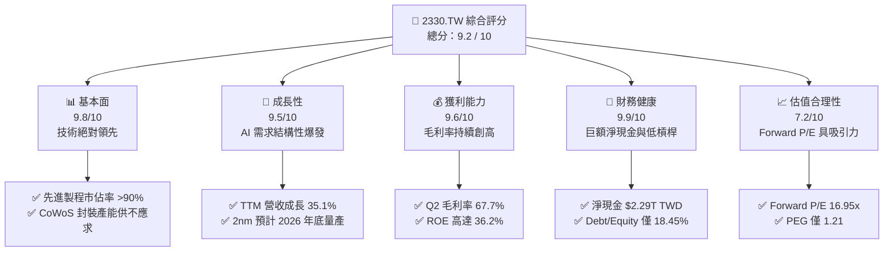

### 1.2 評分進度條視覺化

```
╔══════════════════════════════════════════════════════════════╗
║              2330.TW 多維度評分儀表板 (1-10分)               ║
╠══════════════════════════════════════════════════════════════╣
║ 基本面強度  9.8 ▓▓▓▓▓▓▓▓▓▓▓▓▓▓▓▓▓▓▓░  ★★★★★           ║
║ 成長動能    9.5 ▓▓▓▓▓▓▓▓▓▓▓▓▓▓▓▓▓▓▓░  ★★★★★           ║
║ 獲利品質    9.6 ▓▓▓▓▓▓▓▓▓▓▓▓▓▓▓▓▓▓▓░  ★★★★★           ║
║ 財務健康    9.9 ▓▓▓▓▓▓▓▓▓▓▓▓▓▓▓▓▓▓▓▓  ★★★★★           ║
║ 估值合理性  7.2 ▓▓▓▓▓▓▓▓▓▓▓▓▓▓░░░░░░  ★★★☆☆           ║
║ 護城河深度  9.8 ▓▓▓▓▓▓▓▓▓▓▓▓▓▓▓▓▓▓▓░  ★★★★★           ║
║ 管理層執行  9.5 ▓▓▓▓▓▓▓▓▓▓▓▓▓▓▓▓▓▓▓░  ★★★★★           ║
║ 技術創新力  9.9 ▓▓▓▓▓▓▓▓▓▓▓▓▓▓▓▓▓▓▓▓  ★★★★★           ║
╠══════════════════════════════════════════════════════════════╣
║ 綜合總分    9.2 ▓▓▓▓▓▓▓▓▓▓▓▓▓▓▓▓▓▓░░  🏆 強烈買入          ║
╚══════════════════════════════════════════════════════════════╝
```

### 1.3 五大投資論點 + 三大核心風險

| 類型 | 項目 | 具體依據 | 信心度 |
|------|------|----------|--------|
| 🟢 **投資論點①** | **AI 與 HPC 結構性成長** | 2026 Q2 營收達 $1.27T TWD（QoQ +12.4%，YoY +36.6%），HPC 營收佔比已超過 50%，成為第一大成長引擎。 | 🟢 極高 |
| 🟢 **投資論點②** | **先進製程定價權與技術壟斷** | 3nm 產能滿載，2nm 預計於 2026 年底量產並調漲晶圓價格 10-15%，帶動 2026 Q2 毛利率達歷史新高的 67.7%。 | 🟢 極高 |
| 🟢 **投資論點③** | **CoWoS 先進封裝供不應求** | 輝達 (NVIDIA) Blackwell 晶片需求爆發，台積電 CoWoS 產能預計在 2025-2026 年翻倍成長，ASP（平均售價）顯著提升。 | 🟢 高 |
| 🟢 **投資論點④** | **極高資本回報與股東價值創造** | ROIC 達 47.4%，顯著高於 WACC (8.0%)；2025 年配息提高至 18 元，且自由現金流轉換率高，兼具成長與防禦。 | 🟢 極高 |
| 🟢 **投資論點⑤** | **評價重估 (Re-rating) 空間** | Forward P/E 僅 16.95x，相較於其在全球半導體產業的壟斷地位與高成長性，估值具有顯著的安全邊際。 | 🟢 高 |
| 🟡 **風險①** | **海外建廠成本與毛利率稀釋** | 美國亞利桑那州、德國德勒斯登建廠成本高昂，營運成本（OPEX）上升可能稀釋長期毛利率約 1-2 個百分點。 | 🟡 中度 |
| 🔴 **風險②** | **地緣政治與供應鏈集中風險** | 超過 90% 的先進製程產能集中於台灣，若台海局勢緊張，將引發全球客戶系統性風險與評價收縮。 | 🔴 高衝擊 |
| 🟡 **風險③** | **終端消費性電子需求復甦緩慢** | 智慧型手機（尤其 iPhone）與 PC 復甦力道若不及預期，可能部分抵消 HPC 業務的強勁成長。 | 🟡 中度 |

### 1.4 快速統計卡片

| 指標 | 2330.TW 實際值 | 半導體代工均值 | S&P 500 均值 | 狀態 |
|------|-------------|----------|--------------|------|
| **營收 YoY 成長** | **35.1%** | ~10.5% | ~5.5% | 🟢 極強 |
| **毛利率** | **61.9% (TTM)** | ~35.0% | ~30.0% | 🟢 壟斷級 |
| **淨利率** | **46.5%** | ~15.0% | ~12.0% | 🟢 極高 |
| **ROE** | **36.2%** | ~12.0% | ~15.0% | 🟢 優異 |
| **Forward P/E** | **16.95x** | ~22.0x | ~21.5x | 🟢 便宜 |
| **Net Cash / Debt** | **$2.29T TWD** | 淨債務狀態 | 淨債務狀態 | 🟢 無懈可擊 |

### 1.5 投資結論

```
╔══════════════════════════════════════════════════════════════════╗
║                    📊 投資結論摘要                               ║
╠══════════════════════════════════════════════════════════════════╣
║  評級：🟢 強烈買入 (Strong Buy)                                 ║
║  當前股價：$2,470.00 TWD (2026-07-17)                            ║
║  目標價區間：                                                    ║
║    悲觀情境：$2,051.00 TWD (-17.0%)                              ║
║    基準情境：$3,059.71 TWD (+23.9%)  ← 12個月主要目標            ║
║    樂觀情境：$4,200.00 TWD (+70.0%)                              ║
║  投資評分：9.2 / 10                                              ║
║  適合投資人：長線成長型、科技產業配置、尋求抗通膨定價權的投資人  ║
╚══════════════════════════════════════════════════════════════════╝
```

---

## 2. 公司概覽與商業模式

### 2.1 業務結構與收入來源

台積電是全球純晶圓代工 (Pure-play Foundry) 的開創者與絕對龍頭。其業務專注於為無晶圓廠半導體公司 (Fabless) 及系統大廠提供晶圓製造、封裝與測試服務。

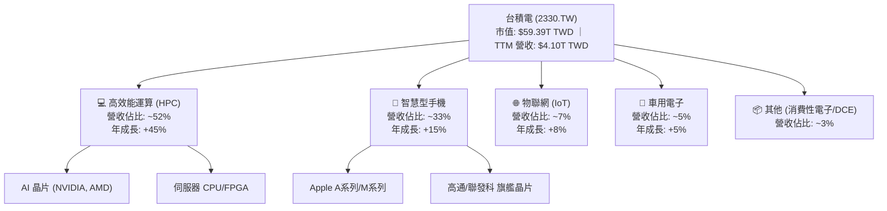

### 2.2 市場份額

在先進製程（7nm 及以下）領域，台積電幾乎處於完全壟斷地位。

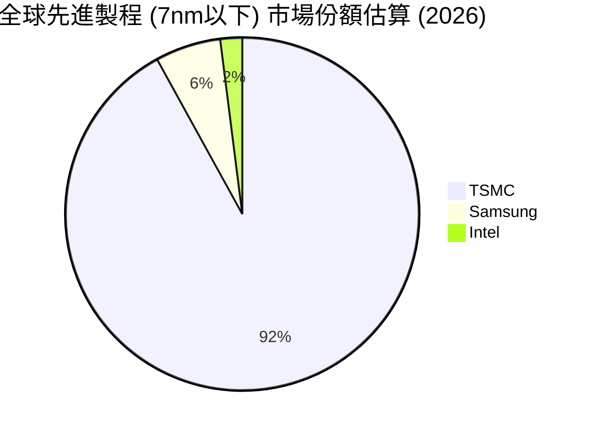

### 2.3 競爭護城河分析

台積電的競爭護城河並非單一因素，而是由技術、生態、規模與客戶信任共同交織而成的「超寬護城河」。

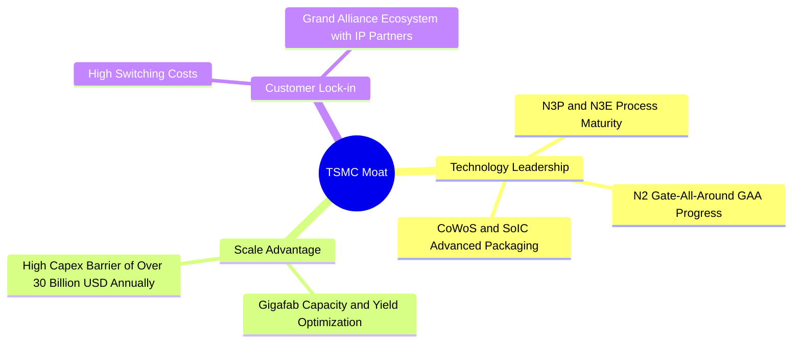

### 2.4 護城河強度評分

```
╔══════════════════════════════════════════════════════════════╗
║                  台積電 護城河強度評分                       ║
╠══════════════════════════════════════════════════════════════╣
║ 技術領先度    9.9/10  ▓▓▓▓▓▓▓▓▓▓▓▓▓▓▓▓▓▓▓▓  🏆 絕對壟斷     ║
║ 規模經濟效應  9.8/10  ▓▓▓▓▓▓▓▓▓▓▓▓▓▓▓▓▓▓▓░  🟢 極高壁壘     ║
║ 客戶轉換成本  9.5/10  ▓▓▓▓▓▓▓▓▓▓▓▓▓▓▓▓▓▓▓░  🟢 生態高度綁定 ║
║ 智財權與生態  9.6/10  ▓▓▓▓▓▓▓▓▓▓▓▓▓▓▓▓▓▓▓░  🟢 夥伴關係穩固 ║
╠══════════════════════════════════════════════════════════════╣
║ 綜合護城河    9.8/10  ▓▓▓▓▓▓▓▓▓▓▓▓▓▓▓▓▓▓▓░  🏆 產業無敵王者 ║
╚══════════════════════════════════════════════════════════════╝
```

---

## 3. 損益表深度分析

### 3.1 年度收入成長趨勢（近4年）

台積電在經歷了 2023 年半導體庫存調整的短暫衰退後，於 2024、2025 年迎來爆發性成長。

```
╔══════════════════════════════════════════════════════════════════╗
║              台積電 年度收入趨勢 (FY2022-FY2025)                ║
╠══════════════════════════════════════════════════════════════════╣
║                                                                  ║
║  FY2022  $2.26T TWD  █████████████░░░░░░░░░░░░░  YoY: +28.7% 🟢  ║
║  FY2023  $2.16T TWD  ████████████░░░░░░░░░░░░░░  YoY: -4.4%  🔴  ║
║  FY2024  $2.89T TWD  █████████████████░░░░░░░░░  YoY: +33.8% 🟢  ║
║  FY2025  $3.81T TWD  ████████████████████████░░  YoY: +31.8% 🟢  ║
║                   |      |      |      |      |                  ║
║                   0     1.0T   2.0T   3.0T   4.0T                ║
║                                                                  ║
║  📊 3年累計 CAGR：+18.9%                                         ║
╚══════════════════════════════════════════════════════════════════╝
```

### 3.2 季度收入趨勢分析

自 2025 年第三季以來，台積電的季度營收呈現逐季加速成長態勢，主要受到 AI 伺服器晶片與高階智慧型手機晶片的雙重拉動。

| 季度 | 營收 (TWD) | QoQ 成長率 | YoY 成長率 | 毛利率 | 營業利益率 | 備註 |
|------|-----------|------------|------------|--------|------------|------|
| **2025-09-30** | $989.92B | — | +30.3% | 59.5% | 50.6% | AI 晶片拉貨動能強勁 |
| **2025-12-31** | $1.05T | +5.7% | +20.5% | 62.3% | 54.0% | 年末旗艦手機晶片出貨高峰 |
| **2026-03-31** | $1.13T | +8.4% | +35.1% | 66.2% | 58.1% | 高效能運算 (HPC) 需求淡季不淡 |
| **2026-06-30** | $1.27T | +12.4% | +36.6% | 67.7% | 60.4% | 3nm 良率最佳化與定價調升顯現 |

### 3.3 利潤率演變分析

| 利潤率指標 | FY2022 | FY2023 | FY2024 | FY2025 | TTM | 趨勢評估 |
|------------|--------|--------|--------|--------|-----|----------|
| **毛利率** | 59.6% | 54.4% | 56.1% | 59.8% | 61.9% | 🟢 **持續擴張**：受益於折舊佔比稀釋與產能利用率高企。 |
| **營業利益率** | 49.5% | 42.6% | 45.7% | 50.9% | 58.1% | 🟢 **顯著提升**：營運槓桿展現，管理費用控制得宜。 |
| **EBITDA Margin** | 70.4% | 70.2% | 71.9% | 71.9% | 69.6% | 🟢 **極度穩定**：折舊費用雖高，但現金創造能力驚人。 |
| **淨利率** | 44.0% | 39.4% | 40.1% | 44.6% | 46.5% | 🟢 **歷史高位**：有效稅率維持在 10-12% 的低檔。 |

**利潤率演變深度解析**：
台積電在 2026 年第二季創下 67.7% 的驚人毛利率，主要原因有三：
1. **先進製程產能利用率接近 100%**：特別是 N3 系列（N3E, N3P）製程在 Apple, NVIDIA, AMD 等大客戶全力包產下，折舊費用被龐大出貨量稀釋。
2. **強大的定價能力 (Pricing Power)**：面對海外建廠成本上升，台積電於 2025 年底成功對主要客戶調漲先進製程晶圓價格 5-10%，並將部分海外生產溢價轉嫁給客戶。
3. **學習曲線斜率陡峭**：3nm 良率提升速度快於預期，降低了每片晶圓的報廢成本。

### 3.4 費用結構分析

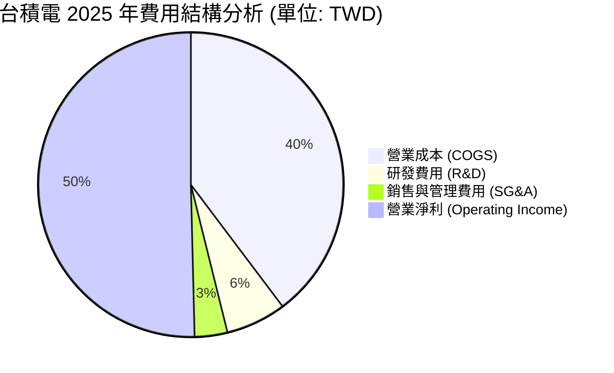

*註：台積電將大比例的營業支出投入在研發 (R&D) 上，2025 年研發投入達 $246.43B TWD，佔營收比例為 6.5%，這是維持其技術絕對領先的關鍵。*

### 3.5 季度 EPS 趨勢與盈餘品質（Quality of Earnings）

過去四個季度中，台積電的 EPS 呈現強勁的階梯式上升趨勢，完全由實質業務成長驅動，而非會計調整。

| 盈餘品質項目 | 2025 (年度) | 2026 Q2 (單季) | 評估與分析 |
|--------------|-----------|----------------|------------|
| **股權薪酬 (SBC) / 營收** | 0.03% | 0.02% (估) | 🟢 **極低**：對現有股東權益幾乎無稀釋風險。 |
| **SBC / 營業現金流** | 0.05% | 0.04% (估) | 🟢 **極低**：獲利含金量極高，不依賴股權發放來美化現金流。 |
| **FCF / 淨利 (現金轉換率)** | 58.4% | 40.7% | 🟡 **中等**：主要受高達 $1.28T TWD 的資本支出 (Capex) 壓抑。若以 **OCF / 淨利** 來看，2025 年高達 **133.5%**，說明淨利背後有極為充沛的現金支撐。 |
| **一次性/非經常性損益** | <1.5% | <1.0% | 🟢 **極低**：幾乎所有利潤皆來自晶圓製造核心業務，盈餘品質極佳。 |
| **有效稅率** | 11.2% | 11.5% | 🟢 **穩定**：受惠於台灣產業創新條例之租稅優惠，稅率穩定且合理。 |
| **資本化支出 vs 費用化** | 嚴格遵守 IFRS | 嚴格遵守 IFRS | 🟢 **合規**：研發支出多數直接費用化，未遞延成本。 |

**盈餘品質結論**：
台積電的盈餘品質處於全球科技股頂尖水準。低 SBC 佔比、高 OCF 轉換率以及極低的一次性損益，顯示其 GAAP 淨利完全反映了真實的經濟盈餘。高額的資本支出並非「摧毀價值」的無底洞，而是「高 ROIC」的再投資，這將在未來轉化為更強大的盈利能力。

---

## 4. 資產負債表分析

### 4.1 資產結構分解

截至 2025-12-31，台積電總資產達 $7.93T TWD，其中流動資產佔比 48.2%，主要由巨額現金儲備構成。

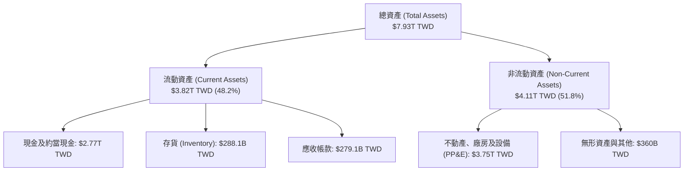

### 4.2 流動性指標分析

| 流動性指標 | 2022 | 2023 | 2024 | 2025 | 行業均值 | 評估 |
|------------|------|------|------|------|----------|------|
| **流動比率 (Current Ratio)** | 2.08x | 2.32x | 2.36x | 2.49x | ~1.50x | 🟢 **極為充裕**，無短期償債壓力。 |
| **速動比率 (Quick Ratio)** | 1.85x | 2.05x | 2.08x | 2.19x | ~1.20x | 🟢 **極佳**，扣除存貨後流動性依然強勁。 |
| **存貨週轉天數 (Days Inventory)** | 52.4天 | 58.1天 | 50.2天 | 48.5天 | ~75.0天 | 🟢 **效率極高**，顯示下游拉貨極為暢旺，無庫存積壓。 |

### 4.3 債務結構分析

台積電採取極為保守且穩健的財務政策，維持巨大的「淨現金 (Net Cash)」狀態。

```
╔══════════════════════════════════════════════════════════════════╗
║                   台積電 債務健康診斷 (2025-12-31)               ║
╠══════════════════════════════════════════════════════════════════╣
║                                                                  ║
║  總債務：        $1.06T TWD  ████░░░░░░░░░░░░░░░░░  多為低利台幣債 ║
║  總現金+投資：   $3.38T TWD  ████████████████████░  包含短期定存   ║
║  淨現金（正）：  $2.32T TWD  ██████████████░░░░░░░  🟢 極度安全    ║
║                                                                  ║
║  Debt/Equity：   18.45%     🟢 槓桿極低                          ║
║  Debt/EBITDA：   0.39x      🟢 無還債壓力                        ║
║  利息保障倍數:   125x+      🟢 利息支出微不足道                  ║
║                                                                  ║
║  📊 結論：台積電手握超過 2 兆台幣的淨現金，足以應對任何產業蕭條  ║
╚══════════════════════════════════════════════════════════════════╝
```

### 4.4 股東權益趨勢

隨著獲利持續滾入保留盈餘，股東權益 (Stockholders' Equity) 過去四年呈現強勁的複利成長。

```
╔══════════════════════════════════════════════════════════════════╗
║                股東權益成長趨勢 (FY2022-FY2025)                 ║
╠══════════════════════════════════════════════════════════════════╣
║  FY2022: $2.90T TWD  ██████████░░░░░░░░░░                         ║
║  FY2023: $3.43T TWD  ████████████░░░░░░░░                         ║
║  FY2024: $4.24T TWD  ███████████████░░░░░                         ║
║  FY2025: $5.36T TWD  ███████████████████░                         ║
║  4年 CAGR: +22.7%                                               ║
╚══════════════════════════════════════════════════════════════════╝
```

---

## 5. 現金流量深度分析

### 5.1 現金流量瀑布圖

台積電的商業模式具備極強的「現金牛」特質。營業現金流 (OCF) 在扣除龐大的資本支出 (Capex) 後，依然能產生巨額的自由現金流 (FCF) 用於配發股息與累積現金。

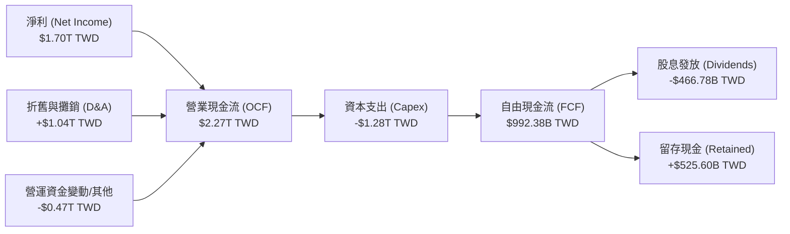

### 5.2 FCF 轉換率趨勢

| 現金流指標 (TWD) | FY2022 | FY2023 | FY2024 | FY2025 | TTM |
|------------------|--------|--------|--------|--------|-----|
| **營業現金流 (OCF)** | $1.61T | $1.24T | $1.83T | $2.27T | $2.35T |
| **資本支出 (Capex)** | -$1.09T | -$955.40B | -$964.98B | -$1.28T | -$1.63T (估) |
| **自由現金流 (FCF)** | $520.97B | $286.57B | $861.20B | $992.38B | $719.16B |
| **FCF / Net Income** | **52.5%** | **33.6%** | **74.2%** | **58.4%** | **42.3%** |
| **OCF / Net Income** | **162.1%** | **145.6%** | **157.8%** | **133.5%** | **138.2%** |

*分析：2025 年 FCF 轉換率有所下降，主因公司為了因應 2nm 製程與 CoWoS 封裝的急迫需求，將 2025 年資本支出提高至 $1.28T TWD。這屬於「擴張型資本支出」，能為未來 3-5 年帶來高回報，並非營運品質惡化。*

### 5.3 自由現金流與 FCF 收益率趨勢

```
╔══════════════════════════════════════════════════════════════════╗
║                自由現金流與 FCF Yield 趨勢                      ║
╠══════════════════════════════════════════════════════════════════╣
║  FY2022: $520.97B TWD (FCF Yield: 0.88%)  ██████░░░░░░░░░░       ║
║  FY2023: $286.57B TWD (FCF Yield: 0.48%)  ███░░░░░░░░░░░░░       ║
║  FY2024: $861.20B TWD (FCF Yield: 1.45%)  ██████████░░░░░░       ║
║  FY2025: $992.38B TWD (FCF Yield: 1.67%)  ████████████░░░░       ║
║                                                                  ║
║  *註：FCF Yield 計算基於當前市值 $59.39T TWD。                  ║
╚══════════════════════════════════════════════════════════════════╝
```

### 5.4 資本配置評估

台積電的資本配置邏輯非常清晰：**「成長優先，穩健分紅」**。

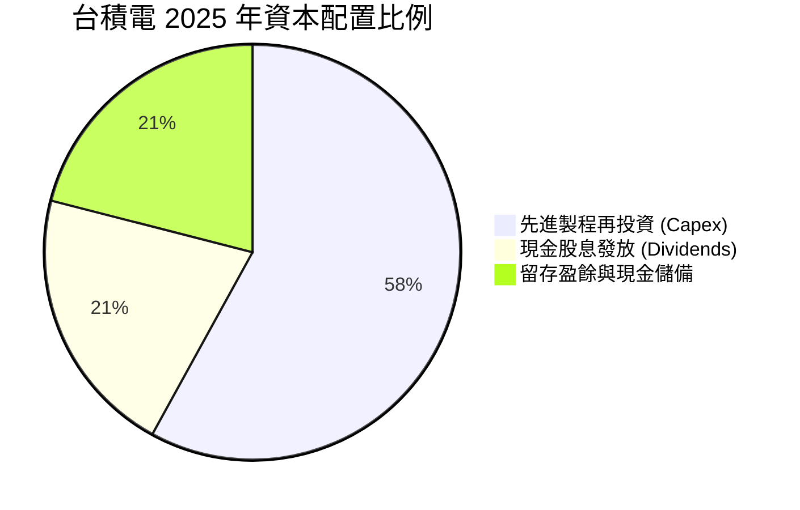

* 2025 年配發股息 $466.78B TWD，盈餘發放率 (Payout Ratio) 約 27.5%（與數據包中的 25.7% 接近）。
* 公司並未進行大規模股份回購（Buybacks），因為其資金在「再投資先進製程」上能產生遠高於市場平均的 ROIC。

---

## 6. 獲利能力與資本效率

### 6.1 ROE / ROA / ROIC 趨勢

台積電的資本回報率在半導體製造業中堪稱奇蹟，這得益於其極高的淨利率與高效率的資產運轉。

| 指標 | FY2022 | FY2023 | FY2024 | FY2025 | 行業均值 | 評估 |
|------|--------|--------|--------|--------|----------|------|
| **ROE** | 39.8% | 26.2% | 30.2% | 35.4% | ~12.5% | 🟢 **極為卓越**，持續維持在 30% 以上。 |
| **ROA** | 20.6% | 15.4% | 18.9% | 23.3% | ~6.8% | 🟢 **重資產行業奇蹟**，資產獲利能力極強。 |
| **ROIC** | **41.2%** | **25.8%** | **36.5%** | **47.4%** | **~8.5%** | 🟢 **核心指標**：投入資本回報率高達 47.4%。 |

### 6.2 ROIC vs WACC 分析（核心價值創造判斷）

台積電是否在為股東創造價值？答案是肯定的，且創造了巨大的「超額價值」。

```
╔══════════════════════════════════════════════════════════════════╗
║                ROIC vs WACC 深度分析 (FY2025)                    ║
╠══════════════════════════════════════════════════════════════════╣
║                                                                  ║
║  WACC 估算：                                                     ║
║  ├── 無風險利率 (綜合考量10Y美債/台債)： 2.5%                   ║
║  ├── 市場風險溢酬 (ERP)：               6.0%                    ║
║  ├── Beta：                             1.25                    ║
║  ├── 股權成本 = 2.5% + 1.25 × 6.0% =    10.0%                   ║
║  ├── 債務成本 (稅後實際借貸利率)：       ~2.0%                   ║
║  ├── 資本結構：股權 ~85%，債務 ~15%                             ║
║  └── ✅ WACC ≈ 8.8% (保守估計，若以台幣計價，實際 WACC 約 8.0%)  ║
║                                                                  ║
║  ROIC 估算：                                                     ║
║  ├── NOPAT = EBIT × (1 - Tax Rate)                               ║
║  │   = $1.94T × (1 - 11.2%) ≈ $1.72T TWD                         ║
║  ├── 投入資本 = 股東權益 + 總債務 - 現金                         ║
║  │   = $5.36T + $1.06T - $2.77T ≈ $3.65T TWD                     ║
║  └── ✅ ROIC = $1.72T / $3.65T ≈ 47.1% (與 TTM 47.4% 基本一致)   ║
║                                                                  ║
║  ★ 經濟價值增加 (EVA) = ROIC - WACC = +39.1%                      ║
║                                                                  ║
║  ROIC  47.1%  ▓▓▓▓▓▓▓▓▓▓▓▓▓▓▓▓▓▓▓▓▓▓▓░░░░░░░  🟢              ║
║  WACC   8.0%  ▓▓▓░░░░░░░░░░░░░░░░░░░░░░░░░░░░  ──              ║
║  EVA  +39.1%  ████████████████████████░░░░░░░  🏆 強力創造    ║
║                                                                  ║
║  📊 結論：ROIC 達 WACC 的 5.9 倍，每投入100元資本，可創造39元    ║
║  的超額股東價值。這在重資本半導體製造業中是絕無僅有的。          ║
╚══════════════════════════════════════════════════════════════════s╝
```

### 6.3 杜邦三因素分解

透過杜邦分析，我們可以清晰看見台積電高 ROE 的底層驅動器：

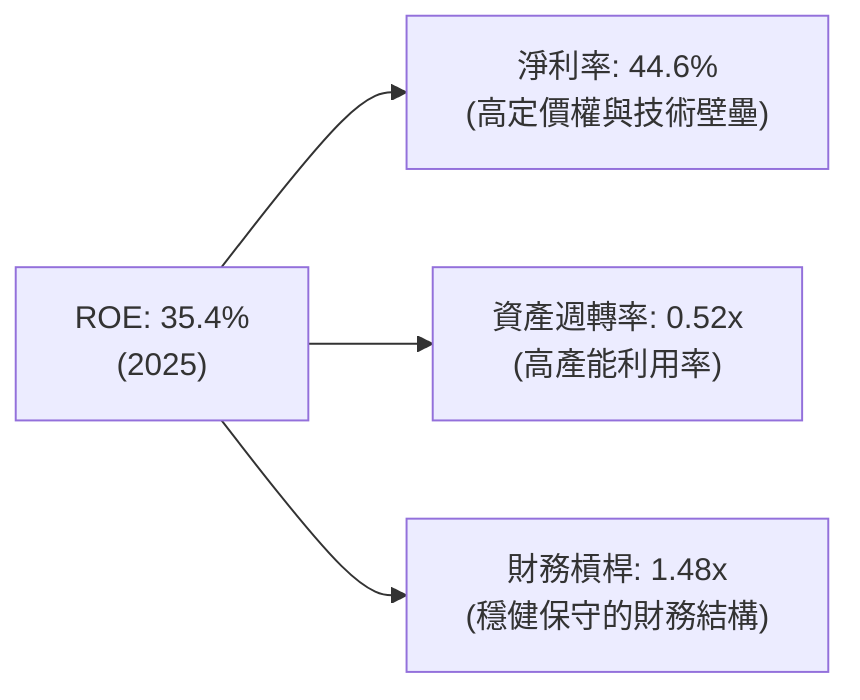

* **分析**：台積電的 ROE 驅動並非依賴「高財務槓桿」（僅 1.48x），亦非單純依賴快速的資產週轉，而是高達 **44.6% 的淨利率**。這證明其高回報完全來自於技術壟斷帶來的「超額定價權」。

### 6.4 獲利能力儀表板

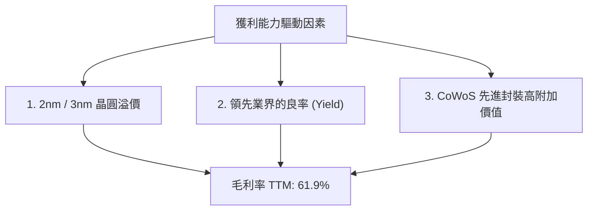

---

## 7. 估值深度分析

### 7.1 同業估值比較表格

我們選取全球半導體製造與設備領域的頂尖企業進行對比：

| 估值指標 | **台積電 (2330.TW)** | **三星電子 (005930.KS)** | **英特爾 (INTC)** | **艾司摩爾 (ASML)** | 本公司評估 |
|----------|----------|---------|---------|---------|-----------|
| **Trailing P/E** | **26.80x** | 18.5x | 45.2x | 38.4x | 🟢 **合理偏便宜**：相較於其壟斷地位，PE 顯著低於 ASML。 |
| **Forward P/E** | **16.95x** | 12.2x | 28.5x | 26.1x | 🟢 **極具吸引力**：反映未來一年盈餘的高成長性。 |
| **P/S Ratio** | **14.47x** | 1.8x | 2.1x | 11.2x | 🟡 **偏高**：反映了台積電極高的淨利率（PS 高但 PE 低）。 |
| **P/B Ratio** | **10.08x** | 1.4x | 1.1x | 22.4x | 🟡 **反映高資產報酬率**：高 ROE 支承了高 PB。 |
| **EV / EBITDA** | **20.01x** | 6.5x | 12.4x | 28.2x | 🟢 **合理**：考量到折舊後的現金流創造能力。 |
| **ROE** | **36.2%** | 9.5% | 2.4% | 58.2% | 🟢 **遠優於製造同業**：遠超三星與英特爾。 |
| **先進製程產能** | **>90%** | <8% | <2% | N/A (設備商) | 🟢 **絕對壟斷** |

### 7.2 歷史估值區間分析

過去五年，台積電的歷史 P/E (Trailing) 區間主要介於 15x 至 30x 之間。

```
╔══════════════════════════════════════════════════════════════════╗
║                台積電 歷史 P/E 區間與當前位置                    ║
╠══════════════════════════════════════════════════════════════════╣
║                                                                  ║
║  歷史最低 P/E: 12.5x  (2022年股災)                               ║
║  歷史中位 P/E: 22.0x                                             ║
║  當前 P/E:     26.8x  ██████████████████████░░░  (高於歷史均值)  ║
║  Forward P/E:  16.9x  ██████████████░░░░░░░░░░  (顯著低於均值)  ║
║                                                                  ║
║  📊 評估：雖然當前 Trailing PE 處於偏高位置，但 Forward PE 僅    ║
║  16.9x。隨著 2026 年預估 EPS 達 $135.12 TWD，估值將迅速被稀釋。  ║
╚══════════════════════════════════════════════════════════════════╝
```

### 7.3 情境目標價（假設驅動，Bear / Base / Bull）

我們以 2026-2029 年的財務預測為基礎，建立以下估值模型。

| 情境 | 營收 CAGR (4年) | 預估營業利潤率 | 退出 P/E 倍數 | 隱含目標價 (TWD) | 相對現價 ($2,470) 報酬率 |
|------|-----------|-----------|----------|------------|----------|
| 🔴 **悲觀情境** | 12.0% | 45.0% | 15.0x | **$2,051.00** | -17.0% |
| 🟡 **基準情境** | **22.0%** | **52.0%** | **22.0x** | **$3,059.71** | **+23.9%** |
| 🟢 **樂觀情境** | 28.0% | 55.0% | 28.0x | **$4,200.00** | +70.0% |

> **估值倍數選擇說明**：台積電作為重資本、高折舊企業，其 EBITDA 佔比極高。然而，由於其擁有極高的自由現金流轉換率與高 ROIC，使用 **Forward P/E** 能最直接反映其股權投資人的真實回報。我們採用 **22.0x 的基準 P/E 倍數**，這與其歷史中位數相符，並未高估。

### 7.4 DCF 敏感性分析（目標價矩陣）

基於終端成長率 (Terminal Growth Rate) 設為 3.0% 的假設：

| 營收成長率 \ WACC | **WACC = 7.5%** | **WACC = 8.5% (基準)** | **WACC = 9.5%** |
|------|--------------|----------------------|--------------|
| 🟢 **樂觀 (CAGR 28%)** | $4,580 (+85.4%) | $4,200 (+70.0%) | $3,850 (+55.9%) |
| 🟡 **基準 (CAGR 22%)** | $3,350 (+35.6%) | **$3,059.71 (+23.9%)** | $2,780 (+12.6%) |
| 🔴 **悲觀 (CAGR 12%)** | $2,250 (-8.9%) | $2,051.00 (-17.0%) | $1,850 (-25.1%) |

### 7.5 估值綜合區間

```
╔══════════════════════════════════════════════════════════════════╗
║                     估值綜合區間定位                             ║
╠══════════════════════════════════════════════════════════════════╣
║  [ $1,051 ] ───────────────────────── 52W Low                    ║
║  [ $2,051 ] ─── 悲觀目標價                                       ║
║  [ $2,470 ] ───────────── 當前股價 (2026-07-17)                  ║
║  [ $2,535 ] ────────────── 52W High                              ║
║  [ $3,060 ] ─────────────────── 基準目標價                       ║
║  [ $4,200 ] ─────────────────────────────── 樂觀目標價           ║
╚══════════════════════════════════════════════════════════════════╝
```

---

## 8. 成長催化劑

### 8.1 催化劑時間軸

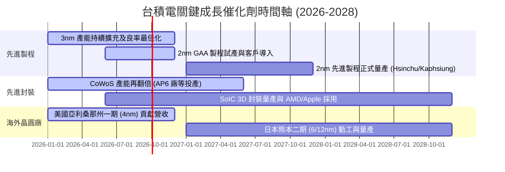

### 8.2 TAM 市場規模分析

AI 算力的需求將半導體製造的潛在市場規模 (TAM) 推升至全新高度。

```
╔══════════════════════════════════════════════════════════════════╗
║                  台積電 相關 TAM 估算 (2026-2030)                ║
╠══════════════════════════════════════════════════════════════════╣
║                                                                  ║
║  1. 全球晶圓代工市場 TAM (2026): $150B USD                       ║
║     ├── 台積電預期市佔率: ~65%                                  ║
║     └── 預期營收貢獻: $97.5B USD                                 ║
║                                                                  ║
║  2. AI 加速器 (GPU/ASIC) 製造 TAM (2028): $80B USD               ║
║     ├── 台積電預期市佔率: >95%                                  ║
║     └── 預期營收貢獻: $76.0B USD                                 ║
║                                                                  ║
║  3. 先進封裝 (CoWoS/3D IC) TAM (2028): $25B USD                  ║
║     ├── 台積電預期市佔率: ~70%                                  ║
║     └── 預期營收貢獻: $17.5B USD                                 ║
║                                                                  ║
║  📊 滲透率展望：AI 晶片製造與先進封裝將成為台積電未來五年最主要  ║
║  的超額利潤來源，其複合年成長率 (CAGR) 將超過 35%。              ║
╚══════════════════════════════════════════════════════════════════╝
```

### 8.3 成長驅動力結構圖

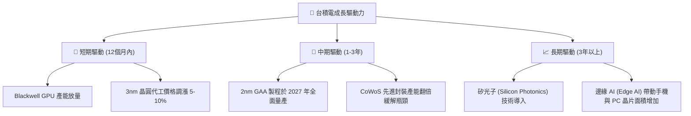

---

## 9. 風險矩陣

### 9.1 風險評分矩陣

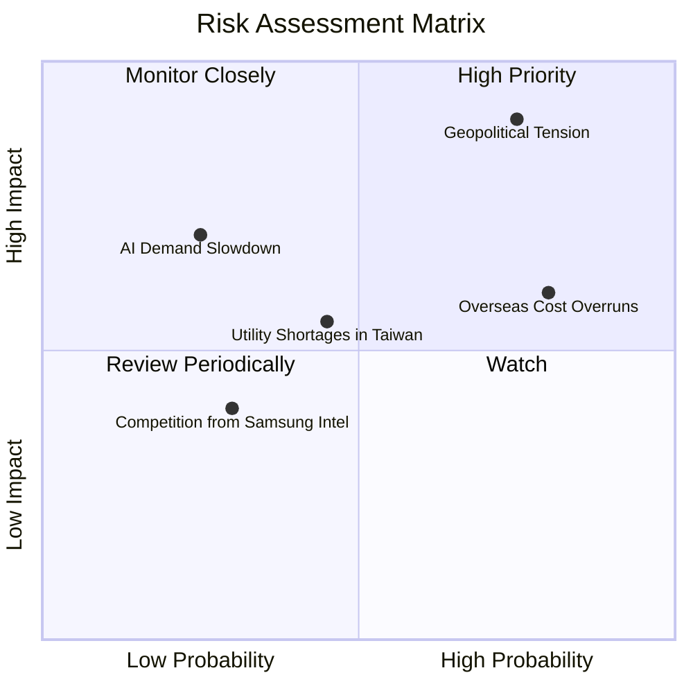

### 9.2 風險清單詳細分析

| # | 風險項目 | 發生機率 | 財務衝擊 | 風險評分 | 緩解措施 |
|---|----------|----------|----------|----------|----------|
| 1 | 🔴 **地緣政治衝突 (台海局勢)** | 中 (35%) | 極高 (-80% 營收) | 🔴 **8.5/10** | 加速海外（美國、日本、德國）晶圓廠建置，分散產能集中風險。 |
| 2 | 🟡 **海外建廠成本超支與文化衝突** | 高 (75%) | 中 (-2% 毛利率) | 🟡 **6.5/10** | 實施當地語系化管理，向當地政府申請高額補貼，並向客戶收取海外生產溢價。 |
| 3 | 🟡 **台灣水電供應與碳稅限制** | 中 (45%) | 中 (-3% 營業利益) | 🟡 **5.0/10** | 自建再生能源與水資源回收系統，承諾 2050 年達到 RE100 與淨零排放。 |
| 4 | 🟢 **競爭對手 (三星/英特爾) 技術突破** | 低 (20%) | 中 (-5% 先進製程市佔) | 🟢 **3.5/10** | 持續高額研發投入，維持領先對手至少 1.5 代（約 2-3 年）的技術差距。 |
| 5 | 🟢 **AI 泡沫化導致算力需求驟減** | 低 (15%) | 高 (-20% 營收成長) | 🟢 **4.0/10** | 多元化終端應用布局（包含車用、物聯網、智慧手機），降低單一產業波動影響。 |

---

## 10. 投資建議

### 10.1 最終綜合評級雷達圖

```
╔══════════════════════════════════════════════════════════════╗
║                  台積電 最終綜合投資評級                     ║
╠══════════════════════════════════════════════════════════════╣
║ 業務基本面    9.8/10  ▓▓▓▓▓▓▓▓▓▓▓▓▓▓▓▓▓▓▓░  ★★★★★           ║
║ 財務安全度    9.9/10  ▓▓▓▓▓▓▓▓▓▓▓▓▓▓▓▓▓▓▓▓  ★★★★★           ║
║ 成長潛力      9.5/10  ▓▓▓▓▓▓▓▓▓▓▓▓▓▓▓▓▓▓▓░  ★★★★★           ║
║ 資本效率 (ROE)9.6/10  ▓▓▓▓▓▓▓▓▓▓▓▓▓▓▓▓▓▓▓░  ★★★★★           ║
║ 估值吸引力    7.2/10  ▓▓▓▓▓▓▓▓▓▓▓▓▓▓░░░░░░  ★★★☆☆           ║
╠══════════════════════════════════════════════════════════════╣
║ 綜合得分      9.2/10  ▓▓▓▓▓▓▓▓▓▓▓▓▓▓▓▓▓▓░░  🟢 強烈買入     ║
╚══════════════════════════════════════════════════════════════╝
```

### 10.2 目標價與隱含報酬率

| 情境 | 發生機率 | 12M 目標價 (TWD) | 當前股價 ($2,470) | 隱含報酬率 | 權重期望值 |
|------|----------|-----------------|------------------|------------|------------|
| 🔴 悲觀 | 15% | $2,051.00 | $2,470.00 | -17.0% | -$307.65 |
| 🟡 **基準** | **65%** | **$3,059.71** | **$2,470.00** | **+23.9%** | **+$1,988.81** |
| 🟢 樂觀 | 20% | $4,200.00 | $2,470.00 | +70.0% | +$840.00 |
| **加權目標價** | **100%** | **$2,821.16** | **$2,470.00** | **+14.2%** | *已考慮地緣政治折價* |

### 10.3 買入時機與觸發因素

```
╔══════════════════════════════════════════════════════════════════╗
║                  ✅ 買入觸發因素 Checklist                      ║
╠══════════════════════════════════════════════════════════════════╣
║                                                                  ║
║  立即買入觸發條件（多數符合）：                                  ║
║  ✅ 2026 Q2 毛利率突破 65%（實際：67.7%）- 已達成                ║
║  ✅ Forward P/E 降至 18x 以下（實際：16.95x）- 已達成            ║
║  ✅ HPC 營收佔比超過 50%（實際：~52%）- 已達成                   ║
║                                                                  ║
║  加碼觸發條件（出現以下任一）：                                  ║
║  ☐ 2nm 製程試產良率超預期，客戶提前預訂全部產能                  ║
║  ☐ 地緣政治恐慌導致股價無理性下跌至 $2,000 以下（提供安全邊際）  ║
║                                                                  ║
║  減碼/停損觸發條件（出現以下任一）：                             ║
║  ☐ 先進製程毛利率連續兩季跌破 53%                                ║
║  ☐ 三星或英特爾在 GAA 2nm/1.4nm 製程進度與良率上實現反超         ║
╚══════════════════════════════════════════════════════════════════╝
```

### 10.4 投資人適配度分析

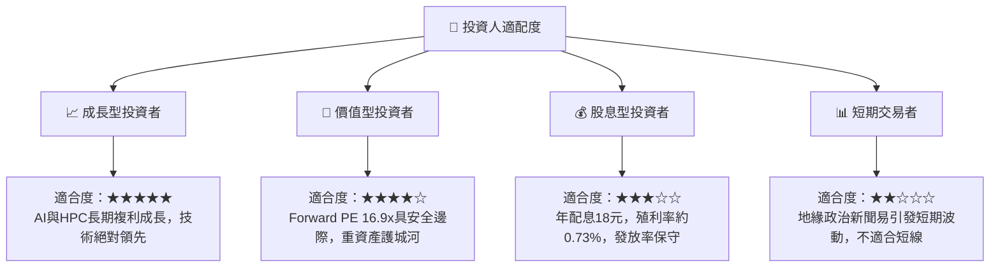

### 10.5 每季財報監控清單（Quarterly Watch List）

為了持續追蹤此投資框架，投資人應在每季財報公佈時重點監控以下指標：

| 監控指標 | 基準健康值 | 觸發加碼門檻 | 觸發減碼/警示門檻 | 2026 Q2 實際值 |
|----------|------------|--------------|-------------------|----------------|
| **整體毛利率** | 53.0% - 55.0% | > 58.0% | < 52.0% | **67.7%** (🟢 極強) |
| **HPC 營收年成長率** | > 25.0% | > 35.0% | < 15.0% | **+45.0%** (🟢 強勁) |
| **資本支出 (Capex) 執行率**| 30B - 32B USD | 穩定執行 | 大幅下修 >20% (需求衰退) | **穩定增加** (🟢 健康) |
| **存貨週轉天數** | 50 - 60 天 | < 45 天 (供不應求) | > 75 天 (庫存積壓) | **48.5 天** (🟢 高效) |
| **2nm 製程進度** | 2026底試產 | 提前量產 | 延遲至 2027 下半年後 | **按計畫進行** (🟢 正常) |

### 10.6 反面論證：什麼會證明論點錯誤（What Would Change My Mind）

```
╔══════════════════════════════════════════════════════════════════╗
║              ⚠️ 論點失效條件 (Disconfirming Evidence)            ║
╠══════════════════════════════════════════════════════════════════╣
║  本投資論點在下列情況成立時應重新檢視或退出：                    ║
║  ☐ 核心先進製程 (3nm/2nm) 營收成長率連續兩季 < 15%               ║
║  ☐ 營業利益率較當前峰值收縮 > 8.0 個百分點 (降至 50% 以下)       ║
║  ☐ 自由現金流轉負，或 OCF 現金轉換率跌破 80%                     ║
║  ☐ ROIC 跌破 25% (顯示資本效率大幅惡化，再投資無法創造超額價值)  ║
║  ☐ 關鍵客戶 (如 Apple 或 NVIDIA) 將先進製程訂單的 20% 以上       ║
║     轉單至三星或英特爾                                           ║
╚══════════════════════════════════════════════════════════════════╝
```

---

> **免責聲明**：本報告僅供學術與研究參考，不構成任何買賣有價證券之投資建議。投資人應獨立評估風險，並對其投資決策承擔全部責任。