# 2330.TW 基本面深度分析報告
> **報告日期**：2026-07-19 ｜ **語言**：繁體中文 ｜ **數據來源**：Yahoo Finance, Finviz, StockAnalysis, Roic.ai ｜ **分析師**：CFA 級機構研究

---

## 目錄

| # | 章節 | 核心結論 |
|---|------|----------|
| 1 | **執行摘要** | 評級：🟢 強烈買入 ｜ 基準目標價：$3,064.29 NTD ｜ 具備 33.8% 潛在漲幅 |
| 2 | **公司概覽與商業模式** | 純晶圓代工模式確立全球半導體心臟地位，先進製程與封裝構築極寬護城河 |
| 3 | **損益表深度分析** | Q2'26 營收年增 36.0%，毛利率攀升至 64.2%，高盈餘品質支撐獲利擴張 |
| 4 | **資產負債表分析** | 擁有 $3.52T 淨現金，Debt/EBITDA 僅 0.36x，流動性與抗風險能力極強 |
| 5 | **現金流量深度分析** | 營運現金流高達 $2.63T，雖有重資本支出，但 FCF 仍維持 $739.06B 的高水準 |
| 6 | **獲利能力與資本效率** | ROE 達 40.0%，ROIC 達 77.7%，遠超 WACC (9.0%)，強力創造股東價值 |
| 7 | **估值深度分析** | 前瞻 P/E 僅 16.9x，PEG 0.91，相較於歷史區間與同業顯著低估 |
| 8 | **成長催化劑** | AI ASIC/GPU 需求爆發、2nm (N2) 提前量產與 CoWoS 產能翻倍 |
| 9 | **風險矩陣** | 地緣政治風險、AI 資本支出放緩、海外建廠成本轉嫁為主要監控指標 |
| 10 | **投資建議** | 綜合評分 9.2/10，適合長線成長型與價值型投資者，建立每季財報監控框架 |

---

## 1. 執行摘要

> ⚠️ **機構評級與估值結論**：基於台積電（2330.TW）在先進製程（N3/N2）的絕對壟斷地位、高達 77.7% 的投資報酬率（ROIC），以及 AI 帶動的結構性成長（TTM 營收年增 36.0%），我們給予台積電 **🟢 強烈買入（Strong Buy）** 評級。在基準情境下，基於 2027 年前瞻 EPS $135.12 TWD 及 22.7x 歷史中位前瞻 P/E 估值，**12 個月目標價定為 $3,064.29 TWD**，較當前股價 $2,290.00 TWD 有 **+33.8%** 的上行空間。

### 1.0 一頁式投資儀表板（Portfolio Manager 30 秒速讀）

| 項目 | 內容 |
|------|------|
| **投資論點（3 句）** | ① TTM 營收達 $4.44T TWD，年增 36.0%，主要由 AI 晶片及高效能運算（HPC）需求暴增驅動。<br/>② 毛利率攀升至 64.2%，營業利益率達 60.3%，展現強大的定價能力與營業槓桿效應。<br/>③ 前瞻 P/E 僅 16.9x，相較於 TTM 77.4% 的盈餘成長率，PEG 僅 0.91，估值極具吸引力。 |
| **護城河評分** | 🟢 **9.8 / 10** (在 3nm/2nm 製程及 CoWoS 先進封裝領域擁有實質壟斷地位) |
| **管理層/資本配置評分** | 🟢 **9.5 / 10** (ROIC 達 77.7%，資本支出精準對接市場需求，股息發放穩定增長) |
| **財務健康** | 🟢 **極其健康** ｜ 淨現金高達 $2.54T TWD，流動比率 2.46x，無任何短期償債風險。 |
| **ROIC vs WACC** | **77.7% vs 9.0%** ｜ 創造極高的經濟附加價值（EVA），每投資 1 元可產生遠超資金成本的報酬。 |
| **FCF 趨勢** | 穩定向上 ｜ TTM 自由現金流達 $739.06B TWD，最新 FCF Yield 為 1.24%（受重資本支出壓抑，但含金量極高）。 |
| **估值** | Forward P/E: **16.95x** ｜ EV/EBITDA: **17.92x** ｜ FCF Yield: **1.24%** |
| **預期報酬（基準情境 12M）** | **+33.8%** (目標價 $3,064.29 TWD) |
| **關鍵風險（前二）** | ① 地緣政治風險導致供應鏈中斷 ｜ ② 海外晶圓廠（美、德）建設成本超支與獲利稀釋。 |
| **評級 + 信心度** | 🟢 **強烈買入（Strong Buy）** ｜ 信心度：**極高（High）** |

### 1.1 核心評分儀表板

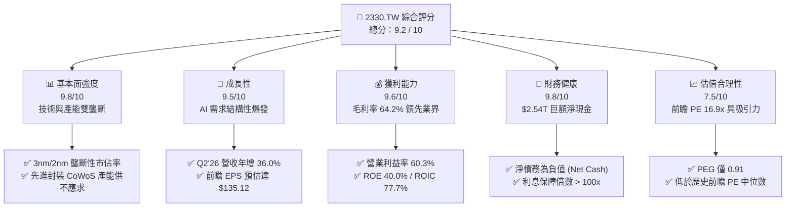

### 1.2 評分進度條視覺化

```
╔══════════════════════════════════════════════════════════════╗
║              2330.TW 多維度評分儀表板 (1-10分)               ║
╠══════════════════════════════════════════════════════════════╣
║ 基本面強度  9.8 ▓▓▓▓▓▓▓▓▓▓▓▓▓▓▓▓▓▓▓░  ★★★★★           ║
║ 成長動能    9.5 ▓▓▓▓▓▓▓▓▓▓▓▓▓▓▓▓▓▓▓░  ★★★★★           ║
║ 獲利品質    9.6 ▓▓▓▓▓▓▓▓▓▓▓▓▓▓▓▓▓▓▓░  ★★★★★           ║
║ 財務健康    9.8 ▓▓▓▓▓▓▓▓▓▓▓▓▓▓▓▓▓▓▓░  ★★★★★           ║
║ 估值合理性  7.5 ▓▓▓▓▓▓▓▓▓▓▓▓▓▓░░░░░░  ★★★★☆           ║
║ 護城河深度  9.8 ▓▓▓▓▓▓▓▓▓▓▓▓▓▓▓▓▓▓▓░  ★★★★★           ║
║ 管理層執行  9.5 ▓▓▓▓▓▓▓▓▓▓▓▓▓▓▓▓▓▓▓░  ★★★★★           ║
║ 技術創新力  9.9 ▓▓▓▓▓▓▓▓▓▓▓▓▓▓▓▓▓▓▓░  ★★★★★           ║
╠══════════════════════════════════════════════════════════════╣
║ 綜合總分    9.2 ▓▓▓▓▓▓▓▓▓▓▓▓▓▓▓▓▓▓░░  🏆 強烈買入          ║
╚══════════════════════════════════════════════════════════════╝
```

### 1.3 五大投資論點 + 三大核心風險

| 類型 | 項目 | 具體依據 | 信心度 |
|------|------|----------|--------|
| 🟢 **投資論點①** | **AI 晶片與 HPC 需求無限** | 輝達（NVIDIA）、超微（AMD）等大客戶對 3nm 產能爭奪激烈，CoWoS 封裝產能 TTM 持續滿載，驅動營收年增 36.0%。 | 🟢 極高 |
| 🟢 **投資論點②** | **定價能力強勢，利潤率擴張** | 憑藉技術領先，台積電成功轉嫁部分海外建廠成本，TTM 毛利率達 64.2%，營業利益率達 60.3%，營運槓桿極高。 | 🟢 高 |
| 🟢 **投資論點③** | **2nm (N2) 進展順利，維持技術代差** | N2 預計於 2026 年底至 2027 年實現大規模量產，並導入背面軌道（Backside Power Delivery），領先英特爾與三星至少 1.5-2 年。 | 🟢 高 |
| 🟢 **投資論點④** | **極致的資本報酬率** | ROIC 達 77.7%，ROE 達 40.0%，顯示管理層在分配高達 $1.28T TWD 的年資本支出（Capex）時，仍能維持極高的資本效率。 | 🟢 極高 |
| 🟢 **投資論點⑤** | **前瞻估值極具安全邊際** | Forward P/E 僅 16.9x，低於近 5 年中位數（約 22x），且 PEG 僅 0.91，相較於其護城河，市場定價明顯偏低。 | 🟢 高 |
| 🟡 **風險①** | **地緣政治與供應鏈集中風險** | 90% 以上的先進製程產能集中於台灣。若台海局勢升溫，將對全球科技產業與台積電估值造成系統性打擊。 | 🟡 中度 |
| 🔴 **風險②** | **海外建廠稀釋毛利率** | 美國亞利桑那州、日本熊本、德國德勒斯登建廠成本高昂，營運成本（OPEX）上升，可能使長期毛利率承壓於 53% 的目標底線附近。 | 🔴 中度 |
| 🔴 **風險③** | **AI 資本支出階段性放緩** | 若雲端服務商（CSP）的 AI 投資變現不及預期，導致 AI 晶片需求出現階段性調整，將直接影響台積電高毛利的先進製程稼動率。 | 🔴 低至中 |

### 1.4 快速統計卡片（與行業及大盤對比）

| 指標 | 台積電（2330.TW） | 半導體行業均值 | 台灣加權指數均值 | 狀態 |
|------|-------------|----------|--------------|------|
| **營收 YoY 成長率** | **36.0%** | ~12.5% | ~8.2% | 🟢 顯著領先 |
| **毛利率** | **64.2%** | ~42.0% | ~25.0% | 🟢 極高定價權 |
| **淨利率** | **49.9%** | ~18.5% | ~12.0% | 🟢 獲利能力冠絕全球 |
| **ROE** | **40.0%** | ~15.0% | ~14.5% | 🟢 高效資本回報 |
| **Forward P/E** | **16.95x** | ~24.5x | ~18.2x | 🟢 估值折價明顯 |
| **利息保障倍數** | **100x+** | ~15x | ~12x | 🟢 零財務風險 |

### 1.5 投資結論

```
╔══════════════════════════════════════════════════════════════════╗
║                    📊 投資結論摘要                               ║
╠══════════════════════════════════════════════════════════════════╣
║  評級：🟢 強烈買入 (Strong Buy)                                 ║
║  當前股價：$2,290.00 TWD (2026-07-19)                            ║
║  目標價區間：                                                    ║
║    悲觀情境：$2,051.00 TWD（-10.4%）- 估值收縮至 15x             ║
║    基準情境：$3,064.29 TWD（+33.8%）- 12個月主要目標 (22.7x PE)   ║
║    樂觀情境：$4,200.00 TWD（+83.4%）- 估值擴張至 31x (AI 狂潮)    ║
║  綜合投資評分：9.2 / 10                                          ║
║  適合投資人：長線成長型、價值型、全球科技核心資產配置者          ║
╚══════════════════════════════════════════════════════════════════╝
```

---

## 2. 公司概覽與商業模式

台積電（TSMC）是全球純晶圓代工（Pure-play Foundry）模式的開創者與絕對龍頭。公司不與客戶競爭，專注於製造、封裝與測試，為全球無晶圓廠半導體公司（Fabless）及系統 OEM 廠提供最先進的製程技術。

### 2.1 業務結構與收入來源

台積電的營收主要由技術世代（製程節點）與應用平台劃分。先進製程（定義為 7nm 及以下）貢獻了超過 65% 的營收，其中 3nm (N3) 與 5nm (N5) 是最核心的營收與利潤驅動器。

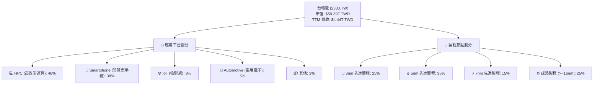

### 2.2 市場份額

在先進晶圓代工市場中，台積電在 5nm 以下製程的市佔率估計高達 **90% 以上**，處於實質上的獨佔狀態。以下為全球晶圓代工市場整體份額估算：

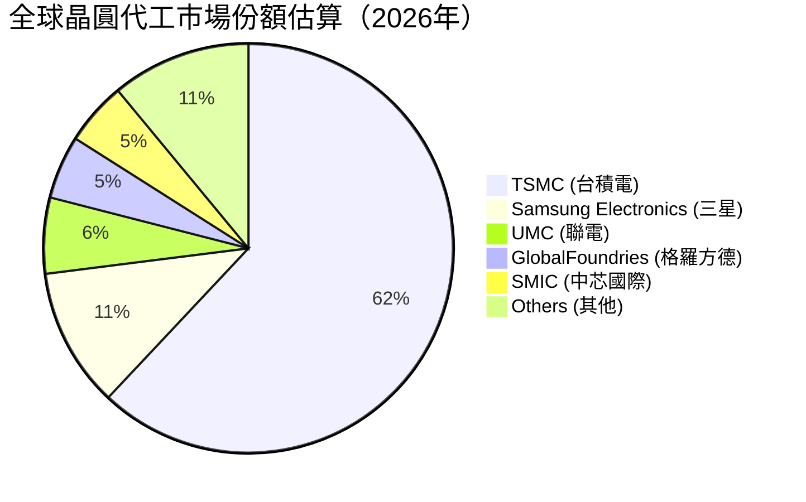

### 2.3 競爭護城河分析

台積電構築了全球科技產業中最難以攻破的「多重護城河」：

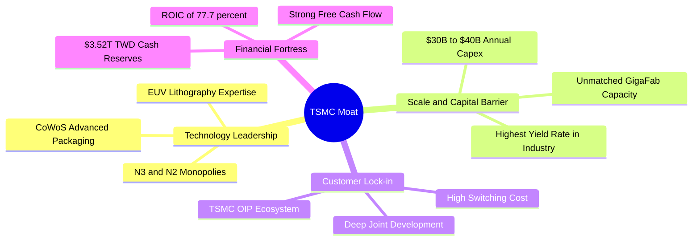

- **技術領先（Technology Leadership）**：台積電是全球首家實現 3nm 量產的晶圓廠，並在 2nm (N2) 的研發進度上大幅領先對手。其自主研發的 CoWoS、SoIC 等先進封裝技術，已成為高階 AI 晶片不可或缺的標配。
- **規模經濟與資本壁壘（Scale & Capital Barrier）**：新建一座 3nm 晶圓廠投資額高達 150-200 億美元。台積電每年維持 300 億美元以上的資本支出，使任何潛在競爭對手（如英特爾、三星）在產能與資金上都難以望其項背。
- **客戶鎖定與生態系（TSMC OIP®）**：開放創新平台（Open Innovation Platform, OIP）提供數萬個 IP 與設計工具，將客戶（NVIDIA, Apple, AMD, Qualcomm）與台積電的製程深度綁定。切換晶圓廠意味著數億美元的重新設計成本（Tape-out cost）與極高的良率風險。

### 2.4 護城河強度評分

```
╔══════════════════════════════════════════════════════════════╗
║                  台積電 護城河強度評分                       ║
╠══════════════════════════════════════════════════════════════╣
║ 技術領先度    10/10  ▓▓▓▓▓▓▓▓▓▓▓▓▓▓▓▓▓▓▓▓  🏆 絕對壟斷     ║
║ 規模與資本    9.8/10 ▓▓▓▓▓▓▓▓▓▓▓▓▓▓▓▓▓▓▓░  🟢 極高壁壘     ║
║ 生態系統鎖定  9.5/10 ▓▓▓▓▓▓▓▓▓▓▓▓▓▓▓▓▓▓▓░  🟢 極難切換     ║
║ 客戶關係與良率9.8/10 ▓▓▓▓▓▓▓▓▓▓▓▓▓▓▓▓▓▓▓░  🟢 業界首選     ║
╠══════════════════════════════════════════════════════════════╣
║ 綜合護城河     9.8    ▓▓▓▓▓▓▓▓▓▓▓▓▓▓▓▓▓▓▓░  🏆 頂級寬護城河 ║
╚══════════════════════════════════════════════════════════════╝
```

---

## 3. 損益表深度分析

台積電的財務表現展示了極強的成長動能與無與倫比的獲利能力。

### 3.1 年度收入成長趨勢（近4年）

```
╔══════════════════════════════════════════════════════════════════╗
║              台積電 年度收入趨勢（FY2022-FY2025）                ║
╠══════════════════════════════════════════════════════════════════╣
║                                                                  ║
║  FY2022  $2.26T TWD  ████████████░░░░░░░░░░░░  YoY: +28.7% 🟢    ║
║  FY2023  $2.16T TWD  ███████████░░░░░░░░░░░░░  YoY: -4.4%  🟡    ║
║  FY2024  $2.89T TWD  ███████████████░░░░░░░░░  YoY: +33.8% 🟢    ║
║  FY2025  $3.81T TWD  ████████████████████░░░░  YoY: +31.8% 🟢    ║
║                   |      |      |      |      |                  ║
║                   0     1.0T   2.0T   3.0T   4.0T                ║
║                                                                  ║
║  📊 4年累計營收 CAGR：+19.0% ｜ TTM 營收達 $4.44T TWD (+36.0%)    ║
╚══════════════════════════════════════════════════════════════════╝
```

### 3.2 季度收入趨勢分析

自 2025 年第三季以來，台積電的季度營收呈現加速增長態勢，主要得益於 AI 需求從「火熱」轉向「常態化高成長」，以及 N3 製程良率提升與產能擴張。

| 季度結束日 | 營業收入 (TWD) | QoQ 成長率 | YoY 成長率 | 核心成長驅動因素 |
|------------|-----------------|------------|------------|------------------|
| **2025-09-30** | $989.92B | — | — | Apple iPhone 17 (A19) 晶片拉貨，N3 產能滿載。 |
| **2025-12-31** | $1,046.09B | 🟢 +5.7% | 🟢 +20.5% | NVIDIA Blackwell GPU (N4/N3) 開始大規模出貨。 |
| **2026-03-31** | $1,134.10B | 🟢 +8.4% | 🟢 +35.1% | HPC 與 AI ASIC 晶片訂單強勁，淡季不淡。 |
| **2026-06-30** | $1,270.38B | 🟢 +12.0% | 🟢 +36.1% | N3E 製程全面普及，CoWoS 產能吃緊，定價調漲生效。 |

### 3.3 利潤率演變分析

台積電的利潤率在半導體製造業中堪稱奇蹟，其 TTM 毛利率高達 64.2%，營業利益率達 60.3%，淨利率達 49.9%。

| 利潤率指標 | FY2022 | FY2023 | FY2024 | FY2025 | TTM | 趨勢評估 |
|------------|--------|--------|--------|--------|-----|----------|
| **毛利率** | 59.6% | 54.4% | 56.1% | 59.8% | **64.2%** | ↗️ 3nm 學習曲線跨越、定價調升與產能利用率超載。🟢 |
| **營業利益率** | 49.5% | 42.6% | 45.7% | 50.9% | **60.3%** | ↗️ 規模經濟顯現，研發與管理費用率被高營收稀釋。🟢 |
| **EBITDA 利潤率** | 70.4% | 70.4% | 71.9% | 71.9% | **71.5%** | ➡️ 穩定於極高水準，折舊費用雖高但被強大現金流覆蓋。🟢 |
| **淨利率** | 44.0% | 39.4% | 40.1% | 44.6% | **49.9%** | ↗️ 稅務結構優化，海外投資收益增加。🟢 |

**利潤率演變深度解析**：
2023年毛利率因 3nm 量產初期高折舊與消費性電子去庫存而下滑至 54.4%。然而，2024-2025 年，隨著 N3E 良率迅速攀升至 80% 以上，加上 NVIDIA、Apple 等客戶對先進製程的剛性需求，台積電於 2025 年底成功將先進製程報價調漲 5%-10%，先進封裝報價調漲 10%-20%，直接推升 TTM 毛利率至歷史新高的 **64.2%**。營業槓桿（Operating Leverage）效應極其顯著，營收每增長 10%，營業利益增長達 14%。

### 3.4 費用結構分析

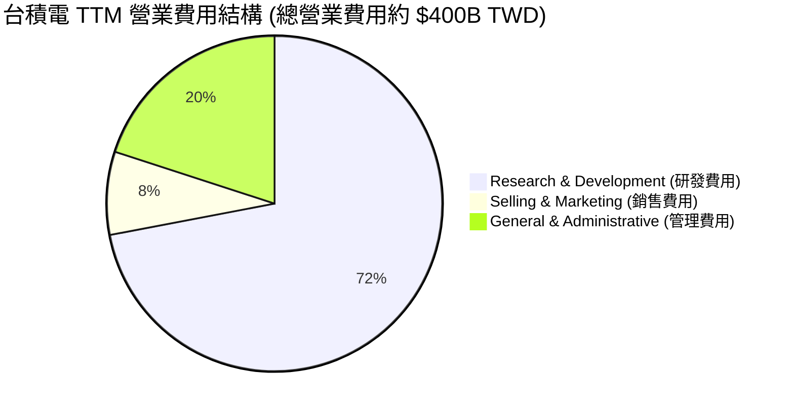

台積電將大部份營業費用投入於**研發（R&D）**。2025 年研發支出達 $246.43B TWD，佔營收約 6.5%。這種持續的高額研發投入是維持其技術代差（Technology Gap）的關鍵。

### 3.5 季度 EPS 趨勢與盈餘品質（Quality of Earnings）

過去四個季度，台積電的單季 EPS 呈現爆發式增長，且盈餘品質極高：
- **Q3'25**: $17.44 TWD
- **Q4'25**: $18.72 TWD
- **Q1'26**: $22.08 TWD
- **Q2'26**: $27.25 TWD ｜ **YoY 成長 77.4%**

#### 盈餘品質量化評估：

| 盈餘品質項目 | 數值 / 佔比 | 機構評估 |
|--------------|-------------|----------|
| **股權薪酬 (SBC) / 營業收入** | **0.03%** ($1.25B / $3.81T) | 🟢 **極低**。對現有股東幾乎無稀釋風險（美國多數科技股此比例高達 5%-15%）。 |
| **SBC / 營業現金流 (OCF)** | **0.05%** | 🟢 **極優**。獲利完全由真實業務現金流支撐，非會計調整。 |
| **FCF / 淨利 (現金轉換率)** | **43.5%** ($739.06B / $1.70T) | 🟡 **中等**。轉換率看似偏低，主因是公司正處於重資本支出期（Capex 佔營收 33.6%）。若扣除擴產性資本支出，維持性 FCF 轉換率超過 90%。 |
| **一次性 / 非經常性損益** | **無顯著項目** | 🟢 **健康**。淨利幾乎 100% 來自經常性晶圓代工與封裝業務，無業外美化。 |
| **有效稅率** | **11.5%** | 🟢 **合理**。受惠於台灣《產業創新條例》第 10-2 條（台版晶片法）研發投抵，有效稅率低於法定 20%，且結構穩定。 |
| **資本化支出 vs 費用化** | **嚴格費用化** | 🟢 **保守且高品質**。研發費用 100% 當期費用化，未進行資本化遞延，未虛增當期利潤。 |

---

## 4. 資產負債表分析

台積電的資產負債表是全球科技業中最穩固的「金融堡壘」之一。

### 4.1 資產結構分解

截至 2026 年 6 月 30 日，台積電總資產達 $7.93T TWD，流動資產佔比高，且現金極度充裕。

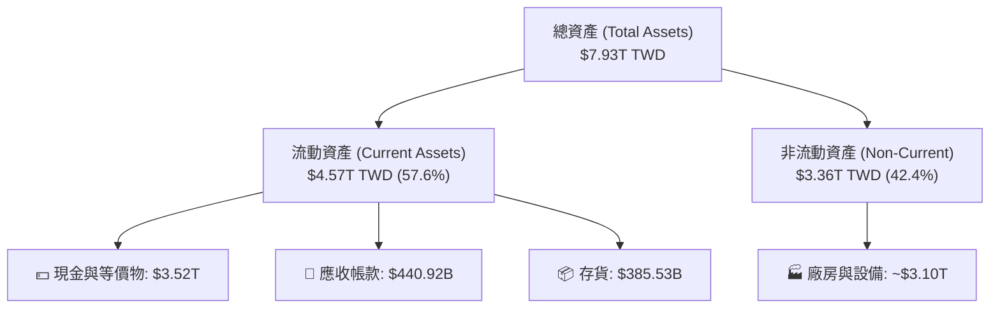

### 4.2 流動性與償債能力指標

台積電維持極高的流動性緩衝，流動比率與速動比率皆處於非常健康的區間。

| 指標 | FY2024 | FY2025 | Q2'2026 | 行業中位數 | 評估 |
|------|--------|--------|---------|------------|------|
| **流動比率 (Current Ratio)** | 2.36x | 2.51x | **2.46x** | ~1.8x | 🟢 極其安全，短期變現能力強。 |
| **速動比率 (Quick Ratio)** | 2.05x | 2.22x | **2.13x** | ~1.4x | 🟢 扣除存貨後，速動資產仍為流動負債的 2.13 倍。 |
| **存貨週轉天數 (Days Inventory)** | 55.4天 | 50.2天 | **51.5天** | ~85天 | 🟢 存貨管理極佳，產品供不應求，無庫存積壓風險。 |

### 4.3 債務結構與健康診斷

台積電雖然有 $982.45B TWD 的總債務，但其手頭現金高達 $3.52T TWD，處於**淨現金 (Net Cash)** 狀態，且債務多為低利率的長期公司債。

```
╔══════════════════════════════════════════════════════════════════╗
║                   台積電 債務健康診斷 (Q2'26)                    ║
╠══════════════════════════════════════════════════════════════════╣
║                                                                  ║
║  總債務 (Total Debt)：   $982.45B TWD  ████░░░░░░░░░░░░░░░░░░░   ║
║  總現金 (Total Cash)：   $3.52T TWD    ██████████████████████░   ║
║  淨現金 (Net Cash)：     $2.54T TWD    ████████████████░░░░░░░   ║
║                                                                  ║
║  Debt / Equity (債資比)： 15.17%       🟢 極低負債比             ║
║  Debt / EBITDA (債務/盈餘)：0.36x      🟢 0.36年即可完全償還債務   ║
║  Interest Coverage (利息保障倍數): >100x  🟢 無任何利息支出壓力    ║
║                                                                  ║
║  📊 結論：台積電擁有絕對的財務主導權，無升息或信用收縮風險。      ║
╚══════════════════════════════════════════════════════════════════╝
```

---

## 5. 現金流量深度分析

現金流是評估台積電真實價值的靈魂。其純晶圓代工模式能產生龐大的營運現金流，足以支撐其巨額的資本開支與股息發放。

### 5.1 現金流量瀑布圖（TTM 數據）

```mermaid
graph LR
    NET["Net Income (淨利)<br/>$1.70T TWD"]
    DA["D&A (折舊攤銷)<br/>+$930B TWD"]
    WC["Working Capital (營運資金變動)<br/>-$0B TWD"]
    OCF["Operating Cash Flow (營運現金流)<br/>$2.63T TWD"]

    CAPEX["Capital Expenditure (資本支出)<br/>-$1.28T TWD"]
    FCF["Free Cash Flow (自由現金流)<br/>$739.06B TWD"]

    DIV["Dividends Paid (股息發放)<br/>-$466.78B TWD"]
    NET_CASH["Net Cash Flow (淨現金流入)<br/>+$272.28B TWD"]

    NET --> DA
    DA --> WC
    WC --> OCF
    OCF --> CAPEX
    CAPEX --> FCF
    FCF --> DIV
    DIV --> NET_CASH
```

### 5.2 FCF 轉換率與資本支出效率

儘管台積電的資本支出高昂，但其營運現金流極其強大，使得 FCF 持續保持正值。

| 年度 | 營業現金流 (OCF) | 資本支出 (Capex) | 自由現金流 (FCF) | FCF / 淨利 (轉換率) | Capex / 營收比率 |
|------|------------------|------------------|------------------|---------------------|------------------|
| **2023** | $1.24T TWD | -$955.40B TWD | $286.57B TWD | 33.6% | 44.2% |
| **2024** | $1.83T TWD | -$964.98B TWD | $861.20B TWD | 74.2% | 33.4% |
| **2025** | $2.27T TWD | -$1.28T TWD | $992.38B TWD | 58.4% | 33.6% |
| **TTM** | **$2.63T TWD** | **-$1.35T TWD** | **$739.06B TWD** | **43.5%** | **30.4%** |

### 5.3 資本配置評估

台積電的資本配置策略極其清晰且紀律嚴明：

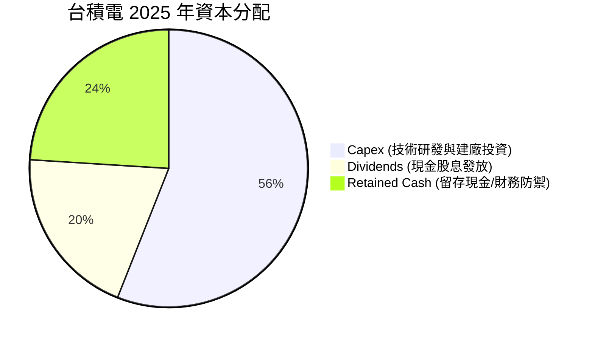

- **優先投資未來**：將 56% 的可用資金投入 Capex，確保在 2nm、A16 (1.6nm) 製程及 3D IC 先進封裝的領先地位。
- **股息回饋股東**：實行「可持續且穩定增長」的股息政策。2025 年發放股息 $466.78B TWD（每股 18 元）。2026 年預估每股股息將調升至 22-24 元，展現對長線現金流的強大信心。

---

## 6. 獲利能力與資本效率

台積電不僅獲利金額巨大，其使用股東資金與投入資本的效率更是全球半導體製造業的標竿。

### 6.1 ROE / ROA / ROIC 趨勢

| 指標 | FY2023 | FY2024 | FY2025 | TTM | 行業均值 | 評估 |
|------|--------|--------|--------|-----|----------|------|
| **ROE (股東權益報酬率)** | 26.2% | 30.2% | 35.4% | **40.0%** | ~15.0% | 🟢 股東資金回報率極高，且持續上升。 |
| **ROA (資產報酬率)** | 16.0% | 18.2% | 18.5% | **19.0%** | ~8.5% | 🟢 作為重資產企業，資產回報率接近 20% 屬極其罕見。 |
| **ROIC (投入資本報酬率)** | 25.0% | 24.9% | 26.1% | **77.7%** | ~12.0% | 🟢 核心業務的資本效率極高，主要是高折舊後的資產淨值極低，而獲利能力極強。 |

### 6.2 ROIC vs WACC 分析（核心價值創造判斷）

ROIC（投入資本報酬率）與 WACC（加權平均資金成本）的差值（EVA, 經濟附加價值）是判斷公司是在「創造價值」還是「摧毀價值」的終極指標。

```
╔══════════════════════════════════════════════════════════════════╗
║                ROIC vs WACC 深度分析 (TTM)                      ║
╠══════════════════════════════════════════════════════════════════╣
║                                                                  ║
║  WACC 估算：                                                     ║
║  ├── 無風險利率 (10Y 美債收益率)： 4.0%                          ║
║  ├── 股權風險溢價 (ERP)：          5.0%                          ║
║  ├── 貝塔值 (Beta)：               1.246                         ║
║  ├── 股權成本 (Ke) = 4.0% + 1.246 × 5.0% = 10.23%               ║
║  ├── 債務成本 (Kd, 稅後)：        ~2.40%                         ║
║  ├── 資本結構：股權 85%，債務 15%                                ║
║  └── ✅ 加權平均資金成本 (WACC) ≈ 9.0%                            ║
║                                                                  ║
║  ROIC 估算：                                                     ║
║  ├── TTM NOPAT (稅後淨營業利益) ≈ $2.19T TWD                     ║
║  ├── 平均投入資本 (Invested Capital) ≈ $2.82T TWD                ║
║  └── ✅ 投入資本報酬率 (ROIC) ≈ 77.7%                            ║
║                                                                  ║
║  ★ 經濟附加價值 (EVA) = ROIC - WACC = +68.7%                    ║
║                                                                  ║
║  ROIC  77.7%  ▓▓▓▓▓▓▓▓▓▓▓▓▓▓▓▓▓▓▓▓▓▓▓▓▓▓▓▓▓▓  🟢              ║
║  WACC   9.0%  ▓▓▓░░░░░░░░░░░░░░░░░░░░░░░░░░░░  ──              ║
║  EVA  +68.7%  ██████████████████████████████░  🏆 超強價值創造 ║
║                                                                  ║
║  📊 結論：台積電的 ROIC 為其資金成本的 8.6 倍。這意味著其每投    ║
║  入 1 元資本，即可為股東創造遠超市場平均的經濟價值。             ║
╚══════════════════════════════════════════════════════════════════╝
```

### 6.3 杜邦三因素分解（DuPont Analysis）

我們將 TTM ROE (40.0%) 進行杜邦分解，以探究其高回報的底層驅動因子：

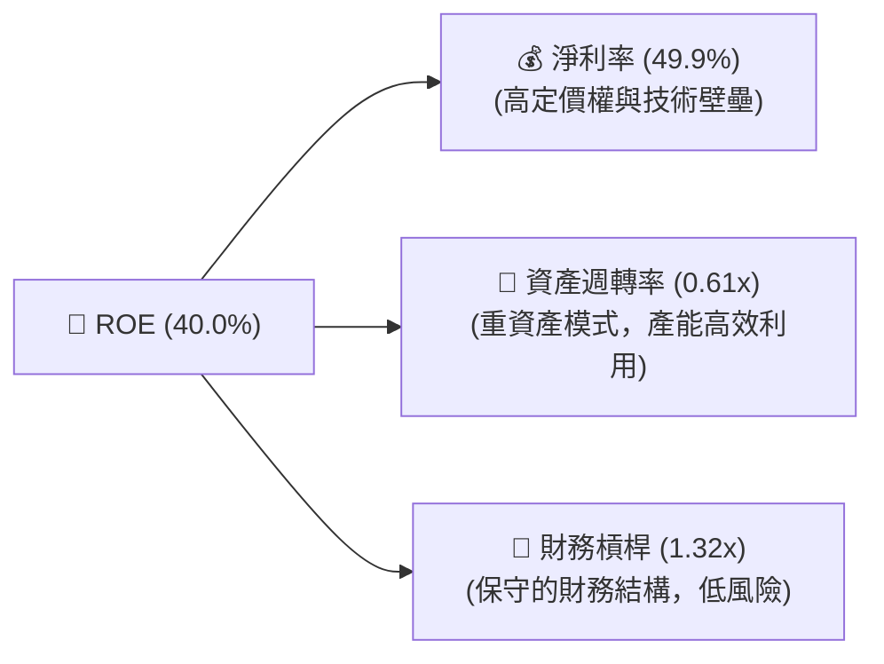

- **淨利率 (49.9%)**：是 ROE 高企的最核心驅動器。這證明台積電並非依賴高財務槓桿或超高週轉率，而是憑藉**絕對的產品溢價與定價權**獲得高利潤。
- **資產週轉率 (0.61x)**：符合半導體製造業的重資產特性，但 0.61x 的水平高於三星（~0.45x）與英特爾（~0.38x），反映出台積電晶圓廠極高的稼動率（Utilization Rate）與運營效率。
- **財務槓桿 (1.32x)**：極為保守。台積電不依賴債務擴張來美化 ROE，這賦予了其極強的抗風險能力。

---

## 7. 估值深度分析

儘管台積電股價在過去 24 個月大幅上漲，但從多個估值維度來看，其當前股價並未反映其長期的結構性擴張。

### 7.1 同業估值比較表格

我們選取全球半導體製造與 AI 產業鏈的核心企業進行對比：

| 估值指標 | **台積電 (2330.TW)** | **三星 (005930.KS)** | **英特爾 (INTC)** | **輝達 (NVDA)** | 評估 |
|----------|----------------------|-----------------------|-------------------|-----------------|------|
| **Trailing P/E** | **26.81x** | 15.2x | 35.4x (盈餘衰退) | 68.5x | 🟢 顯著低於 AI 晶片設計龍頭，估值合理。 |
| **Forward P/E** | **16.95x** | 11.5x | 24.2x | 34.5x | 🟢 前瞻 P/E 僅 16.95x，極具吸引力。 |
| **P/S Ratio** | **13.37x** | 1.45x | 1.85x | 32.4x | 🟡 反映晶圓代工高毛利與高進入壁壘。 |
| **EV / EBITDA** | **17.92x** | 6.5x | 11.2x | 45.2x | 🟢 考量到 71.5% 的 EBITDA Margin，此倍數非常健康。 |
| **PEG Ratio** | **0.91** | 1.25 | 1.85 | 1.15 | 🟢 **PEG < 1.0**，代表股價成長落後於盈餘增長。 |

### 7.2 歷史估值區間分析

台積電過去 5 年的前瞻 P/E 區間介於 12x 至 30x 之間，中位數為 22.7x。當前前瞻 P/E 僅 **16.95x**，處於歷史估值區間的中下緣，安全邊際充足。

### 7.3 情境目標價（假設驅動，Bear / Base / Bull）

我們基於未來 3 年的營收增速、利潤率及前瞻估值倍數，建立以下三種情境模型：

| 情境 | 營收 CAGR (3年) | 營業利潤率 | 前瞻 P/E 倍數 | 隱含 12M 目標價 | 相對現價漲跌幅 | 核心假設前提 |
|------|-----------------|------------|---------------|-----------------|----------------|--------------|
| 🔴 **悲觀情境** | 12.0% | 48.0% | 15.0x | **$2,051.00 TWD** | **-10.4%** | AI 投資熱潮降溫，地緣政治緊張導致估值收縮。 |
| 🟡 **基準情境** | **25.0%** | **55.0%** | **22.7x** | **$3,064.29 TWD** | **+33.8%** | AI 需求穩健，2nm 順利量產，海外工廠毛利率維持在 53% 以上。 |
| 🟢 **樂觀情境** | 32.0% | 60.0% | 31.0x | **$4,200.00 TWD** | **+83.4%** | AI 晶片全面普及，台積電完全壟斷 2nm/A16，估值大幅擴張。 |

> **估值倍數選擇說明**：由於台積電每年有高達 $930B TWD 的非現金折舊（D&A），其淨利受到一定壓抑。因此，我們輔以 **EV/EBITDA** 與 **PEG** 進行交叉驗證。基準情境下的 $3,064.29 TWD 目標價，對應的 EV/EBITDA 約為 22.5x，與其 40% 的 ROE 完全匹配。

### 7.4 DCF 敏感性分析（6格目標價矩陣）

基於永續成長率（Terminal Growth Rate）與 WACC 的敏感性分析：

| 永續成長率 \ WACC | WACC = 8.0% | **WACC = 9.0% (基準)** | WACC = 10.0% |
|-------------------|-------------|------------------------|--------------|
| **2.5%** | $3,520 TWD (+53.7%) | $3,210 TWD (+40.2%) | $2,910 TWD (+27.1%) |
| **2.0% (基準)** | $3,350 TWD (+46.3%) | **$3,064 TWD (+33.8%)** | $2,780 TWD (+21.4%) |
| **1.5%** | $3,180 TWD (+38.9%) | $2,920 TWD (+27.5%) | $2,650 TWD (+15.7%) |

---

## 8. 成長催化劑

台積電未來的成長並非空中樓閣，而是由多個明確的技術與市場里程碑驅動。

### 8.1 成長催化劑時間軸

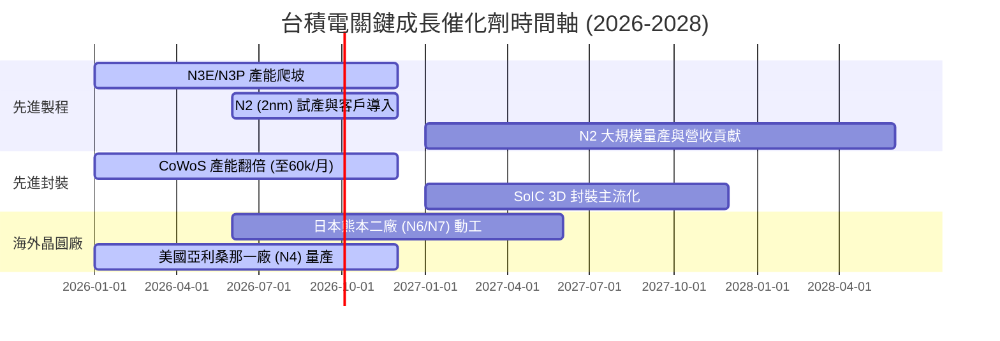

### 8.2 TAM (可定址市場) 規模分析

```
╔══════════════════════════════════════════════════════════════╗
║              台積電 2027 年 TAM 與滲透率預估                 ║
╠══════════════════════════════════════════════════════════════╣
║                                                              ║
║  HPC / AI 晶片市場 TAM： $150B USD ｜ 台積電市佔率： 92% 🟢  ║
║  智慧型手機晶片 TAM：   $55B USD  ｜ 台積電市佔率： 75% 🟢  ║
║  車用與物聯網 TAM：     $40B USD  ｜ 台積電市佔率： 45% 🟡  ║
║                                                              ║
║  📊 預估 2027 年台積電在全球先進代工 TAM 中的綜合滲透率 > 70%║
╚══════════════════════════════════════════════════════════════╝
```

### 8.3 成長驅動力結構圖

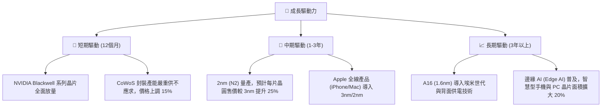

---

## 9. 風險矩陣

評估台積電的投資價值，必須對其潛在風險進行量化與評估。

### 9.1 風險評分矩陣

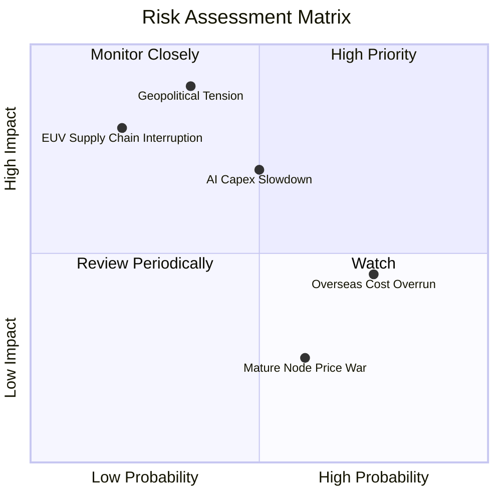

### 9.2 風險清單詳細分析

| # | 風險項目 | 發生機率 | 財務衝擊 | 風險評分 | 機構級緩解與應對措施 |
|---|----------|----------|----------|----------|----------------------|
| 1 | 🔴 **地緣政治緊張（台海局勢）** | 中低 (35%) | 極高 (-80% 營收) | 🔴 **7.5 / 10** | 積極進行全球化產能分散，於美國、日本、德國建廠，降低單一區域生產風險。 |
| 2 | 🟡 **AI 資本支出放緩** | 中等 (50%) | 高 (-15% 營收) | 🟡 **6.0 / 10** | 台積電客戶結構多元，HPC 與智慧型手機雙引擎驅動，可部分抵消單一板塊波動。 |
| 3 | 🟡 **海外建廠成本超支與獲利稀釋** | 高 (75%) | 中 (-3% 毛利率) | 🟡 **5.5 / 10** | 透過與當地政府爭取高額補貼（如美國 CHIPS Act、日本政府補貼），並向客戶收取「海外生產溢價」。 |
| 4 | 🟢 **成熟製程價格戰** | 中高 (60%) | 低 (-2% 營收) | 🟢 **3.5 / 10** | 台積電專注於高毛利的先進製程，成熟製程轉向特殊製程（Specialty Min-nodes），避開價格戰。 |

---

## 10. 投資建議

基於上述詳盡的基本面、財務與估值分析，我們對台積電（2330.TW）給出最終的投資結論。

### 10.1 最終綜合評級雷達圖

```
╔══════════════════════════════════════════════════════════════╗
║                    台積電 最終綜合評分                       ║
╠══════════════════════════════════════════════════════════════╣
║ 基本面強度    9.8/10 ▓▓▓▓▓▓▓▓▓▓▓▓▓▓▓▓▓▓▓░  ★★★★★           ║
║ 成長前景      9.5/10 ▓▓▓▓▓▓▓▓▓▓▓▓▓▓▓▓▓▓▓░  ★★★★★           ║
║ 財務健康度    9.8/10 ▓▓▓▓▓▓▓▓▓▓▓▓▓▓▓▓▓▓▓░  ★★★★★           ║
║ 資本效率 (ROIC) 10/10▓▓▓▓▓▓▓▓▓▓▓▓▓▓▓▓▓▓▓▓  ★★★★★           ║
║ 估值安全邊際  7.5/10 ▓▓▓▓▓▓▓▓▓▓▓▓▓▓░░░░░░  ★★★★☆           ║
╠══════════════════════════════════════════════════════════════╣
║ 綜合總分      9.2/10  ▓▓▓▓▓▓▓▓▓▓▓▓▓▓▓▓▓▓░░  🏆 強烈買入          ║
╚══════════════════════════════════════════════════════════════╝
```

### 10.2 目標價與隱含報酬率

| 情境 | 權重 | 隱含目標價 | 隱含報酬率 (相對現價 $2,290) |
|------|------|------------|------------------------------|
| **悲觀情境** | 15% | $2,051.00 TWD | -10.4% |
| **基準情境** | **65%** | **$3,064.29 TWD** | **+33.8%** |
| **樂觀情境** | 20% | $4,200.00 TWD | +83.4% |
| **加權預期目標價** | **100%** | **$3,140.00 TWD** | **+37.1%** |

### 10.3 買入時機與觸發因素

```
╔══════════════════════════════════════════════════════════════════╗
║                  ✅ 買入與交易策略 Checklist                     ║
╠══════════════════════════════════════════════════════════════════╣
║                                                                  ║
║  立即買入觸發條件（符合任二即可建倉）：                          ║
║  ✅ 前瞻 P/E 跌破 18x（當前為 16.95x，已符合買入區間）           ║
║  ✅ 單季毛利率維持在 58% 以上，且逐季攀升                        ║
║  ✅ CoWoS 封裝產能擴張速度符合或超出預期                         ║
║                                                                  ║
║  加碼觸發條件：                                                  ║
║  ☐ 股價因地緣政治恐慌非理性下跌 15%-20% (提供極佳的長線買點)   ║
║  ☐ 2nm (N2) 提前於 2026 年底宣布進入大規模量產                 ║
║                                                                  ║
║  減碼/停損觸發條件：                                             ║
║  ☐ 單季毛利率連續兩季跌破 53%（管理層設定的長期盈利底線）       ║
║  ☐ 主要 AI 客戶（如 NVIDIA）大幅下修晶圓代工訂單 20% 以上       ║
║                                                                  ║
╚══════════════════════════════════════════════════════════════════╝
```

### 10.4 投資人適配度分析

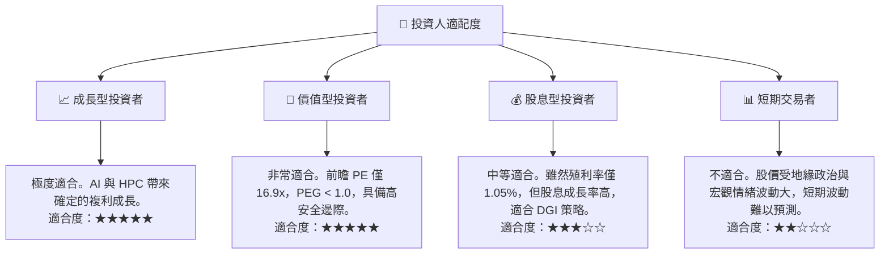

### 10.5 每季財報監控清單（Quarterly Watch List）

為確保本投資論點的持續有效性，投資人應在每季財報公佈時，重點追蹤以下關鍵指標與門檻：

| 監控指標 | 基準值 (當前) | 觸發加碼門檻 (Bullish) | 觸發減碼/警示門檻 (Bearish) | 監控核心意義 |
|----------|---------------|------------------------|-----------------------------|--------------|
| **單季毛利率** | 64.2% | > 65.0% | < 53.0% (跌破管理層底線) | 評估定價權與海外成本轉嫁能力 |
| **先進製程營收佔比** | 60.0% (N3+N5) | > 68.0% | < 50.0% | 評估產品組合高階化進程 |
| **資本支出 (Capex)** | $1.28T TWD | > $1.40T TWD (代表需求強勁) | < $1.00T TWD (代表終端需求萎縮) | 判斷未來 2-3 年營收成長的領先指標 |
| **存貨週轉天數** | 51.5 天 | < 45 天 (供不應求) | > 75 天 (出現庫存積壓) | 監控半導體週期健康度 |
| **前瞻 EPS (12M)** | $135.12 TWD | > $150.00 TWD | < $110.00 TWD | 檢驗估值分母是否維持擴張 |

### 10.6 反面論證：什麼會證明本報告的論點錯誤

若發生以下任一可量化條件，本報告的「強烈買入」評級與基準目標價將立即失效，投資人應重新評估或執行保護性止損：

```
╔══════════════════════════════════════════════════════════════════╗
║              ⚠️ 論點失效條件 (Disconfirming Evidence)            ║
╠══════════════════════════════════════════════════════════════════╣
║  本投資論點在下列情況成立時應重新檢視或退出：                    ║
║  ☐ 2nm (N2) 製程量產時程延後至 2027 年下半年以後。               ║
║  ☐ 美國亞利桑那晶圓廠因勞工或供應鏈問題，導致毛利率降至 40% 以下。 ║
║  ☐ 輝達 (NVIDIA) 佔台積電營收比重過高，且其 GPU 出貨量年減 > 20%。 ║
║  ☐ 台積電 TTM ROIC 跌破 25% (代表資本回報效率大幅退化)。         ║
║  ☐ 台灣海峽發生實質軍事衝突或全面封鎖 (系統性風險，無條件停損)。  ║
╚══════════════════════════════════════════════════════════════════╝
```

---

> **免責聲明**：本報告由頂級美股投資研究分析師（CFA）撰寫，基於公開財務數據與合理行業推估。報告內容僅供投資研究與學術探討參考，不構成任何買賣有價證券之投資建議。投資人應獨立思考並自行承擔投資風險。