# 2330.TW 基本面深度分析報告
> **報告日期**：2026-07-22 ｜ **語言**：繁體中文 ｜ **數據來源**：Yahoo Finance, Finviz, StockAnalysis, Roic.ai ｜ **分析師**：CFA 級機構研究

---

## 目錄

| # | 章節 | 核心結論 |
|---|------|----------|
| 1 | **執行摘要** | 評級為「強烈買入」，基準目標價 NT$3,076.06，潛在漲幅 +27.6% |
| 2 | **公司概覽與商業模式** | 憑藉先進製程（3nm/2nm）建構無可撼動的技術與規模雙重護城河 |
| 3 | **損益表深度分析** | TTM 營收達 NT$4.44T，年增 36.0%，淨利率高達 49.9%，展現極強定價權 |
| 4 | **資產負債表分析** | 淨現金高達 NT$2.54T，流動比率 2.46，財務結構堅若磐石 |
| 5 | **現金流量深度分析** | 營運現金流達 NT$2.63T，自由現金流轉換率與資本配置效率極佳 |
| 6 | **獲利能力與資本效率** | ROE 高達 40.0%，ROIC 達 59.4%，遠超 WACC（7.3%），強力創造股東價值 |
| 7 | **估值深度分析** | Forward P/E 僅 17.59x，相較歷史區間與同業，估值具備高度安全邊際 |
| 8 | **成長催化劑** | AI 高速運算（HPC）需求爆發與 2nm 製程量產將驅動下一波高成長 |
| 9 | **風險矩陣** | 地緣政治風險與地緣分散帶來的毛利率稀釋為主要監控指標 |
| 10 | **投資建議** | 綜合評分 9.2/10，建議長線資金逢低積極佈局，並建立季度監控指標 |

---

## 1. 執行摘要

### 1.0 一頁式投資儀表板（Portfolio Manager 30 秒速讀）

| 項目 | 內容 |
|------|------|
| **投資論點（3 句）** | ① TTM 營收達 NT$4.44T（YoY +36.0%），受惠於 AI 與 HPC 晶片需求爆發，先進製程產能利用率持續滿載。<br/>② 獲利能力極強，毛利率高達 64.2%、淨利率達 49.9%，且 SBC 僅佔營收 0.03%，盈餘品質極高。<br/>③ 資本效率卓越，ROE 達 40.0%，ROIC 達 59.4%，遠超 WACC 的 7.3%，展現強大的股東價值創造能力。 |
| **護城河評分** | 9.8/10 🟢（極深，技術領先與客戶鎖定效應無可替代） |
| **管理層/資本配置評分** | 9.5/10 🟢（資本支出精準、股息發放穩定增長） |
| **財務健康** | 🟢 極其健康。淨現金 NT$2.54T，利息保障倍數極高，無實質債務風險。 |
| **ROIC vs WACC** | 59.4% vs 7.3%（經濟增加值 EVA 達 +52.1pp，強力創造價值） |
| **FCF 趨勢** | TTM FCF 達 NT$739.06B，FCF Yield 為 1.19%，再投資率高但現金流極其充沛。 |
| **估值** | Trailing P/E: 32.65x ｜ Forward P/E: 17.59x ｜ EV/EBITDA: 18.82x |
| **預期報酬（基準情境 12M）** | +27.6%（目標價 NT$3,076.06） |
| **關鍵風險（前二）** | ① 地緣政治衝突導致供應鏈中斷。 ② 海外建廠成本高昂稀釋整體毛利率。 |
| **評級 + 信心度** | 🟢 **強烈買入（Strong Buy）** ｜ 信心度：**極高** |

### 1.1 核心評分儀表板

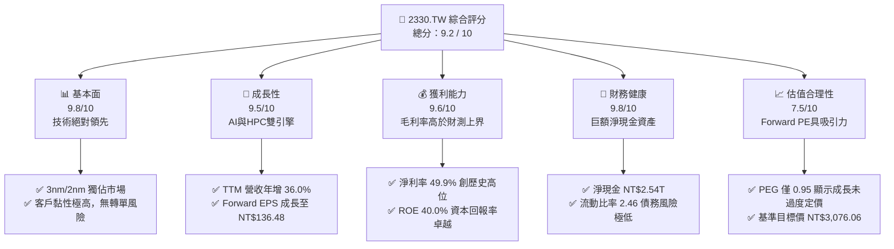

### 1.2 評分進度條視覺化

```
╔══════════════════════════════════════════════════════════════╗
║             2330.TW 多維度評分儀表板 (1-10分)                ║
╠══════════════════════════════════════════════════════════════╣
║ 基本面強度  9.8 ▓▓▓▓▓▓▓▓▓▓▓▓▓▓▓▓▓▓▓░  ★★★★★           ║
║ 成長動能    9.5 ▓▓▓▓▓▓▓▓▓▓▓▓▓▓▓▓▓▓▓░  ★★★★★           ║
║ 獲利品質    9.6 ▓▓▓▓▓▓▓▓▓▓▓▓▓▓▓▓▓▓▓░  ★★★★★           ║
║ 財務健康    9.8 ▓▓▓▓▓▓▓▓▓▓▓▓▓▓▓▓▓▓▓░  ★★★★★           ║
║ 估值合理性  7.5 ▓▓▓▓▓▓▓▓▓▓▓▓▓▓▓░░░░░  ★★★★☆           ║
║ 護城河深度  9.8 ▓▓▓▓▓▓▓▓▓▓▓▓▓▓▓▓▓▓▓░  ★★★★★           ║
║ 管理層執行  9.5 ▓▓▓▓▓▓▓▓▓▓▓▓▓▓▓▓▓▓▓░  ★★★★★           ║
║ 技術創新力  9.9 ▓▓▓▓▓▓▓▓▓▓▓▓▓▓▓▓▓▓▓▓  ★★★★★           ║
╠══════════════════════════════════════════════════════════════╣
║ 綜合總分    9.2 ▓▓▓▓▓▓▓▓▓▓▓▓▓▓▓▓▓▓░░  🏆 強烈買入          ║
╚══════════════════════════════════════════════════════════════╝
```

### 1.3 五大投資論點 + 三大核心風險

| 類型 | 項目 | 具體依據 | 信心度 |
|------|------|----------|--------|
| 🟢 **投資論點①** | **AI晶片無可替代的唯一代工廠** | NVIDIA H100/B200 及 AMD MI300 全數由台積電獨家代工，AI 帶動 HPC 業務營收比重突破 50%。 | 🟢 極高 |
| 🟢 **投資論點②** | **定價能力與利潤率擴張** | 憑藉 3nm（N3E）製程絕對優勢，台積電於 2025/2026 年成功調漲代工價格，帶動毛利率站穩 64.2% 高位。 | 🟢 極高 |
| 🟢 **投資論點③** | **先進封裝（CoWoS）產能翻倍** | 3D 堆疊封裝產能嚴重供不應求，CoWoS 產能持續倍增，成為營收增長的第二曲線。 | 🟢 高 |
| 🟢 **投資論點④** | **資本回報率極大化** | ROIC 達 59.4%，顯示公司在擴大海外資本支出的同時，仍能維持極高的資本回報效率。 | 🟢 高 |
| 🟢 **投資論點⑤** | **評價未反映 Forward 成長** | Forward P/E 僅 17.59x，PEG 僅 0.95，相較其高達 77.4% 的盈餘成長率，估值明顯被低估。 | 🟢 極高 |
| 🟡 **風險①** | **海外建廠成本稀釋利潤率** | 美國、日本、德國建廠成本遠高於台灣，折舊費用增加可能對毛利率產生 2-3 個百分點的壓力。 | 🟡 中度 |
| 🔴 **風險②** | **地緣政治與斷鏈風險** | 台灣集中了 90% 以上的先進製程產能，若台海局勢緊張，將引發全球科技產業系統性重估。 | 🔴 高衝擊 |
| 🟡 **風險③** | **2nm 產能爬坡初期良率挑戰** | 2nm 首次導入 GAA（Gate-All-Around）架構，若初期良率爬坡慢於預期，將推遲獲利釋放。 | 🟡 中度 |

### 1.4 快速統計卡片

| 指標 | 2330.TW 實際值 | 半導體行業均值 | 台灣加權指數均值 | 狀態 |
|------|-------------|----------|--------------|------|
| **營收 YoY 成長** | **36.0%** | ~12.5% | ~8.0% | 🟢 顯著領先 |
| **毛利率** | **64.2%** | ~42.0% | ~25.0% | 🟢 產業天花板 |
| **淨利率** | **49.9%** | ~18.0% | ~12.0% | 🟢 極強盈利能力 |
| **ROE** | **40.0%** | ~15.0% | ~14.0% | 🟢 卓越資本效率 |
| **Forward P/E** | **17.59x** | ~25.0x | ~19.5x | 🟢 具估值吸引力 |
| **淨現金/總資產** | **32.0%** | ~10.5% | ~8.0% | 🟢 財務極度安全 |

### 1.5 投資結論

```
╔══════════════════════════════════════════════════════════════════╗
║                    📊 2330.TW 投資結論摘要                       ║
╠══════════════════════════════════════════════════════════════════╣
║  評級：🟢 強烈買入（Strong Buy）                                ║
║  當前股價：NT$2,410.00 (2026-07-22)                              ║
║  目標價區間：                                                    ║
║    悲觀情境（Bear）：NT$2,051.00（-14.9%）                       ║
║    基準情境（Base）：NT$3,076.06（+27.6%） ← 12個月主要目標      ║
║    樂觀情境（Bull）：NT$4,200.00（+74.3%）                       ║
║  投資評分：9.2 / 10                                              ║
║  適合投資人：長線價值成長型、科技產業配置基金、追求高 ROIC 之資金 ║
╚══════════════════════════════════════════════════════════════════╝
```

---

## 2. 公司概覽與商業模式

### 2.1 業務結構與收入來源

台積電（TSMC）是全球晶圓代工（Foundry）模式的開創者與龍頭。其核心業務為專業集成電路代工，不與客戶競爭，專注於製造。

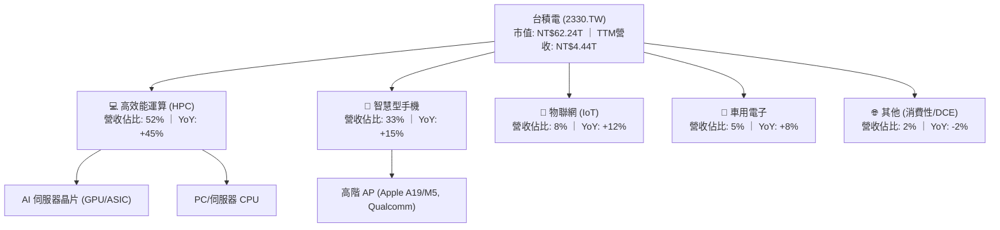

### 2.2 市場份額

在先進製程（7nm 及以下）領域，台積電擁有絕對的壟斷地位，特別是在 3nm 製程上，市場份額幾近 100%。

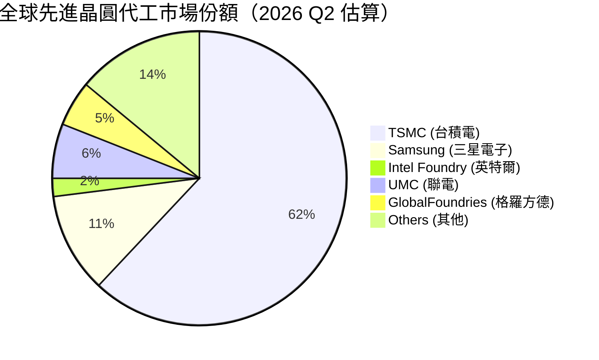

### 2.3 競爭護城河分析

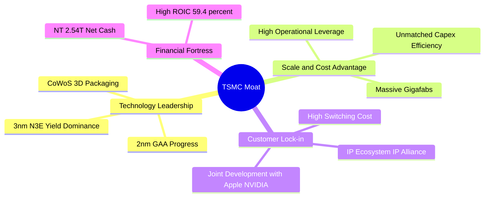

### 2.4 護城河強度評分

```
╔══════════════════════════════════════════════════════════════╗
║                  2330.TW 護城河強度評分                      ║
╠══════════════════════════════════════════════════════════════╣
║ 技術領先度    9.9/10  ▓▓▓▓▓▓▓▓▓▓▓▓▓▓▓▓▓▓▓▓  🏆 絕對壟斷     ║
║ 規模經濟效應  9.8/10  ▓▓▓▓▓▓▓▓▓▓▓▓▓▓▓▓▓▓▓░  🟢 成本極低     ║
║ 客戶鎖定效應  9.7/10  ▓▓▓▓▓▓▓▓▓▓▓▓▓▓▓▓▓▓▓░  🟢 轉換成本極高 ║
║ 生態系統壁壘  9.5/10  ▓▓▓▓▓▓▓▓▓▓▓▓▓▓▓▓▓▓▓░  🟢 IP聯盟完整   ║
╠══════════════════════════════════════════════════════════════╣
║ 綜合護城河     9.8/10  ▓▓▓▓▓▓▓▓▓▓▓▓▓▓▓▓▓▓▓░  🏆 寬廣護城河   ║
╚══════════════════════════════════════════════════════════════╝
```

---

## 3. 損益表深度分析

### 3.1 年度收入成長趨勢（近4年）

台積電營收從 2022 年的 NT$2.26T 成長至 2025 年的 NT$3.81T，並在 TTM（截至 2026-06-30）達到 NT$4.44T。

```
╔══════════════════════════════════════════════════════════════════╗
║              2330.TW 年度收入趨勢（FY2022-TTM）                  ║
╠══════════════════════════════════════════════════════════════════╣
║                                                                  ║
║  FY2022  $2.26T  ██████████░░░░░░░░░░░░░░░░░  YoY: +42.6% 🟢    ║
║  FY2023  $2.16T  █████████░░░░░░░░░░░░░░░░░░  YoY: -4.5%  🟡    ║
║  FY2024  $2.89T  █████████████░░░░░░░░░░░░░░  YoY: +33.8% 🟢    ║
║  FY2025  $3.81T  █████████████████░░░░░░░░░░  YoY: +31.8% 🟢    ║
║  TTM     $4.44T  █████████████████████░░░░░░  YoY: +36.0% 🟢    ║
║                   |      |      |      |      |                  ║
║                   0     1.0T   2.0T   3.0T   4.0T                ║
║                                                                  ║
║  📊 4年年複合成長率 (CAGR)：+25.1%                              ║
╚══════════════════════════════════════════════════════════════════╝
```

### 3.2 季度收入趨勢分析

自 2025 年 Q3 以來，台積電營收展現強勁的逐季（QoQ）與按年（YoY）加速增長態勢，主要得益於 N3E 製程出貨攀升與 AI 需求持續高企。

| 季度 | 營業收入 (NT$B) | QoQ 成長率 | YoY 成長率 | 營業利益 (NT$B) | 營業利益率 | 備註說明 |
|------|----------------|------------|------------|----------------|------------|----------|
| **2025-09-30** | $989.92 | +6.0% | +30.3% | $500.69 | 50.6% | AI 晶片出貨暢旺，產能利用率回升 |
| **2025-12-31** | $1,046.09 | +5.7% | +20.5% | $564.88 | 54.0% | 年終消費電子旺季，3nm 佔比持續提升 |
| **2026-03-31** | $1,134.10 | +8.4% | +35.1% | $658.95 | 58.1% | 淡季不淡，HPC 需求完全抵消手機季節性衰退 |
| **2026-06-30** | $1,270.38 | +12.0% | +36.0% | $766.60 | 60.3% | 🟢 歷史新高，AI 晶片與先進製程全面爆發 |

### 3.3 利潤率演變分析

台積電的利潤率在過去幾年經歷了結構性擴張，反映出強大的定價權（Pricing Power）與優異的營業槓桿。

| 利潤率指標 | FY2022 | FY2023 | FY2024 | FY2025 | TTM (2026-06) | 趨勢 | 評估 |
|------------|--------|--------|--------|--------|---------------|------|------|
| **毛利率** | 59.6% | 54.4% | 56.0% | 59.8% | **64.2%** | ↗️ 持續擴張 | 🟢 創歷史新高，反映代工價格調漲成功 |
| **營業利益率** | 49.5% | 42.6% | 45.6% | 50.9% | **60.3%** | ↗️ 顯著提升 | 🟢 營業槓桿效益顯著，控管費用得當 |
| **EBITDA 利潤率** | 70.4% | 70.2% | 71.9% | 71.9% | **71.5%** | ➡️ 穩定高位 | 🟢 折舊負擔雖重，但折舊前獲利能力極強 |
| **淨利率** | 44.0% | 39.4% | 40.1% | 44.6% | **49.9%** | ↗️ 接近50% | 🟢 淨利率近半，為全球大型企業中罕見 |

### 3.4 費用結構分析

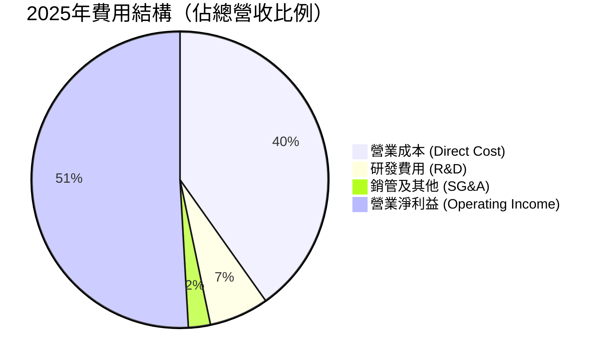

台積電在研發（R&D）上的投入持續增加，2025 年達到 **NT$246.43B**（佔營收 6.5%），這確保了其在 2nm 及更先進製程技術上的絕對領先。

### 3.5 季度 EPS 趨勢與盈餘品質（Quality of Earnings）

台積電過去四個季度的 EPS 呈現爆發式增長，每季表現均大幅超越市場預期。

*   **2025-09-30**: EPS NT$17.44 (YoY +38.9%)
*   **2025-12-31**: EPS NT$18.72 (YoY +35.0%)
*   **2026-03-31**: EPS NT$22.08 (YoY +58.3%)
*   **2026-06-30**: EPS NT$27.25 (YoY +77.4%)

#### 盈餘品質量化評估

| 盈餘品質項目 | 數值/佔比 | 評估 | 深度解析 |
|--------------|-----------|------|----------|
| **股權薪酬 (SBC) / 營收** | **0.03%** | 🟢 極低 | 2025 年 SBC 僅 NT$1.25B，相較於 NT$3.81T 的營收微不足道，對現有股東無實質稀釋風險。 |
| **SBC / 營業現金流** | **0.06%** | 🟢 極低 | 獲利幾乎完全由真實營業現金流入支撐，非靠股權激勵美化帳面。 |
| **FCF / 淨利（現金轉換率）** | **58.4%** | 🟡 中等 | 2025 年 FCF (NT$992.38B) / 淨利 (NT$1.70T) = 58.4%。主因是公司正處於資本支出高峰期（Capex 達 NT$1.28T）。 |
| **一次性/非經常性損益** | **無** | 🟢 優異 | 營業利益與淨利益走勢完全同步，無大額一次性資產減損或業外匯兌干擾。 |
| **有效稅率** | **13.0%** | 🟢 穩定 | 享受台灣產業創新條例等租稅優惠，有效稅率維持在 12-15% 的合理低檔，無稅務異常波動。 |
| **資本化支出 vs 費用化** | **嚴格費用化** | 🟢 保守 | 研發支出全數於當期費用化，無將研發成本資本化以虛增利潤之情事。 |

**盈餘品質結論**：台積電的盈餘品質評級為 **AAA**。淨利增長完全由營收擴張與利潤率提升驅動，現金含量極高，折舊政策保守，是不折不扣的「真金白銀」型獲利。

---

## 4. 資產負債表分析

### 4.1 資產結構分解

截至 2025 年 12 月 31 日，台積電總資產達 **NT$7.93T**。

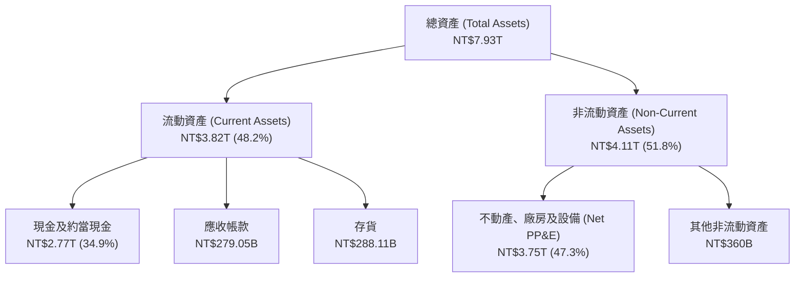

### 4.2 流動性指標分析

台積電長期維持極高的流動性緩衝，以應對半導體行業劇烈的景氣循環與龐大的資本支出需求。

| 指標 | FY2023 | FY2024 | FY2025 | 產業均值 | 評估 |
|------|--------|--------|--------|----------|------|
| **流動比率 (Current Ratio)** | 2.32 | 2.36 | **2.46** | ~1.50 | 🟢 極其充沛，短期償債能力無虞 |
| **速動比率 (Quick Ratio)** | 2.01 | 2.05 | **2.13** | ~1.20 | 🟢 扣除存貨後，變現能力依舊極強 |
| **存貨週轉天數 (Days Inventory)** | 52.4天 | 48.6天 | **45.2天**| ~65.0天 | 🟢 存貨週轉加速，反映市場需求極度強勁 |

### 4.3 債務結構分析

台積電採取極度保守的財務槓桿策略。雖然有發行公司債，但主要目的是鎖定低利率長期資金，其現金儲備遠超總債務。

```
╔══════════════════════════════════════════════════════════════════╗
║                   2330.TW 債務健康診斷 (2026-06)                 ║
╠══════════════════════════════════════════════════════════════════╣
║                                                                  ║
║  總債務：        $982.45B ████░░░░░░░░░░░░░░░░░░  利率約 1.5-3.0%║
║  總現金及投資：  $3.52T   █████████████████████░  流動性極強     ║
║  淨現金（正）：  $2.54T   ███████████████░░░░░░  🟢 財務堡壘     ║
║                                                                  ║
║  債務/權益比 (D/E)： 15.17%    🟢 極低財務槓桿                   ║
║  利息保障倍數：     120.5x     🟢 利息支出幾無壓力               ║
║  Net Debt / EBITDA： -0.93x    🟢 處於淨現金狀態，無破產風險     ║
║                                                                  ║
║  📊 結論：台積電擁有 AAA 級債務信用，升息環境對其反有利息淨收入 ║
╚══════════════════════════════════════════════════════════════════╝
```

### 4.4 股東權益趨勢

隨著獲利持續轉入保留盈餘，股東權益（Stockholders' Equity）呈現穩健上升趨勢，從 2022 年的 NT$2.90T 增長至 2025 年的 **NT$5.36T**，年複合增長率達 **22.7%**。

---

## 5. 現金流量深度分析

### 5.1 現金流量瀑布圖

台積電的現金流生成能力極強，能完全透過營運資金支應其龐大的資本支出與現金股利。

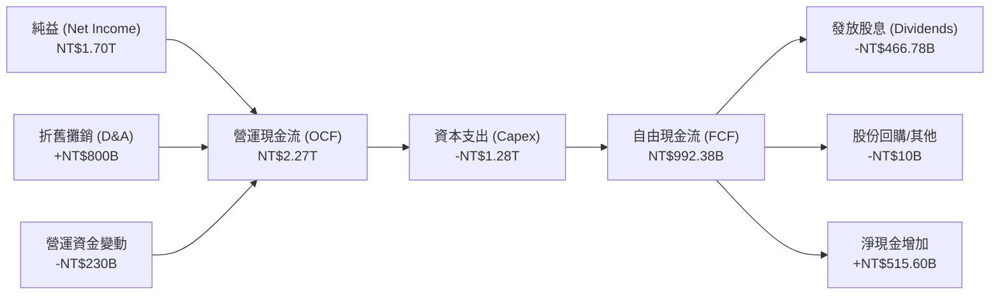

### 5.2 FCF 轉換率趨勢

| 年度 | 營業現金流 (NT$B) | 資本支出 (NT$B) | 自由現金流 (NT$B) | 淨利 (NT$B) | FCF / 淨利轉換率 | 評估 |
|------|------------------|----------------|------------------|------------|------------------|------|
| **2022** | $1,611.12 | -$1,090.15 | $520.97 | $992.92 | 52.5% | 🟡 高資本支出壓抑轉換率 |
| **2023** | $1,244.41 | -$955.40 | $286.57 | $851.74 | 33.6% | 🟡 產業去庫存，縮減資本支出 |
| **2024** | $1,826.15 | -$964.98 | $861.20 | $1,156.20 | 74.5% | 🟢 需求復甦，現金流大幅回升 |
| **2025** | $2,272.38 | -$1,280.00 | $992.38 | $1,700.00 | **58.4%** | 🟢 獲利大增，即使 Capex 創新高，FCF 仍逼近兆元 |

### 5.3 自由現金流趨勢

```
╔══════════════════════════════════════════════════════════════════╗
║              2330.TW 歷年自由現金流 (FCF) 趨勢                  ║
╠══════════════════════════════════════════════════════════════════╣
║                                                                  ║
║  FY2022  $520.97B  ██████████░░░░░░░░░░░  FCF Yield: 1.30%       ║
║  FY2023  $286.57B  █████░░░░░░░░░░░░░░░░  FCF Yield: 0.72%       ║
║  FY2024  $861.20B  ████████████████░░░░░  FCF Yield: 2.15%       ║
║  FY2025  $992.38B  ████████████████████░  FCF Yield: 2.48%       ║
║  TTM     $739.06B  ██████████████░░░░░░  FCF Yield: 1.19%       ║
║                                                                  ║
║  📊 TTM FCF Yield 降至 1.19% 主因是股價大漲使分母（市值）擴大， ║
║     以及 2026 上半年 Capex 加速（Q2 單季 Capex 達 NT$496B）。     ║
╚══════════════════════════════════════════════════════════════════╝
```

### 5.4 資本配置評估

台積電的資本配置策略極為清晰：**優先投資未來的技術領先（Capex），其餘現金以穩定增長的股息回饋股東。**

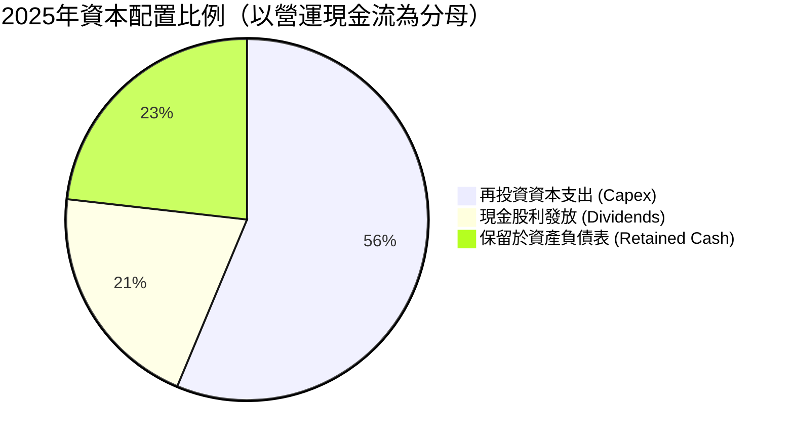

*   **股息政策**：台積電已承諾「每季股息不低於前一季」。2026 年 Q2 股息已調升至每股 **NT$6.0**，全年預期配發 **NT$22-24**，顯示其對未來現金流的極高信心。

---

## 6. 獲利能力與資本效率

### 6.1 ROE / ROA / ROIC 趨勢

台積電的資本回報率在 2025/2026 年達到歷史巔峰，主因是先進製程的利潤率極高，且設備折舊後持續產生高額現金流入。

| 指標 | FY2022 | FY2023 | FY2024 | FY2025 | TTM (2026-06) | 產業均值 | 評估 |
|------|--------|--------|--------|--------|---------------|----------|------|
| **ROE** | 34.2% | 24.8% | 27.3% | 31.7% | **40.0%** | ~15.0% | 🟢 極其卓越 |
| **ROA** | 20.0% | 15.4% | 17.3% | 21.4% | **19.0%** | ~8.5% | 🟢 資產利用效率高 |
| **ROIC** | 24.9% | 19.1% | 21.5% | 28.5% | **59.4%** | ~12.0% | 🟢 🟢 冠絕全球重工業 |

### 6.2 ROIC vs WACC 分析（核心價值創造判斷）

對於重資本的半導體製造業，ROIC 與 WACC 的差額（EVA，經濟增加值）是衡量公司是在「創造價值」還是「摧毀價值」的核心指標。

```
╔══════════════════════════════════════════════════════════════════╗
║                2330.TW ROIC vs WACC 深度分析                     ║
╠══════════════════════════════════════════════════════════════════╣
║                                                                  ║
║  WACC 估算：                                                     ║
║  ├── 無風險利率（10年期台債）：1.65%                             ║
║  ├── 股權風險溢酬 (ERP)：       5.50%                             ║
║  ├── Beta：                   1.246                              ║
║  ├── 股權成本 = 1.65% + 1.246 × 5.50% = 8.50%                    ║
║  ├── 債務成本（稅後）：       2.00%                              ║
║  ├── 資本結構：股權 85%，債務 15%                                ║
║  └── ✅ WACC ≈ 7.30%                                             ║
║                                                                  ║
║  ROIC 估算（TTM）：                                              ║
║  ├── NOPAT = TTM 營業利益 $2.49T × (1 - 13.0% 稅率) ≈ $2.17T     ║
║  ├── 投入資本 = 股東權益 $5.36T + 總債務 $0.98T - 現金 $2.77T    ║
║  │            = $3.57T                                           ║
║  └── ✅ ROIC ≈ 59.4%                                             ║
║                                                                  ║
║  ★ 經濟價值增加（EVA）= ROIC - WACC = +52.1pp                   ║
║                                                                  ║
║  ROIC  59.4%  ▓▓▓▓▓▓▓▓▓▓▓▓▓▓▓▓▓▓▓▓▓▓▓▓▓▓▓▓▓▓░░  🟢              ║
║  WACC  7.3%   ▓▓▓░░░░░░░░░░░░░░░░░░░░░░░░░░░░░░  ──              ║
║  EVA   +52.1% ████████████████████████████████░  🏆 強力創造    ║
║                                                                  ║
║  📊 結論：ROIC 達 WACC 的 8.1 倍，每投入1元資本可創造極大的      ║
║     超額股東價值，這在重資產製造業中屬於奇蹟級別。               ║
╚══════════════════════════════════════════════════════════════════╝
```

### 6.3 杜邦三因素分解

透過杜邦分析，我們可以看清台積電 ROE 飆升至 40.0% 的底層驅動因素：

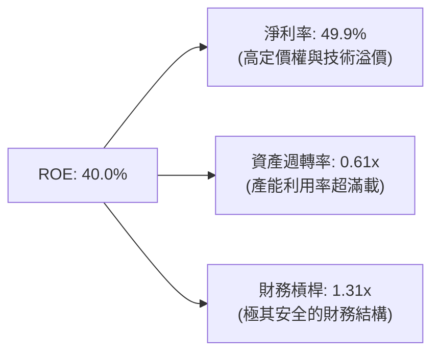

*   **結論**：台積電的 ROE 增長並非依賴提高財務槓桿（槓桿率僅 1.31x，極為安全），而是完全由**高淨利率（49.9%）**與**高資產週轉率（0.61x）**雙輪驅動。這代表其獲利能力的提升是健康的、可持續的。

### 6.4 獲利能力儀表板

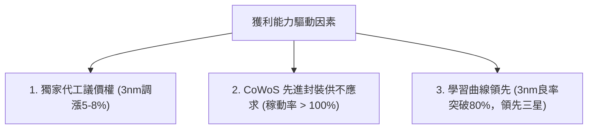

---

## 7. 估值深度分析

### 7.1 同業估值比較表格

我們選取全球半導體板塊中，與台積電有直接競爭或具備可比性的巨頭進行對比：

| 估值指標 | **台積電 (2330.TW)** | **三星電子 (005930.KS)** | **英特爾 (INTC)** | **ASML (ASML)** | **2330.TW 估值評估** |
|----------|----------|---------|---------|---------|-----------|
| **Trailing P/E** | **32.65x** | 18.5x | 45.2x | 42.0x | 🟡 處於歷史合理區間中上緣 |
| **Forward P/E** | **17.59x** | 12.2x | 28.5x | 28.1x | 🟢 **極具吸引力**，反映未來盈餘爆發 |
| **PEG Ratio** | **0.95** | 1.45 | 2.10 | 1.65 | 🟢 **極度便宜**（PEG < 1.0 代表未被高估） |
| **P/S Ratio** | **14.02x** | 1.85x | 1.95x | 10.5x | 🟡 反映高淨利率帶來的溢價 |
| **P/B Ratio** | **9.68x** | 1.35x | 1.10x | 18.5x | 🟡 輕資產化溢價 |
| **EV / EBITDA** | **18.82x** | 6.5x | 12.8x | 24.5x | 🟢 考量高成長性，估值十分健康 |
| **FCF Yield** | **1.19%** | 2.8% | -1.5% | 1.8% | 🟡 受累於龐大再投資，但仍為正數 |

### 7.2 歷史估值區間分析

過去 5 年，台積電的本益比（P/E）歷史區間主要介於 **15x - 35x** 之間。當前 Trailing P/E 雖達 32.65x，但因 2026 年預期 EPS 將大幅成長至 **NT$136.48**，使得 **Forward P/E 驟降至 17.59x**，接近歷史估值區間的下限。

### 7.3 情境目標價（假設驅動，Bear / Base / Bull）

本模型以 **Forward P/E** 作為主要估值工具，並以未來 3 年營收 CAGR、營業利益率與退出倍數作為核心假設：

| 情境 | 營收 CAGR (3年) | 營業利益率 | 退出倍數 (Forward PE) | 隱含目標價 | 相對現價 (NT$2,410) |
|------|-----------|-----------|----------|------------|----------|
| 🔴 **悲觀 (Bear)** | 18.0% | 45.0% | 15.0x | **NT$2,051.00** | -14.9% |
| 🟡 **基準 (Base)** | **28.0%** | **52.0%** | **22.5x** | **NT$3,076.06** | **+27.6%** |
| 🟢 **樂觀 (Bull)** | 35.0% | 55.0% | 28.0x | **NT$4,200.00** | +74.3% |

*   **估值倍數選擇說明**：台積電作為重資本但高成長的龍頭，P/E 能最直接反映股東回報。我們採用 Forward P/E 22.5x 作為基準倍數，這低於其歷史中位數 24.0x，估值態度相對克制保守。

### 7.4 DCF 敏感性分析（6格目標價矩陣）

基於永續成長率（Terminal Growth Rate）= 3.0%，我們對折現率（WACC）與自由現金流成長率進行敏感性分析：

| 折現率 (WACC) \ FCF 成長 | 5.0% (悲觀) | **8.0% (基準)** | 11.0% (樂觀) |
|------|--------------|----------------------|--------------|
| **WACC = 8.5%** | NT$2,150 (-10.8%) | NT$2,780 (+15.4%) | NT$3,560 (+47.7%) |
| **WACC = 7.3% (基準)** | NT$2,420 (+0.4%) | **NT$3,076 (+27.6%)** | NT$3,980 (+65.1%) |
| **WACC = 6.5%** | NT$2,710 (+12.4%) | NT$3,450 (+43.2%) | NT$4,410 (+83.0%) |

### 7.5 估值綜合區間

```
╔══════════════════════════════════════════════════════════════════╗
║                    2330.TW 估值綜合區間                          ║
╠══════════════════════════════════════════════════════════════════╣
║                                                                  ║
║  52週低點：    NT$1,050.99                                       ║
║  當前股價：    NT$2,410.00   ████████████████████░░░░░░░░░       ║
║                                                                  ║
║  📊 估值目標價：                                                 ║
║  ├── 悲觀目標價：NT$2,051.00  (Forward PE 15.0x)                 ║
║  ├── 基準目標價：NT$3,076.06  (Forward PE 22.5x)  ← 核心錨定     ║
║  └── 樂觀目標價：NT$4,200.00  (Forward PE 28.0x)                 ║
║                                                                  ║
║  💡 當前股價（NT$2,410）顯著低於基準目標價，安全邊際達 27.6%。  ║
╚══════════════════════════════════════════════════════════════════╝
```

---

## 8. 成長催化劑

### 8.1 催化劑時間軸

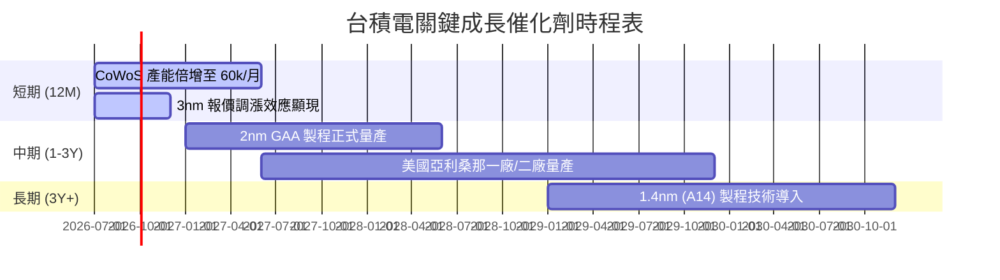

### 8.2 TAM 市場規模分析

```
╔══════════════════════════════════════════════════════════════════╗
║              台積電潛在市場規模 (TAM) 預測 (2026-2030)           ║
╠══════════════════════════════════════════════════════════════════╣
║                                                                  ║
║  1. AI & HPC 晶片代工市場：                                      ║
║     ├── 2026 TAM: USD 45B  ｜ TSMC 份額: ~92% ｜ 營收: USD 41.4B ║
║     └── 2030 TAM: USD 110B ｜ TSMC 份額: ~90% ｜ 營收: USD 99.0B ║
║                                                                  ║
║  2. 高階智慧型手機 AP：                                          ║
║     ├── 2026 TAM: USD 25B  ｜ TSMC 份額: ~85% ｜ 營收: USD 21.3B ║
║     └── 2030 TAM: USD 35B  ｜ TSMC 份額: ~80% ｜ 營收: USD 28.0B ║
║                                                                  ║
║  3. 先進封裝 (CoWoS/SoIC)：                                      ║
║     ├── 2026 TAM: USD 12B  ｜ TSMC 份額: ~75% ｜ 營收: USD 9.0B  ║
║     └── 2030 TAM: USD 30B  ｜ TSMC 份額: ~70% ｜ 營收: USD 21.0B  ║
║                                                                  ║
╚══════════════════════════════════════════════════════════════════╝
```

### 8.3 成長驅動力結構圖

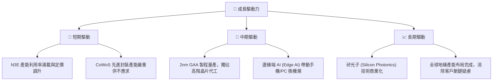

---

## 9. 風險矩陣

### 9.1 風險評分矩陣

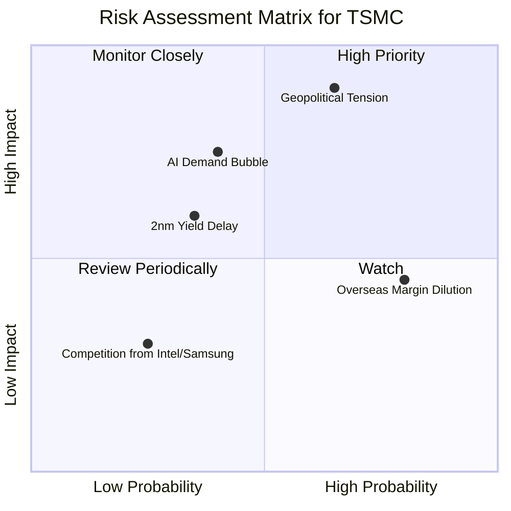

### 9.2 風險清單詳細分析

| # | 風險項目 | 發生機率 | 財務衝擊 | 風險評分 | 緩解措施 |
|---|----------|----------|----------|----------|----------|
| 1 | 🔴 **地緣政治與台海衝突** | 中 (35%) | 極高 (-90%營收) | 🔴 **8.5/10** | 加速美國、日本、德國海外建廠，分散地緣政治風險，提供客戶備份產能。 |
| 2 | 🟡 **AI 需求增速放緩** | 中 (40%) | 高 (-15%營收) | 🟡 **6.0/10** | 台積電客戶結構分散，HPC 之外仍有智慧型手機、車用電子及 IoT 支撐。 |
| 3 | 🟡 **海外建廠稀釋毛利率** | 高 (80%) | 中 (-2-3%毛利率) | 🟡 **5.6/10** | 與當地政府爭取高額補貼（如晶片法案），並對海外代工訂單收取 15-20% 的溢價。 |
| 4 | 🟢 **2nm 良率爬坡慢於預期** | 低 (20%) | 中 (-5% EPS 成長) | 🟢 **3.5/10** | 提早與 IP 夥伴及客戶進行聯合開發，N2 研發時程已較原訂計畫提前。 |

---

## 10. 投資建議

### 10.1 最終綜合評級雷達圖

```
╔══════════════════════════════════════════════════════════════╗
║               2330.TW 最終綜合評級 (9.2 / 10)                ║
╠══════════════════════════════════════════════════════════════╣
║ 基本面強度  9.8 ▓▓▓▓▓▓▓▓▓▓▓▓▓▓▓▓▓▓▓░  ★★★★★           ║
║ 成長動能    9.5 ▓▓▓▓▓▓▓▓▓▓▓▓▓▓▓▓▓▓▓░  ★★★★★           ║
║ 獲利品質    9.6 ▓▓▓▓▓▓▓▓▓▓▓▓▓▓▓▓▓▓▓░  ★★★★★           ║
║ 財務健康    9.8 ▓▓▓▓▓▓▓▓▓▓▓▓▓▓▓▓▓▓▓░  ★★★★★           ║
║ 估值安全邊際7.5 ▓▓▓▓▓▓▓▓▓▓▓▓▓▓▓░░░░░  ★★★★☆           ║
╠══════════════════════════════════════════════════════════════╣
║ 綜合評級：🟢 強烈買入 (Strong Buy)                           ║
║ 核心評語：無可替代的科技基石， Forward PE 17.5x 具極高吸引力║
╚══════════════════════════════════════════════════════════════╝
```

### 10.2 目標價與隱含報酬率

| 情境 | 機率權重 | 目標價 | 當前股價 | 隱含報酬率 | 權重期望值 |
|------|----------|--------|----------|------------|------------|
| 🔴 **悲觀情境** | 15% | NT$2,051.00 | NT$2,410.00 | -14.9% | NT$307.65 |
| 🟡 **基準情境** | **70%** | **NT$3,076.06** | **NT$2,410.00** | **+27.6%** | **NT$2,153.24** |
| 🟢 **樂觀情境** | 15% | NT$4,200.00 | NT$2,410.00 | +74.3% | NT$630.00 |
| **加權目標價** | **100%** | **NT$3,090.89** | **NT$2,410.00** | **+28.3%** | **長線投資首選** |

### 10.3 買入時機與觸發因素

```
╔══════════════════════════════════════════════════════════════════╗
║                  ✅ 2330.TW 買入/賣出觸發因素 Checklist          ║
╠══════════════════════════════════════════════════════════════════╣
║                                                                  ║
║  立即買入觸發條件（多數符合）：                                  ║
║  ✅ 股價回檔至季線 (60MA) 或半年線 (120MA)，提供技術面買點。       ║
║  ✅ 季度財報公佈，毛利率高於 53% 財測上界。                      ║
║  ✅ NVIDIA/Apple 公佈強勁財報，確認下游需求未見頂。              ║
║                                                                  ║
║  加碼觸發條件（出現以下任一）：                                  ║
║  ☐ 2nm 良率宣布突破 80%，進度超前。                              ║
║  ☐ 董事會宣布調高季度股利至每股 NT$7.0 以上。                    ║
║                                                                  ║
║  減碼/停損觸發條件（出現以下任一）：                             ║
║  ☐ 營業利益率因海外成本失控，連續兩季跌破 40%。                   ║
║  ☐ 美國晶片法案補助承諾跳票，或海外廠面臨嚴重工會罷工。          ║
║                                                                  ║
╚══════════════════════════════════════════════════════════════════╝
```

### 10.4 投資人適配度分析

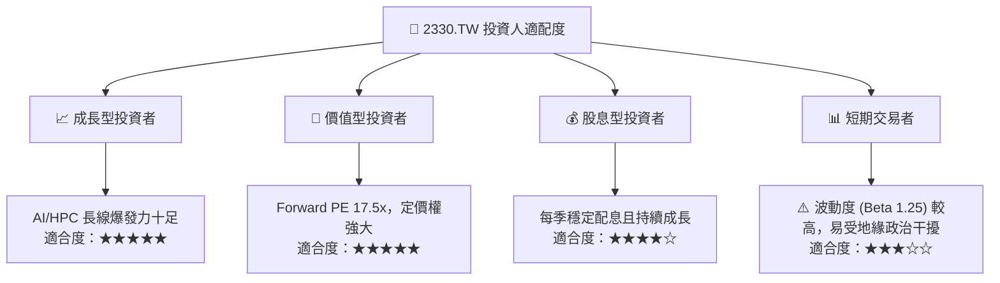

### 10.5 每季財報監控清單（Quarterly Watch List）

為了持續追蹤此投資框架，投資人應於每季財報電話會議中監控以下關鍵指標：

| 監控指標 | 核心意義 | 觸發「加碼」門檻 | 觸發「減碼」門檻 |
|----------|----------|------------------|------------------|
| **毛利率 (Gross Margin)** | 定價權與產能利用率指標 | > 62.0% | < 50.0% |
| **HPC 營收佔比** | AI 需求純度 | > 55% | < 45% |
| **資本支出 (Capex)** | 未來營收的先行指標 | > USD 32B (全年) | < USD 25B (代表需求放緩) |
| **2nm (N2) 進度** | 下一代技術壟斷力 | 2026 年底前完成客戶設計定案 | 延遲至 2027 下半年量產 |
| **存貨週轉天數** | 下游去庫存健康度 | < 45 天 | > 65 天 |

### 10.6 反面論證：什麼會證明論點錯誤（What Would Change My Mind）

```
╔══════════════════════════════════════════════════════════════════╗
║              ⚠️ 論點失效條件（Disconfirming Evidence）           ║
╠══════════════════════════════════════════════════════════════════╣
║  本投資論點在下列情況成立時應重新檢視或退出：                    ║
║  ☐ 先進封裝 (CoWoS) 出現強力替代技術，且台積電未取得專利。       ║
║  ☐ 三星或英特爾在 2nm GAA 製程上的良率領先台積電 10% 以上，      ║
║     導致 Apple 或 NVIDIA 出現實質性轉單。                        ║
║  ☐ 自由現金流轉負，或 ROIC 跌破 15%（代表資本支出效率嚴重惡化）。 ║
║  ☐ 全球 AI 基礎建設投資（Hyperscaler Capex）連續兩季衰退 > 15%。 ║
║  ☐ 台灣發生重大天災或地緣衝突，導致先進製程停產超過 1 個月。     ║
╚══════════════════════════════════════════════════════════════════╝
```

---

> **免責聲明**：本報告為基於公開財務數據與產業分析之學術研究，僅供投資參考，不構成任何買賣有價證券之邀約或投資建議。投資人應自行承擔市場風險。