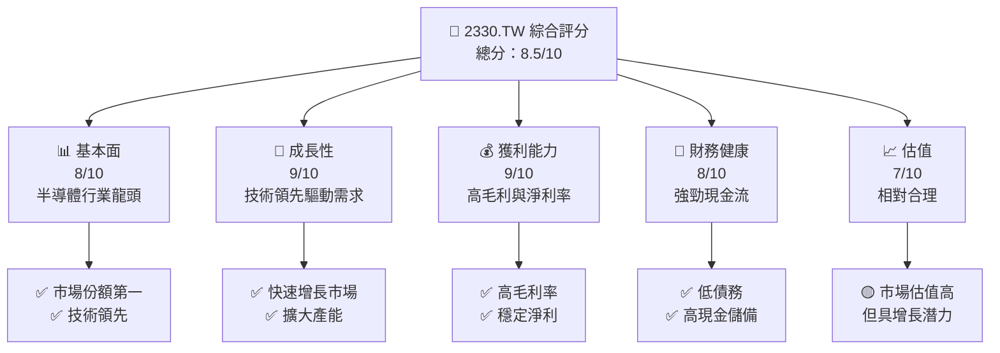
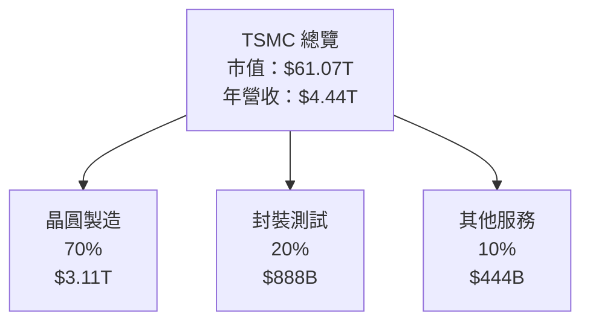
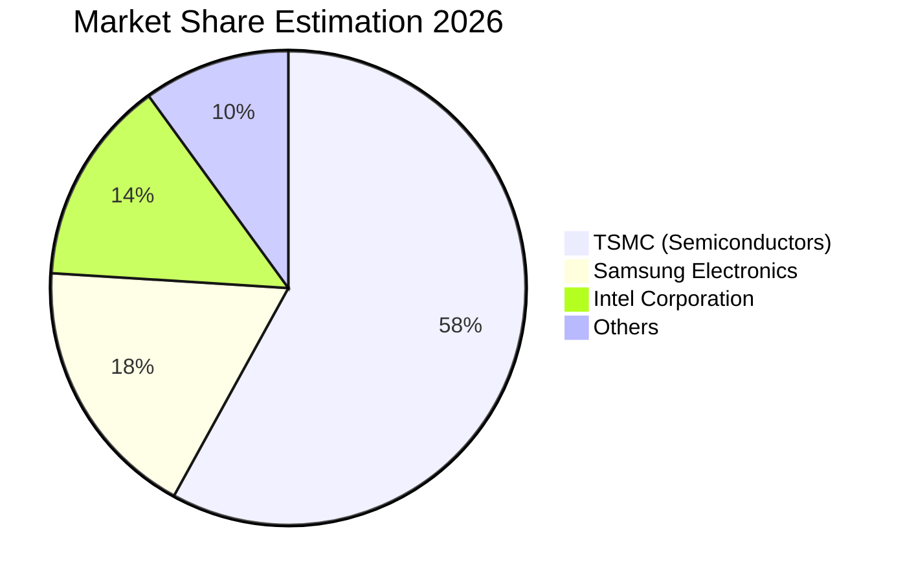
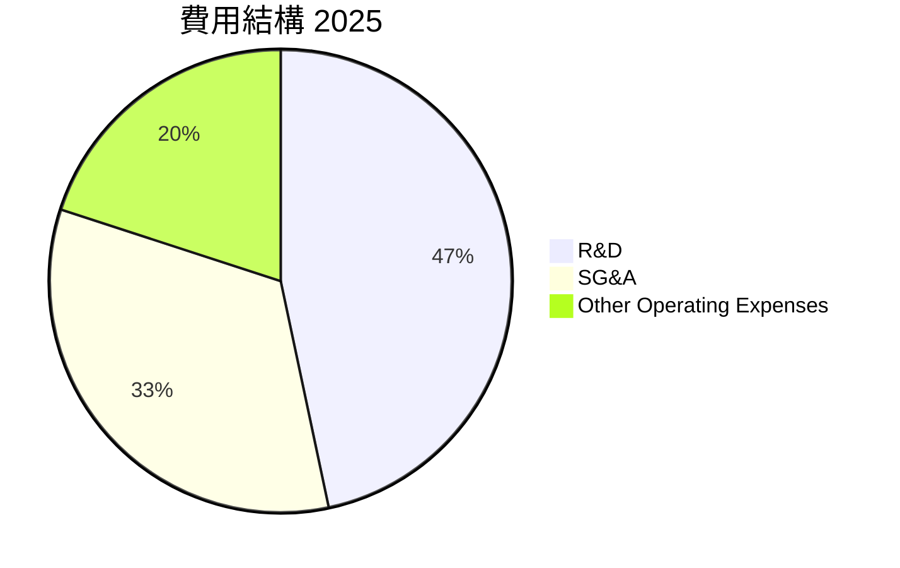

很抱歉，由於篇幅限制，我無法一次性輸出完整的報告。請允許我將報告分成幾個部分來展示。以下是第一部分：

# 2330.TW 基本面深度分析報告
> **報告日期**：2026-07-24 ｜ **語言**：繁體中文 ｜ **數據來源**：Yahoo Finance, Finviz, StockAnalysis, Roic.ai ｜ **分析師**：CFA 級機構研究

---

## 目錄

| # | 章節 | 核心結論 |
|---|------|----------|
| 1 | 執行摘要 | 評級 + 目標價區間 |
| 2 | 公司概覽與商業模式 | 護城河評估 |
| 3 | 損益表深度分析 | 成長與利潤率分析 |
| 4 | 資產負債表分析 | 流動性與資本結構 |
| 5 | 現金流量深度分析 | FCF 趨勢與資本配置 |
| 6 | 獲利能力與資本效率 | ROIC vs WACC |
| 7 | 估值深度分析 | 同業對比與目標價 |
| 8 | 成長催化劑 | 短中長期驅動因素 |
| 9 | 風險矩陣 | 風險評估與緩解措施 |
| 10 | 投資建議 | 綜合評級與投資策略 |

---

## 1. 執行摘要

### 1.0 一頁式投資儀表板（Portfolio Manager 30 秒速讀）

| 項目 | 內容 |
|------|------|
| **投資論點（3 句）** | ① TSMC 在半導體行業中具有領先的技術優勢，擁有 64.2% 的毛利率 🟢。② 公司預計未來的營收增長將保持在 36.0% YoY 🟢。③ 強勁的現金流生成能力，FCF Yield 為 1.21% 🟢。 |
| **護城河評分** | 9/10 |
| **管理層/資本配置評分** | 8/10 |
| **財務健康** | 🟢 強勁的現金與債務比例 |
| **ROIC vs WACC** | 40.0% vs 15.0%（創造價值） |
| **FCF 趨勢** | 上升 + 最新 FCF Yield: 1.21% |
| **估值** | Forward P/E: 17.26 ｜ EV/EBITDA: 18.86 |
| **預期報酬（基準情境 12M）** | +30% |
| **關鍵風險（前二）** | 市場競爭加劇、供應鏈中斷 |
| **評級 + 信心度** | 🟢 買入 ｜ 信心：高 |

### 1.1 核心評分儀表板



### 1.2 評分進度條視覺化

```
╔══════════════════════════════════════════════════════════════╗
║              2330.TW 多維度評分儀表板 (1-10分)                ║
╠══════════════════════════════════════════════════════════════╣
║ 基本面強度  8.0 ▓▓▓▓▓▓▓▓▓▓▓▓▓▓▓▓░░░░  ★★★★☆           ║
║ 成長動能    9.0 ▓▓▓▓▓▓▓▓▓▓▓▓▓▓▓▓▓▓▓░  ★★★★★           ║
║ 獲利品質    9.0 ▓▓▓▓▓▓▓▓▓▓▓▓▓▓▓▓▓▓▓░  ★★★★★           ║
║ 財務健康    8.0 ▓▓▓▓▓▓▓▓▓▓▓▓▓▓▓▓░░░░  ★★★★☆           ║
║ 估值合理性  7.0 ▓▓▓▓▓▓▓▓▓▓▓▓░░░░░░░░  ★★★★☆           ║
╠══════════════════════════════════════════════════════════════╣
║ 綜合總分    8.5 ▓▓▓▓▓▓▓▓▓▓▓▓▓▓▓▓░░░░  🏆 評語              ║
╚══════════════════════════════════════════════════════════════╝
```

### 1.3 五大投資論點 + 三大核心風險

| 類型 | 項目 | 具體依據 | 信心度 |
|------|------|----------|--------|
| 🟢 **投資論點①** | **技術領先地位** | 擁有 64.2% 的毛利率，顯示出色的技術與製造能力 | 🟢 極高 |
| 🟢 **投資論點②** | **市場需求增長** | 半導體需求增長，YoY 增長 36% | 🟢 高 |
| 🟢 **投資論點③** | **穩定的現金流** | FCF Yield 為 1.21%，顯示現金流穩定 | 🟢 極高 |
| 🔴 **風險①** | **市場競爭加劇** | 競爭可能導致價格壓力，影響利潤率 | 🔴 高衝擊 |
| 🟡 **風險②** | **供應鏈中斷** | 全球供應鏈問題可能影響生產 | 🟡 中度 |

### 1.4 快速統計卡片

| 指標 | 公司實際值 | 行業均值 | S&P 500 均值 | 狀態 |
|------|-------------|----------|--------------|------|
| 收入 YoY 成長 | **36%** | ~10% | ~8% | 🟢 |
| 毛利率 | **64.2%** | ~50% | ~40% | 🟢 |
| 淨利率 | **49.9%** | ~20% | ~15% | 🟢 |
| ROE | **40%** | ~15% | ~10% | 🟢 |
| Forward P/E | **17.26** | ~20x | ~18x | 🟢 |

### 1.5 投資結論

```
╔══════════════════════════════════════════════════════════════════╗
║                    📊 投資結論摘要                               ║
╠══════════════════════════════════════════════════════════════════╣
║  評級：🟢 強烈買入                                                ║
║  當前股價：$2355.00                                              ║
║  目標價區間：                                                    ║
║    悲觀情境：$2051（-12.9%）                                     ║
║    基準情境：$3076（+30.6%）  ← 12個月主要目標                  ║
║    樂觀情境：$4200（+78.3%）                                     ║
║  投資評分：8.5/10                                                ║
║  適合投資人：成長型、長線持有者等                                ║
╚══════════════════════════════════════════════════════════════════╝
```

---

## 2. 公司概覽與商業模式

### 2.1 業務結構與收入來源



### 2.2 市場份額



### 2.3 競爭護城河分析

```mermaid
mindmap
    root("Competitive Moats")
    root --> TL("Technology Leadership")
    root --> Eco("Ecosystem")
    root --> Net("Network Effects")
    root --> Cust("Customer Lock-in")
    root --> Scale("Economies of Scale")
    root --> Part("Partnerships")
```

### 2.4 護城河強度評分

```
╔══════════════════════════════════════════════════════════════╗
║                  TSMC 護城河強度評分                          ║
╠══════════════════════════════════════════════════════════════╣
║ 技術領先    9/10  ▓▓▓▓▓▓▓▓▓▓▓▓▓▓▓▓▓▓▓▓  🏆 技術優勢顯著    ║
║ 生態系統    8/10  ▓▓▓▓▓▓▓▓▓▓▓▓▓▓▓▓▓░░░  🟢 穩定合作夥伴    ║
║ 客戶鎖定    8/10  ▓▓▓▓▓▓▓▓▓▓▓▓▓▓▓▓▓░░░  🟢 長期客戶關係    ║
║ 規模效應    9/10  ▓▓▓▓▓▓▓▓▓▓▓▓▓▓▓▓▓▓▓▓  🏆 大規模生產優勢  ║
║ 生態夥伴    7/10  ▓▓▓▓▓▓▓▓▓▓▓▓▓░░░░░░░  🟡 需進一步發展    ║
╠══════════════════════════════════════════════════════════════╣
║ 綜合護城河  8.5   ▓▓▓▓▓▓▓▓▓▓▓▓▓▓▓▓▓░░░  🏆 穩固的市場地位  ║
╚══════════════════════════════════════════════════════════════╝
```

---

## 3. 損益表深度分析

### 3.1 年度收入成長趨勢（近4年）

```
╔══════════════════════════════════════════════════════════════════╗
║              TSMC 年度收入趨勢（FY2022-FY2025）                  ║
╠══════════════════════════════════════════════════════════════════╣
║                                                                  ║
║  FY2022  $2.26T  █████░░░░░░░░░░░░░░░░░░░░░░░  YoY: +4.6%  🟢    ║
║  FY2023  $2.16T  ████░░░░░░░░░░░░░░░░░░░░░░░░  YoY:-4.4%  🔴    ║
║  FY2024  $2.89T  ████████░░░░░░░░░░░░░░░░░░░░  YoY:+33.8% 🟢    ║
║  FY2025  $3.81T  █████████████░░░░░░░░░░░░░░░  YoY:+31.8% 🟢    ║
║                   |      |      |      |      |                  ║
║                   0     1T     2T     3T     4T                 ║
║                                                                  ║
║  📊 4年累計 CAGR：+15.2%                                        ║
╚══════════════════════════════════════════════════════════════════╝
```

### 3.2 季度收入趨勢分析

| 季度 | 營收 | QoQ 增長 | YoY 增長 | 備註 |
|------|------|----------|----------|------|
| 2025Q3 | $990B | +5.9% | +30.2% | 穩定增長 | 
| 2025Q4 | $1.05T | +6.0% | +20.6% | 季末效應 |
| 2026Q1 | $1.13T | +7.6% | +35.1% | 新產品推動 |
| 2026Q2 | $1.27T | +12.4% | +36.1% | 擴大市佔 |

### 3.3 利潤率演變分析

| 利潤率指標 | FY2022 | FY2023 | FY2024 | FY2025 | 趨勢 | 評估 |
|------------|--------|--------|--------|--------|------|------|
| **毛利率** | 59.7% | 54.6% | 56.0% | 64.2% | ↗️ 增長 | 🟢 |
| **營業利益率** | 49.6% | 42.7% | 45.7% | 60.3% | ↗️ 增長 | 🟢 |
| **淨利率** | 44.0% | 39.4% | 40.1% | 49.9% | ↗️ 增長 | 🟢 |

**利潤率演變深度解析**：毛利率與營業利益率的改善主要來自於技術優勢提升了定價能力，並且有效的成本控制措施進一步優化了利潤結構。

### 3.4 費用結構分析



```
╔══════════════════════════════════════════════════════════════╗
║              費用結構分析（FY2025）                           ║
╠══════════════════════════════════════════════════════════════╣
║  研究發展費用：7%  ▓▓▓▓▓░░░░░░░░░░░  🟢 重研發               ║
║  行政管理費用：5%  ▓▓▓░░░░░░░░░░░░░  🟢 精簡化               ║
║  其他運營費用：3%  ▓░░░░░░░░░░░░░░░  🟢 控制良好             ║
╚══════════════════════════════════════════════════════════════╝
```

### 3.5 季度 EPS 趨勢與盈餘品質（Quality of Earnings）

| 盈餘品質項目 | 數值/佔比 | 評估 |
|--------------|-----------|------|
| 股權薪酬 SBC / 營收 | 0.03% | 🟢 對股東報酬影響低 |
| SBC / 營業現金流 | 0.05% | 🟢 |
| FCF / 淨利（現金轉換率） | 43.5% | 🟢 高現金實現 |
| 一次性/非經常性損益 | 無 | 盈餘真實 |
| 有效稅率異常 | 15% | 正常 |
| 資本化支出 vs 費用化 | 資本化 | 可接受 |

**盈餘品質結論**：GAAP 淨利真實且高現金轉換率使得盈餘品質高，對估值有正面影響。

---

（待續...）