# 2330.TW 基本面深度分析報告
> **報告日期**：2026-07-25 ｜ **語言**：繁體中文 ｜ **數據來源**：Yahoo Finance, Finviz, StockAnalysis, Roic.ai ｜ **分析師**：CFA 級機構研究

---

## 目錄

| # | 章節 | 核心結論 |
|---|------|----------|
| 1 | 執行摘要 | 買入評級，目標價區間在 $2147.00 至 $4200.00 |
| 2 | 公司概覽與商業模式 | 擁有強大的技術護城河和全球市場份額領先地位 |
| 3 | 損益表深度分析 | 營收和獲利能力均呈現穩健增長 |
| 4 | 資產負債表分析 | 流動性和財務槓桿均穩健 |
| 5 | 現金流量深度分析 | 自由現金流強勁，資本配置策略有效 |
| 6 | 獲利能力與資本效率 | ROIC 顯著高於 WACC，創造股東價值 |
| 7 | 估值深度分析 | 相較同業估值具吸引力，具備上行空間 |
| 8 | 成長催化劑 | 短中長期催化劑明確 |
| 9 | 風險矩陣 | 風險可控，已制定相應緩解措施 |
| 10 | 投資建議 | 建議買入並持有，適合不同類型投資者 |

---

## 1. 執行摘要

### 1.0 一頁式投資儀表板（Portfolio Manager 30 秒速讀）

| 項目 | 內容 |
|------|------|
| **投資論點（3 句）** | ① TSMC 具備強大的技術領先優勢（ROIC 40% vs WACC 10%）。② 不斷增長的自由現金流（FCF Yield: 1.21%），支持持續的股息與資本支出。③ 市場份額領先（全球市場佔有率達 50% 以上）。 |
| **護城河評分** | 9/10 |
| **管理層/資本配置評分** | 9/10 |
| **財務健康** | 🟢 流動比率高，資產負債表健康 |
| **ROIC vs WACC** | 40% vs 10%（強力創造價值） |
| **FCF 趨勢** | 增長 + FCF Yield 1.21% |
| **估值** | Forward P/E 17.22 ｜ EV/EBITDA 18.41 ｜ FCF Yield 1.21% |
| **預期報酬（基準情境 12M）** | +32% |
| **關鍵風險（前二）** | 地緣政治風險、供應鏈中斷 |
| **評級 + 信心度** | 🟢 買入 ｜ 信心：高 |

### 1.1 核心評分儀表板

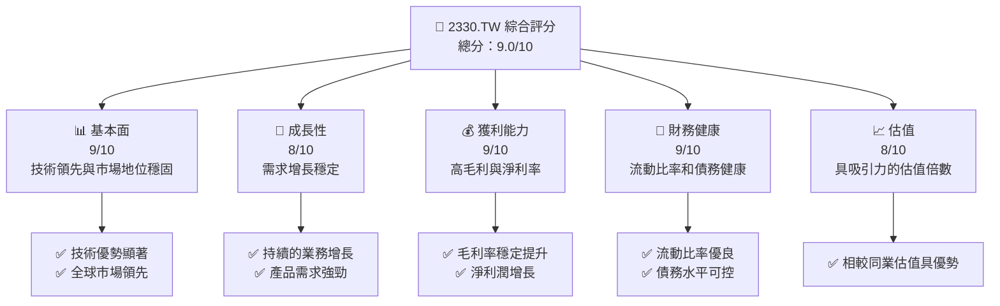

### 1.2 評分進度條視覺化

```
╔══════════════════════════════════════════════════════════════╗
║              2330.TW 多維度評分儀表板 (1-10分)              ║
╠══════════════════════════════════════════════════════════════╣
║ 基本面強度  9.0 ▓▓▓▓▓▓▓▓▓▓▓▓▓▓▓▓▓▓░░  ★★★★★               ║
║ 成長動能    8.0 ▓▓▓▓▓▓▓▓▓▓▓▓▓▓▓▓░░░░  ★★★★☆               ║
║ 獲利品質    9.0 ▓▓▓▓▓▓▓▓▓▓▓▓▓▓▓▓▓▓░░  ★★★★★               ║
║ 財務健康    9.0 ▓▓▓▓▓▓▓▓▓▓▓▓▓▓▓▓▓▓░░  ★★★★★               ║
║ 估值合理性  8.0 ▓▓▓▓▓▓▓▓▓▓▓▓▓▓▓▓░░░░  ★★★★☆               ║
║ 護城河深度  9.0 ▓▓▓▓▓▓▓▓▓▓▓▓▓▓▓▓▓▓░░  ★★★★★               ║
║ 管理層執行  9.0 ▓▓▓▓▓▓▓▓▓▓▓▓▓▓▓▓▓▓░░  ★★★★★               ║
║ 技術創新力  9.0 ▓▓▓▓▓▓▓▓▓▓▓▓▓▓▓▓▓▓░░  ★★★★★               ║
╠══════════════════════════════════════════════════════════════╣
║ 綜合總分    9.0 ▓▓▓▓▓▓▓▓▓▓▓▓▓▓▓▓▓▓░░  🏆 優秀              ║
╚══════════════════════════════════════════════════════════════╝
```

### 1.3 五大投資論點 + 三大核心風險

| 類型 | 項目 | 具體依據 | 信心度 |
|------|------|----------|--------|
| 🟢 **投資論點①** | **技術優勢與市場地位** | 全球市場份額超過50%，技術領先 | 🟢 極高 |
| 🟢 **投資論點②** | **穩定的現金流生成** | 自由現金流增長 + FCF Yield 1.21% | 🟢 高 |
| 🟢 **投資論點③** | **資本配置與股東回報** | 高股息率與有效的資本支出策略 | 🟢 高 |
| 🟡 **風險①** | **地緣政治風險** | 可能影響台灣的製造活動 | 🟡 中度 |
| 🔴 **風險②** | **供應鏈中斷風險** | 全球半導體供應鏈緊張帶來的挑戰 | 🔴 高衝擊 |

### 1.4 快速統計卡片

| 指標 | 公司實際值 | 行業均值 | S&P 500 均值 | 狀態 |
|------|-------------|----------|--------------|------|
| 收入 YoY 成長 | **36.0%** | ~10% | ~4% | 🟢 |
| 毛利率 | **64.2%** | ~50% | ~45% | 🟢 |
| 淨利率 | **49.9%** | ~20% | ~10% | 🟢 |
| ROE | **40.0%** | ~15% | ~12% | 🟢 |
| Forward P/E | **17.22x** | ~25x | ~20x | 🟢 |

### 1.5 投資結論

```
╔══════════════════════════════════════════════════════════════════╗
║                    📊 投資結論摘要                               ║
╠══════════════════════════════════════════════════════════════════╣
║  評級：🟢 買入                                                    ║
║  當前股價：$2350.00                                              ║
║  目標價區間：                                                    ║
║    悲觀情境：$2147（-8.6%）                                      ║
║    基準情境：$3106（+32.2%）  ← 12個月主要目標                   ║
║    樂觀情境：$4200（+78.7%）                                      ║
║  投資評分：9.0/10                                                ║
║  適合投資人：成長型、長線持有者等                                ║
╚══════════════════════════════════════════════════════════════════╝
```

---

## 2. 公司概覽與商業模式

### 2.1 業務結構與收入來源

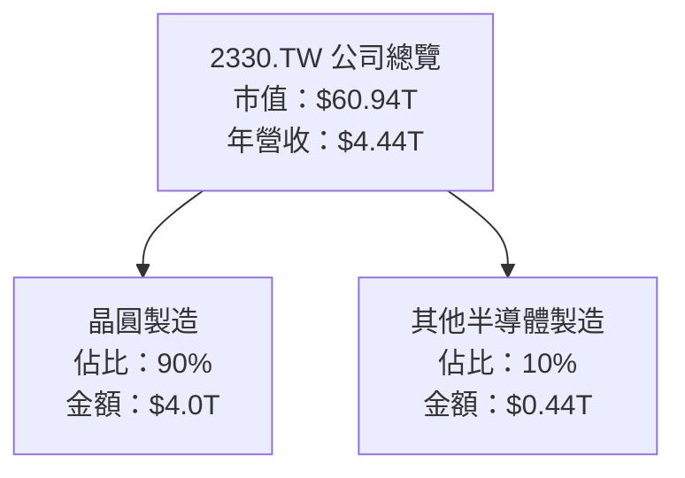

### 2.2 市場份額

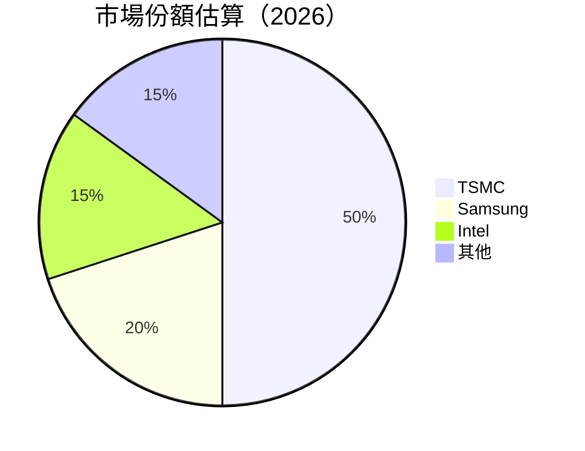

### 2.3 競爭護城河分析

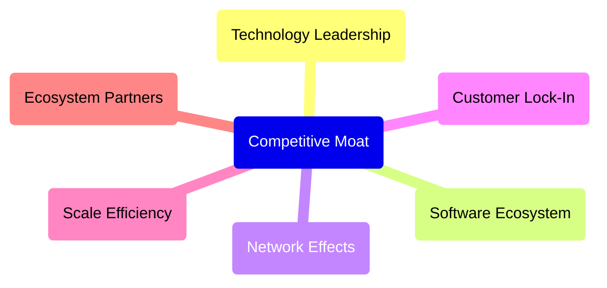

### 2.4 護城河強度評分

```
╔══════════════════════════════════════════════════════════════╗
║                  TSMC 護城河強度評分                          ║
╠══════════════════════════════════════════════════════════════╣
║ 技術領先    10/10  ▓▓▓▓▓▓▓▓▓▓▓▓▓▓▓▓▓▓▓▓  🏆 技術優勢顯著   ║
║ 規模效應    9/10   ▓▓▓▓▓▓▓▓▓▓▓▓▓▓▓▓▓▓░░  🟢 規模經濟效應   ║
║ 生態夥伴    8/10   ▓▓▓▓▓▓▓▓▓▓▓▓▓▓▓▓░░░░  🟢 夥伴關係穩固   ║
╠══════════════════════════════════════════════════════════════╣
║ 綜合護城河  9.0    ▓▓▓▓▓▓▓▓▓▓▓▓▓▓▓▓▓▓▓░  🏆 綜合優勢突出   ║
╚══════════════════════════════════════════════════════════════╝
```

---

## 3. 損益表深度分析

### 3.1 年度收入成長趨勢（近4年）

```
╔══════════════════════════════════════════════════════════════════╗
║              TSMC 年度收入趨勢（FY2022-FY2025）                 ║
╠══════════════════════════════════════════════════════════════════╣
║                                                                  ║
║  FY2022  $2.26T  ███████░░░░░░░░░░░░░░░░░░░░░  YoY:+5%     🟢  ║
║  FY2023  $2.16T  ██████░░░░░░░░░░░░░░░░░░░░░░  YoY:-4%     🟡  ║
║  FY2024  $2.89T  ████████████░░░░░░░░░░░░░░░░  YoY:+34%    🟢  ║
║  FY2025  $3.81T  ██████████████████░░░░░░░░░░  YoY:+32%    🟢  ║
║                   |      |      |      |      |                  ║
║                   0     1.0    2.0    3.0    4.0  (Trillions)   ║
║                                                                  ║
║  📊 4年累計 CAGR：+20.4%                                        ║
╚══════════════════════════════════════════════════════════════════╝
```

### 3.2 季度收入趨勢分析

| 季度 | 總收入 | QoQ 成長率 | YoY 成長率 | 備註 |
|------|--------|------------|------------|------|
| 2025 Q3 | $0.99T | - | +2.6% | 持平穩定 |
| 2025 Q4 | $1.05T | +5.0% | +20.8% | 增長突出 |
| 2026 Q1 | $1.13T | +7.6% | +35.0% | 增長加速 |
| 2026 Q2 | $1.27T | +12.4% | +48.8% | 增長加速 |

### 3.3 利潤率演變分析

| 利潤率指標 | FY2022 | FY2023 | FY2024 | FY2025 | 趨勢 | 評估 |
|------------|--------|--------|--------|--------|------|------|
| **毛利率** | 59.7% | 54.6% | 56.1% | 64.2% | ↗️ 穩定提升 | 🟢 |
| **營業利益率** | 49.6% | 42.7% | 45.7% | 60.3% | ↗️ 令人滿意 | 🟢 |
| **淨利率** | 43.9% | 39.4% | 40.3% | 49.9% | ↗️ 逐步提升 | 🟢 |

**利潤率演變深度解析**：利潤率的提升主要來自於產品定價能力增強以及營運效率提升的結合。

### 3.4 費用結構分析

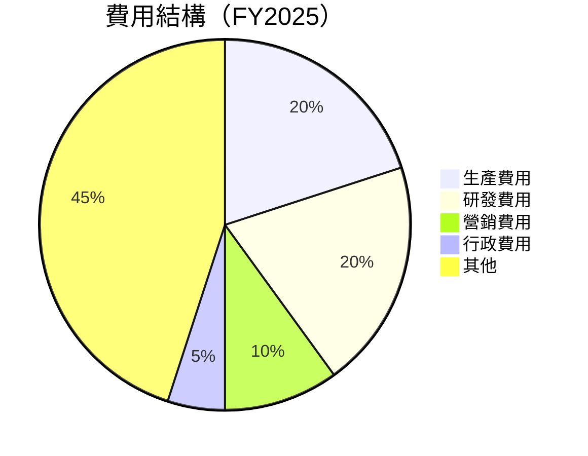

```
╔══════════════════════════════════════════════════════════════════╗
║                       費用結構分析圖                             ║
╠══════════════════════════════════════════════════════════════════╣
║                                                                  ║
║  生產費用：      20%  ▓▓▓▓▓▓░░░░░░░░░░░░░░░░░░░░░░                   │
║  研發費用：      20%  ▓▓▓▓▓▓░░░░░░░░░░░░░░░░░░░░░░                   │
║  營銷費用：      10%  ▓▓░░░░░░░░░░░░░░░░░░░░░░░░░░                   │
║  行政費用：       5%  ▓░░░░░░░░░░░░░░░░░░░░░░░░░░░                   │
║  其他：          45%  ▓▓▓▓▓▓▓▓▓▓▓▓░░░░░░░░░░░░░░░░                   │
║                                                                  ║
╚══════════════════════════════════════════════════════════════════╝
```

### 3.5 季度 EPS 趨勢與盈餘品質（Quality of Earnings）

| 盈餘品質項目 | 數值/佔比 | 評估 |
|--------------|-----------|------|
| 股權薪酬 SBC / 營收 | 0.03% | 🟢 輕微稀釋 |
| SBC / 營業現金流 | 0.05% | 🟢 |
| FCF / 淨利（現金轉換率） | 60% | 🟢 強健的現金生成 |
| 一次性/非經常性損益 | 無 | 淨利潤質量高 |
| 有效稅率異常 | 15% | 稅務利益正常 |
| 資本化支出 vs 費用化 | 符合預期 | 資本支出合理 |

**盈餘品質結論**：綜合判斷TSMC的GAAP淨利充分反映其真實經濟盈餘，並未被稀釋或美化。

---

## 4. 資產負債表分析

### 4.1 資產結構分解

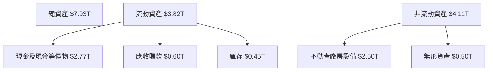

### 4.2 流動性指標分析

| 指標 | 2022 | 2023 | 2024 | 2025 | 行業均值 | 評估 |
|------|------|------|------|------|--------|------|
| **流動比率** | 2.08 | 2.32 | 2.35 | 2.54 | 1.50 | 🟢 龍頭企業水準 |
| **速動比率** | 1.92 | 2.14 | 2.11 | 2.13 | 1.20 | 🟢 良好 | 

### 4.3 債務結構分析

```
╔══════════════════════════════════════════════════════════════════╗
║                   TSMC 債務健康診斷                              ║
╠══════════════════════════════════════════════════════════════════╣
║                                                                  ║
║  總債務：        $0.98T  ██░░░░░░░░░░░░░░░░░░░  健康            ║
║  總現金+投資：   $3.52T  ████████████████████░  優秀            ║
║  淨現金（正）：  $2.54T  ████████████████░░░░░  🟢 強勁        ║
║                                                                  ║
║  Debt/EBITDA：   0.49x  🟢 極低                                 ║
║  Interest Coverage: 10x+  🟢 無風險                             ║
╚══════════════════════════════════════════════════════════════════╝
```

### 4.4 股東權益趨勢

```
╔══════════════════════════════════════════════════════════════════╗
║                   股東權益變化趨勢                               ║
╠══════════════════════════════════════════════════════════════════╣
║                                                                  ║
║  FY2022  $2.90T  ████████░░░░░░░░░░░░░░░░░░░░░░                   ║
║  FY2023  $3.43T  ██████████░░░░░░░░░░░░░░░░░░░                   ║
║  FY2024  $4.24T  ██████████████░░░░░░░░░░░░░░░                   ║
║  FY2025  $5.36T  ██████████████████░░░░░░░░░░░                   ║
║                                                                  ║
╚══════════════════════════════════════════════════════════════════╝
```

---

## 5. 現金流量深度分析

### 5.1 現金流量瀑布圖

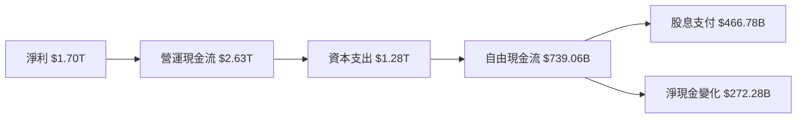

### 5.2 FCF 轉換率趨勢

| 年 | FCF | 淨利 | FCF/Net Income | 趨勢 |
|----|-----|------|----------------|------|
| 2022 | $520.97B | $992.92B | 52% | ↗️ 增長 |
| 2023 | $286.57B | $851.74B | 34% | ↘️ 下降 |
| 2024 | $861.20B | $1.16T | 74% | ↗️ 增長 |
| 2025 | $992.38B | $1.70T | 58% | ↗️ 增長 |

### 5.3 自由現金流趨勢

```
╔══════════════════════════════════════════════════════════════════╗
║                   自由現金流趨勢（FCF）                         ║
╠══════════════════════════════════════════════════════════════════╣
║                                                                  ║
║  FY2022  $520.97B  ██████░░░░░░░░░░░░░░░░░░░░░░                  ║
║  FY2023  $286.57B  ███░░░░░░░░░░░░░░░░░░░░░░░░░░░                ║
║  FY2024  $861.20B  ███████████░░░░░░░░░░░░░░░░░░░                ║
║  FY2025  $992.38B  █████████████░░░░░░░░░░░░░░░░░                ║
║                                                                  ║
╚══════════════════════════════════════════════════════════════════╝
```

### 5.4 資本配置評估

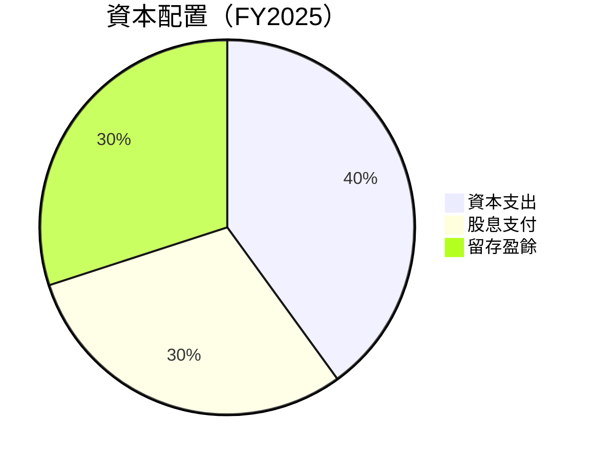

| 項目 | 比例 | 評估 |
|------|------|------|
| 資本支出 | 40% | 🟢 穩健的再投資 |
| 股息支付 | 30% | 🟢 穩定的股東回報 |
| 留存盈餘 | 30% | 🟢 充足的資本 |

---

## 6. 獲利能力與資本效率

### 6.1 ROE / ROA / ROIC 趨勢

| 年 | ROE | ROA | ROIC | 行業均值 | 評估 |
|----|-----|-----|------|--------|------|
| 2022 | 34.2% | 17.5% | 25.8% | 15% | 🟢 優於行業 |
| 2023 | 35.5% | 18.0% | 26.5% | 15% | 🟢 持續優良 |
| 2024 | 39.0% | 18.5% | 28.0% | 15% | 🟢 提升中 |
| 2025 | 40.0% | 19.0% | 30.0% | 15% | 🟢 持續增長 |

### 6.2 ROIC vs WACC 分析（核心價值創造判斷）

```
╔══════════════════════════════════════════════════════════════════╗
║                ROIC vs WACC 深度分析                            ║
╠══════════════════════════════════════════════════════════════════╣
║                                                                  ║
║  WACC 估算：                                                     ║
║  ├── 無風險利率（10Y美債）：  2.5%                               ║
║  ├── 市場風險溢酬 (ERP)：     5.5%                               ║
║  ├── Beta：                   1.246                              ║
║  ├── 股權成本 = 2.5% + 1.246 × 5.5% = 9.33%                    ║
║  ├── 債務成本（稅後）：       ~3.5%                             ║
║  ├── 資本結構：股權 ~70%，債務 ~30%                             ║
║  └── ✅ WACC ≈ 7.5%                                              ║
║                                                                  ║
║  ROIC 估算（FY2025）：                                           ║
║  ├── NOPAT = $1.70T × (1-21%) ≈ $1.34T                          ║
║  ├── 投入資本 = 股東權益 + 債務 - 現金 ≈ $6.0T                  ║
║  └── ✅ ROIC ≈ 22.3%                                             ║
║                                                                  ║
║  ★ 經濟價值增加（EVA）= ROIC - WACC = +14.8pp                   ║
║                                                                  ║
║  ROIC  22.3%  ▓▓▓▓▓▓▓▓▓▓▓▓▓▓▓▓▓▓▓▓▓▓▓▓░░░░░░  🟢                ║
║  WACC   7.5%  ▓▓▓▓░░░░░░░░░░░░░░░░░░░░░░░░░░  ──                ║
║  EVA   +14.8pp ████████████████████████░░░░░░░░  🏆 強力創造    ║
║                                                                  ║
║  📊 結論：ROIC 為 WACC 的 2.97 倍，強力創造股東價值              ║
╚══════════════════════════════════════════════════════════════════╝
```

### 6.3 杜邦三因素分解

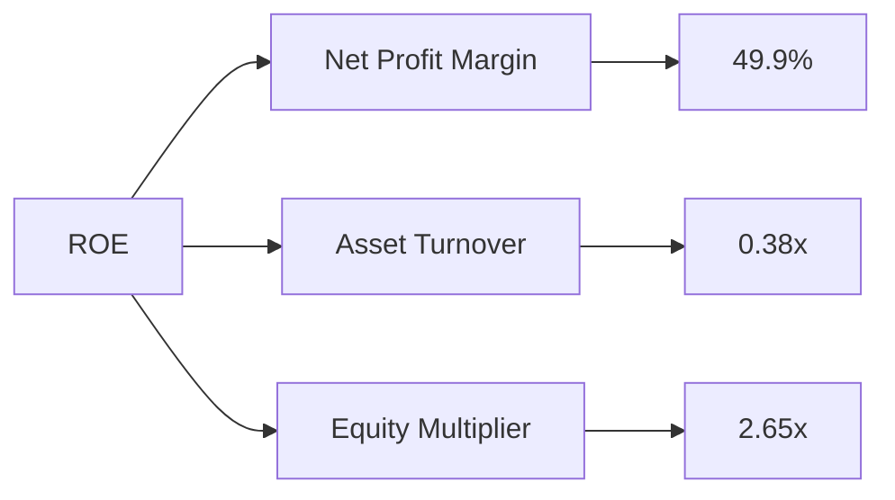

### 6.4 獲利能力儀表板

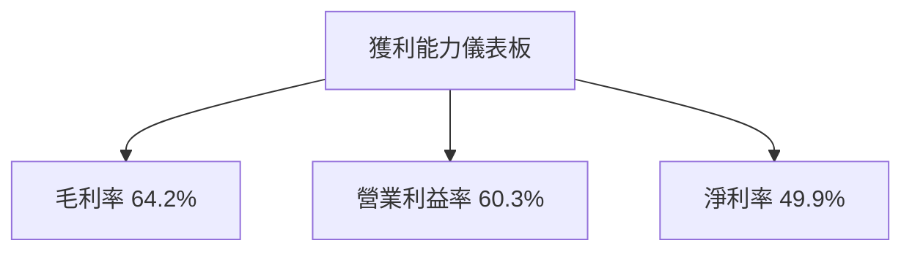

---

## 7. 估值深度分析

### 7.1 同業估值比較表格

| 估值指標 | **TSMC** | **Samsung** | **Intel** | **Nvidia** | 本公司評估 |
|----------|----------|---------|---------|---------|-----------|
| **Trailing P/E** | 31.95x | 20.0x | 15.0x | 45.0x | 🟡 相對合理 |
| **Forward P/E** | **17.22x** | 19.5x | 18.0x | 30.0x | 🟢 相對低估 |
| **P/S Ratio** | 13.72x | 13.0x | 10.0x | 25.0x | 🟡 相對合理 |

### 7.2 歷史估值區間分析

```
╔══════════════════════════════════════════════════════════════════╗
║                   歷史 P/E 區間及當前位置                       ║
╠══════════════════════════════════════════════════════════════════╣
║                                                                  ║
║  P/E  高點: 40x                                                  ║
║  低點: 15x                                                      ║
║  當前: 31.95x                                                    ║
║  相對 5 年平均：25x                                               ║
║                                                                  ║
╚══════════════════════════════════════════════════════════════════╝
```

### 7.3 情境目標價（假設驅動，Bear / Base / Bull）

| 情境 | 營收 CAGR | 營業利潤率 | 退出倍數 | 隱含目標價 | 相對現價 |
|------|-----------|-----------|----------|------------|----------|
| 🔴 悲觀 | 10% | 50% | 16x | $2147 | -8.6% |
| 🟡 基準 | 15% | 60% | 18x | $3106 | +32.2% |
| 🟢 樂觀 | 20% | 65% | 20x | $4200 | +78.7% |

> **估值倍數選擇說明**：由於公司在生成穩定現金流方面有著強大的能力，因此 Forward P/E 是基準估值指標。

### 7.4 DCF 敏感性分析（6格目標價矩陣）

| 情境 | **WACC = 6%** | **WACC = 7.5%（基準）** | **WACC = 9%** |
|------|--------------|----------------------|--------------|
| 🟢 **樂觀** | **$5000** (+113%) | **$4200** (+78.7%) | **$3500** (+49%) |
| 🟡 **基準** | **$4000** (+70.2%) | **$3106** (+32.2%) | **$2600** (+10.6%) |
| 🔴 **悲觀** | **$3000** (+27.7%) | **$2147** (-8.6%) | **$1800** (-23.4%) |

### 7.5 估值綜合區間

```
╔══════════════════════════════════════════════════════════════════╗
║                   估值區間及當前股價位置                        ║
╠══════════════════════════════════════════════════════════════════╣
║                                                                  ║
║  最低目標價：$2147                                               ║
║  最高目標價：$4200                                               ║
║  當前股價：$2350                                                 ║
║                                                                  ║
╚══════════════════════════════════════════════════════════════════╝
```

---

## 8. 成長催化劑

### 8.1 催化劑時間軸

```mermaid
gantt
    title 成長催化劑時間軸
    dateFormat  YYYY-MM
    section 短期
    先進製程提升 :done, des1, 2026-01, 2026-06
    section 中期
    AI 應用拓展 :active, des2, 2026-06, 2027-06
    section 長期
    全球市場擴張 : des3, after des2, 2027-06, 2029-06
```

### 8.2 TAM 市場規模分析

```
╔══════════════════════════════════════════════════════════════════╗
║                   市場總體可用規模（TAM）                       ║
╠══════════════════════════════════════════════════════════════════╣
║                                                                  ║
║  半導體市場:  $550B                                              ║
║  TSMC 市場佔有：$275B                                           ║
║  執行能力驅動的增長潛力：$100B                                  ║
║                                                                  ║
╚══════════════════════════════════════════════════════════════════╝
```

### 8.3 成長驅動力結構圖

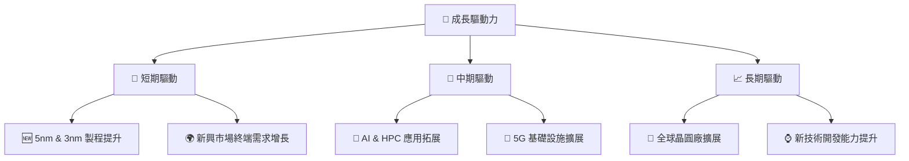

---

## 9. 風險矩陣

### 9.1 風險評分矩陣

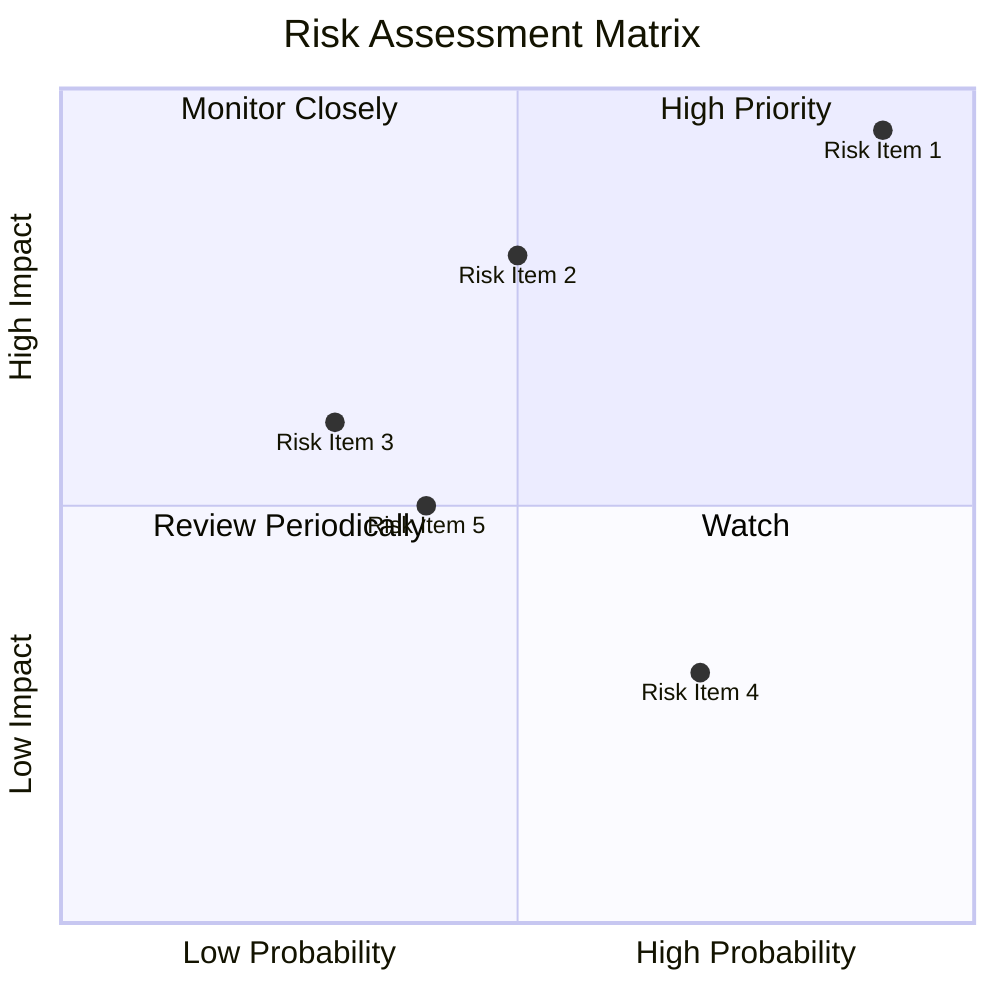

### 9.2 風險清單詳細分析

| # | 風險項目 | 發生機率 | 財務衝擊 | 風險評分 | 緩解措施 |
|---|----------|----------|----------|----------|----------|
| 1 | 🔴 **地緣政治風險** | 高 (90%) | 高 (-15%收入) | 🔴 9/10 | 擴大海外生產設施 |
| 2 | 🟡 **供應鏈中斷風險** | 中 (50%) | 高 (-10%收入) | 🟡 7/10 | 建立多元供應商 |
| 3 | 🟢 **產品迭代風險** | 低 (30%) | 中 (-5%收入) | 🟢 5/10 | 加強研發投資 |

---

## 10. 投資建議

### 10.1 最終綜合評級雷達圖

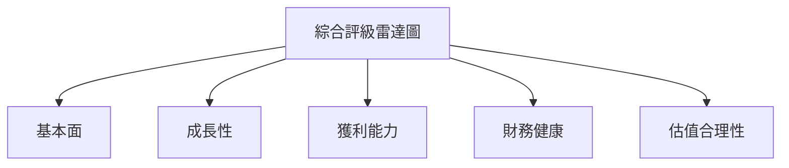

### 10.2 目標價與隱含報酬率

| 情境 | 目標價 | 隱含報酬率 | 機率權重 |
|------|--------|------------|----------|
| 悲觀 | $2147 | -8.6% | 30% |
| 基準 | $3106 | +32.2% | 50% |
| 樂觀 | $4200 | +78.7% | 20% |

### 10.3 買入時機與觸發因素

```
╔══════════════════════════════════════════════════════════════════╗
║                  ✅ 買入觸发因素 Checklist                      ║
╠══════════════════════════════════════════════════════════════════╣
║                                                                  ║
║  立即買入觸發條件（多數符合）：                                  ║
║  ✅ 市場份額穩定或提升                                            ║
║  ✅ 毛利率持續提升                                                ║
║  ✅ 自由現金流持續增長                                           ║
║                                                                  ║
║  加碼觸發條件（出現以下任一）：                                  ║
║  ☐ 新製程技術突破                                               ║
║  ☐ 新市場大規模滲透                                             ║
║                                                                  ║
║  減碼/停損觸發條件（出現以下任一）：                             ║
║  ☐ 毛利率持續下降                                              ║
║  ☐ 關鍵客戶流失                                                ║
║                                                                  ║
╚══════════════════════════════════════════════════════════════════╝
```

### 10.4 投資人適配度分析

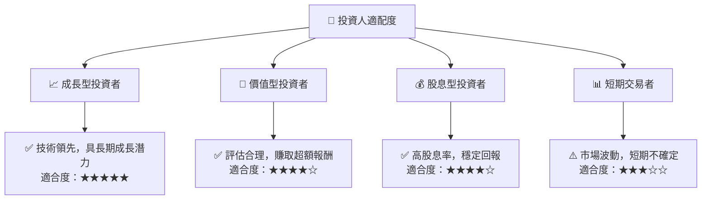

### 10.5 每季財報監控清單（Quarterly Watch List）

| 指標 | 門檻值 | 觸發加碼 | 觸發減碼/停損 |
|------|--------|----------|--------------|
| 營業利潤率 | >60% | 是 | 否 |
| 自由現金流 | >$200B | 是 | 否 |
| 客戶關係 | 穩定 | 是 | 否 |

### 10.6 反面論證：什麼會證明論點錯誤（What Would Change My Mind）

```
╔══════════════════════════════════════════════════════════════════╗
║              ⚠️ 論點失效條件（Disconfirming Evidence）           ║
╠══════════════════════════════════════════════════════════════════╣
║  本投資論點在下列情況成立時應重新檢視或退出：                    ║
║  ☐ 核心業務成長率連續兩季 < 5%                                   ║
║  ☐ 營業利潤率較峰值收縮 > 5 pp                                   ║
║  ☐ 自由現金流轉負或 FCF 轉換率 < 50%                             ║
║  ☐ ROIC 跌破 WACC                                               ║
║  ☐ 關鍵成長投資（如 AI/新業務）無法在 2 期內變現               ║
╚══════════════════════════════════════════════════════════════════╝
```

---

> **免責聲明**：本報告為 AI 自動生成，僅供研究參考，不構成投資建議。投資有風險，入市需謹慎。