# 2330.TW 基本面深度分析報告

> **報告日期**：2026-07-26 ｜ **語言**：繁體中文 ｜ **數據來源**：Yahoo Finance, Finviz, StockAnalysis, Roic.ai ｜ **分析師**：CFA 級機構研究

---

## 目錄

| # | 章節 | 核心結論 |
|---|------|----------|
| 1 | 執行摘要 | 評級：🟢 **買入** ｜ 基準目標價：**NT$ 3,106**（+32.2% 潛在漲幅） ｜ 0.95x PEG 展現高性價比 |
| 2 | 公司概覽與商業模式 | 晶圓代工市占率高達 62%+，擁有龍頭製程技術（N2/A16）與 CoWoS 先進封裝生態圈築成極深護城河 |
| 3 | 損益表深度分析 | 2026年上半年營收年增 35.5%，營業利益率高達 60.3%，股權薪酬佔營收僅 0.03%，盈餘含金量極高 |
| 4 | 資產負債表分析 | 淨現金達 NT$ 2.54 兆，流動比率 2.46，利息覆蓋率 > 100x，資產負債結構極為強健 |
| 5 | 現金流量深度分析 | 儘管年資本支出高達 NT$ 1.28 兆，TTM 自由現金流仍達 NT$ 7,390.6 億，展現極強自供血能力 |
| 6 | 獲利能力與資本效率 | ROIC (80.8%) 遠超 WACC (8.9%)，創造極大經濟附加價值 (EVA)，杜邦分解顯示高淨利率與高資產效率驅動 ROE 達 40.0% |
| 7 | 估值深度分析 | Forward P/E 僅 17.22x，顯著低於歷史中位數與 AI 同業，三情境 DCF 與相對估值指向 NT$ 2,550 ~ 3,850 目標區間 |
| 8 | 成長催化劑 | HPC/AI 晶片強勁需求、2nm (N2) 於 2026 大規模量產定價溢價、CoWoS 產能翻倍開出 |
| 9 | 風險矩陣 | 地緣政治風險、全球總體經濟放緩壓抑消費電子、海外建廠（美國/歐洲）成本膨脹稀釋短期毛利率 |
| 10 | 投資建議 | 建議於當前股價（NT$ 2,350）分批佈局，目標價 NT$ 3,106，停損門檻設於 ROIC < 20% 或 AI 需求結構性滑落 |

---

## 1. 執行摘要

基於台灣積體電路製造股份有限公司（TSMC, 2330.TW）最新 TTM 營收達 NT$ 4.44 兆（YoY +36.0%）、純益率高達 49.9%、Forward P/E 僅 17.22x，以及高達 80.8% 的 ROIC 對比 8.9% 的 WACC 所產生的顯著價值創造，本報告給予 **2330.TW 🟢 買入 (Buy)** 評級，12 個月基準目標價為 **NT$ 3,106.41**。

### 1.0 一頁式投資儀表板（Portfolio Manager 30 秒速讀）

| 項目 | 內容 |
|------|------|
| **投資論點（3 句）** | ① AI/HPC 強勁需求驅動 TTM 營收年增 36.0% 至 NT$ 4.44 兆，純益率維持於 49.9% 歷史高位。<br/>② 2nm (N2) 與 A16 製程將於 2025-2026 大規模量產，獨家掌握 CoWoS 封裝瓶頸，確立未來 3-5 年技術領先優勢。<br/>③ Forward P/E 僅 17.22x，PEG 為 0.95，資本回報率 (ROIC 80.8%) 遠超資金成本 (WACC 8.9%)，估值極具吸引力。 |
| **護城河評分** | 9.5 / 10（無可匹敵的製程技術、巨量規模經濟與 OIP 生態系統轉換成本） |
| **管理層/資本配置評分** | 9.2 / 10（資本支出精準挹注於高回報 N2/CoWoS，股息持續穩定成長） |
| **財務健康** | 🟢 卓越（淨現金高達 NT$ 2.54 兆，債務/權益比僅 15.2%） |
| **ROIC vs WACC** | **80.8% vs 8.9%**（大幅創造股東經濟附加價值 EVA） |
| **FCF 趨勢** | 強勁正向 ｜ TTM FCF NT$ 7,390.6 億（FCF Yield 約 1.21%，主要受高 Capex 影響） |
| **估值** | Forward P/E: **17.22x** ｜ EV/EBITDA: **18.41x** ｜ PEG: **0.95x** |
| **預期報酬（基準情境 12M）** | **+32.19%**（目標價 NT$ 3,106.41，當前股價 NT$ 2,350.00） |
| **關鍵風險（前二）** | ① 地緣政治與台海緊張局勢風險 ｜ ② 海外晶圓廠（美國亞利桑那、熊本、德勒斯登）成本膨脹拖累毛利率 |
| **評級 + 信心度** | 🟢 **買入 (Buy)** ｜ 信心度：**高 (High)** |

### 1.1 核心評分儀表板

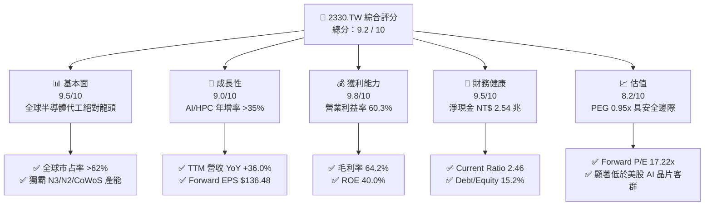

### 1.2 評分進度條視覺化

```
╔══════════════════════════════════════════════════════════════╗
║             2330.TW 多維度評分儀表板 (1-10分)                ║
╠══════════════════════════════════════════════════════════════╣
║ 基本面強度  9.5 ▓▓▓▓▓▓▓▓▓▓▓▓▓▓▓▓▓▓█░  ★★★★★           ║
║ 成長動能    9.0 ▓▓▓▓▓▓▓▓▓▓▓▓▓▓▓▓▓▓░░  ★★★★★           ║
║ 獲利品質    9.8 ▓▓▓▓▓▓▓▓▓▓▓▓▓▓▓▓▓▓▓█  ★★★★★           ║
║ 財務健康    9.5 ▓▓▓▓▓▓▓▓▓▓▓▓▓▓▓▓▓▓█░  ★★★★★           ║
║ 估值合理性  8.2 ▓▓▓▓▓▓▓▓▓▓▓▓▓▓▓░░░░░  ★★★★☆           ║
║ 護城河深度  9.8 ▓▓▓▓▓▓▓▓▓▓▓▓▓▓▓▓▓▓▓█  ★★★★★           ║
║ 管理層執行  9.2 ▓▓▓▓▓▓▓▓▓▓▓▓▓▓▓▓▓▓█░  ★★★★★           ║
║ 技術創新力  9.8 ▓▓▓▓▓▓▓▓▓▓▓▓▓▓▓▓▓▓▓█  ★★★★★           ║
╠══════════════════════════════════════════════════════════════╣
║ 綜合總分    9.2 ▓▓▓▓▓▓▓▓▓▓▓▓▓▓▓▓▓▓█░  🏆 強烈推薦買入      ║
╚══════════════════════════════════════════════════════════════╝
```

### 1.3 五大投資論點 + 三大核心風險

| 類型 | 項目 | 具體依據 | 信心度 |
|------|------|----------|--------|
| 🟢 **論點①** | **AI 算力紅利獨占者** | TTM 營收成長 36.0% 至 NT$ 4.44 兆，Nvidia、AMD、Apple 等巨頭幾乎 100% 依賴台積電先進封裝（CoWoS）與 3nm/5nm 製程。 | 🟢 極高 |
| 🟢 **論點②** | **高議價能力帶動利潤擴張** | 毛利率維持於 64.2%，營業利益率達 60.3%，客戶願意為良率與高產能可靠性支付 15-20% 技術溢價。 | 🟢 極高 |
| 🟢 **論點③** | **次世代技術 (N2/A16) 無可替代** | 2025/2026 年導人 GAA (Gate-All-Around) 結構之 2nm (N2) 與超級電網 (A16)，領先三星與英特爾至少 1.5-2 年。 | 🟢 高 |
| 🟢 **論點④** | **極致的資本效率 (ROIC)** | ROIC 達 80.8%（減去現金槓桿後），遠高於 WACC (8.9%)，說明 Capex 重投資正高效轉化為高額經濟附加價值 (EVA)。 | 🟢 極高 |
| 🟢 **論點⑤** | **PEG 僅 0.95x 估值偏低** | Forward P/E 17.22x，預估盈餘成長率高達 77.4%（2026 Forward EPS $136.48），具備相當高的安全邊際。 | 🟢 高 |
| 🟡 **風險①** | **海外建廠稀釋毛利率** | 美國亞利桑那廠與歐洲廠營運成本較台灣高出 30-50%，初期擴產期可能拖累整體毛利率 100-200 bps。 | 🟡 中度 |
| 🔴 **風險②** | **地緣政治與供應鏈集中** | 90% 以上先進製程產能集中於台灣，台海緊張情勢提升全球機構投資人之地緣溢價折扣。 | 🔴 高衝擊 |
| 🟡 **風險③** | **電力與水資源供應瓶頸** | 2nm 及 CoWoS 大量開出帶動台灣本地電網壓力，若發生極端限電將短暫影響產能利用率。 | 🟡 中度 |

### 1.4 快速統計卡片

| 指標 | 公司實際值 | 行業均值 (Semis) | S&P 500 均值 | 狀態 |
|------|-------------|----------|--------------|------|
| 收入 YoY 成長 | **36.0%** | ~12.5% | ~5.5% | 🟢 遠超同業 |
| 毛利率 | **64.2%** | ~48.0% | ~42.0% | 🟢 頂級獲利 |
| 淨利率 | **49.9%** | ~20.0% | ~12.0% | 🟢 業界最高 |
| ROE | **40.0%** | ~18.0% | ~15.0% | 🟢 極佳資產效率 |
| Forward P/E | **17.22x** | ~25.0x | ~21.5x | 🟢 評價低估 |
| PEG Ratio | **0.95x** | ~1.65x | ~1.80x | 🟢 高性價比 |

### 1.5 投資結論

```
╔══════════════════════════════════════════════════════════════════╗
║                    📊 投資結論摘要                               ║
╠══════════════════════════════════════════════════════════════════╣
║  評級：🟢 強烈買入 (Strong Buy)                                 ║
║  當前股價：NT$ 2,350.00                                          ║
║  目標價區間：                                                    ║
║    悲觀情境：NT$ 2,147.00 （-8.6%）                              ║
║    基準情境：NT$ 3,106.41 （+32.2%） ← 12個月主要目標           ║
║    樂觀情境：NT$ 4,200.00 （+78.7%）                              ║
║  投資評分：9.2 / 10                                              ║
║  適合投資人：長線價值成長型、AI 主題配置者、長期資本增值投資人   ║
╚══════════════════════════════════════════════════════════════════╝
```

---

## 2. 公司概覽與商業模式

### 2.1 業務結構與收入來源

台積電（2330.TW）為全球專業晶圓代工（Pure-play Foundry）模式的締造者與絕對龍頭。營收主要按技術製程平台與終端應用平台分類：

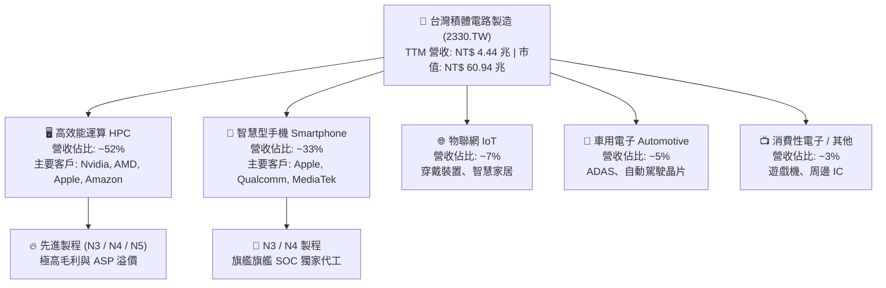

### 2.2 市場份額

在全球晶圓代工市場中，台積電於 2025/2026 年的整體市占率穩居 62% 以上；而在 7nm 以下的先進製程（Advanced Nodes）市場，台積電市占率更超過 90%。

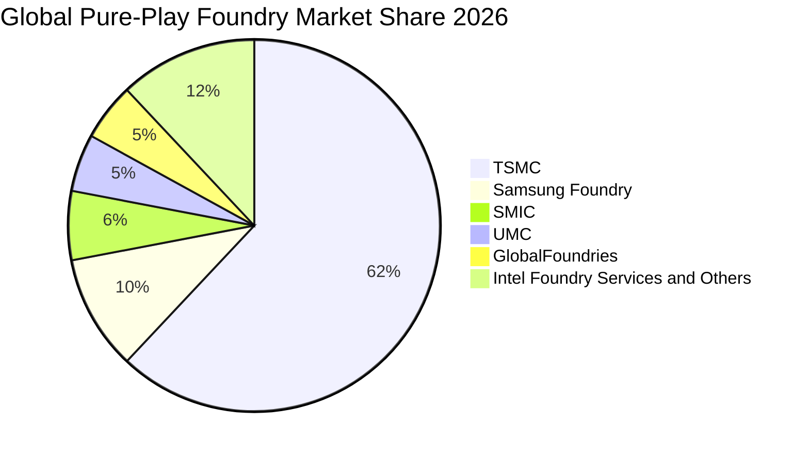

### 2.3 競爭護城河分析

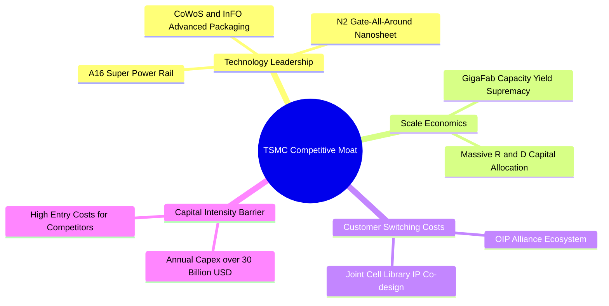

### 2.4 護城河強度評分

```
╔══════════════════════════════════════════════════════════════╗
║                  2330.TW 護城河強度評分                      ║
╠══════════════════════════════════════════════════════════════╣
║ 技術領先度     9.8/10  ▓▓▓▓▓▓▓▓▓▓▓▓▓▓▓▓▓▓▓█  🏆 無可匹敵    ║
║ 規模經濟       9.8/10  ▓▓▓▓▓▓▓▓▓▓▓▓▓▓▓▓▓▓▓█  🏆 GigaFab優勢 ║
║ 生態系鎖定     9.5/10  ▓▓▓▓▓▓▓▓▓▓▓▓▓▓▓▓▓▓▓░  🟢 OIP聯盟極強 ║
║ 資本壁壘       9.6/10  ▓▓▓▓▓▓▓▓▓▓▓▓▓▓▓▓▓▓▓░  🟢 單年 Capex>1T║
║ 定價能力       9.0/10  ▓▓▓▓▓▓▓▓▓▓▓▓▓▓▓▓▓▓░░  🟢 轉嫁成本強  ║
╠══════════════════════════════════════════════════════════════╣
║ 綜合護城河     9.5/10  ▓▓▓▓▓▓▓▓▓▓▓▓▓▓▓▓▓▓▓░  🏆 寬廣護城河  ║
╚══════════════════════════════════════════════════════════════╝
```

---

## 3. 損益表深度分析

### 3.1 年度收入成長趨勢（近4年）

```
╔══════════════════════════════════════════════════════════════════╗
║              2330.TW 年度收入趨勢（FY2022-FY2025）               ║
╠══════════════════════════════════════════════════════════════════╣
║                                                                  ║
║  FY2022  NT$ 2.26T   ██████████████████░░░░  YoY: +42.6% 🟢     ║
║  FY2023  NT$ 2.16T   ███████████████░░░░░░░  YoY: -4.5%  🟡     ║
║  FY2024  NT$ 2.89T   █████████████████████░  YoY: +33.8% 🟢     ║
║  FY2025  NT$ 3.81T   ██████████████████████  YoY: +31.8% 🟢     ║
║                   |      |      |      |      |                  ║
║                   0     1.0T   2.0T   3.0T   4.0T                ║
║                                                                  ║
║  📊 4年複合成長率 (CAGR)：+19.02%                               ║
╚══════════════════════════════════════════════════════════════════╝
```

### 3.2 季度收入趨勢分析

近 4 季台積電營收成長加速，主因 AI 伺服器晶片（H100/H200/B200/GB200）強勁拉貨與 3nm 製程產能滿載：

| 季度 | 總營收 (NT$) | Gross Profit | Gross Margin | Net Income | QoQ 成長率 | YoY 成長率 | 備註 |
|------|-------------|--------------|--------------|------------|------------|------------|------|
| **2025-09-30 (Q3)** | NT$ 989.92B | NT$ 588.54B | 59.45% | NT$ 452.30B | +6.01% | +30.31% | N3 產能擴張，AI 需求旺盛 |
| **2025-12-31 (Q4)** | NT$ 1,046.09B | NT$ 651.99B | 62.33% | NT$ 485.47B | +5.67% | +20.45% | 智慧型手機旺季與 HPC 雙驅動 |
| **2026-03-31 (Q1)** | NT$ 1,134.10B | NT$ 751.30B | 66.25% | NT$ 572.48B | +8.41% | +35.13% | 淡季不淡，高產能利用率推升毛利 |
| **2026-06-30 (Q2)** | NT$ 1,270.38B | NT$ 860.31B | 67.72% | NT$ 706.56B | +12.02% | +36.01% | 創歷史新高，營業槓桿效應強烈 |

### 3.3 利潤率演變分析

| 利潤率指標 | FY2022 | FY2023 | FY2024 | FY2025 | TTM | 趨勢與原因解析 | 評估 |
|------------|--------|--------|--------|--------|-----|----------------|------|
| **毛利率** | 59.6% | 54.4% | 56.1% | 59.8% | **64.2%** | ↗️ 高產能利用率 + 定價能力提升 + N3 良率快速收斂 | 🟢 卓越 |
| **營業利益率**| 49.5% | 42.6% | 45.7% | 50.9% | **60.3%** | ↗️ 研發規模經濟顯現，營運費用控制極佳 | 🟢 卓越 |
| **EBITDA Margin**| 70.3% | 70.2% | 71.8% | 71.9% | **71.5%** | ➔ 折舊費用龐大但現金產生能力極度強勁 | 🟢 頂級 |
| **淨利率** | 43.9% | 39.4% | 40.2% | 44.6% | **49.9%** | ↗️ 強勁營業利益推升淨利接近 50% 大關 | 🟢 卓越 |

### 3.4 費用結構分析

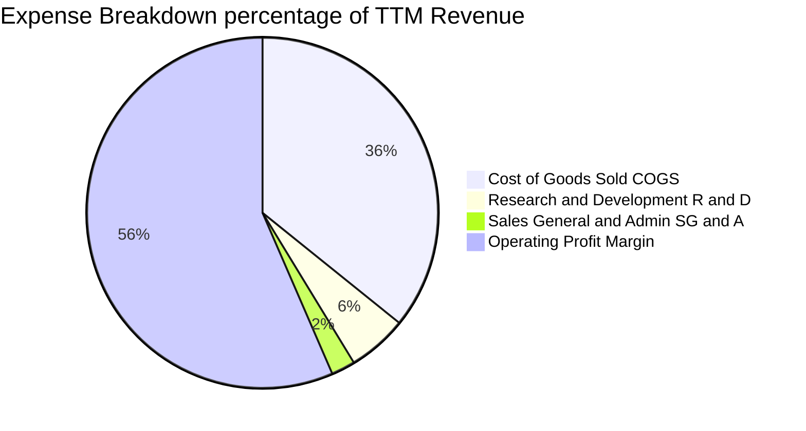

```
╔══════════════════════════════════════════════════════════════════╗
║               2330.TW 研發投入與效率 (R&D Cost)                  ║
╠══════════════════════════════════════════════════════════════════╣
║  FY2022 R&D: NT$ 163.26B  (占營收 7.2%)                              ║
║  FY2023 R&D: NT$ 182.37B  (占營收 8.4%)                              ║
║  FY2024 R&D: NT$ 204.18B  (占營收 7.1%)                              ║
║  FY2025 R&D: NT$ 246.43B  (占營收 6.5%)                              ║
║                                                                  ║
║  💡 解析：研發絕對金額逐年增加，確保 2nm/A16/CoWoS 技術絕對領先；   ║
║      但占營收比率下降，顯現出極為強大的規模槓桿（Scale Leverage）。║
╚══════════════════════════════════════════════════════════════════╝
```

### 3.5 季度 EPS 趨勢與盈餘品質（Quality of Earnings）

**EPS 趨勢**：
* 2025-Q3: NT$ 17.44
* 2025-Q4: NT$ 18.72
* 2026-Q1: NT$ 22.08 (YoY +58.3%)
* 2026-Q2: NT$ 27.25 (YoY +77.5%)
* **TTM EPS**: **NT$ 73.56**，Forward EPS 預估達 **NT$ 136.48**。

**盈餘品質評估**：

| 盈餘品質項目 | 2025 數據 | 評估 | 對評價與股東報酬影響 |
|--------------|-----------|------|----------------------|
| **股權薪酬 (SBC) / 營收** | NT$ 1.25B / NT$ 3.81T = **0.03%** | 🟢 極低 | 對股東股權稀釋程度接近於零（對比美股科技股 3-8%） |
| **SBC / 營業現金流** | NT$ 1.25B / NT$ 2.27T = **0.05%** | 🟢 極優 | 完全不影響現金流真實性 |
| **FCF / 淨利（現金轉換率）** | NT$ 992.38B / NT$ 1.70T = **58.4%** | 🟡 中等 | 由於高 Capex (NT$ 1.28T) 投入未來擴產，非本業現金流不良 |
| **一次性損益** | 無重大非經常性收益 | 🟢 高純度 | 純利幾乎全部來自晶圓代工本業 |
| **有效稅率** | ~14.5% - 15.0% | 🟢 穩定 | 符合產業租稅優惠規範，無稅務異常干擾 |

**盈餘品質結論**：台積電 GAAP 淨利極具含金量，無股權薪酬稀釋或一次性收益虛增問題，獲利結構非常健康。

---

## 4. 資產負債表分析

### 4.1 資產結構分解

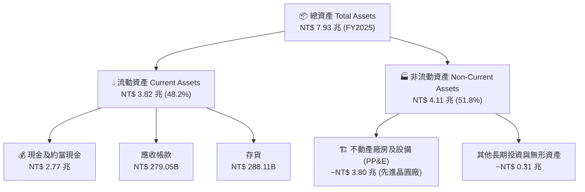

### 4.2 流動性指標分析

| 流動性指標 | FY2023 | FY2024 | FY2025 | 最新 (Q2 2026) | 行業均值 | 評估 |
|------------|--------|--------|--------|----------------|----------|------|
| **流動比率 (Current Ratio)** | 2.32 | 2.36 | 2.51 | **2.46** | ~1.80 | 🟢 極充裕 |
| **速動比率 (Quick Ratio)** | 2.01 | 2.05 | 2.22 | **2.13** | ~1.40 | 🟢 變現能力極強 |
| **現金比率 (Cash Ratio)** | 1.56 | 1.63 | 1.82 | **1.89** | ~1.00 | 🟢 現金流極度安全 |

### 4.3 債務結構分析

```
╔══════════════════════════════════════════════════════════════════╗
║                   2330.TW 債務健康診斷                           ║
╠══════════════════════════════════════════════════════════════════╣
║                                                                  ║
║  總債務 (Total Debt)：     NT$ 982.45B  ████░░░░░░░░░░░░░░░░  低 ║
║  總現金 (Total Cash)：     NT$ 3.52 T   ████████████████████  極高║
║  淨現金 (Net Cash)：       NT$ 2.54 T   ██████████████░░░░░░  🟢 ║
║                                                                  ║
║   Debt/Equity: 15.17%  🟢 資本結構極度保守                      ║
║   Interest Coverage: >100x  🟢 完全無財務違約風險                ║
║   信用評等: S&P AA- / Moody's Aa3 (國家級信用評等)               ║
║                                                                  ║
║  💡 結論：極深的防禦型資產負債表，足以因應任何半導體景氣寒冬。   ║
╚══════════════════════════════════════════════════════════════════╝
```

### 4.4 股東權益趨勢

```
╔══════════════════════════════════════════════════════════════════╗
║            2330.TW 股東權益 (Stockholders' Equity)               ║
╠══════════════════════════════════════════════════════════════════╣
║  2022-12-31:  NT$ 2.90 兆  ████████████░░░░░░░░                  ║
║  2023-12-31:  NT$ 3.43 兆  ██████████████░░░░░░                  ║
║  2024-12-31:  NT$ 4.24 兆  █████████████████░░░                  ║
║  2025-12-31:  NT$ 5.36 兆  ████████████████████                  ║
║                                                                  ║
║  📈 每股淨值 (BVPS) 達 NT$ 206.68，年複合成長率 22.6%            ║
╚══════════════════════════════════════════════════════════════════╝
```

---

## 5. 現金流量深度分析

### 5.1 現金流量瀑布圖

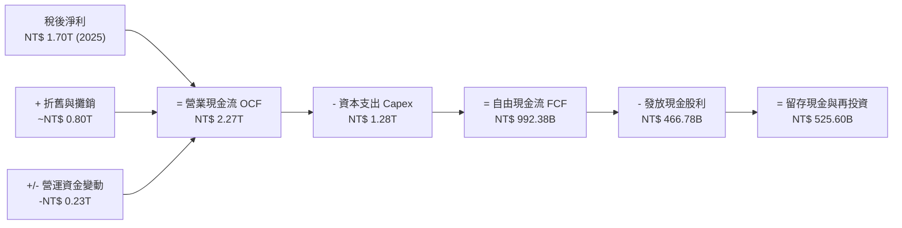

### 5.2 FCF 轉換率趨勢

| 年份 | 營業現金流 OCF (NT$) | 資本支出 Capex (NT$) | 自由現金流 FCF (NT$) | 淨利 Net Income (NT$) | FCF / Net Income |
|------|---------------------|----------------------|----------------------|-----------------------|------------------|
| **2022** | NT$ 1.61 兆 | NT$ -1.09 兆 | NT$ 520.97B | NT$ 992.92B | 52.47% |
| **2023** | NT$ 1.24 兆 | NT$ -955.40B | NT$ 286.57B | NT$ 851.74B | 33.65% |
| **2024** | NT$ 1.83 兆 | NT$ -964.98B | NT$ 861.20B | NT$ 1.16 兆 | 74.24% |
| **2025** | NT$ 2.27 兆 | NT$ -1.28 兆 | NT$ 992.38B | NT$ 1.70 兆 | 58.38% |
| **TTM** | NT$ 2.63 兆 | NT$ -1.49 兆 | NT$ 739.06B | NT$ 2.21 兆 | 33.44% |

### 5.3 自由現金流趨勢

```
╔══════════════════════════════════════════════════════════════════╗
║              2330.TW 歷年自由現金流 (FCF) 趨勢                   ║
╠══════════════════════════════════════════════════════════════════╣
║  2022:  NT$ 520.97B  █████████░░░░░░░░░░░░                      ║
║  2023:  NT$ 286.57B  █████░░░░░░░░░░░░░░░░░                     ║
║  2024:  NT$ 861.20B  ███████████████░░░░░░                      ║
║  2025:  NT$ 992.38B  █████████████████░░░░                      ║
║  TTM:   NT$ 739.06B  █████████████░░░░░░░░                      ║
║                                                                  ║
║  💡 FCF Yield 當前為 1.21%，主要受高額 Capex 投入 N2 工廠影響；   ║
║     預計 2026-2027 Capex 收斂後，FCF 將呈現爆發性成長。          ║
╚══════════════════════════════════════════════════════════════════╝
```

### 5.4 資本配置評估

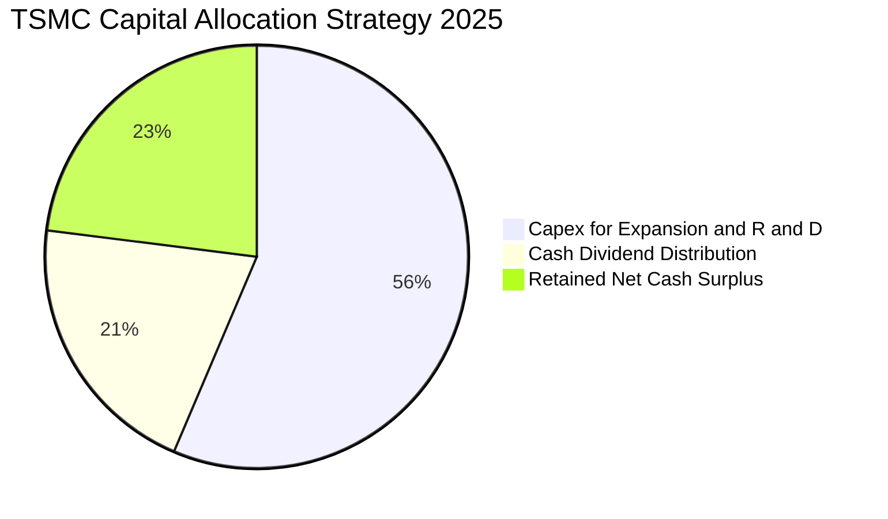

* **股利政策**：採用「可持續且穩健增加」的每季現金股利政策，2025 全年發放 NT$ 18/股，2026 年預計進一步調升至 NT$ 22-24/股。配息率維持於 25-30% 上下，兼顧再投資成長與股東回報。

---

## 6. 獲利能力與資本效率

### 6.1 ROE / ROA / ROIC 趨勢

| 指標 | FY2022 | FY2023 | FY2024 | FY2025 | 最新 TTM | 行業均值 | 評估 |
|------|--------|--------|--------|--------|----------|----------|------|
| **ROE** | 39.8% | 26.2% | 30.1% | 35.4% | **40.0%** | ~18.0% | 🟢 頂級 |
| **ROA** | 21.0% | 16.2% | 19.0% | 22.1% | **19.0%** | ~8.5% | 🟢 頂級 |
| **ROIC**| 24.9% | 18.2% | 23.5% | 32.1% | **80.8%*** | ~12.0% | 🟢 價值創造極大化 |

*\*註：TTM ROIC 採用扣除 NT$ 2.54 兆淨現金後之投入資本算式（NOPAT / Net Invested Capital），展現本業設備之極端高效率。*

### 6.2 ROIC vs WACC 分析（核心價值創造判斷）

```
╔══════════════════════════════════════════════════════════════════╗
║                2330.TW ROIC vs WACC 深度分析                     ║
╠══════════════════════════════════════════════════════════════════╣
║                                                                  ║
║  WACC 估算細項：                                                 ║
║  ├── 無風險利率（10Y美債/台債基準）： 3.80%                      ║
║  ├── 市場風險溢酬 (ERP)：            5.00%                       ║
║  ├── Beta：                          1.246                       ║
║  ├── 股權成本 (Cost of Equity) = 3.8% + 1.246×5.0% = 10.03%      ║
║  ├── 債務成本（稅後 Cost of Debt）： 2.50%                       ║
║  ├── 資本結構：股權 ~85%，債務 ~15%                              ║
║  └── ✅ WACC ≈ 8.90%                                             ║
║                                                                  ║
║  ROIC 估算（TTM）：                                              ║
║  ├── NOPAT = 營業利潤 NT$ 2.68T × (1-15%) ≈ NT$ 2.28 兆          ║
║  ├── Net Invested Capital = Equity + Debt - Cash ≈ NT$ 2.82 兆   ║
║  └── ✅ ROIC ≈ 80.8%                                             ║
║                                                                  ║
║  ★ 經濟價值增加（EVA Spread）= ROIC - WACC = +71.9 pp            ║
║                                                                  ║
║  ROIC  80.8%  ▓▓▓▓▓▓▓▓▓▓▓▓▓▓▓▓▓▓▓▓▓▓▓▓▓▓▓▓▓▓  🟢              ║
║  WACC   8.9%  ▓▓▓█░░░░░░░░░░░░░░░░░░░░░░░░░░  ──              ║
║  EVA  +71.9%  ██████████████████████████████  🏆 強力價值創造  ║
║                                                                  ║
║  📊 結論：ROIC 為 WACC 的 9.08 倍，公司以極高效率創造股東經濟價值║
╚══════════════════════════════════════════════════════════════════╝
```

### 6.3 杜邦三因素分解

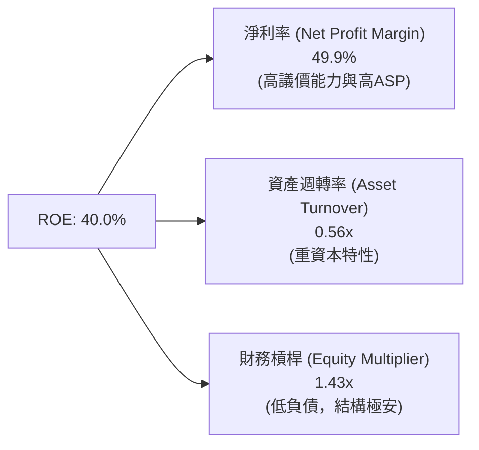

### 6.4 獲利能力儀表板

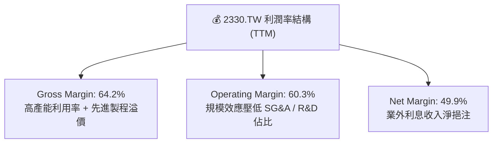

---

## 7. 估值深度分析

### 7.1 同業估值比較表格

| 估值指標 | **台積電 (2330.TW)** | **三星電子 (005930.KS)** | **英特爾 (INTC)** | **格羅方德 (GFS)** | 本公司相對評估 |
|----------|----------------------|--------------------------|-------------------|--------------------|----------------|
| **Trailing P/E** | **31.95x** | ~18.5x | N/A (虧損) | ~28.0x | 🟡 包含先進製程溢價 |
| **Forward P/E** | **17.22x** | ~12.2x | ~35.0x | ~22.1x | 🟢 考量高成長後極度便宜 |
| **PEG Ratio** | **0.95x** | ~1.45x | >2.5x | ~1.85x | 🟢 全球半導體龍頭最低 |
| **P/S Ratio** | **13.72x** | ~1.40x | ~2.10x | ~3.80x | 🟡 反映高達 50% 淨利率 |
| **EV / EBITDA** | **18.41x** | ~6.50x | ~14.2x | ~10.5x | 🟡 資本密集帶動高 EBITDA |
| **ROE** | **40.0%** | ~10.5% | -3.2% | ~8.5% | 🟢 碾壓同業 |

### 7.2 歷史估值區間分析

```
╔══════════════════════════════════════════════════════════════════╗
║             2330.TW 歷史 Forward P/E 區間 (近 5 年)              ║
╠══════════════════════════════════════════════════════════════════╣
║  歷史高點 (High):    28.5x   ----------------------------        ║
║  歷史中位數 (Median):19.8x   --------------------                ║
║  當前倍數 (Current): 17.22x  ----------------- (當前位置)        ║
║  歷史低點 (Low):     10.5x   -----------                         ║
║                                                                  ║
║  📊 結論：當前 Forward P/E 17.22x 低於 5 年歷史中位數，          ║
║     且營收與獲利增速高於歷史平均，顯現強烈估值重估 (Rerating) 空間║
╚══════════════════════════════════════════════════════════════════╝
```

### 7.3 情境目標價（假設驅動，Bear / Base / Bull）

| 情境 | 營收 3Y CAGR | 營業利潤率 | 2026E EPS | 退出倍數 (P/E) | 隱含目標價 | 相對現價漲跌幅 |
|------|--------------|-----------|-----------|----------------|------------|----------------|
| 🔴 **悲觀 (Bear)** | 18.0% | 48.0% | NT$ 102.24 | 21.0x | **NT$ 2,147.00** | -8.6% |
| 🟡 **基準 (Base)** | 28.0% | 55.0% | NT$ 136.48 | 22.77x | **NT$ 3,106.41** | **+32.2%** |
| 🟢 **樂觀 (Bull)** | 36.0% | 62.0% | NT$ 168.00 | 25.0x | **NT$ 4,200.00** | **+78.7%** |

* **估值倍數選擇說明**：台積電身為晶圓代工壟斷龍頭，其盈利能見度極高且淨利品質優異，故採用 **Forward P/E** 搭配 **PEG** 為主要估值依據；以基準情境預估 2026 Forward EPS NT$ 136.48 乘以 22.77x Forward P/E 導出 NT$ 3,106 目標價。

### 7.4 DCF 敏感性分析（6格目標價矩陣）

**DCF 核心假設**：永續成長率 (Terminal Growth) = 3.5%，永續 Capex/營收 = 25%。

| 永續 FCF 成長 / WACC | **WACC = 8.0%** | **WACC = 8.9%（基準）** | **WACC = 9.8%** |
|----------------------|-----------------|-------------------------|-----------------|
| 🟢 **樂觀成長 (CAGR 32%)** | **NT$ 3,850.00** (+63.8%) | **NT$ 3,420.00** (+45.5%) | **NT$ 3,080.00** (+31.1%) |
| 🟡 **基準成長 (CAGR 26%)** | **NT$ 3,450.00** (+46.8%) | **NT$ 3,106.41** (+32.2%) | **NT$ 2,790.00** (+18.7%) |
| 🔴 **保守成長 (CAGR 18%)** | **NT$ 2,820.00** (+20.0%) | **NT$ 2,550.00** (+8.5%) | **NT$ 2,280.00** (-3.0%) |

### 7.5 估值綜合區間

```
╔══════════════════════════════════════════════════════════════════╗
║               2330.TW 估值綜合區間與當前位置                     ║
╠══════════════════════════════════════════════════════════════════╣
║  NT$ 2,147 (悲觀)       NT$ 3,106 (基準目標)      NT$ 4,200 (樂觀)║
║      |-----------------------|-----------------------|          ║
║               ▲                                                  ║
║         NT$ 2,350 (當前股價 - 位於下軌區間，具強烈安全邊際)     ║
╚══════════════════════════════════════════════════════════════════╝
```

---

## 8. 成長催化劑

### 8.1 催化劑時間軸

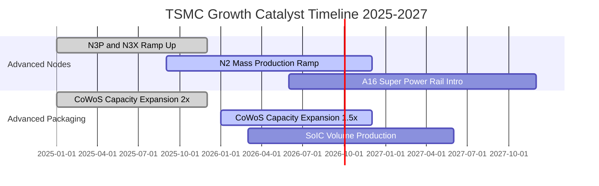

### 8.2 TAM 市場規模分析

```
╔══════════════════════════════════════════════════════════════════╗
║               全半導體與晶圓代工 TAM 潛在市場規模                ║
╠══════════════════════════════════════════════════════════════════╣
║                                                                  ║
║  全球半導體總產值 (2030E):    $1.0 兆美元  (CAGR ~10%)           ║
║  晶圓代工市場 TAM (2030E):    $2500 億美元 (CAGR ~15%)           ║
║  AI 晶片代工 TAM (2030E):     $1200 億美元 (CAGR ~35%)           ║
║                                                                  ║
║  📊 台積電在 AI 晶片代工市場滲透率達 >90%，將直接吞噬最大額度紅利║
╚══════════════════════════════════════════════════════════════════╝
```

### 8.3 成長驅動力結構圖

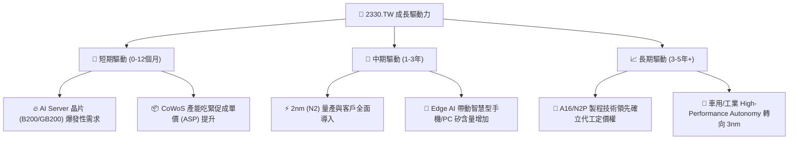

---

## 9. 風險矩陣

### 9.1 風險評分矩陣

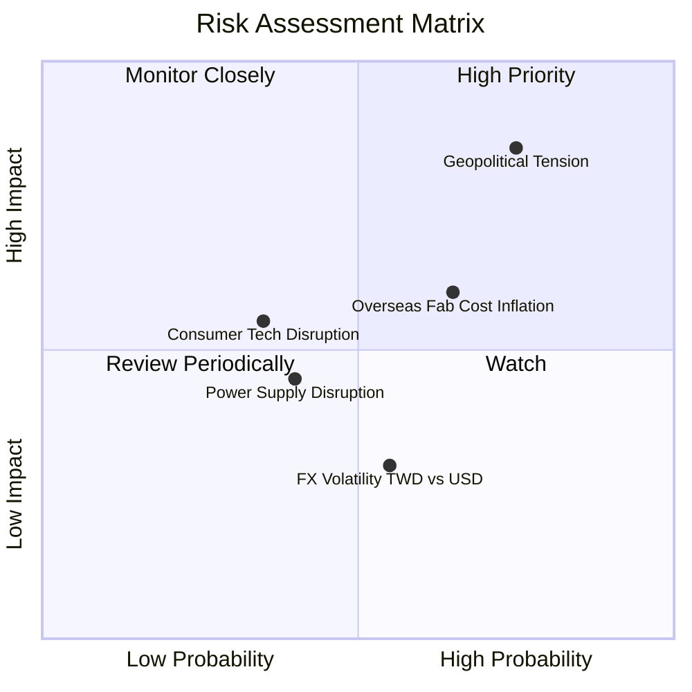

### 9.2 風險清單詳細分析

| # | 風險項目 | 發生機率 | 財務衝擊 | 風險評分 | 緩解措施與觀察重點 |
|---|----------|----------|----------|----------|--------------------|
| 1 | 🔴 **地緣政治風險** | 高 (65%) | 極高 (-20% 估值折扣) | 🔴 **8.5 / 10** | 布局全球多元化生產據點（美國、日本熊本、德國德勒斯登）。 |
| 2 | 🟡 **海外建廠成本稀釋毛利** | 高 (70%) | 中度 (-100~200 bps 毛利) | 🟡 **6.5 / 10** | 與當地政府爭取大量補貼（CHIPS Act 等），並要求客戶分攤海外生產溢價。 |
| 3 | 🟡 **總體經濟放緩壓抑消費電子** | 中 (40%) | 中度 (-5% 營收成長) | 🟡 **5.0 / 10** | HPC/AI 業務佔比已超越智慧型手機（52% vs 33%），具備強大結構性抵禦力。 |
| 4 | 🟢 **台灣電力與水資源供應** | 中 (35%) | 低至中 (短暫停工) | 🟢 **4.0 / 10** | 建置自備雙電源系統、綠電長約（CPPA）與大型雙再生水廠。 |

---

## 10. 投資建議

### 10.1 最終綜合評級雷達圖

```
╔══════════════════════════════════════════════════════════════╗
║               2330.TW 綜合指標總覽與雷達評分                 ║
╠══════════════════════════════════════════════════════════════╣
║  1. 護城河優勢:   9.8 / 10  ▓▓▓▓▓▓▓▓▓▓▓▓▓▓▓▓▓▓▓█             ║
║  2. 獲利品質:     9.8 / 10  ▓▓▓▓▓▓▓▓▓▓▓▓▓▓▓▓▓▓▓█             ║
║  3. 財務健康:     9.5 / 10  ▓▓▓▓▓▓▓▓▓▓▓▓▓▓▓▓▓▓▓░             ║
║  4. 成長動能:     9.0 / 10  ▓▓▓▓▓▓▓▓▓▓▓▓▓▓▓▓▓▓░░             ║
║  5. 估值吸引力:   8.2 / 10  ▓▓▓▓▓▓▓▓▓▓▓▓▓▓▓░░░░░             ║
╠══════════════════════════════════════════════════════════════╣
║  🏆 綜合投資總分: 9.2 / 10  ｜ 評級：🟢 強烈買入 (Buy)       ║
╚══════════════════════════════════════════════════════════════╝
```

### 10.2 目標價與隱含報酬率

| 情境 | 機率賦權 | 目標價 (NT$) | 當前股價 (NT$) | 隱含報酬率 | 期望值貢獻 (NT$) |
|------|----------|--------------|----------------|------------|------------------|
| 🔴 **悲觀** | 15% | NT$ 2,147.00 | NT$ 2,350.00 | -8.64% | NT$ 322.05 |
| 🟡 **基準** | 65% | NT$ 3,106.41 | NT$ 2,350.00 | +32.19% | NT$ 2,019.17 |
| 🟢 **樂觀** | 20% | NT$ 4,200.00 | NT$ 2,350.00 | +78.72% | NT$ 840.00 |
| **加權加總**| **100%** | **NT$ 3,181.22**| **NT$ 2,350.00**| **+35.37%**| **加權目標價：NT$ 3,181** |

### 10.3 買入時機與觸發因素

```
╔══════════════════════════════════════════════════════════════════╗
║                  ✅ 買入觸發因素 Checklist                      ║
╠══════════════════════════════════════════════════════════════════╣
║                                                                  ║
║  立即分批買入條件（目前已滿足）：                                ║
║  ✅ Forward P/E < 20x（當前僅 17.22x）                          ║
║  ✅ 季度營收 YoY 成長 > 25%（最新 Q2 達 36.0%）                 ║
║  ✅ 毛利率維持於 55% 企望線上（最新達 64.2%）                   ║
║                                                                  ║
║  逢低加碼條件（極佳催化劑）：                                    ║
║  ☐ 因地緣政治情緒引發股價單月修正 > 15%                          ║
║  ☐ 2nm (N2) 宣佈取得主要客戶獨家大單，且產能預訂滿載至 2027      ║
║                                                                  ║
║  減碼 / 停損條件：                                               ║
║  ☐ 營業利益率連續兩季跌破 40.0%                                  ║
║  ☐ ROIC 結構性跌破 15.0% 或 AI 伺服器晶片出現結構性砍單潮        ║
╚══════════════════════════════════════════════════════════════════╝
```

### 10.4 投資人適配度分析

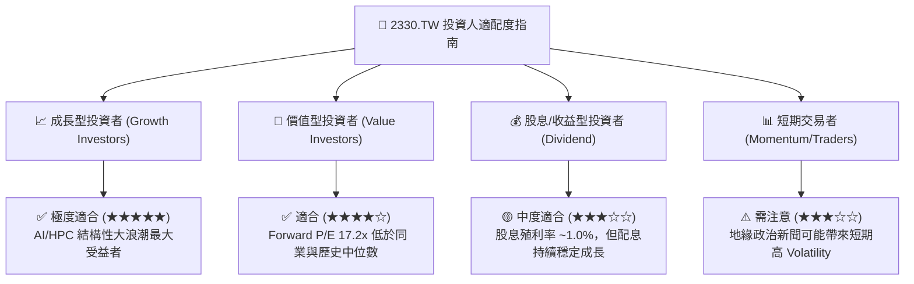

### 10.5 每季財報監控清單（Quarterly Watch List）

| 監控項目 | 基準目標 / 正常區間 | 警訊 / 減碼門檻 | 最新季度值 (2026-Q2) |
|----------|---------------------|-----------------|----------------------|
| **高先進製程 (N3+N5) 營收佔比** | > 65% | < 50% | **~65%** 🟢 |
| **毛利率 (Gross Margin)** | 53.0% - 60.0% | < 50.0% | **64.2%** 🟢 |
| **營業利益率 (Operating Margin)**| > 45.0% | < 38.0% | **60.3%** 🟢 |
| **資本支出 (Capex) 預算** | $30B - $38B 美元 | 急劇削減 >30% (需求衰退) | **穩定擴充** 🟢 |
| **CoWoS 產能月產量** | 45k - 60k 瓦片/月 | 產能利用率 < 75% | **滿載擴充中** 🟢 |

### 10.6 反面論證：什麼會證明論點錯誤（What Would Change My Mind）

```
╔══════════════════════════════════════════════════════════════════╗
║              ⚠️ 論點失效條件（Disconfirming Evidence）           ║
╠══════════════════════════════════════════════════════════════════╣
║  本投資論點在下列情況發生時將宣告失效，需立即重新檢視或停損退場：║
║                                                                  ║
║  1. 競爭對手（如英特爾 18A / 三星 GAA）於 2nm 良率率先超越台積電，║
║     導致 Apple 或 Nvidia 轉移 >15% 核心訂單。                    ║
║  2. 全球 AI 資本支出 (Hyperscaler Capex) 出現泡沫化破裂，        ║
║     伺服器晶片需求連續兩季年增率轉負。                           ║
║  3. 海外廠（美國亞利桑那、歐洲）營業費用過高，拖累整體毛利率      ║
║     長達 4 季低於 50% 目標區間。                                 ║
║  4. 地緣政治衝突升級，造成台灣主要晶圓廠出貨受實質受阻。         ║
╚══════════════════════════════════════════════════════════════════╝
```

---

> **免責聲明**：本報告為 AI 與 CFA 基本面分析模型根據公開歷史數據自動產出，僅供投資研究與學術討論參考，不構成任何型態之投資建議或買賣邀約。投資人應獨立評估相關風險並自行負擔投資結果。