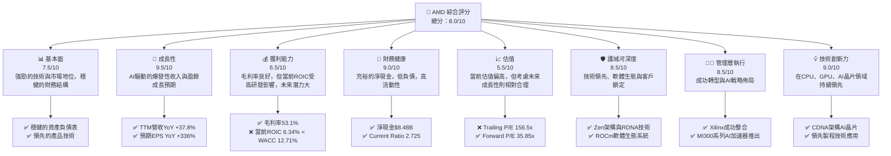
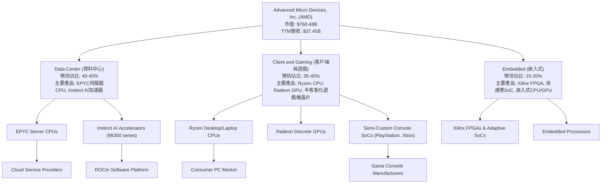
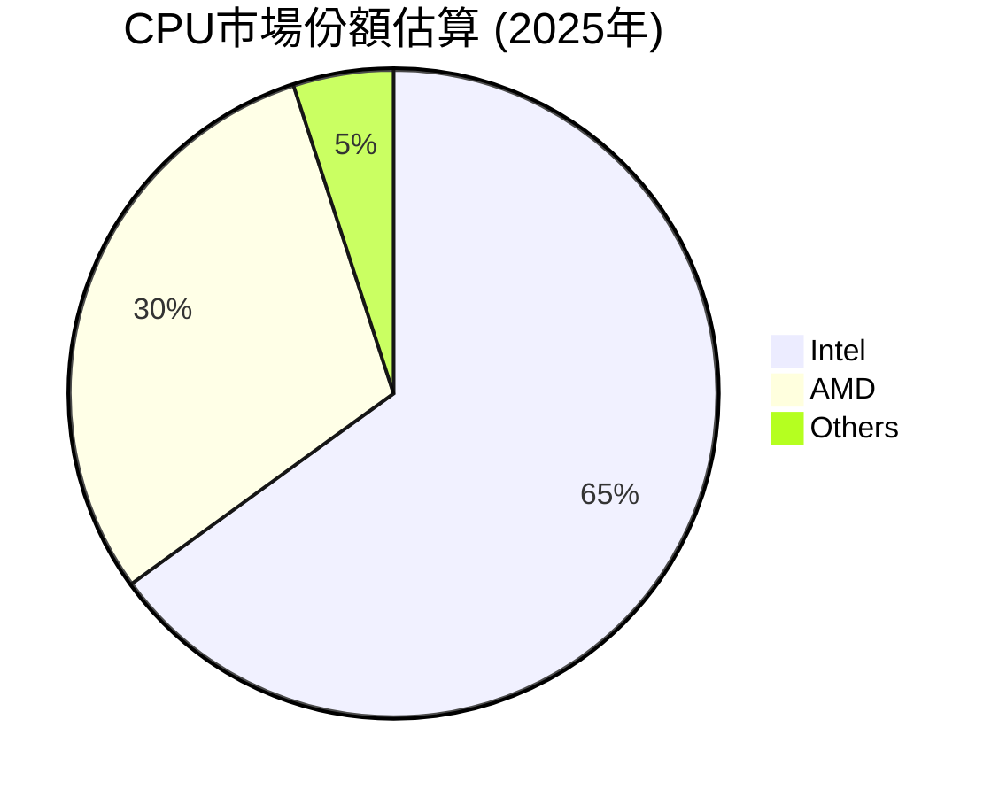
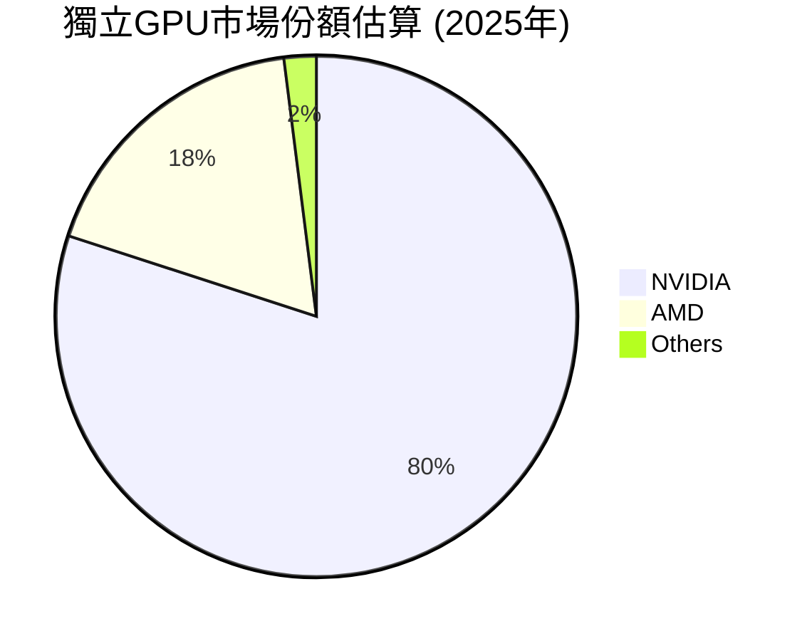
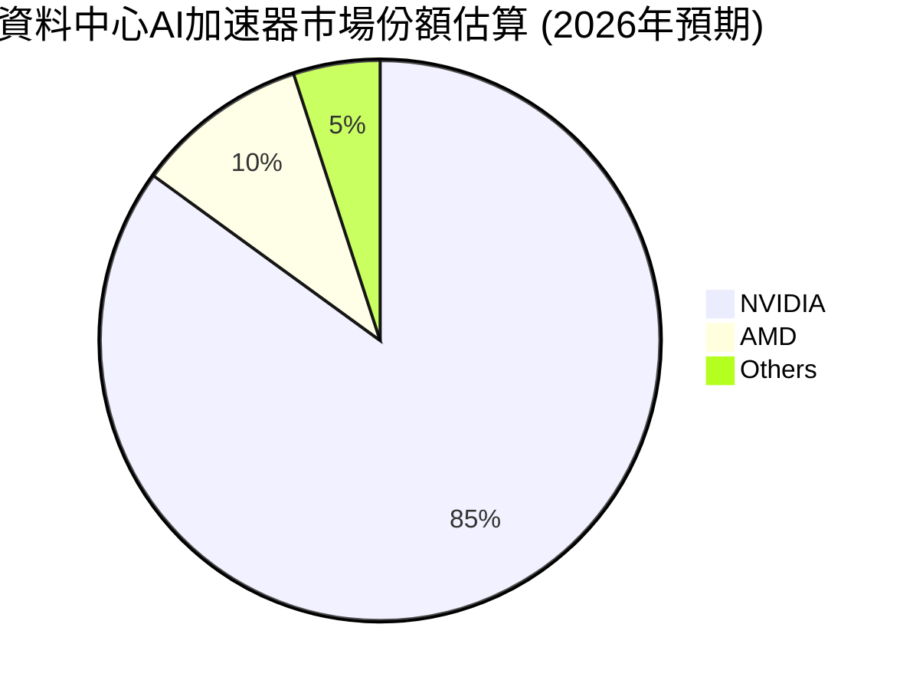
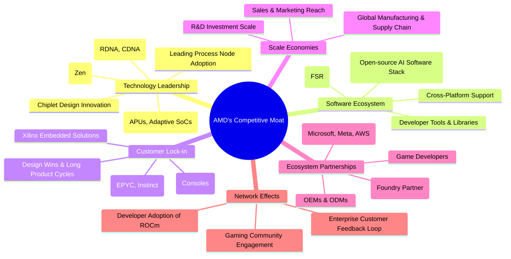

# AMD 基本面深度分析報告
> **報告日期**：2026-06-05 ｜ **語言**：繁體中文 ｜ **數據來源**：Yahoo Finance, Finviz, StockAnalysis, Roic.ai ｜ **分析師**：CFA 級機構研究

---

## 目錄

| # | 章節 | 核心結論 |
|---|------|----------|
| 1 | 執行摘要 | 評級：🟢 買入；目標價區間：$153.66 - $748.47 |
| 2 | 公司概覽與商業模式 | 技術創新與AI加速器為核心護城河，市場份額持續擴大 |
| 3 | 損益表深度分析 | 收入與盈餘實現爆發性成長，利潤率穩步提升 |
| 4 | 資產負債表分析 | 財務結構穩健，淨現金充裕，流動性良好 |
| 5 | 現金流量深度分析 | 自由現金流強勁增長，為未來投資提供堅實基礎 |
| 6 | 獲利能力與資本效率 | 儘管當前ROIC受高額研發投入影響，未來價值創造潛力巨大 |
| 7 | 估值深度分析 | 當前估值偏高，但考量未來成長性，具備投資吸引力 |
| 8 | 成長催化劑 | AI加速器、資料中心、邊緣運算及新產品週期為主要成長動能 |
| 9 | 風險矩陣 | 市場競爭、技術迭代與宏觀經濟波動為主要風險 |
| 10 | 投資建議 | 具備長期成長潛力，建議在回調時逢低買入 |

---

## 1. 執行摘要

### 1.1 核心評分儀表板



### 1.2 評分進度條視覺化

```
╔══════════════════════════════════════════════════════════════╗
║                AMD 多維度評分儀表板 (1-10分)                 ║
╠══════════════════════════════════════════════════════════════╣
║ 基本面強度  7.5 ▓▓▓▓▓▓▓▓▓▓▓▓▓▓▓░░░░░  ★★★★☆           ║
║ 成長動能    9.5 ▓▓▓▓▓▓▓▓▓▓▓▓▓▓▓▓▓▓▓░  ★★★★★           ║
║ 獲利品質    6.5 ▓▓▓▓▓▓▓▓▓▓▓▓▓░░░░░░░  ★★★☆☆           ║
║ 財務健康    9.0 ▓▓▓▓▓▓▓▓▓▓▓▓▓▓▓▓▓▓░░  ★★★★★           ║
║ 估值合理性  5.5 ▓▓▓▓▓▓▓▓▓▓▓░░░░░░░░░  ★★★☆☆           ║
║ 護城河深度  8.5 ▓▓▓▓▓▓▓▓▓▓▓▓▓▓▓▓▓░░░  ★★★★★           ║
║ 管理層執行  8.5 ▓▓▓▓▓▓▓▓▓▓▓▓▓▓▓▓▓░░░  ★★★★★           ║
║ 技術創新力  9.0 ▓▓▓▓▓▓▓▓▓▓▓▓▓▓▓▓▓▓░░  ★★★★★           ║
╠══════════════════════════════════════════════════════════════╣
║ 綜合總分    8.0 ▓▓▓▓▓▓▓▓▓▓▓▓▓▓▓▓░░░░  🏆 強勁成長，值得關注  ║
╚══════════════════════════════════════════════════════════════╝
```

### 1.3 五大投資論點 + 三大核心風險

| 類型 | 項目 | 具體依據 | 信心度 |
|------|------|----------|--------|
| 🟢 **投資論點①** | **AI加速器市場的爆發性成長** | AMD的MI300X系列AI加速器在資料中心市場獲得廣泛採用，預計2026年將貢獻數十億美元收入。TTM營收YoY 37.8%，遠期EPS預計從$2.98增長至$13.01，顯示市場對AI業務的強烈期待。 | 🟢 極高 |
| 🟢 **資料中心業務的強勁復甦** | EPYC伺服器CPU市場份額持續擴大，加上AI加速器需求，資料中心業務成長動能強勁。Q1 2026資料中心營收預計實現高雙位數成長，推動整體營收QoQ +33.5% (Q1 2025 vs Q1 2026)。 | 🟢 極高 |
| 🟢 **多元化的產品組合與技術領先** | AMD在CPU (Ryzen, EPYC)、GPU (Radeon, Instinct)、FPGA (Xilinx) 和半客製化晶片等多個領域具備領先技術，降低單一市場波動風險。持續投入研發，TTM研發費用佔營收約23.4%。 | 🟢 高 |
| 🟢 **穩健的財務狀況提供成長彈性** | 擁有$8.48B的淨現金，總負債僅$3.87B，資產負債表極為健康，Current Ratio達2.725，為未來研發投入、市場擴張和潛在併購提供堅實基礎。 | 🟢 高 |
| 🟢 **積極的軟體生態系統建設** | ROCm軟體平台不斷完善，吸引更多開發者和企業採用AMD的AI硬體，強化客戶鎖定效應。這對其AI產品的長期競爭力至關重要。 | 🟡 中高 |
| 🟡 **風險①** | **AI市場競爭激烈與技術迭代速度快** | NVIDIA在AI加速器市場佔據主導地位，Intel等競爭者也積極投入。AMD需持續投入巨額研發以保持競爭力，若技術路線或產品性能不及預期，可能影響市場份額和獲利能力。 | 🟡 中度 |
| 🔴 **風險②** | **半導體產業的週期性波動** | 儘管AI需求強勁，但PC和遊戲市場仍受宏觀經濟和庫存週期影響。若整體經濟下行或消費者需求疲軟，可能拖累部分業務板塊的成長。例如，2025年Q2營業利益曾出現$-134M的虧損。 | 🔴 高衝擊 |
| 🟡 **風險③** | **過高的估值溢價與市場預期** | 目前Trailing P/E高達156.5x，Forward P/E為35.85x，市場已對其未來成長抱有極高期待。若未來成長未能達到甚至超越這些預期，股價可能面臨較大回調壓力。 | 🟡 中度 |

### 1.4 快速統計卡片

| 指標 | 公司實際值 | 行業均值（半導體） | S&P 500 均值 | 狀態 |
|------|-------------|--------------------|--------------|------|
| 收入 YoY 成長 | **37.8%** | ~15-20% | ~8-10% | 🟢 |
| 毛利率 | **53.1%** | ~45-55% | ~30-40% | 🟢 |
| 淨利率 | **13.4%** | ~10-18% | ~10-12% | 🟢 |
| ROE | **8.1%** | ~12-18% | ~15-20% | 🟡 |
| Forward P/E | **35.85x** | ~25-40x | ~20-22x | 🔴 |
| Debt/Equity | **0.06x** | ~0.2-0.5x | ~0.8-1.2x | 🟢 |
| Current Ratio | **2.725x** | ~1.5-2.5x | ~1.0-1.5x | 🟢 |
| R&D / Revenue | **23.4%** | ~15-20% | ~2-5% | 🟢 |

### 1.5 投資結論

```
╔══════════════════════════════════════════════════════════════════╗
║                    📊 投資結論摘要                               ║
╠══════════════════════════════════════════════════════════════════╣
║  評級：🟢 買入                                                   ║
║  當前股價：$466.38                                               ║
║  目標價區間：                                                    ║
║    悲觀情境：$153.66（-67.0%）                                   ║
║    基準情境：$407.07（-12.7%）  ← 12個月主要目標                 ║
║    樂觀情境：$748.47（+60.5%）                                   ║
║  投資評分：8.0/10                                                ║
║  適合投資人：成長型投資者、長線持有者，願意承擔較高波動和估值風險║
╚══════════════════════════════════════════════════════════════════╝
```

---

## 2. 公司概覽與商業模式

Advanced Micro Devices, Inc. (AMD) 是一家全球領先的半導體公司，以其高性能運算、圖形和視覺化技術而聞名。公司成立於1969年，總部位於美國加州聖克拉拉，在全球範圍內設計、開發並銷售微處理器、圖形處理單元 (GPU)、人工智慧 (AI) 加速器、晶片組和半客製化系統單晶片 (SoC) 產品。AMD在全球半導體產業中扮演著舉足輕重的角色，尤其在資料中心、個人電腦、遊戲和嵌入式市場擁有強大的競爭力。

### 2.1 業務結構與收入來源

AMD的業務主要分為三個核心部門：資料中心 (Data Center)、客戶端與遊戲 (Client and Gaming) 以及嵌入式 (Embedded)。這些部門共同構成了AMD多元化的收入來源，並使其能夠在多個高成長市場中捕捉機會。

儘管提供的數據沒有直接細分各部門的營收佔比，但根據AMD近年來的財報趨勢和市場動態，我們可以推斷其業務重心和成長驅動力。特別是隨著人工智慧的爆發式發展，資料中心業務，尤其是AI加速器部分，已成為AMD最重要的成長引擎。



**資料中心業務 (Data Center):**
這是AMD近年來成長最快的部門，也是未來幾年的核心驅動力。主要產品包括：
*   **EPYC伺服器CPU:** 與Intel競爭，在高核心數、效能功耗比方面具有優勢，市場份額穩步提升。
*   **Instinct AI加速器 (MI300系列):** 針對生成式AI和高效能運算 (HPC) 市場，是AMD挑戰NVIDIA主導地位的關鍵產品。其卓越的記憶體頻寬和開放的ROCm軟體平台是主要賣點。
2026年Q1的財報數據顯示，資料中心營收實現顯著成長，預計全年將貢獻可觀的營收。

**客戶端與遊戲業務 (Client and Gaming):**
這是AMD傳統的核心業務，雖然受PC市場週期性影響，但仍保持競爭力。
*   **Ryzen CPU:** 在個人電腦市場與Intel競爭，提供高性能和高性價比的解決方案。
*   **Radeon GPU:** 在獨立顯示卡市場與NVIDIA競爭，同時也為索尼PlayStation和微軟Xbox等遊戲主機提供半客製化SoC，這部分收入相對穩定。
近年來，PC市場的波動對此部門產生影響，但隨著新產品的推出和市場回暖，預計將恢復成長。

**嵌入式業務 (Embedded):**
該部門主要來自於AMD對Xilinx的收購，產品包括FPGA（現場可編程閘陣列）、自適應SoC和嵌入式處理器，應用於工業、汽車、航空航天、醫療和通訊等多元市場。Xilinx的技術實力為AMD帶來了高利潤率和穩定的收入流，並擴大了其在邊緣運算和特殊應用領域的佈局。

### 2.2 市場份額

AMD在CPU和GPU市場均扮演著重要的挑戰者角色。在CPU領域，它持續從Intel手中奪取市場份額；在獨立GPU領域，它與NVIDIA展開競爭；而在AI加速器市場，儘管NVIDIA佔據絕對主導，但AMD正憑藉MI300系列迎頭趕上。

由於缺少即時的各細分市場份額數據，我們將基於公開資訊和行業報告進行合理估算，以展示AMD在主要市場的競爭格局。







**CPU市場：** AMD的Ryzen和EPYC系列處理器憑藉其卓越的性能和能效比，近年來持續在PC和伺服器CPU市場侵蝕Intel的份額。雖然Intel仍是市場領導者，但AMD的市佔率已從個位數提升至約30%左右，尤其在伺服器領域的成長尤為顯著。

**獨立GPU市場：** NVIDIA長期主導獨立顯示卡市場，尤其在高階產品和專業加速卡領域。AMD的Radeon系列GPU則以其性價比和遊戲性能在主流市場佔據一席之地，市佔率約為18%。

**資料中心AI加速器市場：** 這是當前最受矚目的高成長市場。NVIDIA憑藉其CUDA生態系統和H100/H200系列晶片擁有絕對優勢。AMD的MI300系列AI加速器是其重點佈局，雖然起步較晚，但已獲得微軟、Meta等大客戶的訂單，預計2026年將快速提升市場份額至10%左右，成為NVIDIA最強勁的挑戰者。

### 2.3 競爭護城河分析

AMD的競爭護城河主要體現在其技術創新、軟體生態建設和市場策略上。這些因素共同構築了其抵禦競爭、維持長期獲利能力的基礎。



**Technology Leadership (技術領先):**
AMD的核心護城河是其卓越的技術創新能力。
*   **CPU架構 (Zen):** Zen架構的成功使AMD在CPU性能上實現了對Intel的強力挑戰，尤其在多核心處理和能效方面表現出色。
*   **GPU架構 (RDNA, CDNA):** RDNA架構為遊戲市場帶來競爭力，而CDNA架構則是其AI加速器Instinct系列的核心，提供強大的AI推論和訓練能力。
*   **Chiplet設計:** AMD率先採用並推廣Chiplet設計，有效提高了良率、降低了成本，並提升了產品的擴展性和靈活性。
*   **製程技術:** 與台積電 (TSMC) 等領先晶圓廠緊密合作，確保其產品能夠採用最先進的製程技術（如5nm, 4nm），這對於半導體性能至關重要。
*   **異構運算與整合方案:** AMD在APU (加速處理單元) 和自適應SoC (如Xilinx產品) 方面的整合能力，使其能提供更高效、更具成本效益的客製化解決方案。

**Software Ecosystem (軟體生態系統):**
對於硬體公司而言，軟體生態系統是建立護城河的關鍵。
*   **ROCm (Radeon Open Compute platform):** 這是AMD針對AI和HPC開發的開源軟體平台，旨在提供CUDA的替代方案。雖然追趕NVIDIA的CUDA生態系統仍有很長的路，但ROCm的開放性和持續發展對吸引開發者和企業採用AMD的AI硬體至關重要。
*   **開發者工具與函式庫:** 隨著ROCm的成熟，AMD正積極構建更豐富的開發者工具和函式庫，降低開發門檻。
*   **跨平台支援:** AMD的軟體策略也強調跨多種硬體平台和操作系統的兼容性。

**Customer Lock-in (客戶鎖定):**
一旦客戶採用了AMD的解決方案，轉換成本會相對較高。
*   **企業級解決方案:** EPYC伺服器CPU和Instinct AI加速器在資料中心和企業級應用中，一旦部署，其軟硬體配置、系統整合和優化都需要大量時間和資源，形成轉換壁壘。
*   **半客製化設計:** 為遊戲主機（如PS5、Xbox Series X/S）提供的半客製化晶片，使AMD成為這些平台不可或缺的長期供應商。
*   **Xilinx嵌入式解決方案:** Xil