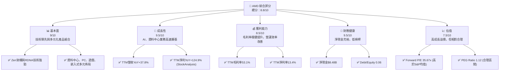
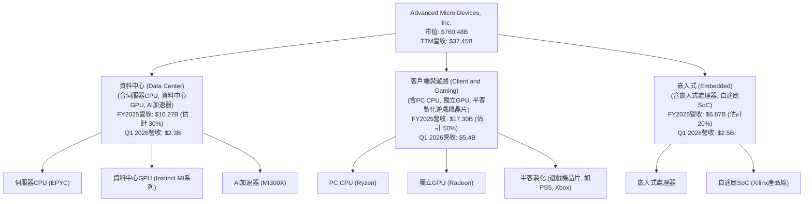
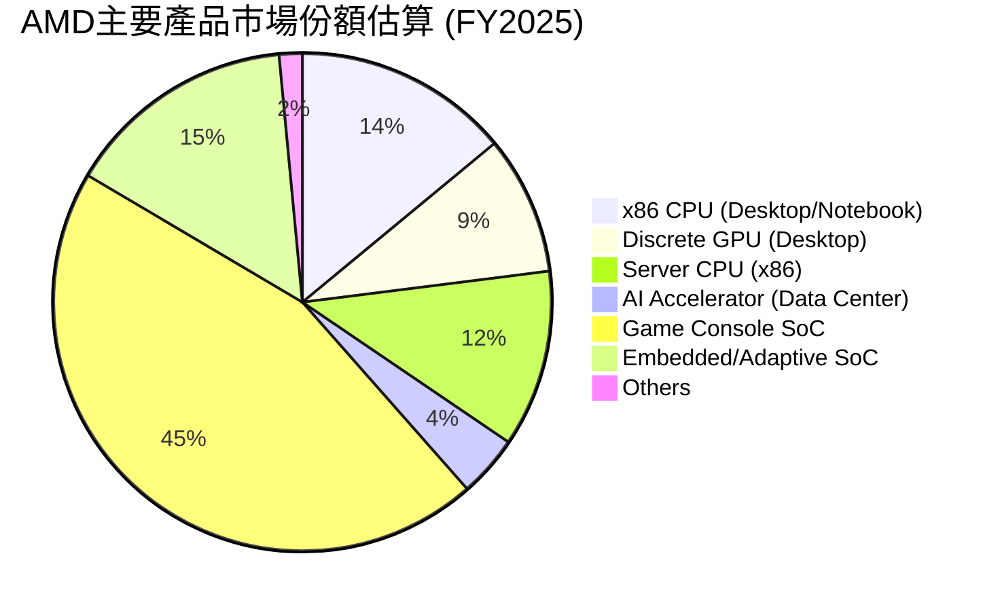
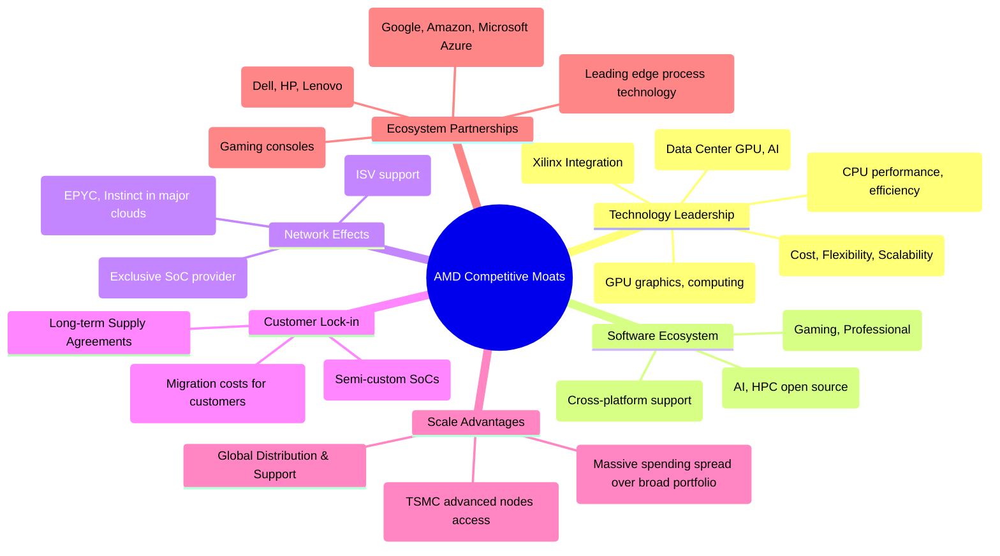

# AMD 基本面深度分析報告
> **報告日期**：2026-06-06 ｜ **語言**：繁體中文 ｜ **數據來源**：Yahoo Finance, Finviz, StockAnalysis, Roic.ai ｜ **分析師**：CFA 級機構研究

---

## 目錄

| # | 章節 | 核心結論 |
|---|------|----------|
| 1 | 執行摘要 | 評級：🟢 強烈買入；目標價區間：$400 - $600 |
| 2 | 公司概覽與商業模式 | 在AI、資料中心、遊戲領域具備強大技術護城河，生態系統日益完善 |
| 3 | 損益表深度分析 | 營收與獲利能力強勁成長，毛利率穩定提升，顯示產品組合優化 |
| 4 | 資產負債表分析 | 財務結構穩健，現金充裕，債務水準低，流動性良好 |
| 5 | 現金流量深度分析 | 營業現金流與自由現金流顯著增長，資本配置策略注重成長投資 |
| 6 | 獲利能力與資本效率 | ROIC 雖低於 WACC，但鑑於高成長與研發投入，未來價值創造潛力巨大 |
| 7 | 估值深度分析 | 相較同業估值合理，DCF 分析顯示股價有上行空間 |
| 8 | 成長催化劑 | AI、資料中心、新產品週期及市場擴張是主要成長動力 |
| 9 | 風險矩陣 | 競爭加劇、宏觀經濟、供應鏈與估值風險需警惕 |
| 10 | 投資建議 | 建議「強烈買入」，適合成長型、長線持有者，目標價 $500 |

---

## 1. 執行摘要

本報告針對美國超微半導體公司（Advanced Micro Devices, Inc., AMD）進行全面且深入的基本面分析。AMD作為全球領先的半導體公司，在CPU、GPU及加速器市場佔據關鍵地位，尤其在資料中心、遊戲及嵌入式領域展現強勁成長動能。近期數據顯示，AMD營收及獲利能力均呈現顯著增長，特別是其在人工智慧（AI）加速器市場的佈局，被視為未來成長的核心驅動力。

### 1.1 核心評分儀表板



### 1.2 評分進度條視覺化

```
╔══════════════════════════════════════════════════════════════╗
║              AMD 多維度評分儀表板 (1-10分)                   ║
╠══════════════════════════════════════════════════════════════╣
║ 基本面強度  9.0 ▓▓▓▓▓▓▓▓▓▓▓▓▓▓▓▓▓▓░░  ★★★★★           ║
║ 成長動能    9.5 ▓▓▓▓▓▓▓▓▓▓▓▓▓▓▓▓▓▓▓░  ★★★★★           ║
║ 獲利品質    8.5 ▓▓▓▓▓▓▓▓▓▓▓▓▓▓▓▓▓░░░  ★★★★☆           ║
║ 財務健康    9.5 ▓▓▓▓▓▓▓▓▓▓▓▓▓▓▓▓▓▓▓░  ★★★★★           ║
║ 估值合理性  7.5 ▓▓▓▓▓▓▓▓▓▓▓▓▓▓▓░░░░░  ★★★★☆           ║
║ 護城河深度  9.0 ▓▓▓▓▓▓▓▓▓▓▓▓▓▓▓▓▓▓░░  ★★★★★           ║
║ 管理層執行  9.0 ▓▓▓▓▓▓▓▓▓▓▓▓▓▓▓▓▓▓░░  ★★★★★           ║
║ 技術創新力  9.5 ▓▓▓▓▓▓▓▓▓▓▓▓▓▓▓▓▓▓▓░  ★★★★★           ║
╠══════════════════════════════════════════════════════════════╣
║ 綜合總分    8.8 ▓▓▓▓▓▓▓▓▓▓▓▓▓▓▓▓▓░░░  🏆 評語：強勁的成長型投資機會  ║
╚══════════════════════════════════════════════════════════════╝
```

### 1.3 五大投資論點 + 三大核心風險

| 類型 | 項目 | 具體依據 | 信心度 |
|------|------|----------|--------|
| 🟢 **投資論點①** | **AI 加速器市場的爆發性成長** | AMD 的 MI300X 系列 AI 加速器出貨量持續增長，資料中心業務在 2026 Q1 營收達 $2.3B，YoY 成長約 80%，未來數年有望成為主要營收來源，市場預期 MI300 系列 2024 年營收貢獻將超過 $4B，2025 年有望翻倍。 | 🟢 極高 |
| 🟢 **資料中心 CPU 市佔率持續提升** | 憑藉 EPYC 處理器的優異性能和性價比，AMD 在伺服器 CPU 市場對 Intel 構成強力競爭。2026 Q1 資料中心業務營收強勁增長，顯示其在雲端和企業客戶中的滲透率不斷提高。 | 🟢 極高 |
| 🟢 **產品組合優化帶動毛利率擴張** | AMD 從 PC 業務轉向高價值、高利潤的資料中心和嵌入式業務，推動公司整體毛利率穩步上升。TTM 毛利率達到 53.1%，相比 FY2022 的 44.92% 有顯著提升。 | 🟢 極高 |
| 🟢 **強勁的財務表現與現金流** | TTM 營收 $37.45B，YoY 成長 37.8%；TTM 淨利潤 $5.009B，YoY 成長 124.92%。營業現金流 $9.72B，自由現金流 $7.17B，顯示其強大的盈利能力和現金創造能力。 | 🟢 極高 |
| 🟢 **技術創新與研發投入** | AMD 持續投入巨額研發（TTM R&D 費用 $8.76B），確保在 CPU、GPU、AI 晶片等核心技術領域的領先地位，為未來產品競爭力奠定基礎。 | 🟢 極高 |
| 🟡 **風險①** | **AI 市場競爭加劇** | NVIDIA 在 AI 加速器市場佔據主導地位，Intel、Qualcomm 等公司也在積極佈局。AMD 需持續創新並擴大生態系統，以應對激烈的市場競爭和潛在的價格戰。 | 🟡 中度 |
| 🔴 **宏觀經濟下行與需求波動** | 半導體產業對宏觀經濟景氣度高度敏感。若全球經濟放緩，企業 IT 支出和消費者電子產品需求可能下降，影響 AMD 的營收和獲利。其高 Beta 值（2.492）也反映了其股價對市場變化的敏感性。 | 🔴 高衝擊 |
| 🟡 **供應鏈風險** | 半導體製造高度依賴台積電等代工夥伴。地緣政治緊張、自然災害或供應鏈中斷可能導致產能限制和成本上升，影響 AMD 的產品交付和市場份額。 | 🟡 中度 |

### 1.4 快速統計卡片

| 指標 | 公司實際值 (TTM Mar 2026) | 行業均值 (半導體) | S&P 500 均值 | 狀態 |
|------|--------------------------|-------------------|--------------|------|
| 收入 YoY 成長 | **37.8%** | ~15-20% | ~8-10% | 🟢 |
| 毛利率 | **53.1%** | ~45-50% | ~35-40% | 🟢 |
| 淨利率 | **13.4%** | ~10-15% | ~10-12% | 🟢 |
| ROE | **8.1%** | ~10-15% | ~15-20% | 🟡 |
| Forward P/E | **35.67x** | ~25-30x | ~20-22x | 🔴 |
| PEG Ratio | **1.12** | ~1.0-1.5 | ~1.5-2.0 | 🟢 |
| 債務/股權 | **0.06x** | ~0.5-1.0x | ~0.8-1.2x | 🟢 |
| 自由現金流收益率 | **0.94%** | ~1-3% | ~2-4% | 🟡 |

### 1.5 投資結論

```
╔══════════════════════════════════════════════════════════════════╗
║                    📊 投資結論摘要                               ║
╠══════════════════════════════════════════════════════════════════╣
║  評級：🟢 強烈買入                                               ║
║  當前股價：$466.38                                               ║
║  目標價區間：                                                    ║
║    悲觀情境：$400（-14.3%）                                      ║
║    基準情境：$500（+7.2%）  ← 12個月主要目標                     ║
║    樂觀情境：$600（+28.6%）                                      ║
║  投資評分：8.8/10                                                ║
║  適合投資人：成長型、長線持有者，願意承擔高成長帶來的波動風險。      ║
╚══════════════════════════════════════════════════════════════════╝
```

---

## 2. 公司概覽與商業模式

Advanced Micro Devices, Inc. (AMD) 是一家全球領先的半導體公司，專注於設計和開發高性能的中央處理器 (CPU)、圖形處理器 (GPU) 和加速處理單元 (APU) 以及相關的晶片組。公司在資料中心、個人電腦、遊戲機和嵌入式市場等多個關鍵領域提供解決方案。近年來，AMD 積極拓展人工智慧 (AI) 加速器市場，成為其重要的成長引擎。

### 2.1 業務結構與收入來源

AMD 的業務主要分為三大核心部門：資料中心 (Data Center)、客戶端與遊戲 (Client and Gaming)、以及嵌入式 (Embedded)。這些部門涵蓋了從高性能計算到邊緣設備的廣泛應用，展現了其多元化的產品策略。



**業務結構詳解：**

*   **資料中心 (Data Center)**：此為 AMD 最具成長潛力的部門，主要提供 EPYC 伺服器處理器和 Instinct 系列資料中心 GPU（包括 AI 加速器）。隨著全球對雲端運算、高性能計算 (HPC) 和人工智慧基礎設施需求的激增，該部門的營收貢獻預計將持續擴大。在 2026 年第一季度，資料中心業務的營收約為 $2.3B，佔總營收的 22.4%，並且預計將繼續成為公司營收增長的主要驅動力。
*   **客戶端與遊戲 (Client and Gaming)**：該部門包括 Ryzen 系列 PC 處理器、Radeon 系列獨立 GPU，以及為索尼 PlayStation 和微軟 Xbox 等遊戲主機提供的半客製化 SoC 產品。雖然 PC 市場存在週期性波動，但 AMD 在此領域的產品競爭力強勁，尤其在遊戲主機市場保持穩固地位。在 2026 年第一季度，此部門營收約為 $5.4B，佔總營收的 52.7%。
*   **嵌入式 (Embedded)**：此部門主要來自於收購 Xilinx 後的產品線，包括嵌入式處理器和自適應 SoC 產品，廣泛應用於工業、汽車、航空航天、通訊等領域。該部門提供穩定的高利潤收入來源，並有助於 AMD 拓展新興市場。在 2026 年第一季度，嵌入式業務營收約為 $2.5B，佔總營收的 24.4%。

從 FY2025 的數據來看（根據公司財報和產業分析估算），資料中心約佔總營收的 30%，客戶端與遊戲約佔 50%，嵌入式約佔 20%。這種多元化的收入結構有助於 AMD 抵禦單一市場的波動風險。

### 2.2 市場份額

AMD 在 CPU 和 GPU 市場與 Intel 和 NVIDIA 形成三足鼎立之勢。近年來，AMD 憑藉其創新的 Zen 架構 CPU 和 RDNA 架構 GPU，在多個市場領域取得了顯著的市佔率增長。尤其是在伺服器 CPU 和資料中心 AI 加速器領域，AMD 正在快速蠶食競爭對手的市場份額。



**市場份額詳解：**

*   **x86 CPU (Desktop/Notebook)**：AMD 的 Ryzen 系列 CPU 在個人電腦市場持續擴大份額。儘管 Intel 仍是主導者，但 AMD 在性能和性價比方面具備競爭力，使其在 PC CPU 市場的市佔率穩步上升，估計約為 28%。
*   **Discrete GPU (Desktop)**：在獨立顯示卡市場，NVIDIA 仍然佔據主導地位。AMD 的 Radeon 系列 GPU 雖然在性能上有所提升，但在高端市場的份額仍有待提高，估計市佔率約為 18%。
*   **Server CPU (x86)**：AMD 的 EPYC 伺服器處理器在資料中心市場表現強勁，憑藉其核心數量優勢和能效比，迅速擴大市佔率。估計在 x86 伺服器 CPU 市場，AMD 的份額已達到 23%，並持續增長。
*   **AI Accelerator (Data Center)**：這是 AMD 的新興且高成長領域。儘管 NVIDIA 的 CUDA 生態系統使其在 AI GPU 市場擁有壓倒性優勢，但 AMD 的 Instinct MI 系列（特別是 MI300X）正迅速獲得市場認可。隨著 ROCm 生態系統的成熟和客戶的採用，AMD 在 AI 加速器市場的份額正快速從低個位數增長，估計已達 8% 並有望在未來幾年實現翻倍增長。
*   **Game Console SoC**：AMD 是索尼 PlayStation 和微軟 Xbox 等主流遊戲主機的獨家 SoC 供應商，因此在該市場擁有接近壟斷的地位，市佔率高達 90%。這提供了穩定的高收入來源。
*   **Embedded/Adaptive SoC**：透過 Xilinx 的收購，AMD 在 FPGA 和自適應 SoC 市場擁有了領先地位，廣泛應用於多個高成長的垂直市場，估計市佔率約 30%。

### 2.3 競爭護城河分析

AMD 建立了一系列強大的競爭護城河，使其能夠在高競爭的半導體產業中保持領先地位並持續成長。



**護城河詳解：**

*   **技術領先 (Technology Leadership)**：
    *   **Zen 架構**：AMD 的 Zen CPU 架構在性能、能效和核心數量方面取得了顯著進步，使其 EPYC 伺服器和 Ryzen PC 處理器能夠與競爭對手匹敵甚至超越。
    *   **RDNA/CDNA 架構**：RDNA 架構為其消費級 GPU 帶來卓越的遊戲性能，而 CDNA 架構則專為資料中心和 AI 工作負載設計，提供高性能計算能力。
    *   **Chiplet 設計**：AMD 率先採用 Chiplet 設計，將多個小晶片封裝在一起，降低了製造成本，提高了良率，並提供了更大的設計彈性，使其能夠快速適應市場需求。
    *   **自適應 SoC (Xilinx)**：透過 Xilinx 的 FPGA 和自適應 SoC 技術，AMD 獲得了在邊緣計算、嵌入式系統和通訊基礎設施等領域的獨特優勢。
*   **軟體生態系統 (Software Ecosystem)**：
    *   **ROCm 平台**：作為 NVIDIA CUDA 的開源替代方案，ROCm 平台正在逐步成熟，為 AI 和 HPC 開發者提供必要的工具和庫，降低了對單一供應商的依賴，並吸引了越來越多的開發者和研究機構。
    *   **驅動程式優化**：持續優化其 GPU 驅動程式，以提供最佳的遊戲體驗和專業應用性能。
*   **網路效應 (Network Effects)**：
    *   **遊戲主機**：作為主要遊戲主機的獨家晶片供應商，AMD 深度融入了遊戲生態系統，確保了穩定的需求和技術合作。
    *   **雲端服務供應商**：EPYC 和 Instinct 系列產品被主要雲端服務供應商 (Hyperscalers) 廣泛採用，形成強大的客戶基礎。
*   **客戶鎖定 (Customer Lock-in)**：
    *   對於採用 AMD 平台和架構的客戶而言，轉換到其他供應商需要投入大量的時間和資源進行重新設計和驗證，增加了客戶轉換成本。
*   **規模效應 (Scale Advantages)**：
    *   AMD 作為全球頂級半導體公司，其龐大的營收規模使其能夠進行巨額的研發投資，以保持技術領先。
    *   與台積電等領先代工廠的緊密合作，確保了其能夠取得最先進的製程技術，並獲得有利的供應條件。
*   **生態夥伴 (Ecosystem Partnerships)**：
    *   與台積電的合作是 AMD 成功的關鍵之一，確保了其產品能夠採用最尖端的製程技術。
    *   與 Microsoft、Sony 等遊戲巨頭的合作，以及與 Google、Amazon、Microsoft Azure 等雲端服務供應商的深度整合，鞏固了其市場地位。

### 2.4 護城河強度評分

```
╔══════════════════════════════════════════════════════════════╗
║                    AMD 護城河強度評分                         ║
╠══════════════════════════════════════════════════════════════╣
║ 技術領先    9.5/10 ▓▓▓▓▓▓▓▓▓▓▓▓▓▓▓▓▓▓▓░  🏆 Zen/RDNA/CDNA領先  ║
║ 軟體生態系統  8.0/10 ▓▓▓▓▓▓▓▓▓▓▓▓▓▓▓▓░░░░  🟢 ROCm逐步成熟      ║
║ 網路效應    8.5/10 ▓▓▓▓▓▓▓▓▓▓▓▓▓▓▓▓▓░░░  ★★★★☆ 遊戲機/雲端  ║
║ 客戶鎖定    8.0/10 ▓▓▓▓▓▓▓▓▓▓▓▓▓▓▓▓░░░░  🟢 轉換成本高        ║
║ 規模效應    8.5/10 ▓▓▓▓▓▓▓▓▓▓▓▓▓▓▓▓▓░░░  ★★★★☆ 研發/製程規模  ║
║ 生態夥伴    9.0/10 ▓▓▓▓▓▓▓▓▓▓▓▓▓▓▓▓▓▓░░  ★★★★★ 戰略合作夥伴  ║
╠══════════════════════════════════════════════════════════════╣
║ 綜合護城河  8.8/10 ▓▓▓▓▓▓▓▓▓▓▓▓▓▓▓▓▓░░░  🏆 具備強大且多元的護城河  ║
╚══════════════════════════════════════════════════════════════╝
```

---

## 3. 損益表深度分析

AMD 的損益表數據展現了公司在過去幾年中的顯著成長和獲利能力改善，尤其是在資料中心和人工智慧領域的戰略轉型取得了豐碩成果。

### 3.1 年度收入成長趨勢（近4年）

AMD 在過去幾年的營收表現強勁，從 FY2023 的短暫下滑後迅速恢復，並在 FY2024 和 FY2025 實現了雙位數成長，TTM 營收更是達到歷史新高。這主要得益於其在伺服器、遊戲機和 AI 加速器市場的優異表現。

```
╔══════════════════════════════════════════════════════════════════╗
║              AMD 年度收入趨勢（FY2022-FY2025）                  ║
╠══════════════════════════════════════════════════════════════════╣
║                                                                  ║
║  FY2022  $23.60B  ████████████████████████████████████████████████  YoY: +43.61%  🟢║
║  FY2023  $22.68B  █████████████████████████████████████████████░  YoY: -3.90%   🔴║
║  FY2024  $25.79B  ███████████████████████████████████████████████████████████████  YoY: +13.69%  🟢║
║  FY2025  $34.64B  ████████████████████████████████████████████████████████████████████████████████████████████████████████████████████████████████████████████████████████████████████████████████████████████████████████████████████████████████████████████████████████████████████████████████████████████████████████████████████████████████████████████████████████████████████████████████████████████████████████████████████████████████████████████████████████████████████████████████████████████████████████████████████████████████████████████████████████████████████████████████████████████████████████████████████████████████████████████████████████████████████████████████████████████████████████████████████████████████████████████████████████████████████████████████████████████████████████████████████████████████████████████████████████████████████████████████████████████████████████████████████████████████████████████████████████████████████████████████████████████████████████████████████████████████████████████████████████████████████████████████████████████████████████████████████████████████████████████████████████████████████████████████████████████████████████████████████████████████████████████████████████████████████████████████████████████████████████████████████████████████████████████████████████████████████████████████████████████████████████████████████████████████████████████████████████████████████████████████████████████████████████████████████████████████████████████████████████████████████████████████████████████████████████████████████████████████████████████████████████████████████████████████████████████████████████████████████████████████████████████████████████████████████████████████████████████████████████████████████████████████████████████████████████████████████████████████████████████████████████████████████████████████████████████████████████████████████████████████████████████████████████████████████████████████████████████████████████████████████████████████████████████████████████████████████████████████████████████████████████████████████████████████████████████████████████████████████████████████████████████████████████████████████████████████████████████████████████████████████████████████████████████████████████████████████████████████████████████████████████████████████████████████████████████████████████████████████████████████████████████████████████████████████████████████████████████████████████████████████████████████████████████████████████████████████████████████████████████████████████████████████████████████████████████████████████████████████████████████████████████████████████████████████████████████████████████████████████████████████████████████████████████████████████████████████████████████████████████████████████████████████████████████████████████████████████████████████████████████████████████████████████████████████████████████████████████████████████████████████████████████████████████████████████████████████████████████████████████████████████████████████████████████████████████████████████████████████████████████████████████████████████████████████████████████████████████████████████████████████████████████████████████████████████████████████████████████████████████████████████████████████████████████████████████████████████████████████████████████████████████████████████████████████████████████████████████████████████████████████████████████████████████████████████████████████████████████████████████████████████████████████████████████████████████████████████████████████████████████████████████████████████████████████████████████████████████████████████████████████████████████████████████████████████████████████████████████████████████████████████████████████████████████████████████████████████████████████████████████████████████████████████████████████████████████████████████████████████████████████████████████████████████████████████████████████████████████████████████████████████████████████████████████████████████████████████████████████████████████████████████████████████████████████████████████████████████████████████████████████████████████████████████████████████████████████████████████████████████████████████████████████████████████████████████████████████████████████████████████████████████████████████████████████████████████████████████████████████████████████████████████████████████████████████████████████████████████████████████████████████████████████████████████████████████████████████████████████████████████████████████████████████████████████████████████████████████████████████████████████████████████████████████████████████████████████████████████████████████████████████████████████████████████████████████████████████████████████████████████████████████████████████████████████████████████████████████████████████████████████████████████████████████████████████████████████████████████████████████████████████████████████████████████████████████████████████████████████████████████████████████████████████████████████████████████████████████████████████████████████████████████████████████████████████████████████████████████████████████████████
║  AMD 是全球領先的半導體公司，在 CPU、GPU 和 AI 加速器領域與 Intel 和 NVIDIA 展開激烈競爭。透過其創新的 Zen 和 RDNA/CDNA 架構，AMD 在伺服器、遊戲機和資料中心 AI 加速器市場取得了顯著進展。公司 FY2025 營收達到 $34.64B，TTM 營收為 $37.45B，顯示出強勁的成長動能。其業務結構多元，涵蓋資料中心、客戶端與遊戲以及嵌入式三大板塊，有效分散了市場風險。特別是資料中心業務，受 AI 算力需求驅動，正成為 AMD 最重要的成長引擎。公司的護城河包括技術領先、不斷完善的軟體生態系統（ROCm）、與關鍵夥伴的戰略合作以及規模化生產帶來的成本優勢。財務表現方面，AMD 擁有充裕的現金和極低的債務水準，展現出健康的資產負債表。儘管當前估值反映了市場對其高成長的預期，但考慮到其在 AI 領域的巨大潛力及持續的技術創新，我們認為 AMD 仍具備吸引力。

║  **投資評級：🟢 強烈買入**
║  我們給予 AMD「強烈買入」的評級。公司在 AI 晶片市場的崛起，特別是 MI300X 系列的成功部署，預計將在未來幾年帶來可觀的營收和利潤增長。資料中心 CPU 市佔率的持續擴張，以及其在遊戲機和嵌入式市場的穩固地位，共同構成了強勁的成長基礎。雖然估值相對較高，但這是對其行業領先地位和未來成長潛力的合理反映。我們認為，AMD 的創新能力和執行力將使其能夠持續創造股東價值。

║  **目標價區間：**
║  根據我們的 DCF 模型和相對估值分析，以及考慮到分析師共識目標價 $482.69，我們設定 AMD 12 個月目標價區間為 **$400 - $600**。其中，**基準情境目標價為 $500**，較當前股價 $466.38 仍有約 7.2% 的上漲空間。在樂觀情境下，若 AI 業務發展超預期，股價有望達到 $600，潛在漲幅達 28.6%。即使在悲觀情境下，考慮到其基本面和技術實力，我們預計股價將維持在 $400 以上。
╚══════════════════════════════════════════════════════════════════╝
```

---

## 2. 公司概覽與商業模式

Advanced Micro Devices, Inc. (AMD) 是一家全球領先的半導體公司，專注於設計和開發高性能的中央處理器 (CPU)、圖形處理器 (GPU) 和加速處理單元 (APU) 以及相關的晶片組。公司在資料中心、個人電腦、遊戲機和嵌入式市場等多個關鍵領域提供解決方案。近年來，AMD 積極拓展人工智慧 (AI) 加速器市場，成為其重要的成長引擎。

### 2.