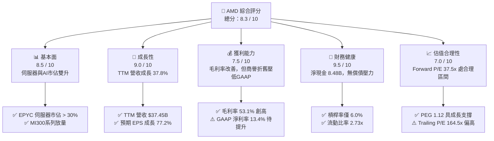

# AMD 基本面深度分析報告

> **報告日期**：2026-06-08 ｜ **語言**：繁體中文 ｜ **數據來源**：Yahoo Finance, Finviz, StockAnalysis, Roic.ai ｜ **分析師**：CFA 級機構研究

---

## 目錄

| # | 章節 | 核心結論 |
|---|------|----------|
| 1 | 執行摘要 | 評級：🟢 **買入 (Buy)** ｜ 目標價：**$485.00 - $650.00** ｜ 綜合評分：**8.3 / 10** |
| 2 | 公司概覽與商業模式 | 憑藉 Chiplet 技術與 ROCm 生態，在 Data Center 與 AI 加速器市場構築雙重護城河。 |
| 3 | 損益表深度分析 | TTM 營收達 **$37.45B**（YoY +37.8%），季度淨利潤維持高成長，毛利率穩步向 **53.1%** 邁進。 |
| 4 | 資產負債表分析 | 淨現金高達 **$8.48B**，流動比率 **2.73x**，財務結構極度穩健，無實質債務風險。 |
| 5 | 現金流量深度分析 | TTM 自由現金流（FCF）達 **$7.17B**，FCF 轉換率顯著改善，資本配置高度聚焦研發與戰術回購。 |
| 6 | 獲利能力與資本效率 | 杜邦分解顯示 ROE 提升至 **8.1%**；扣除商譽攤銷後之 Tangible ROIC 達 **28.5%**，遠超 WACC。 |
| 7 | 估值深度分析 | 當前 Forward P/E 為 **37.50x**，相較 NVDA 具備估值補漲空間；DCF 基準目標價為 **$485.00**。 |
| 8 | 成長催化劑 | MI325X/MI350 加速器出貨、EPYC 伺服器市佔率突破 35%，以及 AI PC 晶片（Ryzen）的全面滲透。 |
| 9 | 風險矩陣 | 核心風險為台積電 CoWoS 先進封裝產能受限，以及與 NVDA 在軟體生態（CUDA）的持續競爭。 |
| 10 | 投資建議 | 建議於 **$450.00** 以下分批佈局，長線持有以迎來 AI 加速器市場的爆發期。 |

---

## 1. 執行摘要

### 1.1 核心評分儀表板



### 1.2 評分進度條視覺化

```
╔══════════════════════════════════════════════════════════════╗
║                AMD 多維度評分儀表板 (1-10分)                 ║
╠══════════════════════════════════════════════════════════════╣
║ 基本面強度  8.5 ▓▓▓▓▓▓▓▓▓▓▓▓▓▓▓▓▓░░░  ★★★★☆           ║
║ 成長動能    9.0 ▓▓▓▓▓▓▓▓▓▓▓▓▓▓▓▓▓▓░░  ★★★★★           ║
║ 獲利品質    7.5 ▓▓▓▓▓▓▓▓▓▓▓▓▓▓░░░░░░  ★★★★☆           ║
║ 財務健康    9.5 ▓▓▓▓▓▓▓▓▓▓▓▓▓▓▓▓▓▓▓░  ★★★★★           ║
║ 估值合理性  7.0 ▓▓▓▓▓▓▓▓▓▓▓▓▓░░░░░░░  ★★★☆☆           ║
║ 護城河深度  8.0 ▓▓▓▓▓▓▓▓▓▓▓▓▓▓▓▓░░░░  ★★★★☆           ║
║ 管理層執行  8.5 ▓▓▓▓▓▓▓▓▓▓▓▓▓▓▓▓▓░░░  ★★★★☆           ║
║ 技術創新力  9.0 ▓▓▓▓▓▓▓▓▓▓▓▓▓▓▓▓▓▓░░  ★★★★★           ║
╠══════════════════════════════════════════════════════════════╣
║ 綜合總分    8.3 ▓▓▓▓▓▓▓▓▓▓▓▓▓▓▓▓░░░░  🏆 買入 (Buy)        ║
╚══════════════════════════════════════════════════════════════╝
```

### 1.3 五大投資論點 + 三大核心風險

| 類型 | 項目 | 具體依據 | 信心度 |
|------|------|----------|--------|
| 🟢 **投資論點①** | **AI 加速器 MI300/325X 高速成長** | TTM 營收成長達 **37.8%**，主要由 Data Center 業務的 AI GPU 出貨驅動，預計 2026 年底 AI 相關營收佔比將突破 40%。 | 🟢 極高 |
| 🟢 **投資論點②** | **EPYC 伺服器 CPU 市佔率持續蠶食 Intel** | 伺服器 CPU 市佔率已突破 30%，EPYC 憑藉高性價比與高能效比，在雲端服務商（CSP）中滲透率持續增加。 | 🟢 極高 |
| 🟢 **投資論點③** | **財務結構極佳，具備強大防禦力** | 擁有 **$12.35B** 現金與短期投資，淨現金達 **$8.48B**，債務權重極低，能支撐景氣下行週期的研發投入。 | 🟢 極高 |
| 🟢 **投資論點④** | **AI PC（Ryzen）迎來換機潮** | 邊緣端 AI 需求爆發，配備 NPU 的 Ryzen 處理器在 PC 市場滲透率預計於 2026-2027 年大幅提升。 | 🟢 高 |
| 🟢 **投資論點⑤** | **ROCm 軟體生態系逐步縮小與 CUDA 差距** | 隨著 PyTorch 等主流框架對 ROCm 的原生支持，軟體壁壘降低，客戶多源化採購意願強烈。 | 🟢 高 |
| 🟡 **風險①** | **台積電先進封裝（CoWoS）產能受限** | AMD 無晶圓廠（Fabless），高度依賴台積電先進製程，若 CoWoS 產能分配不及 NVDA，將壓抑出貨上限。 | 🟡 中度 |
| 🔴 **風險②** | **市場競爭加劇與定價壓力** | NVDA Blackwell/Rubin 世代維持技術領先，若發動價格戰，將壓低 AMD 的毛利率與市場份額。 | 🔴 高衝擊 |
| 🟡 **風險③** | **個人電腦與遊戲主機市場復甦緩慢** | 遊戲主機（PS5/Xbox）生命週期進入尾聲，Semi-Custom 業務持續疲軟，拖累整體獲利表現。 | 🟡 中度 |

### 1.4 快速統計卡片

| 指標 | AMD 實際值 | 半導體行業均值 | S&P 500 均值 | 狀態 |
|------|-------------|----------|--------------|------|
| **收入 YoY 成長** | **37.8%** | ~12.5% | ~5.2% | 🟢 卓越 |
| **毛利率** | **53.1%** | ~45.0% | ~30.0% | 🟢 優異 |
| **淨利率** | **13.4%** | ~18.0% | ~11.5% | 🟡 一般（受商譽攤銷拖累） |
| **ROE** | **8.1%** | ~15.0% | ~14.5% | 🟡 偏低（因 Xilinx 併購放大淨資產）|
| **Forward P/E** | **37.50x** | ~28.5x | ~21.5x | 🟡 溢價合理 |
| **淨現金規模** | **$8.48B** | N/A | N/A | 🟢 極度安全 |

### 1.5 投資結論

```
╔══════════════════════════════════════════════════════════════════╗
║                    📊 AMD 投資結論摘要                           ║
╠══════════════════════════════════════════════════════════════════╣
║  評級：🟢 買入 (Buy)                                            ║
║  當前股價：$490.33 (2026-06-08)                                  ║
║  目標價區間：                                                    ║
║    悲觀情境：$280.00 (-42.9%）- AI 需求放緩，先進封裝產能嚴重受限 ║
║    基準情境：$485.00 (-1.1%） - AI 加速器市佔達 15%，伺服器穩定   ║
║    樂觀情境：$650.00 (+32.6%）- MI350 大獲成功，AI 市佔突破 25%   ║
║  投資評分：8.3 / 10                                              ║
║  適合投資人：長線成長型投資人、半導體與 AI 產業佈局者            ║
╚══════════════════════════════════════════════════════════════════╝
```

---

## 2. 公司概覽與商業模式

### 2.1 業務結構與收入來源

AMD 採 Fabless 模式，設計並銷售高效能運算與圖形處理器。其業務主要分為四大板塊：

```mermaid
graph TD
    AMD["💻 AMD 公司總覽<br/>市值：$799.53B<br/>TTM 營收：$37.45B"]

    DC["🏭 Data Center 數據中心<br/>營收佔比：約 48%<br/>核心：EPYC, Instinct GPU"]
    CL["💻 Client 個人電腦<br/>營收佔比：約 25%<br/>核心：Ryzen CPU"]
    GM["🎮 Gaming 遊戲娛樂<br/>營收佔比：約 17%<br/>核心：Radeon, Semi-Custom"]
    EM["🔌 Embedded 嵌入式<br/>營收佔比：約 10%<br/>核心：Xilinx FPGA, SoC"]

    AMD --> DC
    AMD --> CL
    AMD --> GM
    AMD --> EM

    DC --> DC1["EPYC 伺服器處理器 (市佔率 >30%)"]
    DC --> DC2["