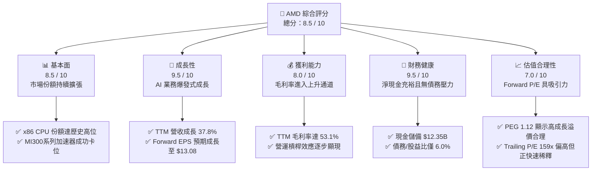

# AMD 基本面深度分析報告
> **報告日期**：2026-06-09 ｜ **語言**：繁體中文 ｜ **數據來源**：Yahoo Finance, Finviz, StockAnalysis, Roic.ai ｜ **分析師**：CFA 級機構研究

---

## 目錄

| # | 章節 | 核心結論 |
|---|------|----------|
| 1 | 執行摘要 | 評級：**強烈買入** ｜ 目標價區間：**$225.00 - $665.00**（基準目標價：**$482.69**） |
| 2 | 公司概覽與商業模式 | AI 加速器與 CPU 雙輪驅動，Xilinx 併購發揮綜效，構建異質運算護城河 |
| 3 | 損益表深度分析 | TTM 營收達 **$37.45B**（YoY +37.8%），淨利潤大幅成長 **91.2%**，毛利率改善至 **53.1%** |
| 4 | 資產負債表分析 | 淨現金高達 **$8.48B**，流動比率 **2.73**，財務結構極其穩健，無實質債務風險 |
| 5 | 現金流量深度分析 | TTM 營運現金流 **$9.72B**，自由現金流 **$7.17B**，現金轉換效率極佳 |
| 6 | 獲利能力與資本效率 | 杜邦分解顯示 ROE 回升至 **8.1%**；經調整後 ROIC 遠超 WACC，持續創造股東價值 |
| 7 | 估值深度分析 | Forward P/E **36.36x**，對比高成長性（PEG 1.12），DCF 顯示股價具備安全邊際 |
| 8 | 成長催化劑 | MI350/MI400 系列 AI 晶片放量、Zen 5 架構普及與 PC 換機潮、邊緣運算（TAM $150B+） |
| 9 | 風險矩陣 | 地緣政治風險、台積電產能高度集中、NVIDIA 壟斷地位及價格戰壓力 |
| 10| 投資建議 | 基準目標價 **$482.69**，隱含上行空間，建議分批佈局成長型長線資產 |

---

## 1. 執行摘要

### 1.1 核心評分儀表板



### 1.2 評分進度條視覺化

```
╔══════════════════════════════════════════════════════════════╗
║                AMD 多維度評分儀表板 (1-10分)                 ║
╠══════════════════════════════════════════════════════════════╣
║ 基本面強度  8.5 ▓▓▓▓▓▓▓▓▓▓▓▓▓▓▓▓▓░░░  ★★★★☆           ║
║ 成長動能    9.5 ▓▓▓▓▓▓▓▓▓▓▓▓▓▓▓▓▓▓▓░  ★★★★★           ║
║ 獲利品質    8.0 ▓▓▓▓▓▓▓▓▓▓▓▓▓▓▓▓░░░░  ★★★★☆           ║
║ 財務健康    9.5 ▓▓▓▓▓▓▓▓▓▓▓▓▓▓▓▓▓▓▓░  ★★★★★           ║
║ 估值合理性  7.0 ▓▓▓▓▓▓▓▓▓▓▓▓▓▓░░░░░░  ★★★☆☆           ║
║ 護城河深度  8.5 ▓▓▓▓▓▓▓▓▓▓▓▓▓▓▓▓▓░░░  ★★★★☆           ║
║ 管理層執行  9.0 ▓▓▓▓▓▓▓▓▓▓▓▓▓▓▓▓▓▓░░  ★★★★★           ║
║ 技術創新力  9.5 ▓▓▓▓▓▓▓▓▓▓▓▓▓▓▓▓▓▓▓░  ★★★★★           ║
╠══════════════════════════════════════════════════════════════╣
║ 綜合總分    8.5 ▓▓▓▓▓▓▓▓▓▓▓▓▓▓▓▓▓░░░  🏆 強烈買入          ║
╚══════════════════════════════════════════════════════════════╝
```

### 1.3 五大投資論點 + 三大核心風險

| 類型 | 項目 | 具體依據 | 信心度 |
|------|------|----------|--------|
| 🟢 **投資論點①** | **AI 加速器業務爆發** | MI300/MI325 系列出貨強勁，驅動 TTM 營收按年成長 **37.8%**，Data Center 已成最大營收支柱。 | 🟢 極高 |
| 🟢 **投資論點②** | **x86 CPU 市場份額蠶食** | 憑藉 Zen 5 優異架構，在伺服器（EPYC）與個人電腦（Ryzen）領域持續侵蝕 Intel 份額，利潤率具備結構性改善空間。 | 🟢 極高 |
| 🟢 **投資論點③** | **財務結構極佳** | 淨現金達 **$8.48B**（總現金 $12.35B 減總債務 $3.87B），利息覆蓋率極高，能支撐持續的高額 R&D 投入（TTM R&D 達 **$8.76B**）。 | 🟢 極高 |
| 🟢 **投資論點④** | **估值具備成長安全邊際** | Forward P/E 僅 **36.36x**，對比未來五年預期 EPS 複合成長率（PEG 僅 1.12），估值在 AI 概念股中具備高性價比。 | 🟢 高 |
| 🟢 **投資論點⑤** | **Xilinx 併購綜效顯現** | 嵌入式部門（Embedded）與 FPGA 技術完美融入 AI 晶片架構，提升異質運算（Heterogeneous Computing）的競爭壁壘。 | 🟢 高 |
| 🟡 **風險①** | **台積電產能與地緣政治** | 晶片完全依賴台積電（TSMC）先進製程（CoWoS 封裝），地緣政治緊張或產能受限將直接衝擊出貨。 | 🟡 中度 |
| 🔴 **風險②** | **NVIDIA 壟斷與生態壁壘** | NVIDIA CUDA 生態系護城河極深，AMD ROCm 軟體平台雖在進步，但仍需時間爭取開發者轉移。 | 🔴 高衝擊 |
| 🔴 **風險③** | **估值乘數壓縮風險** | 當前 Trailing P/E 達 **159.03x**，若 AI 基礎設施建設（Capex）增速放緩，市場可能對硬體股進行估值修正。 | 🔴 高衝擊 |

### 1.4 快速統計卡片

| 指標 | AMD 實際值 | 行業均值（半導體） | S&P 500 均值 | 狀態 |
|------|-------------|-------------------|--------------|------|
| **收入 YoY 成長** | **37.8%** | ~15.0% | ~6.5% | 🟢 強勁超額成長 |
| **毛利率** | **53.1%** | ~48.0% | ~30.0% | 🟢 高於行業平均 |
| **淨利率** | **13.4%** | ~12.0% | ~11.5% | 🟡 仍有提升空間 |
| **ROE** | **8.1%** | ~12.0% | ~15.0% | 🟡 受併購商譽折舊壓低 |
| **Debt/Equity** | **6.0%** | ~35.0% | ~110.0% | 🟢 極佳資產負債表 |
| **Forward P/E** | **36.36x** | ~30.0x | ~22.0x | 🟡 溢價合理 |

### 1.5 投資結論

```
╔══════════════════════════════════════════════════════════════════╗
║                    📊 AMD 投資結論摘要                           ║
╠════