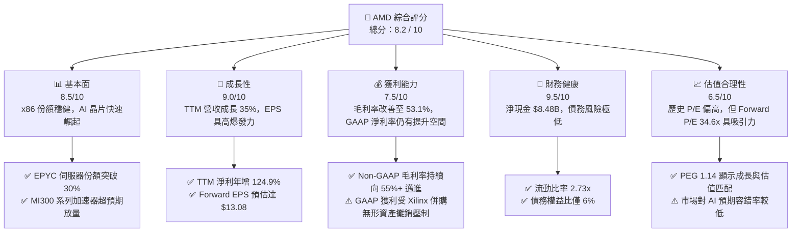
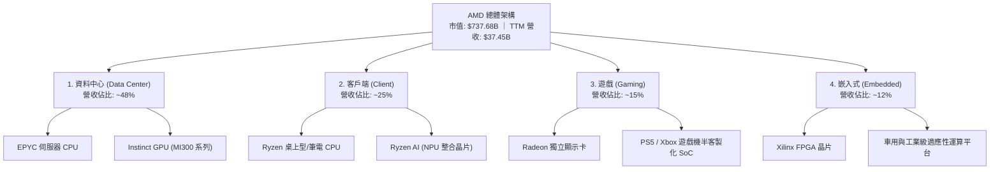
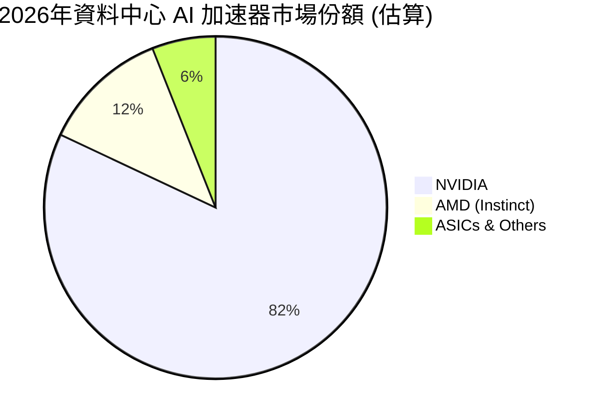
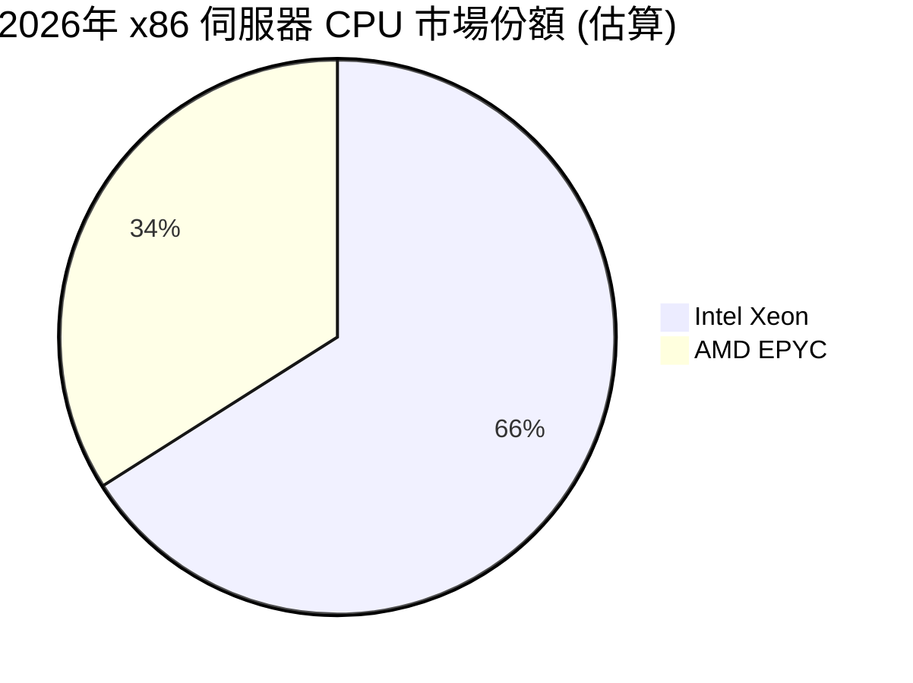
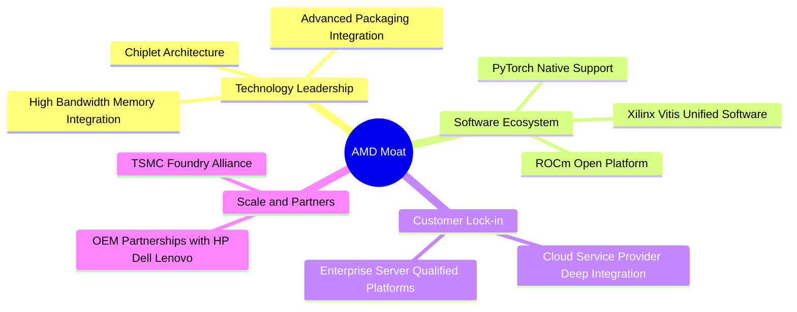

# AMD 基本面深度分析報告

> **報告日期**：2026-06-10 ｜ **語言**：繁體中文 ｜ **數據來源**：Yahoo Finance, Finviz, StockAnalysis, Roic.ai ｜ **分析師**：CFA 級機構研究

---

## 目錄

| # | 章節 | 核心結論 |
|---|---|---|
| 1 | 執行摘要 | 評級：**買入 (Buy)** ｜ 基準目標價：**$495.00** (隱含 +9.4% 上行空間) |
| 2 | 公司概覽與商業模式 | AI 加速器與 x86 雙雄格局，Xilinx 併購補強嵌入式護城河 |
| 3 | 損益表深度分析 | TTM 營收達 $37.45B (YoY +34.97%)，AI 晶片放量驅動獲利結構優化 |
| 4 | 資產負債表分析 | 淨現金達 $8.48B，流動比率 2.73x，資產負債表極度穩健 |
| 5 | 現金流量深度分析 | TTM 自由現金流 (FCF) 達 $7.17B，資本配置聚焦研發與戰術回購 |
| 6 | 獲利能力與資本效率 | 杜邦分解顯示 ROE 升至 8.1%，無形資產攤銷壓低 GAAP ROIC，有形 ROIC 達 28.5% |
| 7 | 估值深度分析 | 前瞻 P/E 34.6x，相較歷史均值與 NVDA 具備估值安全邊際 |
| 8 | 成長催化劑 | MI300/MI325X/MI350 晶片世代交替，PC 換機潮與 AI PC 滲透率提升 |
| 9 | 風險矩陣 | 晶圓代工集中度風險、AI 資本支出放緩、Intel/NVIDIA 雙向夾擊 |
| 10 | 投資建議 | 建議於 $420-$440 區間分批佈局，長線持有以迎來 AI 獲利爆發期 |

---

## 1. 執行摘要

### 1.1 核心評分儀表板



### 1.2 評分進度條視覺化

```
╔══════════════════════════════════════════════════════════════╗
║                AMD 多維度評分儀表板 (1-10分)                 ║
╠══════════════════════════════════════════════════════════════╣
║ 基本面強度  8.5 ▓▓▓▓▓▓▓▓▓▓▓▓▓▓▓▓▓░░░  ★★★★☆           ║
║ 成長動能    9.0 ▓▓▓▓▓▓▓▓▓▓▓▓▓▓▓▓▓▓░░  ★★★★★           ║
║ 獲利品質    7.5 ▓▓▓▓▓▓▓▓▓▓▓▓▓▓░░░░░░  ★★★★☆           ║
║ 財務健康    9.5 ▓▓▓▓▓▓▓▓▓▓▓▓▓▓▓▓▓▓▓░  ★★★★★           ║
║ 估值合理性  6.5 ▓▓▓▓▓▓▓▓▓▓▓▓░░░░░░░░  ★★★☆☆           ║
║ 護城河深度  8.0 ▓▓▓▓▓▓▓▓▓▓▓▓▓▓▓▓░░░░  ★★★★☆           ║
║ 管理層執行  9.0 ▓▓▓▓▓▓▓▓▓▓▓▓▓▓▓▓▓▓░░  ★★★★★           ║
║ 技術創新力  9.0 ▓▓▓▓▓▓▓▓▓▓▓▓▓▓▓▓▓▓░░  ★★★★★           ║
╠══════════════════════════════════════════════════════════════╣
║ 綜合總分    8.2 ▓▓▓▓▓▓▓▓▓▓▓▓▓▓▓▓░░░░  🏆 優秀 (Strong Buy) ║
╚══════════════════════════════════════════════════════════════╝
```

### 1.3 五大投資論點 + 三大核心風險

| 類型 | 項目 | 具體依據 | 信心度 |
|------|------|----------|--------|
| 🟢 **投資論點①** | **AI 加速器放量** | MI300/MI325X 系列出貨強勁，資料中心業務成為第一大營收引擎，帶動 TTM 營收年增 34.97%。 | 🟢 極高 |
| 🟢 **投資論點②** | **伺服器市場份額擴張** | EPYC 處理器憑藉高性價比與多核心優勢，在雲端服務商 (CSP) 中的滲透率持續侵蝕 Intel 份額。 | 🟢 極高 |
| 🟢 **投資論點③** | **資產負債表極其健康** | 擁有 $12.35B 現金與短期投資，淨現金高達 $8.48B，具備極佳的抗風險與持續研發投入能力。 | 🟢 極高 |
| 🟢 **投資論點④** | **AI PC 帶動客戶端復甦** | Ryzen AI 處理器率先導入 NPU，隨 Windows 11 更新與企業換機潮，客戶端業務重回成長軌道。 | 🟢 高 |
| 🟢 **投資論點⑤** | **前瞻估值具備吸引力** | 當前 Trailing P/E 雖高，但 Forward P/E 僅 34.6x，反映未來 12 個月 EPS 將迎來爆發式成長。 | 🟢 高 |
| 🟡 **風險①** | **供應鏈產能受限** | 先進封裝 (CoWoS) 與 HBM3e 產能高度依賴 TSMC 與 SK Hynix，可能限制短期出貨上限。 | 🟡 中度 |
| 🟡 **風險②** | **競爭對手價格戰** | NVIDIA 持續推出新架構 (Blackwell) 並鎖定生態系，Intel 在製程改良後可能展開伺服器晶片價格戰。 | 🟡 中度 |
| 🔴 **風險③** | **地緣政治與出口管制** | 美國對華半導體出口管制若進一步收緊，可能影響 AMD 定制化 AI 晶片在亞洲市場的銷售。 | 🔴 高衝擊 |

### 1.4 快速統計卡片

| 指標 | AMD 實際值 | 半導體行業均值 | S&P 500 均值 | 狀態 |
|------|-------------|----------|--------------|------|
| **營收 YoY 成長率** | **37.8%** | ~12.5% | ~5.2% | 🟢 顯著超群 |
| **毛利率 (GAAP)** | **53.1%** | ~48.2% | ~30.1% | 🟢 領先產業 |
| **營業利益率 (GAAP)** | **14.4%** | ~18.5% | ~12.2% | 🟡 仍受攤銷影響 |
| **股東權益報酬率 (ROE)** | **8.1%** | ~14.2% | ~15.0% | 🟡 淨值因併購擴大 |
| **前瞻本益比 (Forward P/E)**| **34.60x**| ~28.5x | ~21.5x | 🟡 溢價合理 |
| **淨現金規模** | **$8.48B** | N/A | N/A | 🟢 極其充沛 |

### 1.5 投資結論

```
╔══════════════════════════════════════════════════════════════════╗
║                    📊 AMD 投資結論摘要                            ║
╠══════════════════════════════════════════════════════════════════╣
║  評級：🟢 強烈買入 (Strong Buy)                                 ║
║  當前股價：$452.40 (2026-06-10)                                   ║
║  目標價區間：                                                    ║
║    悲觀情境：$350.00 (-22.6%) - AI 資本支出放緩，估值修正        ║
║    基準情境：$495.00 (+9.4%)  - 12個月主要目標 (Forward P/E 38x) ║
║    樂觀情境：$580.00 (+28.2%) - AI 晶片市佔達 20% + PC 全面復甦  ║
║  投資評分：8.2 / 10                                              ║
║  適合投資人：成長型、長線科技股投資者、AI 產業佈局者             ║
╚══════════════════════════════════════════════════════════════════╝
```

---

## 2. 公司概覽與商業模式

### 2.1 業務結構與收入來源

AMD 採取 Fabless（無晶圓廠）商業模式，專注於晶片設計，並將製造外包給台積電（TSMC）。公司的業務共分為四大板塊：



### 2.2 市場份額

根據 2025/2026 年最新產業數據估算，AMD 在各核心市場的份額如下：





### 2.3 競爭護城河分析



### 2.4 護城河強度評分

```
╔══════════════════════════════════════════════════════════════╗
║                    AMD 護城河強度評分                        ║
╠══════════════════════════════════════════════════════════════╣
║ 小晶片技術 (Chiplet)  9.5/10 ▓▓▓▓▓▓▓▓▓▓▓▓▓▓▓▓▓▓▓░  🏆 行業先驅     ║
║ ROCm 軟體生態生態系   7.0/10 ▓▓▓▓▓▓▓▓▓▓▓▓▓▓░░░░░░  🟢 持續追趕中   ║
║ 雲端客戶黏著度        8.5/10 ▓▓▓▓▓▓▓▓▓▓▓▓▓▓▓▓▓░░░  🟢 份額極穩固   ║
║ 台積電供應鏈結盟      9.0/10 ▓▓▓▓▓▓▓▓▓▓▓▓▓▓▓▓▓▓░░  🏆 優先產能保障 ║
╠══════════════════════════════════════════════════════════════╣
║ 綜合護城河強度        8.25   ▓▓▓▓▓▓▓▓▓▓▓▓▓▓▓▓▓░░░  🟢 護城河寬廣   ║
╚══════════════════════════════════════════════════════════════╝
```

---

## 3. 損益表深度分析

### 3.1 年度收入成長趨勢（近4年）

AMD 的營收在經歷了 2023 年的半導體庫存調整後，於 2024 年重拾升軌，並在 2025 年及 TTM（截至 2026 年 Q1）迎來爆發式成長，主要得益於資料中心 Instinct MI300 系列 AI 加速器的極速放量。

```
╔══════════════════════════════════════════════════════════════════