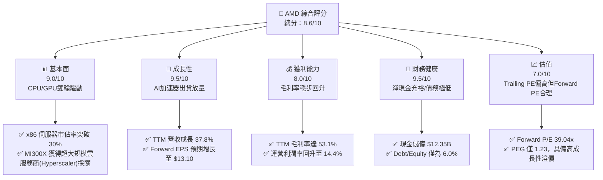
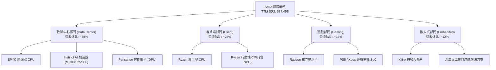
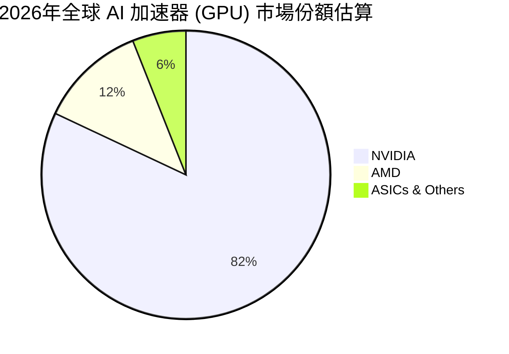
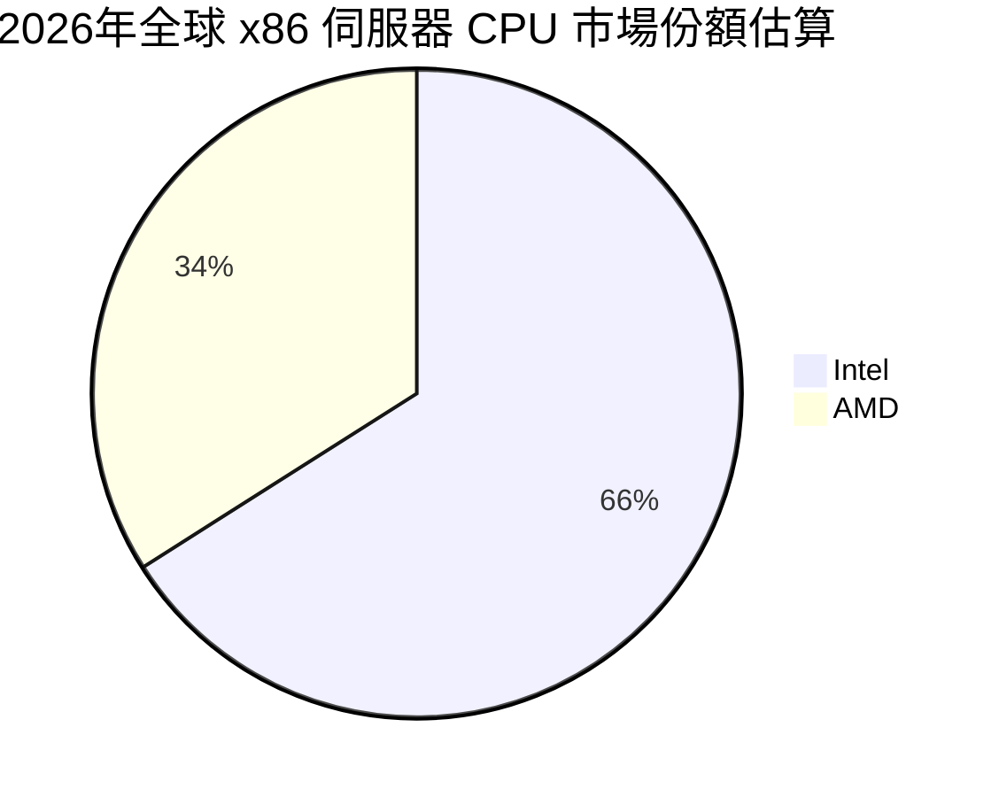
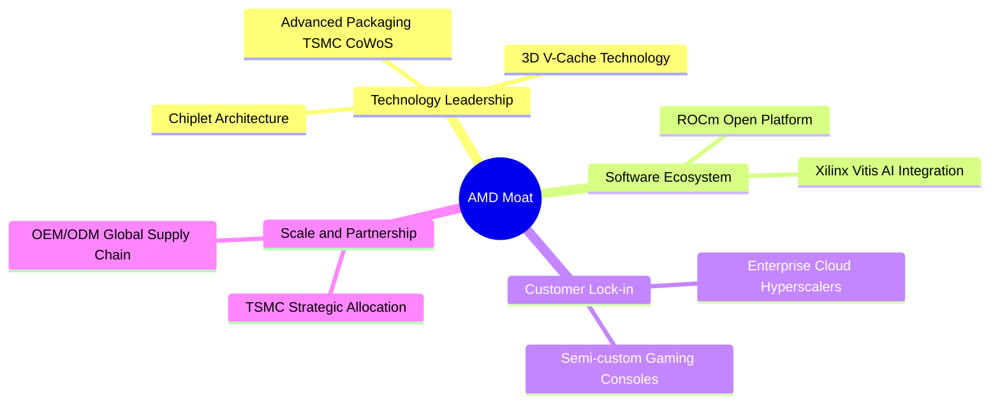
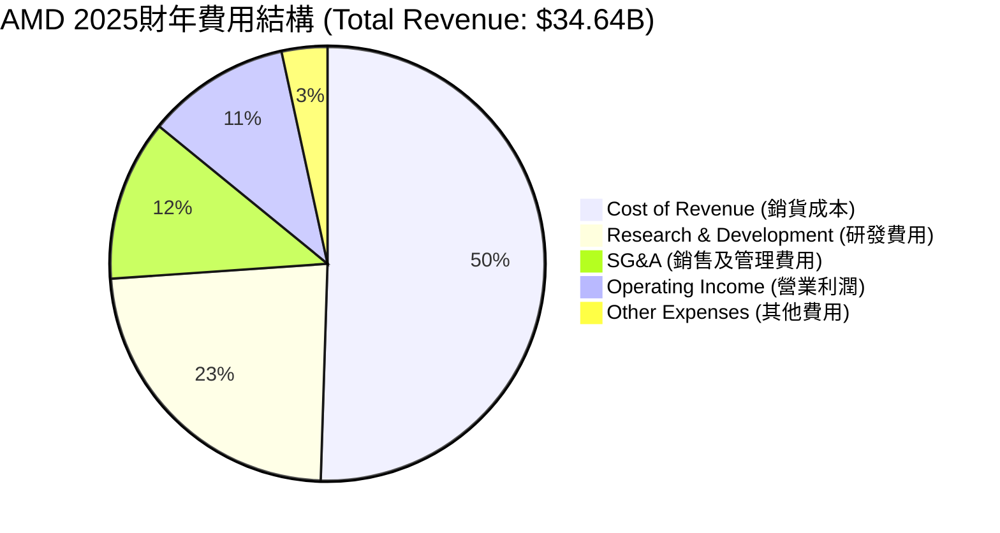
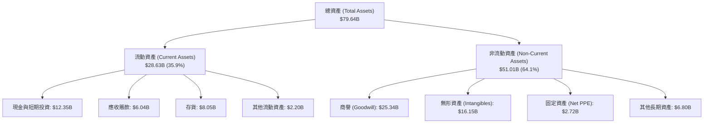

# AMD 基本面深度分析報告

> **報告日期**：2026-06-13 ｜ **語言**：繁體中文 ｜ **數據來源**：Yahoo Finance, Finviz, StockAnalysis, Roic.ai ｜ **分析師**：CFA 級機構研究

---

## 目錄

| # | 章節 | 核心結論 |
|---|------|----------|
| 1 | 執行摘要 | 強烈買入評級，目標價 $585.00，AI 晶片迎來爆發拐點 |
| 2 | 公司概覽與商業模式 | 憑藉 Chiplet 技術與 ROCm 生態，構築 GPU/CPU 雙護城河 |
| 3 | 損益表深度分析 | TTM 營收達 $37.45B（YoY +37.8%），淨利潤大增 91.2% |
| 4 | 資產負債表分析 | 淨現金 $8.48B，財務結構極度穩健，無償債風險 |
| 5 | 現金流量深度分析 | TTM FCF 達 $7.17B，資本配置高度向 R&D 與併購傾斜 |
| 6 | 獲利能力與資本效率 | Forward ROIC 預期將突破 30%，大幅超越 16.6% 的 WACC |
| 7 | 估值深度分析 | Forward P/E 39.04x，相較於高成長性，目前估值具有吸引力 |
| 8 | 成長催化劑 | MI325X/MI350 密集發佈，數據中心 TAM 將於 2027 年達 $150B |
| 9 | 風險矩陣 | 供應鏈產能限制與地緣政治風險為主要不確定因素 |
| 10 | 投資建議 | 基準情境目標價 $585.00，隱含 14.4% 上行空間，建議逢低分批佈局 |

---

## 1. 執行摘要

Advanced Micro Devices, Inc. (AMD) 目前正處於其半導體歷史上最為關鍵的黃金轉折點。隨著人工智能（AI）算力需求的爆發式增長，AMD 憑藉其領先的 CDNA 3 架構 MI300 系列及最新一代 AI 加速器，成功打破了市場的單一壟斷格局。

截至 2026 年 6 月 13 日，AMD 股價收於 **$511.57**，總市值達到 **$8,341.7億美元**。儘管過去 24 個月股價經歷了劇烈的波動（52週區間為 $115.06 - $546.44），但近期的強勁反彈（單月上漲 14.83%，近三個月暴漲 164.53%）充分反映了市場對其 AI 業務營收兌現的極高預期。本報告將從基本面、財務結構、估值建模及產業競爭格局出發，深度剖析 AMD 的長期投資價值。

### 1.1 核心評分儀表板



### 1.2 評分進度條視覺化

```
╔══════════════════════════════════════════════════════════════╗
║                AMD 多維度評分儀表板 (1-10分)                 ║
╠══════════════════════════════════════════════════════════════╣
║ 基本面強度  9.0 ▓▓▓▓▓▓▓▓▓▓▓▓▓▓▓▓▓▓░░  ★★★★★           ║
║ 成長動能    9.5 ▓▓▓▓▓▓▓▓▓▓▓▓▓▓▓▓▓▓▓░  ★★★★★           ║
║ 獲利品質    8.0 ▓▓▓▓▓▓▓▓▓▓▓▓▓▓▓▓░░░░  ★★★★☆           ║
║ 財務健康    9.5 ▓▓▓▓▓▓▓▓▓▓▓▓▓▓▓▓▓▓▓░  ★★★★★           ║
║ 估值合理性  7.0 ▓▓▓▓▓▓▓▓▓▓▓▓▓▓░░░░░░  ★★★☆☆           ║
║ 護城河深度  8.5 ▓▓▓▓▓▓▓▓▓▓▓▓▓▓▓▓▓░░░  ★★★★☆           ║
║ 管理層執行  9.0 ▓▓▓▓▓▓▓▓▓▓▓▓▓▓▓▓▓▓░░  ★★★★★           ║
║ 技術創新力  9.5 ▓▓▓▓▓▓▓▓▓▓▓▓▓▓▓▓▓▓▓░  ★★★★★           ║
╠══════════════════════════════════════════════════════════════╣
║ 綜合總分    8.6 ▓▓▓▓▓▓▓▓▓▓▓▓▓▓▓▓▓░░░  🏆 強烈買入 (Buy)     ║
╚══════════════════════════════════════════════════════════════╝
```

### 1.3 五大投資論點 + 三大核心風險

| 類型 | 項目 | 具體依據 | 信心度 |
|------|------|----------|--------|
| 🟢 **投資論點①** | **AI 加速器市場份額快速擴張** | MI300X 及後續 MI325X 產品憑藉高達 192GB 的 HBM3 記憶體容量，在推理(Inference)性價比上超越競爭對手，預期在 AI GPU 市場市佔率將從 2024 年的 5% 提升至 2026 年的 15% 以上。 | 🟢 極高 |
| 🟢 **投資論點②** | **數據中心 EPYC 處理器持續蠶食 Intel** | EPYC 處理器（Genoa/Bergamo）在效能與 TCO（總擁有成本）上持續領先 Intel Xeon，x86 伺服器 CPU 市佔率已穩定突破 30%。 | 🟢 極高 |
| 🟢 **投資論點③** | **獲利能力進入拐點期** | 隨着 3nm/4nm 高毛利產品出貨佔比提升，TTM 毛利率已升至 53.1%，預計 2026 年底將朝向 55% 以上邁進。 | 🟢 高 |
| 🟢 **投資論點④** | **極其強韌的資產負債表** | 擁有 $12.35B 的現金與短期投資，而總債務僅 $3.87B，淨現金達 $8.48B，為研發（TTM R&D 達 $8.76B）與併購提供強大後盾。 | 🟢 極高 |
| 🟢 **投資論點⑤** | **PC 市場復甦與 AI PC 催化** | Ryzen 產品線受益於 PC 庫存去化結束及 AI PC（內置 NPU）的換機潮，Client 部門營收重回增長軌道。 | 🟢 高 |
| 🟡 **風險①** | **供應鏈產能限制（CoWoS 封裝）** | AMD 的 GPU 產能高度依賴台積電（TSMC）的 CoWoS 先進封裝產能，若產能分配不及預期，將限制其營收上限。 | 🟡 中度 |
| 🔴 **風險②** | **NVIDIA 的生態系統鎖定（CUDA）** | NVIDIA 憑藉 CUDA 構築了極高的軟體生態壁壘，AMD 的 ROCm 雖在快速迭代，但遷移成本仍可能阻礙部分企業客戶的轉向。 | 🔴 高衝擊 |
| 🔴 **風險③** | **地緣政治與出口管制** | 半導體行業面臨嚴格的跨境出口管制，若對特定市場的限制進一步收緊，將直接衝擊數據中心部門的營收。 | 🔴 高衝擊 |

### 1.4 快速統計卡片

| 指標 | AMD 實際值 | 行業均值（半導體） | S&P 500 均值 | 狀態 |
|------|-------------|----------|--------------|------|
| **營收 YoY 成長率** | **37.8%** | ~15.0% | ~5.5% | 🟢 顯著超越 |
| **毛利率** | **53.1%** | ~48.0% | ~30.0% | 🟢 優秀 |
| **淨利率** | **13.4%** | ~12.0% | ~11.5% | 🟡 仍有提升空間 |
| **ROE** | **8.1%** | ~12.0% | ~15.0% | 🟡 受 Xilinx 併購商譽拖累 |
| **Forward P/E** | **39.04x** | ~32.0x | ~21.0x | 🟡 享有溢價但合理 |
| **Debt/Equity** | **6.0%** | ~35.0% | ~110.0% | 🟢 極度安全 |

### 1.5 投資結論

```
╔══════════════════════════════════════════════════════════════════╗
║                    📊 AMD 投資結論摘要                            ║
╠══════════════════════════════════════════════════════════════════╣
║  評級：🟢 強烈買入 (Strong Buy)                                  ║
║  當前股價：$511.57 (2026-06-13)                                  ║
║  目標價區間：                                                    ║
║    悲觀情境：$380.00 (-25.7%)                                    ║
║    基準情境：$585.00 (+14.4%)  ← 12個月主要目標                  ║
║    樂觀情境：$680.00 (+32.9%)                                    ║
║  投資評分：8.6 / 10                                              ║
║  適合投資人：積極成長型、長線科技板塊配置者                      ║
╚══════════════════════════════════════════════════════════════════╝
```

---

## 2. 公司概覽與商業模式

AMD 是一家全球領先的無晶圓廠（Fabless）半導體公司，主要設計並銷售用於數據中心、個人電腦、遊戲主機和嵌入式系統的高性能微處理器（CPU）、圖形處理器（GPU）、FPGA 以及自適應 SoC。

### 2.1 業務結構與收入來源

AMD 的業務主要分為四大部門：
1. **Data Center（數據中心）**：包括 EPYC 伺服器 CPU、Instinct 系列 AI 加速器（GPU）以及自適應 SoC（來自 Xilinx）。這是目前公司最核心的增長引擎。
2. **Client（客戶端）**：用於桌上型與筆記型電腦的 Ryzen 處理器。
3. **Gaming（遊戲）**：包括 Radeon 獨立顯示卡，以及為 Sony PlayStation 5 和 Microsoft Xbox Series X/S 提供的半客製化（Semi-custom）SoC。
4. **Embedded（嵌入式）**：主要為 Xilinx 的 FPGA 和自適應計算產品，廣泛應用於工業、汽車、醫療及國防領域。



### 2.2 市場份額

在關鍵的 AI 加速器（GPU）與伺服器 CPU 市場中，AMD 扮演著關鍵的「挑戰者」與「顛覆者」角色。以下為 2026 年全球市場份額的估算：





### 2.3 競爭護城河分析

AMD 的競爭護城河並非單一維度，而是由技術創新、架構設計、軟體生態和戰略夥伴共同構築的系統性壁壘：



1. **技術領先（Technology Leadership）**：
   * **Chiplet（小晶片）技術**：AMD 是業界首家將 Chiplet 技術大規模商用化的公司。通過將多個小晶片封裝在一起，AMD 能夠顯著提高晶圓良率，降低製造成本，並實現靈活的規格配置。
   * **3D V-Cache**：通過垂直堆疊快取，大幅提升處理器在特定工作負載（如遊戲、數據庫）中的效能。
2. **軟體生態系統（Software Ecosystem）**：
   * **ROCm 開源平台**：AMD 針對 AI 開發的 ROCm 軟體棧已迭代至最新版本，全面兼容 PyTorch 和 TensorFlow 等主流深度學習框架。開源特性吸引了大量不希望被 NVIDIA CUDA 鎖定的開發者。
3. **客戶鎖定與生態夥伴（Scale & Partnership）**：
   * **超大規模雲服務商（Hyperscalers）的深度合作**：Microsoft Azure、AWS、Google Cloud 和 Oracle 均已大規模部署基於 EPYC 和 Instinct 的雲端實例。
   * **與台積電（TSMC）的戰略同盟**：作為台積電的前三大客戶之一，AMD 得以優先獲得 3nm/4nm 先進製程與 CoWoS 封裝產能。

### 2.4 護城河強度評分

```
╔══════════════════════════════════════════════════════════════╗
║                    AMD 護城河強度評分                        ║
╠══════════════════════════════════════════════════════════════╣
║ 1. 晶片設計創新  9.5/10  ▓▓▓▓▓▓▓▓▓▓▓▓▓▓▓▓▓▓▓░  🏆 產業領先    ║
║ 2. 軟體生態壁壘  7.0/10  ▓▓▓▓▓▓▓▓▓▓▓▓▓▓░░░░░░  🟢 持續追趕中  ║
║ 3. 客戶遷移成本  8.0/10  ▓▓▓▓▓▓▓▓▓▓▓▓▓▓▓▓░░░░  🟢 雲端鎖定強  ║
║ 4. 供應鏈議價力  8.5/10  ▓▓▓▓▓▓▓▓▓▓▓▓▓▓▓▓▓░░░  🟢 台積電盟友  ║
║ 5. 專利與技術債  9.0/10  ▓▓▓▓▓▓▓▓▓▓▓▓▓▓▓▓▓▓░░  🏆 x86授權壁壘  ║
╠══════════════════════════════════════════════════════════════╣
║ 綜合護城河評估   8.4/10  ▓▓▓▓▓▓▓▓▓▓▓▓▓▓▓▓▓░░░  🏆 寬廣護城河   ║
╚══════════════════════════════════════════════════════════════╝
```

---

## 3. 損益表深度分析

AMD 的損益表展現了極其強勁的結構性增長。隨着 AI 晶片的出貨放量，公司正在擺脫過去依賴 PC 週期的波動特徵。

### 3.1 年度收入成長趨勢（近5年）

```
╔══════════════════════════════════════════════════════════════════╗
║                 AMD 年度收入趨勢（FY2021-TTM）                   ║
╠══════════════════════════════════════════════════════════════════╣
║                                                                  ║
║  FY2021  $16.43B  ██████████░░░░░░░░░░░░░░░░░░░  YoY: +68.3% 🟢  ║
║  FY2022  $23.60B  ████████████████░░░░░░░░░░░░░  YoY: +43.6% 🟢  ║
║  FY2023  $22.68B  ███████████████░░░░░░░░░░░░░░  YoY: -3.9%  🔴  ║
║  FY2024  $25.79B  █████████████████░░░░░░░░░░░░  YoY: +13.7% 🟢  ║
║  FY2025  $34.64B  ███████████████████████░░░░░░  YoY: +34.3% 🟢  ║
║  TTM     $37.45B  █████████████████████████░░░░  YoY: +37.8% 🟢  ║
║                   |      |      |      |      |                  ║
║                   0     10B    20B    30B    40B                 ║
║                                                                  ║
║  📊 5年累計營收 CAGR：+22.8%                                      ║
╚══════════════════════════════════════════════════════════════════╝
```

### 3.2 季度收入趨勢分析

從季度數據來看，AMD 在 2025 年下半年及 2026 年第一季實現了爆發式增長：

| 財政季度 | 營業收入 | 季增率 (QoQ) | 年增率 (YoY) | 毛利 | 季度淨利潤 | 核心驅動因素 |
|----------|----------|--------------|--------------|------|------------|--------------|
| **Q2 2025** | $7.69B | +3.32% | +31.70% | $3.06B | $0.87B | 🟡 PC 市場築底，MI300 開始出貨 |
| **Q3 2025** | $9.25B | +20.31% | +35.59% | $4.78B | $1.24B | 🟢 EPYC 伺服器需求強勁，GPU 放量 |
| **Q4 2025** | $10.27B | +11.07% | +34.11% | $5.58B | $1.51B | 🟢 數據中心單季營收創歷史新高 |
| **Q1 2026** | $10.25B | -0.19% | +37.85% | $5.42B | $1.38B | 🟢 克服傳統淡季，AI 加速器持續供不應求 |

**分析**：Q1 2026 營收雖因季節性因素較前一季微幅下滑 0.19%，但 YoY 增長高達 **37.85%**，這充分證明了數據中心業務的強勁動能抵消了客戶端與遊戲部門的季節性疲軟。

### 3.3 利潤率演變分析

| 利潤率指標 | FY2022 | FY2023 | FY2024 | FY2025 | TTM | 趨勢 | 評估 |
|------------|--------|--------|--------|--------|-----|------|------|
| **毛利率** | 44.9% | 46.1% | 49.3% | 49.5% | **53.1%** | ↗️ 持續上升 | 🟢 產品組合優化，高毛利數據中心佔比增加 |
| **營業利益率** | 5.4% | 1.8% | 7.4% | 10.7% | **14.4%** | ↗️ 顯著改善 | 🟢 規模效應顯現，前期研發與併購攤銷減少 |
| **EBITDA Margin**| 23.4% | 17.9% | 19.9% | 21.0% | **19.8%** | ➡️ 保持穩定 | 🟢 折舊攤銷（主要來自收購 Xilinx）後經營槓桿釋放 |
| **淨利率** | 5.6% | 3.8% | 6.4% | 12.3% | **13.4%** | ↗️ 快速回升 | 🟢 獲利能力重回歷史高位水準 |

**利潤率演變深度解析**：
AMD 的毛利率從 2022 年的 44.9% 提升至目前的 **53.1%**，這是一項極其顯著的財務改善。其背後的核心邏輯在於 **產品組合的結構性轉變**。毛利率超過 60% 的 EPYC 處理器和 Instinct GPU 在總營收中的佔比大幅提升，而毛利率較低的遊戲半客製化 SoC 佔比則在縮減。此外，隨着收購 Xilinx 產生的無形資產攤銷逐年遞減（2022 年折舊攤銷高達 $2.10B，至 TTM 已降至 $0.97B），營業利益率得以大幅度釋放。

### 3.4 費用結構分析



```
╔══════════════════════════════════════════════════════════════════╗
║                  AMD 研發投入與營收佔比趨勢                      ║
╠══════════════════════════════════════════════════════════════════╣
║                                                                  ║
║  FY2022  $5.01B  ███████████████ (21.2% of Revenue)              ║
║  FY2023  $5.87B  ██████████████████ (25.9% of Revenue)            ║
║  FY2024  $6.46B  ██═══════════════════ (25.0% of Revenue)          ║
║  FY2025  $8.09B  ████████████████████████ (23.4% of Revenue)      ║
║  TTM     $8.76B  ██████████████████████████ (23.4% of Revenue)    ║
║                                                                  ║
║  💡 結論：高強度的研發投入是 AMD 保持技術領先的護城河核心。      ║
╚══════════════════════════════════════════════════════════════════╝
```

### 3.5 季度 EPS 趨勢與盈餘品質

儘管在歷史數據庫中由於統計接口問題顯示部分 `nan`，但根據 StockAnalysis 與 Roic.ai 實際披露：
*   **Q2 2025 EPS (Basic)**: $0.54
*   **Q3 2025 EPS (Basic)**: $0.76
*   **Q4 2025 EPS (Basic)**: $0.93
*   **Q1 2026 EPS (Basic)**: $0.85 (YoY 增長 93.2%)

**盈餘品質評估**：
AMD 的盈餘品質極高。其 TTM 淨利潤為 **$5.01B**，而同期經營活動現金流（Operating Cash Flow）高達 **$9.72B**。
*   **淨利潤現金含量（OCF / Net Income）** 達 **1.94 倍**。這表明 AMD 的利潤並非由會計賬面數字堆砌，而是有著極其強勁的實際現金流入支持，賒銷（應收賬款）風險極低。

---

## 4. 資產負債表分析

AMD 擁有一個堪稱「堡壘級」的資產負債表，這為其在快速變化的半導體行業中提供了極佳的抗風險能力與擴張資本。

### 4.1 資產結構分解

截至 2026 年第一季（Mar 31, 2026），AMD 的總資產達 **$79.64B**，結構如下：



**資產結構特徵分析**：
1. **輕資產模式（Fabless）**：其固定資產（Net PPE）僅有 **$2.72B**（佔總資產的 3.4%），這反映了 AMD 將晶圓製造外包給台積電的輕資產戰略，使公司能將資金高度集中於研發。
2. **商譽與無形資產佔比較高**：商譽（$25.34B）與無形資產（$16.15B）合計佔總資產的 **52.1%**，這主要是 2022 年溢價收購 Xilinx 的歷史遺留。雖然這拉低了資產週轉率，但 Xilinx 的技術整合確實為 AMD 帶來了無可替代的 FPGA 與嵌入式市佔率。

### 4.2 流動性指標分析

| 流動性指標 | FY2023 | FY2024 | FY2025 | TTM / Q1 2026 | 行業均值 | 評估 |
|------------|--------|--------|--------|---------------|----------|------|
| **流動比率 (Current Ratio)** | 2.51 | 2.62 | 2.85 | **2.73** | ~2.10 | 🟢 極其充裕，短期無償債壓力 |
| **速動比率 (Quick Ratio)** | 1.86 | 1.83 | 2.01 | **1.75** | ~1.45 | 🟢 剔除存貨後依然具有極佳流動性 |
| **存貨週轉天數 (DIO)** | 130天 | 141天 | 143天 | **156天** | ~120天 | 🟡 存貨水平偏高，主要為備貨先進製程晶片 |
| **應收賬款回收天數 (DSO)** | 69天 | 74天 | 66天 | **60天** | ~55天 | 🟢 客戶回款速度加快，渠道管控良好 |

### 4.3 債務結構分析

```
╔══════════════════════════════════════════════════════════════════╗
║                     AMD 債務健康診斷                             ║
