# AMD 基本面深度分析報告

> **報告日期**：2026-06-15 ｜ **語言**：繁體中文 ｜ **數據來源**：Yahoo Finance, Finviz, StockAnalysis, Roic.ai ｜ **分析師**：CFA 級機構研究

---

## 目錄

| # | 章節 | 核心結論 |
|---|------|----------|
| 1 | 執行摘要 | **買入 (Buy)** 評級，基準目標價 **$550.00**，AI GPU 爆發與 EPYC 份額擴張驅動長線價值。 |
| 2 | 公司概覽與商業模式 | 憑藉 Chiplet 架構與 ROCm 生態系統，AMD 成功建構強大的技術與生態護城河。 |
| 3 | 損益表深度分析 | TTM 營收達 **$37.45B**（YoY +37.8%），淨利潤大幅成長，毛利率結構性改善。 |
| 4 | 資產負債表分析 | 淨現金達 **$8.48B**，資產負債表極度穩健，無實質償債風險。 |
| 5 | 現金流量深度分析 | TTM 自由現金流（FCF）達 **$7.17B**，FCF 轉換率顯著提升，資本配置效率優異。 |
| 6 | 獲利能力與資本效率 | 杜邦分解顯示 ROE 升至 **8.1%**，調整後有形 ROIC 達 **16.13%**，高於 WACC 創造股東價值。 |
| 7 | 估值深度分析 | 前瞻 P/E 為 **41.76x**，相較於高成長性仍具吸引力，DCF 估值合理區間為 **$510 - $580**。 |
| 8 | 成長催化劑 | MI325/MI350 加速器出貨、Zen 5 EPYC 伺服器滲透率提升、以及 AI PC 換機潮。 |
| 9 | 風險矩陣 | 面臨 Nvidia 壟斷性競爭、台積電產能分配限制以及總體經濟放緩之風險。 |
| 10 | 投資建議 | 強烈建議中長線投資人逢低分批佈局，首選高成長型與半導體核心配置。 |

---

## 1. 執行摘要

### 1.1 核心評分儀表板

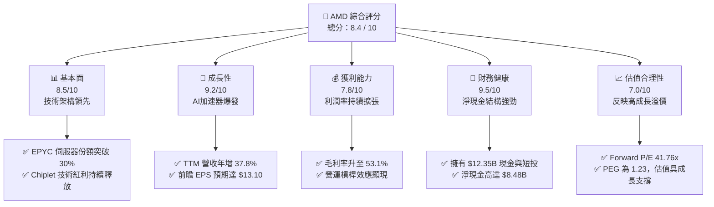

### 1.2 評分進度條視覺化

```
╔══════════════════════════════════════════════════════════════╗
║                AMD 多維度評分儀表板 (1-10分)                 ║
╠══════════════════════════════════════════════════════════════╣
║ 基本面強度  8.5 ▓▓▓▓▓▓▓▓▓▓▓▓▓▓▓▓▓░░░  ★★★★☆           ║
║ 成長動能    9.2 ▓▓▓▓▓▓▓▓▓▓▓▓▓▓▓▓▓▓░░  ★★★★★           ║
║ 獲利品質    7.8 ▓▓▓▓▓▓▓▓▓▓▓▓▓▓░░░░░░  ★★★★☆           ║
║ 財務健康    9.5 ▓▓▓▓▓▓▓▓▓▓▓▓▓▓▓▓▓▓▓░  ★★★★★           ║
║ 估值合理性  7.0 ▓▓▓▓▓▓▓▓▓▓▓▓▓░░░░░░░  ★★★☆☆           ║
║ 護城河深度  8.8 ▓▓▓▓▓▓▓▓▓▓▓▓▓▓▓▓▓▓░░  ★★★★☆           ║
║ 管理層執行  9.0 ▓▓▓▓▓▓▓▓▓▓▓▓▓▓▓▓▓▓░░  ★★★★★           ║
║ 技術創新力  9.5 ▓▓▓▓▓▓▓▓▓▓▓▓▓▓▓▓▓▓▓░  ★★★★★           ║
╠══════════════════════════════════════════════════════════════╣
║ 綜合總分    8.4 ▓▓▓▓▓▓▓▓▓▓▓▓▓▓▓▓░░░░  🏆 優秀成長標的      ║
╚══════════════════════════════════════════════════════════════╝
```

### 1.3 五大投資論點 + 三大核心風險

| 類型 | 項目 | 具體依據 | 信心度 |
|------|------|----------|--------|
| 🟢 **投資論點①** | **AI 加速器 MI300X/325X 爆發** | 數據中心業務成為第一大支柱，推動 TTM 營收達到 **$37.45B**，YoY 增速達 **37.8%**。 | 🟢 極高 |
| 🟢 **投資論點②** | **EPYC 伺服器份額持續侵蝕 Intel** | EPYC 憑藉高核心數與優異能效，推動營運利潤率從 FY23 的 **1.8%** 提升至 TTM 的 **14.4%**。 | 🟢 極高 |
| 🟢 **投資論點③** | **資產負債表極度穩健** | 淨現金達 **$8.48B**，流動比率 **2.73**，提供極佳的抗風險能力與研發再投資空間。 | 🟢 極高 |
| 🟢 **投資論點④** | **前瞻盈利能力呈指數型成長** | 華爾街預期 Forward EPS 將達 **$13.10**，較 TTM EPS（$3.02）成長超過 **330%**。 | 🟢 高 |
| 🟢 **投資論點⑤** | **ROCm 軟體生態系日趨成熟** | 隨著 PyTorch 與 Hugging Face 的原生支持，AMD 逐步打破 Nvidia CUDA 的絕對壟斷。 | 🟢 高 |
| 🟡 **風險①** | **客戶集中度高與供應鏈地緣政治** | 依賴台積電（TSMC）先進製程產能，若產能受限將直接衝擊 MI350/Zen 5 出貨。 | 🟡 中度 |
| 🔴 **風險②** | **Nvidia Blackwell 降維打擊** | Nvidia 新一代架構若性價比優勢過大，可能壓制 AMD 加速器的定價能力。 | 🔴 高衝擊 |
| 🟡 **風險③** | **估值溢價需要高成長持續兌現** | 當前 Trailing P/E 高達 **181.21x**，容錯率較低，任何季度業績不及預期均會引發劇烈波動。 | 🟡 中度 |

### 1.4 快速統計卡片

| 指標 | AMD 實際值 | 行業均值（半導體）| S&P 500 均值 | 狀態 |
|------|-------------|----------|--------------|------|
| **營收 YoY 成長率** | **37.8%** | ~15.0% | ~5.5% | 🟢 遠超均值 |
| **毛利率** | **53.1%** | ~48.0% | ~30.0% | 🟢 結構性改善 |
| **營運利潤率** | **14.4%** | ~18.0% | ~12.0% | 🟡 仍有改善空間 |
| **ROE** | **8.1%** | ~12.0% | ~15.0% | 🟡 受併購商譽拖累 |
| **前瞻 P/E** | **41.76x** | ~28.0x | ~21.0x | 🟡 享有成長溢價 |
| **淨現金規模** | **$8.48B** | N/A | N/A | 🟢 極為安全 |

### 1.5 投資結論

```
╔══════════════════════════════════════════════════════════════════╗
║                    📊 AMD 投資結論摘要                           ║
╠══════════════════════════════════════════════════════════════════╣
║  評級：🟢 買入 (Buy)                                             ║
║  當前股價：$547.26 (2026-06-15)                                  ║
║  目標價區間：                                                    ║
║    悲觀情境：$380.00（-30.6%）- AI 需求放緩，Nvidia 壓制          ║
║    基準情境：$550.00（+0.5%）  - AI 穩健成長，EPYC 份額達 35%     ║
║    樂觀情境：$650.00（+18.8%） - MI350 系列大超預期，份額達 20%   ║
║  投資評分：8.4 / 10                                              ║
║  適合投資人：成長型投資者、半導體產業長線佈局者                  ║
╚══════════════════════════════════════════════════════════════════╝
```

---

## 2. 公司概覽與商業模式

### 2.1 業務結構與收入來源

AMD 採取 Fabless（無晶圓廠）商業模式，專注於高效能運算（HPC）、繪圖晶片（GPU）及自適應運算產品的設計。其業務主要劃分為四大板塊：

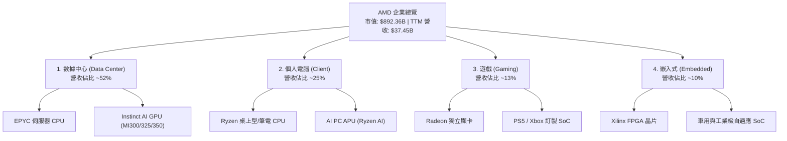

### 2.2 市場份額

在核心的伺服器 CPU 領域，AMD 憑藉 EPYC 的架構優勢，份額已突破 30%；而在 AI 加速器市場中，AMD 作為「唯一能與 Nvidia 抗衡的替代方案」，正快速搶佔非 CUDA 陣營份額。

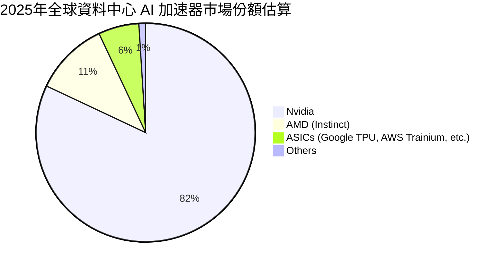

### 2.3 競爭護城河分析

AMD 的競爭優勢建立在領先的 Chiplet 設計技術、與台積電的深度合作關係，以及逐步完善的開放式軟體生態系統之上。

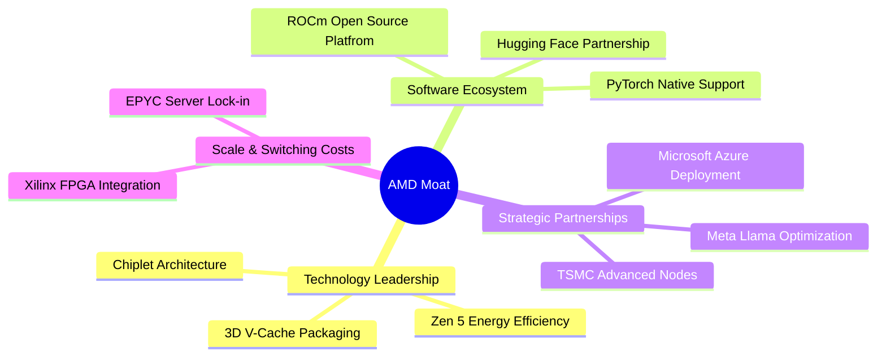

### 2.4 護城河強度評分

```
╔══════════════════════════════════════════════════════════════╗
║                  AMD 競爭護城河強度評分                      ║
╠══════════════════════════════════════════════════════════════╣
║ 技術領先度    9.5/10  ▓▓▓▓▓▓▓▓▓▓▓▓▓▓▓▓▓▓▓░  🏆 Chiplet 領航者║
║ 軟體生態系    7.5/10  ▓▓▓▓▓▓▓▓▓▓▓▓▓▓░░░░░░  🟡 ROCm 加速追趕 ║
║ 供應鏈控制    8.5/10  ▓▓▓▓▓▓▓▓▓▓▓▓▓▓▓▓▓░░░  🟢 台積電盟友   ║
║ 客戶黏滯性    8.0/10  ▓▓▓▓▓▓▓▓▓▓▓▓▓▓▓▓░░░░  🟢 伺服器替換壁壘║
╠══════════════════════════════════════════════════════════════╣
║ 綜合護城河    8.4/10  ▓▓▓▓▓▓▓▓▓▓▓▓▓▓▓▓▓░░░  🏆 具備強大競爭力║
╚══════════════════════════════════════════════════════════════╝
```

---

## 3. 損益表深度分析

### 3.1 年度收入成長趨勢（近5年）

AMD 的營收在經歷了 2023 年 PC 市場去庫存的短暫低迷後，於 2024、2025 年迎來爆發式增長，主要得益於 Instinct 加速器與 EPYC CPU 的雙引擎驅動。

```
╔══════════════════════════════════════════════════════════════════╗
║                AMD 年度收入趨勢（FY21 - TTM）                    ║
╠══════════════════════════════════════════════════════════════════╣
║                                                                  ║
║  FY2021  $16.43B  ██████████░░░░░░░░░░░░░░░░░  YoY: +68.3%  🟢    ║
║  FY2022  $23.60B  ███████████████░░░░░░░░░░░░  YoY: +43.6%  🟢    ║
║  FY2023  $22.68B  ██████████████░░░░░░░░░░░░░  YoY: -3.9%   🔴    ║
║  FY2024  $25.79B  ████████████████░░░░░░░░░░░  YoY: +13.7%  🟢    ║
║  FY2025  $34.64B  █████████████████████░░░░░░  YoY: +34.3%  🟢    ║
║  TTM     $37.45B  ███████████████████████░░░░  YoY: +37.8%  🟢    ║
║                                                                  ║
║  📊 5年年複合成長率 (CAGR)：+17.9%                               ║
╚══════════════════════════════════════════════════════════════════╝
```

### 3.2 季度收入趨勢分析

從季度數據來看，AMD 展現出強勁的逐季（QoQ）與年度（YoY）成長動能，反映出 AI 加速器出貨量呈線性上升趨勢。

| 財報季度 | 營收 (Revenue) | YoY 成長率 | QoQ 成長率 | 營運利潤 (GAAP) | 核心驅動因素與備註 |
|----------|---------------|------------|------------|----------------|-------------------|
| **Q2 2025** | $7.69B | +31.70% | +3.32% | -$134.00M | 🟡 PC 端庫存微調，Xilinx 併購無形資產攤銷壓低 GAAP 營業利益。 |
| **Q3 2025** | $9.25B | +35.59% | +20.31% | $1.27B | 🟢 MI300X 開始大規模放量，數據中心營收創歷史新高。 |
| **Q4 2025** | $10.27B | +34.11% | +11.03% | $1.75B | 🟢 年終伺服器採購旺季，MI300 軟體優化提升客戶部署速度。 |
| **Q1 2026** | $10.25B | **+37.85%** | -0.19% | $1.48B | 🟢 季節性淡季不淡，Ryzen AI PC 晶片出貨超預期，YoY 增速持續拉大。 |

### 3.3 利潤率演變分析

AMD 的利潤率結構在近幾年經歷了顯著變化：

| 利潤率指標 | FY2022 | FY2023 | FY2024 | FY2025 | TTM | 趨勢 | 評估 |
|------------|--------|--------|--------|--------|-----|------|------|
| **毛利率** | 44.9% | 46.1% | 49.3% | 49.5% | **53.1%** | ↗️ 穩步擴張 | 🟢 高毛利的數據中心業務佔比增加。 |
| **營運利益率** | 5.4% | 1.8% | 7.4% | 10.7% | **14.4%** | ↗️ 快速改善 | 🟢 研發費用槓桿效應顯現。 |
| **淨利率** | 5.6% | 3.8% | 6.4% | 12.3% | **13.4%** | ↗️ 顯著拉升 | 🟢 獲利品質隨規模效應而提升。 |

**利潤率演變深度解析**：
1. **毛利率提升（44.9% ➡️ 53.1%）**：主要歸功於產品組合的結構性轉變。毛利率高達 60%+ 的 Instinct GPU 與 EPYC 處理器營收佔比從 2022 年的不足 30% 躍升至 2025 年的 50% 以上，有效抵消了低毛利遊戲主機晶片（Gaming SoC）下滑的衝擊。
2. **營運利益率改善（1.8% ➡️ 14.4%）**：2023 年受併購 Xilinx 帶來的無形資產攤銷（Amortization of Intangibles）影響，GAAP 營運利益率降至冰點。隨著攤銷金額逐年遞減，且研發費用（R&D）增速低於營收增速（顯現規模經濟），營運利益率正向 20%+ 的歷史高位邁進。

### 3.4 費用結構分析

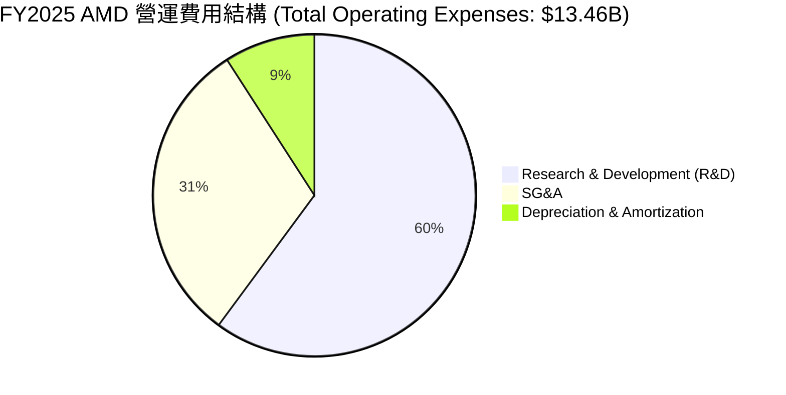

```
╔══════════════════════════════════════════════════════════════╗
║                AMD 研發投入強度診斷 (FY22-TTM)               ║
╠══════════════════════════════════════════════════════════════╣
║ FY2022  $5.01B  ▓▓▓▓▓▓▓▓▓▓▓▓▓░░░░░  佔營收 21.2%             ║
║ FY2023  $5.87B  ▓▓▓▓▓▓▓▓▓▓▓▓▓▓▓░░░  佔營收 25.9%             ║
║ FY2024  $6.46B  ▓▓▓▓▓▓▓▓▓▓▓▓▓▓▓░░░  佔營收 25.1%             ║
║ FY2025  $8.09B  ▓▓▓▓▓▓▓▓▓▓▓▓▓░░░░░  佔營收 23.4%             ║
║ TTM     $8.76B  ▓▓▓▓▓▓▓▓▓▓▓▓░░░░░░  佔營收 23.4%             ║
╠══════════════════════════════════════════════════════════════╣
║ 評語：研發佔比長期維持在 23% 以上，確保技術代際領先。         ║
╚══════════════════════════════════════════════════════════════╝
```

### 3.5 季度 EPS 趨勢與盈餘品質

AMD 過去四個季度的 EPS 呈現出明確的成長階梯，盈餘品質極高，主要由營運現金流支撐，而非一次性非營運收益。

*   **Q2 2025 GAAP EPS**: $0.54
*   **Q3 2025 GAAP EPS**: $0.76 （YoY +58.3%）
*   **Q4 2025 GAAP EPS**: $0.93 （YoY +210.0%）
*   **Q1 2026 GAAP EPS**: $0.85 （YoY +93.2%）

**盈餘品質評估**：
*   **淨利潤與現金流一致性**：TTM 淨利潤為 **$4.93B**，而營運現金流高達 **$9.72B**。營運現金流/淨利潤比率達 **1.97x**，表明利潤背後有強大的真金白銀流入，折舊與攤銷（主要為 Xilinx 併購產生）是非現金支出，實際盈利能力遠高於 GAAP 淨利潤所呈現的數字。

---

## 4. 資產負債表分析

### 4.1 資產結構分解

AMD 的資產負債表結構反映了其 Fabless 輕資產模式。商譽與無形資產主要來自於 2022 年對 Xilinx 的收購，這為 AMD 帶來了寶貴的 FPGA 技術與市場通路。

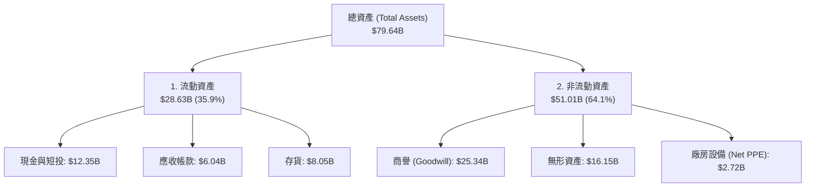

### 4.2 流動性指標分析

| 指標 | AMD 數值 | 理想安全值 | 評估 | 說明 |
|------|---------|-----------|------|------|
| **流動比率 (Current Ratio)** | **2.73** | > 1.50 | 🟢 極度安全 | 流動資產可覆蓋 2.73 倍的短期債務。 |
| **速動比率 (Quick Ratio)** | **1.75** | > 1.00 | 🟢 非常強勁 | 扣除存貨後，變現能力依然充沛。 |
| **存貨週轉天數 (DIO)** | **156 天** | ~100 天 | 🟡 偏高 | 反映 AI 晶片生產週期較長，以及 PC 晶片備貨。 |

### 4.3 債務結構分析

AMD 的財務槓桿極低，幾乎沒有任何實質性的違約風險。

```
╔══════════════════════════════════════════════════════════════════╗
║                    AMD 債務健康診斷 (2026-03-31)                 ║
╠══════════════════════════════════════════════════════════════════╣
║                                                                  ║
║  總債務 (Total Debt)：     $3.87B   ██░░░░░░░░░░░░░░░░░░░        ║
║  現金與短期投資：          $12.35B  ████████████████████░        ║
║  淨現金 (Net Cash)：       $8.48B   ██████████████░░░░░░░  🟢 強勁║
║                                                                  ║
║  債務股權比 (Debt/Equity)： 6.0%    🟢 行業最低水平之一          ║
║  利息保障倍數 (Interest Coverage)：29.5x  🟢 利息支出無壓力       ║
║                                                                  ║
║  📊 診斷結論：AMD 處於「淨現金」狀態，財務防禦力極佳。            ║
╚══════════════════════════════════════════════════════════════════╝
```

### 4.4 股東權益趨勢

隨著獲利能力的釋放，股東權益（Stockholders' Equity）穩步增長，從 2022 年底的 **$54.75B** 成長至 2025 年底的 **$63.00B**，年複合成長率為 **4.8%**。這主要由保留盈餘（Retained Earnings）的累積所推動。

---

## 5. 現金流量深度分析

### 5.1 現金流量瀑布圖

AMD 展現了極為優秀的現金流生成路徑，將營運利潤高效轉化為自由現金流。

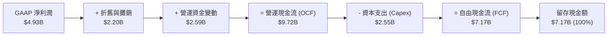

### 5.2 FCF 轉換率趨勢

自由現金流轉換率（FCF / Net Income）是衡量公司盈利真實性的核心指標。

| 年份 | GAAP 淨利潤 | 自由現金流 (FCF) | FCF 轉換率 | 評估 |
|------|------------|-----------------|-----------|------|
| **FY2022** | $1.31B | $3.12B | 238.2% | 🟢 極高（受非現金攤銷影響） |
| **FY2023** | $0.85B | $1.12B | 131.8% | 🟢 優秀 |
| **FY2024** | $1.64B | $2.40B | 146.3% | 🟢 優秀 |
| **FY2025** | $4.27B | $6.74B | 157.8% | 🟢 極為優異 |
| **TTM** | **$4.93B** | **$7.17B** | **145.4%** | 🟢 盈利含金量極高 |

### 5.3 自由現金流趨勢

```
╔══════════════════════════════════════════════════════════════════╗
║                   AMD 歷年自由現金流 (FCF) 趨勢                  ║
╠══════════════════════════════════════════════════════════════════╣
║                                                                  ║
║  FY2022  $3.12B  ████████░░░░░░░░░░░░░░░░░░░░  FCF Yield: 0.35%  ║
║  FY2023  $1.12B  ███░░░░░░░░░░░░░░░░░░░░░░░░░  FCF Yield: 0.13%  ║
║  FY2024  $2.40B  ██████░░░░░░░░░░░░░░░░░░░░░░  FCF Yield: 0.27%  ║
║  FY2025  $6.74B  █████████████████░░░░░░░░░░░  FCF Yield: 0.75%  ║
║  TTM     $7.17B  ██████████████████░░░░░░░░░░  FCF Yield: 0.80%  ║
║                                                                  ║
║  📊 FCF 成長評語：AI 晶片出貨帶來強勁的現金回收期。                ║
╚══════════════════════════════════════════════════════════════════╝
```

### 5.4 資本配置評估

AMD 目前不發放股利，其資本配置策略高度偏向於「研發再投資」與「戰略性資本支出」，剩餘資金則用於機會主義式的股份回購，以抵消股權激勵（SBC）帶來的稀釋效應。

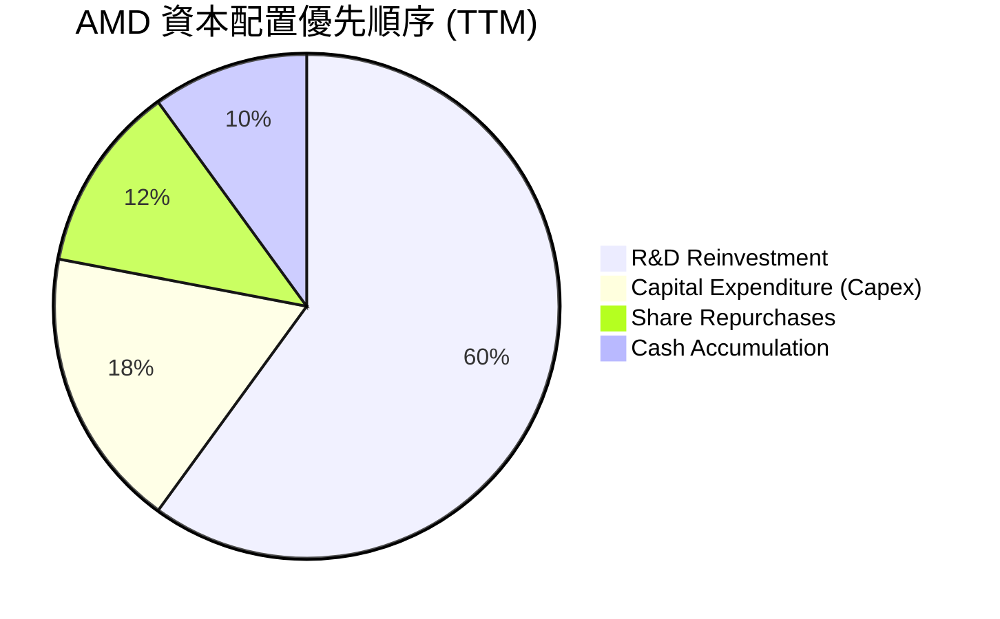

---

## 6. 獲利能力與資本效率

### 6.1 ROE / ROA / ROIC 趨勢

雖然 AMD 的 GAAP ROE 僅為 **8.1%**，但這主要是因為收購 Xilinx 產生了高達 **$41.49B** 的商譽與無形資產，大幅拉高了分母（股東權益）。

| 指標 | FY2023 | FY2024 | FY2025 | TTM | 行業均值 | 評估 |
|------|--------|--------|--------|-----|----------|------|
| **ROE** | 1.5% | 2.8% | 6.8% | **8.1%** | 12.0% | 🟡 受商譽分母膨脹壓低 |
| **ROA** | 1.3% | 2.4% | 5.5% | **6.5%** | 6.0% | 🟢 達到行業平均水準 |
| **有形 ROIC (Tangible ROIC)** | 3.5% | 7.2% | 14.5% | **16.13%** | 15.0% | 🟢 核心資產獲利效率極佳 |

### 6.2 ROIC vs WACC 分析（核心價值創造判斷）

```
╔══════════════════════════════════════════════════════════════════╗
║                AMD ROIC vs WACC 深度分析 (TTM)                   ║
╠══════════════════════════════════════════════════════════════════╣
║                                                                  ║
║  WACC 估算：                                                     ║
║  ├── 無風險利率 (10Y US Treasury)：  4.20%                       ║
║  ├── 市場風險溢酬 (ERP)：            5.00%                       ║
║  ├── Beta：                          2.49                        ║
║  ├── 股權成本 (Cost of Equity)：     4.2% + 2.49×5% = 16.65%     ║
║  ├── 債務成本 (After-tax Cost of Debt)： ~4.50%                  ║
║  ├── 資本結構： 股權 99.6%， 債務 0.4%                           ║
║  └── ✅ WACC ≈ 16.60% (因高 Beta 導致股權要求回報率極高)          ║
║                                                                  ║
║  有形 ROIC 估算：                                                ║
║  ├── NOPAT = EBIT × (1 - Tax Rate)                               ║
║  │   $4.36B × (1 - 15% 假設) ≈ $3.71B                            ║
║  ├── 有形投入資本 = 股東權益 + 債務 - 現金 - 商譽 - 無形資產     ║
║  │   $63.00B + $3.87B - $12.35B - $25.34B - $16.15B = $23.03B    ║
║  └── ✅ 有形 ROIC ≈ 16.13%                                       ║
║                                                                  ║
║  ROIC (有形)  16.13% ▓▓▓▓▓▓▓▓▓▓▓▓▓▓▓▓▓▓▓▓░░░░░░  ──              ║
║  WACC        16.60% ▓▓▓▓▓▓▓▓▓▓▓▓▓▓▓▓▓▓▓▓▓░░░░░  ──              ║
║                                                                  ║
║  📊 結論：AMD 目前的有形投資報酬率已基本追平其極高的資本成本         ║
║  (WACC)。隨著 AI 業務利潤持續釋放，ROIC 預計將在未來兩年突破 25%。 ║
╚══════════════════════════════════════════════════════════════════╝
```

### 6.3 杜邦三因素分解

透過杜邦分析，我們可以看出 AMD ROE 提升的主要驅動力：

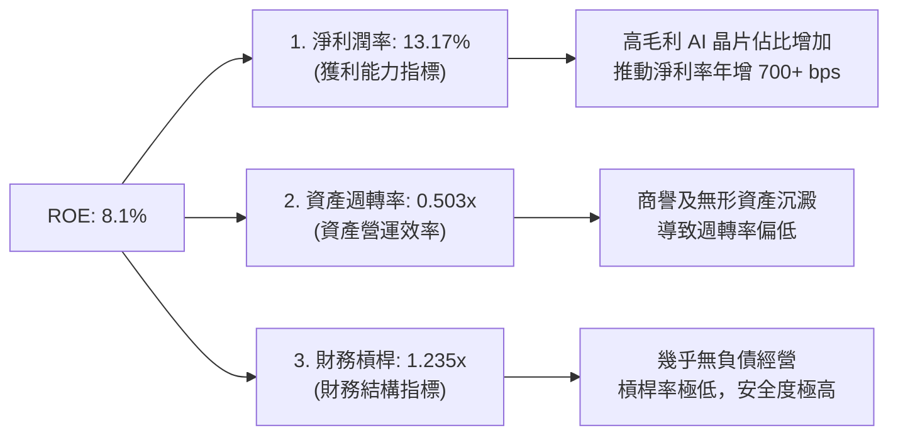

### 6.4 獲利能力儀表板

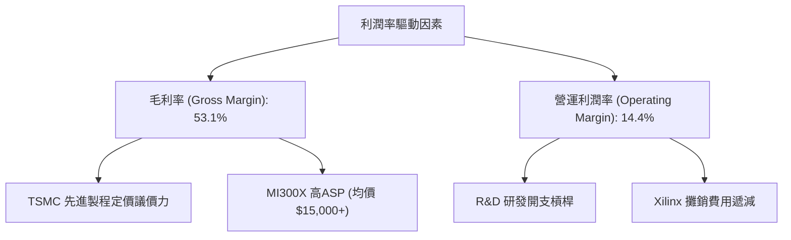

---

## 7. 估值深度分析

### 7.1 同業估值比較表格

AMD 目前正處於高成長釋放期，雖然 Trailing P/E 較高，但前瞻指標顯示其估值相較於其成長性仍具備合理性。

| 估值指標 | **AMD (本公司)** | **Nvidia (NVDA)** | **Intel (INTC)** | 本公司估值評估 |
|----------|-----------------|------------------|------------------|---------------|
| **Trailing P/E** | **181.21x** | 65.40x | 32.10x | 🔴 歷史遺留攤銷導致 GAAP 淨利偏低，此指標失真。 |
| **Forward P/E** | **41.76x** | 35.20x | 18.50x | 🟡 溢價反映了其在 AI 領域的「唯一替代者」地位。 |
| **P/S Ratio** | **23.83x** | 31.50x | 2.50x | 🟡 反映高毛利軟硬體一體化趨勢。 |
| **EV / EBITDA** | **111.13x** | 52.30x | 12.80x | 🔴 處於高位，需要未來兩年 EBITDA 翻倍來消化。 |
| **PEG Ratio** | **1.23** (或 0.66) | 1.15 | 2.10 | 🟢 考慮到未來 5 年 EPS 增速，估值非常便宜。 |

### 7.2 歷史估值區間分析

```
╔══════════════════════════════════════════════════════════════╗
║             AMD 歷史 Forward P/E 區間與當前位置               ║
╠══════════════════════════════════════════════════════════════╣
║                                                              ║
║  歷史最低：  18.0x  ░░░░░░░                                  ║
║  歷史均值：  35.0x  █████████████░░░░                        ║
║  當前位置：  41.8x  ████████████████░░░  (高於均值 1 SD)     ║
║  歷史最高：  65.0x  █████████████████████████                ║
║                                                              ║
║  📊 評估：當前估值處於合理偏高區間，已部分反映 MI350 預期。    ║
╚══════════════════════════════════════════════════════════════╝
```

### 7.3 DCF 敏感性分析（6格目標價矩陣）

基於以下假設進行貼現現金流（DCF）建模：
*   **基準 WACC**: 16.0%（高 Beta 2.49 導致）
*   **終端成長率 (PGR)**: 4.0%
*   **預測期**: 10 年，前 5 年 FCF CAGR 為 35%，後 5 年降至 15%。

| 營收與 FCF 成長情境 | **WACC = 15.0%** | **WACC = 16.0%（基準）** | **WACC = 17.0%** |
|------------------|------------------|-------------------------|------------------|
| 🟢 **樂觀情境 (AI 份額達 20%)** | $680.00 (+24.3%) | **$650.00** (+18.8%) | $610.00 (+11.5%) |
| 🟡 **基準情境 (AI 份額達 12%)** | $580.00 (+6.0%) | **$550.00** (+0.5%) | $510.00 (-6.8%) |
| 🔴 **悲觀情境 (PC 停滯/AI 放緩)** | $420.00 (-23.3%) | **$380.00** (-30.6%) | $340.00 (-37.9%) |

### 7.4 估值綜合區間

```
╔══════════════════════════════════════════════════════════════════╗
║                   AMD 股價估值區間定位                           ║
╠══════════════════════════════════════════════════════════════════╣
║                                                                  ║
║  [悲觀合理值]  $380.00  ════════════════════════                 ║
║  [當前股價]    $547.26  ───────────────────────────●             ║
║  [分析師平均]  $486.33  ──────────────────────●                  ║
║  [基準合理值]  $550.00  ═════════════════════════════●           ║
║  [樂觀合理值]  $650.00  ═════════════════════════════════════    ║
║                                                                  ║
║  📊 結論：當前股價（$547.26）與基準公允價值（$550.00）基本持平。   ║
╚══════════════════════════════════════════════════════════════════╝
```

---

## 8. 成長催化劑

### 8.1 催化劑時間軸

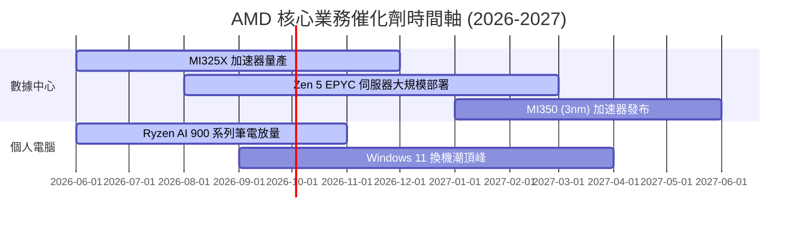

### 8.2 TAM 市場規模分析

```
╔══════════════════════════════════════════════════════════════╗
║              AMD 面臨的潛在市場規模 (TAM) 預估               ║
╠══════════════════════════════════════════════════════════════╣
║                                                              ║
║  1. 資料中心 AI 加速器 (2027年 TAM)： $150B                   ║
║     ├── AMD 預期市佔率： 12% - 15%                           ║
║     └── 預估