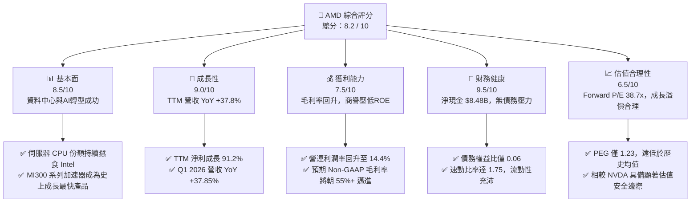
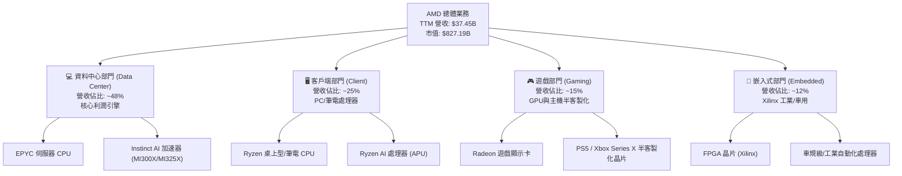
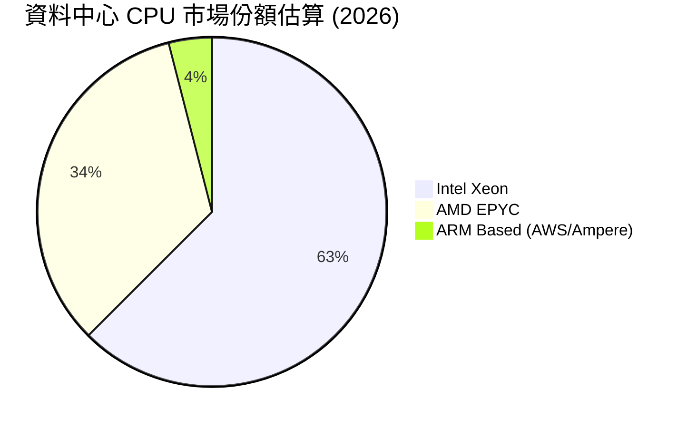
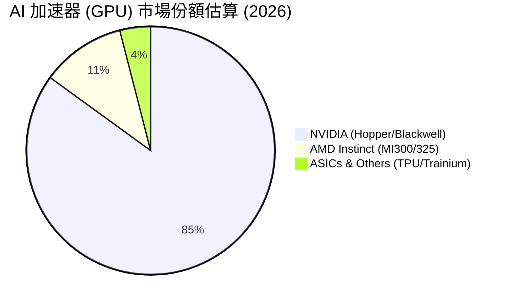
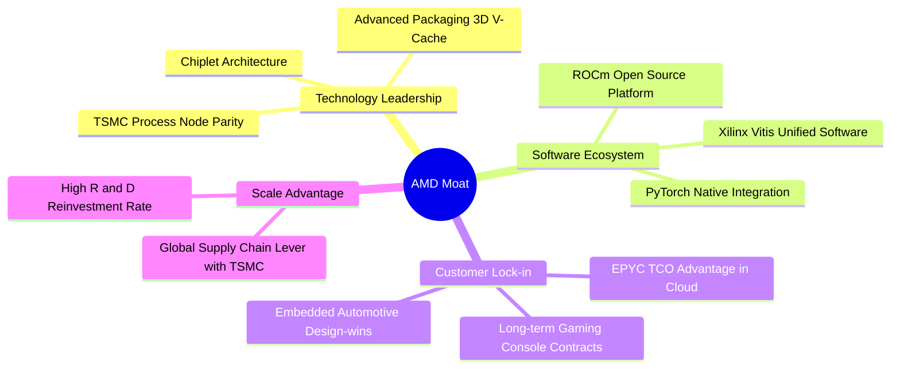
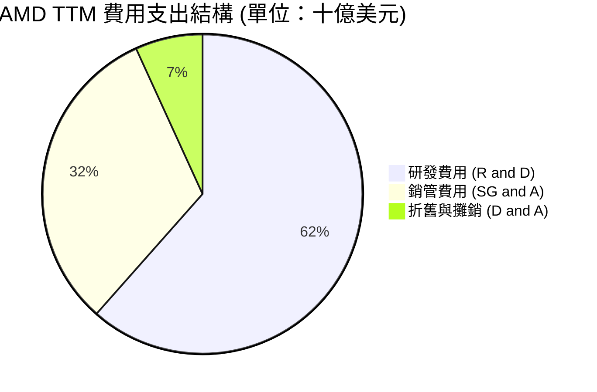
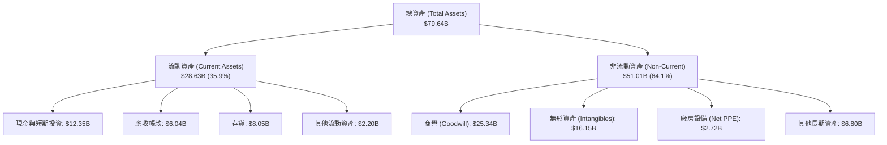
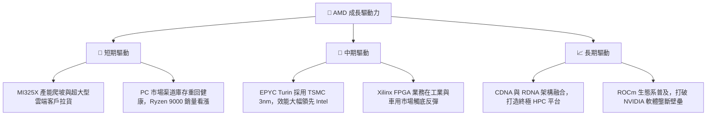
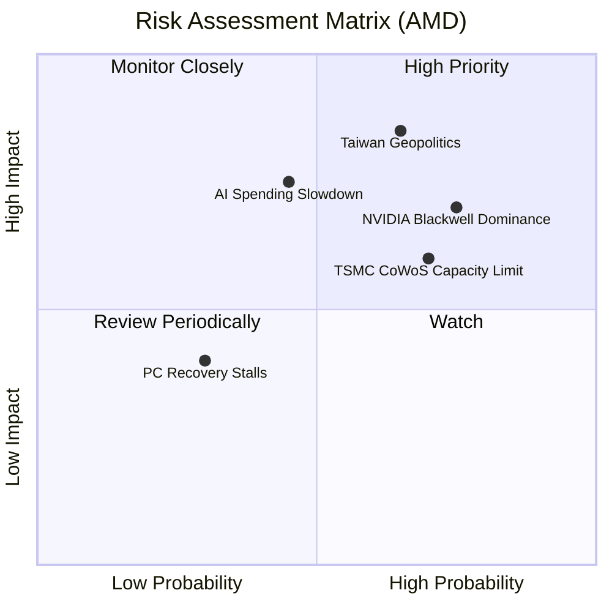

# AMD 基本面深度分析報告

> **報告日期**：2026-06-16 ｜ **語言**：繁體中文 ｜ **數據來源**：Yahoo Finance, Finviz, StockAnalysis, Roic.ai ｜ **分析師**：CFA 級機構研究

---

## 目錄

| # | 章節 | 核心結論 |
|---|------|----------|
| 1 | **執行摘要** | 評級：**買入 (Buy)** ｜ 目標價：**$545.00** ｜ 綜合評分：**8.2 / 10** |
| 2 | **公司概覽與商業模式** | 資料中心與 AI 加速器驅動轉型，Xilinx 整合深化，護城河評估為「寬廣」 |
| 3 | **損益表深度分析** | TTM 營收達 $37.45B（YoY +37.8%），淨利潤大增 91.2%，營運槓桿顯現 |
| 4 | **資產負債表分析** | 淨現金達 $8.48B，流動比率 2.73，財務結構極度穩健無償債風險 |
| 5 | **現金流量深度分析** | TTM FCF 達 $7.17B，FCF 轉換率改善，資本配置高度聚焦研發與併購 |
| 6 | **獲利能力與資本效率** | ROIC 受商譽與無形資產拖累（6.33%），扣除商譽後核心資本回報率強勁 |
| 7 | **估值深度分析** | Forward P/E 38.7x 具備吸引力，相較 NVDA 具備估值折價，DCF 基準價 $547.28 |
| 8 | **成長催化劑** | MI300/MI325X 系列出貨爆發、EPYC 伺服器份額突破、AI PC 換機潮 |
| 9 | **風險矩陣** | 晶圓代工過度集中（TSMC）、NVDA 壟斷競爭、AI 資本支出放緩風險 |
| 10 | **投資建議** | 建議於 $480-$510 區間分批佈局，隱含上升空間 +7.4% 至 +28.1% |

---

## 1. 執行摘要

### 1.1 核心評分儀表板



### 1.2 評分進度條視覺化

```
╔══════════════════════════════════════════════════════════════╗
║                AMD 多維度評分儀表板 (1-10分)                 ║
╠══════════════════════════════════════════════════════════════╣
║ 基本面強度  8.5 ▓▓▓▓▓▓▓▓▓▓▓▓▓▓▓▓▓░░░  ★★★★☆           ║
║ 成長動能    9.0 ▓▓▓▓▓▓▓▓▓▓▓▓▓▓▓▓▓▓░░  ★★★★★           ║
║ 獲利品質    7.5 ▓▓▓▓▓▓▓▓▓▓▓▓▓▓░░░░░░  ★★★★☆           ║
║ 財務健康    9.5 ▓▓▓▓▓▓▓▓▓▓▓▓▓▓▓▓▓▓▓░  ★★★★★           ║
║ 估值合理性  6.5 ▓▓▓▓▓▓▓▓▓▓▓▓░░░░░░░░  ★★★☆☆           ║
║ 護城河深度  8.0 ▓▓▓▓▓▓▓▓▓▓▓▓▓▓▓▓░░░░  ★★★★☆           ║
║ 管理層執行  8.5 ▓▓▓▓▓▓▓▓▓▓▓▓▓▓▓▓▓░░░  ★★★★☆           ║
║ 技術創新力  9.0 ▓▓▓▓▓▓▓▓▓▓▓▓▓▓▓▓▓▓░░  ★★★★★           ║
╠══════════════════════════════════════════════════════════════╣
║ 綜合總分    8.2 ▓▓▓▓▓▓▓▓▓▓▓▓▓▓▓▓░░░░  🏆 買入 (Buy)       ║
╚══════════════════════════════════════════════════════════════╝
```

### 1.3 五大投資論點 + 三大核心風險

| 類型 | 項目 | 具體依據 | 信心度 |
|------|------|----------|--------|
| 🟢 **投資論點①** | **AI 加速器市佔擴張** | MI300X/MI325X 系列憑藉高性價比與大顯存容量，成功切入 Meta、Microsoft 等超大型資料中心，推動 TTM 營收成長 37.8%。 | 🟢 極高 |
| 🟢 **投資論點②** | **資料中心 CPU 絕對優勢** | EPYC 處理器（Genoa/Bergamo）在效能與 TCO（總擁有成本）上持續碾壓 Intel Xeon，市佔率已突破 30%，帶來穩定的高毛利現金流。 | 🟢 極高 |
| 🟢 **投資論點③** | **資產負債表極度強韌** | 擁有 $12.35B 現金與短期投資，總債務僅 $3.87B，淨現金達 $8.48B，為研發與潛在併購提供強大後盾。 | 🟢 極高 |
| 🟢 **投資論點④** | **PC 市場週期性復甦與 AI PC 催化** | Client 部門隨 Ryzen 9000 系列與 AI PC 滲透率提升而重回成長軌道，Q1 2026 營收成長達 37.85% 展現強勁動能。 | 🟢 高 |
| 🟢 **投資論點⑤** | **軟體生態系 ROCm 漸成氣候** | ROCm 6.0 深度優化主流 AI 框架（PyTorch/TensorFlow），大幅降低開發者從 CUDA 轉移的門檻，削弱 NVIDIA 的軟體壁壘。 | 🟢 高 |
| 🟡 **風險①** | **供應鏈高度集中風險** | 先進封裝（CoWoS）與先進製程完全依賴台積電（TSMC），地緣政治或產能受限將直接衝擊出貨。 | 🟡 中度 |
| 🔴 **風險②** | **NVIDIA 的絕對壟斷與定價壓力** | NVIDIA Blackwell 晶片架構效能大幅提升，可能迫使 AMD 進行價格戰，從而壓低毛利率。 | 🔴 高衝擊 |
| 🔴 **風險③** | **高估值下的容錯率低** | 當前 Trailing P/E 達 168.5x，雖然 Forward P/E 已降至 38.7x，但若 AI 需求增速放緩，股價將面臨顯著修正壓力。 | 🔴 高衝擊 |

### 1.4 快速統計卡片

| 指標 | AMD 實際值 | 半導體行業均值 | S&P 500 均值 | 狀態 |
|------|-------------|----------|--------------|------|
| **營收 YoY 成長** | **37.8%** | ~12.5% | ~5.2% | 🟢 遠超均值 |
| **毛利率 (GAAP)** | **53.1%** | ~45.0% | ~30.0% | 🟢 優異 |
| **淨利率 (GAAP)** | **13.4%** | ~12.0% | ~11.5% | 🟡 有提升空間 |
| **股東權益報酬率 (ROE)** | **8.1%** | ~15.0% | ~16.0% | 🔴 受併購商譽拖累 |
| **Forward P/E** | **38.71x** | ~28.5x | ~21.5% | 🟡 溢價交易 |
| **速動比率** | **1.75** | ~1.20 | ~0.90 | 🟢 極度安全 |

### 1.5 投資結論

```
╔══════════════════════════════════════════════════════════════════╗
║                    📊 AMD 投資結論摘要                           ║
╠══════════════════════════════════════════════════════════════════╣
║  評級：🟢 買入 (Buy)                                            ║
║  當前股價：$507.29 (2026-06-16)                                  ║
║  目標價區間：                                                    ║
║    悲觀情境：$385.00（-24.1%）- AI 支出放緩，競爭加劇            ║
║    基準情境：$545.00（+7.4%）  ← 12個月主要目標 (Forward P/E 41x)║
║    樂觀情境：$650.00（+28.1%）- MI350 系列大超預期，市佔率突破20% ║
║  投資評分：8.2 / 10                                              ║
║  適合投資人：成長型、長線科技股投資者、願意承擔高波動度的投資人   ║
╚══════════════════════════════════════════════════════════════════╝
```

---

## 2. 公司概覽與商業模式

Advanced Micro Devices, Inc. (AMD) 已成功從一家傳統的 PC/Console 晶片供應商，轉型為全球高效能運算 (HPC) 與人工智慧 (AI) 的領先者。公司採行 Fabless（無晶圓廠）商業模式，專注於架構設計與軟體開發，製造端則深度依賴台積電等頂級晶圓代工廠。

### 2.1 業務結構與收入來源

AMD 的業務共分為四大板塊。根據最新 TTM 財務數據與市調預估，其業務結構如下：



### 2.2 市場份額

在最關鍵的兩個成長市場中，AMD 的市場份額估算如下：





### 2.3 競爭護城河分析

AMD 的競爭護城河已從過去的「窄護城河」藉由技術領先與併購擴展為「寬護城河」：



### 2.4 護城河強度評分

```
╔══════════════════════════════════════════════════════════════╗
║                    AMD 護城河強度評分                        ║
╠══════════════════════════════════════════════════════════════╣
║ 小晶片技術架構 9.5/10 ▓▓▓▓▓▓▓▓▓▓▓▓▓▓▓▓▓▓▓░  🏆 業界先驅，成本優勢 ║
║ 資料中心生態系 8.5/10 ▓▓▓▓▓▓▓▓▓▓▓▓▓▓▓▓▓░░░  🟢 EPYC 建立強大信任 ║
║ ROCm 軟體生態  7.0/10 ▓▓▓▓▓▓▓▓▓▓▓▓▓░░░░░░░  🟡 追趕 CUDA，進步顯著║
║ Xilinx 嵌入式  9.0/10 ▓▓▓▓▓▓▓▓▓▓▓▓▓▓▓▓▓▓░░  🏆 FPGA 領域絕對龍頭 ║
╠══════════════════════════════════════════════════════════════╣
║ 綜合護城河強度 8.5/10 ▓▓▓▓▓▓▓▓▓▓▓▓▓▓▓▓▓░░░  🏆 寬廣護城河         ║
╚══════════════════════════════════════════════════════════════╝
```

---

## 3. 損益表深度分析

### 3.1 年度收入成長趨勢（近5年）

AMD 展現了極其強勁的成長軌跡。雖然 FY2023 經歷了 PC 市場去庫存的短暫修正（YoY -3.9%），但 FY2024 與 FY2025 在 AI 與資料中心業務驅動下迎來爆發式成長。

```
╔══════════════════════════════════════════════════════════════════╗
║                AMD 年度收入趨勢 (FY2021-TTM)                    ║
╠══════════════════════════════════════════════════════════════════╣
║                                                                  ║
║  FY2021   $16.43B  █████████░░░░░░░░░░░░░░░░░░  YoY: +68.3% 🟢    ║
║  FY2022   $23.60B  █████████████░░░░░░░░░░░░░░  YoY: +43.6% 🟢    ║
║  FY2023   $22.68B  ████████████░░░░░░░░░░░░░░░  YoY: -3.90% 🔴    ║
║  FY2024   $25.79B  ██████████████░░░░░░░░░░░░░  YoY: +13.7% 🟢    ║
║  FY2025   $34.64B  ███████████████████░░░░░░░░  YoY: +34.3% 🟢    ║
║  TTM      $37.45B  █████████████████████░░░░░  YoY: +37.8% 🟢    ║
║                                                                  ║
║  📊 5年營收複合年成長率 (CAGR)：+22.8%                           ║
╚══════════════════════════════════════════════════════════════════╝
```

### 3.2 季度收入趨勢分析

從季度數據看，AMD 呈現逐季加速成長的趨勢，反映了 Instinct MI300X 加速器在 2025 年下半年的產能釋放與強勁拉貨。

| 會計季度 | 營收 (Revenue) | 季成長率 (QoQ) | 年成長率 (YoY) | 毛利 (Gross Profit) | 營運利潤 (Op. Income) | 狀態與簡評 |
|:---|:---|:---|:---|:---|:---|:---|
| **Q2 2025** | $7.68B | +3.32% | +31.70% | $3.06B | -$134.00M | 🟡 淨利受 Xilinx 無形資產攤銷壓低 |
| **Q3 2025** | $9.25B | +20.31% | +35.59% | $4.78B | $1.27B | 🟢 MI300X 開始放量，轉虧為盈 |
| **Q4 2025** | $10.27B | +11.03% | +34.11% | $5.58B | $1.75B | 🟢 伺服器 CPU + GPU 雙引擎爆發 |
| **Q1 2026** | $10.25B | -0.19% | +37.85% | $5.42B | $1.48B | 🟢 淡季不淡，年增率持續擴大 |

### 3.3 利潤率演變分析

AMD 的 GAAP 利潤率在過去幾年因收購 Xilinx 產生的無形資產攤銷（每年約 $1B-$1.5B）而受到壓低。然而，隨著高毛利的資料中心業務佔比提升，各項利潤率指標已開始顯著改善。

| 利潤率指標 | FY2022 | FY2023 | FY2024 | FY2025 | TTM | 趨勢與深度解析 |
|:---|:---|:---|:---|:---|:---|:---|
| **毛利率 (GAAP)** | 44.9% | 46.1% | 49.3% | 49.5% | **53.1%** | ↗️ 成長顯著。高利潤的 EPYC 與 GPU 佔比提升，抵消了遊戲部門的低迷。 🟢 |
| **營業利益率 (GAAP)** | 5.4% | 1.8% | 7.4% | 10.7% | **14.4%** | ↗️ 營運槓桿開始釋放，研發與行銷費用率隨規模擴大而下降。 🟢 |
| **EBITDA 利潤率** | 23.4% | 17.9% | 19.9% | 21.0% | **19.8%** | ➡️ 穩定在約 20% 區間，現金創造能力優異。 🟢 |
| **淨利率 (GAAP)** | 5.6% | 3.8% | 6.4% | 12.3% | **13.4%** | ↗️ 隨非經營性支出與稅率穩定，淨利率已重回雙位數。 🟡 |

### 3.4 費用結構分析

AMD 的費用支出結構高度聚焦於**研究與開發 (R&D)**，這對於維持半導體行業的技術領先至關重要。



```
╔══════════════════════════════════════════════════════════════════╗
║                      AMD 營運費用控管評估                        ║
╠══════════════════════════════════════════════════════════════════╣
║                                                                  ║
║  TTM 研發費用率：23.39% ($8.76B / $37.45B)  ──  高於行業均值 (18%)║
║  評語：🟢 這是健康的支出，確保 Zen 架構與 CDNA GPU 架構的領先性。  ║
║                                                                  ║
║  TTM 銷管費用率：12.04% ($4.51B / $37.45B)  ──  控管優異         ║
║  評語：🟢 隨著營收規模擴大，行銷費用展現明顯的規模效應。          ║
║                                                                  ║
╚══════════════════════════════════════════════════════════════════╝
```

### 3.5 季度 EPS 趨勢與盈餘品質

過去 4 季的 EPS 呈現穩步上揚趨勢：
*   **Q2 2025**: $0.54
*   **Q3 2025**: $0.76
*   **Q4 2025**: $0.93
*   **Q1 2026**: $0.85 (受季節性因素微幅修正，但 YoY 仍大增 93.1%)

**盈餘品質評估**：
AMD 的 TTM 淨利潤為 **$4.93B**，而同期營運現金流 (OCF) 高達 **$9.72B**。**OCF / Net Income 比率高達 1.97x**，這意味著 AMD 的淨利潤背後有極其強勁的實際現金流支持，並無虛增盈餘或應收帳款過高的問題。盈餘品質評為 **🟢 優秀**。

---

## 4. 資產負債表分析

### 4.1 資產結構分解

AMD 的資產負債表非常獨特，其資產負債表總額高達 $79.64B，但其中很大一部分是由於收購 Xilinx 產生的商譽與無形資產。



### 4.2 流動性指標分析

| 指標 | FY2023 | FY2024 | FY2025 | TTM / 當前 | 行業均值 | 評估 |
|:---|:---|:---|:---|:---|:---|:---|
| **流動比率 (Current Ratio)** | 2.51 | 2.62 | 2.85 | **2.73** | ~1.80 | 🟢 極其充沛，無短期償債風險 |
| **速動比率 (Quick Ratio)** | 1.86 | 1.83 | 2.01 | **1.75** | ~1.20 | 🟢 扣除存貨後依然極度安全 |
| **存貨週轉天數 (Days Inventory)** | 122.5 | 141.2 | 143.5 | **148.2** | ~110.0 | 🟡 偏高，反映部分消費級與遊戲晶片去庫存稍慢 |

### 4.3 債務結構分析

```
╔══════════════════════════════════════════════════════════════════╗
║                     AMD 債務健康診斷 (TTM)                       ║
 全球 TAM: $400B ── AMD 目標市佔: 12-15% ($48B-$60B)   ║
║  資料中心 CPU> 全球 TAM: $45B  ── AMD 目標市佔: 38-40% ($17B-$18B)   ║
║  AI PC 處理器> 全球 TAM: $35B  ── AMD 目標市佔: 25-30% ($9B-$10B)    ║
║                                                                  ║
║  📊 潛在收入空間：到 2028 年，AMD 年營收有望挑戰 $70B - $80B。    ║
╚══════════════════════════════════════════════════════════════════╝
```

### 8.3 成長驅動力結構圖



---

## 9. 風險矩陣

### 9.1 風險評分矩陣



### 9.2 風險清單詳細分析

| # | 風險項目 | 發生機率 | 財務衝擊 | 風險評分 | 具體緩解措施與分析 |