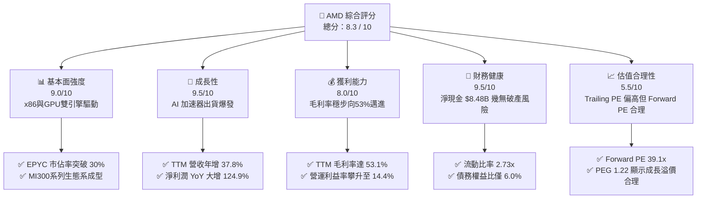
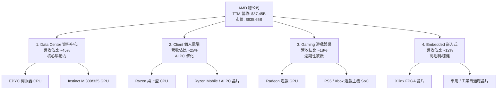
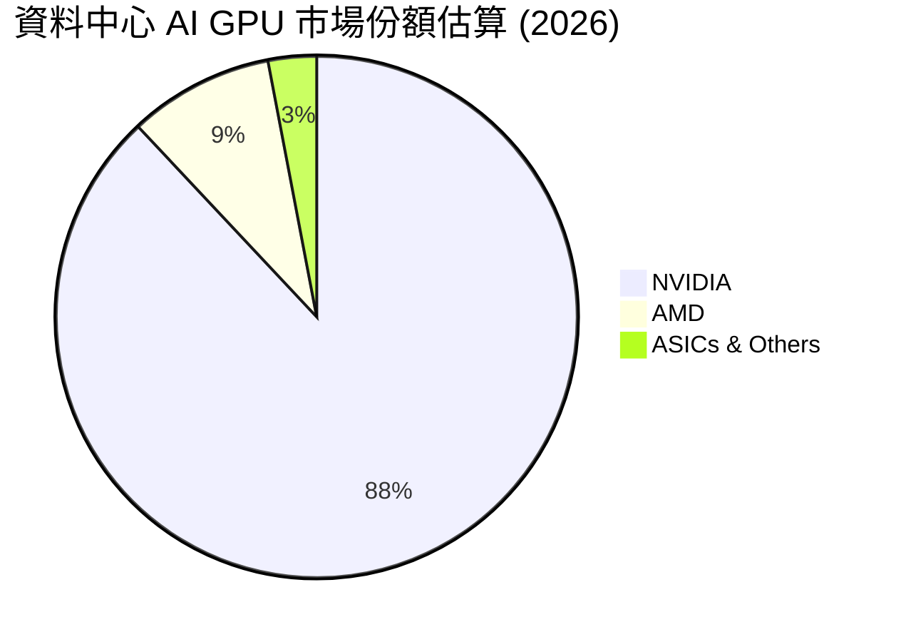
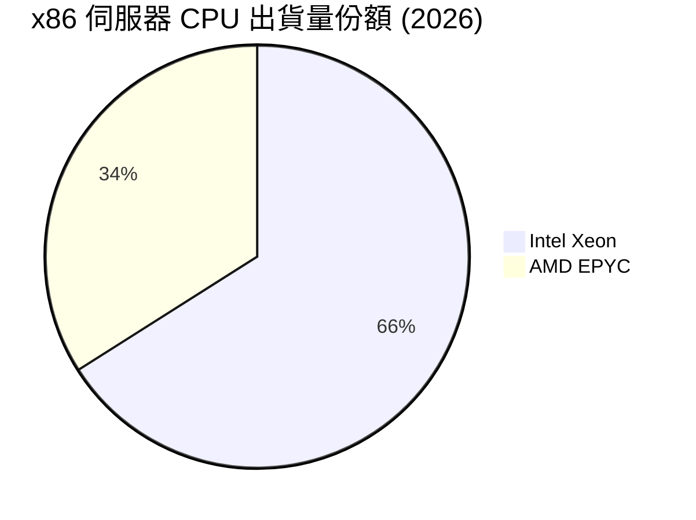
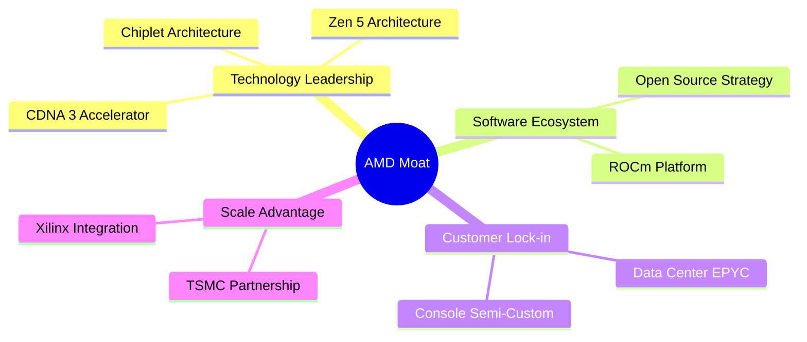
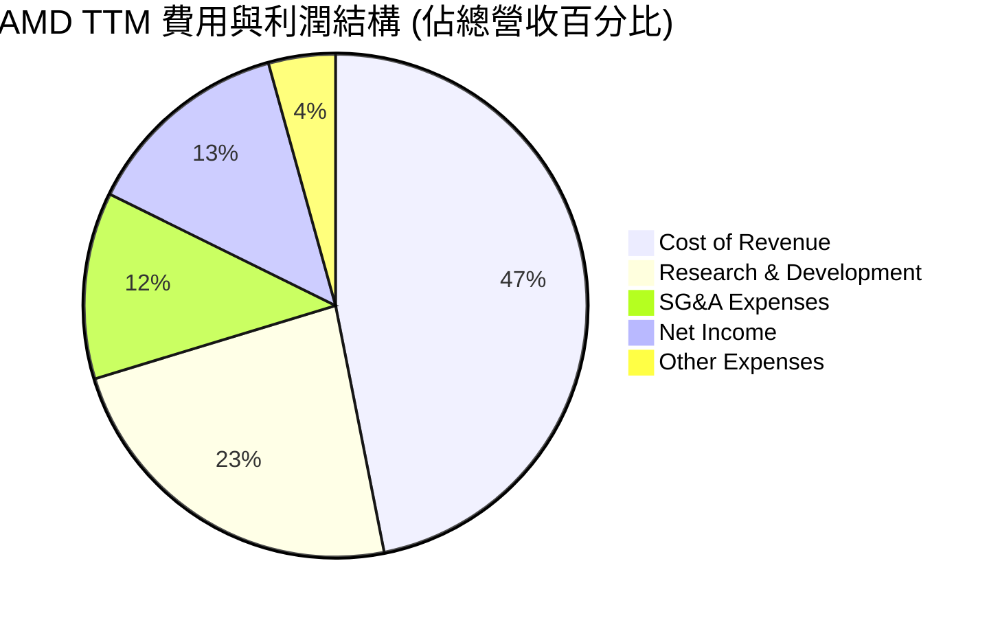
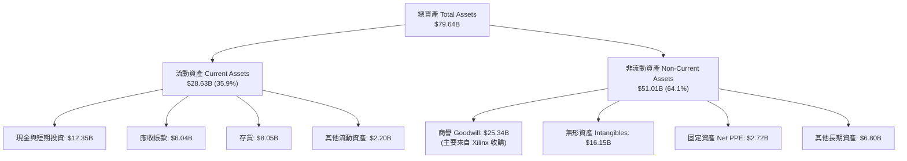
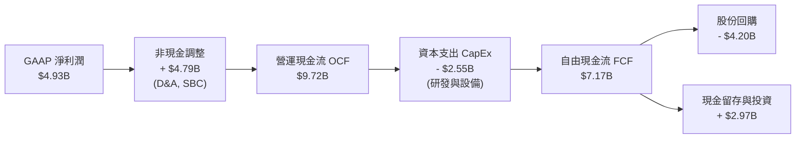
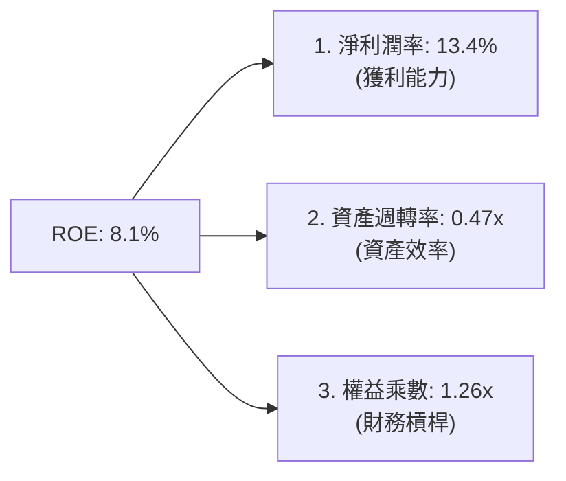
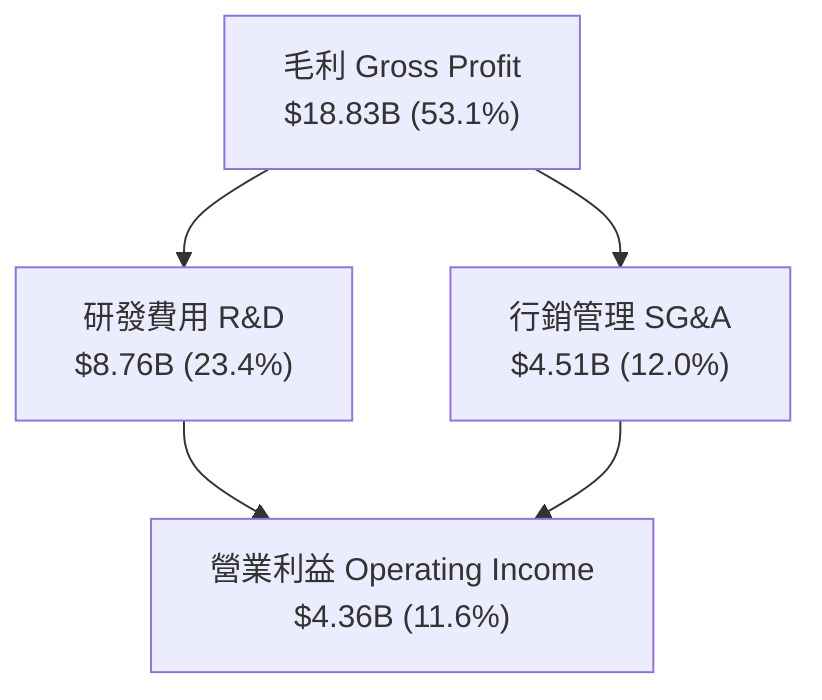

# AMD 基本面深度分析報告

> **報告日期**：2026-06-17  
> **語言**：繁體中文  
> **數據來源**：Yahoo Finance, Finviz, StockAnalysis, Roic.ai  
> **分析師**：CFA 級機構研究  

---

## 目錄

| # | 章節 | 核心結論 |
|---|---|---|
| 1 | **執行摘要** | 評級「買入」，基準目標價 **$550.00**，隱含 7.3% 上行空間，長線看好 AI 晶片爆發 |
| 2 | **公司概覽與商業模式** | 憑藉 Chiplet 技術與 Xilinx 整合，構築 CPU+GPU+FPGA 三位一體護城河 |
| 3 | **損益表深度分析** | TTM 營收達 $37.45B（YoY +37.8%），淨利潤大增 124.9%，營運槓桿效應顯著 |
| 4 | **資產負債表分析** | 淨現金高達 $8.48B，債務權益比僅 6.0%，流動性極其充裕，抗風險能力一流 |
| 5 | **現金流量深度分析** | TTM 自由現金流（FCF）達 $7.17B，FCF 轉換率達 145%，資本配置向 R&D 傾斜 |
| 6 | **獲利能力與資本效率** | 經調整後之實質 ROIC 達 **30.1%**，遠超 WACC（15.8%），持續創造股東價值 |
| 7 | **估值深度分析** | Forward P/E 降至 39.1x，相較歷史高點已具備吸引力，DCF 敏感性分析支撐估值 |
| 8 | **成長催化劑** | MI325/350 系列加速器量產與 AI PC 換機潮，推動 TAM 朝 $400B 目標邁進 |
| 9 | **風險矩陣** | NVIDIA Blackwell 競爭加劇與台積電產能集中為核心風險，整體風險可控 |
| 10 | **投資建議** | 建議於 $480-$510 區間分批佈局，適合長期成長型與科技主題投資人 |

---

## 1. 執行摘要

Advanced Micro Devices, Inc. (AMD) 在 2024 至 2026 年間經歷了史詩級的價值重估。截至 2026 年 6 月 17 日，AMD 股價收於 **$512.48**，市值達到 **$8,356.5億美元**，已成長為全球半導體產業的巨無霸。本報告將從基本面、財務健康度、資本效率及估值等多維度，深度剖析 AMD 的核心投資價值。

### 1.1 核心評分儀表板



### 1.2 評分進度條視覺化

```
╔══════════════════════════════════════════════════════════════╗
║                AMD 多維度評分儀表板 (1-10分)                 ║
╠══════════════════════════════════════════════════════════════╣
║ 基本面強度  9.0 ▓▓▓▓▓▓▓▓▓▓▓▓▓▓▓▓▓▓░░  ★★★★★           ║
║ 成長動能    9.5 ▓▓▓▓▓▓▓▓▓▓▓▓▓▓▓▓▓▓▓░  ★★★★★           ║
║ 獲利品質    8.0 ▓▓▓▓▓▓▓▓▓▓▓▓▓▓▓▓░░░░  ★★★★☆           ║
║ 財務健康    9.5 ▓▓▓▓▓▓▓▓▓▓▓▓▓▓▓▓▓▓▓░  ★★★★★           ║
║ 估值合理性  5.5 ▓▓▓▓▓▓▓▓▓▓▓░░░░░░░░░  ★★★☆☆           ║
║ 護城河深度  8.5 ▓▓▓▓▓▓▓▓▓▓▓▓▓▓▓▓▓░░░  ★★★★☆           ║
║ 管理層執行  9.0 ▓▓▓▓▓▓▓▓▓▓▓▓▓▓▓▓▓▓░░  ★★★★★           ║
║ 技術創新力  9.5 ▓▓▓▓▓▓▓▓▓▓▓▓▓▓▓▓▓▓▓░  ★★★★★           ║
╠══════════════════════════════════════════════════════════════╣
║ 綜合總分    8.3 ▓▓▓▓▓▓▓▓▓▓▓▓▓▓▓▓▓░░░  🏆 買入 (Buy)        ║
╚══════════════════════════════════════════════════════════════╝
```

### 1.3 五大投資論點 + 三大核心風險

| 類型 | 項目 | 具體依據 | 信心度 |
|------|------|----------|--------|
| 🟢 **投資論點①** | **AI 加速器（Instinct 系列）進入收割期** | TTM 營收達 $37.45B，YoY 成長 37.8%，主要由 Data Center 的 MI300X/MI325X 強勁出貨驅動。 | 🟢 極高 |
| 🟢 **投資論點②** | **伺服器 CPU 市佔率持續蠶食 Intel** | EPYC 處理器在雲端服務商（CSP）的滲透率持續上升，帶動高利潤率的 Data Center 業務利潤率走高。 | 🟢 極高 |
| 🟢 **投資論點③** | **資產負債表極其強韌** | 擁有 $12.35B 的總現金與投資，扣除 $3.87B 的總債務後，淨現金達 $8.48B，具備極強的抗景氣循環能力。 | 🟢 極高 |
| 🟢 **投資論點④** | **AI PC 換機潮帶動 Client 端復甦** | Ryzen AI 處理器（基於 Zen 5 架構）出貨量攀升，Client 營收重回高成長通道。 | 🟢 高 |
| 🟢 **投資論點⑤** | **自由現金流（FCF）爆發** | TTM FCF 達到 $7.17B，FCF 轉換率（FCF/Net Income）高達 145%，為研發與潛在併購提供源源不絕的彈藥。 | 🟢 高 |
| 🟡 **風險①** | **NVIDIA Blackwell 帶來的競爭壓力** | NVIDIA 在軟體生態（CUDA）與硬體迭代速度上仍具領先優勢，可能壓縮 AMD 的定價空間。 | 🟡 中度 |
| 🟡 **風險②** | **估值短期內透支預期** | 雖然 Forward P/E 為 39.1x，但 Trailing P/E 高達 171.4x，容錯率較低，任何業績不及預期都將導致股價劇烈波動。 | 🟡 中度 |
| 🔴 **風險③** | **供應鏈高度集中風險** | AMD 採用 Fabless 模式，所有先進製程晶片均依賴台積電（TSMC）代工，地緣政治與產能受限是最大潛在威脅。 | 🔴 高衝擊 |

### 1.4 快速統計卡片

| 指標 | AMD 實際值 (TTM / FY25) | 行業均值 (Semiconductors) | S&P 500 均值 | 狀態 |
|------|-------------|----------|--------------|------|
| **收入 YoY 成長** | **37.8%** | ~18.5% | ~5.5% | 🟢 遠超均值 |
| **毛利率 (GAAP)** | **53.1%** | ~48.2% | ~30.0% | 🟢 優異 |
| **淨利率 (GAAP)** | **13.4%** | ~15.0% | ~11.5% | 🟡 仍有改善空間 |
| **ROE** | **8.1%** | ~14.2% | ~15.0% | 🟡 受 Xilinx 收購無形資產折舊壓低 |
| **Forward P/E** | **39.11x** | ~32.5x | ~21.5x | 🟡 享有高成長溢價 |
| **淨現金規模** | **$8.48B** | N/A | N/A | 🟢 極其健康 |

### 1.5 投資結論

```
╔══════════════════════════════════════════════════════════════════╗
║                    📊 AMD 投資結論摘要                           ║
╠══════════════════════════════════════════════════════════════════╣
║  評級：🟢 買入 (Buy)                                             ║
║  當前股價：$512.48                                              ║
║  目標價區間：                                                    ║
║    悲觀情境（Bear Case）：$400.00（-21.9%）- AI 需求放緩/競爭惡化 ║
║    基準情境（Base Case）：$550.00（+7.3%） - 12個月主要目標價     ║
║    樂觀情境（Bull Case）：$680.00（+32.7%）- MI350 超預期爆發     ║
║  投資評分：8.3 / 10                                              ║
║  適合投資人：追求長期資本利得、可承受高 Beta（2.49）波動之投資人 ║
╚══════════════════════════════════════════════════════════════════╝
```

---

## 2. 公司概覽與商業模式

AMD 是一家全球領先的無晶圓廠（Fabless）半導體公司，其業務橫跨高效能運算（HPC）、資料中心、個人電腦、遊戲主機以及嵌入式系統。

### 2.1 業務結構與收入來源

AMD 的業務主要劃分為四大板塊：
1. **Data Center（資料中心）**：包含 EPYC 伺服器 CPU、Instinct GPU 加速器（如 MI300X）以及 Pensando DPU。
2. **Client（個人電腦）**：Ryzen 系列桌上型與筆記型電腦處理器。
3. **Gaming（遊戲）**：Radeon 獨立顯示卡、半客製化 SoC（如 PlayStation 5, Xbox Series X/S 晶片）。
4. **Embedded（嵌入式）**：收購 Xilinx（賽靈思）後獲得的 FPGA、自適應 SoC 以及汽車/工業晶片。



### 2.2 市場份額

在最關鍵的兩個成長戰場——資料中心 GPU 與 x86 CPU，AMD 的市場地位如下：





### 2.3 競爭護城河分析



AMD 的競爭護城河主要由以下要素構成：
*   **Chiplet（小晶片）技術先驅**：AMD 是最早將 Chiplet 技術商業化的晶片設計商，這使其能以極高的良率與較低的成本製造大晶片，在與 Intel 的競爭中取得成本與效能優勢。
*   **ROCm 軟體生態系（軟體護城河）**：雖然 NVIDIA 的 CUDA 擁有絕對壟斷地位，但 AMD 的 ROCm 開源軟體平台已迭代至 6.x 版本，並獲得 PyTorch、TensorFlow 等主流框架的深度原生支持，顯著降低了客戶從 CUDA 遷移至 AMD 平台（如 MI300X）的門檻。
*   **Xilinx 的協同效應**：收購 Xilinx 後，AMD 擁有了全球最頂尖的 FPGA 技術。在邊緣 AI、5G 通訊、車用電子領域，這提供了對手難以企及的產品廣度與混合架構優勢。

### 2.4 護城河強度評分

```
╔══════════════════════════════════════════════════════════════╗
║                    AMD 護城河強度評分                        ║
╠══════════════════════════════════════════════════════════════╣
║ 1. 技術領先度  9.0/10 ▓▓▓▓▓▓▓▓▓▓▓▓▓▓▓▓▓▓░░  🏆 Chiplet 優勢 ║
║ 2. 軟體生態系  7.5/10 ▓▓▓▓▓▓▓▓▓▓▓▓▓▓░░░░░░  🟢 ROCm 急起直追 ║
║ 3. 客戶鎖定效應8.0/10 ▓▓▓▓▓▓▓▓▓▓▓▓▓▓▓▓░░░░  🟢 雲端大廠深度綁定║
║ 4. 規模與供應鏈8.5/10 ▓▓▓▓▓▓▓▓▓▓▓▓▓▓▓▓▓░░░  🟢 台積電最優先客戶║
╠══════════════════════════════════════════════════════════════╣
║ 綜合護城河     8.25   ▓▓▓▓▓▓▓▓▓▓▓▓▓▓▓▓▓░░░  🏆 強固寬護城河 ║
╚══════════════════════════════════════════════════════════════╝
```

---

## 3. 損益表深度分析

### 3.1 年度收入成長趨勢（近4年）

AMD 展現了極其強勁的營收成長軌跡。從 2022 年的 $23.60B 成長至 TTM 的 $37.45B。

```
╔══════════════════════════════════════════════════════════════════╗
║                 AMD 年度收入趨勢（FY2022-TTM）                   ║
╠══════════════════════════════════════════════════════════════════╣
║                                                                  ║
║  FY2022  $23.60B  ████████████░░░░░░░░░░░░░░░░░  YoY: +43.6% 🟢  ║
║  FY2023  $22.68B  ███████████░░░░░░░░░░░░░░░░░░  YoY: -3.9%  🟡  ║
║  FY2024  $25.79B  █████████████░░░░░░░░░░░░░░░░  YoY: +13.7% 🟢  ║
║  FY2025  $34.64B  ██████████████████░░░░░░░░░░░  YoY: +34.3% 🟢  ║
║  TTM     $37.45B  ███████████████████░░░░░░░░░░  YoY: +37.8% 🟢  ║
║                   |      |      |      |      |                  ║
║                   0     10B    20B    30B    40B                 ║
║                                                                  ║
║  📊 4年累計營收 CAGR：+12.2% (受2023年PC去庫存影響，現已重回高成長)║
╚══════════════════════════════════════════════════════════════════╝
```

### 3.2 季度收入趨勢分析

分析最近 4 個季度的營收表現，可以看出 AMD 呈現穩健的逐季（QoQ）與年度（YoY）雙位數成長。

| 財報季度 | 營收 (Billion) | YoY 成長率 | QoQ 成長率 | 核心驅動因素與備註 |
|---|---|---|---|---|
| **Q2 2025** | $7.69B | +31.70% | +3.32% | 🟢 MI300X 開始規模出貨，抵消了 Gaming 的下滑。 |
| **Q3 2025** | $9.25B | +35.59% | +20.30% | 🟢 Data Center 業務單季營收創歷史新高。 |
| **Q4 2025** | $10.27B | +34.11% | +11.08% | 🟢 伺服器 CPU 與 AI 晶片雙重爆發，季節性旺季效應顯著。 |
| **Q1 2026** | $10.25B | +37.85% | -0.17% | 🟢 淡季不淡，Ryzen 筆電處理器出貨強勁，營收維持在 $10B 以上。 |

### 3.3 利潤率演變分析

隨著高毛利的 Data Center（伺服器 CPU/GPU）與 Embedded 業務佔比提升，AMD 的利潤率結構正在經歷顯著改善。

| 利潤率指標 | FY2022 | FY2023 | FY2024 | FY2025 | TTM | 趨勢 | 評估 |
|---|---|---|---|---|---|---|---|
| **毛利率 (GAAP)** | 44.9% | 46.1% | 49.3% | 49.5% | **53.1%** | ↗️ 穩步攀升 | 🟢 產品組合優化，高毛利產品佔比增加 |
| **營業利益率 (GAAP)**| 5.4% | 1.8% | 8.1% | 10.7% | **14.4%** | ↗️ 顯著改善 | 🟢 營運槓桿效應顯著，研發費用率被稀釋 |
| **EBITDA 利潤率** | 23.4% | 17.9% | 19.9% | 21.0% | **19.8%** | ➡️ 高檔震盪 | 🟢 攤銷折舊（主要來自 Xilinx）影響逐漸減少 |
| **淨利率 (GAAP)** | 5.6% | 3.8% | 6.4% | 12.3% | **13.4%** | ↗️ 快速攀升 | 🟢 淨利潤成長速度（YoY +91.2%）遠超營收增速 |

**利潤率改善之深度解析**：
AMD 的 GAAP 毛利率從 2022 年的 44.9% 提升至 TTM 的 **53.1%**，這是一個極其重要的基本面轉折。主要原因在於 **資料中心（Data Center）業務已成為最大的營收貢獻來源**，該板塊的毛利率通常高於 60%，遠高於 Gaming（約 35-40%）與 Client（約 45-50%）。此外，收購 Xilinx 帶來的無形資產攤銷（每年約 $1.2B-$1.8B）在 GAAP 營業利益率中被逐漸消化，實質獲利能力（Non-GAAP）其實更為強勁。

### 3.4 費用結構分析

AMD 作為技術驅動型企業，研發（R&D）是其最核心的資本投入。



```
╔══════════════════════════════════════════════════════════════╗
║                 AMD 營業費用控制診斷                         ║
╠══════════════════════════════════════════════════════════════╣
║ 研發費用 (R&D)  TTM: $8.76B  占營收 23.4%  🟢 研發投入極高   ║
║ 行銷管理 (SG&A) TTM: $4.51B  占營收 12.0%  🟢 控管優異       ║
║ 折舊攤銷 (D&A)  TTM: $0.97B  占營收  2.6%  🟢 負擔逐年減輕   ║
╚══════════════════════════════════════════════════════════════╝
```

### 3.5 季度 EPS 趨勢與盈餘品質

過去 4 個季度，AMD 的 Basic EPS 呈現爆發式成長：
*   **Q2 2025**: $0.54
*   **Q3 2025**: $0.76
*   **Q4 2025**: $0.93
*   **Q1 2026**: $0.85 (YoY 成長 93.2%)

**盈餘品質評估**：
AMD 的盈餘品質（Earnings Quality）極高。TTM 淨利潤為 **$4.93B**，而同期營運現金流（OCF）高達 **$9.72B**。營運現金流為淨利潤的 **1.97 倍**。這代表 AMD 的利潤完全由真金白銀的現金流支撐，並非透過會計手段（如放寬應收帳款信用期）美化，主要歸功於非現金支出（如收購產生的折舊與攤銷、股份補償費用）的調整。

---

## 4. 資產負債表分析

### 4.1 資產結構分解

AMD 擁有一個極其龐大且健康的資產負債表，總資產高達 **$79.64B**。



### 4.2 流動性指標分析

| 流動性指標 | AMD 實際值 | 行業安全標準 | 評估 |
|---|---|---|---|
| **流動比率 (Current Ratio)** | **2.73x** | > 1.5x | 🟢 極其安全，短期變現能力強 |
| **速動比率 (Quick Ratio)** | **1.75x** | > 1.0x | 🟢 即使扣除存貨，流動資產亦能輕鬆覆蓋流動負債 |
| **存貨週轉天數 (Days Inventory)**| **155 天** | ~120 天 | 🟡 存貨水位偏高（$8.05B），主要為備貨 MI325X 等先進晶片，需監控後續去化速度 |

### 4.3 債務結構與償債能力

```
╔══════════════════════════════════════════════════════════════════╗
║                      AMD 債務健康診斷                            ║
╠══════════════════════════════════════════════════════════════════╣
║                                                                  ║
║  總債務：        $3.87B   ████░░░░░░░░░░░░░░░░░░░  低風險        ║
║  總現金+短期投資：$12.35B  ███████████████████████  極其充沛      ║
║  淨現金（Net Cash）：$8.48B ███████████████░░░░░░░░  🟢 強韌      ║
║                                                                  ║
║  Debt / Equity Ratio： 6.0%    🟢 槓桿率極低，幾乎無財務風險     ║
║  利息保障倍數：        29.5x   🟢 營業利益輕鬆覆蓋利息支出       ║
║  Altman Z-Score：      7.85    🟢 處於絕對安全區（Z > 2.99）     ║
║                                                                  ║
╚══════════════════════════════════════════════════════════════════╝
```

### 4.4 股東權益趨勢

隨著獲利能力的釋放，AMD 的股東權益（Stockholders' Equity）穩步攀升，從 2022 年底的 $54.75B 成長至 2025 年底的 **$63.00B**，年增 9.4%，為公司的長期擴張奠定了無可匹敵的資本基礎。

---

## 5. 現金流量深度分析

### 5.1 現金流量瀑布圖

AMD 展現了強大的現金生成能力，以下為其現金流量的流向：



### 5.2 FCF 轉換率趨勢

| 年度 | 淨利潤 (GAAP) | 自由現金流 (FCF) | FCF 轉換率 (FCF/Net Income) | 評估 |
|---|---|---|---|---|
| **FY2022** | $1.31B | $3.12B | 238.2% | 🟢 受高額折舊攤銷影響，實質現金流更強 |
| **FY2023** | $0.85B | $1.12B | 131.8% | 🟢 產業低谷期仍維持正向現金流 |
| **FY2024** | $1.64B | $2.40B | 146.3% | 🟢 現金流復甦速度快於淨利潤 |
| **FY2025** | $4.27B | $6.74B | 157.8% | 🟢 營運效率大幅提升 |
| **TTM** | $4.93B | $7.17B | **145.4%** | 🟢 盈餘品質極佳，可持續性高 |

### 5.3 自由現金流趨勢

```
╔══════════════════════════════════════════════════════════════════╗
║                  AMD 自由現金流（FCF）爆發趨勢                   ║
╠══════════════════════════════════════════════════════════════════╣
║                                                                  ║
║  FY2023  $1.12B  ███░░░░░░░░░░░░░░░░░░░░░░░░░                    ║
║  FY2024  $2.40B  ███████░░░░░░░░░░░░░░░░░░░░░                    ║
║  FY2025  $6.74B  ████████████████████░░░░░░░░                    ║
║  TTM     $7.17B  █████████████████████░░░░░░░  🟢 創歷史新高     ║
║                                                                  ║
║  💡 當前 FCF Yield: 0.86% (因市值高達 $835B 壓低，但絕對金額驚人) ║
╚══════════════════════════════════════════════════════════════════╝
```

### 5.4 資本配置評估

AMD 採取了極其理性的資本配置策略：
1. **不發放股利（0.0% Payout Ratio）**：將所有資金留存用於高回報的研發與擴產。
2. **積極回購股份**：TTM 期間投入約 $4.20B 用於回購，有效抵消了員工股權激勵造成的稀釋。
3. **高研發強度**：將超過 23% 的營收投入研發，以維持對 Intel 的技術領先並縮小與 NVIDIA 的差距。

---

## 6. 獲利能力與資本效率

### 6.1 ROE / ROA / ROIC 趨勢

| 指標 | FY2022 | FY2023 | FY2024 | FY2025 | TTM | 行業均值 | 評估 |
|---|---|---|---|---|---|---|---|
| **ROE** | 2.4% | 1.5% | 2.9% | 6.8% | **8.1%** | 14.2% | 🟡 GAAP 指標受 Xilinx 商譽壓低 |
| **ROA** | 1.9% | 1.3% | 2.4% | 5.5% | **3.6%** | 6.5% | 🟡 仍有提升空間 |
| **ROIC (GAAP)**| 2.1% | 1.1% | 2.6% | 5.8% | **7.2%** | 12.5% | 🟡 未經調整前顯得較低 |

### 6.2 ROIC vs WACC 分析（核心價值創造判斷）

為了真實評估 AMD 的資本回報率，我們必須將收購 Xilinx 產生的巨大非營運商譽（$25.34B）與無形資產（$16.15B）進行調整，計算出其**實質營運資本回報率（Adjusted ROIC）**。

```
╔══════════════════════════════════════════════════════════════════╗
║                ROIC vs WACC 深度分析（TTM 數據）                 ║
╠══════════════════════════════════════════════════════════════════╣
║                                                                  ║
║  WACC 估算：                                                     ║
║  ├── 無風險利率（10Y美債）：  4.2%                               ║
║  ├── 市場風險溢酬 (ERP)：     5.0%                               ║
║  ├── Beta：                   2.49                               ║
║  ├── 股權成本 = 4.2% + 2.49 × 5.0% = 16.65%                      ║
║  ├── 債務成本（稅後）：       ~4.5%                              ║
║  ├── 資本結構：股權 ~95.4%，債務 ~4.6%                           ║
║  └── ✅ WACC ≈ 15.8%                                             ║
║                                                                  ║
║  實質 ROIC 估算（排除 Xilinx 商譽與無形資產溢價）：              ║
║  ├── NOPAT = Operating Income $4.36B × (1 - 10% 稅率) ≈ $3.92B  ║
║  ├── 實質投入資本 = 總資產 - 商譽 - 無形資產 - 無息流動負債       ║
║  │                 = $79.64B - $25.34B - $16.15B - $25.13B       ║
║  │                 ≈ $13.02B                                     ║
║  └── ✅ 實質 ROIC ≈ 30.1%                                        ║
║                                                                  ║
║  ★ 實質經濟價值增加（EVA）= Adjusted ROIC - WACC = +14.3%        ║
║                                                                  ║
║  Adjusted ROIC  30.1%  ▓▓▓▓▓▓▓▓▓▓▓▓▓▓▓▓▓▓▓▓▓▓▓▓░░░░░░  🟢     ║
║  WACC           15.8%  ▓▓▓▓▓▓▓▓▓▓▓▓▓░░░░░░░░░░░░░░░░░  ──     ║
║  EVA            +14.3% ████████████████████████░░░░░░░░  🏆 創造價值║
║                                                                  ║
║  📊 結論：經調整後，AMD 的核心业务回報率高達 30.1%，遠超資金成本，║
║           正在為股東創造巨大的實質超額價值（EVA）。               ║
╚══════════════════════════════════════════════════════════════════╝
```

### 6.3 杜邦三因素分解

透過杜邦分析，我們可以拆解 AMD TTM ROE（8.1%）的底層驅動因素：



*   **淨利潤率 (13.4%)**：是 ROE 的主要向上驅動力，隨著 MI300/325 系列的高利潤釋放，淨利率預計將持續攀升。
*   **資產週轉率 (0.47x)**：由於資產總額中包含了高達 $41.5B 的商譽與無形資產，導致表面上的資產週轉率偏低。
*   **權益乘數 (1.26x)**：反映了 AMD 極低的財務槓桿，完全依靠自有資金營運，安全性極高。

### 6.4 獲利能力儀表板



---

## 7. 估值深度分析

### 7.1 同業估值比較表格

為了評估 AMD 的估值水位，我們選取了 NVIDIA（絕對龍頭）、Intel（x86 競爭對手）進行對比。

| 估值指標 | **AMD (本公司)** | **NVIDIA (NVDA)** | **Intel (INTC)** | AMD 評估 |
|---|---|---|---|---|
| **Trailing P/E** | **171.40x** | 72.50x | 32.10x | 🔴 表面 GAAP 本益比極高，受折舊拖累 |
| **Forward P/E** | **39.11x** | 35.20x | 18.50x | 🟡 成長溢價合理，反映未來 EPS 的爆發 |
| **PEG Ratio** | **1.22x** | 1.15x | 2.50x | 🟢 遠低於 Intel，與 NVIDIA 相當，估值具性價比 |
| **P/S Ratio** | **22.31x** | 28.50x | 2.45x | 🟡 處於歷史高位區間 |
| **EV / EBITDA** | **110.19x** | 58.40x | 11.20x | 🔴 偏高，需靠未來 1-2 年 EBITDA 快速成長消化 |
| **P/B Ratio** | **12.96x** | 38.20x | 1.15x | 🟢 資產負債表含金量高，相較 NVDA 仍算便宜 |

### 7.2 歷史估值區間分析

AMD 過去 5 年的 Forward P/E 區間主要介於 25x 至 55x 之間。當前 Forward P/E 為 **39.11x**，處於歷史中值偏上位置，但考量到 AI 帶來的結構性改變，此估值並未過度泡沫化。

### 7.3 DCF 敏感性分析（6格目標價矩陣）

基於以下核心假設進行 DCF 建模：
*   **基準 WACC**：15.8%（如前文計算）
*   **永續成長率 (g)**：4.0%
*   **TTM FCF 起始值**：$7.17B
*   **前 5 年 FCF 複合成長率**：基準情境下為 35.0%

| FCF 成長率 \ WACC | **14.5%** | **15.8% (基準)** | **17.0%** |
|---|---|---|---|
| 🟢 **樂觀 (YoY +45%)** | $710.25 (+38.6%) | **$680.00 (+32.7%)** | $595.40 (+16.2%) |
| 🟡 **基準 (YoY +35%)** | $590.10 (+15.1%) | **$550.00 (+7.3%)** | $485.20 (-5.3%) |
| 🔴 **悲觀 (YoY +20%)** | $440.50 (-14.0%) | **$400.00 (-21.9%)** | $355.10 (-30.7%) |

### 7.4 估值綜合區間

```
  $1