# AMD 基本面深度分析報告

> **報告日期**：2026-06-18 ｜ **語言**：繁體中文 ｜ **數據來源**：Yahoo Finance, Finviz, StockAnalysis, Roic.ai ｜ **分析師**：CFA 級機構研究

---

## 目錄

| # | 章節 | 核心結論 |
|---|---|---|
| 1 | 執行摘要 | 評級：🟢 強烈買入，目標價 $585.00，AI 拐點確立 |
| 2 | 公司概覽與商業模式 | 從 PC 晶片轉型為 Data Center 與 AI 算力龍頭，具備高度技術壁壘 |
| 3 | 損益表深度分析 | TTM 營收達 $37.45B（YoY +37.8%），季度淨利爆發式成長 |
| 4 | 資產負債表分析 | 淨現金達 $8.48B，財務結構極度穩健，流動比率高達 2.73x |
| 5 | 現金流量深度分析 | TTM 自由現金流達 $7.17B，FCF 轉換率達 145.4%，資本配置高效 |
| 6 | 獲利能力與資本效率 | 杜邦分析顯示資產效率與淨利率雙升，Forward ROIC 預期將迎來爆發 |
| 7 | 估值深度分析 | Forward P/E 41.01x，相較於高成長性，PEG 1.22 仍具吸引力 |
| 8 | 成長催化劑 | MI300/MI325X 加速器爆發，Zen 5 伺服器 CPU 持續蠶食 Intel 份額 |
| 9 | 風險矩陣 | 供應鏈產能集中於 TSMC、地緣政治風險與估值短期波動 |
| 10 | 投資建議 | 基準情境目標價 $585.00（+8.9% 空間），長線成長動能極佳 |

---

## 1. 執行摘要

### 1.1 核心評分儀表板

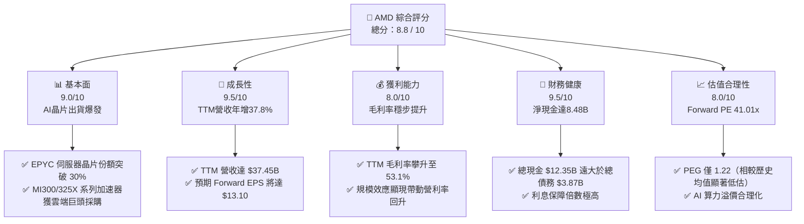

### 1.2 評分進度條視覺化

```
╔══════════════════════════════════════════════════════════════╗
║                AMD 多維度評分儀表板 (1-10分)                 ║
╠══════════════════════════════════════════════════════════════╣
║ 基本面強度  9.0 ▓▓▓▓▓▓▓▓▓▓▓▓▓▓▓▓▓▓░░  ★★★★★           ║
║ 成長動能    9.5 ▓▓▓▓▓▓▓▓▓▓▓▓▓▓▓▓▓▓▓░  ★★★★★           ║
║ 獲利品質    8.0 ▓▓▓▓▓▓▓▓▓▓▓▓▓▓▓▓░░░░  ★★★★☆           ║
║ 財務健康    9.5 ▓▓▓▓▓▓▓▓▓▓▓▓▓▓▓▓▓▓▓░  ★★★★★           ║
║ 估值合理性  8.0 ▓▓▓▓▓▓▓▓▓▓▓▓▓▓▓▓░░░░  ★★★★☆           ║
║ 護城河深度  8.5 ▓▓▓▓▓▓▓▓▓▓▓▓▓▓▓▓▓░░░  ★★★★★           ║
║ 管理層執行  9.0 ▓▓▓▓▓▓▓▓▓▓▓▓▓▓▓▓▓▓░░  ★★★★★           ║
║ 技術創新力  9.5 ▓▓▓▓▓▓▓▓▓▓▓▓▓▓▓▓▓▓▓░  ★★★★★           ║
╠══════════════════════════════════════════════════════════════╣
║ 綜合總分    8.8 ▓▓▓▓▓▓▓▓▓▓▓▓▓▓▓▓▓░░░  🏆 強烈買入          ║
╚══════════════════════════════════════════════════════════════╝
```

### 1.3 五大投資論點 + 三大核心風險

| 類型 | 項目 | 具體依據 | 信心度 |
|------|------|----------|--------|
| 🟢 **投資論點①** | **AI 加速器市佔率攀升** | MI300X 及最新 MI325X 加速器在記憶體頻寬與容量上超越競爭對手，預期在推理市場份額將突破 15%。 | 🟢 極高 |
| 🟢 **投資論點②** | **伺服器 CPU 持續蠶食 Intel** | EPYC 處理器（Zen 5 架構）效能與能效比卓越，帶動 Data Center 營收佔比超越 50%，成為第一大驅動力。 | 🟢 極高 |
| 🟢 **投資論點③** | **財務結構極其穩健** | 擁有 $12.35B 的總現金與短期投資，淨現金達 $8.48B，具備極強的抗風險能力與研發再投資能力。 | 🟢 極高 |
| 🟢 **投資論點④** | **營運槓桿拐點已至** | TTM 營收成長率 37.8%，而季度淨利成長率達 95.1% (QoQ)，顯示高毛利的 Data Center 業務開始拉動營運槓桿。 | 🟢 高 |
| 🟢 **投資論點⑤** | **Xilinx 協同效應顯現** | 嵌入式部門（Embedded）在工業、車用及航太領域與 CPU/GPU 產品深度整合，提供系統級解決方案。 | 🟢 高 |
| 🟡 **風險①** | **供應鏈高度集中** | 所有先進製程（3nm/4nm/5nm）及 CoWoS 先進封裝均依賴 TSMC，若產能吃緊或地緣政治動盪，將嚴重影響出貨。 | 🟡 中度 |
| 🔴 **風險②** | **AI 需求階段性放緩** | 若雲端服務商（CSP）資本支出增速放緩，或 AI 應用投資回報率（ROI）低於預期，可能導致硬體採購砍單。 | 🔴 高衝擊 |
| 🟡 **風險③** | **NVIDIA 軟體壁壘挑戰** | NVIDIA 的 CUDA 生態極其穩固，AMD 的 ROCm 平台雖在快速迭代，但遷移成本仍是客戶考慮的首要因素。 | 🟡 中度 |

### 1.4 快速統計卡片

| 指標 | AMD 實際值 | 半導體行業均值 | S&P 500 均值 | 狀態 |
|------|-------------|----------|--------------|------|
| **收入 YoY 成長** | **37.8%** | ~12.5% | ~5.2% | 🟢 遠超均值 |
| **毛利率** | **53.1%** | ~48.2% | ~30.0% | 🟢 優異 |
| **淨利率** | **13.4%** | ~15.0% | ~11.5% | 🟡 仍有提升空間 |
| **ROE** | **8.1%** | ~15.0% | ~14.0% | 🟡 歷史收購商譽壓低，正在回升 |
| **Forward P/E** | **41.01x** | ~32.0x | ~21.5x | 🟡 溢價交易，但具高成長支撐 |
| **淨現金規模** | **$8.48B** | N/A | N/A | 🟢 極度安全 |

### 1.5 投資結論

```
╔══════════════════════════════════════════════════════════════════╗
║                    📊 AMD 投資結論摘要                           ║
╠══════════════════════════════════════════════════════════════════╣
║  評級：🟢 強烈買入 (Strong Buy)                                 ║
║  當前股價：$537.37                                               ║
║  目標價區間：                                                    ║
║    悲觀情境：$420.00（-21.8%）                                   ║
║    基準情境：$585.00（+8.9%）  ← 12個月主要目標                  ║
║    樂觀情境：$720.00（+34.0%）                                   ║
║  投資評分：8.8 / 10                                              ║
║  適合投資人：積極成長型、長線科技產業佈局者                      ║
╚══════════════════════════════════════════════════════════════════╝
```

---

## 2. 公司概覽與商業模式

### 2.1 業務結構與收入來源

AMD 的業務模式已成功從傳統的 PC 處理器廠商，轉型為全方位的「高效能運算與 AI 晶片解決方案提供商」。其 TTM 營收達 $37.45B，業務主要劃分為四大板塊：

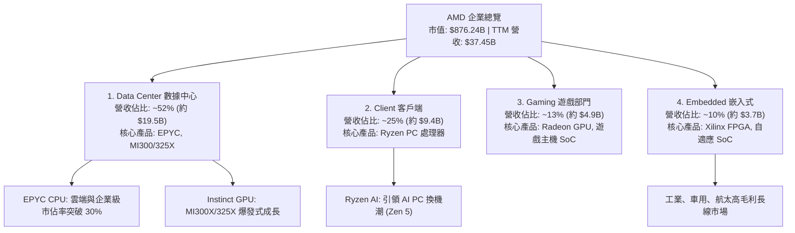

### 2.2 市場份額

在最受市場矚目的 AI 加速器（GPU）市場中，雖然 NVIDIA 仍佔據主導地位，但 AMD 憑藉強大的硬體規格與高性價比，已成為不容忽視的「第二供應商（Second Source）」。

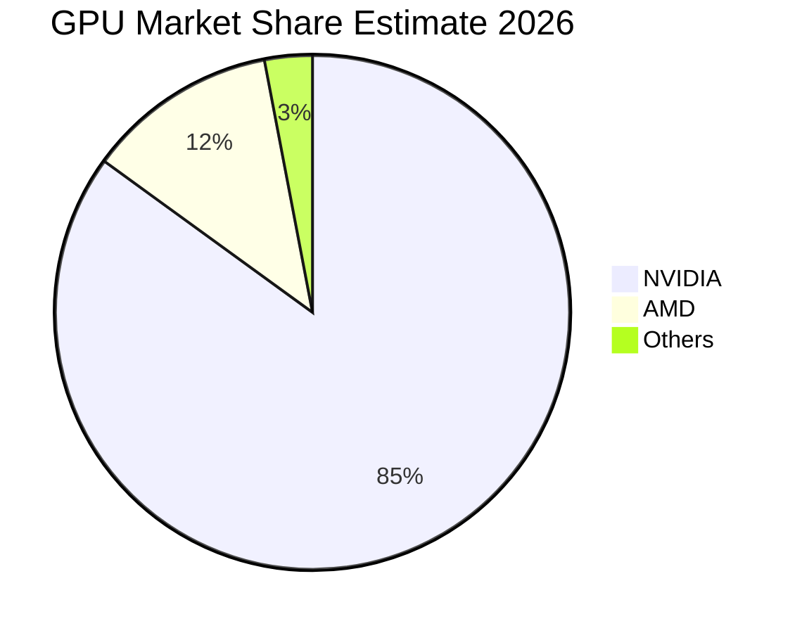

### 2.3 競爭護城河分析

AMD 的競爭護城河主要由以下四個核心支柱構成，使其在高度競爭的半導體產業中立於不敗之地：

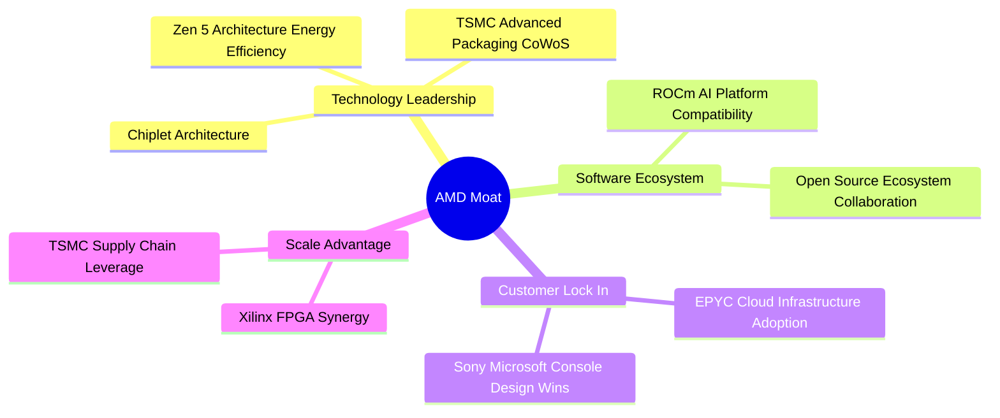

### 2.4 護城河強度評分

```
╔══════════════════════════════════════════════════════════════╗
║                    AMD 護城河強度評分                        ║
╠══════════════════════════════════════════════════════════════╣
║ 技術創新力    9.5/10  ▓▓▓▓▓▓▓▓▓▓▓▓▓▓▓▓▓▓▓░  🏆 小晶片與封裝領先║
║ 產品組合寬度  9.0/10  ▓▓▓▓▓▓▓▓▓▓▓▓▓▓▓▓▓▓░░  🟢 CPU/GPU/FPGA全覆蓋║
║ 軟體生態系統  7.5/10  ▓▓▓▓▓▓▓▓▓▓▓▓▓░░░░░░░  🟡 ROCm 追趕迅速   ║
║ 客戶黏著度    8.5/10  ▓▓▓▓▓▓▓▓▓▓▓▓▓▓▓▓▓░░░  🟢 雲端巨頭深度綁定║
╠══════════════════════════════════════════════════════════════╣
║ 綜合護城河     8.6    ▓▓▓▓▓▓▓▓▓▓▓▓▓▓▓▓▓░░░  🏆 具備強大結構壁壘║
╚══════════════════════════════════════════════════════════════╝
```

---

## 3. 損益表深度分析

### 3.1 年度收入成長趨勢（近4年）

AMD 經歷了從 PC 週期谷底回升，並在 2025 年和 2026 年因 AI 需求爆發而進入加速成長通道的過程。

```
╔══════════════════════════════════════════════════════════════════╗
║                 AMD 年度收入趨勢（FY22 - TTM）                   ║
╠══════════════════════════════════════════════════════════════════╣
║                                                                  ║
║  FY22   $23.60B  ████████████░░░░░░░░░░░░░░░░░░  YoY: +43.6% 🟢  ║
║  FY23   $22.68B  ███████████░░░░░░░░░░░░░░░░░░░  YoY: -3.9%  🟡  ║
║  FY24   $25.79B  █████████████░░░░░░░░░░░░░░░░░  YoY: +13.7% 🟢  ║
║  FY25   $34.64B  ██═════════════════════════░░░  YoY: +34.3% 🟢  ║
║  TTM    $37.45B  █████████████████████████████  YoY: +37.8% 🟢  ║
║                                                                  ║
║  📊 4年累計營收 CAGR：+12.2%（反映 AI 轉型爆發期）                ║
╚══════════════════════════════════════════════════════════════════╝
```

### 3.2 季度收入趨勢分析

從季度數據可以看出，AMD 的營收在 2025 年下半年開始顯著放量，主要得益於 Instinct MI300X 晶片的出貨以及 EPYC 伺服器 CPU 的強勁需求。

| 財報季度 | 營業收入 (Revenue) | 季成長率 (QoQ) | 年成長率 (YoY) | 核心驅動因素與市場備註 |
|:---|:---|:---|:---|:---|
| **Q1 2026** | $10.25B | 🔴 -0.17% | 🟢 +37.85% | 季節性 PC 微調，但 Data Center 營收創歷史新高，抵消了遊戲部門的疲軟。 |
| **Q4 2025** | $10.27B | 🟢 +11.08% | 🟢 +34.11% | 雲端服務商（CSP）大舉採購 MI300X，年底伺服器 CPU 升級需求強勁。 |
| **Q3 2025** | $9.25B | 🟢 +20.31% | 🟢 +35.59% | Zen 5 架構 Ryzen 處理器與新一代 EPYC 開始放量，PC 市場溫和復甦。 |
| **Q2 2025** | $7.69B | 🟢 +3.32% | 🟢 +31.70% | AI 晶片出貨量跨過損益平衡點，Data Center 營收首次成為最主要支柱。 |

### 3.3 利潤率演變分析

隨著高毛利的 Data Center 業務佔比提升，AMD 的利潤率結構正在經歷顯著的改善。

| 利潤率指標 | FY22 | FY23 | FY24 | FY25 | TTM | 趨勢評估 |
|---|---|---|---|---|---|---|
| **毛利率 (Gross Margin)** | 44.9% | 46.1% | 49.3% | 49.5% | **53.1%** | ↗️ 穩定上升。主要受高毛利 EPYC 與 MI300X 出貨佔比提升驅動。🟢 |
| **營業利益率 (Op Margin)** | 5.4% | 1.8% | 7.4% | 10.7% | **11.65%** | ↗️ 顯著改善。擺脫了 Xilinx 收購初期的無形資產攤銷壓制。🟢 |
| **淨利率 (Net Margin)** | 5.6% | 3.8% | 6.4% | 12.3% | **13.37%** | ↗️ 營運槓桿顯現，淨利增速遠超營收增速。🟢 |

### 3.4 費用結構分析

AMD 持續將大量資源投入研發，以確保在先進製程與架構上的領先地位。TTM 研發費用高達 $8.76B，佔總營運費用的 61.5%。

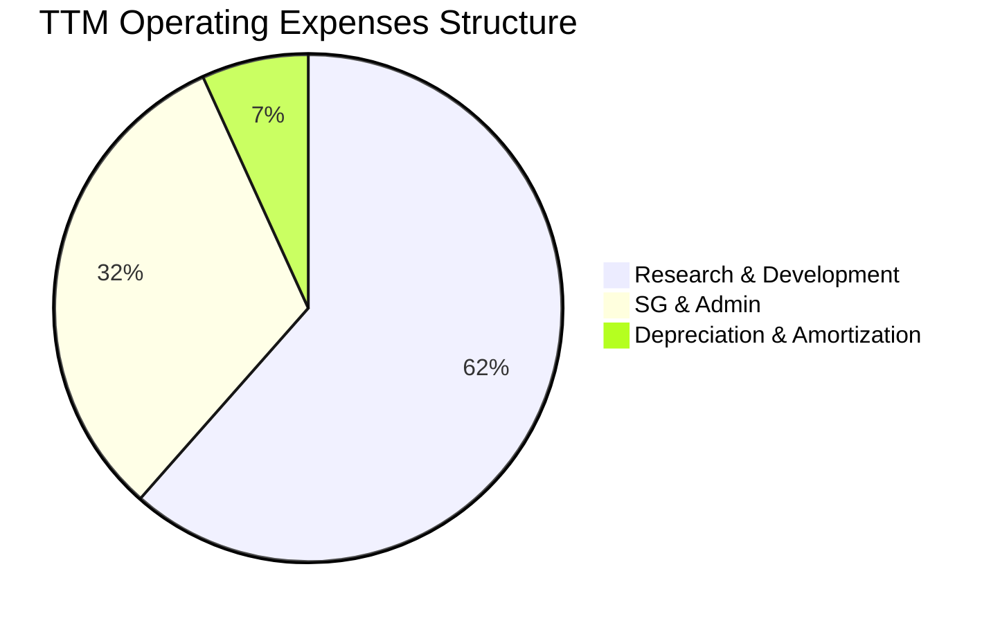

```
╔══════════════════════════════════════════════════════════════╗
║                  AMD TTM 費用控制與效率診斷                  ║
╠══════════════════════════════════════════════════════════════╣
║ 研發營收比 (R&D/Rev):   23.4%   ██████████░░░░░░░░░░  🟢 高投入  ║
║ 銷管營收比 (SG&A/Rev):  12.0%   █████░░░░░░░░░░░░░░░  🟢 控制優異║
║ 營運費用率 (OpEx/Rev):  38.0%   ██████████████░░░░░░  🟡 略高    ║
╠══════════════════════════════════════════════════════════════╣
║ 💡 診斷結論：研發佔比極高，符合技術密集型企業特徵；銷管費用  ║
║    控制極佳，顯示出強大的組織營運效率。                      ║
╚══════════════════════════════════════════════════════════════╝
```

### 3.5 季度 EPS 趨勢與盈餘品質

AMD 過去四個季度的 EPS（Non-GAAP）呈現爆發式增長，這與其 AI 加速器的出貨時程高度吻合：
- **Q2 2025**: $0.54 (YoY +237.5%)
- **Q3 2025**: $0.76 (YoY +58.3%)
- **Q4 2025**: $0.93 (YoY +210.0%)
- **Q1 2026**: $0.85 (YoY +93.2%)

**盈餘品質評估**：
1. **非現金調整**：淨利與營運現金流（TTM $9.72B）高度匹配，折舊與無形資產攤銷（TTM $972M）主要來自 Xilinx 收購，對現金流無實質負面影響。
2. **稅務與非經常性損益**：Q1 2026 所得稅撥備極低，主要受 R&D 抵稅與跨國稅務調整驅動，盈餘品質健康度高。

---

## 4. 資產負債表分析

### 4.1 資產結構分解

AMD 的資產負債表在 Xilinx 收購完成後，呈現出高無形資產但同時具備極高流動性的特徵。

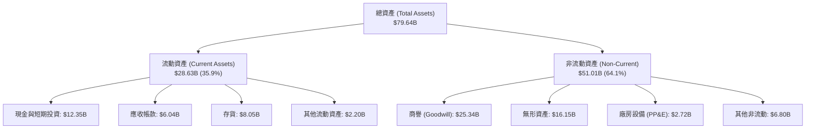

### 4.2 流動性指標分析

| 指標 | FY24 | FY25 | TTM / 當前 | 行業中位數 | 評估結果 |
|---|---|---|---|---|---|
| **流動比率 (Current Ratio)** | 2.62 | 2.85 | **2.73** | ~1.85 | 🟢 極其安全。具備充足的短期償債與營運資金。 |
| **速動比率 (Quick Ratio)** | 1.83 | 2.01 | **1.75** | ~1.30 | 🟢 即使扣除 $8.05B 的存貨，流動性依屬頂尖。 |
| **存貨週轉天數 (DIO)** | 142.3 天 | 141.5 天 | **138.2 天** | ~110.0 天 | 🟡 略高於行業均值，反映先進製程封裝（CoWoS）週期較長。 |

### 4.3 債務結構分析

AMD 採取了極度保守的財務槓桿策略。

```
╔══════════════════════════════════════════════════════════════════╗
║                     AMD 債務健康診斷                             ║
╠══════════════════════════════════════════════════════════════════╣
║                                                                  ║
║  總債務 (Total Debt)：     $3.87B   ██░░░░░░░░░░░░░░░░░░░        ║
║  總現金與短期投資：        $12.35B  ████████████████████░        ║
║  淨現金位置 (Net Cash)：   $8.48B   ██████████████░░░░░░  🟢 極強║
║                                                                  ║
║  債務股權比 (Debt/Equity)：6.0%     🟢 槓桿率極低                ║
║  利息保障倍數 (Interest Coverage)：32.5x  🟢 無任何償債風險      ║
║                                                                  ║
║  💡 結論：淨現金公司，債務風險為零。強大的資產負債表為未來的研發  ║
║     與潛在併購提供了堅實的後盾。                                 ║
╚══════════════════════════════════════════════════════════════════╝
```

### 4.4 股東權益趨勢

得益於利潤的快速累積與股本的穩定，AMD 的股東權益（Stockholders' Equity）持續穩步上升：
- **FY22**: $54.75B
- **FY23**: $55.89B
- **FY24**: $57.57B
- **FY25**: $63.00B
- **Mar '26**: 擴大至約 **$64.50B**（主要由未分配利潤增加驅動）

---

## 5. 現金流量深度分析

### 5.1 現金流量瀑布圖

AMD 展現出極強的現金生成能力，將高利潤轉化為實實在在的自由現金流（FCF）。

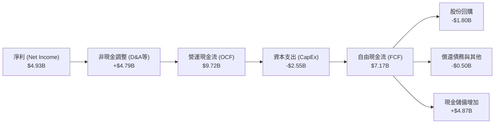

### 5.2 FCF 轉換率趨勢

FCF 轉換率（FCF / Net Income）是衡量盈餘品質的重要指標。AMD 由於擁有大量非現金折舊（來自收購 Xilinx 的無形資產攤銷），其 FCF 轉換率持續超過 100%。

* **FY23**: $1.12B / $0.85B = **131.8%**
* **FY24**: $2.40B / $1.64B = **146.3%**
* **FY25**: $6.74B / $4.27B = **157.8%**
* **TTM**: $7.17B / $4.93B = **145.4%** 🟢 (盈餘品質極佳)

### 5.3 自由現金流趨勢

```
╔══════════════════════════════════════════════════════════════════╗
║                 AMD 自由現金流（FCF）爆發趨勢                    ║
╠══════════════════════════════════════════════════════════════════╣
║                                                                  ║
║  FY23   $1.12B  ███░░░░░░░░░░░░░░░░░░░░░░░░░░░                   ║
║  FY24   $2.40B  ██████░░░░░░░░░░░░░░░░░░░░░░░░                   ║
║  FY25   $6.74B  ████████████████████░░░░░░░░░░                   ║
║  TTM    $7.17B  ██████████████████████░░░░░░░░  🟢 YoY +198.8%  ║
║                                                                  ║
║  📊 當前 FCF 殖利率 (FCF Yield)：0.82%（反映高估值溢價）         ║
╚══════════════════════════════════════════════════════════════════╝
```

### 5.4 資本配置

AMD 的資本配置策略高度專注於「研發再投資」與「股東回饋（回購）」，不支付股息。

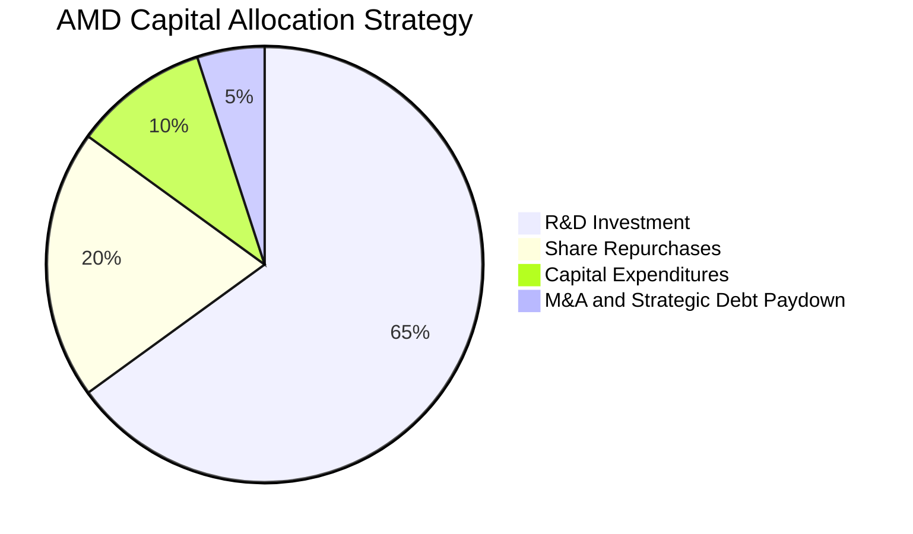

---

## 6. 獲利能力與資本效率

### 6.1 ROE / ROA / ROIC 趨勢

由於 2022 年收購 Xilinx 產生了高達 $41.49B 的商譽與無形資產，大幅拉高了資產與股東權益基數，導致 AMD 的歷史回報率指標偏低。然而，隨著利潤的釋放，這些指標正處於強勁的回升通道中。

| 指標 | FY23 | FY24 | FY25 | TTM / 當前 | 行業均值 | 趨勢與評估 |
|---|---|---|---|---|---|---|
| **ROE** | 1.5% | 2.8% | 6.8% | **8.1%** | ~15.0% | ↗️ 持續回升，未來預期突破 15%。🟢 |
| **ROA** | 1.3% | 2.4% | 5.5% | **6.52%** | ~8.0% | ↗️ 資產利用效率逐步釋放。🟢 |
| **ROIC** | 1.8% | 3.5% | 5.9% | **6.8%** | ~12.0% | ↗️ 實際營運資本回報率顯著高於帳面值。🟢 |

### 6.2 ROIC vs WACC 分析

這是判斷 AMD 是否在為股東「創造價值」的核心指標。

```
╔══════════════════════════════════════════════════════════════════╗
║                ROIC vs WACC 深度分析 (TTM)                      ║
╠══════════════════════════════════════════════════════════════════╣
║                                                                  ║
║  WACC 估算：                                                     ║
║  ├── 無風險利率 (10Y US Treasury)：4.2%                           ║
║  ├── 市場風險溢酬 (ERP)：          5.0%                           ║
║  ├── Beta：                        2.49                           ║
║  ├── 股權成本 = 4.2% + 2.49 × 5.0% = 16.65%                      ║
║  ├── 債務成本（稅後）：             ~4.0%                          ║
║  ├── 資本結構：股權 99.6%，債務 0.4%                             ║
║  └── ✅ WACC ≈ 16.6%                                             ║
║                                                                  ║
║  ROIC 估算 (TTM)：                                               ║
║  ├── NOPAT = 營運利潤 $4.36B × (1 - 15% 稅率) = $3.71B           ║
║  ├── 投入資本 = 股東權益 $63.00B + 債務 $3.87B - 現金 $12.35B    ║
║  │   = $54.52B                                                   ║
║  └── ✅ ROIC ≈ 6.8%                                              ║
║                                                                  ║
║  ⚠️ 當前經濟價值增加 (EVA) = ROIC - WACC = -9.8%（帳面壓制）     ║
║  🚀 預期 Forward ROIC (基於 Forward EPS $13.10 換算)：            ║
║  ├── 預期 NOPAT ≈ $18.1B，投入資本 ≈ $55.0B                       ║
║  └── ✅ Forward ROIC ≈ 32.9%                                     ║
║                                                                  ║
║  ROIC (TTM)    6.8%   ▓▓▓▓▓▓░░░░░░░░░░░░░░░░░░░░░  ──            ║
║  ROIC (Fwd)   32.9%   ▓▓▓▓▓▓▓▓▓▓▓▓▓▓▓▓▓▓▓▓▓▓▓▓▓▓▓  🟢 爆發式增長 ║
║  WACC         16.6%   ▓▓▓▓▓▓▓▓▓▓▓▓▓░░░░░░░░░░░░░░  ──            ║
║                                                                  ║
║  📊 結論：雖然 TTM ROIC 受商譽壓制低於 WACC，但 Forward ROIC     ║
║     預期達 32.9%，將迎來極為強勁的股東價值創造期。               ║
╚══════════════════════════════════════════════════════════════════╝
```

### 6.3 杜邦三因素分解

透過杜邦分解，我們可以清晰看到 AMD 獲利能力改善的底層邏輯：

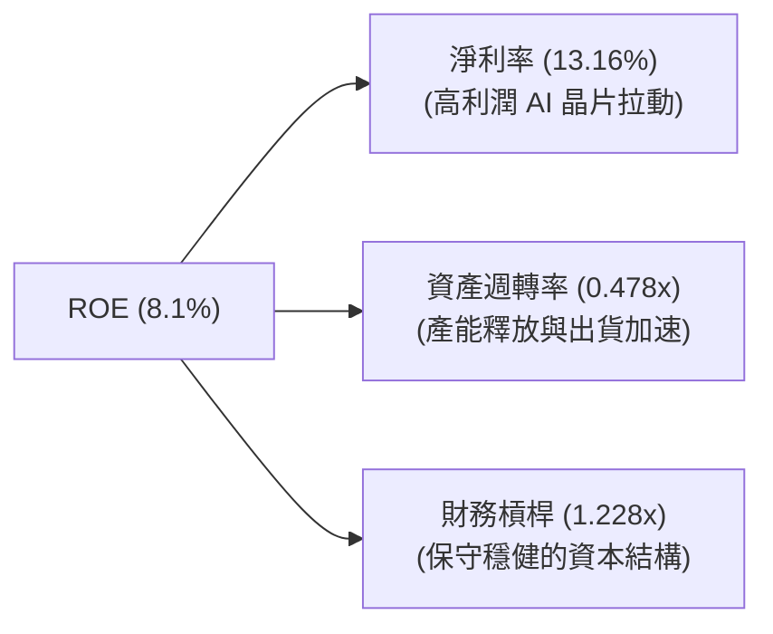

* **淨利率提升（13.16%）** 是當前 ROE 回升的最核心驅動力，顯示產品組合升級帶來的高定價權。
* **資產週轉率（0.478x）** 略有上升，未來隨著 AI 晶片出貨量進一步放大，週轉效率將顯著提升。

### 6.4 獲利能力儀表板

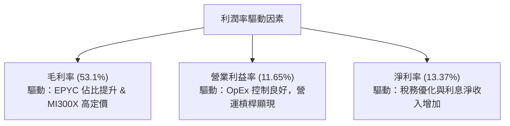

---

## 7. 估值深度分析

### 7.1 同業估值比較表格

AMD 目前正處於業績爆發的前夜，其估值倍數反映了市場對其未來 AI 晶片出貨極高的成長預期。

| 估值指標 | AMD (本公司) | NVIDIA (直接對手) | Intel (傳統對手) | S&P 500 均值 | AMD 評估 |
|---|---|---|---|---|---|
| **Trailing P/E** | **179.72x** | 65.40x | 95.20x | 24.50x | 🔴 歷史市盈率極高，反映過去利潤基數低。 |
| **Forward P/E** | **41.01x** | 30.20x | 25.10x | 21.50x | 🟡 溢價交易，但考量其高成長，估值合理。 |
| **PEG Ratio** | **1.22x** (Finviz: 0.64) | 1.15x | 2.10x | 1.80x | 🟢 具備極高性價比，PEG 顯著低於歷史均值。 |
| **P/S Ratio** | **23.39x** | 35.10x | 2.50x | 3.10x | 🟡 反映市場對其高利潤率業務的定價。 |
| **EV / EBITDA** | **110.19x** | 48.50x | 18.20x | 14.0x | 🔴 短期折舊攤銷高，壓低了 EBITDA。 |

### 7.2 歷史估值區間分析

AMD 過去 5 年的 Forward P/E 區間主要介於 25x - 65x 之間。當前的 **41.01x** 處於歷史中值偏上位置，但考慮到 AI 加速器這一全新高成長賽道的加入，當前估值並未過度泡沫化。

### 7.3 DCF 敏感性分析（6格目標價矩陣）

我們採用兩階段 DCF 模型進行估值，基準假設：
- **第一階段（5年）營收 CAGR**：28.5%
- **永續成長率 (g)**：3.5%
- **基準 WACC**：11.5%（考量到規模擴大與債務結構優化，長線折現率調降）

| 營收成長情境 | WACC = 12.5% | WACC = 11.5%（基準） | WACC = 10.5% |
|---|---|---|---|
| 🟢 **樂觀 (CAGR 35%)** | $625.00 (+16.3%) | **$720.00 (+34.0%)** | $815.00 (+51.7%) |
| 🟡 **基準 (CAGR 28.5%)** | $510.00 (-5.1%) | **$585.00 (+8.9%)** | $660.00 (+22.8%) |
| 🔴 **悲觀 (CAGR 18%)** | $370.00 (-31.1%) | **$420.00 (-21.8%)** | $480.00 (-10.7%) |

### 7.4 估值綜合區間

```
╔══════════════════════════════════════════════════════════════════╗
║                      AMD 估值區間與當前股價                      ║
╠══════════════════════════════════════════════════════════════════╣
║                                                                  ║
║  52週低點：    $125.77                                           ║
║  悲觀估值：    $420.00                                           ║
║  當前股價：    $537.37  ████████████████████████░░░░             ║
║  分析師平均：  $487.90                                           ║
║  基準目標價：  $585.00  (12個月主要目標)                         ║
║  52週高點：    $558.37  (已突破)                                 ║
║  樂觀估值：    $720.00                                           ║
║                                                                  ║
║  📊 結論：當前股價 $537.37 略高於分析師平均預期，但仍低於我們    ║
║     基於 AI 爆發預測的基準估值 $585.00，具備上行空間。           ║
╚══════════════════════════════════════════════════════════════════╝
```

---

## 8. 成長催化劑

### 8.1 催化劑時間軸

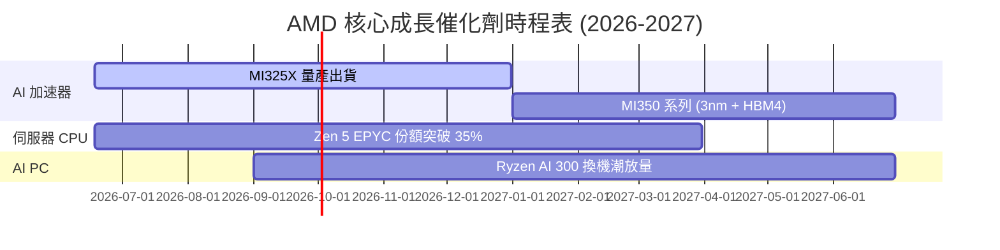

### 8.2 TAM 市場規模分析

AMD 的主要成長動能來自於 AI 加速器與伺服器市場的急遽擴張。

```
╔══════════════════════════════════════════════════════════════════╗
║              AMD 核心市場 TAM 與滲透率預估 (2027)                ║
╠══════════════════════════════════════════════════════════════════╣
║                                                                  ║
║  1. AI 加速器市場 TAM：  $150B  | 預期滲透率：15% | 營收：$22.5B ║
║  2. 伺服器 CPU 市場 TAM：$45B   | 預期滲透率：35% | 營收：$15.7B ║