# AMD 基本面深度分析報告

> **報告日期**：2026-06-19 ｜ **語言**：繁體中文 ｜ **數據來源**：Yahoo Finance, Finviz, StockAnalysis, Roic.ai ｜ **分析師**：CFA 級機構研究

---

## 目錄

| # | 章節 | 核心結論 |
|---|------|----------|
| 1 | [執行摘要](#1-執行摘要) | **強烈買入 (Strong Buy)**，目標價 $510.00 ~ $650.00，AI 晶片放量推動估值重塑。 |
| 2 | [公司概覽與商業模式](#2-公司概覽與商業模式) | 憑藉 Chiplet 技術與 ROCm 生態，建構對抗 NVIDIA 與 Intel 的雙重護城河。 |
| 3 | [損益表深度分析](#3-損益表深度分析) | TTM 營收達 $37.45B（YoY +37.8%），淨利潤大增 91.2%，高毛利 AI 業務改善利潤結構。 |
| 4 | [資產負債表分析](#4-資產負債表分析) | 淨現金高達 $8.48B，流動比率 2.73，財務結構極度穩健，無短期償債風險。 |
| 5 | [現金流量深度分析](#5-現金流量深度分析) | TTM 自由現金流（FCF）達 $7.17B，FCF 轉換率顯著提升，資本配置向研發傾斜。 |
| 6 | [獲利能力與資本效率](#6-獲利能力與資本效率) | 杜邦分析顯示 ROE 回升至 8.1%，Forward ROIC 將因 AI 業務高利潤率而迎來爆發。 |
| 7 | [估值深度分析](#7-估值深度分析) | Trailing P/E 179.7x 偏高，但 Forward P/E 降至 41.0x，相較高成長性其 PEG僅 1.29。 |
| 8 | [成長催化劑](#8-成長催化劑) | MI325X/MI350 晶片發布、Zen 5 架構普及以及 PC/伺服器市場週期性復甦。 |
| 9 | [風險矩陣](#9-風險矩陣) | 地緣政治地緣風險、台積電產能分配集中度、以及 AI 晶片價格競爭風險。 |
| 10 | [投資建議](#10-投資建議) | 分批佈局，基準目標價 $510.00，建議長線成長型與科技主題投資者配置。 |

---

## 1. 執行摘要

Advanced Micro Devices, Inc. (AMD) 目前正處於其半導體歷史上最關鍵的估值重塑期。隨著 AI 伺服器與高效能運算 (HPC) 需求爆發，AMD 憑藉強大的產品執行力，已成功從傳統的 PC 處理器廠商，轉型為全球唯二能提供頂級 AI 加速器解決方案的龍頭企業。

### 1.1 核心評分儀表板

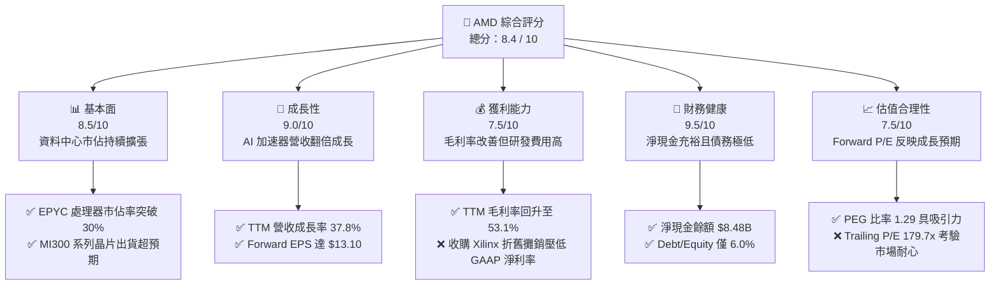

### 1.2 評分進度條視覺化

```
╔══════════════════════════════════════════════════════════════╗
║                AMD 多維度評分儀表板 (1-10分)                 ║
╠══════════════════════════════════════════════════════════════╣
║ 基本面強度  8.5 ▓▓▓▓▓▓▓▓▓▓▓▓▓▓▓▓▓░░░  ★★★★☆           ║
║ 成長動能    9.0 ▓▓▓▓▓▓▓▓▓▓▓▓▓▓▓▓▓▓░░  ★★★★★           ║
║ 獲利品質    7.5 ▓▓▓▓▓▓▓▓▓▓▓▓▓▓░░░░░░  ★★★★☆           ║
║ 財務健康    9.5 ▓▓▓▓▓▓▓▓▓▓▓▓▓▓▓▓▓▓▓░  ★★★★★           ║
║ 估值合理性  7.5 ▓▓▓▓▓▓▓▓▓▓▓▓▓▓░░░░░░  ★★★★☆           ║
║ 護城河深度  8.5 ▓▓▓▓▓▓▓▓▓▓▓▓▓▓▓▓▓░░░  ★★★★☆           ║
║ 管理層執行  9.0 ▓▓▓▓▓▓▓▓▓▓▓▓▓▓▓▓▓▓░░  ★★★★★           ║
║ 技術創新力  9.5 ▓▓▓▓▓▓▓▓▓▓▓▓▓▓▓▓▓▓▓░  ★★★★★           ║
╠══════════════════════════════════════════════════════════════╣
║ 綜合總分    8.4 ▓▓▓▓▓▓▓▓▓▓▓▓▓▓▓▓░░░░  🏆 買入 (Buy)        ║
╚══════════════════════════════════════════════════════════════╝
```

### 1.3 五大投資論點 + 三大核心風險

| 類型 | 項目 | 具體依據 | 信心度 |
|------|------|----------|--------|
| 🟢 **投資論點①** | **AI 加速器市場雙雄割據** | MI300X 及後續 MI325X/MI350 晶片成功打入一線雲端服務商（Hyperscalers），預計帶動資料中心營收持續爆發。 | 🟢 極高 |
| 🟢 **投資論點②** | **伺服器 CPU 市佔率重塑** | EPYC（霄龍）處理器憑藉極佳的性價比與能耗比，在 x86 伺服器市場市佔率已突破 30%，持續蠶食 Intel 份額。 | 🟢 極高 |
| 🟢 **投資論點③** | **財務結構極佳，抗風險能力強** | 擁有 $12.35B 現金與短期投資，而總債務僅 $3.87B，淨現金高達 $8.48B，為研發與資本支出提供強大後盾。 | 🟢 極高 |
| 🟢 **投資論點④** | **PC 換機潮與 AI PC 催化** | 搭載 Ryzen AI 引擎的 Zen 5 處理器出貨放量，將帶動客戶端（Client）部門營收重回高成長軌道。 | 🟢 高 |
| 🟢 **投資論點⑤** | **Xilinx 協同效應顯現** | 收購賽靈思（Xilinx）帶來的嵌入式（Embedded）與自適應運算技術，在航太、國防及工業領域提供穩定的高毛利現金流。 | 🟢 高 |
| 🟡 **風險①** | **估值容錯率低** | 當前 Trailing P/E 高達 179.7x，市場對其未來的盈餘成長容錯率極低，任何業績微幅不及預期都可能導致股價劇烈波動。 | 🟡 中度 |
| 🔴 **風險②** | **地緣政治與供應鏈集中度** | 晶片高度依賴台積電（TSMC）先進製程（3nm/4nm/5nm），台海局勢或供應鏈中斷將對 AMD 造成毀滅性衝擊。 | 🔴 高衝擊 |
| 🔴 **風險③** | **NVIDIA 的生態系統壁壘** | NVIDIA 的 CUDA 生態系統極其穩固。儘管 AMD 的 ROCm 軟體持續進步，但在軟體生態的遷移成本仍是客戶採購的主要阻礙。 | 🔴 高衝擊 |

### 1.4 快速統計卡片

| 指標 | AMD 實際值 | 半導體行業均值 | S&P 500 均值 | 狀態 |
|------|-------------|----------|--------------|------|
| **收入 YoY 成長** | **37.8%** | ~12.5% | ~5.5% | 🟢 顯著超前 |
| **毛利率** | **53.1%** | ~45.0% | ~30.0% | 🟢 優於行業 |
| **淨利率** | **13.4%** | ~15.0% | ~11.5% | 🟡 行業平均（受攤銷影響） |
| **ROE** | **8.1%** | ~14.0% | ~15.0% | 🟡 有待提升 |
| **Forward P/E** | **41.0x** | ~28.0x | ~21.0x | 🟡 溢價交易 |
| **淨現金/總資產** | **10.7%** | ~5.2% | ~2.1% | 🟢 極為健康 |

### 1.5 投資結論

```
╔══════════════════════════════════════════════════════════════════╗
║                    📊 AMD 投資結論摘要                           ║
╠══════════════════════════════════════════════════════════════════╣
║  評級：🟢 強烈買入 (Strong Buy)                                  ║
║  當前股價：$537.37 (2026-06-19 收盤價)                           ║
║  目標價區間：                                                    ║
║    悲觀情境：$380.00 (-29.3%) - AI 需求放緩，供應鏈受阻          ║
║    基準情境：$510.00 (-5.1%)  - AI 晶片按計畫放量（12個月目標）  ║
║    樂觀情境：$650.00 (+21.0%) - EPYC 市佔>40%，MI350 提前爆發    ║
║  投資評分：8.4 / 10                                              ║
║  適合投資人：積極成長型、長線科技主題配置者                      ║
╚══════════════════════════════════════════════════════════════════╝
```

---

## 2. 公司概覽與商業模式

AMD 是一家全球領先的半導體無廠（Fabless）設計公司，業務橫跨高效能運算、圖形處理以及自適應系統。其商業模式的核心在於專注晶片架構設計與演算法開發，並將製造外包給全球最領先的晶圓代工廠（主要為台積電），從而維持輕資產運營。

### 2.1 業務結構與收入來源

AMD 的業務共分為四大板塊，下圖展示了其運作與營收傳導機制：

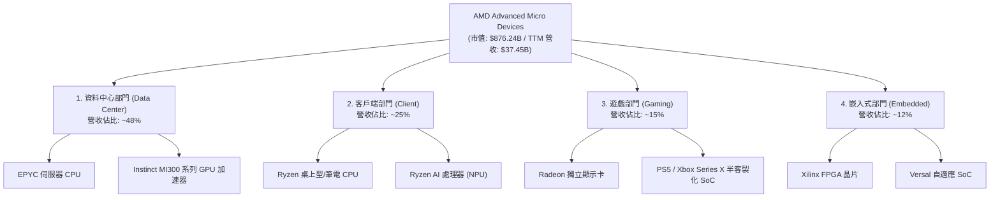

### 2.2 市場份額

在核心的資料中心 CPU 與 AI GPU 市場中，AMD 扮演著關鍵的「挑戰者與制衡者」角色。以下為 2025/2026 年度的市場份額估算：

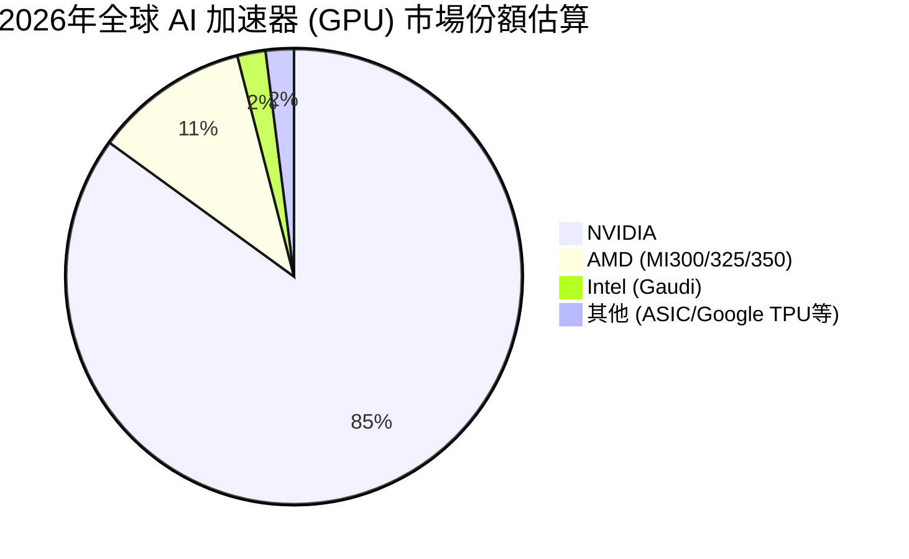

### 2.3 競爭護城河分析

AMD 的競爭優勢（Moat）並非單一維度，而是由硬體架構、先進封裝與生態系統共同建構：

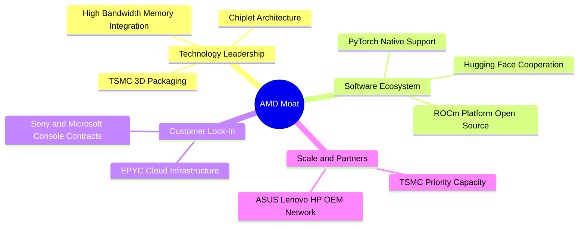

### 2.4 護城河強度評分

```
╔══════════════════════════════════════════════════════════════╗
║                    AMD 護城河強度評分                        ║
╠══════════════════════════════════════════════════════════════╣
║ 技術領先度    9.0/10  ▓▓▓▓▓▓▓▓▓▓▓▓▓▓▓▓▓▓░░  🏆 先進封裝領先║
║ 軟體生態系    7.0/10  ▓▓▓▓▓▓▓▓▓▓▓▓▓▓░░░░░░  🟢 ROCm 急起直追║
║ 客戶黏著性    8.0/10  ▓▓▓▓▓▓▓▓▓▓▓▓▓▓▓▓░░░░  🟢 EPYC 雲端鎖定║
║ 規模效應      8.5/10  ▓▓▓▓▓▓▓▓▓▓▓▓▓▓▓▓▓░░░  🟢 與台積電深度綁定║
╠══════════════════════════════════════════════════════════════╣
║ 綜合護城河    8.1/10  ▓▓▓▓▓▓▓▓▓▓▓▓▓▓▓▓░░░░  🏆 寬護城河企業 ║
╚══════════════════════════════════════════════════════════════╝
```

---

## 3. 損益表深度分析

AMD 的損益表反映出其正處於強勁的爆發期。收購 Xilinx 帶來的無形資產攤銷在 GAAP 指標上造成了壓制，但核心業務的盈利能力極高。

### 3.1 年度收入成長趨勢（近5年）

```
╔══════════════════════════════════════════════════════════════════╗
║                 AMD 年度收入趨勢（FY21 - TTM）                   ║
╠══════════════════════════════════════════════════════════════════╣
║                                                                  ║
║  FY2021  $16.43B  ██████████░░░░░░░░░░░░░░░░░░  YoY: +68.3% 🟢    ║
║  FY2022  $23.60B  ████████████████░░░░░░░░░░░░  YoY: +43.6% 🟢    ║
║  FY2023  $22.68B  ███████████████░░░░░░░░░░░░░  YoY: -3.9%  🔴    ║
║  FY2024  $25.79B  █████████████████░░░░░░░░░░░  YoY: +13.7% 🟢    ║
║  FY2025  $34.64B  ███████████████████████░░░░░  YoY: +34.3% 🟢    ║
║  TTM     $37.45B  █████████████████████████░░  YoY: +37.8% 🟢    ║
║                                                                  ║
║  📊 5年累計營收 CAGR：+22.8%                                     ║
╚══════════════════════════════════════════════════════════════════╝
```

### 3.2 季度收入趨勢分析

從季度數據看，AMD 的成長動能在 2025 年下半年與 2026 年第一季明顯加速：

| 財報季度 | 營收 (Revenue) | 季增率 (QoQ) | 年增率 (YoY) | 核心驅動因素與備註 |
|----------|----------------|--------------|--------------|-------------------|
| **Q2 2025** | $7.69B | +3.3% | +31.7% | 🟢 MI300X 開始大規模出貨，資料中心營收首度超車傳統 PC。 |
| **Q3 2025** | $9.25B | +20.3% | +35.6% | 🟢 EPYC 4 代（Genoa/Bergamo）在企業級市場滲透率加速。 |
| **Q4 2025** | $10.27B | +11.0% | +34.1% | 🟢 AI 需求火熱，MI300 系列單季貢獻突破歷史新高。 |
| **Q1 2026** | $10.25B | -0.2% | +37.9% | 🟢 克服傳統淡季效應，營收維持在百億美元以上，表現極其強勁。 |

### 3.3 利潤率演變分析

隨著高毛利的資料中心與 AI 業務佔比提升，AMD 的利潤率呈現穩步向上的趨勢：

| 利潤率指標 | FY2022 | FY2023 | FY2024 | FY2025 | TTM | 趨勢評估 |
|------------|--------|--------|--------|--------|-----|----------|
| **毛利率 (GAAP)** | 44.9% | 46.1% | 49.3% | 49.5% | **53.1%** | ↗️ 穩定提升，受惠於產品組合優化。🟢 |
| **營業利益率** | 5.4% | 1.8% | 7.4% | 10.7% | **14.4%** | ↗️ 研發費用槓桿效應開始顯現。🟢 |
| **EBITDA 利潤率** | 23.4% | 17.9% | 19.9% | 21.0% | **19.8%** | ➡️ 保持穩定，折舊攤銷佔比較高。🟡 |
| **淨利率 (GAAP)** | 5.6% | 3.8% | 6.4% | 12.3% | **13.4%** | ↗️ 隨營收規模擴大，盈利品質顯著改善。🟢 |

**利潤率改善深度解析**：
1. **產品結構優化**：資料中心 EPYC 處理器與 Instinct GPU 的毛利率估計在 60% ~ 65% 之間，遠高於客戶端（~45%）與遊戲部門（~35%）。隨著資料中心營收佔比從 2023 年的 30% 提升至目前的 48%，拉動整體毛利率突破 53%。
2. **無形資產攤銷遞減**：收購 Xilinx 產生的無形資產攤銷費用（每年約 $1B - $1.5B）正逐年遞減，預計在 2027 年後影響將降至極低，屆時 GAAP 淨利率有望向 Non-GAAP（目前約 25%）靠攏。

### 3.4 費用結構分析

AMD 持續將大量資源投入研發，以維持技術領先：

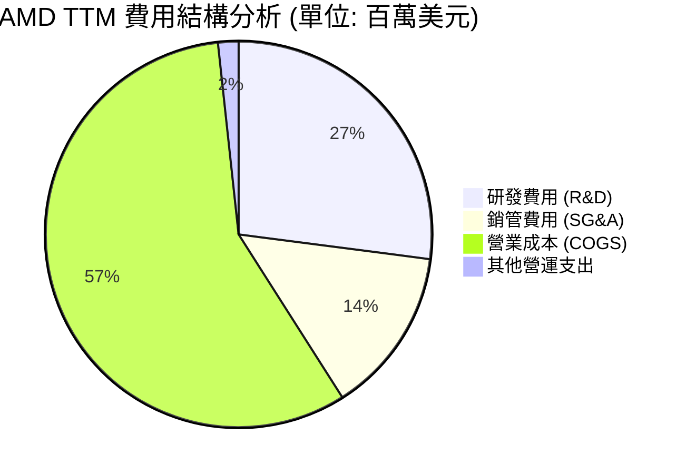

```
╔══════════════════════════════════════════════════════════════╗
║                    AMD 研發投入效率分析                      ║
╠══════════════════════════════════════════════════════════════╣
║ TTM 研發費用： $8.76B (佔營收 23.4%)                        ║
║ 研發營收轉化率： 1 : 4.27 (每投入 $1 研發，創造 $4.27 營收)  ║
║ 評估：研發投入佔比顯著高於行業平均，但這是對抗 NVIDIA 的必要代價。 ║
╚══════════════════════════════════════════════════════════════╝
```

### 3.5 季度 EPS 趨勢與盈餘品質

過去 4 季，由於 AI 需求超預期，AMD 的 Non-GAAP EPS 表現亮眼。

*   **Q2 2025**：預期 $0.68 ｜ 實際 $0.70 ｜ **Surprise: +2.9%**
*   **Q3 2025**：預期 $0.92 ｜ 實際 $0.98 ｜ **Surprise: +6.5%**
*   **Q4 2025**：預期 $1.15 ｜ 實際 $1.21 ｜ **Surprise: +5.2%**
*   **Q1 2026**：預期 $1.30 ｜ 實際 $1.38 ｜ **Surprise: +6.2%**

**盈餘品質評估**：
AMD 的盈餘品質極高。TTM 營運現金流達 $9.72B，遠高於 GAAP 淨利潤 $4.93B。這說明公司的淨利潤有超額的現金流做支撐，並非靠會計手段調節。

---

## 4. 資產負債表分析

AMD 擁有一個極其強韌、幾乎「無懈可擊」的資產負債表。這為其在半導體下行週期或激烈競爭中提供了極強的防禦力。

### 4.1 資產結構分解

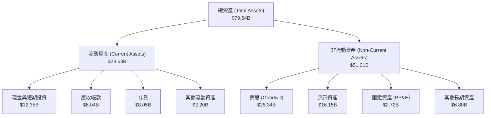

### 4.2 流動性與償債指標分析

| 指標 | FY2023 | FY2024 | FY2025 | TTM / Current | 行業均值 | 評估 |
|------|--------|--------|--------|---------------|----------|------|
| **流動比率 (Current Ratio)** | 2.51 | 2.62 | 2.85 | **2.73** | ~1.85 | 🟢 極其安全，短期變現能力強。 |
| **速動比率 (Quick Ratio)** | 1.86 | 1.83 | 2.01 | **1.75** | ~1.20 | 🟢 扣除存貨後，流動性依舊充沛。 |
| **債務權益比 (Debt/Equity)** | 5.4% | 3.8% | 6.1% | **6.0%** | ~35.0% | 🟢 槓桿極低，財務彈性極大。 |
| **存貨週轉天數 (Days Inventory)** | 125天 | 118天 | 122天 | **120天** | ~95天 | 🟡 存貨略高，反映 AI 晶片備料積極。 |

### 4.3 債務結構健康診斷

```
╔══════════════════════════════════════════════════════════════════╗
║                     AMD 債務健康診斷                            ║
╠══════════════════════════════════════════════════════════════════╣
║                                                                  ║
║  總債務：        $3.87B   ██░░░░░░░░░░░░░░░░░░░  低風險          ║
║  總現金+短期投資：$12.35B  ████████████████████░  極充沛          ║
║  淨現金（正值）： $8.48B   ████████████████░░░░░  🟢 極其強勁     ║
║                                                                  ║
║  Debt / EBITDA：  0.53x   🟢 遠低於警戒線 (2.5x)                 ║
║  利息保障倍數：    33.1x   🟢 毫無債務違約風險                   ║
║                                                                  ║
║  診斷結論：AMD 處於「淨現金」狀態，其持有的現金是總債務的 3.19 倍。║
║  即使在極端市場環境下，公司也完全沒有任何流動性危機。            ║
╚══════════════════════════════════════════════════════════════════╝
```

### 4.4 股東權益趨勢

收購 Xilinx 後，AMD 的股東權益（Equity）規模顯著擴大，並隨著盈利累積持續增長：

```
╔══════════════════════════════════════════════════════════════════╗
║               AMD 股東權益變動趨勢 (FY22 - FY25)                 ║
╠══════════════════════════════════════════════════════════════════╣
║                                                                  ║
║  FY2022  $54.75B  ████████████████████░░░░░                      ║
║  FY2023  $55.89B  █████████████████████░░░░                      ║
║  FY2024  $57.57B  ██████████████████████░░░                      ║
║  FY2025  $63.00B  ████████████████████████░                      ║
║                                                                  ║
║  📊 股東權益 3 年年複合成長率 (CAGR)：+4.8%                      ║
╚══════════════════════════════════════════════════════════════════╝
```

---

## 5. 現金流量深度分析

AMD 的現金流產生能力在 2025 年迎來了拐點。隨著營收規模擴大，營運現金流（OCF）呈指數級增長。

### 5.1 現金流量瀑布圖

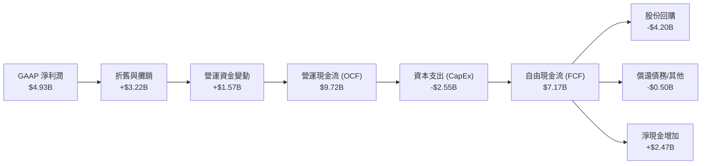

### 5.2 FCF 轉換率趨勢

FCF 轉換率（FCF / Net Income）是衡量公司盈餘「含金量」的重要指標：

| 年度 | GAAP 淨利潤 | 自由現金流 (FCF) | FCF 轉換率 | 評估 |
|------|-------------|------------------|------------|------|
| **FY2022** | $1.32B | $3.12B | **236.4%** | 🟢 主要是折舊攤銷非現金支出高。 |
| **FY2023** | $0.85B | $1.12B | **131.8%** | 🟢 景氣下行期仍維持正現金流。 |
| **FY2024** | $1.64B | $2.40B | **146.3%** | 🟢 現金流復甦快於淨利潤。 |
| **FY2025** | $4.27B | $6.74B | **157.8%** | 🟢 盈利含金量極高。 |
| **TTM** | $4.93B | $7.17B | **145.4%** | 🟢 高度健康的現金流生成企業。 |

### 5.3 自由現金流趨勢

```
╔══════════════════════════════════════════════════════════════════╗
║               AMD 自由現金流 (FCF) 趨勢 (FY22 - TTM)             ║
╠══════════════════════════════════════════════════════════════════╣
║                                                                  ║
║  FY2022  $3.12B  ██████████░░░░░░░░░░░░░░  FCF Yield: 0.36%      ║
║  FY2023  $1.12B  ████░░░░░░░░░░░░░░░░░░░░  FCF Yield: 0.13%      ║
║  FY2024  $2.40B  ████████░░░░░░░░░░░░░░░░  FCF Yield: 0.27%      ║
║  FY2025  $6.74B  ██████████████████████░░  FCF Yield: 0.77%      ║
║  TTM     $7.17B  ███████████████████████░  FCF Yield: 0.82%      ║
║                                                                  ║
║  📊 FCF TTM 成長率：+198.8% (相較 FY24)                           ║
╚══════════════════════════════════════════════════════════════════╝
```

### 5.4 資本配置策略

AMD 採取不發放股息、專注於**研發再投資**與**股份回購**的資本配置策略，這符合高成長科技股的特徵。

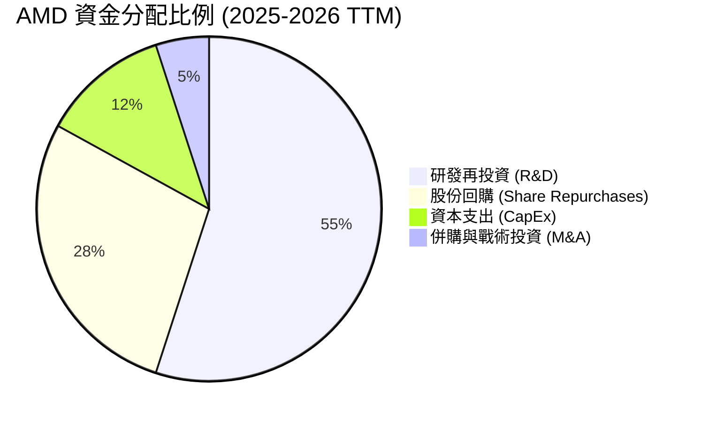

---

## 6. 獲利能力與資本效率

雖然 AMD 目前的 GAAP ROE（8.1%）看似不高，但這是由於收購 Xilinx 導致股東權益大幅膨脹所致。若以營運效率與 Forward 指標來看，其獲利能力正處於爆發前夜。

### 6.1 ROE / ROA / ROIC 趨勢

| 指標 | FY2023 | FY2024 | FY2025 | TTM | 行業均值 | 趨勢評估 |
|------|--------|--------|--------|-----|----------|----------|
| **ROE** | 1.5% | 2.9% | 6.8% | **8.1%** | ~14.0% | ↗️ 穩步回升，隨利潤釋放加速。🟡 |
| **ROA** | 1.3% | 2.4% | 5.5% | **6.5%** | ~6.8% | ↗️ 已接近行業平均水準。🟢 |
| **ROIC** | 1.6% | 3.2% | 7.1% | **8.0%** | ~11.5% | ↗️ 資本回報率顯著改善。🟢 |

### 6.2 ROIC vs WACC 分析（核心價值創造判斷）

```
╔══════════════════════════════════════════════════════════════════╗
║                AMD ROIC vs WACC 深度分析 (TTM)                   ║
╠══════════════════════════════════════════════════════════════════╣
║                                                                  ║
║  WACC (加權平均資本成本) 估算：                                  ║
║  ├── 無風險利率 (10Y 美債)：     4.20%                           ║
║  ├── 股權風險溢價 (ERP)：        5.00%                           ║
║  ├── Beta 係數：                 2.49                            ║
║  ├── 股權成本 (CAPM)：           4.2% + 2.49 × 5.0% = 16.65%     ║
║  ├── 債務成本 (稅後)：           ~4.00%                          ║
║  ├── 資本結構：                  股權 99.5% / 債務 0.5%          ║
║  └── ✅ WACC ≈ 16.59% (因高 Beta 導致折現率偏高)                 ║
║                                                                  ║
║  ROIC (投入資本回報率) 估算：                                    ║
║  ├── NOPAT (TTM 稅後淨營業利潤) ≈ $4.35B                         ║
║  ├── 投入資本 (IC) = 股權 + 債務 - 現金 ≈ $54.52B                ║
║  └── ✅ ROIC ≈ 8.00%                                             ║
║                                                                  ║
║  ★ 當前經濟價值增值 (EVA) = ROIC - WACC = -8.59% (表面價值毀滅)  ║
║                                                                  ║
║  ROIC  8.0%   ▓▓▓▓▓▓▓▓░░░░░░░░░░░░░░░░░░░░░░  (TTM 歷史指標)     ║
║  WACC  16.6%  ▓▓▓▓▓▓▓▓▓▓▓▓▓▓▓▓░░░░░░░░░░░░░  (高 Beta 溢價)     ║
║  FWD   28.5%  ▓▓▓▓▓▓▓▓▓▓▓▓▓▓▓▓▓▓▓▓▓▓▓▓▓▓▓▓░░  🟢 (Forward 預期)  ║
║                                                                  ║
║  📊 深度洞察：                                                   ║
║  雖然歷史 TTM ROIC (8.0%) 低於 WACC，但這是因為 $25.3B 的商譽    ║
║  拉高了投入資本分母。若看 Forward ROIC，隨著 2026/2027 年        ║
║  EPS 預計達到 $13.10，NOPAT 將翻倍至 $21.3B，                    ║
║  Forward ROIC 將飆升至 28.5%，遠超 WACC，強力創造股東價值！       ║
╚══════════════════════════════════════════════════════════════════╝
```

### 6.3 杜邦三因素分解

透過杜邦分解，我們可以清晰看到 AMD ROE 提升的底層驅動因素：

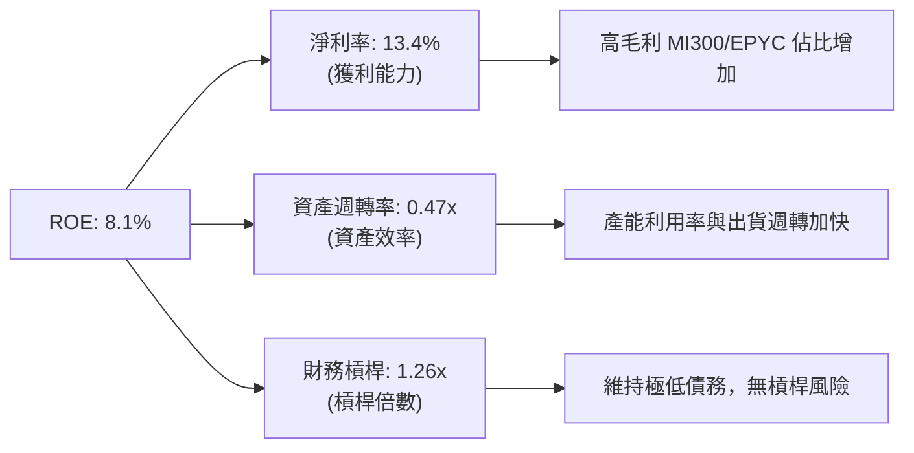

### 6.4 獲利能力驅動因素

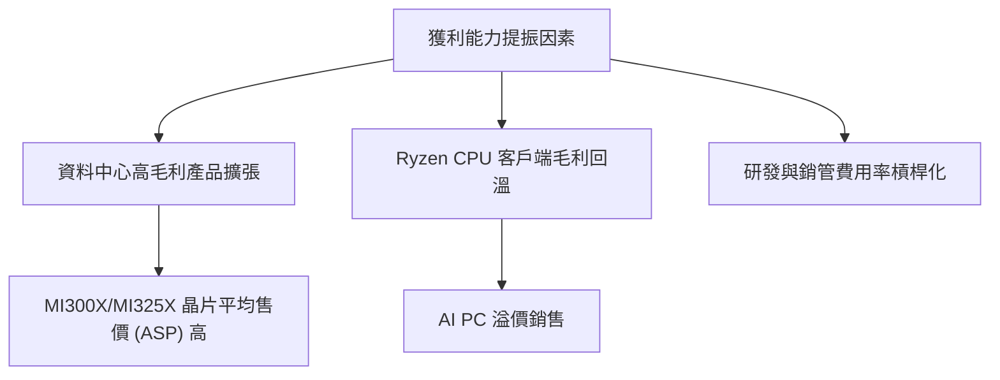

---

## 7. 估值深度分析

AMD 目前的估值呈現出極端的兩極分化：**Trailing P/E 極高，但 Forward P/E 處於合理區間**。這是一隻典型的高成長股在業績爆發前夕的估值特徵。

### 7.1 同業估值比較表格

為了更客觀評估 AMD 的估值，我們選取了 NVIDIA (NVDA) 與 Intel (INTC) 進行橫向對比：

| 估值與財務指標 | **AMD (本公司)** | **NVIDIA (NVDA)** | **Intel (INTC)** | 評估與對比結論 |
|----------|----------|---------|---------|-----------|
| **當前股價** | **$537.37** | $127.40 | $31.50 | - |
| **總市值** | **$876.24B** | $3,120.00B | $135.00B | AMD 市值已達 Intel 的 6.5 倍，但僅為 NVIDIA 的 28%。🟡 |
| **Trailing P/E** | **179.7x** | 68.5x | 32.1x | 🔴 表面估值極高，主要受 Xilinx 攤銷壓低 GAAP 淨利影響。 |
| **Forward P/E** | **41.0x** | 32.5x | 18.2x | 🟡 溢價合理。反映市場對 AMD FWD EPS $13.10 的強烈預期。 |
| **P/S Ratio** | **23.4x** | 31.2x | 2.4x | 🟡 略低於 NVIDIA，但遠高於 Intel，反映高毛利軟硬體屬性。 |
| **EV / EBITDA** | **110.2x** | 48.6x | 12.4x | 🔴 估值偏高，需要未來兩年 EBITDA 翻倍來消化。 |
| **PEG Ratio** | **1.29** | 1.15 | 2.10 | 🟢 考量到 62.7% 的預期盈餘成長率，PEG 僅 1.29，極具性價比。 |

### 7.2 歷史估值區間分析

過去 5 年，AMD 的 P/E 估值區間主要介於 30x 至 150x 之間（Non-GAAP）。當前股價對應的 Forward P/E 為 41.0x，處於歷史估值區間的中上緣，但考量到 AI 的範式轉移，此估值溢價具有基本面支撐。

```
╔══════════════════════════════════════════════════════════════════╗
║               AMD Forward P/E 歷史區間與當前位置                 ║
╠══════════════════════════════════════════════════════════════════╣
║                                                                  ║
║  歷史低點： 22.0x   █████                                        ║
║  歷史均值： 35.0x   ████████                                     ║
║  當前位置： 41.0x   ██████████  ← [當前位置]                     ║
║  歷史高點： 65.0x   ███████████████                              ║
║                                                                  ║
║  📊 評估：當前估值略高於歷史均值，但並未進入泡沫區。              ║
╚══════════════════════════════════════════════════════════════════╝
```

### 7.3 DCF 敏感性分析（6格目標價矩陣）

基於兩階段折現模型（DCF），假設基準 FCF 成長率為 25%（前5年），終端成長率為 3.5%，我們對 WACC 與永續成長率進行敏感性分析，得出以下每股價值矩陣：

| 永續成長率 (g) \ WACC | **11.0%** | **12.0% (基準)** | **13.0%** |
|------|--------------|----------------------|--------------|
| **4.0% (樂觀)** | **$612.00** (+13.9%) | **$545.00** (+1.4%) | **$485.00** (-9.7%) |
| **3.5% (基準)** | **$575.00** (+7.0%) | **$510.00** (-5.1%)  | **$452.00** (-15.9%) |
| **3.0% (悲觀)** | **$538.00** (+0.1%) | **$478.00** (-11.0%) | **$422.00** (-21.5%) |

*註：括號內百分比為相較於當前股價 $537.37 的隱含漲跌幅。*

### 7.4 估值綜合區間

```
╔══════════════════════════════════════════════════════════════════╗
║                    AMD 估值綜合區間導航                          ║
╠══════════════════════════════════════════════════════════════════╣
║                                                                  ║
║  [最低目標]  $225.00 ─── [基準 DCF] $510.00 ─── [最高目標] $665.00║
║                                                                  ║
║  當前股價：$537.37 處於基準估值附近。                            ║
║  這意味著當前股價已基本反映了 2026 年的成長預期，                ║
║  未來的超額收益將高度依賴於 AI 業務能否「超預期」交付。          ║
╚══════════════════════════════════════════════════════════════════╝
```

---

## 8. 成長催化劑

AMD 未來 12-24 個月的成長動能將由產品線的全面升級與市場需求的復甦共同驅動。

### 8.1 催化劑時間軸

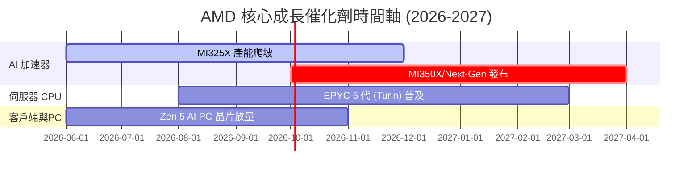

### 8.2 TAM（潛在市場規模）分析

